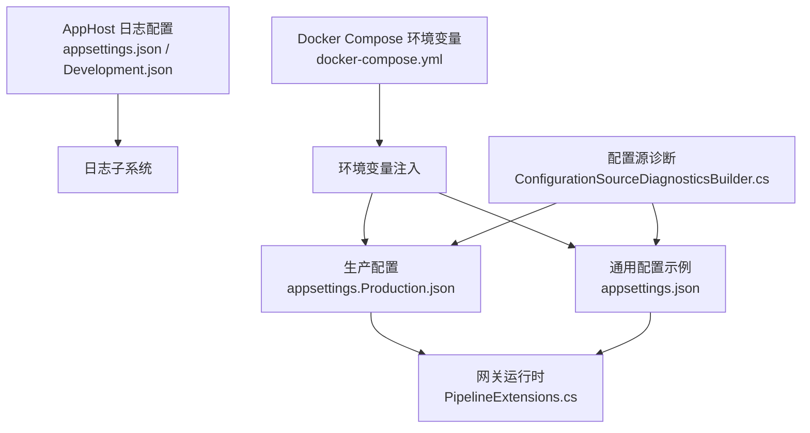
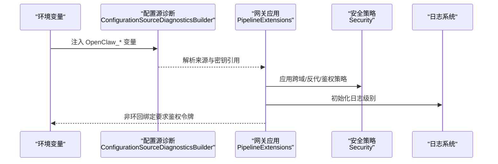
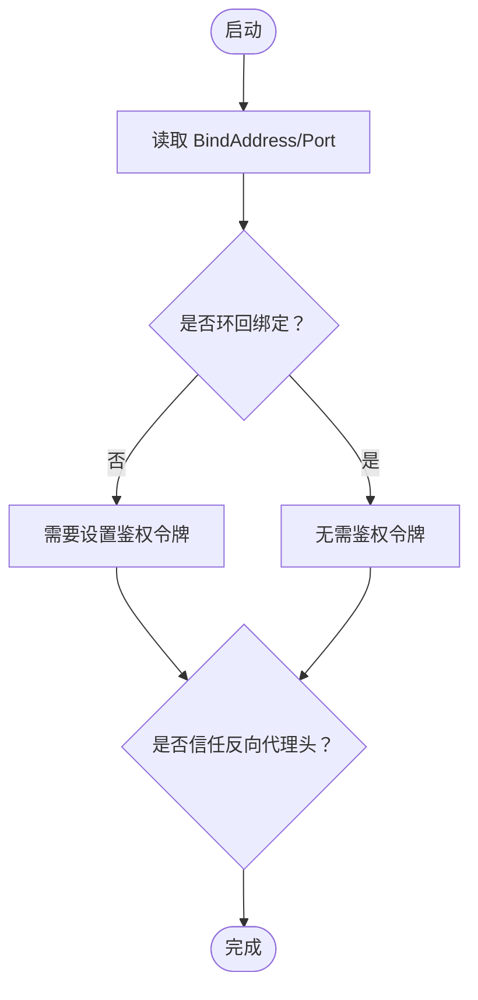
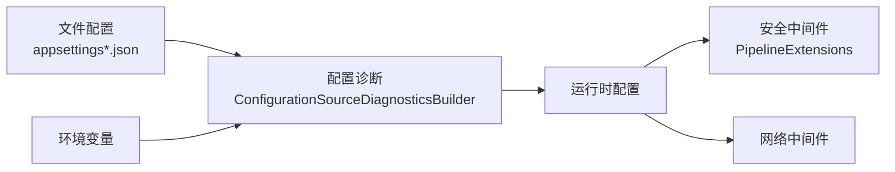

# 基础配置

<cite>
**本文引用的文件**
- [appsettings.Production.json](file://src/OpenClaw.Gateway/appsettings.Production.json)
- [appsettings.json](file://src/OpenClaw.Gateway/appsettings.json)
- [appsettings.json（AppHost）](file://Kingcrab.AppHost/appsettings.json)
- [appsettings.Development.json（AppHost）](file://Kingcrab.AppHost/appsettings.Development.json)
- [docker-compose.yml](file://docker-compose.yml)
- [GatewaySetupArtifacts.cs](file://src/OpenClaw.Core/Setup/GatewaySetupArtifacts.cs)
- [InitCommand.cs](file://src/OpenClaw.Cli/InitCommand.cs)
- [README.md](file://README.md)
- [PipelineExtensions.cs](file://src/OpenClaw.Gateway/Pipeline/PipelineExtensions.cs)
- [BindAddressClassifier.cs](file://src/OpenClaw.Core/Security/BindAddressClassifier.cs)
- [ConfigurationSourceDiagnosticsBuilder.cs](file://src/OpenClaw.Gateway/Bootstrap/ConfigurationSourceDiagnosticsBuilder.cs)
- [ManagedGatewayServiceTests.cs](file://src/OpenClaw.Tests/ManagedGatewayServiceTests.cs)
</cite>

## 目录
1. [简介](#简介)
2. [项目结构](#项目结构)
3. [核心组件](#核心组件)
4. [架构总览](#架构总览)
5. [详细组件分析](#详细组件分析)
6. [依赖关系分析](#依赖关系分析)
7. [性能考量](#性能考量)
8. [故障排查指南](#故障排查指南)
9. [结论](#结论)
10. [附录](#附录)

## 简介
本指南聚焦于生产环境的基础配置，系统性说明以下内容：
- 生产配置文件结构与默认值：重点解析 appsettings.Production.json 的关键节点与默认行为
- 绑定地址与端口：如何在配置与环境变量中设置监听地址与端口，并理解环回与非环回绑定的安全差异
- 日志级别：如何通过配置与环境变量控制日志输出
- 基本安全配置：鉴权令牌、跨域、反向代理信任、插件桥接与工具链限制等
- 环境变量配置：MODEL_PROVIDER_KEY、OPENCLAW_AUTH_TOKEN 等必需参数的来源与覆盖方式
- 不同部署场景的模板与最佳实践：容器化、反向代理、本地开发与生产

## 项目结构
生产配置主要位于网关项目中，同时涉及 AppHost 的日志配置以及 Docker Compose 的环境变量注入。下图展示与“基础配置”直接相关的文件与角色：

图表来源
- [appsettings.Production.json:1-65](file://src/OpenClaw.Gateway/appsettings.Production.json#L1-L65)
- [appsettings.json:1-908](file://src/OpenClaw.Gateway/appsettings.json#L1-L908)
- [appsettings.json（AppHost）:1-9](file://Kingcrab.AppHost/appsettings.json#L1-L9)
- [appsettings.Development.json（AppHost）:1-8](file://Kingcraw.AppHost/appsettings.Development.json#L1-L8)
- [docker-compose.yml:1-68](file://docker-compose.yml#L1-L68)
- [PipelineExtensions.cs:91-127](file://src/OpenClaw.Gateway/Pipeline/PipelineExtensions.cs#L91-L127)
- [ConfigurationSourceDiagnosticsBuilder.cs:121-161](file://src/OpenClaw.Gateway/Bootstrap/ConfigurationSourceDiagnosticsBuilder.cs#L121-L161)

章节来源
- [appsettings.Production.json:1-65](file://src/OpenClaw.Gateway/appsettings.Production.json#L1-L65)
- [appsettings.json:1-908](file://src/OpenClaw.Gateway/appsettings.json#L1-L908)
- [appsettings.json（AppHost）:1-9](file://Kingcrab.AppHost/appsettings.json#L1-L9)
- [appsettings.Development.json（AppHost）:1-8](file://Kingcrab.AppHost/appsettings.Development.json#L1-L8)
- [docker-compose.yml:1-68](file://docker-compose.yml#L1-L68)

## 核心组件
- 绑定与端口：OpenClaw.BindAddress 与 OpenClaw.Port 控制监听地址与端口；非环回绑定需要鉴权令牌
- 安全策略：OpenClaw.Security 下的多项开关与白名单，用于跨域、反向代理信任、工具与插件桥接限制
- 工具与插件：OpenClaw.Tooling 与 OpenClaw.Plugins 控制工具执行范围与插件启用状态
- 记忆与会话：OpenClaw.Memory、并发与超时参数保障稳定性
- 日志：Logging.LogLevel 控制默认与特定命名空间的日志级别

章节来源
- [appsettings.Production.json:1-65](file://src/OpenClaw.Gateway/appsettings.Production.json#L1-L65)
- [appsettings.json:1-908](file://src/OpenClaw.Gateway/appsettings.json#L1-L908)
- [README.md:277-298](file://README.md#L277-L298)

## 架构总览
下图展示生产配置在启动流程中的作用与影响路径：

图表来源
- [ConfigurationSourceDiagnosticsBuilder.cs:121-161](file://src/OpenClaw.Gateway/Bootstrap/ConfigurationSourceDiagnosticsBuilder.cs#L121-L161)
- [PipelineExtensions.cs:91-127](file://src/OpenClaw.Gateway/Pipeline/PipelineExtensions.cs#L91-L127)
- [README.md:277-298](file://README.md#L277-L298)

## 详细组件分析

### 生产配置文件结构与默认值
- OpenClaw.BindAddress 与 OpenClaw.Port：默认为 0.0.0.0 与 18789，适合容器化与公网暴露
- Llm：默认提供者与模型、超时、重试、熔断阈值与冷却时间
- Memory：内存存储路径、历史轮次、缓存会话数与压缩阈值
- Security：跨域白名单、是否信任反向代理头、代理列表、非环回绑定下的安全开关
- WebSocket：消息大小、连接上限、每IP并发、速率限制与接收超时
- Tooling：是否允许 shell、只读模式、读写根目录、工具超时
- Plugins：默认禁用，避免非预期的外部桥接
- MaxConcurrentSessions 与 SessionTimeoutMinutes：并发与会话超时
- Logging：默认与特定命名空间的日志级别

章节来源
- [appsettings.Production.json:1-65](file://src/OpenClaw.Gateway/appsettings.Production.json#L1-L65)

### 绑定地址与端口
- 配置项：OpenClaw.BindAddress 与 OpenClaw.Port
- 环回 vs 非环回：
  - 环回绑定（如 127.0.0.1 或 ::1）默认无需鉴权令牌
  - 非环回绑定（如 0.0.0.0 或 ::）必须设置鉴权令牌（见“安全配置”）
- 环境变量覆盖：
  - 支持通过环境变量 OpenClaw__BindAddress 与 OpenClaw__Port 覆盖
  - Docker Compose 中示例使用 OpenClaw__BindAddress=0.0.0.0 与 OpenClaw__Port=18789
- 自动可达基地址：
  - 当 BindAddress 为 0.0.0.0/::/[::] 时，内部会生成 http://127.0.0.1:端口 作为本地可达地址
  - IPv6 地址需加方括号

图表来源
- [BindAddressClassifier.cs:1-18](file://src/OpenClaw.Core/Security/BindAddressClassifier.cs#L1-L18)
- [README.md:277-298](file://README.md#L277-L298)
- [ManagedGatewayServiceTests.cs:38-77](file://src/OpenClaw.Tests/ManagedGatewayServiceTests.cs#L38-L77)

章节来源
- [appsettings.Production.json:1-65](file://src/OpenClaw.Gateway/appsettings.Production.json#L1-L65)
- [appsettings.json:1-908](file://src/OpenClaw.Gateway/appsettings.json#L1-L908)
- [docker-compose.yml:21-31](file://docker-compose.yml#L21-L31)
- [README.md:277-298](file://README.md#L277-L298)
- [ManagedGatewayServiceTests.cs:38-77](file://src/OpenClaw.Tests/ManagedGatewayServiceTests.cs#L38-L77)

### 日志级别
- 通过 Logging.LogLevel 设置默认级别与特定命名空间（如 Microsoft.AspNetCore、AgentRuntime、SessionManager）
- AppHost 的 appsettings.json 与 appsettings.Development.json 提供开发与托管环境的日志建议
- 环境变量可覆盖 ASP.NET Core 配置键（双下划线分隔）

章节来源
- [appsettings.Production.json:56-63](file://src/OpenClaw.Gateway/appsettings.Production.json#L56-L63)
- [appsettings.json（AppHost）:1-9](file://Kingcrab.AppHost/appsettings.json#L1-L9)
- [appsettings.Development.json（AppHost）:1-8](file://Kingcrab.AppHost/appsettings.Development.json#L1-L8)
- [ConfigurationSourceDiagnosticsBuilder.cs:156-157](file://src/OpenClaw.Gateway/Bootstrap/ConfigurationSourceDiagnosticsBuilder.cs#L156-L157)

### 基本安全配置
- 鉴权令牌：
  - 非环回绑定必须设置 OpenClaw:AuthToken 或 OPENCLAW_AUTH_TOKEN
  - 推荐使用 Authorization: Bearer 方式
- 跨域与反向代理：
  - AllowedOrigins 白名单控制前端来源
  - TrustForwardedHeaders 与 KnownProxies 用于识别真实客户端 IP
- 工具与插件限制：
  - AllowUnsafeToolingOnPublicBind、AllowPluginBridgeOnPublicBind、AllowRawSecretRefsOnPublicBind 等开关
  - Plugins.Enabled 默认关闭，降低风险
- 浏览器会话与 OIDC：
  - BrowserSessionIdleMinutes、BrowserRememberDays、OidcAuthority/Audience 等

章节来源
- [appsettings.Production.json:22-30](file://src/OpenClaw.Gateway/appsettings.Production.json#L22-L30)
- [appsettings.json:82-102](file://src/OpenClaw.Gateway/appsettings.json#L82-L102)
- [README.md:277-298](file://README.md#L277-L298)
- [PipelineExtensions.cs:91-127](file://src/OpenClaw.Gateway/Pipeline/PipelineExtensions.cs#L91-L127)

### 环境变量配置方式
- 必需参数：
  - MODEL_PROVIDER_KEY：模型提供商密钥（示例中以 env: 引用）
  - OPENCLAW_AUTH_TOKEN：非环回绑定的鉴权令牌
  - OPENCLAW_WORKSPACE：工作区路径（文件工具与持久化）
- 其他常用：
  - OPENCLAW_MODEL、OPENCLAW_ENDPOINT：模型与端点覆盖
  - ASP.NET Core 环境变量：OpenClaw__BindAddress、OpenClaw__Port、OpenClaw__Security__TrustForwardedHeaders 等（双下划线分隔）
- 示例来源：
  - CLI 初始化生成 .env.example 模板
  - AppHost 与 Gateway 的 appsettings.json 展示了 env: 引用与默认值
  - Docker Compose 将必需变量注入容器

章节来源
- [InitCommand.cs:95-101](file://src/OpenClaw.Cli/InitCommand.cs#L95-L101)
- [GatewaySetupArtifacts.cs:7-18](file://src/OpenClaw.Core/Setup/GatewaySetupArtifacts.cs#L7-L18)
- [appsettings.json:1-908](file://src/OpenClaw.Gateway/appsettings.json#L1-L908)
- [docker-compose.yml:13-31](file://docker-compose.yml#L13-L31)

### 不同部署场景的基础配置模板与最佳实践
- 容器化（Docker Compose）
  - 映射端口 18789:18789，挂载 memory 与 workspace 卷
  - 必填环境变量：MODEL_PROVIDER_KEY、OPENCLAW_AUTH_TOKEN
  - 可选：OpenClaw__Tooling__AllowShell=false、OpenClaw__Plugins__Enabled=false
  - 反代场景：开启 TrustForwardedHeaders 并配置 KnownProxies
- 反向代理（Nginx/Caddy）
  - 在反代上终止 TLS，转发到 http://127.0.0.1:18789
  - 确保设置 X-Forwarded-For 与 X-Forwarded-Proto
- 本地开发
  - 使用环回绑定 127.0.0.1，可不设鉴权令牌
  - 通过环境变量覆盖 OpenClaw__BindAddress 与 OpenClaw__Port
- 生产加固
  - 关闭 Plugins 与 unsafe 工具
  - 严格 AllowedOrigins
  - 启用熔断与重试，合理设置会话并发与超时

章节来源
- [docker-compose.yml:1-68](file://docker-compose.yml#L1-L68)
- [README.md:277-298](file://README.md#L277-L298)
- [appsettings.Production.json:1-65](file://src/OpenClaw.Gateway/appsettings.Production.json#L1-L65)

## 依赖关系分析
- 配置来源与优先级：
  - 文件配置（appsettings.Production.json、appsettings.json）
  - 环境变量（OpenClaw__* 与 MODEL_PROVIDER_KEY 等）
  - 命令行与内存覆盖（诊断构建器可识别）
- 安全与网络中间件：
  - 反向代理头处理与 CORS 中间件依赖 Security 配置
- 绑定地址分类：
  - 环回/非环回判定影响鉴权策略与可达基地址生成

图表来源
- [ConfigurationSourceDiagnosticsBuilder.cs:121-161](file://src/OpenClaw.Gateway/Bootstrap/ConfigurationSourceDiagnosticsBuilder.cs#L121-L161)
- [PipelineExtensions.cs:91-127](file://src/OpenClaw.Gateway/Pipeline/PipelineExtensions.cs#L91-L127)

章节来源
- [ConfigurationSourceDiagnosticsBuilder.cs:121-161](file://src/OpenClaw.Gateway/Bootstrap/ConfigurationSourceDiagnosticsBuilder.cs#L121-L161)
- [PipelineExtensions.cs:91-127](file://src/OpenClaw.Gateway/Pipeline/PipelineExtensions.cs#L91-L127)

## 性能考量
- 并发与限流：WebSocket 与 Tooling 的连接上限、速率限制与工具超时应结合业务负载调整
- 熔断与重试：Llm 的重试次数与熔断阈值有助于提升稳定性
- 内存与会话：Memory 的缓存与压缩阈值、最大历史轮次影响资源占用
- 反代与 TLS：在反代层做压缩与缓存可减轻网关压力

## 故障排查指南
- 非环回绑定无鉴权令牌
  - 现象：无法访问或鉴权失败
  - 处理：设置 OPENCLAW_AUTH_TOKEN 或 OpenClaw:AuthToken，并使用 Authorization: Bearer
- 反向代理导致的客户端 IP 错误
  - 现象：日志显示代理 IP
  - 处理：开启 TrustForwardedHeaders 并配置 KnownProxies
- 跨域问题
  - 现象：浏览器报跨域错误
  - 处理：检查 AllowedOrigins 是否包含前端来源
- 端口冲突或不可达
  - 现象：容器无法启动或健康检查失败
  - 处理：确认 OpenClaw__Port 与映射端口一致；非环回绑定需确保可达基地址生成正确

章节来源
- [README.md:277-298](file://README.md#L277-L298)
- [PipelineExtensions.cs:91-127](file://src/OpenClaw.Gateway/Pipeline/PipelineExtensions.cs#L91-L127)
- [ManagedGatewayServiceTests.cs:38-77](file://src/OpenClaw.Tests/ManagedGatewayServiceTests.cs#L38-L77)

## 结论
生产环境的基础配置应围绕“安全、可控、可观测”展开：以严格的绑定与鉴权策略为基础，配合反向代理与 CORS 策略，最小化工具与插件权限，合理设置并发与超时，并通过日志与健康检查实现稳定运维。结合环境变量与容器编排，可在多场景下快速落地。

## 附录
- 快速对照清单
  - 绑定与端口：BindAddress/Port、OpenClaw__BindAddress/Port
  - 鉴权：AuthToken/OPENCLAW_AUTH_TOKEN、Authorization: Bearer
  - 安全：AllowedOrigins、TrustForwardedHeaders、KnownProxies、Plugins.Enabled
  - 工具与插件：Tooling.*、Plugins.*
  - 日志：Logging.LogLevel
  - 环境变量：MODEL_PROVIDER_KEY、OPENCLAW_WORKSPACE、OPENCLAW_MODEL、OPENCLAW_ENDPOINT