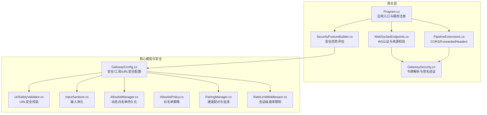
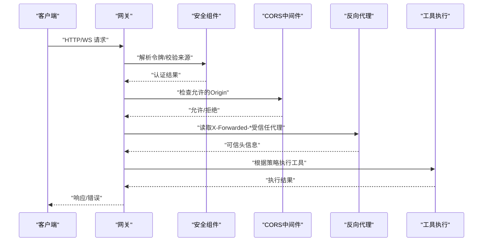
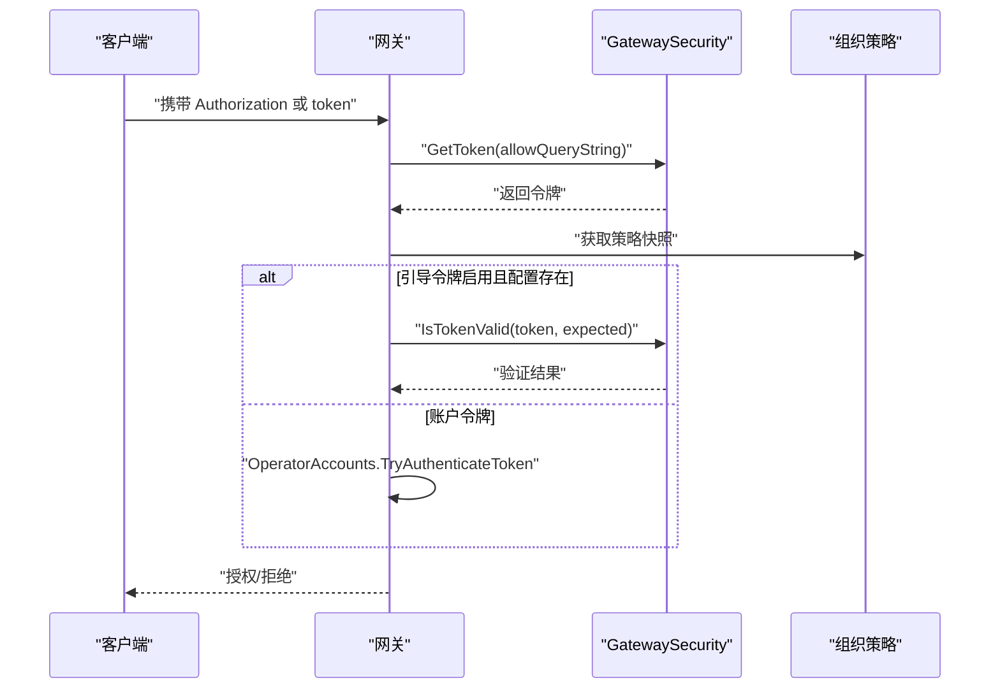
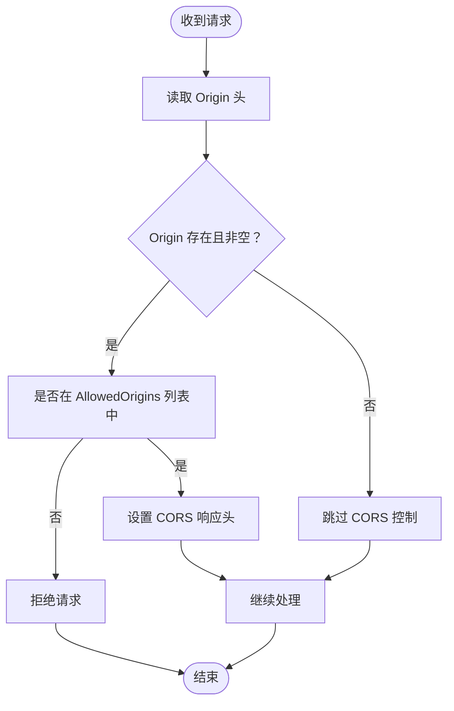
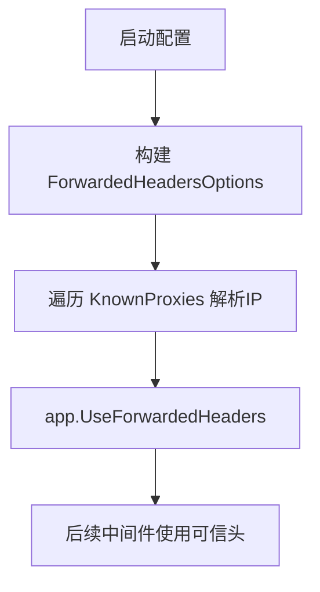
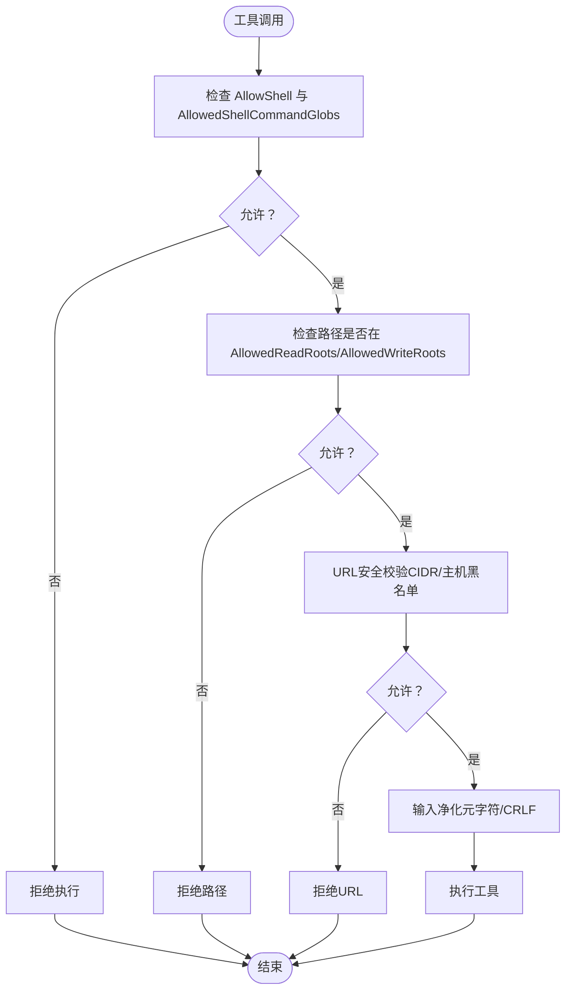
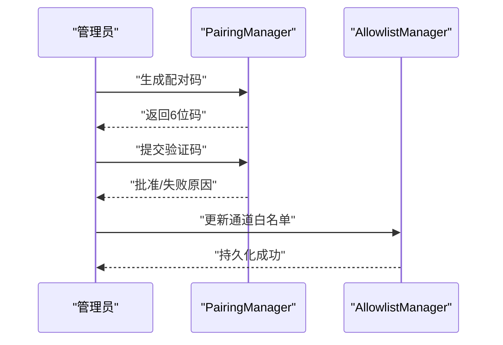
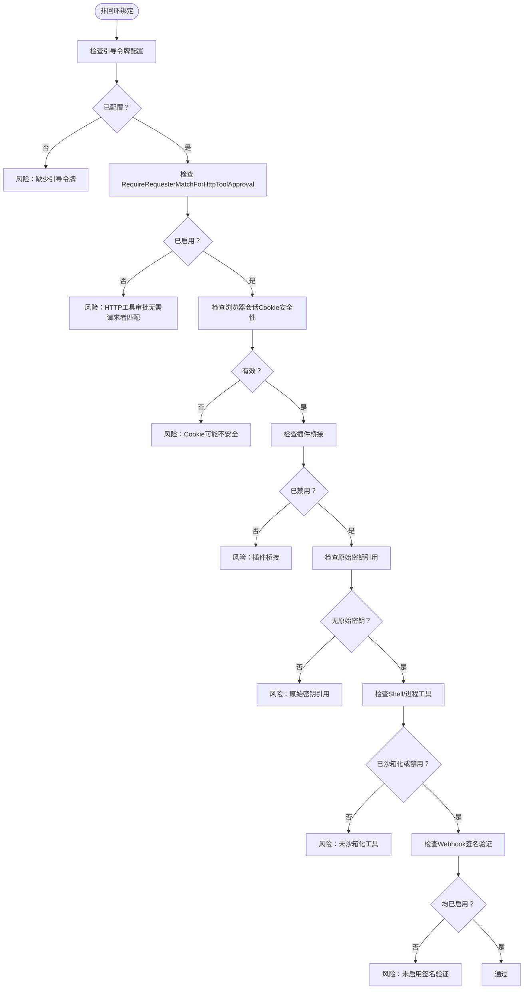
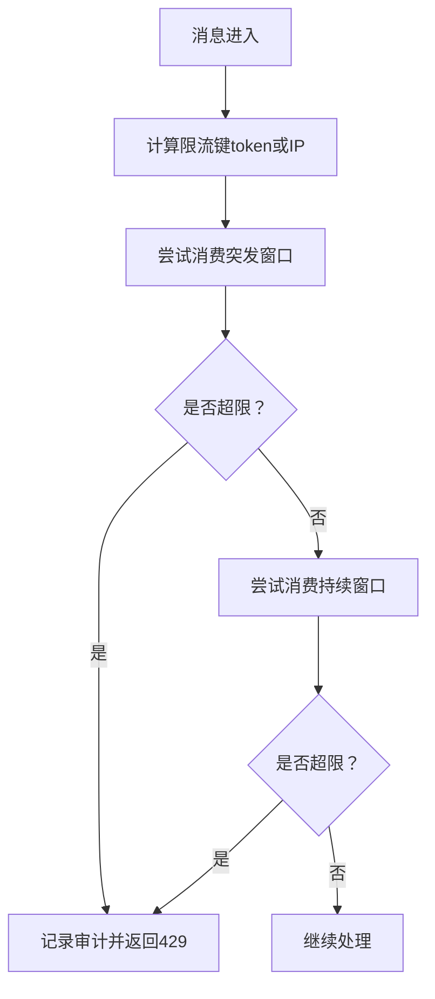
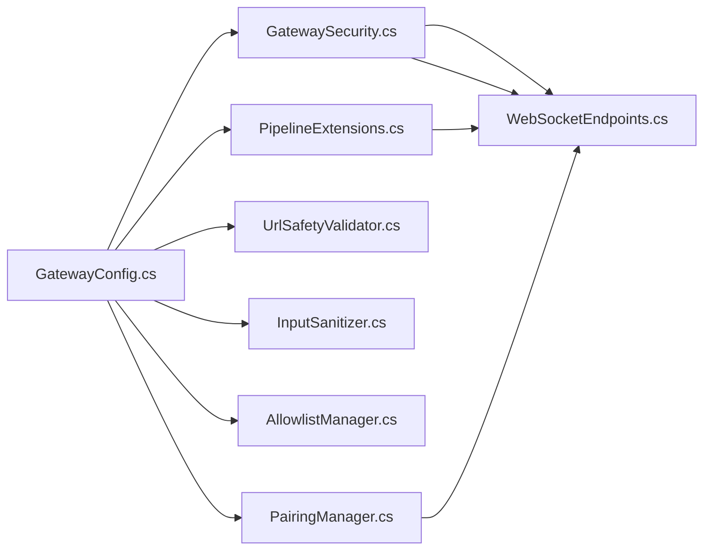

# 安全配置

<cite>
**本文档引用的文件**
- [appsettings.Production.json](file://src/OpenClaw.Gateway/appsettings.Production.json)
- [GatewaySecurity.cs](file://src/OpenClaw.Gateway/GatewaySecurity.cs)
- [WebSocketEndpoints.cs](file://src/OpenClaw.Gateway/Endpoints/WebSocketEndpoints.cs)
- [PipelineExtensions.cs](file://src/OpenClaw.Gateway/Pipeline/PipelineExtensions.cs)
- [Program.cs](file://src/OpenClaw.Gateway/Program.cs)
- [GatewayConfig.cs](file://src/OpenClaw.Core/Models/GatewayConfig.cs)
- [UrlSafetyValidator.cs](file://src/OpenClaw.Core/Security/UrlSafetyValidator.cs)
- [InputSanitizer.cs](file://src/OpenClaw.Core/Security/InputSanitizer.cs)
- [AllowlistManager.cs](file://src/OpenClaw.Core/Security/AllowlistManager.cs)
- [AllowlistPolicy.cs](file://src/OpenClaw.Core/Security/AllowlistPolicy.cs)
- [PairingManager.cs](file://src/OpenClaw.Core/Security/PairingManager.cs)
- [SecurityPostureBuilder.cs](file://src/OpenClaw.Gateway/SecurityPostureBuilder.cs)
- [RateLimitMiddleware.cs](file://src/OpenClaw.Core/Middleware/RateLimitMiddleware.cs)
- [TOOLS_GUIDE.md](file://docs/TOOLS_GUIDE.md)
- [GatewaySecurityTests.cs](file://src/OpenClaw.Tests/GatewaySecurityTests.cs)
- [GatewaySecurityHardeningTests.cs](file://src/OpenClaw.Tests/GatewaySecurityHardeningTests.cs)
</cite>

## 目录
1. [简介](#简介)
2. [项目结构](#项目结构)
3. [核心组件](#核心组件)
4. [架构总览](#架构总览)
5. [详细组件分析](#详细组件分析)
6. [依赖关系分析](#依赖关系分析)
7. [性能考虑](#性能考虑)
8. [故障排除指南](#故障排除指南)
9. [结论](#结论)
10. [附录](#附录)

## 简介
本指南面向生产环境部署，系统性阐述系统的安全配置与加固策略，覆盖认证令牌、反向代理信任、已知代理、CORS、IP白名单、网络访问控制、工具执行安全限制（Shell禁用、文件访问根目录限制）、速率限制与审计等关键主题，并提供最佳实践与常见配置示例，帮助在开放网络环境中安全运行。

## 项目结构
安全相关能力主要分布在以下模块：
- 配置模型：定义安全配置项与工具执行策略
- 网关启动与中间件：处理认证、CORS、反向代理头信任、速率限制
- 安全工具集：输入净化、URL安全校验、配对管理、白名单策略
- 文档与测试：提供生产基线配置与安全验证

**图表来源**
- [Program.cs:1-124](file://src/OpenClaw.Gateway/Program.cs#L1-L124)
- [PipelineExtensions.cs:91-127](file://src/OpenClaw.Gateway/Pipeline/PipelineExtensions.cs#L91-L127)
- [WebSocketEndpoints.cs:68-138](file://src/OpenClaw.Gateway/Endpoints/WebSocketEndpoints.cs#L68-L138)
- [GatewaySecurity.cs:1-109](file://src/OpenClaw.Gateway/GatewaySecurity.cs#L1-L109)
- [SecurityPostureBuilder.cs:1-169](file://src/OpenClaw.Gateway/SecurityPostureBuilder.cs#L1-L169)
- [GatewayConfig.cs:331-530](file://src/OpenClaw.Core/Models/GatewayConfig.cs#L331-L530)
- [UrlSafetyValidator.cs:1-219](file://src/OpenClaw.Core/Security/UrlSafetyValidator.cs#L1-L219)
- [InputSanitizer.cs:1-84](file://src/OpenClaw.Core/Security/InputSanitizer.cs#L1-L84)
- [AllowlistManager.cs:1-126](file://src/OpenClaw.Core/Security/AllowlistManager.cs#L1-L126)
- [AllowlistPolicy.cs:1-43](file://src/OpenClaw.Core/Security/AllowlistPolicy.cs#L1-L43)
- [PairingManager.cs:1-211](file://src/OpenClaw.Core/Security/ParingManager.cs#L1-L211)
- [RateLimitMiddleware.cs:1-93](file://src/OpenClaw.Core/Middleware/RateLimitMiddleware.cs#L1-L93)

**章节来源**
- [Program.cs:1-124](file://src/OpenClaw.Gateway/Program.cs#L1-L124)
- [appsettings.Production.json:1-65](file://src/OpenClaw.Gateway/appsettings.Production.json#L1-L65)

## 核心组件
- 安全配置模型：集中定义安全策略，包括严格公共绑定预设、允许查询字符串令牌、允许的CORS来源、信任转发头、已知代理、HTTP工具审批请求者匹配、公共绑定下工具执行安全开关等。
- 认证与令牌：支持从 Authorization 头或可选查询参数提取 Bearer 令牌；提供恒时长比较以抵御时序攻击；支持多种认证模式（引导令牌、账户令牌）。
- CORS 与来源校验：基于允许列表精确控制跨域来源，支持预检缓存与 Vary 头。
- 反向代理信任与已知代理：仅在明确配置的代理 IP 列表上信任 X-Forwarded-* 头，避免伪造协议与客户端 IP。
- URL 安全与输入净化：阻止私有/元数据网络目标，支持 CIDR 黑名单；对工具输入进行 Shell 元字符检测与 CRLF 清理。
- 动态白名单与配对：按通道维度持久化白名单，支持管理员批准/撤销；提供固定时间比较的配对码机制。
- 速率限制：会话级消息速率限制与操作级（IP/令牌）限流策略。
- 安全态势评估：在非回环绑定场景下自动检查风险项并给出加固建议。

**章节来源**
- [GatewayConfig.cs:331-384](file://src/OpenClaw.Core/Models/GatewayConfig.cs#L331-L384)
- [GatewaySecurity.cs:13-76](file://src/OpenClaw.Gateway/GatewaySecurity.cs#L13-L76)
- [PipelineExtensions.cs:108-127](file://src/OpenClaw.Gateway/Pipeline/PipelineExtensions.cs#L108-L127)
- [UrlSafetyValidator.cs:17-135](file://src/OpenClaw.Core/Security/UrlSafetyValidator.cs#L17-L135)
- [InputSanitizer.cs:9-83](file://src/OpenClaw.Core/Security/InputSanitizer.cs#L9-L83)
- [AllowlistManager.cs:19-126](file://src/OpenClaw.Core/Security/AllowlistManager.cs#L19-L126)
- [PairingManager.cs:14-211](file://src/OpenClaw.Core/Security/ParingManager.cs#L14-L211)
- [RateLimitMiddleware.cs:10-93](file://src/OpenClaw.Core/Middleware/RateLimitMiddleware.cs#L10-L93)
- [SecurityPostureBuilder.cs:11-139](file://src/OpenClaw.Gateway/SecurityPostureBuilder.cs#L11-L139)

## 架构总览
生产环境安全架构围绕“最小权限+纵深防御”设计，通过配置驱动的安全策略、严格的认证与来源校验、可信代理链路、工具执行限制与可观测性告警共同构成。

**图表来源**
- [WebSocketEndpoints.cs:68-138](file://src/OpenClaw.Gateway/Endpoints/WebSocketEndpoints.cs#L68-L138)
- [PipelineExtensions.cs:91-127](file://src/OpenClaw.Gateway/Pipeline/PipelineExtensions.cs#L91-L127)
- [GatewaySecurity.cs:13-76](file://src/OpenClaw.Gateway/GatewaySecurity.cs#L13-L76)

## 详细组件分析

### 认证与令牌
- 令牌来源优先级：Authorization 头 > 查询参数（需显式允许）
- 恒时长比较：防止时序攻击，避免泄露令牌长度信息
- 支持多模式：引导令牌与账户令牌，结合组织策略快照
- 签名验证：支持 sha256 hex 签名，兼容带前缀格式

**图表来源**
- [GatewaySecurity.cs:13-76](file://src/OpenClaw.Gateway/GatewaySecurity.cs#L13-L76)
- [WebSocketEndpoints.cs:96-118](file://src/OpenClaw.Gateway/Endpoints/WebSocketEndpoints.cs#L96-L118)
- [GatewaySecurityTests.cs:9-65](file://src/OpenClaw.Tests/GatewaySecurityTests.cs#L9-L65)

**章节来源**
- [GatewaySecurity.cs:13-76](file://src/OpenClaw.Gateway/GatewaySecurity.cs#L13-L76)
- [WebSocketEndpoints.cs:96-118](file://src/OpenClaw.Gateway/Endpoints/WebSocketEndpoints.cs#L96-L118)
- [GatewaySecurityTests.cs:9-65](file://src/OpenClaw.Tests/GatewaySecurityTests.cs#L9-L65)

### CORS 与来源控制
- 基于允许列表精确匹配 Origin
- 对预检请求设置合理缓存与 Vary 头
- 未配置允许列表时不启用 CORS 中间件

**图表来源**
- [PipelineExtensions.cs:108-127](file://src/OpenClaw.Gateway/Pipeline/PipelineExtensions.cs#L108-L127)
- [WebSocketEndpoints.cs:120-138](file://src/OpenClaw.Gateway/Endpoints/WebSocketEndpoints.cs#L120-L138)

**章节来源**
- [PipelineExtensions.cs:108-127](file://src/OpenClaw.Gateway/Pipeline/PipelineExtensions.cs#L108-L127)
- [WebSocketEndpoints.cs:120-138](file://src/OpenClaw.Gateway/Endpoints/WebSocketEndpoints.cs#L120-L138)

### 反向代理信任与已知代理
- 仅在 KnownProxies 明确配置的 IP 上信任 X-Forwarded-For 与 X-Forwarded-Proto
- ForwardLimit 设为 1，降低头部污染风险
- 结合 TrustForwardedHeaders 决定浏览器会话 Cookie Secure 属性的有效性

**图表来源**
- [PipelineExtensions.cs:91-106](file://src/OpenClaw.Gateway/Pipeline/PipelineExtensions.cs#L91-L106)
- [SecurityPostureBuilder.cs:19](file://src/OpenClaw.Gateway/SecurityPostureBuilder.cs#L19)

**章节来源**
- [PipelineExtensions.cs:91-106](file://src/OpenClaw.Gateway/Pipeline/PipelineExtensions.cs#L91-L106)
- [SecurityPostureBuilder.cs:19](file://src/OpenClaw.Gateway/SecurityPostureBuilder.cs#L19)

### 工具执行安全限制
- Shell 禁用与命令白名单：默认允许所有命令，可通过通配符与禁止路径规则限制
- 文件访问根目录限制：只允许在指定根目录内读写，支持工作区模式
- URL 安全策略：阻止私有/元数据网络目标，支持 CIDR 黑名单
- 输入净化：检测 Shell 元字符与 CRLF 注入风险
- 浏览器工具：可选择禁用或限制本地执行后端

**图表来源**
- [GatewayConfig.cs:412-457](file://src/OpenClaw.Core/Models/GatewayConfig.cs#L412-L457)
- [UrlSafetyValidator.cs:17-135](file://src/OpenClaw.Core/Security/UrlSafetyValidator.cs#L17-L135)
- [InputSanitizer.cs:9-83](file://src/OpenClaw.Core/Security/InputSanitizer.cs#L9-L83)

**章节来源**
- [GatewayConfig.cs:412-457](file://src/OpenClaw.Core/Models/GatewayConfig.cs#L412-L457)
- [UrlSafetyValidator.cs:17-135](file://src/OpenClaw.Core/Security/UrlSafetyValidator.cs#L17-L135)
- [InputSanitizer.cs:9-83](file://src/OpenClaw.Core/Security/InputSanitizer.cs#L9-L83)

### IP 白名单与通道配对
- 动态白名单：按通道持久化允许的发送方列表，支持增删改查
- 配对流程：生成临时配对码，固定时间比较校验，失败冷却，手动批准/撤销
- 白名单策略：支持严格与传统语义，空列表在传统语义下视为放行

**图表来源**
- [PairingManager.cs:53-124](file://src/OpenClaw.Core/Security/ParingManager.cs#L53-L124)
- [AllowlistManager.cs:32-115](file://src/OpenClaw.Core/Security/AllowlistManager.cs#L32-L115)

**章节来源**
- [PairingManager.cs:14-211](file://src/OpenClaw.Core/Security/ParingManager.cs#L14-L211)
- [AllowlistManager.cs:19-126](file://src/OpenClaw.Core/Security/AllowlistManager.cs#L19-L126)
- [AllowlistPolicy.cs:9-43](file://src/OpenClaw.Core/Security/AllowlistPolicy.cs#L9-L43)

### 网络访问控制与安全加固
- 严格公共绑定预设：非回环绑定时强制更严格的安全与审批策略
- 公共绑定风险检查：缺少引导令牌、未启用请求者匹配审批、浏览器会话 Cookie 安全性不足、插件桥接、原始密钥引用、未沙箱化的 Shell/进程工具、未启用签名验证的 Webhook 等
- 生产基线建议：只读锁定、要求工具审批、禁用 Shell、工作区模式、严格的审批工具清单

**图表来源**
- [SecurityPostureBuilder.cs:27-97](file://src/OpenClaw.Gateway/SecurityPostureBuilder.cs#L27-L97)

**章节来源**
- [SecurityPostureBuilder.cs:11-139](file://src/OpenClaw.Gateway/SecurityPostureBuilder.cs#L11-L139)
- [GatewaySecurityHardeningTests.cs:171-202](file://src/OpenClaw.Tests/GatewaySecurityHardeningTests.cs#L171-L202)
- [TOOLS_GUIDE.md:288-325](file://docs/TOOLS_GUIDE.md#L288-L325)

### 速率限制与可观测性
- 会话级速率限制：每通道/发送方每分钟消息数限制，超限短路提示
- 操作级限流：基于 IP 或令牌键控的突发/持续窗口限流策略
- 运行时可观测性：安全态势报告包含风险标志与加固建议

**图表来源**
- [RateLimitMiddleware.cs:39-68](file://src/OpenClaw.Core/Middleware/RateLimitMiddleware.cs#L39-L68)
- [EndpointHelpers.cs:145-157](file://src/OpenClaw.Gateway/Endpoints/EndpointHelpers.cs#L145-L157)

**章节来源**
- [RateLimitMiddleware.cs:10-93](file://src/OpenClaw.Core/Middleware/RateLimitMiddleware.cs#L10-L93)
- [EndpointHelpers.cs:145-157](file://src/OpenClaw.Gateway/Endpoints/EndpointHelpers.cs#L145-L157)

## 依赖关系分析
- 配置驱动：所有安全行为由 GatewayConfig 的 Security/Tooling/UrlSafety 等子配置决定
- 组件耦合：网关启动顺序确保安全中间件在路由映射之前注册，保证全局生效
- 外部集成：Webhook 通道（Twilio/Telegram/Teams/Slack/Discord）需要启用签名验证

**图表来源**
- [GatewayConfig.cs:331-530](file://src/OpenClaw.Core/Models/GatewayConfig.cs#L331-L530)
- [GatewaySecurity.cs:1-109](file://src/OpenClaw.Gateway/GatewaySecurity.cs#L1-L109)
- [PipelineExtensions.cs:91-127](file://src/OpenClaw.Gateway/Pipeline/PipelineExtensions.cs#L91-L127)
- [WebSocketEndpoints.cs:68-138](file://src/OpenClaw.Gateway/Endpoints/WebSocketEndpoints.cs#L68-L138)
- [UrlSafetyValidator.cs:1-219](file://src/OpenClaw.Core/Security/UrlSafetyValidator.cs#L1-L219)
- [InputSanitizer.cs:1-84](file://src/OpenClaw.Core/Security/InputSanitizer.cs#L1-L84)
- [AllowlistManager.cs:1-126](file://src/OpenClaw.Core/Security/AllowlistManager.cs#L1-L126)
- [PairingManager.cs:1-211](file://src/OpenClaw.Core/Security/ParingManager.cs#L1-L211)

**章节来源**
- [Program.cs:67-91](file://src/OpenClaw.Gateway/Program.cs#L67-L91)
- [GatewayConfig.cs:331-530](file://src/OpenClaw.Core/Models/GatewayConfig.cs#L331-L530)

## 性能考虑
- 恒时长比较与固定时间配对码比较：避免时序泄漏，开销极低
- DNS 解析与 CIDR 匹配：URL 安全校验涉及 DNS 查询与地址族转换，建议在高并发场景下缓存域名解析结果
- 会话级速率限制：基于内存队列与时间戳，内存占用与清理频率可调
- 反向代理信任：仅在 KnownProxies 列表上信任头，避免不必要的解析与转换

## 故障排除指南
- 令牌无效或被拒绝
  - 确认 Authorization 头格式正确（Bearer 前缀）
  - 若启用查询参数令牌，检查 AllowQueryStringToken 是否开启
  - 核对组织策略中的允许认证模式与引导令牌配置
  - 参考测试用例验证行为
- CORS 跨域失败
  - 确认请求头 Origin 在 AllowedOrigins 列表中
  - 检查是否正确配置了允许的方法、头与缓存时间
- 反向代理导致的协议/IP 错误
  - 在 KnownProxies 中添加代理 IP
  - 启用 TrustForwardedHeaders 并确保代理正确传递 X-Forwarded-Proto/X-Forwarded-For
- 工具执行被拒绝
  - 检查 AllowShell 与 AllowedShellCommandGlobs
  - 确认路径在 AllowedReadRoots/AllowedWriteRoots 或启用工作区模式
  - 审核 URL 安全策略与输入净化规则
- 公共绑定启动失败
  - 遵循安全态势评估的风险提示，补齐缺失的安全配置
  - 对 Webhook 通道启用签名验证，替换原始密钥引用为环境变量引用

**章节来源**
- [GatewaySecurityTests.cs:9-65](file://src/OpenClaw.Tests/GatewaySecurityTests.cs#L9-L65)
- [GatewaySecurityHardeningTests.cs:171-202](file://src/OpenClaw.Tests/GatewaySecurityHardeningTests.cs#L171-L202)
- [SecurityPostureBuilder.cs:27-97](file://src/OpenClaw.Gateway/SecurityPostureBuilder.cs#L27-L97)

## 结论
通过配置驱动的安全策略、严格的认证与来源控制、可信代理链路、工具执行限制与动态白名单/配对机制，以及完善的速率限制与可观测性，系统能够在生产环境中实现“最小权限、纵深防御”的安全目标。建议在非回环绑定场景下启用严格公共绑定预设，并遵循安全态势评估的加固建议，确保令牌、代理、工具与网络访问均处于受控状态。

## 附录

### 生产环境安全配置要点
- 认证令牌
  - 强制使用 Authorization 头传递 Bearer 令牌
  - 严格公共绑定场景下启用引导令牌与账户令牌双重认证
  - 禁止使用查询参数令牌（除非明确需要）
- 反向代理信任与已知代理
  - 在 KnownProxies 中精确列出代理 IP
  - 启用 TrustForwardedHeaders，确保浏览器会话 Cookie Secure 属性有效
- CORS
  - 明确 AllowedOrigins 列表，仅允许受信来源
  - 设置合理的预检缓存与 Vary 头
- 工具执行安全限制
  - 默认禁用 Shell，必要时使用命令白名单与禁止路径规则
  - 使用工作区模式限制文件访问根目录
  - 启用 URL 安全策略，阻止私有/元数据网络目标
- IP 白名单与通道配对
  - 使用动态白名单按通道管理允许发送方
  - 通过配对码流程实现人工批准与撤销
- 速率限制与可观测性
  - 配置会话级与操作级限流策略
  - 关注安全态势报告中的风险标志并及时修复

**章节来源**
- [appsettings.Production.json:22-30](file://src/OpenClaw.Gateway/appsettings.Production.json#L22-L30)
- [GatewayConfig.cs:331-384](file://src/OpenClaw.Core/Models/GatewayConfig.cs#L331-L384)
- [TOOLS_GUIDE.md:288-325](file://docs/TOOLS_GUIDE.md#L288-L325)