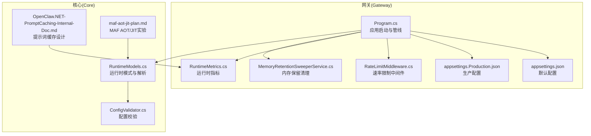
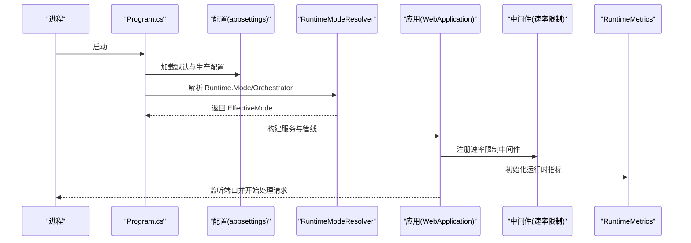
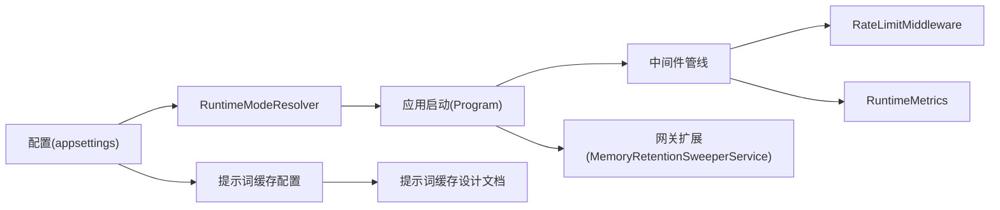

# 性能配置

<cite>
**本文引用的文件**
- [appsettings.Production.json](file://src/OpenClaw.Gateway/appsettings.Production.json)
- [appsettings.json](file://src/OpenClaw.Gateway/appsettings.json)
- [Program.cs](file://src/OpenClaw.Gateway/Program.cs)
- [RuntimeModels.cs](file://src/OpenClaw.Core/Models/RuntimeModels.cs)
- [RuntimeMetrics.cs](file://src/OpenClaw.Core/Observability/RuntimeMetrics.cs)
- [RateLimitMiddleware.cs](file://src/OpenClaw.Core/Middleware/RateLimitMiddleware.cs)
- [ConfigValidator.cs](file://src/OpenClaw.Core/Validation/ConfigValidator.cs)
- [MemoryRetentionSweeperService.cs](file://src/OpenClaw.Gateway/Extensions/MemoryRetentionSweeperService.cs)
- [OpenClaw.NET-PromptCaching-Internal-Doc.md](file://docs/OpenClaw.NET-PromptCaching-Internal-Doc.md)
- [maf-aot-jit-plan.md](file://docs/maf-aot-jit/maf-aot-jit-plan.md)
</cite>

## 目录
1. [简介](#简介)
2. [项目结构](#项目结构)
3. [核心组件](#核心组件)
4. [架构总览](#架构总览)
5. [详细组件分析](#详细组件分析)
6. [依赖关系分析](#依赖关系分析)
7. [性能考量](#性能考量)
8. [故障排查指南](#故障排查指南)
9. [结论](#结论)
10. [附录](#附录)

## 简介
本指南面向生产环境的性能调优，聚焦以下方面：
- AOT 与 JIT 运行时配置与选择
- 内存限制与会话并发控制
- 工具执行后端的性能优化与资源限制
- 缓存配置（提示词缓存、媒体缓存、会话缓存）
- 会话管理、内存回收与垃圾回收优化
- 性能监控指标、基准测试方法与容量规划建议

目标是在保障安全与稳定性的同时，最大化吞吐、降低延迟，并确保可观测性与可维护性。

## 项目结构
本项目的性能配置主要集中在网关启动与配置文件中，运行时模式与可观测性贯穿于核心模块与网关扩展中。关键位置如下：
- 运行时模式与启动入口：Program.cs、RuntimeModels.cs
- 生产配置与默认配置：appsettings.json、appsettings.Production.json
- 性能监控与中间件：RuntimeMetrics.cs、RateLimitMiddleware.cs
- 配置校验与约束：ConfigValidator.cs
- 内存保留与清理：MemoryRetentionSweeperService.cs
- 提示词缓存内部文档：OpenClaw.NET-PromptCaching-Internal-Doc.md
- MAF AOT/JIT 实验文档：maf-aot-jit-plan.md

图表来源
- [Program.cs:1-124](file://src/OpenClaw.Gateway/Program.cs#L1-L124)
- [appsettings.json:1-908](file://src/OpenClaw.Gateway/appsettings.json#L1-L908)
- [appsettings.Production.json:1-65](file://src/OpenClaw.Gateway/appsettings.Production.json#L1-L65)
- [RateLimitMiddleware.cs:1-93](file://src/OpenClaw.Core/Middleware/RateLimitMiddleware.cs#L1-L93)
- [RuntimeMetrics.cs:1-312](file://src/OpenClaw.Core/Observability/RuntimeMetrics.cs#L1-L312)
- [MemoryRetentionSweeperService.cs:37-77](file://src/OpenClaw.Gateway/Extensions/MemoryRetentionSweeperService.cs#L37-L77)
- [RuntimeModels.cs:1-69](file://src/OpenClaw.Core/Models/RuntimeModels.cs#L1-L69)
- [ConfigValidator.cs:96-265](file://src/OpenClaw.Core/Validation/ConfigValidator.cs#L96-L265)
- [OpenClaw.NET-PromptCaching-Internal-Doc.md:1-546](file://docs/OpenClaw.NET-PromptCaching-Internal-Doc.md#L1-L546)
- [maf-aot-jit-plan.md:1-172](file://docs/maf-aot-jit/maf-aot-jit-plan.md#L1-L172)

章节来源
- [Program.cs:1-124](file://src/OpenClaw.Gateway/Program.cs#L1-L124)
- [appsettings.json:1-908](file://src/OpenClaw.Gateway/appsettings.json#L1-L908)
- [appsettings.Production.json:1-65](file://src/OpenClaw.Gateway/appsettings.Production.json#L1-L65)

## 核心组件
- 运行时模式与解析：通过 RuntimeConfig 与 RuntimeModeResolver 决定 AOT/JIT 与 Orchestrator（native/maf），并在启动阶段解析生效模式。
- 配置校验：ConfigValidator 对关键阈值进行校验，确保内存压缩、保留策略、并发会话等参数合理。
- 速率限制中间件：RateLimitMiddleware 基于时间窗口与队列实现每连接/通道的消息速率限制。
- 运行时指标：RuntimeMetrics 提供细粒度计数器与仪表盘，便于监控与告警。
- 内存保留清理：MemoryRetentionSweeperService 定期清理过期会话与分支，控制存储占用。
- 提示词缓存：OpenClaw.NET-PromptCaching-Internal-Doc.md 描述了零侵入增强的缓存层，提升延迟与成本效益。
- AOT/JIT 实验：maf-aot-jit-plan.md 明确了在 AOT 与 JIT 下的实验矩阵与成功标准。

章节来源
- [RuntimeModels.cs:11-69](file://src/OpenClaw.Core/Models/RuntimeModels.cs#L11-L69)
- [ConfigValidator.cs:96-265](file://src/OpenClaw.Core/Validation/ConfigValidator.cs#L96-L265)
- [RateLimitMiddleware.cs:10-93](file://src/OpenClaw.Core/Middleware/RateLimitMiddleware.cs#L10-L93)
- [RuntimeMetrics.cs:10-312](file://src/OpenClaw.Core/Observability/RuntimeMetrics.cs#L10-L312)
- [MemoryRetentionSweeperService.cs:37-77](file://src/OpenClaw.Gateway/Extensions/MemoryRetentionSweeperService.cs#L37-L77)
- [OpenClaw.NET-PromptCaching-Internal-Doc.md:1-546](file://docs/OpenClaw.NET-PromptCaching-Internal-Doc.md#L1-L546)
- [maf-aot-jit-plan.md:1-172](file://docs/maf-aot-jit/maf-aot-jit-plan.md#L1-L172)

## 架构总览
下图展示了生产启动流程、运行时模式解析与关键性能配置点之间的关系。

图表来源
- [Program.cs:47-98](file://src/OpenClaw.Gateway/Program.cs#L47-L98)
- [RuntimeModels.cs:29-59](file://src/OpenClaw.Core/Models/RuntimeModels.cs#L29-L59)
- [RateLimitMiddleware.cs:39-68](file://src/OpenClaw.Core/Middleware/RateLimitMiddleware.cs#L39-L68)
- [RuntimeMetrics.cs:192-250](file://src/OpenClaw.Core/Observability/RuntimeMetrics.cs#L192-L250)

## 详细组件分析

### 运行时模式与 AOT/JIT 选择
- 配置项：OpenClaw:Runtime:Mode（auto/aot/jit）、OpenClaw:Runtime:Orchestrator（native/maf）
- 解析规则：
  - 若请求模式为 jit 且当前构建不支持动态代码，则抛出异常
  - auto 模式根据是否支持动态代码决定 AOT 或 JIT
  - 默认 Orchestrator 为 native；MAF 作为可选后端，需在 MAF 启用产物中使用
- 生产建议：
  - 在容器或发布制品中固定 Runtime.Mode 为 aot 或 jit，避免 auto 的不确定性
  - 通过环境变量或部署参数明确 Orchestrator，确保与制品匹配

章节来源
- [RuntimeModels.cs:11-69](file://src/OpenClaw.Core/Models/RuntimeModels.cs#L11-L69)
- [Program.cs:74-83](file://src/OpenClaw.Gateway/Program.cs#L74-L83)
- [maf-aot-jit-plan.md:78-99](file://docs/maf-aot-jit/maf-aot-jit-plan.md#L78-L99)

### 会话并发与速率限制
- 并发控制：
  - MaxConcurrentSessions：最大并发会话数
  - WebSocket:MaxConnections、MaxConnectionsPerIp、MessagesPerMinutePerConnection：连接与消息速率限制
- 速率限制中间件：
  - 基于每通道/发送者的时间窗口队列，超限直接短路
  - 支持空闲窗口清理，降低内存占用
- 生产建议：
  - 将 MaxConcurrentSessions 与硬件资源匹配，结合 Metrics 中 ActiveSessions 观察峰值
  - 合理设置 MessagesPerMinutePerConnection，避免突发流量导致拒绝

章节来源
- [appsettings.Production.json:52-53](file://src/OpenClaw.Gateway/appsettings.Production.json#L52-L53)
- [appsettings.json:103-109](file://src/OpenClaw.Gateway/appsettings.json#L103-L109)
- [RateLimitMiddleware.cs:10-93](file://src/OpenClaw.Core/Middleware/RateLimitMiddleware.cs#L10-L93)
- [RuntimeMetrics.cs:121-127](file://src/OpenClaw.Core/Observability/RuntimeMetrics.cs#L121-L127)

### 工具执行后端与资源限制
- 工具执行：
  - Tooling:ToolTimeoutSeconds：工具执行超时
  - Tooling:ParallelToolExecution：并行执行开关
  - Tooling:RequireToolApproval/ToolApprovalTimeoutSeconds：审批策略与超时
- 执行后端：
  - Execution:Profiles.*:TimeoutSeconds：后端执行超时
  - Sandbox:DefaultTTL、Tools.*.TTL：沙箱租期
- 生产建议：
  - 为高风险工具（shell、write_file）开启审批与白名单
  - 合理设置 ToolTimeoutSeconds 与 Execution 超时，避免长尾阻塞
  - 并行执行需考虑 CPU/IO 与外部服务限流

章节来源
- [appsettings.json:110-144](file://src/OpenClaw.Gateway/appsettings.json#L110-L144)
- [appsettings.json:232-253](file://src/OpenClaw.Gateway/appsettings.json#L232-L253)
- [appsettings.json:209-231](file://src/OpenClaw.Gateway/appsettings.json#L209-L231)

### 缓存配置与优化
- 提示词缓存（Prompt Caching）：
  - 开关与方言：Enabled、Dialect（auto/openai/anthropic/gemini/none）
  - 保留策略：Retention（none/short/long/auto）
  - 保活：KeepWarmEnabled、KeepWarmIntervalMinutes
  - 追踪：TraceEnabled、TraceFilePath
- 媒体缓存：
  - Multimodal:MediaCachePath：媒体缓存目录
- 会话缓存：
  - Memory:MaxCachedSessions：会话缓存上限
- 生产建议：
  - 在稳定系统提示词场景启用提示词缓存，结合 KeepWarm 降低后续延迟
  - 合理设置媒体缓存路径与权限，避免磁盘膨胀
  - 监控 PromptCacheReads/Writes 与 WarmRuns/WarmFailures

章节来源
- [appsettings.json:35-43](file://src/OpenClaw.Gateway/appsettings.json#L35-L43)
- [appsettings.json:329-361](file://src/OpenClaw.Gateway/appsettings.json#L329-L361)
- [appsettings.json:18-20](file://src/OpenClaw.Gateway/appsettings.json#L18-L20)
- [OpenClaw.NET-PromptCaching-Internal-Doc.md:340-404](file://docs/OpenClaw.NET-PromptCaching-Internal-Doc.md#L340-L404)

### 内存回收与垃圾回收优化
- 内存压缩与保留：
  - Memory:EnableCompaction、CompactionThreshold、CompactionKeepRecent
  - Memory:Retention.*：保留周期、清理间隔、归档路径与保留天数
- 清理服务：
  - MemoryRetentionSweeperService：定期扫描、归档与删除过期项
- 生产建议：
  - 合理设置 CompactionThreshold 与 MaxHistoryTurns 的相对关系，避免过度压缩
  - 提升 SweepIntervalMinutes 与 MaxItemsPerSweep，平衡清理成本与效果
  - 监控 RetentionSweepRuns/Failures 与 Archived/Deleted 数量

章节来源
- [appsettings.json:49-81](file://src/OpenClaw.Gateway/appsettings.json#L49-L81)
- [ConfigValidator.cs:96-111](file://src/OpenClaw.Core/Validation/ConfigValidator.cs#L96-L111)
- [MemoryRetentionSweeperService.cs:37-77](file://src/OpenClaw.Gateway/Extensions/MemoryRetentionSweeperService.cs#L37-L77)

### 性能监控指标与可观测性
- 运行时指标（RuntimeMetrics）：
  - 请求总量、LLM 调用、Token 统计、工具调用/失败/超时
  - 会话缓存命中/未命中、会话驱逐/容量拒绝
  - 浏览器取消重置、插件桥重启尝试/失败
  - 进程生命周期事件、沙箱租约、保留清理统计
  - 脉搏（Pulse）运行状态与持续时间
- 生产建议：
  - 将指标暴露至监控系统，设置告警阈值（如会话容量拒绝、保留清理失败）
  - 结合日志与分布式追踪，定位热点与瓶颈

章节来源
- [RuntimeMetrics.cs:10-312](file://src/OpenClaw.Core/Observability/RuntimeMetrics.cs#L10-L312)

## 依赖关系分析
- 运行时模式依赖于运行时特性检测与配置，错误配置会导致启动失败
- 速率限制中间件依赖于通道与发送者维度的状态，需要与会话管理协同
- 提示词缓存依赖于提供商能力与方言解析，需与 LLM 执行服务解耦
- 内存保留清理依赖于会话管理与存储实现，需关注并发一致性

图表来源
- [RuntimeModels.cs:29-59](file://src/OpenClaw.Core/Models/RuntimeModels.cs#L29-L59)
- [Program.cs:74-98](file://src/OpenClaw.Gateway/Program.cs#L74-L98)
- [RateLimitMiddleware.cs:39-68](file://src/OpenClaw.Core/Middleware/RateLimitMiddleware.cs#L39-L68)
- [RuntimeMetrics.cs:192-250](file://src/OpenClaw.Core/Observability/RuntimeMetrics.cs#L192-L250)
- [MemoryRetentionSweeperService.cs:37-77](file://src/OpenClaw.Gateway/Extensions/MemoryRetentionSweeperService.cs#L37-L77)
- [OpenClaw.NET-PromptCaching-Internal-Doc.md:51-64](file://docs/OpenClaw.NET-PromptCaching-Internal-Doc.md#L51-L64)

章节来源
- [RuntimeModels.cs:29-59](file://src/OpenClaw.Core/Models/RuntimeModels.cs#L29-L59)
- [Program.cs:74-98](file://src/OpenClaw.Gateway/Program.cs#L74-L98)
- [RateLimitMiddleware.cs:39-68](file://src/OpenClaw.Core/Middleware/RateLimitMiddleware.cs#L39-L68)
- [RuntimeMetrics.cs:192-250](file://src/OpenClaw.Core/Observability/RuntimeMetrics.cs#L192-L250)
- [MemoryRetentionSweeperService.cs:37-77](file://src/OpenClaw.Gateway/Extensions/MemoryRetentionSweeperService.cs#L37-L77)
- [OpenClaw.NET-PromptCaching-Internal-Doc.md:51-64](file://docs/OpenClaw.NET-PromptCaching-Internal-Doc.md#L51-L64)

## 性能考量
- AOT 与 JIT 选择
  - AOT：发布体积小、启动快，受限于反射与动态绑定；适合稳定、可裁剪的运行环境
  - JIT：框架兼容性更好，适合需要丰富生态与动态特性的场景
  - 建议：在生产固定模式，避免 auto 导致的不可预测行为
- 并发与资源
  - 通过 MaxConcurrentSessions 与 WebSocket 速率限制控制资源占用
  - 工具执行超时与后端超时共同构成端到端 SLA
- 缓存策略
  - 提示词缓存显著降低重复 token 处理成本与延迟
  - 媒体与会话缓存减少 IO 与重建开销
- 内存与保留
  - 合理设置压缩阈值与保留周期，避免频繁压缩与磁盘压力
- 监控与告警
  - 基于 RuntimeMetrics 设置关键指标阈值，结合日志与追踪进行根因分析

[本节为通用指导，无需列出章节来源]

## 故障排查指南
- 启动失败（JIT 模式不支持动态代码）
  - 现象：启动时报错，提示 JIT 需要支持动态代码的构建
  - 处理：切换 Runtime.Mode 为 aot，或使用支持 JIT 的制品
- 会话容量拒绝
  - 现象：SessionCapacityRejects 指标上升
  - 处理：降低 MaxConcurrentSessions 或扩容实例
- 速率限制触发
  - 现象：RateLimitMiddleware 短路消息
  - 处理：调整 MessagesPerMinutePerConnection 或客户端退避
- 提示词缓存未生效
  - 现象：未出现缓存读/写统计
  - 处理：检查提供商能力、方言解析与系统提示词稳定段
- 保留清理失败
  - 现象：RetentionSweepFailures 上升
  - 处理：检查存储权限、路径与清理间隔配置

章节来源
- [RuntimeModels.cs:36-40](file://src/OpenClaw.Core/Models/RuntimeModels.cs#L36-L40)
- [RuntimeMetrics.cs:140-142](file://src/OpenClaw.Core/Observability/RuntimeMetrics.cs#L140-L142)
- [RateLimitMiddleware.cs:52-58](file://src/OpenClaw.Core/Middleware/RateLimitMiddleware.cs#L52-L58)
- [OpenClaw.NET-PromptCaching-Internal-Doc.md:506-522](file://docs/OpenClaw.NET-PromptCaching-Internal-Doc.md#L506-L522)
- [MemoryRetentionSweeperService.cs:65-77](file://src/OpenClaw.Gateway/Extensions/MemoryRetentionSweeperService.cs#L65-L77)

## 结论
- 生产环境应明确指定 Runtime.Mode 与 Orchestrator，并与制品匹配
- 通过并发控制、速率限制与缓存策略实现稳定的吞吐与低延迟
- 借助 RuntimeMetrics 与保留清理服务，维持长期健康运行
- 建立完善的监控与告警体系，配合容量规划与压测验证，确保弹性与可靠性

[本节为总结，无需列出章节来源]

## 附录

### A. 性能监控指标清单
- 请求与 LLM：TotalRequests、TotalLlmCalls、TotalInputTokens、TotalOutputTokens、TotalLlmRetries、TotalLlmErrors
- 工具与会话：TotalToolCalls、TotalToolFailures、TotalToolTimeouts、SessionCacheHits/Misses、SessionEvictions、SessionCapacityRejects
- 浏览器与插件：BrowserCancellationResets、PluginBridgeRestartAttempts/ Failures
- 进程与沙箱：ProcessStarts/Completions/Failures/Kills/Timeouts、SandboxLeaseCreates/Reuses/Recoveries
- 保留清理：RetentionSweepRuns/Failures、RetentionArchivedItems/DeletedItems、RetentionSkippedProtectedSessions
- 脉搏与状态：PulseRuns/Skips/Alerts/Errors、ActiveSessions、CircuitBreakerState、RetainedProcesses

章节来源
- [RuntimeMetrics.cs:12-187](file://src/OpenClaw.Core/Observability/RuntimeMetrics.cs#L12-L187)

### B. 基准测试方法
- 场景设计
  - 单用户稳定负载：测量 P50/P95 延迟与吞吐
  - 并发峰值：逐步增加并发至 MaxConcurrentSessions，观察延迟与拒绝率
  - 工具执行：针对高耗时工具设置不同超时，评估成功率与失败恢复
  - 提示词缓存：对比启用/禁用缓存的延迟与成本差异
- 指标采集
  - 使用 RuntimeMetrics 与外部监控系统采集关键指标
  - 记录错误率、超时率与资源使用率（CPU/内存/IO）
- 报告与回归
  - 建立基线，定期回归测试，确保变更不引入性能回退

[本节为通用指导，无需列出章节来源]

### C. 容量规划建议
- 依据峰值并发与平均会话时长，计算内存与存储需求
- 通过保留清理策略与压缩阈值，控制长期存储增长
- 结合工具执行超时与后端限流，评估横向扩展点
- 利用脉搏与 CircuitBreaker 状态，动态调整实例数量与资源配额

[本节为通用指导，无需列出章节来源]