# 数据库配置

<cite>
**本文档引用的文件**
- [GatewayConfig.cs](file://src/OpenClaw.Core/Models/GatewayConfig.cs)
- [SqliteFeatureStore.cs](file://src/OpenClaw.Core/Features/SqliteFeatureStore.cs)
- [SqliteMemoryStore.cs](file://src/OpenClaw.Core/Memory/SqliteMemoryStore.cs)
- [FileFeatureStore.cs](file://src/OpenClaw.Core/Features/FileFeatureStore.cs)
- [CoreServicesExtensions.cs](file://src/OpenClaw.Gateway/Composition/CoreServicesExtensions.cs)
- [appsettings.json](file://src/OpenClaw.Gateway/appsettings.json)
- [appsettings.Production.json](file://src/OpenClaw.Gateway/appsettings.Production.json)
- [MemoryRetentionArchive.cs](file://src/OpenClaw.Core/Memory/MemoryRetentionArchive.cs)
- [DatabaseTool.cs](file://src/OpenClaw.Agent/Tools/DatabaseTool.cs)
- [MempalaceMemoryStore.cs](file://src/OpenClaw.Plugins.Mempalace/MempalaceMemoryStore.cs)
- [StartupFailureReporterTests.cs](file://src/OpenClaw.Tests/StartupFailureReporterTests.cs)
</cite>

## 目录
1. [简介](#简介)
2. [项目结构](#项目结构)
3. [核心组件](#核心组件)
4. [架构概览](#架构概览)
5. [详细组件分析](#详细组件分析)
6. [依赖关系分析](#依赖关系分析)
7. [性能考虑](#性能考虑)
8. [故障排除指南](#故障排除指南)
9. [结论](#结论)
10. [附录](#附录)

## 简介

本指南专注于OpenClaw项目中数据库配置的详细说明，涵盖生产环境中的数据库配置选项，包括SQLite配置、连接字符串设置和性能参数。文档将深入介绍内存存储配置、特征存储配置和持久化选项，解释数据库迁移、备份策略和数据恢复配置，并提供不同数据量级别的数据库优化建议和配置模板。

## 项目结构

OpenClaw项目采用分层架构设计，数据库配置主要涉及以下关键模块：

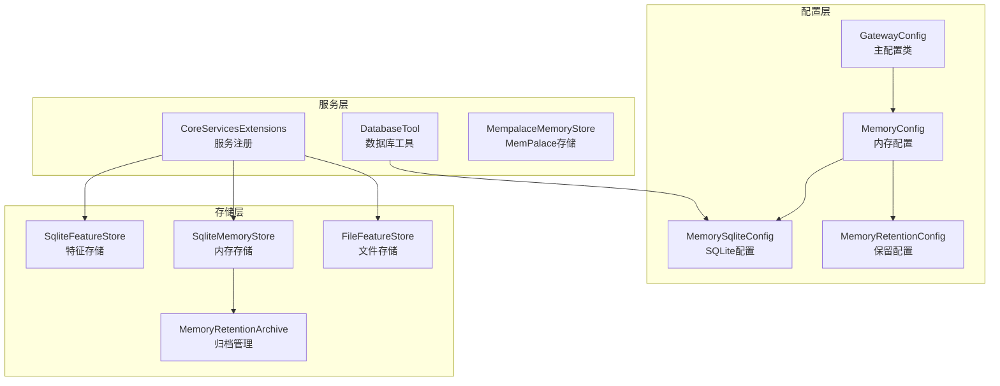

**图表来源**
- [GatewayConfig.cs:175-227](file://src/OpenClaw.Core/Models/GatewayConfig.cs#L175-L227)
- [CoreServicesExtensions.cs:262-331](file://src/OpenClaw.Gateway/Composition/CoreServicesExtensions.cs#L262-L331)

**章节来源**
- [GatewayConfig.cs:175-227](file://src/OpenClaw.Core/Models/GatewayConfig.cs#L175-L227)
- [appsettings.json:49-81](file://src/OpenClaw.Gateway/appsettings.json#L49-L81)

## 核心组件

### 内存配置系统

OpenClaw提供了三种内存存储后端：文件存储、SQLite存储和MemPalace存储。每种存储方式都有其特定的配置选项和适用场景。

#### 基础配置结构

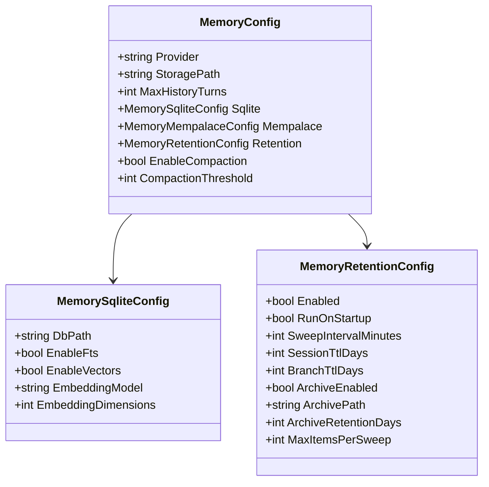

**图表来源**
- [GatewayConfig.cs:175-227](file://src/OpenClaw.Core/Models/GatewayConfig.cs#L175-L227)
- [GatewayConfig.cs:216-227](file://src/OpenClaw.Core/Models/GatewayConfig.cs#L216-L227)
- [GatewayConfig.cs:203-214](file://src/OpenClaw.Core/Models/GatewayConfig.cs#L203-L214)

### 存储后端选择

系统支持三种存储后端，每种都有不同的性能特征和适用场景：

| 存储类型 | 特点 | 适用场景 | 性能特征 |
|---------|------|----------|----------|
| 文件存储 | 简单直接，无外部依赖 | 小规模应用，开发测试 | 低延迟，简单可靠 |
| SQLite存储 | 关系型数据库，事务支持 | 生产环境，中等规模 | ACID特性，并发控制 |
| MemPalace存储 | 专为记忆优化 | 大规模记忆处理 | 高级搜索，向量支持 |

**章节来源**
- [GatewayConfig.cs:175-189](file://src/OpenClaw.Core/Models/GatewayConfig.cs#L175-L189)
- [CoreServicesExtensions.cs:262-331](file://src/OpenClaw.Gateway/Composition/CoreServicesExtensions.cs#L262-L331)

## 架构概览

OpenClaw的数据库架构采用多层设计，确保了灵活性和可扩展性：

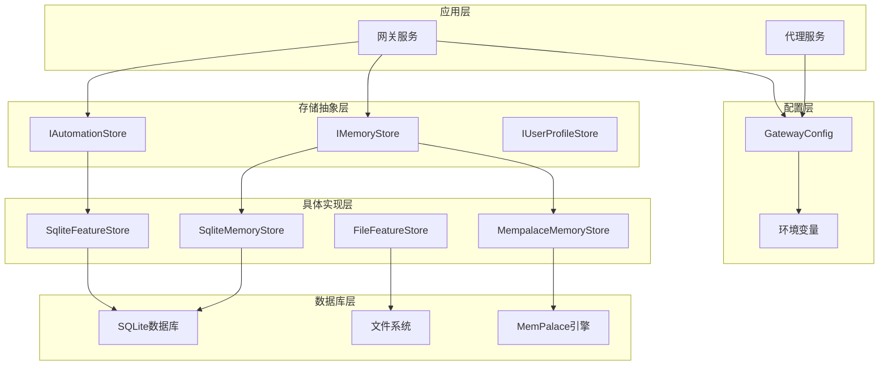

**图表来源**
- [CoreServicesExtensions.cs:262-331](file://src/OpenClaw.Gateway/Composition/CoreServicesExtensions.cs#L262-L331)
- [GatewayConfig.cs:175-189](file://src/OpenClaw.Core/Models/GatewayConfig.cs#L175-L189)

## 详细组件分析

### SQLite特征存储

SqliteFeatureStore是用于存储自动化定义、用户配置文件、学习提案和连接账户的核心组件。

#### 数据库结构设计

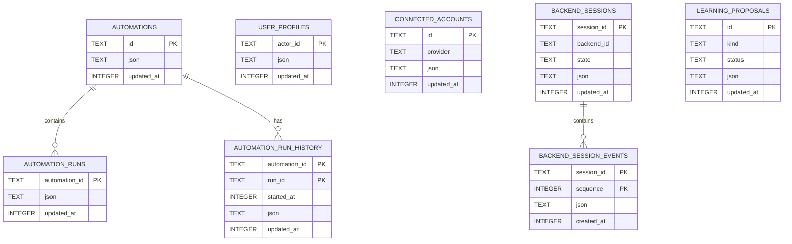

**图表来源**
- [SqliteFeatureStore.cs:33-96](file://src/OpenClaw.Core/Features/SqliteFeatureStore.cs#L33-L96)

#### 连接字符串配置

SQLite连接使用共享缓存模式以提高并发性能：

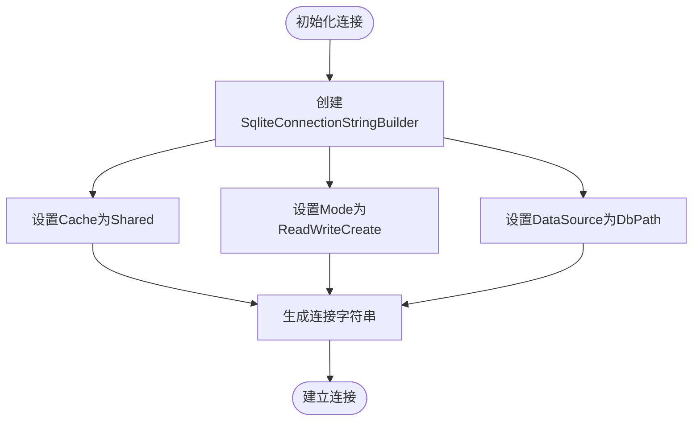

**图表来源**
- [SqliteFeatureStore.cs:21-26](file://src/OpenClaw.Core/Features/SqliteFeatureStore.cs#L21-L26)

**章节来源**
- [SqliteFeatureStore.cs:8-99](file://src/OpenClaw.Core/Features/SqliteFeatureStore.cs#L8-L99)
- [SqliteFeatureStore.cs:21-26](file://src/OpenClaw.Core/Features/SqliteFeatureStore.cs#L21-L26)

### SQLite内存存储

SqliteMemoryStore专门用于存储会话、笔记和分支信息，支持全文搜索和向量嵌入。

#### 初始化流程

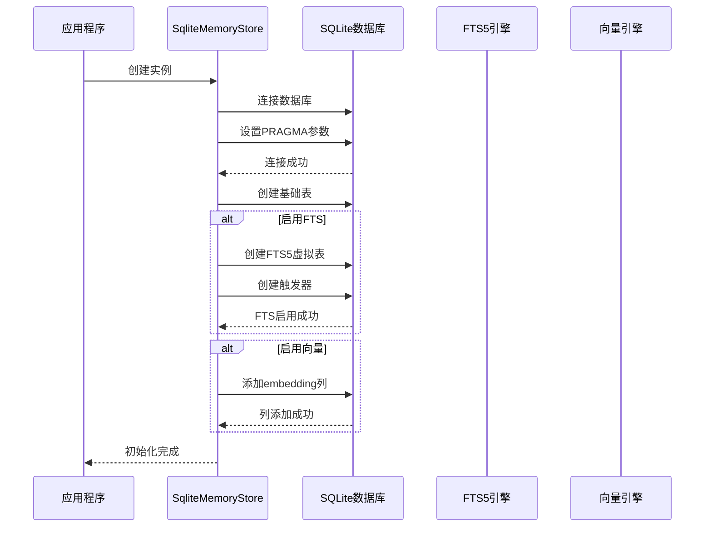

**图表来源**
- [SqliteMemoryStore.cs:54-148](file://src/OpenClaw.Core/Memory/SqliteMemoryStore.cs#L54-L148)

#### 全文搜索配置

SQLite内存存储支持FTS5全文搜索引擎，提供高效的文本检索能力：

| 配置项 | 默认值 | 描述 |
|--------|--------|------|
| EnableFts | true | 启用全文搜索功能 |
| EnableVectors | false | 启用向量嵌入支持 |
| EmbeddingModel | null | 嵌入模型名称 |
| EmbeddingDimensions | 1536 | 嵌入向量维度 |

**章节来源**
- [SqliteMemoryStore.cs:54-148](file://src/OpenClaw.Core/Memory/SqliteMemoryStore.cs#L54-L148)
- [GatewayConfig.cs:216-227](file://src/OpenClaw.Core/Models/GatewayConfig.cs#L216-L227)

### 文件特征存储

FileFeatureStore提供基于文件系统的存储方案，适用于简单的部署场景。

#### 文件组织结构

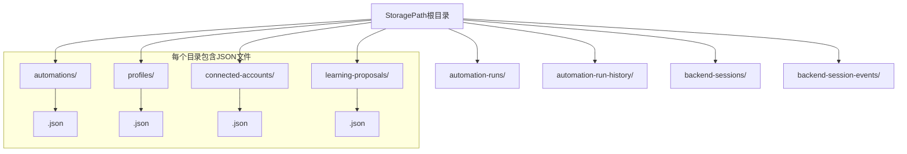

**图表来源**
- [FileFeatureStore.cs:19-39](file://src/OpenClaw.Core/Features/FileFeatureStore.cs#L19-L39)

**章节来源**
- [FileFeatureStore.cs:8-39](file://src/OpenClaw.Core/Features/FileFeatureStore.cs#L8-L39)

### MemPalace存储集成

MemPalace存储提供高级的记忆管理和知识图谱功能，通过原生插件集成。

#### 存储架构

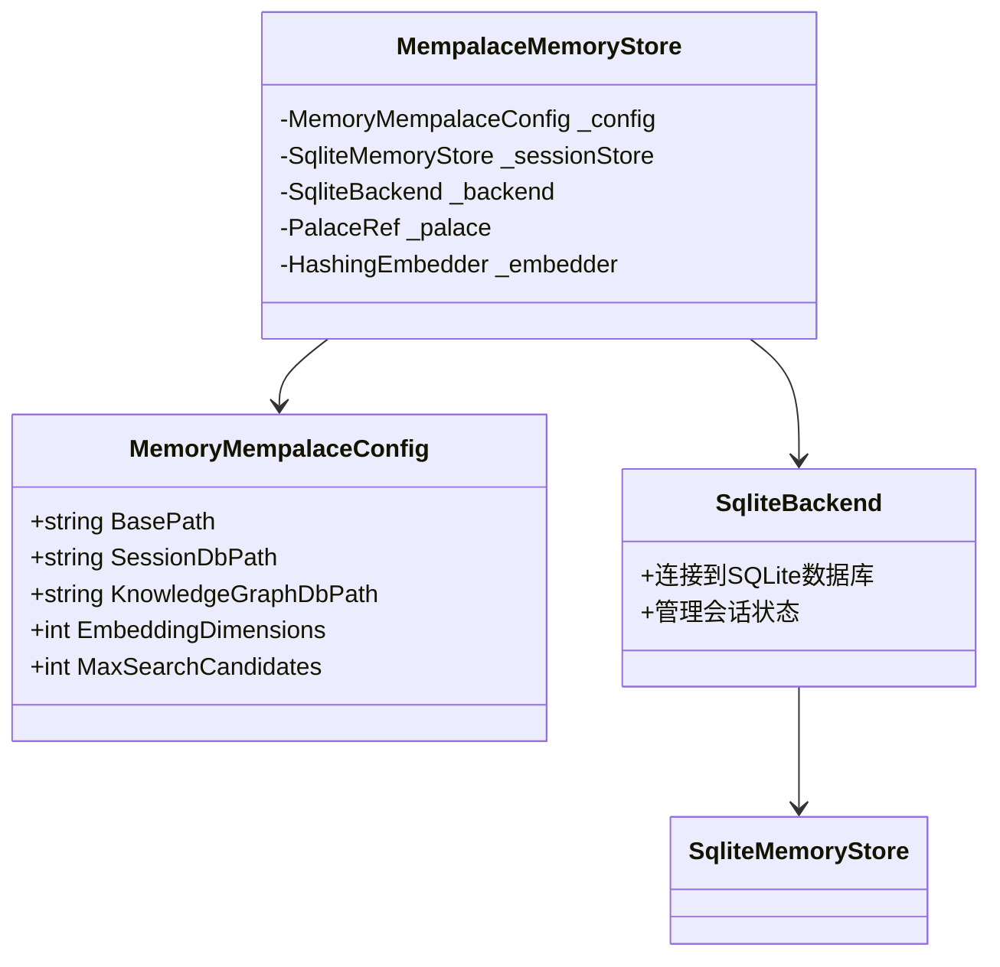

**图表来源**
- [MempalaceMemoryStore.cs:15-41](file://src/OpenClaw.Plugins.Mempalace/MempalaceMemoryStore.cs#L15-L41)

**章节来源**
- [MempalaceMemoryStore.cs:15-41](file://src/OpenClaw.Plugins.Mempalace/MempalaceMemoryStore.cs#L15-L41)
- [GatewayConfig.cs:229-242](file://src/OpenClaw.Core/Models/GatewayConfig.cs#L229-L242)

## 依赖关系分析

### 服务注册依赖

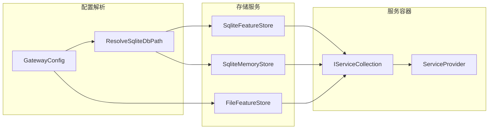

**图表来源**
- [CoreServicesExtensions.cs:262-293](file://src/OpenClaw.Gateway/Composition/CoreServicesExtensions.cs#L262-L293)

### 数据库路径解析

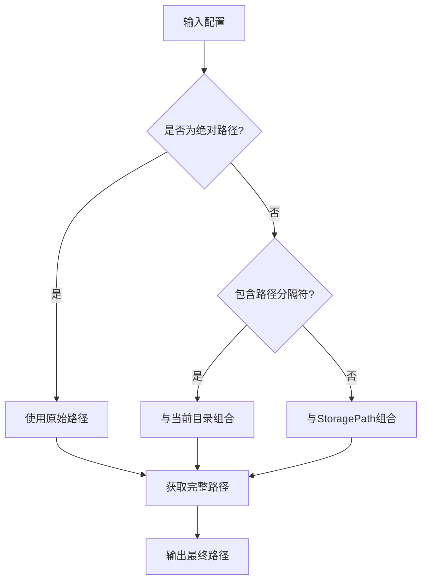

**图表来源**
- [CoreServicesExtensions.cs:281-293](file://src/OpenClaw.Gateway/Composition/CoreServicesExtensions.cs#L281-L293)

**章节来源**
- [CoreServicesExtensions.cs:262-293](file://src/OpenClaw.Gateway/Composition/CoreServicesExtensions.cs#L262-L293)

## 性能考虑

### SQLite性能优化

#### 连接池和缓存

SQLite连接使用共享缓存模式以提高并发性能：

| 参数 | 值 | 说明 |
|------|-----|------|
| Cache | Shared | 允许多个连接共享缓存 |
| Mode | ReadWriteCreate | 支持读写和自动创建 |
| JournalMode | WAL | 使用预写日志提高并发性 |
| Synchronous | NORMAL | 平衡性能和安全性 |

#### 查询优化策略

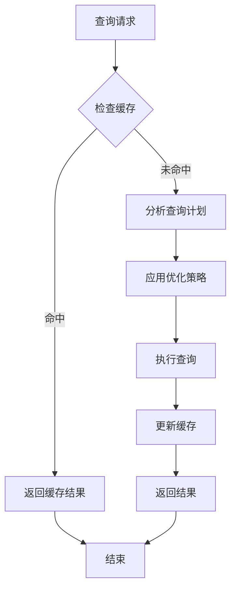

#### 并发控制

SQLite通过以下机制控制并发访问：

1. **WAL模式**：允许多个读操作同时进行
2. **共享缓存**：减少重复的元数据查询
3. **连接复用**：避免频繁的连接建立开销
4. **事务批处理**：合并多个小操作到单个事务中

### 内存存储优化

#### 缓存策略

| 配置项 | 默认值 | 优化建议 |
|--------|--------|----------|
| MaxCachedSessions | 64 | 根据并发需求调整 |
| MaxHistoryTurns | 50 | 控制历史记录大小 |
| EnableCompaction | false | 大数据量时启用 |

#### 搜索性能优化

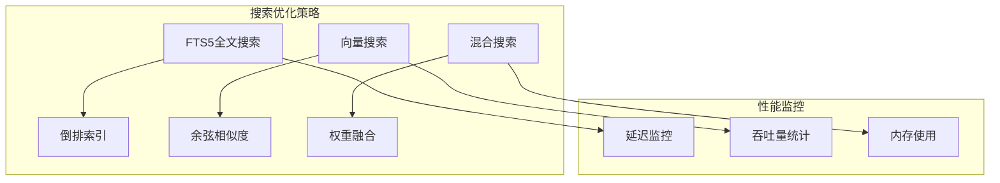

### 存储后端对比

| 特性 | 文件存储 | SQLite存储 | MemPalace存储 |
|------|----------|------------|---------------|
| 部署复杂度 | 低 | 中等 | 高 |
| 数据一致性 | 最终一致 | ACID | ACID |
| 并发性能 | 低 | 中等 | 高 |
| 查询能力 | 基础 | 强大 | 专家级 |
| 维护成本 | 低 | 中等 | 高 |
| 扩展性 | 有限 | 良好 | 优秀 |

## 故障排除指南

### 常见配置问题

#### 数据库路径问题

当数据库文件无法创建或访问时，系统会显示详细的错误信息：

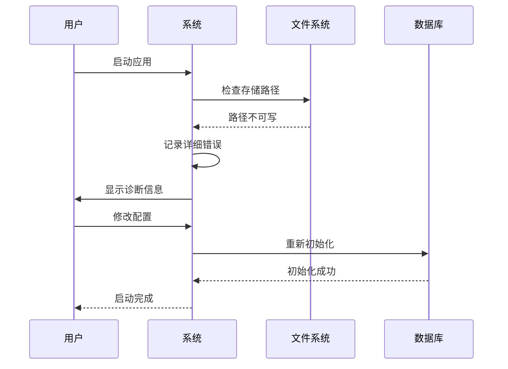

**图表来源**
- [StartupFailureReporterTests.cs:30-52](file://src/OpenClaw.Tests/StartupFailureReporterTests.cs#L30-L52)

#### 连接超时问题

当数据库连接超时时，系统会尝试重连并记录详细信息：

| 错误类型 | 触发条件 | 解决方案 |
|----------|----------|----------|
| 连接超时 | 超过配置的超时时间 | 增加超时值或优化查询 |
| 死锁 | 并发冲突 | 减少并发或优化事务 |
| 磁盘空间不足 | 存储空间耗尽 | 清理空间或扩容 |
| 权限不足 | 文件权限问题 | 修正文件权限 |

**章节来源**
- [StartupFailureReporterTests.cs:30-52](file://src/OpenClaw.Tests/StartupFailureReporterTests.cs#L30-L52)

### 性能调优建议

#### 小规模部署（< 100用户）

```json
{
  "Memory": {
    "Provider": "sqlite",
    "StoragePath": "./memory",
    "Sqlite": {
      "DbPath": "./memory/openclaw.db",
      "EnableFts": false,
      "EnableVectors": false
    },
    "Retention": {
      "Enabled": false
    }
  }
}
```

#### 中等规模部署（100-1000用户）

```json
{
  "Memory": {
    "Provider": "sqlite",
    "StoragePath": "./memory",
    "Sqlite": {
      "DbPath": "./memory/openclaw.db",
      "EnableFts": true,
      "EnableVectors": false
    },
    "Retention": {
      "Enabled": true,
      "ArchiveEnabled": true,
      "ArchiveRetentionDays": 30
    }
  }
}
```

#### 大规模部署（> 1000用户）

```json
{
  "Memory": {
    "Provider": "sqlite",
    "StoragePath": "/app/memory",
    "Sqlite": {
      "DbPath": "/app/memory/openclaw.db",
      "EnableFts": true,
      "EnableVectors": true,
      "EmbeddingModel": "text-embedding-3-small",
      "EmbeddingDimensions": 1536
    },
    "Retention": {
      "Enabled": true,
      "RunOnStartup": true,
      "SweepIntervalMinutes": 15,
      "ArchiveEnabled": true,
      "ArchiveRetentionDays": 90
    }
  }
}
```

## 结论

OpenClaw提供了灵活且强大的数据库配置系统，支持从简单的文件存储到复杂的SQLite和MemPalace解决方案。通过合理配置内存存储参数、启用适当的性能优化功能，以及实施有效的备份和恢复策略，可以满足不同规模和需求的应用场景。

关键要点包括：
- 选择合适的存储后端以平衡性能和复杂度
- 合理配置SQLite参数以获得最佳性能
- 实施定期的备份和归档策略
- 监控系统性能并根据实际负载调整配置
- 在生产环境中启用适当的日志记录和监控

## 附录

### 配置模板参考

#### 开发环境配置
```json
{
  "OpenClaw": {
    "Memory": {
      "Provider": "sqlite",
      "StoragePath": "./memory",
      "Sqlite": {
        "DbPath": "./memory/dev.db",
        "EnableFts": true,
        "EnableVectors": false
      }
    }
  }
}
```

#### 生产环境配置
```json
{
  "OpenClaw": {
    "Memory": {
      "Provider": "sqlite",
      "StoragePath": "/app/memory",
      "Sqlite": {
        "DbPath": "/app/memory/prod.db",
        "EnableFts": true,
        "EnableVectors": true,
        "EmbeddingModel": "text-embedding-3-small"
      },
      "Retention": {
        "Enabled": true,
        "RunOnStartup": true,
        "SweepIntervalMinutes": 30,
        "ArchiveEnabled": true,
        "ArchiveRetentionDays": 90
      }
    }
  }
}
```

### 监控指标建议

| 指标类型 | 监控内容 | 告警阈值 |
|----------|----------|----------|
| 数据库连接 | 连接数、等待时间 | > 80% |
| 查询性能 | 平均响应时间、慢查询数量 | > 500ms |
| 存储使用 | 磁盘空间、文件数量 | > 80% |
| 内存使用 | 进程内存、缓存命中率 | > 85% |
| 错误率 | 数据库错误、连接失败 | > 1% |