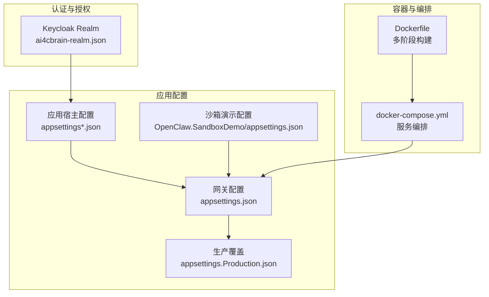
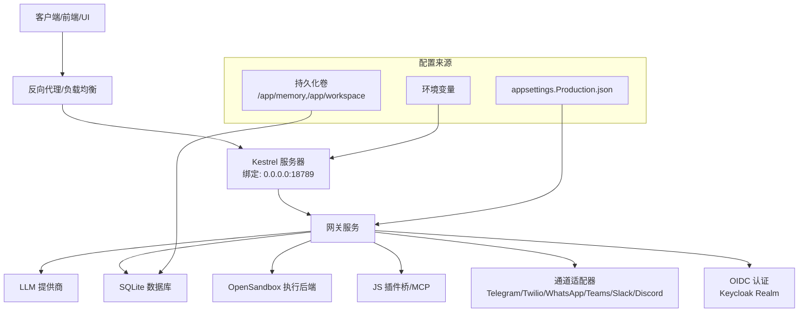
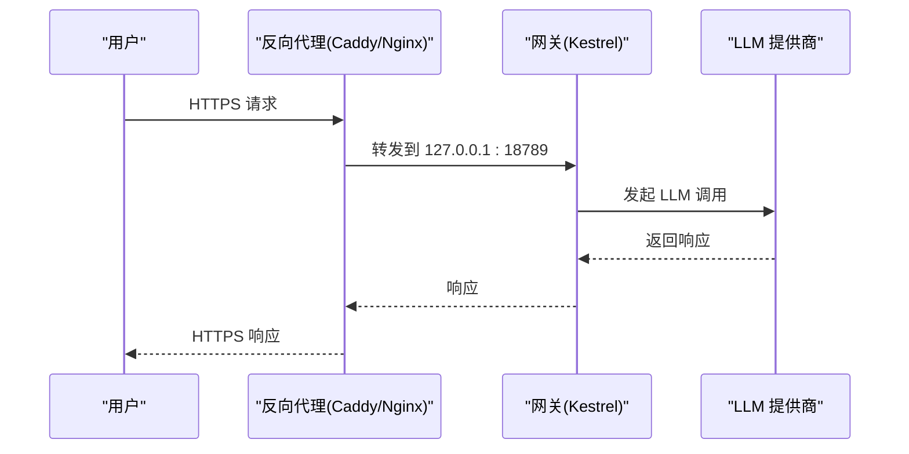
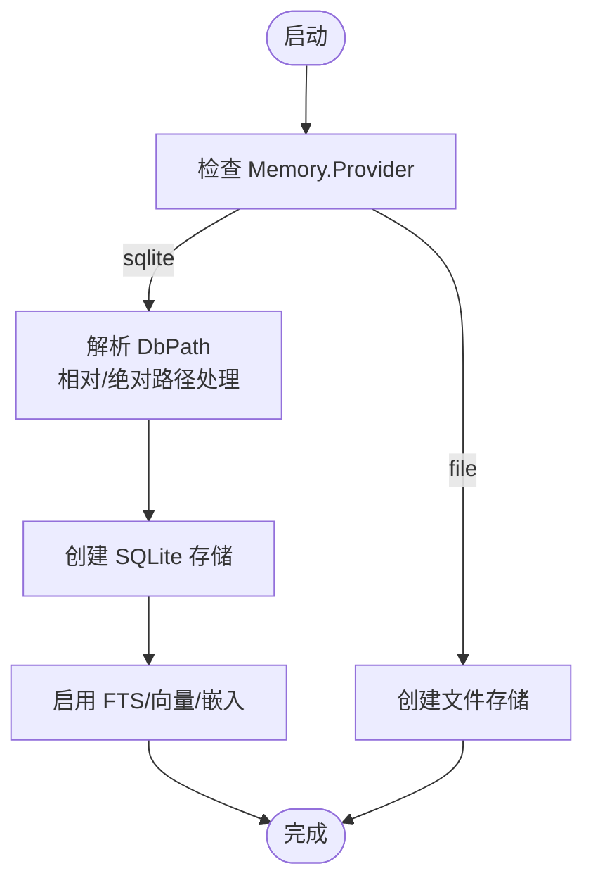
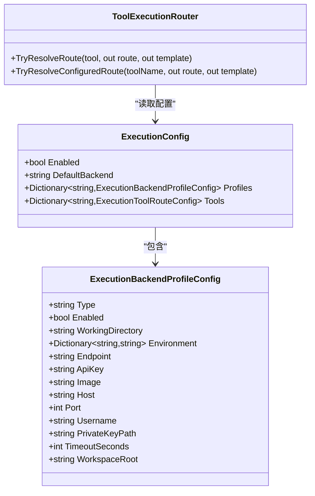
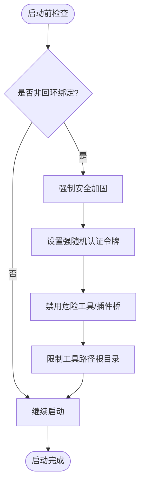
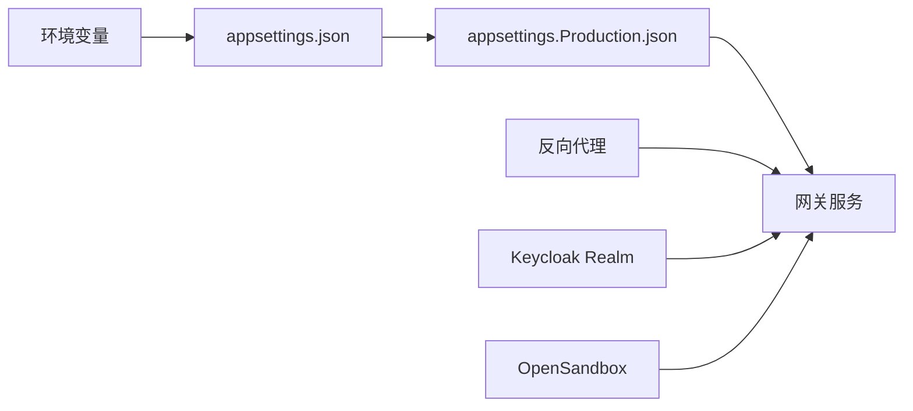

# 生产环境配置

<cite>
**本文档引用的文件**
- [README.md](file://README.md)
- [QUICKSTART.md](file://docs/QUICKSTART.md)
- [docker-compose.yml](file://docker-compose.yml)
- [Dockerfile](file://Dockerfile)
- [appsettings.json](file://src/OpenClaw.Gateway/appsettings.json)
- [appsettings.Production.json](file://src/OpenClaw.Gateway/appsettings.Production.json)
- [appsettings.json](file://Kingcrab.AppHost/appsettings.json)
- [appsettings.Development.json](file://Kingcrab.AppHost/appsettings.Development.json)
- [launchSettings.json](file://Kingcrab.AppHost/Properties/launchSettings.json)
- [ai4cbrain-realm.json](file://Kingcrab.AppHost/Configs/ai4cbrain-realm.json)
- [appsettings.json](file://src/OpenClaw.SandboxDemo/appsettings.json)
- [CoreServicesExtensions.cs](file://src/OpenClaw.Gateway/Composition/CoreServicesExtensions.cs)
- [MaintenanceCoordinator.cs](file://src/OpenClaw.Core/Setup/MaintenanceCoordinator.cs)
- [ToolExecutionRouter.cs](file://src/OpenClaw.Agent/Execution/ToolExecutionRouter.cs)
- [ExecutionModels.cs](file://src/OpenClaw.Core/Models/ExecutionModels.cs)
- [SetupCommand.cs](file://src/OpenClaw.Cli/SetupCommand.cs)
- [GatewaySecurityExtensions.cs](file://src/OpenClaw.Gateway/Extensions/GatewaySecurityExtensions.cs)
- [PRODUCTION_FIXES.md](file://docs/PRODUCTION_FIXES.md)
</cite>

## 目录
1. [简介](#简介)
2. [项目结构](#项目结构)
3. [核心组件](#核心组件)
4. [架构总览](#架构总览)
5. [详细组件分析](#详细组件分析)
6. [依赖关系分析](#依赖关系分析)
7. [性能考虑](#性能考虑)
8. [故障排除指南](#故障排除指南)
9. [结论](#结论)
10. [附录](#附录)

## 简介
本指南面向在生产环境中部署与运维 OpenClaw.NET 的工程团队，提供从配置文件结构、关键配置项到安全加固的完整实践路径。内容覆盖 TLS/SSL 配置、数据库连接设置、内存存储配置以及工具执行后端配置，并给出单机部署、集群部署与高可用配置模板，同时包含性能调优参数与资源限制建议。

## 项目结构
OpenClaw.NET 的生产配置主要分布在以下位置：
- 网关应用配置：src/OpenClaw.Gateway/appsettings.json（默认开发配置）与 src/OpenClaw.Gateway/appsettings.Production.json（生产专用覆盖）
- 应用宿主配置：Kingcrab.AppHost/appsettings*.json（开发/默认日志级别等）
- 容器化与编排：Dockerfile（多阶段构建与运行时镜像）、docker-compose.yml（服务编排与反向代理）
- 身份认证与授权：Kingcrab.AppHost/Configs/ai4cbrain-realm.json（Keycloak Realm 配置）
- 沙箱演示配置：src/OpenClaw.SandboxDemo/appsettings.json（OpenSandbox 集成示例）

**图表来源**
- [appsettings.json:1-908](file://src/OpenClaw.Gateway/appsettings.json#L1-L908)
- [appsettings.Production.json:1-65](file://src/OpenClaw.Gateway/appsettings.Production.json#L1-L65)
- [Dockerfile:1-59](file://Dockerfile#L1-L59)
- [docker-compose.yml:1-68](file://docker-compose.yml#L1-L68)
- [ai4cbrain-realm.json:1-3037](file://Kingcrab.AppHost/Configs/ai4cbrain-realm.json#L1-L3037)

**章节来源**
- [README.md:1-670](file://README.md#L1-L670)
- [docker-compose.yml:1-68](file://docker-compose.yml#L1-L68)
- [Dockerfile:1-59](file://Dockerfile#L1-L59)

## 核心组件
本节梳理生产环境的关键配置域及其职责边界：

- 基础绑定与安全
  - 绑定地址与端口、认证令牌、跨域策略、反向代理信任、查询字符串令牌支持等
  - 非回环绑定时的安全硬性要求与可选豁免开关
- WebSocket 与速率限制
  - 最大消息大小、最大连接数、每 IP 连接速率、每连接速率等
- 大模型（LLM）与提示缓存
  - 提供商、模型、超时、重试、熔断阈值与冷却时间、提示缓存开关与保留策略
- 内存与会话
  - 存储提供者（SQLite/File）、数据库路径、历史轮次上限、缓存会话数、压缩阈值与保留清理
- 工具与执行
  - 自主权模式、工作区根目录、允许/禁止路径、Shell 执行开关、工具超时、并行执行、浏览器工具配置
- 插件与 MCP
  - JS 插件桥启用、动态原生插件加载路径、MCP 服务器配置
- 编排与后端
  - 本地/SSH/Docker/OpenSandbox 执行后端配置、工具路由映射

**章节来源**
- [appsettings.json:1-908](file://src/OpenClaw.Gateway/appsettings.json#L1-L908)
- [appsettings.Production.json:1-65](file://src/OpenClaw.Gateway/appsettings.Production.json#L1-L65)

## 架构总览
下图展示生产环境配置在启动与运行期的装配关系，以及与外部系统的交互（反向代理、证书、数据库、OpenSandbox 等）。

**图表来源**
- [README.md:277-324](file://README.md#L277-L324)
- [README.md:530-581](file://README.md#L530-L581)
- [docker-compose.yml:1-68](file://docker-compose.yml#L1-L68)
- [Dockerfile:43-51](file://Dockerfile#L43-L51)
- [ai4cbrain-realm.json:1-3037](file://Kingcrab.AppHost/Configs/ai4cbrain-realm.json#L1-L3037)

## 详细组件分析

### TLS/SSL 配置
- 反向代理方式（推荐）
  - 使用 Caddy 或 Nginx，自动签发与续期证书，网关监听 127.0.0.1:18789，通过反代转发
  - 若启用 X-Forwarded-* 头部信任，需配置已知代理 IP 列表
- 直接 Kestrel HTTPS
  - 在 appsettings 中为 Kestrel 的 HTTPS 端点配置证书路径与密码（建议使用环境变量引用）
- Docker 环境
  - 通过 docker-compose 启动 Caddy 服务，或在宿主机部署反代

**图表来源**
- [README.md:530-581](file://README.md#L530-L581)
- [docker-compose.yml:44-62](file://docker-compose.yml#L44-L62)

**章节来源**
- [README.md:293-298](file://README.md#L293-L298)
- [README.md:530-581](file://README.md#L530-L581)
- [docker-compose.yml:44-62](file://docker-compose.yml#L44-L62)

### 数据库连接设置（SQLite）
- 默认使用 SQLite 存储会话与功能数据，数据库文件路径可配置
- 支持全文检索（FTS）与向量嵌入（可选），嵌入维度可配置
- 生产环境建议：
  - 将数据库文件置于持久化卷中
  - 合理设置历史轮次上限与压缩阈值，避免内存膨胀
  - 启用保留清理任务，定期归档与删除过期数据

**图表来源**
- [CoreServicesExtensions.cs:295-310](file://src/OpenClaw.Gateway/Composition/CoreServicesExtensions.cs#L295-L310)
- [MaintenanceCoordinator.cs:769-793](file://src/OpenClaw.Core/Setup/MaintenanceCoordinator.cs#L769-L793)

**章节来源**
- [appsettings.json:49-81](file://src/OpenClaw.Gateway/appsettings.json#L49-L81)
- [CoreServicesExtensions.cs:281-293](file://src/OpenClaw.Gateway/Composition/CoreServicesExtensions.cs#L281-L293)
- [MaintenanceCoordinator.cs:769-793](file://src/OpenClaw.Core/Setup/MaintenanceCoordinator.cs#L769-L793)

### 内存存储配置
- 存储提供者：sqlite 或 file
- 关键参数：
  - StoragePath：存储根目录（生产环境建议挂载持久化卷）
  - MaxHistoryTurns：历史轮次上限
  - MaxCachedSessions：缓存会话数
  - CompactionThreshold/CompactionKeepRecent：压缩阈值与保留最近轮次
  - Retention：保留清理开关、扫描间隔、TTL、归档路径与保留天数

**章节来源**
- [appsettings.json:49-81](file://src/OpenClaw.Gateway/appsettings.json#L49-L81)
- [appsettings.Production.json:15-20](file://src/OpenClaw.Gateway/appsettings.Production.json#L15-L20)

### 工具执行后端配置
- 支持本地、SSH、Docker、OpenSandbox 四类执行后端
- 路由规则：
  - 通过 Execution.Tools 映射具体工具到后端
  - 可指定回退后端（如 Docker 回退到本地）
  - 可为特定后端配置镜像、工作目录、环境变量、超时等
- CLI 交互式配置：
  - 使用 CLI 的 setup 命令可生成 Docker 后端配置并进行可用性检查

**图表来源**
- [ExecutionModels.cs:8-33](file://src/OpenClaw.Core/Models/ExecutionModels.cs#L8-L33)
- [ToolExecutionRouter.cs:1-252](file://src/OpenClaw.Agent/Execution/ToolExecutionRouter.cs#L1-L252)

**章节来源**
- [appsettings.json:232-253](file://src/OpenClaw.Gateway/appsettings.json#L232-L253)
- [SetupCommand.cs:283-303](file://src/OpenClaw.Cli/SetupCommand.cs#L283-L303)
- [ToolExecutionRouter.cs:65-252](file://src/OpenClaw.Agent/Execution/ToolExecutionRouter.cs#L65-L252)

### 安全配置与加固
- 非回环绑定强制要求：
  - 设置强随机认证令牌
  - 禁用危险工具与插件桥（默认生产覆盖已禁用）
  - 严格限制工具路径根目录
- CORS 与反向代理：
  - 配置 AllowedOrigins，必要时启用 TrustForwardedHeaders 并设置 KnownProxies
- 查询字符串令牌：
  - 默认关闭；仅在内置 WebChat 场景下可按需开启
- OIDC 认证：
  - 通过 Keycloak Realm 配置，支持会话空闲与记住登录策略

**图表来源**
- [README.md:300-313](file://README.md#L300-L313)
- [README.md:279-291](file://README.md#L279-L291)
- [appsettings.Production.json:22-30](file://src/OpenClaw.Gateway/appsettings.Production.json#L22-L30)

**章节来源**
- [README.md:279-313](file://README.md#L279-L313)
- [README.md:517-529](file://README.md#L517-L529)
- [ai4cbrain-realm.json:1-3037](file://Kingcrab.AppHost/Configs/ai4cbrain-realm.json#L1-L3037)

## 依赖关系分析
- 配置依赖链
  - 环境变量优先级高于 appsettings，生产镜像默认设置了安全基线
  - appsettings.Production.json 作为覆盖层，仅包含生产必需的最小差异
- 外部依赖
  - 反向代理（Caddy/Nginx）负责 TLS 终止与请求转发
  - Keycloak Realm 提供 OIDC 身份服务
  - OpenSandbox 用于高风险工具的隔离执行

**图表来源**
- [Dockerfile:43-51](file://Dockerfile#L43-L51)
- [appsettings.Production.json:1-65](file://src/OpenClaw.Gateway/appsettings.Production.json#L1-L65)
- [docker-compose.yml:1-68](file://docker-compose.yml#L1-L68)
- [ai4cbrain-realm.json:1-3037](file://Kingcrab.AppHost/Configs/ai4cbrain-realm.json#L1-L3037)

**章节来源**
- [Dockerfile:43-51](file://Dockerfile#L43-L51)
- [docker-compose.yml:1-68](file://docker-compose.yml#L1-L68)

## 性能考虑
- 连接与速率控制
  - WebSocket 最大连接数、每 IP 连接速率、每连接速率，结合会话速率限制
- LLM 与提示缓存
  - 合理设置超时、重试次数与熔断参数，避免上游抖动影响
  - 提示缓存按需开启，避免不必要的开销
- 存储与清理
  - 控制历史轮次上限与压缩阈值，定期执行保留清理任务
- 执行后端
  - Docker/SSH 后端合理设置超时与镜像，避免长时间阻塞

**章节来源**
- [appsettings.json:103-109](file://src/OpenClaw.Gateway/appsettings.json#L103-L109)
- [appsettings.json:35-43](file://src/OpenClaw.Gateway/appsettings.json#L35-L43)
- [appsettings.json:66-81](file://src/OpenClaw.Gateway/appsettings.json#L66-L81)

## 故障排除指南
- 健康检查
  - 使用内置健康检查端点与容器健康探测，确保服务可用
- 观测性
  - 开启结构化日志与指标端点，关注会话锁数量、持久化失败、速率限制命中与优雅停机时间
- 兼容性与诊断
  - 使用 doctor 模式验证配置与能力兼容性，特别是插件桥与动态原生插件启用时

**章节来源**
- [docker-compose.yml:37-42](file://docker-compose.yml#L37-L42)
- [PRODUCTION_FIXES.md:188-198](file://docs/PRODUCTION_FIXES.md#L188-L198)
- [README.md:150-158](file://README.md#L150-L158)

## 结论
生产环境配置的核心在于“安全优先、可观测、可扩展”。通过反向代理统一 TLS、严格的非回环绑定安全策略、合理的数据库与内存配置、以及可插拔的执行后端与插件体系，OpenClaw.NET 能够在多样化部署场景中稳定运行。建议以 appsettings.Production.json 为基线，结合环境变量与容器编排，形成标准化的发布流程与变更管理。

## 附录

### 配置模板

- 单机部署（反代 + 容器）
  - 使用 docker-compose 启动网关与可选的 Caddy 服务，挂载持久化卷，设置环境变量
  - 参考：[docker-compose.yml:1-68](file://docker-compose.yml#L1-L68)，[Dockerfile:1-59](file://Dockerfile#L1-L59)

- 集群部署（Kubernetes）
  - 建议：
    - 使用 Deployment + Service 暴露网关
    - 使用 Ingress/ALB + ACME 自动证书
    - 将 /app/memory 与 /app/workspace 挂载到持久化存储
    - 通过 ConfigMap/Secret 注入 appsettings 与敏感信息

- 高可用配置
  - 多副本部署 + 负载均衡
  - 共享存储或状态后端（根据业务需求选择）
  - 健康检查与滚动更新策略

- 安全加固清单
  - 强随机认证令牌、禁用危险工具与插件桥、限制工具路径根目录
  - 启用反向代理信任与已知代理列表
  - 配置 CORS 与查询字符串令牌策略
  - OIDC 会话空闲与记住登录策略

**章节来源**
- [docker-compose.yml:1-68](file://docker-compose.yml#L1-L68)
- [Dockerfile:1-59](file://Dockerfile#L1-L59)
- [README.md:517-529](file://README.md#L517-L529)