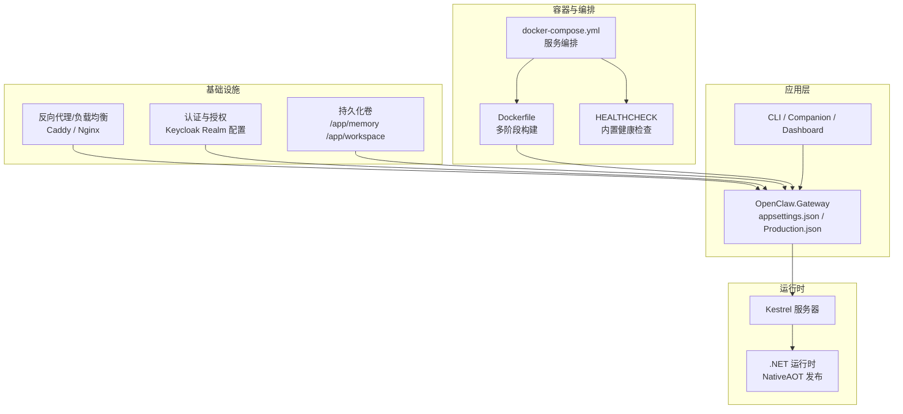
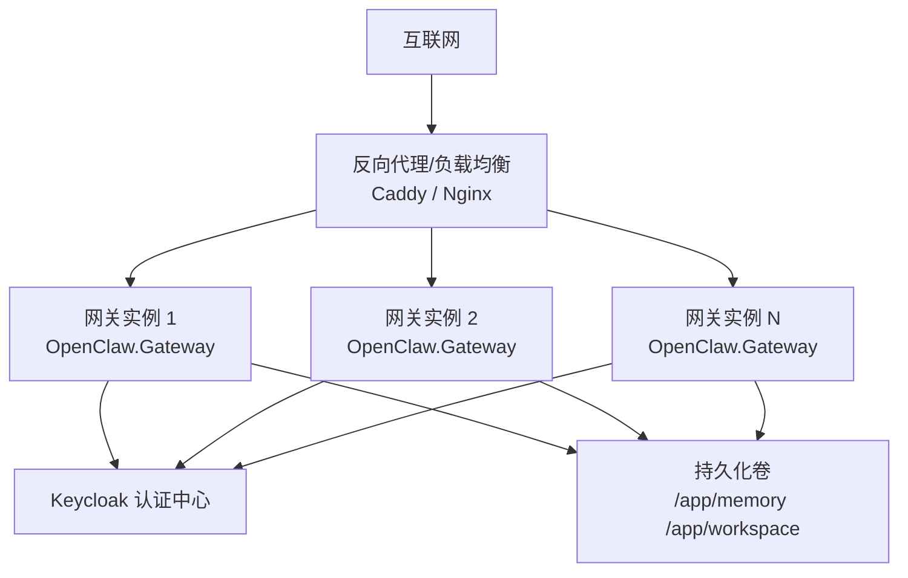
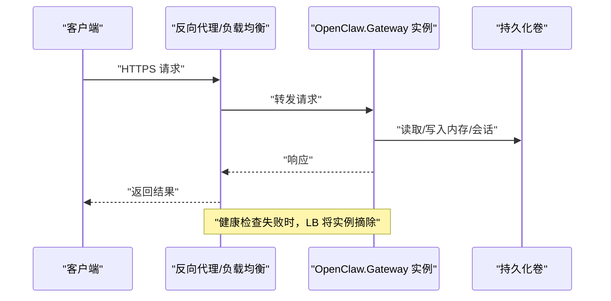
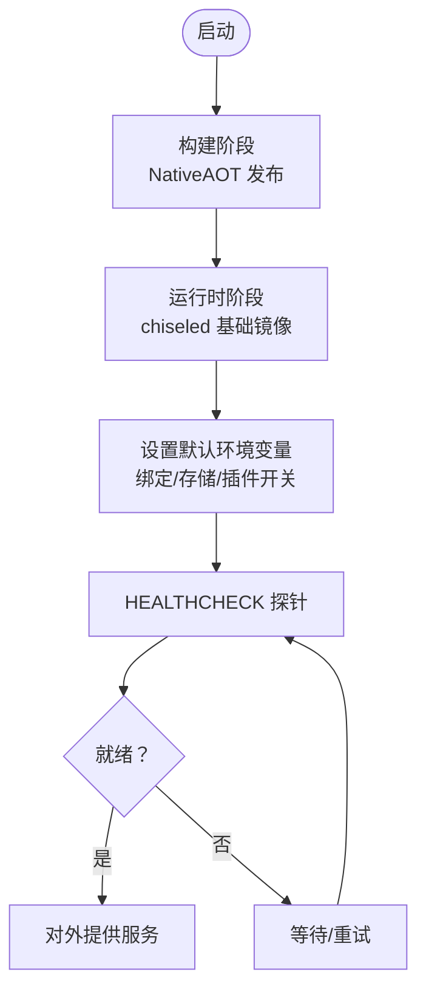
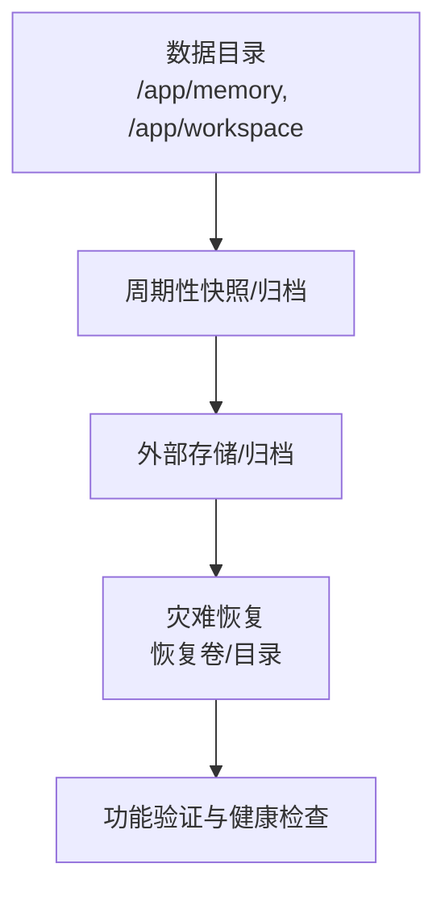
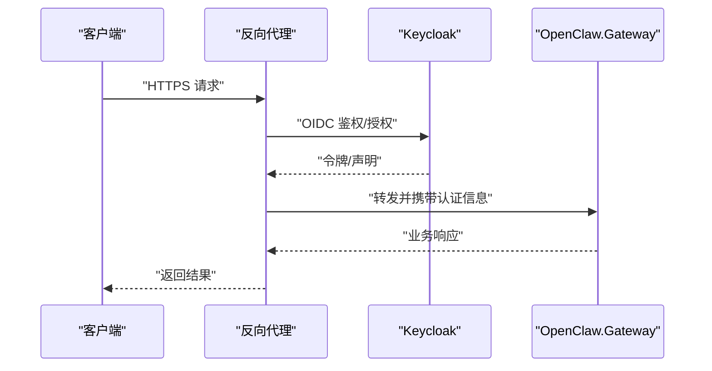
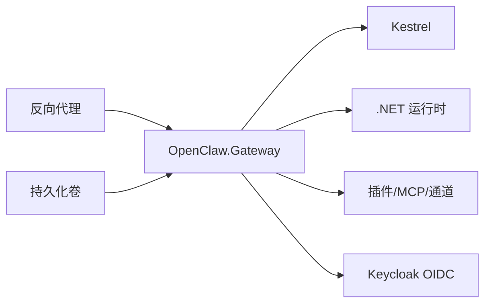

# 高可用配置

<cite>
**本文引用的文件**
- [README.md](file://README.md)
- [QUICKSTART.md](file://QUICKSTART.md)
- [docker-compose.yml](file://docker-compose.yml)
- [Dockerfile](file://Dockerfile)
- [src/OpenClaw.Gateway/appsettings.json](file://src/OpenClaw.Gateway/appsettings.json)
- [src/OpenClaw.Gateway/appsettings.Production.json](file://src/OpenClaw.Gateway/appsettings.Production.json)
- [Kingcrab.AppHost/appsettings.json](file://Kingcrab.AppHost/appsettings.json)
- [Kingcrab.AppHost/Configs/ai4cbrain-realm.json](file://Kingcrab.AppHost/Configs/ai4cbrain-realm.json)
- [scripts/build-opensandbox-image.ps1](file://scripts/build-opensandbox-image.ps1)
</cite>

## 目录
1. [简介](#简介)
2. [项目结构](#项目结构)
3. [核心组件](#核心组件)
4. [架构总览](#架构总览)
5. [详细组件分析](#详细组件分析)
6. [依赖关系分析](#依赖关系分析)
7. [性能考量](#性能考量)
8. [故障排查指南](#故障排查指南)
9. [结论](#结论)
10. [附录](#附录)

## 简介
本指南面向生产环境的高可用部署，围绕 OpenClaw.NET 网关与相关组件，系统阐述以下主题：
- 高可用部署架构：负载均衡、健康检查、故障转移
- 容器编排与服务发现、自动扩缩容
- 数据持久化、备份与灾难恢复
- 多节点部署、集群配置与监控告警最佳实践

本指南以仓库中的配置与脚本为依据，结合项目文档，给出可落地的生产级建议。

## 项目结构
从部署与运行角度，关键目录与文件如下：
- 运行时与网关配置：src/OpenClaw.Gateway/appsettings*.json
- 容器镜像与编排：Dockerfile、docker-compose.yml
- 应用主机与日志：Kingcrab.AppHost/*
- 认证与权限：Kingcrab.AppHost/Configs/ai4cbrain-realm.json
- 开源沙箱构建脚本：scripts/build-opensandbox-image.ps1
- 顶层文档：README.md、QUICKSTART.md

图示来源
- [Dockerfile:1-59](file://Dockerfile#L1-L59)
- [docker-compose.yml:1-68](file://docker-compose.yml#L1-L68)
- [src/OpenClaw.Gateway/appsettings.json:1-908](file://src/OpenClaw.Gateway/appsettings.json#L1-L908)
- [src/OpenClaw.Gateway/appsettings.Production.json:1-65](file://src/OpenClaw.Gateway/appsettings.Production.json#L1-L65)
- [Kingcrab.AppHost/Configs/ai4cbrain-realm.json:1-800](file://Kingcrab.AppHost/Configs/ai4cbrain-realm.json#L1-L800)

章节来源
- [README.md:145-196](file://README.md#L145-L196)
- [docker-compose.yml:1-68](file://docker-compose.yml#L1-L68)
- [Dockerfile:1-59](file://Dockerfile#L1-L59)

## 核心组件
- 网关与运行时
  - 网关负责 HTTP/WebSocket/通道接入、安全策略、会话与内存管理、工具执行与插件桥接等。
  - 支持两种运行时模式：aot（裁剪友好）与 jit（动态能力更强），默认在开发配置中启用 jit。
- 容器与镜像
  - 使用多阶段构建，发布 NativeAOT 单文件二进制，运行时采用 chiseled 基础镜像，暴露 18789 端口。
  - 默认绑定地址与端口可通过环境变量覆盖；生产环境建议使用 0.0.0.0 并配合反向代理与 TLS。
- 编排与健康检查
  - docker-compose 提供内置健康检查，依赖网关的 --health-check 入口参数。
  - 可选 Caddy 作为反向代理与自动 TLS。
- 安全与鉴权
  - 生产配置默认开启严格安全项，如禁止公共绑定上的危险能力、限制工具路径、要求鉴权等。
  - Keycloak Realm 配置用于 OIDC 授权与角色管理。
- 持久化与存储
  - 内存与会话数据默认写入 /app/memory；可挂载 /app/workspace 作为工作区根目录。
  - 生产配置建议固定存储路径并确保权限与容量。

章节来源
- [src/OpenClaw.Gateway/appsettings.json:1-908](file://src/OpenClaw.Gateway/appsettings.json#L1-L908)
- [src/OpenClaw.Gateway/appsettings.Production.json:1-65](file://src/OpenClaw.Gateway/appsettings.Production.json#L1-L65)
- [Dockerfile:35-59](file://Dockerfile#L35-L59)
- [docker-compose.yml:37-43](file://docker-compose.yml#L37-L43)
- [Kingcrab.AppHost/Configs/ai4cbrain-realm.json:1-800](file://Kingcrab.AppHost/Configs/ai4cbrain-realm.json#L1-L800)

## 架构总览
下图展示生产环境典型拓扑：反向代理（Caddy/Nginx）前置，后端多个网关实例通过健康检查与负载均衡分发流量；认证由 Keycloak 提供；数据持久化通过卷实现。

图示来源
- [docker-compose.yml:44-62](file://docker-compose.yml#L44-L62)
- [src/OpenClaw.Gateway/appsettings.Production.json:1-65](file://src/OpenClaw.Gateway/appsettings.Production.json#L1-L65)
- [Kingcrab.AppHost/Configs/ai4cbrain-realm.json:1-800](file://Kingcrab.AppHost/Configs/ai4cbrain-realm.json#L1-L800)

## 详细组件分析

### 负载均衡与健康检查
- 健康检查
  - 容器层面：Dockerfile 与 docker-compose 均定义了 HEALTHCHECK，调用网关内置的 --health-check。
  - 建议在负载均衡器或编排平台（如 Kubernetes）中使用该探针进行存活与就绪判断。
- 负载均衡
  - 反向代理（Caddy/Nginx）作为入口，支持自动 TLS 与转发到后端网关实例。
  - 在 docker-compose 中，Caddy 服务依赖 openclaw 健康状态启动，形成强一致的启动顺序。
- 故障转移
  - 建议在 LB 层配置多实例轮询或亲和性策略，并结合健康检查失败后的摘除与重试机制。

图示来源
- [docker-compose.yml:37-43](file://docker-compose.yml#L37-L43)
- [Dockerfile:55-57](file://Dockerfile#L55-L57)

章节来源
- [docker-compose.yml:37-43](file://docker-compose.yml#L37-L43)
- [Dockerfile:55-57](file://Dockerfile#L55-L57)

### 容器编排与服务发现
- 多阶段构建
  - 构建阶段：安装 NativeAOT 依赖，还原并发布网关为单文件 NativeAOT 二进制。
  - 运行阶段：基于 chiseled 运行时镜像，设置非 root 用户与默认环境变量。
- 环境变量与绑定
  - 默认绑定 0.0.0.0:18789，生产环境建议通过环境变量覆盖并配合反向代理。
- 服务发现
  - 在容器编排环境中，建议使用服务名进行内部发现；对外统一通过反向代理暴露。
- 自动扩缩容
  - 建议基于 CPU/内存与请求延迟指标进行水平扩展；结合健康检查与就绪探针控制扩缩时机。

图示来源
- [Dockerfile:1-59](file://Dockerfile#L1-L59)
- [src/OpenClaw.Gateway/appsettings.Production.json:1-65](file://src/OpenClaw.Gateway/appsettings.Production.json#L1-L65)

章节来源
- [Dockerfile:1-59](file://Dockerfile#L1-L59)
- [src/OpenClaw.Gateway/appsettings.Production.json:1-65](file://src/OpenClaw.Gateway/appsettings.Production.json#L1-L65)

### 数据持久化、备份与灾难恢复
- 存储位置
  - 默认内存与会话数据位于 /app/memory；工作区位于 /app/workspace。
  - 生产配置建议固定存储路径并确保卷权限与容量。
- 备份策略
  - 建议对 /app/memory 执行周期性快照或归档；结合 retention 策略定期清理过期数据。
- 灾难恢复
  - 通过卷快照或外部归档恢复；验证恢复后网关健康检查与基本功能。

图示来源
- [src/OpenClaw.Gateway/appsettings.json:49-81](file://src/OpenClaw.Gateway/appsettings.json#L49-L81)
- [src/OpenClaw.Gateway/appsettings.Production.json:15-20](file://src/OpenClaw.Gateway/appsettings.Production.json#L15-L20)

章节来源
- [src/OpenClaw.Gateway/appsettings.json:49-81](file://src/OpenClaw.Gateway/appsettings.json#L49-L81)
- [src/OpenClaw.Gateway/appsettings.Production.json:15-20](file://src/OpenClaw.Gateway/appsettings.Production.json#L15-L20)

### 认证与授权（服务发现与安全）
- OIDC 集成
  - Keycloak Realm 提供角色与客户端配置，支持多客户端与权限映射。
- 网关安全
  - 生产配置默认开启严格安全项，如禁止公共绑定上的危险能力、限制工具路径、要求鉴权等。
  - 建议在反向代理层启用 TLS 并信任转发头，同时配置已知代理 IP 列表。

图示来源
- [Kingcrab.AppHost/Configs/ai4cbrain-realm.json:1-800](file://Kingcrab.AppHost/Configs/ai4cbrain-realm.json#L1-L800)
- [src/OpenClaw.Gateway/appsettings.Production.json:22-30](file://src/OpenClaw.Gateway/appsettings.Production.json#L22-L30)

章节来源
- [Kingcrab.AppHost/Configs/ai4cbrain-realm.json:1-800](file://Kingcrab.AppHost/Configs/ai4cbrain-realm.json#L1-L800)
- [src/OpenClaw.Gateway/appsettings.Production.json:22-30](file://src/OpenClaw.Gateway/appsettings.Production.json#L22-L30)

### 多节点部署与集群配置
- 多实例
  - 通过 docker-compose 或编排平台启动多个网关实例，共享同一存储卷以保持会话一致性。
- 集群配置
  - 建议使用服务名进行内部通信；对外统一通过反向代理暴露。
  - 结合健康检查与就绪探针，确保扩缩容过程中的平滑切换。

章节来源
- [docker-compose.yml:3-43](file://docker-compose.yml#L3-L43)
- [src/OpenClaw.Gateway/appsettings.Production.json:1-65](file://src/OpenClaw.Gateway/appsettings.Production.json#L1-L65)

### 监控与告警（健康检查与可观测性）
- 健康检查
  - 使用内置 --health-check 作为容器健康探针。
- 指标与日志
  - 生产环境建议启用结构化日志与分布式追踪导出至 OTLP 收集器。
  - 监控关键指标：请求量、错误率、会话数、工具调用次数、保留任务运行状态等。

章节来源
- [README.md:619-649](file://README.md#L619-L649)
- [docker-compose.yml:37-43](file://docker-compose.yml#L37-L43)

## 依赖关系分析
- 组件耦合
  - 网关依赖运行时（.NET/NativeAOT）、Kestrel、容器镜像与编排。
  - 认证依赖 Keycloak Realm 配置；反向代理负责 TLS 与转发。
- 外部依赖
  - LLM 提供商、消息通道（Telegram/Twilio/WhatsApp/Teams/Slack/Discord/Signal/飞书/企业微信）、MCP 服务器等。
- 循环依赖
  - 未见直接循环依赖；各模块职责清晰。

图示来源
- [src/OpenClaw.Gateway/appsettings.json:1-908](file://src/OpenClaw.Gateway/appsettings.json#L1-L908)
- [Kingcrab.AppHost/Configs/ai4cbrain-realm.json:1-800](file://Kingcrab.AppHost/Configs/ai4cbrain-realm.json#L1-L800)

章节来源
- [src/OpenClaw.Gateway/appsettings.json:1-908](file://src/OpenClaw.Gateway/appsettings.json#L1-L908)

## 性能考量
- 运行时模式
  - aot 更适合稳定、低内存占用场景；jit 提供更广兼容性但资源消耗更高。
- 连接与速率限制
  - 生产配置提供连接数、每 IP 连接数、每连接每分钟消息数等限制，避免资源耗尽。
- 工具与插件
  - 默认禁用插件桥接，生产需显式启用并严格管控；工具超时与并行执行需按场景调整。
- 存储与缓存
  - 合理设置内存最大历史回合数、缓存会话数与压缩阈值，平衡性能与数据完整性。

章节来源
- [src/OpenClaw.Gateway/appsettings.json:66-81](file://src/OpenClaw.Gateway/appsettings.json#L66-L81)
- [src/OpenClaw.Gateway/appsettings.Production.json:32-46](file://src/OpenClaw.Gateway/appsettings.Production.json#L32-L46)

## 故障排查指南
- 健康检查失败
  - 检查容器日志与网关日志级别；确认环境变量与绑定地址是否正确。
- 插件与工具问题
  - 确认插件桥接开关与工具路径白名单；必要时临时关闭危险能力进行隔离排查。
- 认证与授权
  - 校验 Keycloak 配置与客户端映射；检查反向代理转发头与已知代理列表。
- 存储与权限
  - 确认卷挂载路径与权限；检查磁盘空间与文件系统权限。

章节来源
- [README.md:517-529](file://README.md#L517-L529)
- [src/OpenClaw.Gateway/appsettings.Production.json:1-65](file://src/OpenClaw.Gateway/appsettings.Production.json#L1-L65)

## 结论
通过反向代理与健康检查实现高可用，结合严格的生产配置与持久化策略，可在生产环境中稳定运行 OpenClaw.NET 网关。建议在实际部署中根据业务规模与合规要求进一步细化扩缩容、备份与灾难恢复策略，并持续优化运行时模式与资源配置。

## 附录
- 快速开始与本地体验
  - 参考快速入门文档，了解最小化启动流程与常用命令。
- 开源沙箱镜像构建
  - 如需启用沙箱能力，可使用脚本构建包含 OpenSandbox 的镜像。

章节来源
- [QUICKSTART.md:1-190](file://QUICKSTART.md#L1-L190)
- [scripts/build-opensandbox-image.ps1:1-93](file://scripts/build-opensandbox-image.ps1#L1-L93)