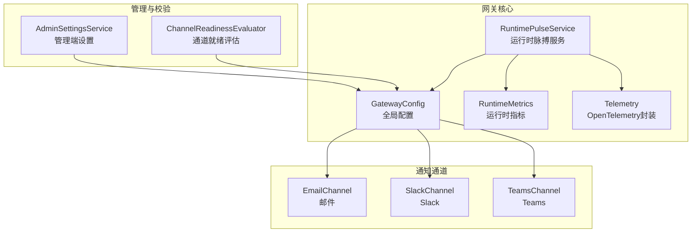
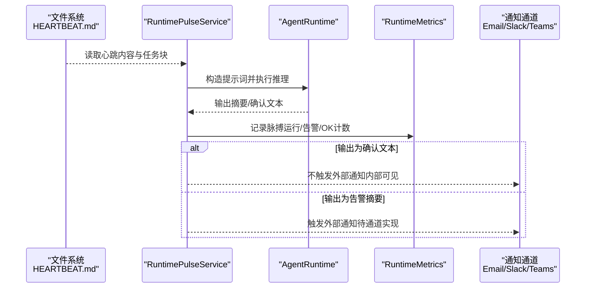
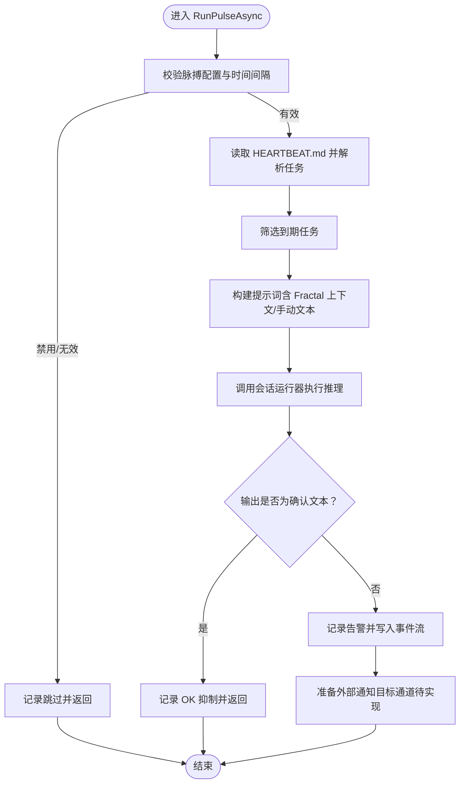
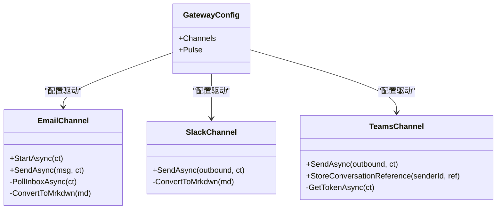
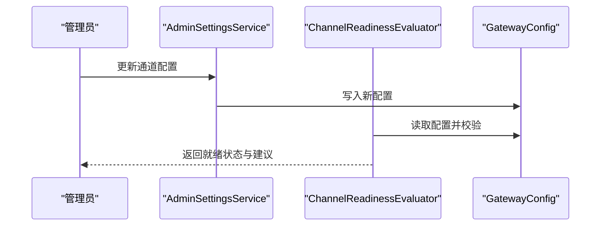
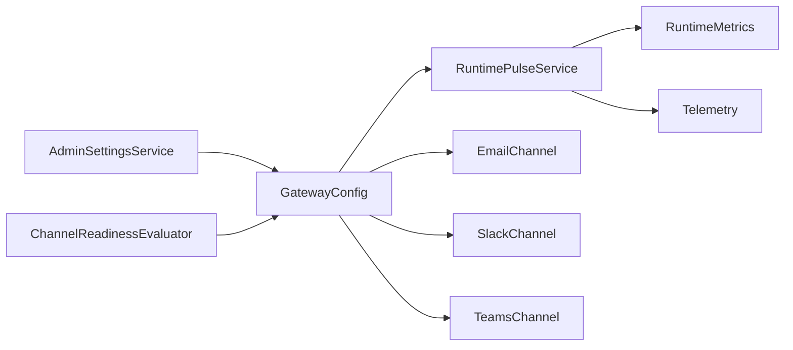

# 告警配置

<cite>
**本文引用的文件**
- [RuntimePulseService.cs](file://src/OpenClaw.Gateway/RuntimePulseService.cs)
- [GatewayConfig.cs](file://src/OpenClaw.Core/Models/GatewayConfig.cs)
- [RuntimeMetrics.cs](file://src/OpenClaw.Core/Observability/RuntimeMetrics.cs)
- [Telemetry.cs](file://src/OpenClaw.Core/Observability/Telemetry.cs)
- [EmailChannel.cs](file://src/OpenClaw.Channels/EmailChannel.cs)
- [SlackChannel.cs](file://src/OpenClaw.Channels/SlackChannel.cs)
- [TeamsChannel.cs](file://src/OpenClaw.Channels/TeamsChannel.cs)
- [AdminSettingsService.cs](file://src/OpenClaw.Gateway/AdminSettingsService.cs)
- [ChannelReadinessEvaluator.cs](file://src/OpenClaw.Gateway/ChannelReadinessEvaluator.cs)
- [KingcrabChannelConfigs.cs](file://src/OpenClaw.Core/Models/KingcrabChannelConfigs.cs)
</cite>

## 目录
1. [简介](#简介)
2. [项目结构](#项目结构)
3. [核心组件](#核心组件)
4. [架构总览](#架构总览)
5. [详细组件分析](#详细组件分析)
6. [依赖关系分析](#依赖关系分析)
7. [性能考量](#性能考量)
8. [故障排查指南](#故障排查指南)
9. [结论](#结论)
10. [附录](#附录)

## 简介
本指南面向运维与平台工程团队，系统性阐述如何在本项目中完成“基于指标的告警规则配置”，覆盖以下主题：
- 基于指标的阈值告警、趋势告警与复合告警的设计思路与落地路径
- Prometheus 与 Alertmanager 的集成方式与最佳实践
- 告警通知渠道：邮件、Slack、Microsoft Teams 的配置要点
- 告警分级、静默期与抑制规则的实现建议
- 健康检查告警、性能告警与业务告警的配置示例与落地步骤

说明：
- 本项目内置了“运行时脉搏”机制，可作为健康检查与基础告警的触发源；同时提供了丰富的可观测性指标与通道适配器，便于扩展到 Prometheus/Alertmanager 体系。

## 项目结构
围绕告警配置的关键模块与文件如下：
- 运行时脉搏服务：负责周期性生成健康检查告警
- 配置模型：集中定义通道与脉搏配置
- 可观测性指标：提供计数器与仪表盘数据
- 通知通道：邮件、Slack、Teams 等适配器
- 管理端设置与就绪评估：用于校验通道可用性与安全参数

图表来源
- [RuntimePulseService.cs:16-134](file://src/OpenClaw.Gateway/RuntimePulseService.cs#L16-L134)
- [GatewayConfig.cs:534-800](file://src/OpenClaw.Core/Models/GatewayConfig.cs#L534-L800)
- [RuntimeMetrics.cs:10-312](file://src/OpenClaw.Core/Observability/RuntimeMetrics.cs#L10-L312)
- [Telemetry.cs:9-54](file://src/OpenClaw.Core/Observability/Telemetry.cs#L9-L54)
- [EmailChannel.cs:15-192](file://src/OpenClaw.Channels/EmailChannel.cs#L15-L192)
- [SlackChannel.cs:19-184](file://src/OpenClaw.Channels/SlackChannel.cs#L19-L184)
- [TeamsChannel.cs:21-355](file://src/OpenClaw.Channels/TeamsChannel.cs#L21-L355)
- [AdminSettingsService.cs:501-525](file://src/OpenClaw.Gateway/AdminSettingsService.cs#L501-L525)
- [ChannelReadinessEvaluator.cs:321-388](file://src/OpenClaw.Gateway/ChannelReadinessEvaluator.cs#L321-L388)

章节来源
- [RuntimePulseService.cs:16-134](file://src/OpenClaw.Gateway/RuntimePulseService.cs#L16-L134)
- [GatewayConfig.cs:534-800](file://src/OpenClaw.Core/Models/GatewayConfig.cs#L534-L800)

## 核心组件
- 运行时脉搏（Runtime Pulse）
  - 定时执行，读取工作区中的心跳文件，解析任务与提示词，调用会话运行器生成输出；若输出为“确认文本”则视为无告警，否则记录为告警并写入事件流。
  - 支持可见性控制、活跃时段限制、忙碌跳过等策略。
- 配置模型（GatewayConfig）
  - 脉搏配置、通道配置、内存与可观测性等均在此集中定义，便于统一管理与热更新。
- 运行时指标（RuntimeMetrics）
  - 提供请求总量、工具调用失败、保留进程数、脉搏运行次数/告警数等指标，可用于 Prometheus 抓取与告警规则编写。
- 通知通道（Email/Slack/Teams）
  - 提供对外发送与（部分）对内接收能力，支持签名验证、令牌校验等安全选项。

章节来源
- [RuntimePulseService.cs:136-299](file://src/OpenClaw.Gateway/RuntimePulseService.cs#L136-L299)
- [GatewayConfig.cs:534-800](file://src/OpenClaw.Core/Models/GatewayConfig.cs#L534-L800)
- [RuntimeMetrics.cs:10-312](file://src/OpenClaw.Core/Observability/RuntimeMetrics.cs#L10-L312)
- [EmailChannel.cs:15-192](file://src/OpenClaw.Channels/EmailChannel.cs#L15-L192)
- [SlackChannel.cs:19-184](file://src/OpenClaw.Channels/SlackChannel.cs#L19-L184)
- [TeamsChannel.cs:21-355](file://src/OpenClaw.Channels/TeamsChannel.cs#L21-L355)

## 架构总览
下图展示从“心跳文件/脉搏任务”到“指标采集/通知通道”的整体流程。

图表来源
- [RuntimePulseService.cs:136-299](file://src/OpenClaw.Gateway/RuntimePulseService.cs#L136-L299)
- [RuntimeMetrics.cs:173-178](file://src/OpenClaw.Core/Observability/RuntimeMetrics.cs#L173-L178)

## 详细组件分析

### 组件A：运行时脉搏（健康检查告警）
- 触发条件
  - 按配置的时间间隔执行；当心跳文件存在且包含有效任务或自由文本时触发。
  - 若输出为“确认文本”，则不产生外部告警，仅记录内部事件。
- 关键行为
  - 解析任务块、构建提示词、调用会话运行器、记录脉搏运行时长与结果。
  - 通过指标记录运行次数、告警数、OK 抑制数等，便于 Prometheus 抓取。
- 适用场景
  - 健康检查告警：服务可用性、资源占用、会话容量等。
  - 业务告警：按任务块定义的业务规则进行检查与汇总。

图表来源
- [RuntimePulseService.cs:136-299](file://src/OpenClaw.Gateway/RuntimePulseService.cs#L136-L299)

章节来源
- [RuntimePulseService.cs:136-299](file://src/OpenClaw.Gateway/RuntimePulseService.cs#L136-L299)

### 组件B：通知通道（邮件、Slack、Teams）
- 邮件（EmailChannel）
  - 支持 SMTP 发送与 IMAP 接收（入站），具备轮询间隔、最大拉取消息数、安全套接字选项等配置。
  - 入站：轮询未读邮件，提取正文，触发消息事件。
  - 出站：使用用户名与密码认证，构造 MIME 文本并发送。
- Slack（SlackChannel）
  - 通过 Web API 发送消息，支持速率限制重试与错误日志。
  - 提供 Markdown 到 mrkdwn 的转换辅助。
- Teams（TeamsChannel）
  - 通过 Bot Framework REST API 发送消息，需先获取访问令牌。
  - 支持对话引用存储与线程回复，具备分片发送能力。

图表来源
- [EmailChannel.cs:15-192](file://src/OpenClaw.Channels/EmailChannel.cs#L15-L192)
- [SlackChannel.cs:19-184](file://src/OpenClaw.Channels/SlackChannel.cs#L19-L184)
- [TeamsChannel.cs:21-355](file://src/OpenClaw.Channels/TeamsChannel.cs#L21-L355)
- [GatewayConfig.cs:534-800](file://src/OpenClaw.Core/Models/GatewayConfig.cs#L534-L800)

章节来源
- [EmailChannel.cs:15-192](file://src/OpenClaw.Channels/EmailChannel.cs#L15-L192)
- [SlackChannel.cs:19-184](file://src/OpenClaw.Channels/SlackChannel.cs#L19-L184)
- [TeamsChannel.cs:21-355](file://src/OpenClaw.Channels/TeamsChannel.cs#L21-L355)
- [GatewayConfig.cs:534-800](file://src/OpenClaw.Core/Models/GatewayConfig.cs#L534-L800)

### 组件C：配置与就绪评估
- 管理端设置（AdminSettingsService）
  - 提供通道开关、签名验证、DM 策略、类型与路径等配置项的读取与更新。
- 通道就绪评估（ChannelReadinessEvaluator）
  - 对各通道进行缺失项与警告检查，如 Teams 租户 ID、Slack 签名密钥等，并给出修复指引。

图表来源
- [AdminSettingsService.cs:501-525](file://src/OpenClaw.Gateway/AdminSettingsService.cs#L501-L525)
- [ChannelReadinessEvaluator.cs:321-388](file://src/OpenClaw.Gateway/ChannelReadinessEvaluator.cs#L321-L388)
- [GatewayConfig.cs:534-800](file://src/OpenClaw.Core/Models/GatewayConfig.cs#L534-L800)

章节来源
- [AdminSettingsService.cs:501-525](file://src/OpenClaw.Gateway/AdminSettingsService.cs#L501-L525)
- [ChannelReadinessEvaluator.cs:321-388](file://src/OpenClaw.Gateway/ChannelReadinessEvaluator.cs#L321-L388)

## 依赖关系分析
- 脉搏服务依赖配置、运行时指标与会话管理；通过事件与指标为外部系统（如 Prometheus）提供数据源。
- 通知通道依赖配置模型中的通道参数与安全设置；通道就绪评估与管理端设置共同保证部署安全与可用性。
- 指标层（RuntimeMetrics/Telemetry）为告警规则提供稳定的数据接口。

图表来源
- [GatewayConfig.cs:534-800](file://src/OpenClaw.Core/Models/GatewayConfig.cs#L534-L800)
- [RuntimePulseService.cs:16-134](file://src/OpenClaw.Gateway/RuntimePulseService.cs#L16-L134)
- [RuntimeMetrics.cs:10-312](file://src/OpenClaw.Core/Observability/RuntimeMetrics.cs#L10-L312)
- [Telemetry.cs:9-54](file://src/OpenClaw.Core/Observability/Telemetry.cs#L9-L54)
- [AdminSettingsService.cs:501-525](file://src/OpenClaw.Gateway/AdminSettingsService.cs#L501-L525)
- [ChannelReadinessEvaluator.cs:321-388](file://src/OpenClaw.Gateway/ChannelReadinessEvaluator.cs#L321-L388)

章节来源
- [GatewayConfig.cs:534-800](file://src/OpenClaw.Core/Models/GatewayConfig.cs#L534-L800)
- [RuntimePulseService.cs:16-134](file://src/OpenClaw.Gateway/RuntimePulseService.cs#L16-L134)
- [RuntimeMetrics.cs:10-312](file://src/OpenClaw.Core/Observability/RuntimeMetrics.cs#L10-L312)
- [Telemetry.cs:9-54](file://src/OpenClaw.Core/Observability/Telemetry.cs#L9-L54)
- [AdminSettingsService.cs:501-525](file://src/OpenClaw.Gateway/AdminSettingsService.cs#L501-L525)
- [ChannelReadinessEvaluator.cs:321-388](file://src/OpenClaw.Gateway/ChannelReadinessEvaluator.cs#L321-L388)

## 性能考量
- 脉搏执行频率与提示词长度应结合模型上下文限制与会话超时进行权衡，避免过度消耗资源。
- 通道发送需考虑速率限制与重试策略，防止触发上游限流。
- 指标采集与序列化应尽量轻量，避免成为瓶颈。

## 故障排查指南
- 通道就绪检查
  - Teams：缺少租户 ID 或禁用令牌校验时会给出明确警告与修复指引。
  - Slack：缺少 Bot Token 或签名密钥时会提示配置缺失。
- 通道发送失败
  - 邮件：SMTP/IMAP 主机、端口、凭据配置错误会导致发送/轮询失败。
  - Slack：429 速率限制与 API 错误会记录日志，需调整发送节奏或检查权限。
  - Teams：需先建立对话引用再发送；令牌获取失败会记录错误。
- 脉搏未触发
  - 心跳文件不存在或为空；脉搏配置禁用或时间间隔无效；活跃时段不在设定范围内；运行繁忙被跳过。

章节来源
- [ChannelReadinessEvaluator.cs:321-388](file://src/OpenClaw.Gateway/ChannelReadinessEvaluator.cs#L321-L388)
- [EmailChannel.cs:30-110](file://src/OpenClaw.Channels/EmailChannel.cs#L30-L110)
- [SlackChannel.cs:44-91](file://src/OpenClaw.Channels/SlackChannel.cs#L44-L91)
- [TeamsChannel.cs:63-122](file://src/OpenClaw.Channels/TeamsChannel.cs#L63-L122)
- [RuntimePulseService.cs:114-166](file://src/OpenClaw.Gateway/RuntimePulseService.cs#L114-L166)

## 结论
- 本项目以“运行时脉搏”为核心，结合可观测性指标与多通道通知，形成一套可扩展的告警体系。
- 建议将运行时指标接入 Prometheus，利用其强大的查询与告警规则能力实现阈值、趋势与复合告警。
- 通过通道就绪评估与管理端设置，确保通知链路的安全与可用。

## 附录

### 基于指标的告警规则配置（Prometheus + Alertmanager）
- 阈值告警
  - 示例：脉搏运行失败计数在 5 分钟内超过阈值时触发。
  - 建议：结合脉搏运行时长、告警数量与 OK 抑制数综合判断。
- 趋势告警
  - 示例：工具调用失败率或会话容量拒绝率的滑动窗口趋势异常。
  - 建议：使用 PromQL 的 increase(rate()) 或 irate() 检测上升趋势。
- 复合告警
  - 示例：同时满足“脉搏告警数上升 + 工具失败率上升 + 会话容量拒绝上升”。
  - 建议：通过 PromQL 的向量二元运算与布尔组合表达复杂条件。

### Prometheus 抓取与 Alertmanager 集成
- 抓取端点
  - 建议暴露运行时指标端点，供 Prometheus 抓取。
- 告警规则
  - 在 Prometheus 中编写规则，定义告警名称、表达式与持续时间。
- 抑制与静默
  - 在 Alertmanager 中配置抑制规则（如“正在静默期间不发送重复告警”）与静默期（如节假日或维护窗口）。

### 通知集成（邮件、Slack、Teams）
- 邮件
  - 配置 SMTP/IMAP 参数，启用入站轮询与出站发送。
- Slack
  - 配置 Bot Token 与签名密钥，启用签名验证；注意速率限制。
- Teams
  - 配置 App ID/Password/Tenant ID，启用令牌校验；先建立对话引用再发送。

### 告警分级、静默期与抑制规则
- 告警分级
  - 建议：根据影响面与恢复难度分为“严重/警告/提示”三级。
- 静默期
  - 建议：在维护窗口或节假日设置静默期，避免误报干扰。
- 抑制规则
  - 建议：在“正在恢复”阶段抑制同类重复告警，减少噪声。

### 健康检查告警、性能告警与业务告警示例
- 健康检查告警
  - 脉搏运行失败计数、脉搏运行时长异常、会话容量拒绝率。
- 性能告警
  - 工具调用失败率、LLM 重试次数、插件桥重启失败次数。
- 业务告警
  - 通过心跳任务块定义业务规则，由脉搏服务汇总并触发告警。