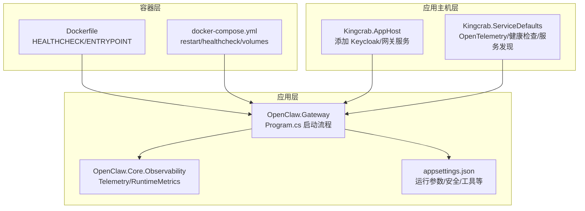
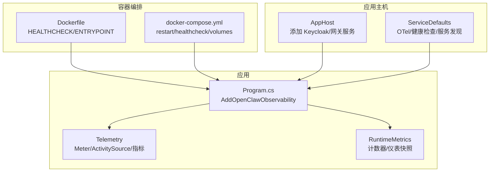
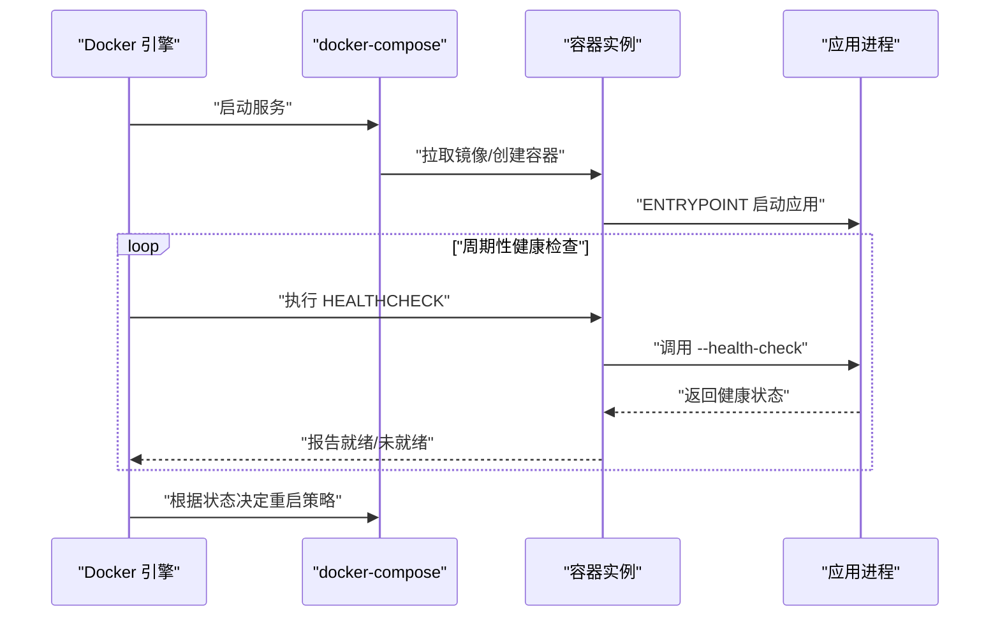
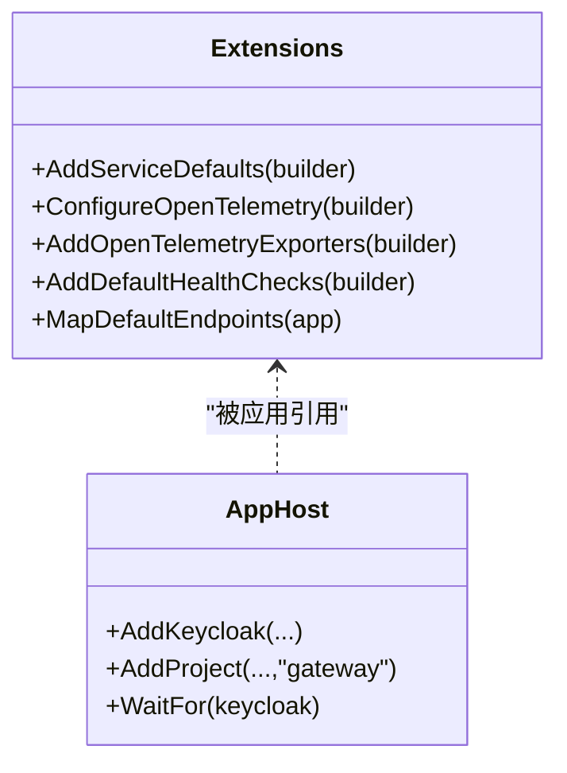
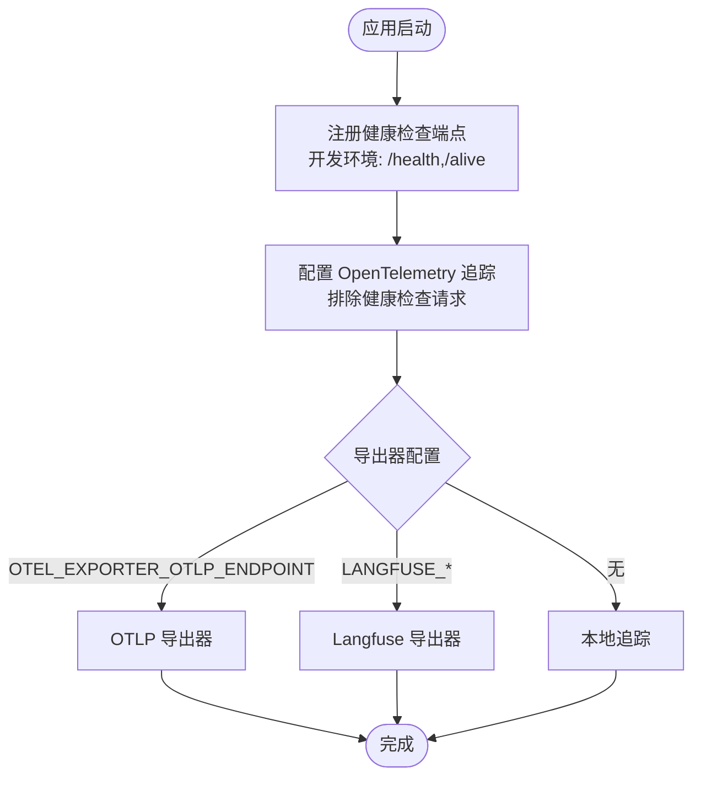
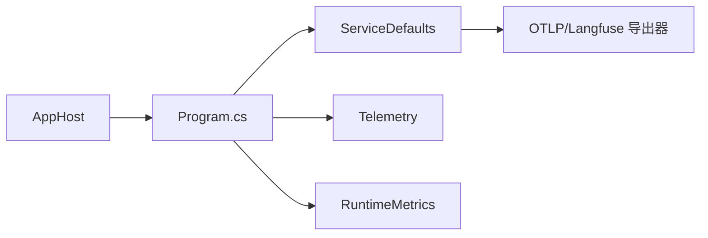

# 基础设施监控

<cite>
**本文引用的文件**
- [Dockerfile](file://Dockerfile)
- [docker-compose.yml](file://docker-compose.yml)
- [AppHost.cs](file://Kingcrab.AppHost\AppHost.cs)
- [Extensions.cs](file://Kingcrab.ServiceDefaults\Extensions.cs)
- [Program.cs](file://src\OpenClaw.Gateway\Program.cs)
- [Telemetry.cs](file://src\OpenClaw.Core\Observability\Telemetry.cs)
- [RuntimeMetrics.cs](file://src\OpenClaw.Core\Observability\RuntimeMetrics.cs)
- [appsettings.json](file://src\OpenClaw.Gateway\appsettings.json)
</cite>

## 目录
1. [简介](#简介)
2. [项目结构](#项目结构)
3. [核心组件](#核心组件)
4. [架构总览](#架构总览)
5. [详细组件分析](#详细组件分析)
6. [依赖关系分析](#依赖关系分析)
7. [性能考量](#性能考量)
8. [故障排查指南](#故障排查指南)
9. [结论](#结论)
10. [附录](#附录)

## 简介
本指南面向基础设施与运维团队，提供基于仓库现有能力的“容器化部署监控”完整实践，覆盖以下要点：
- 容器指标采集：基于 Docker 健康检查与运行时度量
- Kubernetes 资源监控：通过 Aspire 应用主机与服务默认扩展
- 网络流量监控：基于健康检查端点与 OpenTelemetry 追踪
- 系统资源监控：CPU、内存、磁盘、网络的观测路径
- 容器健康检查、自动重启策略与资源限制建议
- 监控数据的存储、查询与可视化方案

## 项目结构
该仓库采用多项目结构，核心监控相关能力分布在以下位置：
- 容器镜像与编排：Dockerfile、docker-compose.yml
- 应用主机与服务默认扩展：Kingcrab.AppHost、Kingcrab.ServiceDefaults
- 网关应用入口与可观测性：OpenClaw.Gateway.Program
- 核心可观测性模型：OpenClaw.Core.Observability（Telemetry、RuntimeMetrics）
- 默认配置：OpenClaw.Gateway.appsettings.json

图表来源
- [Dockerfile:55-56](file://Dockerfile#L55-L56)
- [docker-compose.yml:37-42](file://docker-compose.yml#L37-L42)
- [AppHost.cs:20-22](file://Kingcrab.AppHost\AppHost.cs#L20-L22)
- [Extensions.cs:23-47](file://Kingcrab.ServiceDefaults\Extensions.cs#L23-L47)
- [Program.cs:66](file://src\OpenClaw.Gateway\Program.cs#L66)

章节来源
- [Dockerfile:1-59](file://Dockerfile#L1-L59)
- [docker-compose.yml:1-68](file://docker-compose.yml#L1-L68)
- [AppHost.cs:1-25](file://Kingcrab.AppHost\AppHost.cs#L1-L25)
- [Extensions.cs:1-147](file://Kingcrab.ServiceDefaults\Extensions.cs#L1-L147)
- [Program.cs:1-124](file://src\OpenClaw.Gateway\Program.cs#L1-L124)
- [appsettings.json:1-800](file://src\OpenClaw.Gateway\appsettings.json#L1-L800)

## 核心组件
- 容器健康检查与启动参数
  - Dockerfile 中定义 HEALTHCHECK 与 ENTRYPOINT，用于容器级健康检查触发与进程启动
  - docker-compose.yml 提供 restart 策略、环境变量注入与卷挂载，支持健康检查条件依赖
- Aspire 应用主机与服务默认扩展
  - AppHost 配置 Keycloak 与网关服务，并可显式等待健康检查
  - ServiceDefaults 注入 OpenTelemetry（追踪/指标）、健康检查端点映射与服务发现
- 网关应用可观测性
  - Program 在构建阶段调用 AddOpenClawObservability，启用 OpenTelemetry 与健康检查端点
  - Telemetry 定义 ActivitySource、Meter 与关键指标（工具执行时长、限流超限、审批队列深度）
  - RuntimeMetrics 提供轻量级运行时计数器/仪表（请求总量、LLM 调用、工具调用、会话缓存命中等），可通过健康端点暴露

章节来源
- [Dockerfile:55-56](file://Dockerfile#L55-L56)
- [docker-compose.yml:10](file://docker-compose.yml#L10)
- [AppHost.cs:20-22](file://Kingcrab.AppHost\AppHost.cs#L20-L22)
- [Extensions.cs:49-82](file://Kingcrab.ServiceDefaults\Extensions.cs#L49-L82)
- [Program.cs:66](file://src\OpenClaw.Gateway\Program.cs#L66)
- [Telemetry.cs:9-53](file://src\OpenClaw.Core\Observability\Telemetry.cs#L9-L53)
- [RuntimeMetrics.cs:10-312](file://src\OpenClaw.Core\Observability\RuntimeMetrics.cs#L10-L312)

## 架构总览
下图展示从容器到应用再到可观测性的整体链路，以及健康检查与 OpenTelemetry 的集成位置。

图表来源
- [Dockerfile:55-56](file://Dockerfile#L55-L56)
- [docker-compose.yml:37-42](file://docker-compose.yml#L37-L42)
- [AppHost.cs:20-22](file://Kingcrab.AppHost\AppHost.cs#L20-L22)
- [Extensions.cs:49-82](file://Kingcrab.ServiceDefaults\Extensions.cs#L49-L82)
- [Program.cs:66](file://src\OpenClaw.Gateway\Program.cs#L66)
- [Telemetry.cs:9-53](file://src\OpenClaw.Core\Observability\Telemetry.cs#L9-L53)
- [RuntimeMetrics.cs:192-250](file://src\OpenClaw.Core\Observability\RuntimeMetrics.cs#L192-L250)

## 详细组件分析

### 容器化部署与健康检查
- Dockerfile
  - 使用 HEALTHCHECK 指令调用应用内置的健康检查模式，便于容器编排层进行存活/就绪探测
  - EXPOSE 暴露端口，ENTRYPOINT 指定主程序入口
- docker-compose.yml
  - restart: unless-stopped 实现容器异常退出后的自动重启
  - healthcheck 字段与 Dockerfile 对齐，支持 start_period 等参数
  - volumes 挂载持久化目录，确保内存/工作区数据不丢失

图表来源
- [Dockerfile:55-56](file://Dockerfile#L55-L56)
- [docker-compose.yml:37-42](file://docker-compose.yml#L37-L42)

章节来源
- [Dockerfile:55-56](file://Dockerfile#L55-L56)
- [docker-compose.yml:10](file://docker-compose.yml#L10)
- [docker-compose.yml:37-42](file://docker-compose.yml#L37-L42)

### Kubernetes 资源监控（基于 Aspire 与 ServiceDefaults）
- ServiceDefaults 扩展
  - 注册 OpenTelemetry 追踪与指标（包含 ASP.NET Core、HTTP 客户端、运行时）
  - 自动映射健康检查端点（开发环境），支持过滤健康检查请求进入追踪
  - 注入服务发现与标准重试/熔断策略
- AppHost
  - 添加 Keycloak 与网关服务，并可显式等待健康检查，便于在 K8s 中作为应用主机使用

图表来源
- [Extensions.cs:23-47](file://Kingcrab.ServiceDefaults\Extensions.cs#L23-L47)
- [Extensions.cs:49-82](file://Kingcrab.ServiceDefaults\Extensions.cs#L49-L82)
- [Extensions.cs:119-146](file://Kingcrab.ServiceDefaults\Extensions.cs#L119-L146)
- [AppHost.cs:9-24](file://Kingcrab.AppHost\AppHost.cs#L9-L24)

章节来源
- [Extensions.cs:1-147](file://Kingcrab.ServiceDefaults\Extensions.cs#L1-L147)
- [AppHost.cs:1-25](file://Kingcrab.AppHost\AppHost.cs#L1-L25)

### 网络流量监控（健康检查与 OpenTelemetry）
- 健康检查端点
  - ServiceDefaults 在开发环境映射 /health 与 /alive 端点，分别用于“就绪/全量健康检查”与“存活检查”
  - 追踪中排除健康检查请求，避免噪声
- OpenTelemetry
  - 自动注入 ASP.NET Core 与 HTTP 客户端追踪
  - 支持 OTLP 或 Langfuse 导出器配置（通过环境变量）

图表来源
- [Extensions.cs:128-146](file://Kingcrab.ServiceDefaults\Extensions.cs#L128-L146)
- [Extensions.cs:64-77](file://Kingcrab.ServiceDefaults\Extensions.cs#L64-L77)
- [Extensions.cs:84-115](file://Kingcrab.ServiceDefaults\Extensions.cs#L84-L115)

章节来源
- [Extensions.cs:128-146](file://Kingcrab.ServiceDefaults\Extensions.cs#L128-L146)
- [Extensions.cs:64-77](file://Kingcrab.ServiceDefaults\Extensions.cs#L64-L77)
- [Extensions.cs:84-115](file://Kingcrab.ServiceDefaults\Extensions.cs#L84-L115)

### 系统资源监控（CPU、内存、磁盘、网络）
- CPU/内存/磁盘
  - 运行时指标 RuntimeMetrics 提供请求总量、LLM 调用、工具调用、会话缓存命中/缺失、保留进程数等，可用于评估 CPU/内存占用趋势
  - 健康端点可暴露这些指标，便于外部监控系统抓取
- 网络
  - OpenTelemetry HTTP 客户端与 ASP.NET Core 指标可反映网络延迟、错误率与吞吐
  - 健康检查端点可作为网络连通性与服务可用性的快速探测

章节来源
- [RuntimeMetrics.cs:10-312](file://src\OpenClaw.Core\Observability\RuntimeMetrics.cs#L10-L312)
- [Extensions.cs:60-62](file://Kingcrab.ServiceDefaults\Extensions.cs#L60-L62)

### 容器健康检查、自动重启与资源限制
- 健康检查
  - Dockerfile 与 docker-compose.yml 均配置 HEALTHCHECK，建议结合 /alive 与 /health 端点进行分层探测
- 自动重启
  - docker-compose.yml 使用 restart: unless-stopped；如需更严格的自愈策略，可在 K8s 中使用 liveness/readiness 探针与 restartPolicy
- 资源限制
  - 建议在 K8s Deployment 中设置 resources.limits/requests，结合 RuntimeMetrics 的活跃会话与进程数指标进行容量规划

章节来源
- [Dockerfile:55-56](file://Dockerfile#L55-L56)
- [docker-compose.yml:10](file://docker-compose.yml#L10)
- [docker-compose.yml:37-42](file://docker-compose.yml#L37-L42)

### 监控数据的存储、查询与可视化
- 数据存储与导出
  - 通过环境变量配置 OTLP 或 Langfuse 导出器，实现遥测数据的集中存储
- 查询与可视化
  - 健康端点暴露的运行时指标可用于 Prometheus 抓取或直接 HTTP 查询
  - 结合 Grafana/自定义仪表板对关键指标进行可视化

章节来源
- [Extensions.cs:84-115](file://Kingcrab.ServiceDefaults\Extensions.cs#L84-L115)
- [RuntimeMetrics.cs:192-250](file://src\OpenClaw.Core\Observability\RuntimeMetrics.cs#L192-L250)

## 依赖关系分析
- 组件耦合
  - Program 依赖 ServiceDefaults 的可观测性扩展与健康检查端点映射
  - Telemetry 与 RuntimeMetrics 为应用提供统一的指标与度量基座
  - AppHost 通过 AddProject 与 WaitFor 将服务健康检查纳入编排
- 外部依赖
  - OpenTelemetry（追踪/指标/导出器）
  - Aspire 健康检查与服务发现

图表来源
- [Program.cs:66](file://src\OpenClaw.Gateway\Program.cs#L66)
- [Extensions.cs:49-82](file://Kingcrab.ServiceDefaults\Extensions.cs#L49-L82)
- [Telemetry.cs:9-53](file://src\OpenClaw.Core\Observability\Telemetry.cs#L9-L53)
- [RuntimeMetrics.cs:10-312](file://src\OpenClaw.Core\Observability\RuntimeMetrics.cs#L10-L312)
- [AppHost.cs:20-22](file://Kingcrab.AppHost\AppHost.cs#L20-L22)

章节来源
- [Program.cs:66](file://src\OpenClaw.Gateway\Program.cs#L66)
- [Extensions.cs:49-82](file://Kingcrab.ServiceDefaults\Extensions.cs#L49-L82)
- [Telemetry.cs:9-53](file://src\OpenClaw.Core\Observability\Telemetry.cs#L9-L53)
- [RuntimeMetrics.cs:10-312](file://src\OpenClaw.Core\Observability\RuntimeMetrics.cs#L10-L312)
- [AppHost.cs:20-22](file://Kingcrab.AppHost\AppHost.cs#L20-L22)

## 性能考量
- 指标开销
  - RuntimeMetrics 使用无锁/易失读写，降低 AOT 场景下的分配与竞争
  - Telemetry 的直方图/计数器/可观测仪表在高并发下应结合采样策略与导出频率
- 追踪噪声
  - 健康检查请求已从追踪中排除，建议在生产环境谨慎开启额外追踪源
- I/O 与存储
  - 持久化卷挂载于内存/工作区目录，建议监控磁盘使用率与 IO 延迟

## 故障排查指南
- 健康检查失败
  - 检查 /alive 与 /health 响应，确认服务是否处于就绪状态
  - 查看容器日志与应用启动阶段的异常信息
- 指标缺失
  - 确认 OTLP/Langfuse 导出器配置正确，网络可达
  - 检查运行时指标快照是否暴露于健康端点
- 容器频繁重启
  - 检查 restart 策略与健康检查间隔，必要时调整 retries/start_period
  - 关注 RuntimeMetrics 中的错误/超时/重启尝试计数

章节来源
- [Extensions.cs:128-146](file://Kingcrab.ServiceDefaults\Extensions.cs#L128-L146)
- [RuntimeMetrics.cs:10-312](file://src\OpenClaw.Core\Observability\RuntimeMetrics.cs#L10-L312)
- [docker-compose.yml:37-42](file://docker-compose.yml#L37-L42)

## 结论
本指南基于仓库现有能力，给出了容器化部署监控的实施路径：以 Docker 健康检查与 Compose 重启策略为基础，结合 Aspire 服务默认扩展与 OpenTelemetry，实现可观测性与健康检查的统一接入。通过 RuntimeMetrics 与 Telemetry 的指标体系，可覆盖 CPU/内存/磁盘/网络等系统资源的监控需求，并为后续 K8s 集成与可视化提供坚实基础。

## 附录
- 关键配置参考
  - 健康检查端点映射与追踪过滤：[Extensions.cs:64-77](file://Kingcrab.ServiceDefaults\Extensions.cs#L64-L77)
  - OTLP/Langfuse 导出器配置：[Extensions.cs:84-115](file://Kingcrab.ServiceDefaults\Extensions.cs#L84-L115)
  - 运行时指标快照结构：[RuntimeMetrics.cs:192-250](file://src\OpenClaw.Core\Observability\RuntimeMetrics.cs#L192-L250)
  - 应用启动与可观测性集成：[Program.cs:66](file://src\OpenClaw.Gateway\Program.cs#L66)
  - 容器健康检查与入口：[Dockerfile:55-56](file://Dockerfile#L55-L56)
  - Compose 重启与健康检查：[docker-compose.yml:10](file://docker-compose.yml#L10), [docker-compose.yml:37-42](file://docker-compose.yml#L37-L42)
  - 应用主机与服务等待：[AppHost.cs:20-22](file://Kingcrab.AppHost\AppHost.cs#L20-L22)