# 应用监控

<cite>
**本文引用的文件**
- [Telemetry.cs](file://src/OpenClaw.Core/Observability/Telemetry.cs)
- [RuntimeMetrics.cs](file://src/OpenClaw.Core/Observability/RuntimeMetrics.cs)
- [ProviderUsageTracker.cs](file://src/OpenClaw.Core/Observability/ProviderUsageTracker.cs)
- [ToolUsageTracker.cs](file://src/OpenClaw.Core/Observability/ToolUsageTracker.cs)
- [PromptCacheUsage.cs](file://src/OpenClaw.Core/Observability/PromptCacheUsage.cs)
- [Extensions.cs](file://Kingcrab.ServiceDefaults/Extensions.cs)
- [Program.cs](file://src/OpenClaw.Gateway/Program.cs)
- [DiagnosticsEndpoints.cs](file://src/OpenClaw.Gateway/Endpoints/DiagnosticsEndpoints.cs)
- [AdminObservabilityService.cs](file://src/OpenClaw.Gateway/AdminObservabilityService.cs)
- [OperatorGovernanceModels.cs](file://src/OpenClaw.Core/Models/OperatorGovernanceModels.cs)
- [ObservabilityTests.cs](file://src/OpenClaw.Tests/ObservabilityTests.cs)
- [GatewayTool.cs](file://src/OpenClaw.Gateway/Tools/GatewayTool.cs)
- [RuntimePulseService.cs](file://src/OpenClaw.Gateway/RuntimePulseService.cs)
</cite>

## 目录
1. [简介](#简介)
2. [项目结构](#项目结构)
3. [核心组件](#核心组件)
4. [架构总览](#架构总览)
5. [详细组件分析](#详细组件分析)
6. [依赖关系分析](#依赖关系分析)
7. [性能考量](#性能考量)
8. [故障排查指南](#故障排查指南)
9. [结论](#结论)
10. [附录](#附录)

## 简介
本指南面向在本仓库中部署与运维 OpenClaw（Kingcrab）系统的工程师与平台团队，提供一套完整的应用监控方案，覆盖日志、指标与分布式追踪三大可观测性支柱，并重点说明以下内容：
- 如何通过服务默认扩展启用 OpenTelemetry 日志、指标与追踪导出；
- 如何定义与采集自定义指标（业务指标与系统指标），并将其暴露为可被 Prometheus 抓取的指标端点；
- 如何在 Grafana 中基于 Prometheus 数据源构建仪表板与告警规则；
- 如何结合现有运行时度量与可观测性模型，制定应用性能监控、资源使用监控与关键业务指标的监控策略。

本指南严格依据仓库中的实际实现进行说明，避免臆造未实现的功能。

## 项目结构
围绕监控与可观测性的关键目录与文件如下：
- 服务默认 OpenTelemetry 配置：Kingcrab.ServiceDefaults/Extensions.cs
- 网关启动与监控集成：src/OpenClaw.Gateway/Program.cs
- 诊断与指标端点：src/OpenClaw.Gateway/Endpoints/DiagnosticsEndpoints.cs
- 核心可观测性模型与度量：src/OpenClaw.Core/Observability/*.cs
- 运行时度量与健康检查：src/OpenClaw.Gateway/RuntimePulseService.cs
- 运维工具与审计：src/OpenClaw.Gateway/Tools/GatewayTool.cs
- 可观测性汇总与序列化模型：src/OpenClaw.Gateway/AdminObservabilityService.cs 与 src/OpenClaw.Core/Models/OperatorGovernanceModels.cs
- 单元测试验证：src/OpenClaw.Tests/ObservabilityTests.cs

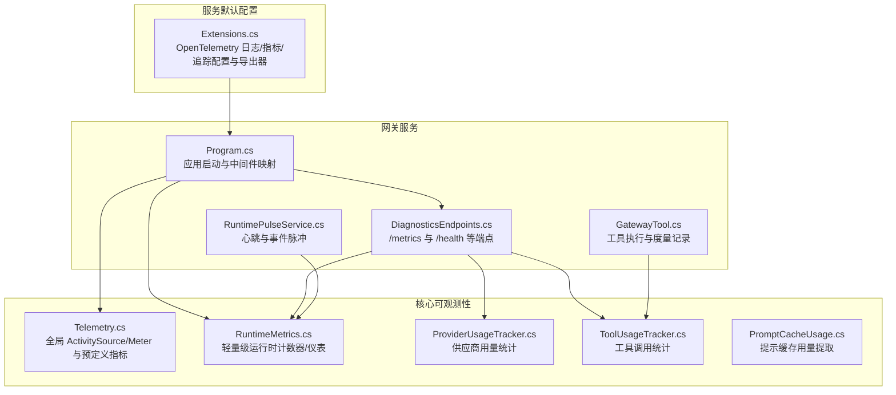

图表来源
- [Program.cs:1-124](file://src/OpenClaw.Gateway/Program.cs#L1-L124)
- [DiagnosticsEndpoints.cs:1-194](file://src/OpenClaw.Gateway/Endpoints/DiagnosticsEndpoints.cs#L1-L194)
- [Telemetry.cs:1-54](file://src/OpenClaw.Core/Observability/Telemetry.cs#L1-L54)
- [RuntimeMetrics.cs:1-312](file://src/OpenClaw.Core/Observability/RuntimeMetrics.cs#L1-L312)
- [ProviderUsageTracker.cs:1-176](file://src/OpenClaw.Core/Observability/ProviderUsageTracker.cs#L1-L176)
- [ToolUsageTracker.cs:1-59](file://src/OpenClaw.Core/Observability/ToolUsageTracker.cs#L1-L59)
- [PromptCacheUsage.cs:1-55](file://src/OpenClaw.Core/Observability/PromptCacheUsage.cs#L1-L55)
- [Extensions.cs:1-147](file://Kingcrab.ServiceDefaults/Extensions.cs#L1-L147)

章节来源
- [Program.cs:1-124](file://src/OpenClaw.Gateway/Program.cs#L1-L124)
- [Extensions.cs:1-147](file://Kingcrab.ServiceDefaults/Extensions.cs#L1-L147)

## 核心组件
- OpenTelemetry 集成与导出
  - 通过服务默认扩展配置日志、指标与追踪，并自动选择 OTLP 或 Langfuse 导出器。
- 全局度量与追踪
  - 提供统一的 ActivitySource 与 Meter，内置直方图与计数器，便于在业务路径中打点。
- 运行时度量
  - 轻量计数器/仪表，支持原子读写，暴露于 /metrics 端点，便于 Prometheus 抓取。
- 供应商与工具使用统计
  - 记录 LLM 请求、重试、错误、令牌用量以及工具调用次数、失败与超时等。
- 诊断端点
  - /metrics、/metrics/providers、/metrics/tools、/health、/health/ready 等，用于健康检查与指标导出。
- 可观测性汇总与序列化
  - 提供摘要与时间序列响应模型，支撑仪表板与审计导出。

章节来源
- [Extensions.cs:49-115](file://Kingcrab.ServiceDefaults/Extensions.cs#L49-L115)
- [Telemetry.cs:9-53](file://src/OpenClaw.Core/Observability/Telemetry.cs#L9-L53)
- [RuntimeMetrics.cs:10-312](file://src/OpenClaw.Core/Observability/RuntimeMetrics.cs#L10-L312)
- [ProviderUsageTracker.cs:7-176](file://src/OpenClaw.Core/Observability/ProviderUsageTracker.cs#L7-L176)
- [ToolUsageTracker.cs:5-59](file://src/OpenClaw.Core/Observability/ToolUsageTracker.cs#L5-L59)
- [DiagnosticsEndpoints.cs:68-93](file://src/OpenClaw.Gateway/Endpoints/DiagnosticsEndpoints.cs#L68-L93)
- [OperatorGovernanceModels.cs:344-449](file://src/OpenClaw.Core/Models/OperatorGovernanceModels.cs#L344-L449)

## 架构总览
下图展示了从应用启动到指标导出与可视化的关键流程：

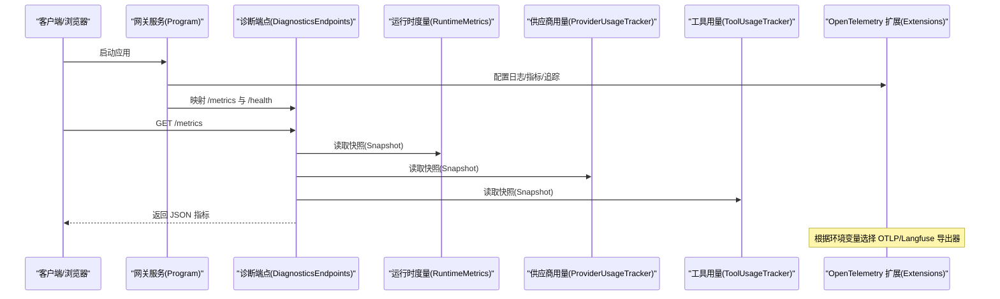

图表来源
- [Program.cs:66-91](file://src/OpenClaw.Gateway/Program.cs#L66-L91)
- [DiagnosticsEndpoints.cs:68-93](file://src/OpenClaw.Gateway/Endpoints/DiagnosticsEndpoints.cs#L68-L93)
- [Extensions.cs:84-115](file://Kingcrab.ServiceDefaults/Extensions.cs#L84-L115)

## 详细组件分析

### OpenTelemetry 配置与导出
- 日志、指标与追踪的统一配置由服务默认扩展完成，包含 ASP.NET Core、HTTP 客户端与运行时指标的仪器化。
- 追踪过滤排除健康检查端点，降低噪音。
- 导出器优先使用 OTLP；若未配置 OTLP，则尝试使用 Langfuse Host/PublicKey/SecretKey 组合进行 OTLP 导出。

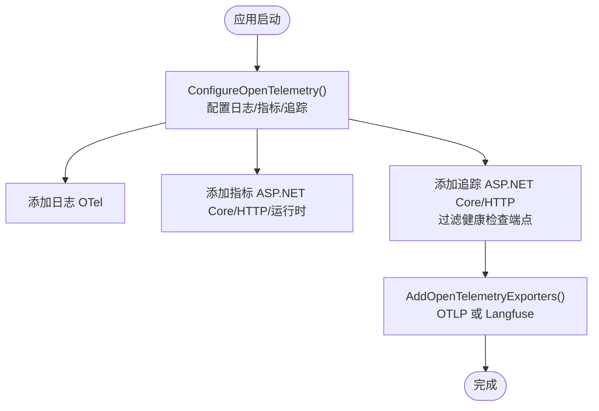

图表来源
- [Extensions.cs:49-115](file://Kingcrab.ServiceDefaults/Extensions.cs#L49-L115)

章节来源
- [Extensions.cs:49-115](file://Kingcrab.ServiceDefaults/Extensions.cs#L49-L115)

### 全局度量与追踪（Telemetry）
- 提供统一的 ActivitySource 与 Meter，内置直方图与计数器，命名空间遵循 openclaw 前缀。
- 已定义的指标包括工具执行时延直方图、限流超限计数器等。
- 支持注册可观察仪表（如审批队列深度），便于动态上报。

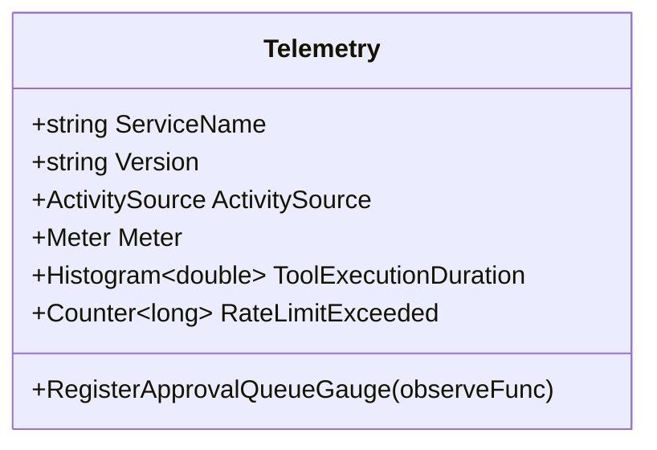

图表来源
- [Telemetry.cs:9-53](file://src/OpenClaw.Core/Observability/Telemetry.cs#L9-L53)

章节来源
- [Telemetry.cs:9-53](file://src/OpenClaw.Core/Observability/Telemetry.cs#L9-L53)

### 运行时度量（RuntimeMetrics）
- 轻量计数器/仪表，全部采用原子操作，线程安全。
- 暴露大量业务与系统指标，如请求总数、LLM 调用、令牌用量、工具调用与失败、会话缓存命中、保留清理等。
- 提供快照结构体，便于序列化与导出。

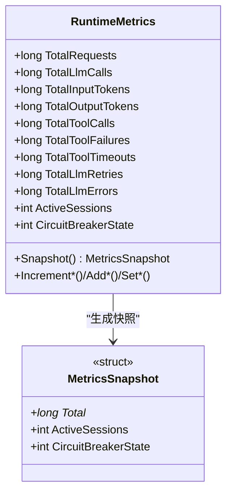

图表来源
- [RuntimeMetrics.cs:10-312](file://src/OpenClaw.Core/Observability/RuntimeMetrics.cs#L10-L312)

章节来源
- [RuntimeMetrics.cs:10-312](file://src/OpenClaw.Core/Observability/RuntimeMetrics.cs#L10-L312)

### 供应商用量统计（ProviderUsageTracker）
- 记录每个供应商/模型的请求数、重试、错误与输入/输出令牌用量。
- 支持最近回合用量记录与快照导出，便于审计与成本分析。

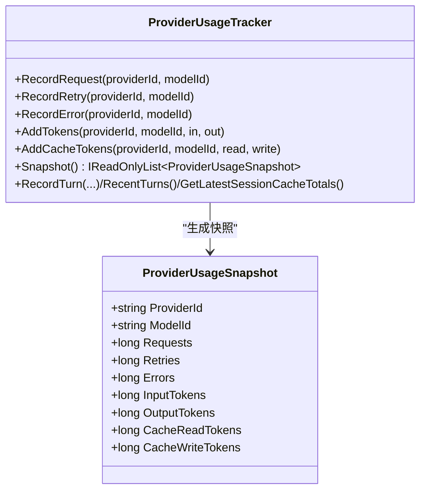

图表来源
- [ProviderUsageTracker.cs:7-176](file://src/OpenClaw.Core/Observability/ProviderUsageTracker.cs#L7-L176)

章节来源
- [ProviderUsageTracker.cs:7-176](file://src/OpenClaw.Core/Observability/ProviderUsageTracker.cs#L7-L176)

### 工具使用统计（ToolUsageTracker）
- 记录工具调用次数、失败与超时，并累计总耗时（毫秒）。
- 快照按调用次数降序排列，便于识别热点工具。

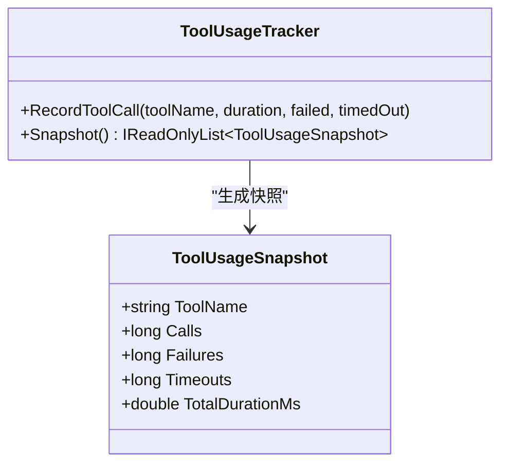

图表来源
- [ToolUsageTracker.cs:5-59](file://src/OpenClaw.Core/Observability/ToolUsageTracker.cs#L5-L59)

章节来源
- [ToolUsageTracker.cs:5-59](file://src/OpenClaw.Core/Observability/ToolUsageTracker.cs#L5-L59)

### 提示缓存用量（PromptCacheUsage）
- 从使用详情中提取缓存读取与写入令牌用量，支持合并多个来源。

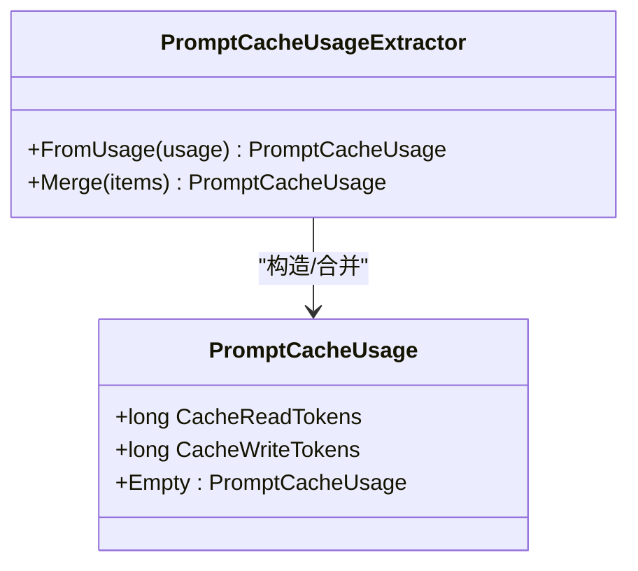

图表来源
- [PromptCacheUsage.cs:5-55](file://src/OpenClaw.Core/Observability/PromptCacheUsage.cs#L5-L55)

章节来源
- [PromptCacheUsage.cs:5-55](file://src/OpenClaw.Core/Observability/PromptCacheUsage.cs#L5-L55)

### 诊断端点与指标暴露
- /metrics：返回运行时度量快照（含活跃会话、断路器状态等）。
- /metrics/providers：返回供应商用量快照。
- /metrics/tools：返回工具使用快照。
- /health、/health/ready：健康检查端点，后者对就绪性进行更严格的校验。

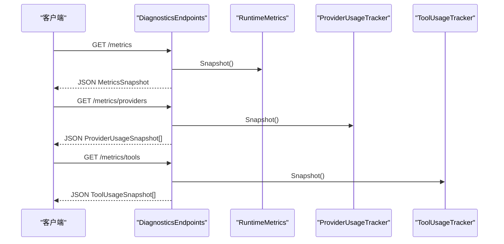

图表来源
- [DiagnosticsEndpoints.cs:68-93](file://src/OpenClaw.Gateway/Endpoints/DiagnosticsEndpoints.cs#L68-L93)
- [RuntimeMetrics.cs:192-250](file://src/OpenClaw.Core/Observability/RuntimeMetrics.cs#L192-L250)
- [ProviderUsageTracker.cs:40-45](file://src/OpenClaw.Core/Observability/ProviderUsageTracker.cs#L40-L45)
- [ToolUsageTracker.cs:28-40](file://src/OpenClaw.Core/Observability/ToolUsageTracker.cs#L28-L40)

章节来源
- [DiagnosticsEndpoints.cs:68-93](file://src/OpenClaw.Gateway/Endpoints/DiagnosticsEndpoints.cs#L68-L93)

### 可观测性汇总与序列化模型
- AdminObservabilityService 提供摘要与时间序列数据，用于仪表板展示与审计导出。
- 摘要卡片与系列点包含审批决策、自动化运行、提供商错误/重试、运行时事件、死信、活跃会话、渠道漂移、操作员动作等指标。
- 模型定义位于 OperatorGovernanceModels.cs，包含摘要卡、系列点与审计导出清单等类型。

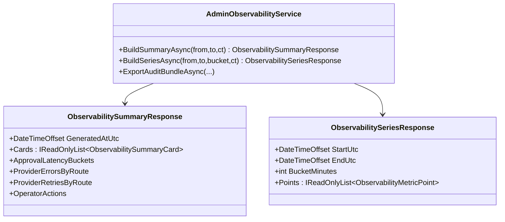

图表来源
- [AdminObservabilityService.cs:117-227](file://src/OpenClaw.Gateway/AdminObservabilityService.cs#L117-L227)
- [OperatorGovernanceModels.cs:344-449](file://src/OpenClaw.Core/Models/OperatorGovernanceModels.cs#L344-L449)

章节来源
- [AdminObservabilityService.cs:117-227](file://src/OpenClaw.Gateway/AdminObservabilityService.cs#L117-L227)
- [OperatorGovernanceModels.cs:344-449](file://src/OpenClaw.Core/Models/OperatorGovernanceModels.cs#L344-L449)

### 运行时脉冲与事件（RuntimePulseService）
- 定期生成心跳与运行时事件，限制消息大小与告警数量，确保可观测性信息可控。
- 与运行时度量协同，用于健康状态与异常告警的生成。

章节来源
- [RuntimePulseService.cs:16-38](file://src/OpenClaw.Gateway/RuntimePulseService.cs#L16-L38)

## 依赖关系分析
- 网关启动通过 Program.cs 注入服务默认扩展与诊断端点，形成“配置—服务—端点”的闭环。
- 诊断端点依赖运行时度量、供应商用量与工具用量三类统计，统一以 JSON 形式对外暴露。
- 服务默认扩展负责 OpenTelemetry 的日志、指标与追踪配置，并根据环境变量选择合适的导出器。

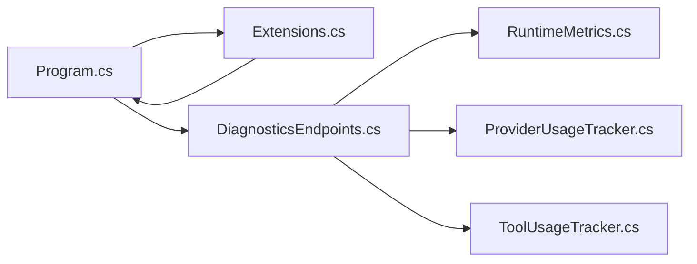

图表来源
- [Program.cs:66-91](file://src/OpenClaw.Gateway/Program.cs#L66-L91)
- [DiagnosticsEndpoints.cs:68-93](file://src/OpenClaw.Gateway/Endpoints/DiagnosticsEndpoints.cs#L68-L93)
- [Extensions.cs:49-115](file://Kingcrab.ServiceDefaults/Extensions.cs#L49-L115)

章节来源
- [Program.cs:66-91](file://src/OpenClaw.Gateway/Program.cs#L66-L91)
- [DiagnosticsEndpoints.cs:68-93](file://src/OpenClaw.Gateway/Endpoints/DiagnosticsEndpoints.cs#L68-L93)
- [Extensions.cs:49-115](file://Kingcrab.ServiceDefaults/Extensions.cs#L49-L115)

## 性能考量
- 运行时度量采用原子操作与易变读写，避免锁竞争，适合高并发场景。
- 工具用量累计总耗时使用双精度数值的位模式存储，保证线程安全累加。
- 供应商用量与最近回合记录使用并发集合与固定上限队列，控制内存占用。
- 诊断端点返回的 JSON 为快照结构，避免频繁分配。

章节来源
- [RuntimeMetrics.cs:129-187](file://src/OpenClaw.Core/Observability/RuntimeMetrics.cs#L129-L187)
- [ToolUsageTracker.cs:9-26](file://src/OpenClaw.Core/Observability/ToolUsageTracker.cs#L9-L26)
- [ProviderUsageTracker.cs:9-106](file://src/OpenClaw.Core/Observability/ProviderUsageTracker.cs#L9-L106)

## 故障排查指南
- 健康检查端点
  - /health：进程存活探针，无需认证。
  - /health/ready：运行时初始化就绪探针，内部访问会话管理器，异常时返回 503。
- 指标端点授权
  - /metrics、/metrics/providers、/metrics/tools 需要操作员身份认证，未授权返回 401。
- 单元测试验证
  - 观测性测试覆盖运行时度量的并发自增正确性与供应商用量快照聚合逻辑，可作为回归参考。

章节来源
- [DiagnosticsEndpoints.cs:32-93](file://src/OpenClaw.Gateway/Endpoints/DiagnosticsEndpoints.cs#L32-L93)
- [ObservabilityTests.cs:201-244](file://src/OpenClaw.Tests/ObservabilityTests.cs#L201-L244)

## 结论
本仓库已具备完善的 OpenTelemetry 基础设施与丰富的运行时度量，能够满足日志、指标与分布式追踪的采集需求。通过 /metrics 等端点，可直接对接 Prometheus 与 Grafana 实现可视化与告警。建议在生产环境中：
- 明确 OTLP/Langfuse 导出器配置，确保追踪与日志可靠落地；
- 将 /metrics 端点纳入 Prometheus 抓取范围，并建立关键业务指标的仪表板；
- 基于 AdminObservabilityService 的摘要与序列化模型，构建运营看板与审计导出流程；
- 结合 RuntimePulseService 与健康检查端点，完善健康与告警策略。

## 附录

### Prometheus 指标端点配置要点
- 端点：/metrics（运行时度量）、/metrics/providers（供应商用量）、/metrics/tools（工具用量）
- 认证：上述端点需要操作员身份认证，Prometheus 抓取需配合代理或在受控网络内进行。
- 指标命名：遵循 openclaw 前缀的直方图与计数器，便于统一归一化处理。

章节来源
- [DiagnosticsEndpoints.cs:68-93](file://src/OpenClaw.Gateway/Endpoints/DiagnosticsEndpoints.cs#L68-L93)
- [Telemetry.cs:28-40](file://src/OpenClaw.Core/Observability/Telemetry.cs#L28-L40)

### Grafana 仪表板与告警建议
- 仪表板建议维度
  - 性能：工具执行时延直方图、LLM 输入/输出令牌用量、会话活跃数。
  - 资源：CPU/内存/IO（来自运行时指标与系统指标）。
  - 业务：审批队列深度、自动化运行与失败、提供商错误/重试、操作员动作。
- 告警规则建议
  - 审批队列深度持续升高；
  - 工具失败率或超时率突增；
  - LLM 错误率或重试率异常；
  - 会话活跃数低于阈值或异常波动；
  - 运行时事件中错误/警告占比上升。

章节来源
- [Telemetry.cs:28-52](file://src/OpenClaw.Core/Observability/Telemetry.cs#L28-L52)
- [RuntimeMetrics.cs:129-250](file://src/OpenClaw.Core/Observability/RuntimeMetrics.cs#L129-L250)
- [AdminObservabilityService.cs:117-227](file://src/OpenClaw.Gateway/AdminObservabilityService.cs#L117-L227)