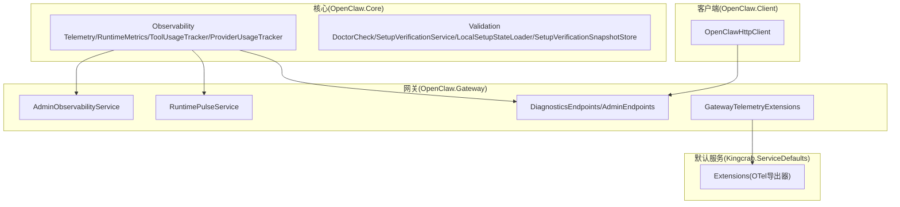
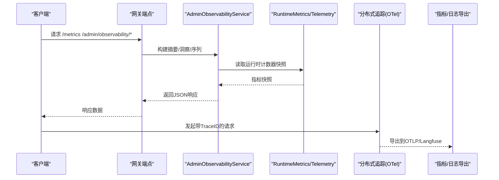
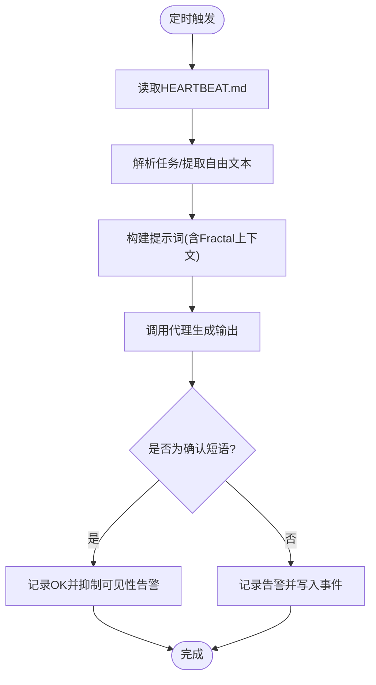
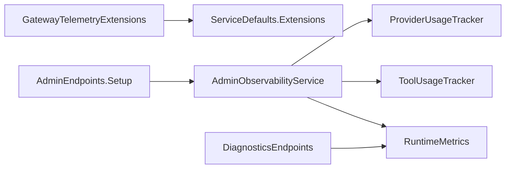

# 故障诊断

<cite>
**本文引用的文件**
- [Telemetry.cs](file://src/OpenClaw.Core/Observability/Telemetry.cs)
- [RuntimeMetrics.cs](file://src/OpenClaw.Core/Observability/RuntimeMetrics.cs)
- [ToolUsageTracker.cs](file://src/OpenClaw.Core/Observability/ToolUsageTracker.cs)
- [ProviderUsageTracker.cs](file://src/OpenClaw.Core/Observability/ProviderUsageTracker.cs)
- [DoctorCheck.cs](file://src/OpenClaw.Core/Validation/DoctorCheck.cs)
- [SetupVerificationService.cs](file://src/OpenClaw.Core/Validation/SetupVerificationService.cs)
- [LocalSetupStateLoader.cs](file://src/OpenClaw.Core/Validation/LocalSetupStateLoader.cs)
- [SetupVerificationSnapshotStore.cs](file://src/OpenClaw.Core/Validation/SetupVerificationSnapshotStore.cs)
- [AdminObservabilityService.cs](file://src/OpenClaw.Gateway/AdminObservabilityService.cs)
- [RuntimePulseService.cs](file://src/OpenClaw.Gateway/RuntimePulseService.cs)
- [DiagnosticsEndpoints.cs](file://src/OpenClaw.Gateway/Endpoints/DiagnosticsEndpoints.cs)
- [AdminEndpoints.Setup.cs](file://src/OpenClaw.Gateway/Endpoints/AdminEndpoints.Setup.cs)
- [OpenClawHttpClient.cs](file://src/OpenClaw.Client/OpenClawHttpClient.cs)
- [GatewayTelemetryExtensions.cs](file://src/OpenClaw.Gateway/Extensions/GatewayTelemetryExtensions.cs)
- [Extensions.cs](file://Kingcrab.ServiceDefaults/Extensions.cs)
- [GatewayConfig.cs](file://src/OpenClaw.Core/Models/GatewayConfig.cs)
- [StartupFailureReporter.cs](file://src/OpenClaw.Gateway/Bootstrap/StartupFailureReporter.cs)
- [HarnessContractService.cs](file://src/OpenClaw.Gateway/HarnessContractService.cs)
- [GatewayLlmExecutionService.cs](file://src/OpenClaw.Gateway/GatewayLlmExecutionService.cs)
- [MaintenanceCommands.cs](file://src/OpenClaw.Cli/MaintenanceCommands.cs)
- [TestingCommands.cs](file://src/OpenClaw.Cli/TestingCommands.cs)
</cite>

## 目录
1. [简介](#简介)
2. [项目结构](#项目结构)
3. [核心组件](#核心组件)
4. [架构总览](#架构总览)
5. [详细组件分析](#详细组件分析)
6. [依赖关系分析](#依赖关系分析)
7. [性能考量](#性能考量)
8. [故障排查指南](#故障排查指南)
9. [结论](#结论)
10. [附录](#附录)

## 简介
本指南面向运维与开发人员，提供系统性的故障诊断方法与工具使用说明。内容覆盖：
- 基于分布式追踪定位性能瓶颈与根因
- 日志与指标异常检测
- 系统状态检查与健康观测
- 常见问题的诊断步骤、性能调优建议与故障恢复策略
- 调试工具与监控仪表板的使用

## 项目结构
本项目围绕“网关（Gateway）+ 核心（Core）+ 客户端（Client）+ CLI”组织，观测与诊断能力主要分布在 Core 的可观测模块与 Gateway 的可观测服务、端点及遥测扩展中。

图示来源
- [Telemetry.cs:9-53](file://src/OpenClaw.Core/Observability/Telemetry.cs#L9-L53)
- [RuntimeMetrics.cs:10-311](file://src/OpenClaw.Core/Observability/RuntimeMetrics.cs#L10-L311)
- [AdminObservabilityService.cs:16-115](file://src/OpenClaw.Gateway/AdminObservabilityService.cs#L16-L115)
- [RuntimePulseService.cs:16-89](file://src/OpenClaw.Gateway/RuntimePulseService.cs#L16-L89)
- [DiagnosticsEndpoints.cs:51-80](file://src/OpenClaw.Gateway/Endpoints/DiagnosticsEndpoints.cs#L51-L80)
- [GatewayTelemetryExtensions.cs:12-51](file://src/OpenClaw.Gateway/Extensions/GatewayTelemetryExtensions.cs#L12-L51)
- [Extensions.cs:69-126](file://Kingcrab.ServiceDefaults/Extensions.cs#L69-L126)

章节来源
- [Telemetry.cs:9-53](file://src/OpenClaw.Core/Observability/Telemetry.cs#L9-L53)
- [RuntimeMetrics.cs:10-311](file://src/OpenClaw.Core/Observability/RuntimeMetrics.cs#L10-L311)
- [AdminObservabilityService.cs:16-115](file://src/OpenClaw.Gateway/AdminObservabilityService.cs#L16-L115)
- [RuntimePulseService.cs:16-89](file://src/OpenClaw.Gateway/RuntimePulseService.cs#L16-L89)
- [DiagnosticsEndpoints.cs:51-80](file://src/OpenClaw.Gateway/Endpoints/DiagnosticsEndpoints.cs#L51-L80)
- [GatewayTelemetryExtensions.cs:12-51](file://src/OpenClaw.Gateway/Extensions/GatewayTelemetryExtensions.cs#L12-L51)
- [Extensions.cs:69-126](file://Kingcrab.ServiceDefaults/Extensions.cs#L69-L126)

## 核心组件
- 分布式追踪与指标
  - 中央遥测入口：ActivitySource 与 Meter，提供工具执行时延、速率限制计数、审批队列深度等指标。
  - 指标导出：支持 OTLP 或 Langfuse 导出，便于接入外部监控平台。
- 运行时度量
  - 原子计数器与快照：请求总量、LLM 调用、令牌用量、工具调用与失败、进程生命周期、保留清理等。
- 观测服务
  - 运行脉搏（Runtime Pulse）：周期性生成“心跳”报告，支持告警与可见性控制。
  - 运维洞察（Admin Observability）：聚合审批、自动化、通道、运行事件、死信等数据，支持导出审计包与轨迹。
- 自检与验证
  - Doctor 模式：快速自检配置、工作区、安全基线、浏览器能力、运营准备度、模型选择、插件与 MCP 等。
  - 维护扫描与修复：可靠性评分、存储与提示预算分析、漂移检测与修复建议。
- 健康与指标端点
  - /health、/metrics、/metrics/providers、/admin/observability/* 等端点，供仪表板与告警系统消费。

章节来源
- [Telemetry.cs:9-53](file://src/OpenClaw.Core/Observability/Telemetry.cs#L9-L53)
- [RuntimeMetrics.cs:10-311](file://src/OpenClaw.Core/Observability/RuntimeMetrics.cs#L10-L311)
- [AdminObservabilityService.cs:16-115](file://src/OpenClaw.Gateway/AdminObservabilityService.cs#L16-L115)
- [RuntimePulseService.cs:16-89](file://src/OpenClaw.Gateway/RuntimePulseService.cs#L16-L89)
- [DoctorCheck.cs:9-38](file://src/OpenClaw.Core/Validation/DoctorCheck.cs#L9-L38)
- [SetupVerificationService.cs:46-164](file://src/OpenClaw.Core/Validation/SetupVerificationService.cs#L46-L164)
- [DiagnosticsEndpoints.cs:51-80](file://src/OpenClaw.Gateway/Endpoints/DiagnosticsEndpoints.cs#L51-L80)

## 架构总览
下图展示从客户端到网关、再到遥测与导出的整体链路，以及诊断与维护流程。

图示来源
- [AdminObservabilityService.cs:117-168](file://src/OpenClaw.Gateway/AdminObservabilityService.cs#L117-L168)
- [DiagnosticsEndpoints.cs:68-76](file://src/OpenClaw.Gateway/Endpoints/DiagnosticsEndpoints.cs#L68-L76)
- [GatewayTelemetryExtensions.cs:18-51](file://src/OpenClaw.Gateway/Extensions/GatewayTelemetryExtensions.cs#L18-L51)
- [Extensions.cs:84-115](file://Kingcrab.ServiceDefaults/Extensions.cs#L84-L115)

## 详细组件分析

### 分布式追踪与指标
- 遥测中心
  - 使用 ActivitySource 与 Meter 提供统一服务名与版本标识，注册工具执行时延直方图、速率限制计数、审批队列深度等指标。
- 指标导出
  - 默认启用 OTLP 导出；也可通过 Langfuse 公共端点进行导出，便于在可视化平台查看链路与指标。
- 实践要点
  - 在客户端或上游网关设置 TraceID，确保跨服务关联。
  - 关注 openclaw.tool.execution.duration 与 openclaw.ratelimit.exceeded，识别热点与限流瓶颈。

章节来源
- [Telemetry.cs:9-53](file://src/OpenClaw.Core/Observability/Telemetry.cs#L9-L53)
- [GatewayTelemetryExtensions.cs:18-51](file://src/OpenClaw.Gateway/Extensions/GatewayTelemetryExtensions.cs#L18-L51)
- [Extensions.cs:84-115](file://Kingcrab.ServiceDefaults/Extensions.cs#L84-L115)

### 运行时度量与健康端点
- 运行时度量
  - 原子计数器覆盖请求、LLM 调用、令牌用量、工具调用/失败/超时、会话缓存命中、保留清理、脉搏运行统计等。
  - 快照接口用于对外暴露当前状态，便于健康检查与仪表板。
- 健康端点
  - /health：快速判断服务可用性。
  - /metrics：返回运行时度量快照，含活跃会话数、熔断器状态等。
  - /metrics/providers：提供供应商路由维度的错误与重试统计。

章节来源
- [RuntimeMetrics.cs:10-311](file://src/OpenClaw.Core/Observability/RuntimeMetrics.cs#L10-L311)
- [DiagnosticsEndpoints.cs:51-80](file://src/OpenClaw.Gateway/Endpoints/DiagnosticsEndpoints.cs#L51-L80)

### 运行脉搏（Runtime Pulse）
- 功能概述
  - 周期性读取 HEARTBEAT.md，解析任务，构建提示词，调用代理生成“心跳”输出。
  - 若输出为确认短语则抑制可见性告警，否则记录告警并写入事件。
  - 支持隔离会话、轻量上下文、Fractal 内存上下文附加等。
- 适用场景
  - 自动化巡检、异常告警、可操作性提示与手动唤醒。
- 关键配置
  - 运行间隔、可见性策略、活跃时段、是否隔离会话、模型覆盖等。

图示来源
- [RuntimePulseService.cs:136-299](file://src/OpenClaw.Gateway/RuntimePulseService.cs#L136-L299)

章节来源
- [RuntimePulseService.cs:16-89](file://src/OpenClaw.Gateway/RuntimePulseService.cs#L16-L89)

### 运维观测与审计导出
- 观测能力
  - 审批决策、自动化失败、供应商错误/重试、死信、通道漂移、操作员动作等卡片与时间序列。
  - 支持按时间窗口聚合与桶化，便于趋势分析。
- 审计导出
  - 可导出操作员审计、运行事件、审批历史、供应商使用、死信、会话元数据等，支持治理数据可选包含。
  - 可导出会话轨迹 JSONL，支持匿名化与证据/治理数据包含选项。
- 端点访问
  - /admin/observability/summary、/admin/insights、/admin/observability/series、/admin/audit/export、/admin/audit/trajectory

章节来源
- [AdminObservabilityService.cs:117-307](file://src/OpenClaw.Gateway/AdminObservabilityService.cs#L117-L307)
- [AdminEndpoints.Setup.cs:224-269](file://src/OpenClaw.Gateway/Endpoints/AdminEndpoints.Setup.cs#L224-L269)

### 自检与维护（Doctor/维护扫描）
- Doctor 检查
  - 检查配置静态校验、有效配置源、提示词缓存兼容性、模型配置一致性、工作区就绪、文件系统根策略、安全基线、浏览器能力、运营准备度、模型医生、插件运行模式与依赖、MCP 服务器、通道、OpenSandbox 等。
  - 输出结构化报告，包含总体状态、失败/警告/跳过项与建议下一步。
- 维护扫描与修复
  - 扫描可靠性评分、存储与提示预算、漂移（重试/错误/降级/隔离）、评估与建议修复。
  - 支持干跑与应用修复，输出动作与警告。

章节来源
- [DoctorCheck.cs:9-38](file://src/OpenClaw.Core/Validation/DoctorCheck.cs#L9-L38)
- [SetupVerificationService.cs:83-164](file://src/OpenClaw.Core/Validation/SetupVerificationService.cs#L83-L164)
- [MaintenanceCommands.cs:10-113](file://src/OpenClaw.Cli/MaintenanceCommands.cs#L10-L113)

### 工具与供应商使用追踪
- 工具使用追踪
  - 记录工具调用次数、失败与超时、累计耗时，提供快照排序，便于识别慢工具与高失败率工具。
- 供应商使用追踪
  - 按供应商/模型聚合请求、重试、错误、输入/输出/缓存令牌用量，支持最近回合明细与会话缓存统计。

章节来源
- [ToolUsageTracker.cs:5-59](file://src/OpenClaw.Core/Observability/ToolUsageTracker.cs#L5-L59)
- [ProviderUsageTracker.cs:7-176](file://src/OpenClaw.Core/Observability/ProviderUsageTracker.cs#L7-L176)

## 依赖关系分析
- 遥测与导出
  - GatewayTelemetryExtensions 注入 OTLP/Langfuse 导出器，ServiceDefaults.Extensions 清理配置值并统一导出。
- 观测服务依赖
  - AdminObservabilityService 依赖运行时度量、工具使用追踪、会话管理、证据与治理服务等。
- 健康与指标端点
  - DiagnosticsEndpoints 与 AdminEndpoints.Setup.cs 提供受控访问的观测接口。

图示来源
- [GatewayTelemetryExtensions.cs:18-51](file://src/OpenClaw.Gateway/Extensions/GatewayTelemetryExtensions.cs#L18-L51)
- [Extensions.cs:84-115](file://Kingcrab.ServiceDefaults/Extensions.cs#L84-L115)
- [AdminObservabilityService.cs:23-53](file://src/OpenClaw.Gateway/AdminObservabilityService.cs#L23-L53)
- [DiagnosticsEndpoints.cs:68-76](file://src/OpenClaw.Gateway/Endpoints/DiagnosticsEndpoints.cs#L68-L76)
- [AdminEndpoints.Setup.cs:224-269](file://src/OpenClaw.Gateway/Endpoints/AdminEndpoints.Setup.cs#L224-L269)

章节来源
- [GatewayTelemetryExtensions.cs:18-51](file://src/OpenClaw.Gateway/Extensions/GatewayTelemetryExtensions.cs#L18-L51)
- [Extensions.cs:84-115](file://Kingcrab.ServiceDefaults/Extensions.cs#L84-L115)
- [AdminObservabilityService.cs:23-53](file://src/OpenClaw.Gateway/AdminObservabilityService.cs#L23-L53)
- [DiagnosticsEndpoints.cs:68-76](file://src/OpenClaw.Gateway/Endpoints/DiagnosticsEndpoints.cs#L68-L76)
- [AdminEndpoints.Setup.cs:224-269](file://src/OpenClaw.Gateway/Endpoints/AdminEndpoints.Setup.cs#L224-L269)

## 性能考量
- 指标与追踪
  - 使用 openclaw.tool.execution.duration 识别慢工具；结合速率限制计数(openclaw.ratelimit.exceeded)判断是否出现限流。
  - 通过 /metrics/providers 查看供应商路由的错误与重试分布，定位上游不稳定区域。
- 运行脉搏
  - 合理设置运行间隔与活跃时段，避免在高峰期造成额外负载。
  - 使用 Fractal 上下文时注意上下文大小限制，防止提示词超长导致成本与延迟上升。
- 存储与保留
  - 关注保留清理运行统计与失败计数，及时处理归档/删除异常，避免磁盘压力。

## 故障排查指南

### 一、启动失败与环境问题
- 现象
  - 启动阶段抛出异常，退出前未完成初始化。
- 排查步骤
  1) 查看启动失败报告，关注标题、详情与建议修复项。
  2) 检查存储路径权限、只读文件系统、端口占用等常见原因。
  3) 使用 Doctor 检查配置与环境，修正阻塞性问题后再启动。
- 相关实现
  - 启动失败报告渲染与建议；Doctor 自检；本地设置快照加载。

章节来源
- [StartupFailureReporter.cs:20-283](file://src/OpenClaw.Gateway/Bootstrap/StartupFailureReporter.cs#L20-L283)
- [DoctorCheck.cs:9-38](file://src/OpenClaw.Core/Validation/DoctorCheck.cs#L9-L38)
- [LocalSetupStateLoader.cs:13-68](file://src/OpenClaw.Core/Validation/LocalSetupStateLoader.cs#L13-L68)

### 二、健康与可用性
- 现象
  - /health 返回不可用；/metrics 无法访问或返回空。
- 排查步骤
  1) 确认认证与CSRF策略满足端点授权要求。
  2) 检查运行时度量是否正常更新（活跃会话数、熔断器状态）。
  3) 对比 /metrics 与 /metrics/providers 的错误/重试分布，定位上游异常。
- 相关实现
  - 健康端点与指标端点；运行时度量快照。

章节来源
- [DiagnosticsEndpoints.cs:51-80](file://src/OpenClaw.Gateway/Endpoints/DiagnosticsEndpoints.cs#L51-L80)
- [DiagnosticsEndpoints.cs:68-76](file://src/OpenClaw.Gateway/Endpoints/DiagnosticsEndpoints.cs#L68-L76)
- [RuntimeMetrics.cs:10-311](file://src/OpenClaw.Core/Observability/RuntimeMetrics.cs#L10-L311)

### 三、性能瓶颈与资源紧张
- 现象
  - 工具调用耗时长、失败率高；LLM 调用频繁重试；会话积压。
- 排查步骤
  1) 查看 openclaw.tool.execution.duration 分布，识别慢工具与异常峰值。
  2) 检查 openclaw.ratelimit.exceeded 与会话容量拒绝，评估限流策略与会话上限。
  3) 结合 /metrics/providers 的错误/重试，定位上游不稳定模型或端点。
  4) 评估提示预算与会话令牌配额，必要时启用估算准入控制。
- 相关实现
  - 遥测直方图与计数器；运行时度量；配置中的令牌预算与准入控制开关。

章节来源
- [Telemetry.cs:28-40](file://src/OpenClaw.Core/Observability/Telemetry.cs#L28-L40)
- [ToolUsageTracker.cs:5-59](file://src/OpenClaw.Core/Observability/ToolUsageTracker.cs#L5-L59)
- [ProviderUsageTracker.cs:40-106](file://src/OpenClaw.Core/Observability/ProviderUsageTracker.cs#L40-L106)
- [GatewayConfig.cs:53-78](file://src/OpenClaw.Core/Models/GatewayConfig.cs#L53-L78)

### 四、异常根因定位（分布式追踪）
- 步骤
  1) 在客户端或上游发起请求时携带 TraceID。
  2) 在遥测导出端（OTLP/Langfuse）检索该 TraceID，查看跨服务调用链。
  3) 结合 /metrics 与 /admin/observability/* 的指标与事件，定位异常发生的时间窗口与组件。
- 相关实现
  - ActivitySource 注册；OTLP/Langfuse 导出；客户端构建观测序列 URI。

章节来源
- [Telemetry.cs:17-23](file://src/OpenClaw.Core/Observability/Telemetry.cs#L17-L23)
- [GatewayTelemetryExtensions.cs:43-49](file://src/OpenClaw.Gateway/Extensions/GatewayTelemetryExtensions.cs#L43-L49)
- [Extensions.cs:84-115](file://Kingcrab.ServiceDefaults/Extensions.cs#L84-L115)
- [OpenClawHttpClient.cs:1467-1490](file://src/OpenClaw.Client/OpenClawHttpClient.cs#L1467-L1490)

### 五、通道与插件异常
- 现象
  - 通道不可用或漂移；插件需要审查或隔离。
- 排查步骤
  1) 使用 Doctor 检查通道与插件依赖。
  2) 查看通道漂移卡片与通道就绪状态。
  3) 关注插件需要审查数量与隔离数量。
- 相关实现
  - Doctor 检查项；通道就绪评估；插件桥接依赖检查。

章节来源
- [SetupVerificationService.cs:108-122](file://src/OpenClaw.Core/Validation/SetupVerificationService.cs#L108-L122)
- [AdminObservabilityService.cs:135-167](file://src/OpenClaw.Gateway/AdminObservabilityService.cs#L135-L167)

### 六、供应商错误与内容过滤
- 现象
  - 供应商返回错误或内容过滤标记。
- 排查步骤
  1) 通过供应商路由维度错误计数定位具体模型/端点。
  2) 使用失败分类辅助判断是否为内容过滤或上游限制。
- 相关实现
  - 供应商使用追踪；失败分类逻辑。

章节来源
- [ProviderUsageTracker.cs:40-106](file://src/OpenClaw.Core/Observability/ProviderUsageTracker.cs#L40-L106)
- [GatewayLlmExecutionService.cs:841-849](file://src/OpenClaw.Gateway/GatewayLlmExecutionService.cs#L841-L849)

### 七、高风险工具与治理
- 现象
  - 高风险工具调用或动作触发治理事件。
- 排查步骤
  1) 检查治理事件元数据（合约ID、状态、风险等级）。
  2) 结合证据与治理清单，评估处置与隔离策略。
- 相关实现
  - 治理事件追加；高风险判定逻辑。

章节来源
- [HarnessContractService.cs:228-250](file://src/OpenClaw.Gateway/HarnessContractService.cs#L228-L250)

### 八、可靠性与维护
- 现象
  - 可靠性评分下降、存储压力、提示预算异常。
- 排查步骤
  1) 使用维护扫描获取可靠性评分与建议。
  2) 按建议执行修复（干跑验证后应用），关注修复动作与警告。
- 相关实现
  - 维护扫描与修复命令；Doctor 报告渲染。

章节来源
- [MaintenanceCommands.cs:10-113](file://src/OpenClaw.Cli/MaintenanceCommands.cs#L10-L113)
- [DoctorCheck.cs:9-38](file://src/OpenClaw.Core/Validation/DoctorCheck.cs#L9-L38)

## 结论
通过“分布式追踪 + 指标 + 观测服务 + Doctor/维护扫描”的组合，可以形成从健康检查、异常定位到修复闭环的完整诊断体系。建议在生产环境中：
- 开启 OTLP/Langfuse 导出，统一采集与可视化
- 定期运行 Doctor 与维护扫描，保持系统健康
- 利用运行脉搏与观测端点，建立自动化巡检与告警
- 使用审计导出与轨迹导出，支撑合规与复盘

## 附录

### A. 常用端点与用途
- /health：健康检查
- /metrics：运行时度量快照
- /metrics/providers：供应商路由维度错误/重试
- /admin/observability/summary：卡片式摘要
- /admin/insights：运营洞察
- /admin/observability/series：时间序列
- /admin/audit/export：审计包导出
- /admin/audit/trajectory：轨迹导出

章节来源
- [DiagnosticsEndpoints.cs:51-80](file://src/OpenClaw.Gateway/Endpoints/DiagnosticsEndpoints.cs#L51-L80)
- [AdminEndpoints.Setup.cs:224-269](file://src/OpenClaw.Gateway/Endpoints/AdminEndpoints.Setup.cs#L224-L269)

### B. 关键指标速查
- openclaw.tool.execution.duration：工具执行时延（毫秒）
- openclaw.ratelimit.exceeded：速率限制阻断计数
- openclaw.approval.queue.depth：待审批队列深度（需注册观测量）

章节来源
- [Telemetry.cs:28-52](file://src/OpenClaw.Core/Observability/Telemetry.cs#L28-L52)

### C. 诊断命令速查
- openclaw maintenance scan/fix：维护扫描与修复
- openclaw test run/report/gates：测试场景运行与报告

章节来源
- [MaintenanceCommands.cs:10-113](file://src/OpenClaw.Cli/MaintenanceCommands.cs#L10-L113)
- [TestingCommands.cs:12-171](file://src/OpenClaw.Cli/TestingCommands.cs#L12-L171)