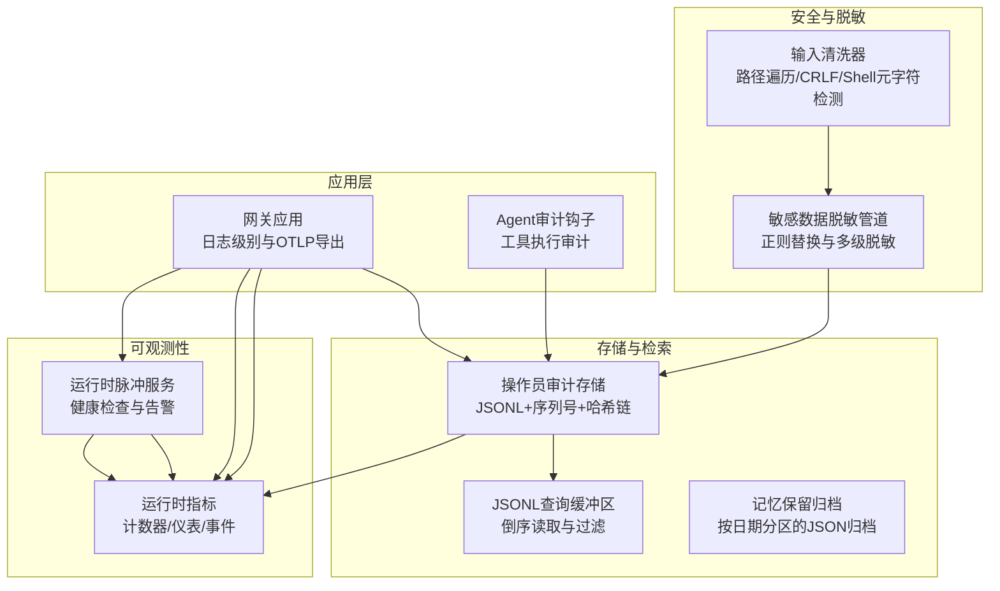
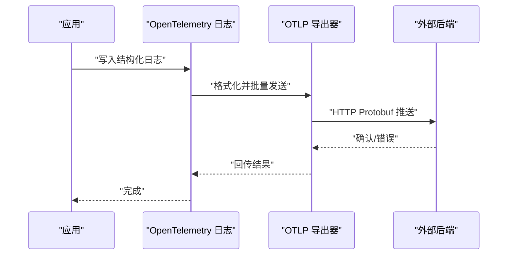
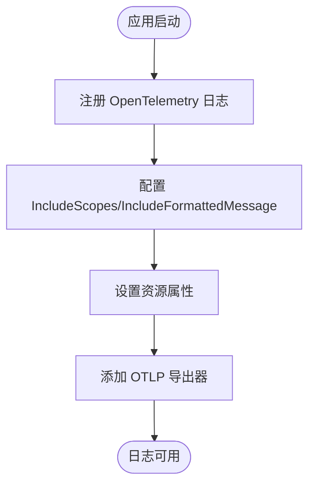
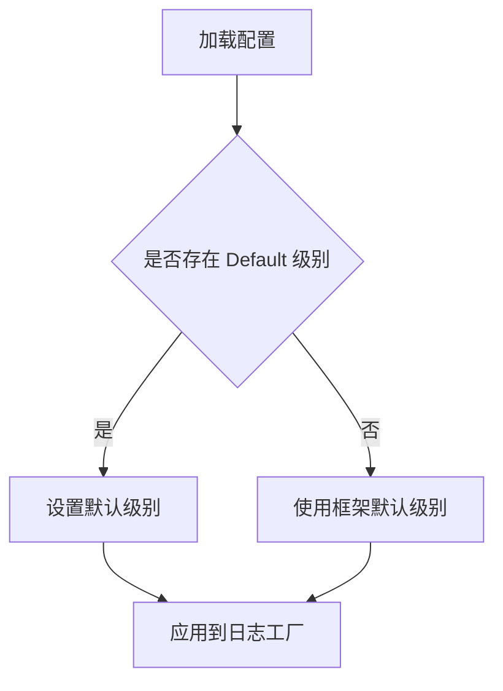
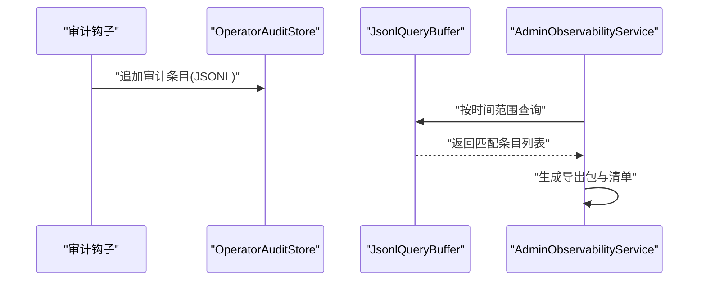
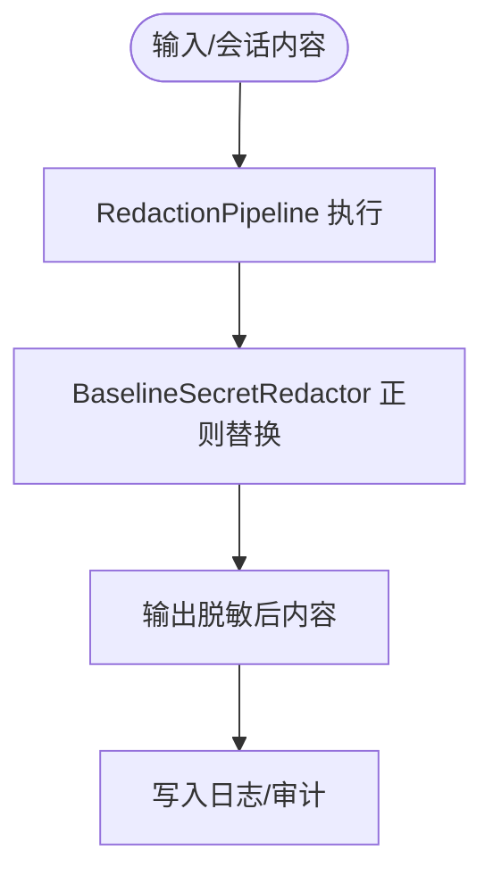
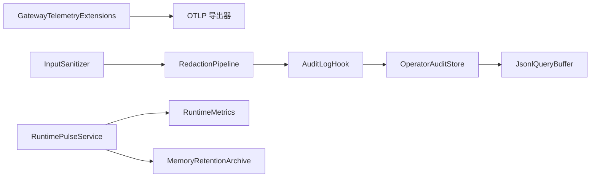

# 日志管理

<cite>
**本文引用的文件**
- [GatewayTelemetryExtensions.cs](file://src/OpenClaw.Gateway/Extensions/GatewayTelemetryExtensions.cs)
- [Extensions.cs](file://Kingcrab.ServiceDefaults/Extensions.cs)
- [appsettings.json](file://src/OpenClaw.Gateway/appsettings.json)
- [appsettings.Development.json](file://Kingcrab.AppHost/appsettings.Development.json)
- [appsettings.json](file://Kingcrab.AppHost/appsettings.json)
- [AuditLogHook.cs](file://src/OpenClaw.Agent/AuditLogHook.cs)
- [RedactionPipeline.cs](file://src/OpenClaw.Core/Security/RedactionPipeline.cs)
- [InputSanitizer.cs](file://src/OpenClaw.Core/Security/InputSanitizer.cs)
- [OperatorAuditStore.cs](file://src/OpenClaw.Gateway/OperatorAuditStore.cs)
- [JsonlQueryBuffer.cs](file://src/OpenClaw.Gateway/JsonlQueryBuffer.cs)
- [AdminObservabilityService.cs](file://src/OpenClaw.Gateway/AdminObservabilityService.cs)
- [MemoryRetentionArchive.cs](file://src/OpenClaw.Core/Memory/MemoryRetentionArchive.cs)
- [RuntimeMetrics.cs](file://src/OpenClaw.Core/Observability/RuntimeMetrics.cs)
- [RuntimePulseService.cs](file://src/OpenClaw.Gateway/RuntimePulseService.cs)
- [openclaw-memory-recall-and-retention.md](file://docs/openclaw-memory-recall-and-retention.md)
</cite>

## 目录
1. [简介](#简介)
2. [项目结构](#项目结构)
3. [核心组件](#核心组件)
4. [架构总览](#架构总览)
5. [详细组件分析](#详细组件分析)
6. [依赖关系分析](#依赖关系分析)
7. [性能考量](#性能考量)
8. [故障排查指南](#故障排查指南)
9. [结论](#结论)
10. [附录](#附录)

## 简介
本指南围绕 OpenTelemetry 日志采集、结构化日志格式与日志级别管理展开，结合项目中的实际实现，给出日志聚合、存储与检索方案，以及敏感信息脱敏、日志轮转与长期保存策略，并提供日志分析、搜索与告警配置的最佳实践。

## 项目结构
- 日志采集与导出通过 OpenTelemetry 在网关应用中统一配置，采用 OTLP 导出器对接外部后端。
- 应用日志级别通过配置文件集中管理；开发环境与生产环境分别提供默认级别设置。
- 审计日志以 JSONL 格式落盘，支持基于时间窗口的查询与导出。
- 敏感信息脱敏贯穿输入校验与会话内容处理，确保日志中不泄露密钥、令牌等敏感字段。
- 运行时脉冲服务负责周期性健康检查与告警生成，配套可观测指标用于监控与告警。

图表来源
- [GatewayTelemetryExtensions.cs:18-51](file://src/OpenClaw.Gateway/Extensions/GatewayTelemetryExtensions.cs#L18-L51)
- [appsettings.json:898-902](file://src/OpenClaw.Gateway/appsettings.json#L898-L902)
- [AuditLogHook.cs:10-62](file://src/OpenClaw.Agent/AuditLogHook.cs#L10-L62)
- [RedactionPipeline.cs:21-94](file://src/OpenClaw.Core/Security/RedactionPipeline.cs#L21-L94)
- [InputSanitizer.cs:9-84](file://src/OpenClaw.Core/Security/InputSanitizer.cs#L9-L84)
- [OperatorAuditStore.cs:10-95](file://src/OpenClaw.Gateway/OperatorAuditStore.cs#L10-L95)
- [JsonlQueryBuffer.cs:7-50](file://src/OpenClaw.Gateway/JsonlQueryBuffer.cs#L7-L50)
- [MemoryRetentionArchive.cs:7-77](file://src/OpenClaw.Core/Memory/MemoryRetentionArchive.cs#L7-L77)
- [RuntimeMetrics.cs:10-312](file://src/OpenClaw.Core/Observability/RuntimeMetrics.cs#L10-L312)
- [RuntimePulseService.cs:136-279](file://src/OpenClaw.Gateway/RuntimePulseService.cs#L136-L279)

章节来源
- [GatewayTelemetryExtensions.cs:18-51](file://src/OpenClaw.Gateway/Extensions/GatewayTelemetryExtensions.cs#L18-L51)
- [appsettings.json:898-902](file://src/OpenClaw.Gateway/appsettings.json#L898-L902)
- [appsettings.Development.json:1-8](file://Kingcrab.AppHost/appsettings.Development.json#L1-L8)
- [appsettings.json:1-9](file://Kingcrab.AppHost/appsettings.json#L1-L9)

## 核心组件
- OpenTelemetry 日志导出：在网关应用中启用 OpenTelemetry 日志记录，并配置 OTLP 导出器，默认导出到外部后端。
- 日志级别管理：通过 appsettings.json 中的 Logging:LogLevel.Default 设置默认级别；开发环境提供更细粒度的默认级别覆盖。
- 结构化日志：通过 IncludeFormattedMessage 与 IncludeScopes，确保日志包含结构化消息与作用域信息，便于下游解析。
- 审计日志存储：OperatorAuditStore 使用 JSONL 文件存储审计条目，支持序列号与哈希链保证顺序与完整性。
- 敏感信息脱敏：RedactionPipeline 与 BaselineSecretRedactor 提供多级正则替换，覆盖 Authorization、API Key、OpenAI Secret 等常见敏感字段。
- 输入清洗：InputSanitizer 对 Shell 元字符、CRLF、路径遍历等进行检测与清洗，降低注入风险。
- 运行时脉冲与指标：RuntimePulseService 周期性运行健康检查，生成告警事件；RuntimeMetrics 提供计数器与仪表，支撑监控与告警。

章节来源
- [GatewayTelemetryExtensions.cs:18-51](file://src/OpenClaw.Gateway/Extensions/GatewayTelemetryExtensions.cs#L18-L51)
- [appsettings.json:898-902](file://src/OpenClaw.Gateway/appsettings.json#L898-L902)
- [appsettings.Development.json:1-8](file://Kingcrab.AppHost/appsettings.Development.json#L1-L8)
- [appsettings.json:1-9](file://Kingcrab.AppHost/appsettings.json#L1-L9)
- [AuditLogHook.cs:10-62](file://src/OpenClaw.Agent/AuditLogHook.cs#L10-L62)
- [RedactionPipeline.cs:21-131](file://src/OpenClaw.Core/Security/RedactionPipeline.cs#L21-L131)
- [InputSanitizer.cs:9-84](file://src/OpenClaw.Core/Security/InputSanitizer.cs#L9-L84)
- [OperatorAuditStore.cs:10-195](file://src/OpenClaw.Gateway/OperatorAuditStore.cs#L10-L195)
- [RuntimeMetrics.cs:10-312](file://src/OpenClaw.Core/Observability/RuntimeMetrics.cs#L10-L312)
- [RuntimePulseService.cs:136-279](file://src/OpenClaw.Gateway/RuntimePulseService.cs#L136-L279)

## 架构总览
OpenTelemetry 日志在应用启动时注册，随后所有日志输出经由 OpenTelemetry SDK 处理并通过 OTLP 导出器发送到外部后端。应用侧的日志级别由配置文件控制，开发与生产环境分别提供默认级别。审计日志以 JSONL 形式落盘，支持基于时间范围的查询与导出。敏感信息在进入日志前经过多级脱敏与输入清洗。运行时脉冲服务定期生成健康检查与告警事件，配合指标系统实现监控与告警。

图表来源
- [GatewayTelemetryExtensions.cs:24-30](file://src/OpenClaw.Gateway/Extensions/GatewayTelemetryExtensions.cs#L24-L30)
- [Extensions.cs:84-115](file://Kingcrab.ServiceDefaults/Extensions.cs#L84-L115)

章节来源
- [GatewayTelemetryExtensions.cs:18-51](file://src/OpenClaw.Gateway/Extensions/GatewayTelemetryExtensions.cs#L18-L51)
- [Extensions.cs:69-115](file://Kingcrab.ServiceDefaults/Extensions.cs#L69-L115)

## 详细组件分析

### OpenTelemetry 日志配置与使用
- 在网关应用中通过 AddGatewayTelemetry 注册 OpenTelemetry 日志、指标与追踪，并启用 OTLP 导出器。
- 通过 IncludeScopes 与 IncludeFormattedMessage 确保日志具备结构化消息与作用域信息，便于下游解析与检索。
- 支持从配置中自动选择 OTLP 或 Langfuse 导出器，简化部署与切换。

图表来源
- [GatewayTelemetryExtensions.cs:18-30](file://src/OpenClaw.Gateway/Extensions/GatewayTelemetryExtensions.cs#L18-L30)

章节来源
- [GatewayTelemetryExtensions.cs:18-51](file://src/OpenClaw.Gateway/Extensions/GatewayTelemetryExtensions.cs#L18-L51)

### 日志级别管理
- 默认级别通过 appsettings.json 的 Logging:LogLevel.Default 控制。
- 开发环境 appsettings.Development.json 提供更严格的默认级别覆盖，减少无关噪声。
- 生产环境 appsettings.json 提供基础级别设置，避免过度日志输出。

图表来源
- [appsettings.json:898-902](file://src/OpenClaw.Gateway/appsettings.json#L898-L902)
- [appsettings.Development.json:1-8](file://Kingcrab.AppHost/appsettings.Development.json#L1-L8)
- [appsettings.json:1-9](file://Kingcrab.AppHost/appsettings.json#L1-L9)

章节来源
- [appsettings.json:898-902](file://src/OpenClaw.Gateway/appsettings.json#L898-L902)
- [appsettings.Development.json:1-8](file://Kingcrab.AppHost/appsettings.Development.json#L1-L8)
- [appsettings.json:1-9](file://Kingcrab.AppHost/appsettings.json#L1-L9)

### 结构化日志格式
- 通过 IncludeFormattedMessage 与 IncludeScopes，日志包含结构化消息与作用域信息，便于下游解析与检索。
- 建议在导出器中保持 JSON 格式以便于解析与可视化。

章节来源
- [GatewayTelemetryExtensions.cs:24-30](file://src/OpenClaw.Gateway/Extensions/GatewayTelemetryExtensions.cs#L24-L30)

### 审计日志存储与检索
- OperatorAuditStore 使用 JSONL 文件存储审计条目，支持序列号与哈希链保证顺序与完整性。
- JsonlQueryBuffer 提供基于时间范围与谓词的倒序读取能力，支持错误日志记录与限流。
- AdminObservabilityService 提供审计导出功能，支持按策略裁剪保留窗口与生成清单。

图表来源
- [AuditLogHook.cs:17-61](file://src/OpenClaw.Agent/AuditLogHook.cs#L17-L61)
- [OperatorAuditStore.cs:33-125](file://src/OpenClaw.Gateway/OperatorAuditStore.cs#L33-L125)
- [JsonlQueryBuffer.cs:9-49](file://src/OpenClaw.Gateway/JsonlQueryBuffer.cs#L9-L49)
- [AdminObservabilityService.cs:252-283](file://src/OpenClaw.Gateway/AdminObservabilityService.cs#L252-L283)

章节来源
- [OperatorAuditStore.cs:10-195](file://src/OpenClaw.Gateway/OperatorAuditStore.cs#L10-L195)
- [JsonlQueryBuffer.cs:7-50](file://src/OpenClaw.Gateway/JsonlQueryBuffer.cs#L7-L50)
- [AdminObservabilityService.cs:993-1034](file://src/OpenClaw.Gateway/AdminObservabilityService.cs#L993-L1034)

### 敏感信息脱敏与输入清洗
- RedactionPipeline 提供多级脱敏，逐级对字符串进行正则替换，覆盖 Authorization、API Key、OpenAI Secret 等常见敏感字段。
- BaselineSecretRedactor 使用正则表达式识别并替换敏感字段，确保日志中不出现明文敏感信息。
- InputSanitizer 对 Shell 元字符、CRLF、路径遍历等进行检测与清洗，降低注入风险。

图表来源
- [RedactionPipeline.cs:21-131](file://src/OpenClaw.Core/Security/RedactionPipeline.cs#L21-L131)
- [InputSanitizer.cs:9-84](file://src/OpenClaw.Core/Security/InputSanitizer.cs#L9-L84)

章节来源
- [RedactionPipeline.cs:21-131](file://src/OpenClaw.Core/Security/RedactionPipeline.cs#L21-L131)
- [InputSanitizer.cs:9-84](file://src/OpenClaw.Core/Security/InputSanitizer.cs#L9-L84)

### 日志聚合、存储与检索实施方案
- 聚合：通过 OTLP 导出器将日志发送到外部后端（如 Langfuse 或自建 OTLP 接收器），实现统一聚合。
- 存储：审计日志采用 JSONL 文件存储，按日期分区的归档策略用于长期保存。
- 检索：通过 JsonlQueryBuffer 基于时间范围与谓词进行高效检索；AdminObservabilityService 支持导出与保留窗口裁剪。

章节来源
- [Extensions.cs:84-115](file://Kingcrab.ServiceDefaults/Extensions.cs#L84-L115)
- [OperatorAuditStore.cs:10-195](file://src/OpenClaw.Gateway/OperatorAuditStore.cs#L10-L195)
- [JsonlQueryBuffer.cs:7-50](file://src/OpenClaw.Gateway/JsonlQueryBuffer.cs#L7-L50)
- [AdminObservabilityService.cs:993-1034](file://src/OpenClaw.Gateway/AdminObservabilityService.cs#L993-L1034)

### 日志轮转与长期保存策略
- JSONL 文件：OperatorAuditStore 以单文件追加方式写入，建议结合外部日志系统或文件系统层面的轮转策略。
- 归档：MemoryRetentionArchive 提供按日期分区的 JSON 归档，文件名包含时间戳并进行哈希编码，便于长期保存与检索。
- 清理：归档清理函数根据保留天数删除过期文件，并清理空目录。

章节来源
- [OperatorAuditStore.cs:10-195](file://src/OpenClaw.Gateway/OperatorAuditStore.cs#L10-L195)
- [MemoryRetentionArchive.cs:7-77](file://src/OpenClaw.Core/Memory/MemoryRetentionArchive.cs#L7-L77)
- [MemoryRetentionArchive.cs:79-166](file://src/OpenClaw.Core/Memory/MemoryRetentionArchive.cs#L79-L166)
- [openclaw-memory-recall-and-retention.md:171-176](file://docs/openclaw-memory-recall-and-retention.md#L171-L176)

### 日志分析、搜索与告警配置最佳实践
- 分析：利用 IncludeFormattedMessage 与 IncludeScopes 输出结构化日志，便于下游进行字段级分析与聚合。
- 搜索：在导出器侧或下游系统中建立基于时间、服务名、日志级别、作用域等维度的索引与查询。
- 告警：RuntimePulseService 周期性运行健康检查，生成告警事件；RuntimeMetrics 提供计数器与仪表，支撑阈值类告警。

章节来源
- [GatewayTelemetryExtensions.cs:24-30](file://src/OpenClaw.Gateway/Extensions/GatewayTelemetryExtensions.cs#L24-L30)
- [RuntimePulseService.cs:136-279](file://src/OpenClaw.Gateway/RuntimePulseService.cs#L136-L279)
- [RuntimeMetrics.cs:10-312](file://src/OpenClaw.Core/Observability/RuntimeMetrics.cs#L10-L312)

## 依赖关系分析
- 网关应用依赖 OpenTelemetry 日志扩展进行日志注册与导出。
- 审计钩子与 OperatorAuditStore 依赖 JSONL 解析与序列化上下文。
- 脱敏与输入清洗模块独立于日志系统，但前置到日志写入流程。
- 运行时脉冲服务与指标系统为告警与监控提供基础。

图表来源
- [GatewayTelemetryExtensions.cs:18-51](file://src/OpenClaw.Gateway/Extensions/GatewayTelemetryExtensions.cs#L18-L51)
- [AuditLogHook.cs:10-62](file://src/OpenClaw.Agent/AuditLogHook.cs#L10-L62)
- [OperatorAuditStore.cs:10-195](file://src/OpenClaw.Gateway/OperatorAuditStore.cs#L10-L195)
- [JsonlQueryBuffer.cs:7-50](file://src/OpenClaw.Gateway/JsonlQueryBuffer.cs#L7-L50)
- [RedactionPipeline.cs:21-131](file://src/OpenClaw.Core/Security/RedactionPipeline.cs#L21-L131)
- [InputSanitizer.cs:9-84](file://src/OpenClaw.Core/Security/InputSanitizer.cs#L9-L84)
- [RuntimePulseService.cs:136-279](file://src/OpenClaw.Gateway/RuntimePulseService.cs#L136-L279)
- [RuntimeMetrics.cs:10-312](file://src/OpenClaw.Core/Observability/RuntimeMetrics.cs#L10-L312)
- [MemoryRetentionArchive.cs:7-77](file://src/OpenClaw.Core/Memory/MemoryRetentionArchive.cs#L7-L77)

章节来源
- [GatewayTelemetryExtensions.cs:18-51](file://src/OpenClaw.Gateway/Extensions/GatewayTelemetryExtensions.cs#L18-L51)
- [AuditLogHook.cs:10-62](file://src/OpenClaw.Agent/AuditLogHook.cs#L10-L62)
- [OperatorAuditStore.cs:10-195](file://src/OpenClaw.Gateway/OperatorAuditStore.cs#L10-L195)
- [JsonlQueryBuffer.cs:7-50](file://src/OpenClaw.Gateway/JsonlQueryBuffer.cs#L7-L50)
- [RedactionPipeline.cs:21-131](file://src/OpenClaw.Core/Security/RedactionPipeline.cs#L21-L131)
- [InputSanitizer.cs:9-84](file://src/OpenClaw.Core/Security/InputSanitizer.cs#L9-L84)
- [RuntimePulseService.cs:136-279](file://src/OpenClaw.Gateway/RuntimePulseService.cs#L136-L279)
- [RuntimeMetrics.cs:10-312](file://src/OpenClaw.Core/Observability/RuntimeMetrics.cs#L10-L312)
- [MemoryRetentionArchive.cs:7-77](file://src/OpenClaw.Core/Memory/MemoryRetentionArchive.cs#L7-L77)

## 性能考量
- OTLP 导出器采用批量推送，建议在高吞吐场景下调整批量大小与并发参数以平衡延迟与带宽。
- JSONL 写入采用单文件追加，建议结合外部轮转策略或分片写入以避免单文件过大。
- 脱敏与输入清洗为 CPU 密集型操作，建议在必要路径上启用并缓存正则表达式以提升性能。
- 指标系统使用无锁计数器与易失读写，适合高频更新场景。

## 故障排查指南
- 日志未导出：检查 OTLP 端点配置与网络连通性；确认导出器初始化逻辑。
- 审计写入失败：查看 OperatorAuditStore 的异常捕获与指标增量，定位磁盘空间与权限问题。
- 查询异常：确认 JSONL 文件存在与格式正确；检查谓词与时间范围参数。
- 脉冲告警未触发：检查 RuntimePulseService 的配置与可见性设置；核对指标计数与最近告警列表。

章节来源
- [Extensions.cs:84-115](file://Kingcrab.ServiceDefaults/Extensions.cs#L84-L115)
- [OperatorAuditStore.cs:88-93](file://src/OpenClaw.Gateway/OperatorAuditStore.cs#L88-L93)
- [JsonlQueryBuffer.cs:41-45](file://src/OpenClaw.Gateway/JsonlQueryBuffer.cs#L41-L45)
- [RuntimePulseService.cs:136-279](file://src/OpenClaw.Gateway/RuntimePulseService.cs#L136-L279)

## 结论
通过 OpenTelemetry 统一日志采集与导出，结合结构化日志格式与严格日志级别管理，项目实现了可解析、可聚合的日志体系。审计日志采用 JSONL 与归档策略保障长期保存与检索效率；敏感信息脱敏与输入清洗有效降低了泄露风险。运行时脉冲与指标系统为监控与告警提供了坚实基础。建议在生产环境中完善外部日志系统的轮转与保留策略，并持续优化导出器参数与脱敏规则以适应业务增长。

## 附录
- 配置参考
  - 默认日志级别：参见 [appsettings.json:898-902](file://src/OpenClaw.Gateway/appsettings.json#L898-L902)
  - 开发环境默认级别：参见 [appsettings.Development.json:1-8](file://Kingcrab.AppHost/appsettings.Development.json#L1-L8)
  - 生产环境默认级别：参见 [appsettings.json:1-9](file://Kingcrab.AppHost/appsettings.json#L1-L9)
- 导出器配置：参见 [Extensions.cs:84-115](file://Kingcrab.ServiceDefaults/Extensions.cs#L84-L115)
- 审计导出与保留：参见 [AdminObservabilityService.cs:252-283](file://src/OpenClaw.Gateway/AdminObservabilityService.cs#L252-L283)
- 归档与清理：参见 [MemoryRetentionArchive.cs:7-77](file://src/OpenClaw.Core/Memory/MemoryRetentionArchive.cs#L7-L77) 与 [MemoryRetentionArchive.cs:79-166](file://src/OpenClaw.Core/Memory/MemoryRetentionArchive.cs#L79-L166)
- 文档参考：参见 [openclaw-memory-recall-and-retention.md:171-176](file://docs/openclaw-memory-recall-and-retention.md#L171-L176)