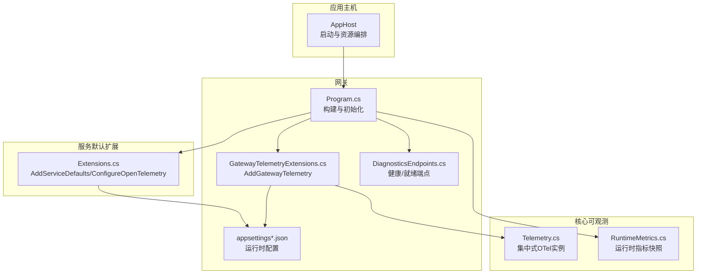
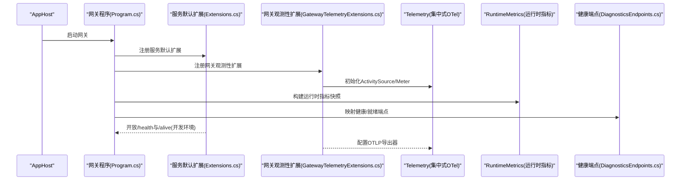
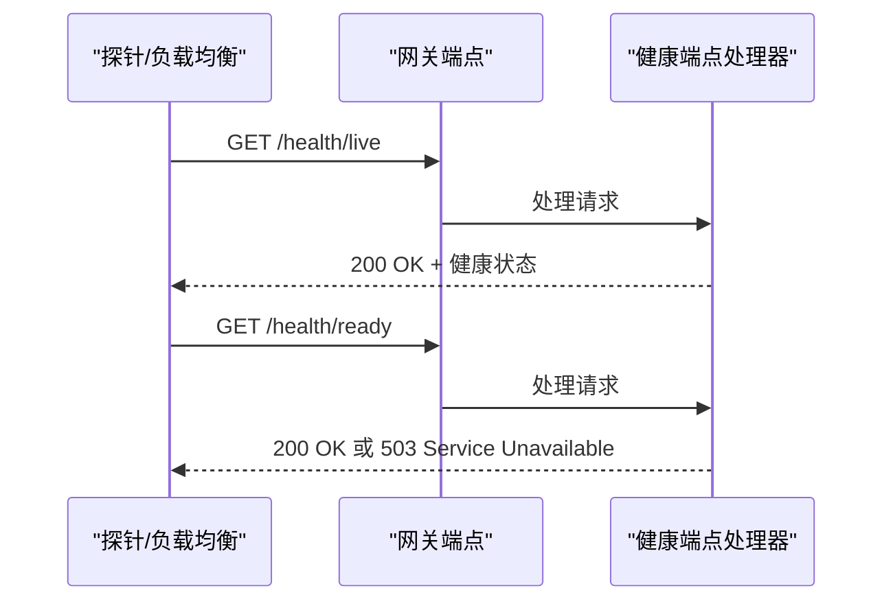
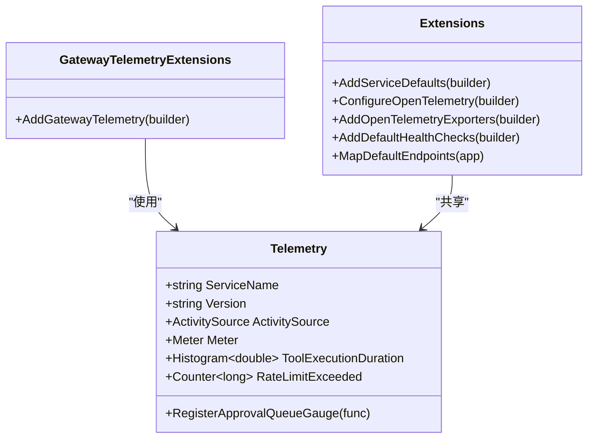
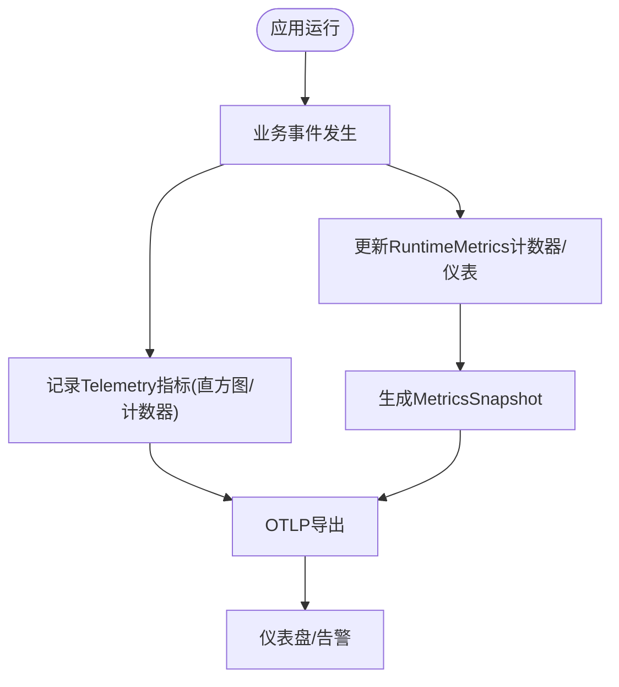
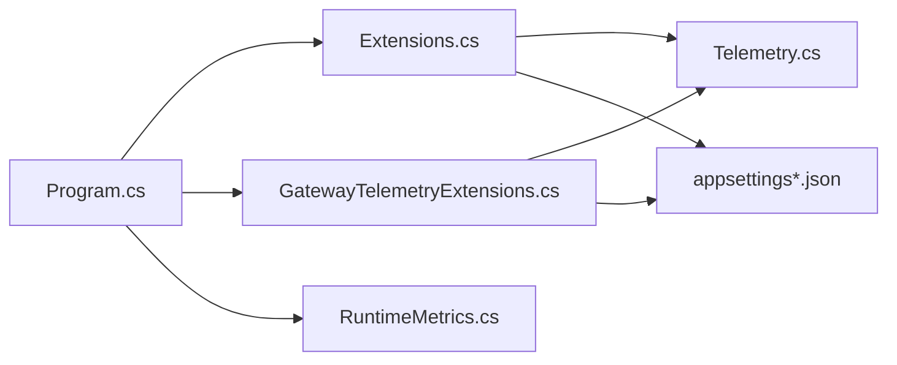

# 监控运维

<cite>
**本文引用的文件**
- [AppHost.cs](file://Kingcrab.AppHost/AppHost.cs)
- [Extensions.cs](file://Kingcrab.ServiceDefaults/Extensions.cs)
- [Telemetry.cs](file://src/OpenClaw.Core/Observability/Telemetry.cs)
- [RuntimeMetrics.cs](file://src/OpenClaw.Core/Observability/RuntimeMetrics.cs)
- [Program.cs](file://src/OpenClaw.Gateway/Program.cs)
- [GatewayTelemetryExtensions.cs](file://src/OpenClaw.Gateway/Extensions/GatewayTelemetryExtensions.cs)
- [appsettings.json](file://src/OpenClaw.Gateway/appsettings.json)
- [appsettings.Production.json](file://src/OpenClaw.Gateway/appsettings.Production.json)
- [DiagnosticsEndpoints.cs](file://src/OpenClaw.Gateway/Endpoints/DiagnosticsEndpoints.cs)
- [appsettings.Development.json](file://Kingcrab.AppHost/appsettings.Development.json)
- [appsettings.json](file://Kingcrab.AppHost/appsettings.json)
</cite>

## 目录
1. [简介](#简介)
2. [项目结构](#项目结构)
3. [核心组件](#核心组件)
4. [架构总览](#架构总览)
5. [详细组件分析](#详细组件分析)
6. [依赖关系分析](#依赖关系分析)
7. [性能考量](#性能考量)
8. [故障排查指南](#故障排查指南)
9. [结论](#结论)
10. [附录](#附录)

## 简介
本指南面向监控运维场景，围绕应用监控、性能指标采集与日志管理，系统阐述在本项目中的配置与最佳实践。重点覆盖以下方面：
- 健康检查与就绪探针的实现与安全发布策略
- 性能指标（计数器、直方图、可观测仪表盘）的采集与导出
- 日志与分布式追踪（OpenTelemetry）的集成与导出
- 告警配置与故障诊断流程
- 容器化部署下的资源与业务指标监控建议

## 项目结构
本项目采用多项目分层组织，监控相关能力主要分布在服务默认扩展、网关程序入口、核心可观测模块与配置文件中：
- 服务默认扩展：统一注入健康检查、OpenTelemetry（日志、指标、追踪）与服务发现
- 网关程序入口：注册自定义观测性扩展与端点映射
- 核心可观测模块：集中式 ActivitySource/Meter 与运行时指标快照
- 配置文件：生产/开发环境的日志级别、绑定地址、导出端点等

**图表来源**
- [AppHost.cs:1-25](file://Kingcrab.AppHost/AppHost.cs#L1-L25)
- [Extensions.cs:18-82](file://Kingcrab.ServiceDefaults/Extensions.cs#L18-L82)
- [Program.cs:50-96](file://src/OpenClaw.Gateway/Program.cs#L50-L96)
- [GatewayTelemetryExtensions.cs:18-51](file://src/OpenClaw.Gateway/Extensions/GatewayTelemetryExtensions.cs#L18-L51)
- [Telemetry.cs:9-53](file://src/OpenClaw.Core/Observability/Telemetry.cs#L9-L53)
- [RuntimeMetrics.cs:10-251](file://src/OpenClaw.Core/Observability/RuntimeMetrics.cs#L10-L251)
- [DiagnosticsEndpoints.cs:32-55](file://src/OpenClaw.Gateway/Endpoints/DiagnosticsEndpoints.cs#L32-L55)

**章节来源**
- [AppHost.cs:1-25](file://Kingcrab.AppHost/AppHost.cs#L1-L25)
- [Extensions.cs:18-82](file://Kingcrab.ServiceDefaults/Extensions.cs#L18-L82)
- [Program.cs:50-96](file://src/OpenClaw.Gateway/Program.cs#L50-L96)
- [GatewayTelemetryExtensions.cs:18-51](file://src/OpenClaw.Gateway/Extensions/GatewayTelemetryExtensions.cs#L18-L51)
- [Telemetry.cs:9-53](file://src/OpenClaw.Core/Observability/Telemetry.cs#L9-L53)
- [RuntimeMetrics.cs:10-251](file://src/OpenClaw.Core/Observability/RuntimeMetrics.cs#L10-L251)
- [DiagnosticsEndpoints.cs:32-55](file://src/OpenClaw.Gateway/Endpoints/DiagnosticsEndpoints.cs#L32-L55)

## 核心组件
- 服务默认扩展（AddServiceDefaults/ConfigureOpenTelemetry）
  - 注入健康检查端点（/health、/alive），仅在开发环境公开
  - 启用 OpenTelemetry 日志、指标与追踪，并自动添加 ASP.NET Core、HTTP 客户端与运行时指标
  - 支持通过环境变量选择 OTLP 或 Langfuse 导出器
- 网关观测性扩展（AddGatewayTelemetry）
  - 使用 ResourceBuilder 指定服务名与版本
  - 显式启用 OTLP 导出器，注册 ASP.NET Core、HTTP 客户端与运行时指标，并暴露自定义 Meter
- 集中式 Telemetry 实例
  - 提供 ActivitySource 与 Meter，定义工具执行时延直方图、限流超限计数器与审批队列可观测量
- 运行时指标快照（RuntimeMetrics）
  - 提供线程安全的计数器与仪表（Interlocked/Volatile），用于健康端点与仪表盘展示
- 健康/就绪端点
  - /health 返回基础健康状态与运行时信息；/health/live 与 /health/ready 提供存活与就绪探针

**章节来源**
- [Extensions.cs:23-47](file://Kingcrab.ServiceDefaults/Extensions.cs#L23-L47)
- [Extensions.cs:49-82](file://Kingcrab.ServiceDefaults/Extensions.cs#L49-L82)
- [Extensions.cs:84-115](file://Kingcrab.ServiceDefaults/Extensions.cs#L84-L115)
- [Extensions.cs:119-126](file://Kingcrab.ServiceDefaults/Extensions.cs#L119-L126)
- [Extensions.cs:128-145](file://Kingcrab.ServiceDefaults/Extensions.cs#L128-L145)
- [GatewayTelemetryExtensions.cs:18-51](file://src/OpenClaw.Gateway/Extensions/GatewayTelemetryExtensions.cs#L18-L51)
- [Telemetry.cs:9-53](file://src/OpenClaw.Core/Observability/Telemetry.cs#L9-L53)
- [RuntimeMetrics.cs:10-251](file://src/OpenClaw.Core/Observability/RuntimeMetrics.cs#L10-L251)
- [DiagnosticsEndpoints.cs:32-55](file://src/OpenClaw.Gateway/Endpoints/DiagnosticsEndpoints.cs#L32-L55)

## 架构总览
下图展示了从应用启动到健康检查、指标与日志导出的整体流程。

**图表来源**
- [AppHost.cs:16-24](file://Kingcrab.AppHost/AppHost.cs#L16-L24)
- [Program.cs:50-96](file://src/OpenClaw.Gateway/Program.cs#L50-L96)
- [Extensions.cs:23-47](file://Kingcrab.ServiceDefaults/Extensions.cs#L23-L47)
- [GatewayTelemetryExtensions.cs:18-51](file://src/OpenClaw.Gateway/Extensions/GatewayTelemetryExtensions.cs#L18-L51)
- [Telemetry.cs:9-53](file://src/OpenClaw.Core/Observability/Telemetry.cs#L9-L53)
- [RuntimeMetrics.cs:10-251](file://src/OpenClaw.Core/Observability/RuntimeMetrics.cs#L10-L251)
- [DiagnosticsEndpoints.cs:32-55](file://src/OpenClaw.Gateway/Endpoints/DiagnosticsEndpoints.cs#L32-L55)

## 详细组件分析

### 健康检查与就绪探针
- 端点设计
  - /health：返回基础健康状态与运行时信息（如启动时间等）
  - /health/live：存活探针，用于负载均衡或容器编排
  - /health/ready：就绪探针，需确保会话管理器可用后才对外提供流量
- 安全发布策略
  - 默认仅在开发环境开放 /health 与 /alive 端点；生产环境建议通过反向代理或平台探针访问
- 端点映射与授权
  - 健康端点由网关端点映射注册，部分端点支持操作员授权校验

**图表来源**
- [DiagnosticsEndpoints.cs:32-55](file://src/OpenClaw.Gateway/Endpoints/DiagnosticsEndpoints.cs#L32-L55)

**章节来源**
- [Extensions.cs:128-145](file://Kingcrab.ServiceDefaults/Extensions.cs#L128-L145)
- [DiagnosticsEndpoints.cs:32-55](file://src/OpenClaw.Gateway/Endpoints/DiagnosticsEndpoints.cs#L32-L55)

### OpenTelemetry 集成（日志、指标、追踪）
- 服务默认扩展
  - 日志：启用 OpenTelemetry 日志记录，包含格式化消息与作用域
  - 指标：自动采集 ASP.NET Core、HTTP 客户端与运行时指标
  - 追踪：自动采集 ASP.NET Core、HTTP 客户端与特定来源（应用名与 OpenClaw.*）
  - 导出器：优先使用 OTLP 环境变量配置；若未配置则尝试 Langfuse 导出器
- 网关观测性扩展
  - 使用 ResourceBuilder 指定服务名与版本
  - 显式启用 OTLP 导出器，注册 ASP.NET Core、HTTP 客户端与运行时指标，并暴露自定义 Meter
  - 自定义 Meter 名称为 OpenClaw.Gateway，承载业务指标（如工具执行时延、限流超限）

**图表来源**
- [Telemetry.cs:9-53](file://src/OpenClaw.Core/Observability/Telemetry.cs#L9-L53)
- [GatewayTelemetryExtensions.cs:18-51](file://src/OpenClaw.Gateway/Extensions/GatewayTelemetryExtensions.cs#L18-L51)
- [Extensions.cs:23-47](file://Kingcrab.ServiceDefaults/Extensions.cs#L23-L47)
- [Extensions.cs:49-82](file://Kingcrab.ServiceDefaults/Extensions.cs#L49-L82)
- [Extensions.cs:84-115](file://Kingcrab.ServiceDefaults/Extensions.cs#L84-L115)

**章节来源**
- [Extensions.cs:49-82](file://Kingcrab.ServiceDefaults/Extensions.cs#L49-L82)
- [Extensions.cs:84-115](file://Kingcrab.ServiceDefaults/Extensions.cs#L84-L115)
- [GatewayTelemetryExtensions.cs:18-51](file://src/OpenClaw.Gateway/Extensions/GatewayTelemetryExtensions.cs#L18-L51)
- [Telemetry.cs:9-53](file://src/OpenClaw.Core/Observability/Telemetry.cs#L9-L53)

### 运行时指标与业务指标
- 运行时指标（RuntimeMetrics）
  - 提供线程安全的计数器与仪表，包括请求总量、LLM 调用次数、令牌用量、工具调用与失败、会话缓存命中、提示词缓存、脉冲运行统计等
  - 通过快照结构导出，便于健康端点与仪表盘消费
- 业务指标（自定义 Meter）
  - 工具执行时延直方图：按工具名与成功/失败标签聚合
  - 限流超限计数器：按行为类型与策略标签统计
  - 审批队列深度可观测量：注册可观察仪表，反映待审批请求数

**图表来源**
- [RuntimeMetrics.cs:10-251](file://src/OpenClaw.Core/Observability/RuntimeMetrics.cs#L10-L251)
- [Telemetry.cs:25-52](file://src/OpenClaw.Core/Observability/Telemetry.cs#L25-L52)

**章节来源**
- [RuntimeMetrics.cs:10-251](file://src/OpenClaw.Core/Observability/RuntimeMetrics.cs#L10-L251)
- [Telemetry.cs:25-52](file://src/OpenClaw.Core/Observability/Telemetry.cs#L25-L52)

### 配置与部署要点
- 生产环境绑定与日志级别
  - 绑定地址与端口：生产环境默认监听 0.0.0.0
  - 日志级别：对关键命名空间进行信息级及以上控制
- 网关配置
  - 绑定地址、端口、认证令牌、LLM 参数、内存与保留策略、工具与插件策略等
- 导出器配置
  - 通过环境变量 OTEL_EXPORTER_OTLP_ENDPOINT 启用 OTLP 导出
  - 若未配置 OTLP，则可使用 Langfuse 导出器（需提供主机、公钥与密钥）

**章节来源**
- [appsettings.Production.json:1-65](file://src/OpenClaw.Gateway/appsettings.Production.json#L1-L65)
- [appsettings.json:1-908](file://src/OpenClaw.Gateway/appsettings.json#L1-L908)
- [Extensions.cs:84-115](file://Kingcrab.ServiceDefaults/Extensions.cs#L84-L115)

## 依赖关系分析
- 组件耦合
  - 网关程序依赖服务默认扩展与网关观测性扩展，以统一注入健康检查与 OTel 能力
  - Telemetry 作为集中式实例被网关观测性扩展与服务默认扩展共享
  - 运行时指标快照为健康端点与仪表盘提供数据支撑
- 外部依赖
  - OTLP 导出器：可对接 Prometheus、Grafana、OpenTelemetry Collector 等生态组件
  - Langfuse 导出器：在未配置 OTLP 时作为替代方案

**图表来源**
- [Program.cs:50-96](file://src/OpenClaw.Gateway/Program.cs#L50-L96)
- [Extensions.cs:23-47](file://Kingcrab.ServiceDefaults/Extensions.cs#L23-L47)
- [GatewayTelemetryExtensions.cs:18-51](file://src/OpenClaw.Gateway/Extensions/GatewayTelemetryExtensions.cs#L18-L51)
- [Telemetry.cs:9-53](file://src/OpenClaw.Core/Observability/Telemetry.cs#L9-L53)
- [RuntimeMetrics.cs:10-251](file://src/OpenClaw.Core/Observability/RuntimeMetrics.cs#L10-L251)

**章节来源**
- [Program.cs:50-96](file://src/OpenClaw.Gateway/Program.cs#L50-L96)
- [Extensions.cs:23-47](file://Kingcrab.ServiceDefaults/Extensions.cs#L23-L47)
- [GatewayTelemetryExtensions.cs:18-51](file://src/OpenClaw.Gateway/Extensions/GatewayTelemetryExtensions.cs#L18-L51)
- [Telemetry.cs:9-53](file://src/OpenClaw.Core/Observability/Telemetry.cs#L9-L53)
- [RuntimeMetrics.cs:10-251](file://src/OpenClaw.Core/Observability/RuntimeMetrics.cs#L10-L251)

## 性能考量
- 指标采集开销
  - 运行时指标使用 Interlocked 与 Volatile，避免锁竞争，适合高并发场景
  - 自定义 Meter 的直方图与计数器应合理设置标签维度，避免指标爆炸
- 导出器选择
  - 在容器化与云原生环境中优先使用 OTLP，便于与 OpenTelemetry Collector 协同
  - Langfuse 导出器适用于需要可视化与调试的场景
- 健康检查与探针
  - 就绪探针应避免强依赖外部系统；若依赖内部组件，需确保其初始化完成后再标记就绪

[本节为通用指导，无需“章节来源”]

## 故障排查指南
- 健康检查失败
  - 使用 /health/live 与 /health/ready 快速判断进程存活与运行时就绪状态
  - 若就绪失败，检查会话管理器初始化与关键依赖是否可用
- 日志与追踪
  - 开发环境可直接访问 /health 查看健康状态；生产环境建议通过平台探针或反向代理
  - 确认 OTLP/Langfuse 导出器配置正确，网络连通性正常
- 指标异常
  - 关注工具执行时延直方图与限流超限计数器，定位瓶颈与策略问题
  - 通过运行时指标快照核对请求量、错误率与会话状态变化趋势

**章节来源**
- [DiagnosticsEndpoints.cs:32-55](file://src/OpenClaw.Gateway/Endpoints/DiagnosticsEndpoints.cs#L32-L55)
- [Extensions.cs:128-145](file://Kingcrab.ServiceDefaults/Extensions.cs#L128-L145)
- [Telemetry.cs:25-52](file://src/OpenClaw.Core/Observability/Telemetry.cs#L25-L52)
- [RuntimeMetrics.cs:10-251](file://src/OpenClaw.Core/Observability/RuntimeMetrics.cs#L10-L251)

## 结论
本项目通过服务默认扩展与网关观测性扩展，实现了统一的健康检查、日志、指标与追踪能力，并提供了集中式的 Telemetry 实例与运行时指标快照。结合生产环境配置与导出器选择，可快速落地 Prometheus、Grafana 与 OpenTelemetry 生态的监控体系。建议在容器化部署中优先使用 OTLP 导出器，并配合就绪探针保障流量接入的稳定性。

[本节为总结性内容，无需“章节来源”]

## 附录
- 健康端点示例响应字段
  - status：健康状态字符串
  - uptime：进程运行时长（毫秒）
- 生产环境关键配置项
  - 绑定地址与端口、日志级别、内存与保留策略、工具与插件策略、会话并发限制与超时

**章节来源**
- [DiagnosticsEndpoints.cs:32-55](file://src/OpenClaw.Gateway/Endpoints/DiagnosticsEndpoints.cs#L32-L55)
- [appsettings.Production.json:1-65](file://src/OpenClaw.Gateway/appsettings.Production.json#L1-L65)
- [appsettings.json:1-908](file://src/OpenClaw.Gateway/appsettings.json#L1-L908)