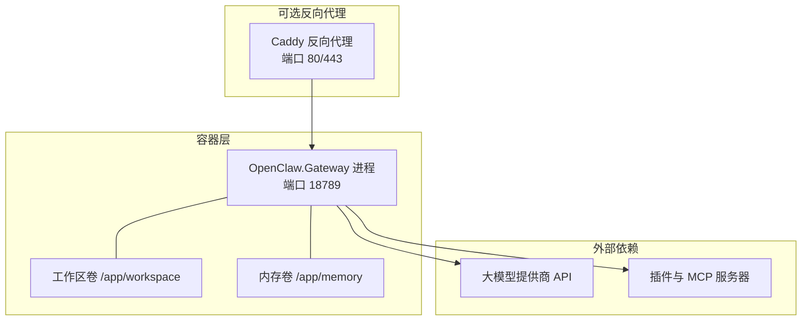
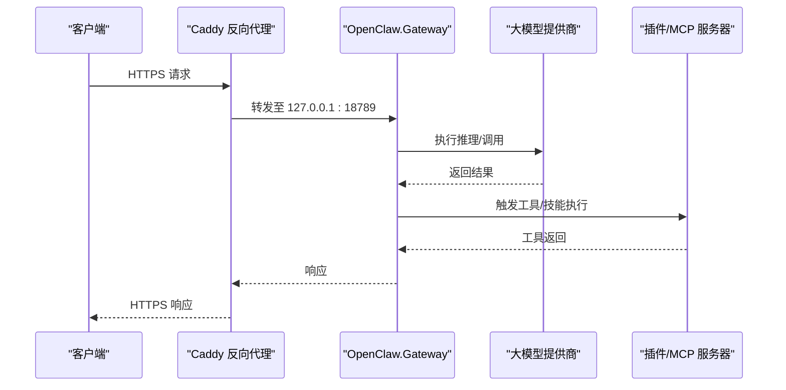
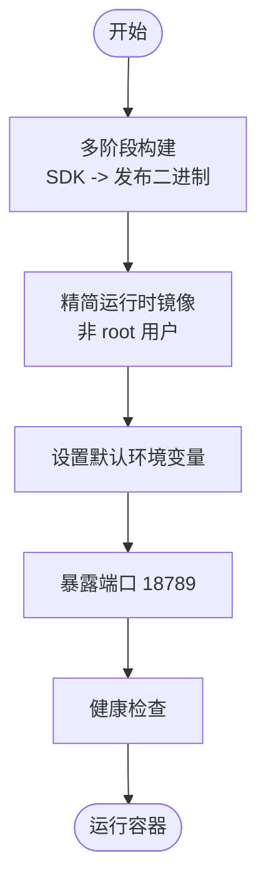
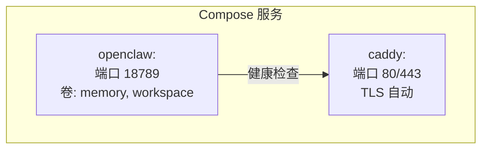
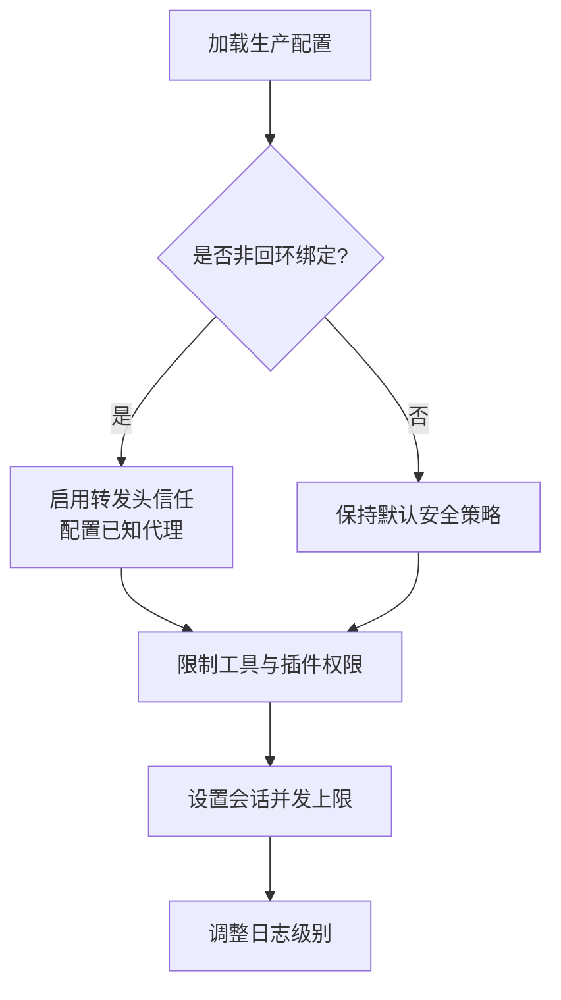
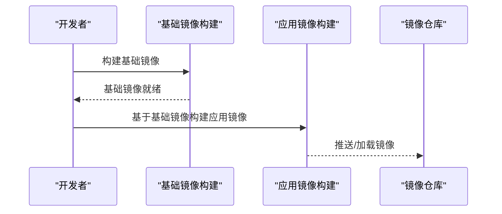
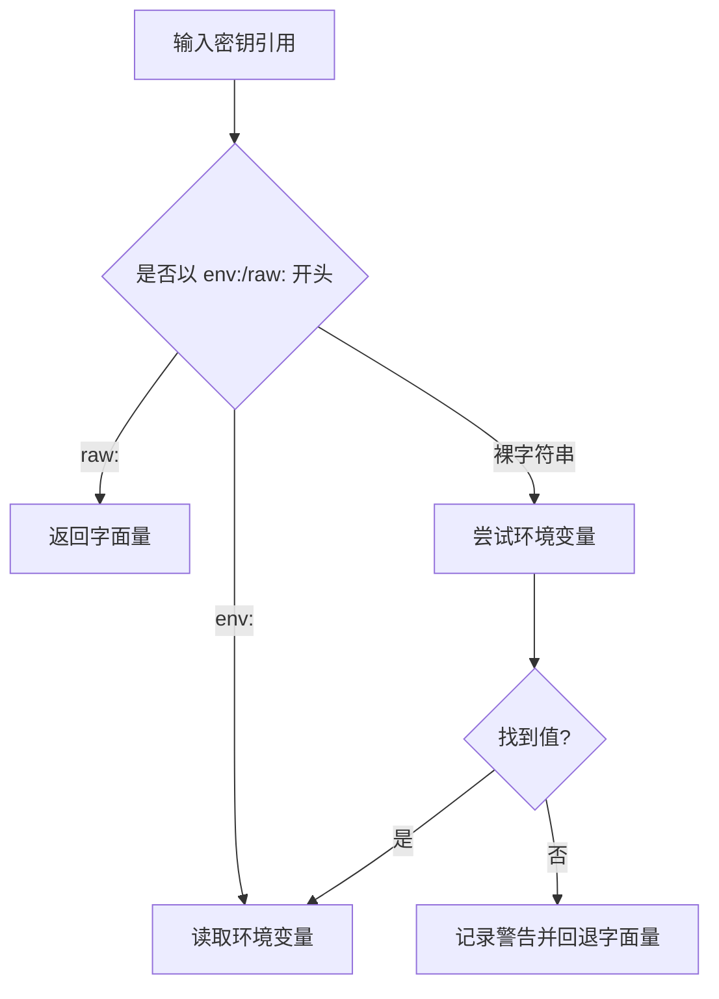
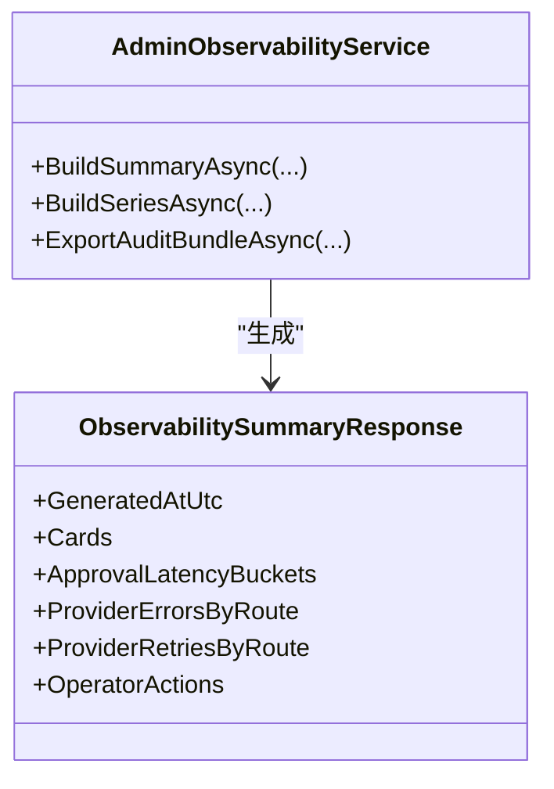
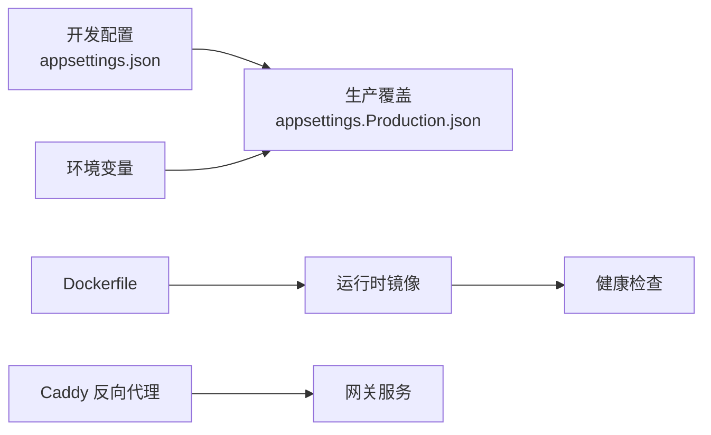

# 部署指南

<cite>
**本文档引用的文件**
- [Dockerfile](file://Dockerfile)
- [docker-compose.yml](file://docker-compose.yml)
- [appsettings.json](file://src/OpenClaw.Gateway/appsettings.json)
- [appsettings.Production.json](file://src/OpenClaw.Gateway/appsettings.Production.json)
- [build-opensandbox-app-image.ps1](file://scripts/build-opensandbox-app-image.ps1)
- [build-opensandbox-base-image.ps1](file://scripts/build-opensandbox-base-image.ps1)
- [build-opensandbox-image.ps1](file://scripts/build-opensandbox-image.ps1)
- [SecretResolver.cs](file://src/OpenClaw.Core/Security/SecretResolver.cs)
- [AdminObservabilityService.cs](file://src/OpenClaw.Gateway/AdminObservabilityService.cs)
- [OperatorGovernanceModels.cs](file://src/OpenClaw.Core/Models/OperatorGovernanceModels.cs)
</cite>

## 目录
1. [简介](#简介)
2. [项目结构](#项目结构)
3. [核心组件](#核心组件)
4. [架构总览](#架构总览)
5. [详细组件分析](#详细组件分析)
6. [依赖关系分析](#依赖关系分析)
7. [性能考虑](#性能考虑)
8. [故障排除指南](#故障排除指南)
9. [结论](#结论)
10. [附录](#附录)

## 简介
本指南面向需要在本地、测试与生产环境中部署 Kingcrab（OpenClaw）网关的工程团队与运维人员。内容覆盖 Docker 单容器部署、基于 Compose 的多服务编排、生产环境配置与安全加固、容器镜像构建脚本使用、以及监控与日志运维要点。文档同时提供不同部署场景的最佳实践建议，帮助您在开发、测试与生产之间实现平滑过渡。

## 项目结构
本项目采用多模块与多目标运行时的分层组织方式：
- 网关服务位于 OpenClaw.Gateway，提供 HTTP/WebSocket/MCP 等统一入口
- Dockerfile 与 docker-compose.yml 提供容器化与编排支持
- 生产配置通过 appsettings.Production.json 覆盖默认配置
- 安全与可观测性由核心库与网关服务共同实现
- OpenSandbox 相关脚本用于构建沙箱执行环境镜像

图表来源
- [Dockerfile:35-59](file://Dockerfile#L35-L59)
- [docker-compose.yml:44-62](file://docker-compose.yml#L44-L62)

章节来源
- [Dockerfile:1-59](file://Dockerfile#L1-L59)
- [docker-compose.yml:1-68](file://docker-compose.yml#L1-L68)

## 核心组件
- 容器镜像与运行时
  - 使用多阶段构建：第一阶段 NativeAOT 发布二进制；第二阶段使用精简运行时基础镜像，非 root 用户运行
  - 默认暴露端口 18789，内置健康检查
- 网关配置
  - 开发默认配置与生产覆盖配置分离
  - 支持环境变量覆盖（双下划线表示层级）
- 安全与密钥管理
  - SecretResolver 支持 env:、raw: 与裸字符串回退解析
  - 生产配置默认禁用插件桥接与危险工具，限制工作区根路径
- 可观测性
  - 内置管理员仪表盘与可观测性接口，支持指标聚合与导出

章节来源
- [Dockerfile:35-59](file://Dockerfile#L35-L59)
- [appsettings.json:1-908](file://src/OpenClaw.Gateway/appsettings.json#L1-L908)
- [appsettings.Production.json:1-65](file://src/OpenClaw.Gateway/appsettings.Production.json#L1-L65)
- [SecretResolver.cs:14-65](file://src/OpenClaw.Core/Security/SecretResolver.cs#L14-L65)

## 架构总览
下图展示从客户端到网关、再到 LLM 与插件的典型请求链路，以及可选的 Caddy 反向代理与 TLS 终止。

图表来源
- [docker-compose.yml:44-62](file://docker-compose.yml#L44-L62)
- [Dockerfile:43-59](file://Dockerfile#L43-L59)

## 详细组件分析

### Docker 部署（单容器）
- 构建与运行
  - 多阶段构建：SDK 阶段进行 NativeAOT 发布，运行时阶段使用精简基础镜像
  - 默认环境变量：绑定地址、端口、内存目录、工具根路径、插件开关等
  - 健康检查：通过命令行参数触发自检
- 关键点
  - 非回环绑定需设置鉴权令牌
  - 工作区与内存目录建议持久化卷
  - 如需反向代理，可启用转发头信任

图表来源
- [Dockerfile:1-59](file://Dockerfile#L1-L59)

章节来源
- [Dockerfile:1-59](file://Dockerfile#L1-L59)

### Docker Compose 编排（含反向代理）
- 服务编排
  - openclaw：网关服务，映射 18789 端口，挂载内存与工作区卷
  - caddy：可选反向代理，自动 TLS，依赖网关健康状态
- 环境变量与安全
  - 必填：模型提供商密钥、认证令牌
  - 可选：模型名称、自定义端点
  - 生产建议：启用转发头信任与已知代理列表

图表来源
- [docker-compose.yml:3-43](file://docker-compose.yml#L3-L43)
- [docker-compose.yml:44-62](file://docker-compose.yml#L44-L62)

章节来源
- [docker-compose.yml:1-68](file://docker-compose.yml#L1-L68)

### 生产环境配置与安全加固
- 绑定与鉴权
  - 生产默认绑定 0.0.0.0，启用转发头信任，严格控制允许来源
- 工具与插件
  - 默认禁用插件桥接与危险工具，限制读写根路径为 /app/workspace
- 会话与并发
  - 限制最大并发会话数与会话超时时间
- 日志级别
  - 默认信息级别，关键子系统提升到信息级别便于运维

图表来源
- [appsettings.Production.json:1-65](file://src/OpenClaw.Gateway/appsettings.Production.json#L1-L65)

章节来源
- [appsettings.Production.json:1-65](file://src/OpenClaw.Gateway/appsettings.Production.json#L1-L65)

### OpenSandbox 镜像构建（可选）
- 基础镜像与应用镜像
  - 基础镜像：预装系统包、Node.js、Playwright 等，构建一次长期复用
  - 应用镜像：仅复制构建产物，快速增量构建
- 多平台与推送
  - 支持多平台构建，可直接推送到注册表或加载到本地
- 使用建议
  - 在 CI 中先构建基础镜像，再以基础镜像为基底构建应用镜像，缩短构建时间

图表来源
- [build-opensandbox-base-image.ps1:1-127](file://scripts/build-opensandbox-base-image.ps1#L1-L127)
- [build-opensandbox-app-image.ps1:1-141](file://scripts/build-opensandbox-app-image.ps1#L1-L141)
- [build-opensandbox-image.ps1:1-93](file://scripts/build-opensandbox-image.ps1#L1-L93)

章节来源
- [build-opensandbox-base-image.ps1:1-127](file://scripts/build-opensandbox-base-image.ps1#L1-L127)
- [build-opensandbox-app-image.ps1:1-141](file://scripts/build-opensandbox-app-image.ps1#L1-L141)
- [build-opensandbox-image.ps1:1-93](file://scripts/build-opensandbox-image.ps1#L1-L93)

### 安全与密钥管理
- SecretResolver 解析策略
  - env:VAR_NAME：严格从环境变量解析
  - raw:literal：原始字面量（不推荐生产）
  - 裸字符串：优先尝试环境变量，否则回退为字面量，并发出警告
- 生产安全建议
  - 明确区分敏感配置与公开配置，避免在非回环绑定下使用 raw 引用
  - 对外暴露的配置应尽量通过环境变量注入

图表来源
- [SecretResolver.cs:14-65](file://src/OpenClaw.Core/Security/SecretResolver.cs#L14-L65)

章节来源
- [SecretResolver.cs:14-65](file://src/OpenClaw.Core/Security/SecretResolver.cs#L14-L65)

### 监控、日志与运维
- 管理员可观测性
  - 提供汇总与序列指标接口，支持按时间窗口聚合
  - 包含审批、自动化、提供商错误、死信队列、活跃会话等维度
- 日志配置
  - 生产配置中对关键子系统设置合理日志级别，便于问题定位
- 运维建议
  - 结合反向代理日志与网关日志进行关联分析
  - 定期导出审计包，保留合规证据

图表来源
- [AdminObservabilityService.cs:107-229](file://src/OpenClaw.Gateway/AdminObservabilityService.cs#L107-L229)
- [OperatorGovernanceModels.cs:330-359](file://src/OpenClaw.Core/Models/OperatorGovernanceModels.cs#L330-L359)

章节来源
- [AdminObservabilityService.cs:107-229](file://src/OpenClaw.Gateway/AdminObservabilityService.cs#L107-L229)
- [OperatorGovernanceModels.cs:330-359](file://src/OpenClaw.Core/Models/OperatorGovernanceModels.cs#L330-L359)

## 依赖关系分析
- 配置依赖
  - appsettings.Production.json 覆盖 appsettings.json 中的默认值
  - 环境变量通过双下划线映射到配置树
- 运行时依赖
  - Dockerfile 指定运行时基础镜像与用户
  - 健康检查依赖网关进程的自检参数
- 可选依赖
  - Caddy 反向代理作为 TLS 终止与路由前置

图表来源
- [appsettings.json:1-908](file://src/OpenClaw.Gateway/appsettings.json#L1-L908)
- [appsettings.Production.json:1-65](file://src/OpenClaw.Gateway/appsettings.Production.json#L1-L65)
- [Dockerfile:35-59](file://Dockerfile#L35-L59)
- [docker-compose.yml:44-62](file://docker-compose.yml#L44-L62)

章节来源
- [appsettings.json:1-908](file://src/OpenClaw.Gateway/appsettings.json#L1-L908)
- [appsettings.Production.json:1-65](file://src/OpenClaw.Gateway/appsettings.Production.json#L1-L65)
- [Dockerfile:35-59](file://Dockerfile#L35-L59)
- [docker-compose.yml:44-62](file://docker-compose.yml#L44-L62)

## 性能考虑
- 启动与资源
  - NativeAOT 发布减少 JIT 开销，适合容器化部署
  - 精简运行时基础镜像降低镜像体积与启动时间
- 并发与会话
  - 生产配置限制最大并发会话数与会话超时，避免资源耗尽
- I/O 与缓存
  - 内存与工作区目录持久化，避免频繁重建
  - 合理设置工具超时与批处理策略，平衡吞吐与稳定性

## 故障排除指南
- 健康检查失败
  - 确认容器内进程正常，查看健康检查命令与端口映射
  - 参考 Dockerfile 中的健康检查配置
- 认证与鉴权
  - 非回环绑定必须设置认证令牌
  - 生产配置默认禁用危险工具与插件桥接，如需启用请审慎评估
- 环境变量未生效
  - 确保使用双下划线分隔的环境变量命名
  - 检查 SecretResolver 的解析行为（env/raw/裸字符串）
- 反向代理与 TLS
  - 启用转发头信任与已知代理列表，确保客户端 IP 与协议正确传递
  - 确认 Caddy 配置与证书自动续期

章节来源
- [Dockerfile:55-56](file://Dockerfile#L55-L56)
- [docker-compose.yml:13-31](file://docker-compose.yml#L13-L31)
- [SecretResolver.cs:14-65](file://src/OpenClaw.Core/Security/SecretResolver.cs#L14-L65)
- [appsettings.Production.json:22-30](file://src/OpenClaw.Gateway/appsettings.Production.json#L22-L30)

## 结论
通过本指南，您可以基于 Docker 与 Compose 实现从开发到生产的稳定部署。建议在开发环境保持宽松配置，在测试与生产环境严格执行最小权限原则与安全加固策略。结合反向代理、健康检查与可观测性接口，可有效提升系统的可靠性与可维护性。

## 附录

### 不同部署场景最佳实践
- 本地开发
  - 使用默认绑定地址与端口，启用必要工具与插件
  - 将工作区与内存目录映射到宿主机，便于调试
- 测试环境
  - 与生产相同的镜像与配置覆盖，启用转发头信任
  - 限制工具与插件范围，开启审计与日志
- 生产环境
  - 绑定 0.0.0.0，启用转发头信任与已知代理
  - 禁用插件桥接与危险工具，严格控制工作区根路径
  - 设置并发与会话超时，启用健康检查与反向代理

### 部署步骤清单
- 准备环境变量与密钥（模型提供商密钥、认证令牌等）
- 构建镜像（可选：先构建 OpenSandbox 基础镜像）
- 启动服务（单容器或 Compose）
- 验证健康检查与基本连通性
- 配置反向代理与 TLS（可选）
- 启用监控与日志，建立告警