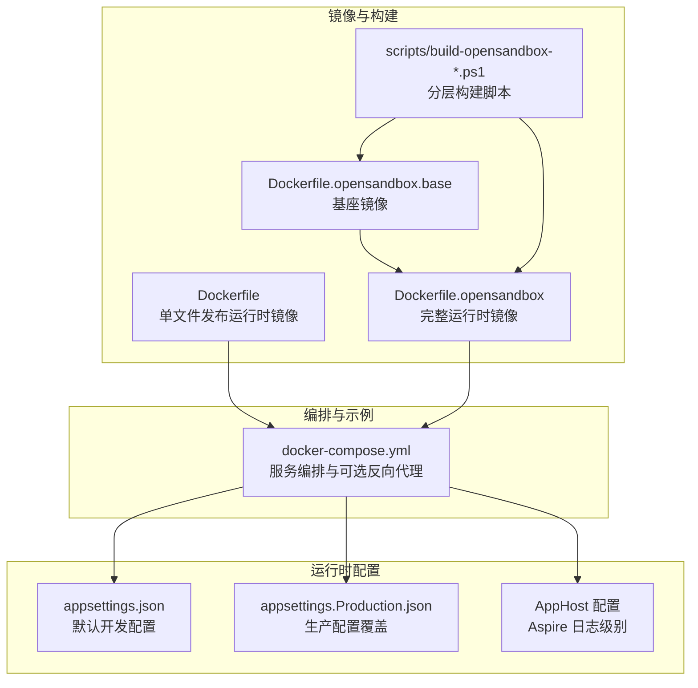
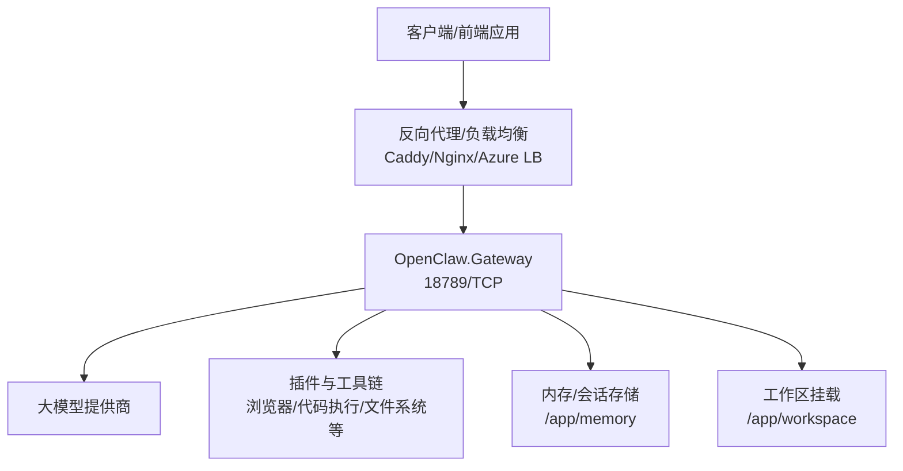
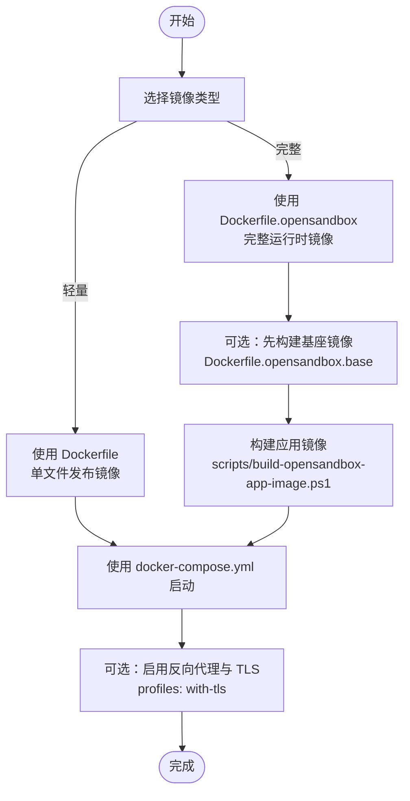
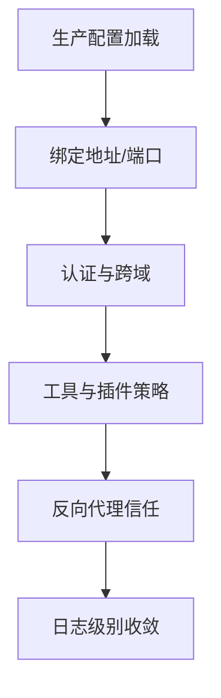
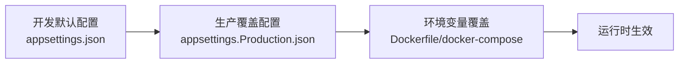

# 部署指南

<cite>
**本文引用的文件**
- [Dockerfile](file://Dockerfile)
- [docker-compose.yml](file://docker-compose.yml)
- [Dockerfile.opensandbox](file://Dockerfile.opensandbox)
- [Dockerfile.opensandbox.base](file://Dockerfile.opensandbox.base)
- [scripts/build-opensandbox-base-image.ps1](file://scripts/build-opensandbox-base-image.ps1)
- [scripts/build-opensandbox-app-image.ps1](file://scripts/build-opensandbox-app-image.ps1)
- [scripts/build-opensandbox-image.ps1](file://scripts/build-opensandbox-image.ps1)
- [src/OpenClaw.Gateway/appsettings.json](file://src/OpenClaw.Gateway/appsettings.json)
- [src/OpenClaw.Gateway/appsettings.Production.json](file://src/OpenClaw.Gateway/appsettings.Production.json)
- [Kingcrab.AppHost/appsettings.json](file://Kingcrab.AppHost/appsettings.json)
- [Kingcrab.AppHost/appsettings.Development.json](file://Kingcrab.AppHost/appsettings.Development.json)
</cite>

## 目录
1. [简介](#简介)
2. [项目结构](#项目结构)
3. [核心组件](#核心组件)
4. [架构总览](#架构总览)
5. [详细组件分析](#详细组件分析)
6. [依赖关系分析](#依赖关系分析)
7. [性能考虑](#性能考虑)
8. [故障排查指南](#故障排查指南)
9. [结论](#结论)
10. [附录](#附录)

## 简介
本指南面向生产环境与云原生场景，系统化阐述 OpenClaw.NET 的部署方案，覆盖以下主题：
- Docker 单容器部署与镜像构建
- 生产环境配置、安全加固与性能优化
- 反向代理与 TLS 配置、域名管理
- Kubernetes 部署、负载均衡与高可用
- 监控、日志聚合与告警
- 滚动更新与回滚策略
- 容量规划、性能调优与故障恢复

## 项目结构
OpenClaw.NET 提供多套部署资产：
- 基于单文件发布（NativeAOT）的轻量运行时镜像，适合快速启动与低资源占用
- 集成浏览器与沙箱工具链的完整运行时镜像，适合需要浏览器与代码执行能力的场景
- Docker Compose 编排示例，包含可选反向代理与自动 TLS
- 多平台构建脚本，支持分层基座镜像以加速增量构建

图表来源
- [Dockerfile:1-59](file://Dockerfile#L1-L59)
- [Dockerfile.opensandbox:1-113](file://Dockerfile.opensandbox#L1-L113)
- [Dockerfile.opensandbox.base:1-76](file://Dockerfile.opensandbox.base#L1-L76)
- [scripts/build-opensandbox-base-image.ps1:1-127](file://scripts/build-opensandbox-base-image.ps1#L1-L127)
- [scripts/build-opensandbox-app-image.ps1:1-141](file://scripts/build-opensandbox-app-image.ps1#L1-L141)
- [scripts/build-opensandbox-image.ps1:1-93](file://scripts/build-opensandbox-image.ps1#L1-L93)
- [docker-compose.yml:1-68](file://docker-compose.yml#L1-L68)
- [src/OpenClaw.Gateway/appsettings.json:1-908](file://src/OpenClaw.Gateway/appsettings.json#L1-L908)
- [src/OpenClaw.Gateway/appsettings.Production.json:1-65](file://src/OpenClaw.Gateway/appsettings.Production.json#L1-L65)
- [Kingcrab.AppHost/appsettings.json:1-10](file://Kingcrab.AppHost/appsettings.json#L1-L10)
- [Kingcrab.AppHost/appsettings.Development.json:1-9](file://Kingcrab.AppHost/appsettings.Development.json#L1-L9)

章节来源
- [Dockerfile:1-59](file://Dockerfile#L1-L59)
- [Dockerfile.opensandbox:1-113](file://Dockerfile.opensandbox#L1-L113)
- [Dockerfile.opensandbox.base:1-76](file://Dockerfile.opensandbox.base#L1-L76)
- [scripts/build-opensandbox-base-image.ps1:1-127](file://scripts/build-opensandbox-base-image.ps1#L1-L127)
- [scripts/build-opensandbox-app-image.ps1:1-141](file://scripts/build-opensandbox-app-image.ps1#L1-L141)
- [scripts/build-opensandbox-image.ps1:1-93](file://scripts/build-opensandbox-image.ps1#L1-L93)
- [docker-compose.yml:1-68](file://docker-compose.yml#L1-L68)
- [src/OpenClaw.Gateway/appsettings.json:1-908](file://src/OpenClaw.Gateway/appsettings.json#L1-L908)
- [src/OpenClaw.Gateway/appsettings.Production.json:1-65](file://src/OpenClaw.Gateway/appsettings.Production.json#L1-L65)
- [Kingcrab.AppHost/appsettings.json:1-10](file://Kingcrab.AppHost/appsettings.json#L1-L10)
- [Kingcrab.AppHost/appsettings.Development.json:1-9](file://Kingcrab.AppHost/appsettings.Development.json#L1-L9)

## 核心组件
- 运行时服务：OpenClaw.Gateway，监听端口并提供会话、工具与插件能力
- 配置体系：appsettings.json（默认）、appsettings.Production.json（生产覆盖）、AppHost 日志级别
- 容器镜像：单文件发布镜像（轻量）与完整镜像（含浏览器与工具链）
- 编排与代理：docker-compose 包含可选反向代理与自动 TLS

章节来源
- [src/OpenClaw.Gateway/appsettings.json:1-908](file://src/OpenClaw.Gateway/appsettings.json#L1-L908)
- [src/OpenClaw.Gateway/appsettings.Production.json:1-65](file://src/OpenClaw.Gateway/appsettings.Production.json#L1-L65)
- [Kingcrab.AppHost/appsettings.json:1-10](file://Kingcrab.AppHost/appsettings.json#L1-L10)
- [Kingcrab.AppHost/appsettings.Development.json:1-9](file://Kingcrab.AppHost/appsettings.Development.json#L1-L9)
- [Dockerfile:1-59](file://Dockerfile#L1-L59)
- [Dockerfile.opensandbox:1-113](file://Dockerfile.opensandbox#L1-L113)
- [docker-compose.yml:1-68](file://docker-compose.yml#L1-L68)

## 架构总览
下图展示从客户端到网关、再到外部模型与工具链的整体路径；在生产中建议通过反向代理统一入口与 TLS 终止。

图表来源
- [docker-compose.yml:44-62](file://docker-compose.yml#L44-L62)
- [Dockerfile:43-58](file://Dockerfile#L43-L58)
- [Dockerfile.opensandbox:91-104](file://Dockerfile.opensandbox#L91-L104)
- [src/OpenClaw.Gateway/appsettings.Production.json:15-53](file://src/OpenClaw.Gateway/appsettings.Production.json#L15-L53)

## 详细组件分析

### Docker 部署与镜像构建
- 单文件发布镜像（推荐用于生产）
  - 使用 chiseled 运行时依赖镜像，非 root 用户运行
  - 默认暴露 18789 端口，内置健康检查
  - 通过环境变量控制绑定地址、端口、内存目录、工具权限与插件开关
- 完整镜像（适用于需要浏览器与代码执行）
  - 安装 Node.js、Playwright、Python、poppler 等工具
  - 预装浏览器二进制，支持沙箱与浏览器工具
  - 支持启用插件与工具链
- 分层构建脚本
  - 基座镜像：仅安装系统包、Node、Playwright 与 uv，变更频率低
  - 应用镜像：基于基座镜像快速叠加 .NET 发布产物，提升迭代速度
  - 支持多平台与推送/加载模式

图表来源
- [Dockerfile:1-59](file://Dockerfile#L1-L59)
- [Dockerfile.opensandbox:1-113](file://Dockerfile.opensandbox#L1-L113)
- [Dockerfile.opensandbox.base:1-76](file://Dockerfile.opensandbox.base#L1-L76)
- [scripts/build-opensandbox-base-image.ps1:1-127](file://scripts/build-opensandbox-base-image.ps1#L1-L127)
- [scripts/build-opensandbox-app-image.ps1:1-141](file://scripts/build-opensandbox-app-image.ps1#L1-L141)
- [docker-compose.yml:44-62](file://docker-compose.yml#L44-L62)

章节来源
- [Dockerfile:1-59](file://Dockerfile#L1-L59)
- [Dockerfile.opensandbox:1-113](file://Dockerfile.opensandbox#L1-L113)
- [Dockerfile.opensandbox.base:1-76](file://Dockerfile.opensandbox.base#L1-L76)
- [scripts/build-opensandbox-base-image.ps1:1-127](file://scripts/build-opensandbox-base-image.ps1#L1-L127)
- [scripts/build-opensandbox-app-image.ps1:1-141](file://scripts/build-opensandbox-app-image.ps1#L1-L141)
- [scripts/build-opensandbox-image.ps1:1-93](file://scripts/build-opensandbox-image.ps1#L1-L93)
- [docker-compose.yml:1-68](file://docker-compose.yml#L1-L68)

### 生产环境配置与安全加固
- 绑定与端口
  - 生产默认绑定 0.0.0.0:18789，确保容器网络可达
- 认证与跨域
  - 强制鉴权，禁止查询字符串令牌
  - 明确允许的来源列表，谨慎放行
- 工具与插件
  - 默认禁用 shell 与插件桥接，避免高危面
  - 仅开放必要根路径（如 /app/workspace），限制读写范围
- 反向代理信任
  - 在公共绑定场景启用转发头信任，并显式声明已知代理 IP
- 日志级别
  - Aspire/AppHost 中降低日志噪声，便于生产观察

图表来源
- [src/OpenClaw.Gateway/appsettings.Production.json:1-65](file://src/OpenClaw.Gateway/appsettings.Production.json#L1-L65)
- [Kingcrab.AppHost/appsettings.json:1-10](file://Kingcrab.AppHost/appsettings.json#L1-L10)
- [Kingcrab.AppHost/appsettings.Development.json:1-9](file://Kingcrab.AppHost/appsettings.Development.json#L1-L9)

章节来源
- [src/OpenClaw.Gateway/appsettings.Production.json:1-65](file://src/OpenClaw.Gateway/appsettings.Production.json#L1-L65)
- [Kingcrab.AppHost/appsettings.json:1-10](file://Kingcrab.AppHost/appsettings.json#L1-L10)
- [Kingcrab.AppHost/appsettings.Development.json:1-9](file://Kingcrab.AppHost/appsettings.Development.json#L1-L9)

### 性能优化要点
- 内存与会话
  - 调整最大历史轮次、缓存会话数与压缩阈值，平衡吞吐与资源
- WebSocket 连接与速率
  - 控制最大连接数、每 IP 连接数、每分钟消息数与接收超时
- 工具超时与并行
  - 合理设置工具超时与并行执行，避免资源争用
- 运行时模式
  - 根据场景选择 JIT 或 AOT（镜像已内建 AOT 发布），结合实际压测结果微调

章节来源
- [src/OpenClaw.Gateway/appsettings.Production.json:15-53](file://src/OpenClaw.Gateway/appsettings.Production.json#L15-L53)
- [src/OpenClaw.Gateway/appsettings.json:103-144](file://src/OpenClaw.Gateway/appsettings.json#L103-L144)

### 反向代理、TLS 与域名
- docker-compose 示例
  - 提供可选的 Caddy 服务，自动处理 TLS 证书与 HTTP/HTTPS
  - 通过环境变量注入域名，按需启用
  - 仅在网关健康后启动代理，保证可用性
- 域名与证书
  - 将子域名指向负载均衡或反向代理入口
  - 使用 Let’s Encrypt 自动签发与续期
- 转发头与代理信任
  - 在生产中启用转发头信任，并明确已知代理 IP 列表

章节来源
- [docker-compose.yml:44-62](file://docker-compose.yml#L44-L62)

### Kubernetes 部署、负载均衡与高可用
- Deployment
  - 设置副本数、就绪探针与存活探针，使用健康检查命令
  - 通过环境变量注入密钥与配置覆盖
- Service/LB
  - ClusterIP/LoadBalancer/Ingress 三类暴露方式，按云厂商与网络策略选择
- ConfigMap/Secret
  - 将敏感配置与密钥放入 Secret，非敏感参数放入 ConfigMap
- HPA/VPA
  - 结合 CPU/内存指标与自定义指标进行弹性伸缩
- PodDisruptionBudget
  - 保障最小可用副本，配合滚动更新实现零停机
- 多可用区
  - 将副本分布至多个节点与可用区，提升容灾能力

（本节为概念性说明，不直接分析具体文件）

### 监控、日志聚合与告警
- 指标采集
  - 暴露运行时指标（会话数、工具调用次数、错误率、延迟）
  - 结合 Prometheus/Grafana 建立仪表盘
- 日志
  - 标准输出收集，结合 Loki/ELK 进行聚合与检索
  - 控制日志级别，避免生产噪声
- 告警
  - 错误率、P95/P99 延迟、健康检查失败、磁盘/内存压力等阈值告警
  - 与企业 IM/邮件集成

（本节为概念性说明，不直接分析具体文件）

### 滚动更新与回滚策略
- 滚动更新
  - 设置最大不可用与最大同时升级比例，确保平滑切换
  - 使用就绪探针等待新实例完全就绪后再切流量
- 回滚
  - 保留前一版本镜像标签，一键回滚
  - 配置金丝雀与蓝绿发布，降低风险
- 配置热更
  - 通过 ConfigMap/Secret 动态更新非敏感配置

（本节为概念性说明，不直接分析具体文件）

## 依赖关系分析
- 镜像与运行时配置
  - 单文件镜像与完整镜像共享相同的环境变量键空间（如绑定地址、端口、内存路径、工具权限、插件开关）
  - docker-compose 通过环境变量覆盖默认值，便于本地与生产差异化
- 配置覆盖链
  - 开发默认配置 → 生产覆盖配置 → 运行时环境变量 → 命令行参数（按框架约定）

图表来源
- [src/OpenClaw.Gateway/appsettings.json:1-908](file://src/OpenClaw.Gateway/appsettings.json#L1-L908)
- [src/OpenClaw.Gateway/appsettings.Production.json:1-65](file://src/OpenClaw.Gateway/appsettings.Production.json#L1-L65)
- [Dockerfile:43-51](file://Dockerfile#L43-L51)
- [docker-compose.yml:13-31](file://docker-compose.yml#L13-L31)

章节来源
- [src/OpenClaw.Gateway/appsettings.json:1-908](file://src/OpenClaw.Gateway/appsettings.json#L1-L908)
- [src/OpenClaw.Gateway/appsettings.Production.json:1-65](file://src/OpenClaw.Gateway/appsettings.Production.json#L1-L65)
- [Dockerfile:43-51](file://Dockerfile#L43-L51)
- [docker-compose.yml:13-31](file://docker-compose.yml#L13-L31)

## 性能考虑
- 启动与冷启动
  - 使用单文件发布镜像减少启动体积与依赖加载时间
  - 对于需要浏览器的场景，预装 Playwright 二进制可降低首次访问延迟
- 并发与限流
  - 合理设置 WebSocket 连接上限与速率限制，避免拥塞
- 存储与 IO
  - 将内存与会话目录映射到持久卷，避免频繁 IO
  - 控制历史轮次与压缩阈值，平衡数据量与查询性能
- 网络与代理
  - 在公网绑定时启用转发头信任与代理白名单，减少中间层开销

（本节为通用指导，不直接分析具体文件）

## 故障排查指南
- 健康检查失败
  - 检查容器日志与健康检查命令是否正确
  - 确认端口映射与绑定地址（0.0.0.0 vs 127.0.0.1）
- 认证与跨域问题
  - 核对鉴权令牌与允许来源列表
  - 公网部署时启用转发头信任并配置已知代理
- 工具执行异常
  - 检查工具根路径与读写权限
  - 关闭 shell 与插件桥接以降低风险
- 反向代理 TLS
  - 确认域名解析与证书签发状态
  - 查看代理日志定位 4xx/5xx

章节来源
- [Dockerfile:55-56](file://Dockerfile#L55-L56)
- [docker-compose.yml:37-42](file://docker-compose.yml#L37-L42)
- [src/OpenClaw.Gateway/appsettings.Production.json:22-30](file://src/OpenClaw.Gateway/appsettings.Production.json#L22-L30)
- [src/OpenClaw.Gateway/appsettings.Production.json:40-46](file://src/OpenClaw.Gateway/appsettings.Production.json#L40-L46)

## 结论
通过单文件发布镜像与完整镜像的双轨策略，结合 docker-compose 的快速编排与可选反向代理，OpenClaw.NET 可在本地与生产环境中实现一致、可控且可扩展的部署体验。配合生产级的安全加固、性能优化与可观测性建设，可满足高可用与高可靠的业务需求。

## 附录
- 快速清单
  - 明确绑定地址与端口，生产使用 0.0.0.0:18789
  - 设置鉴权令牌与允许来源，禁用查询串令牌
  - 限制工具与插件权限，仅开放必要根路径
  - 启用转发头信任并配置已知代理
  - 使用持久卷保存内存与会话数据
  - 通过 docker-compose 启动并按需启用 TLS
  - 建立监控、日志与告警体系
  - 制定滚动更新与回滚策略