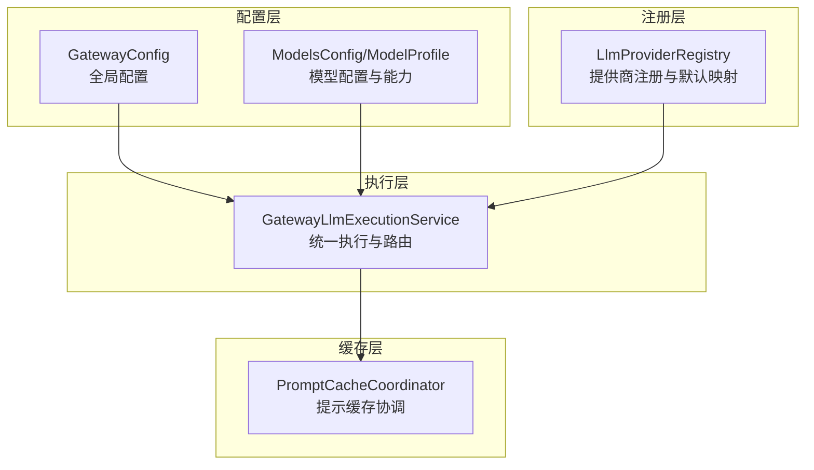
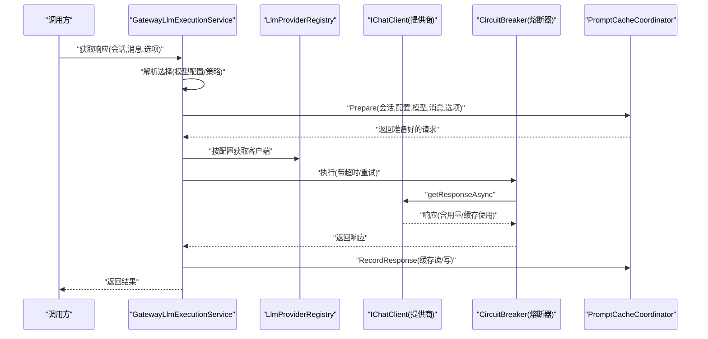
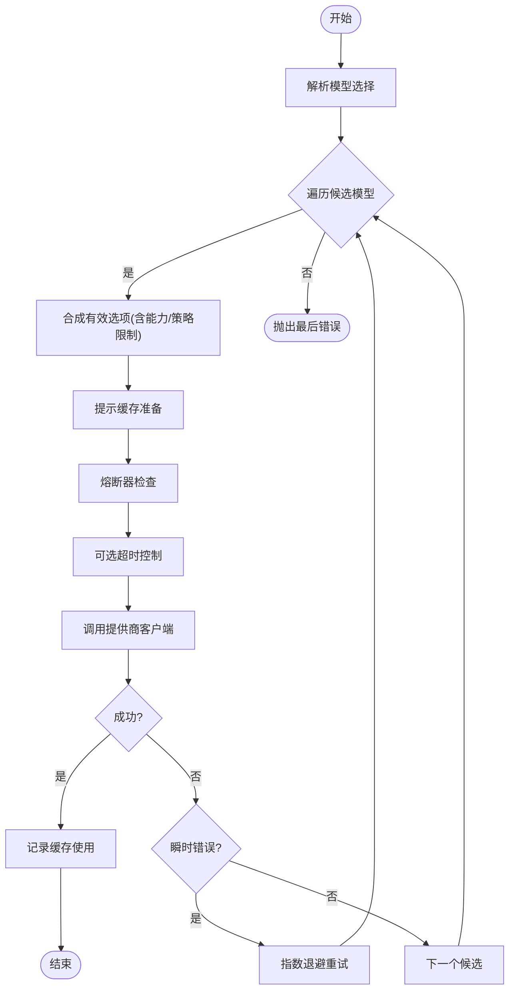
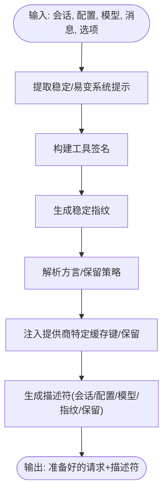
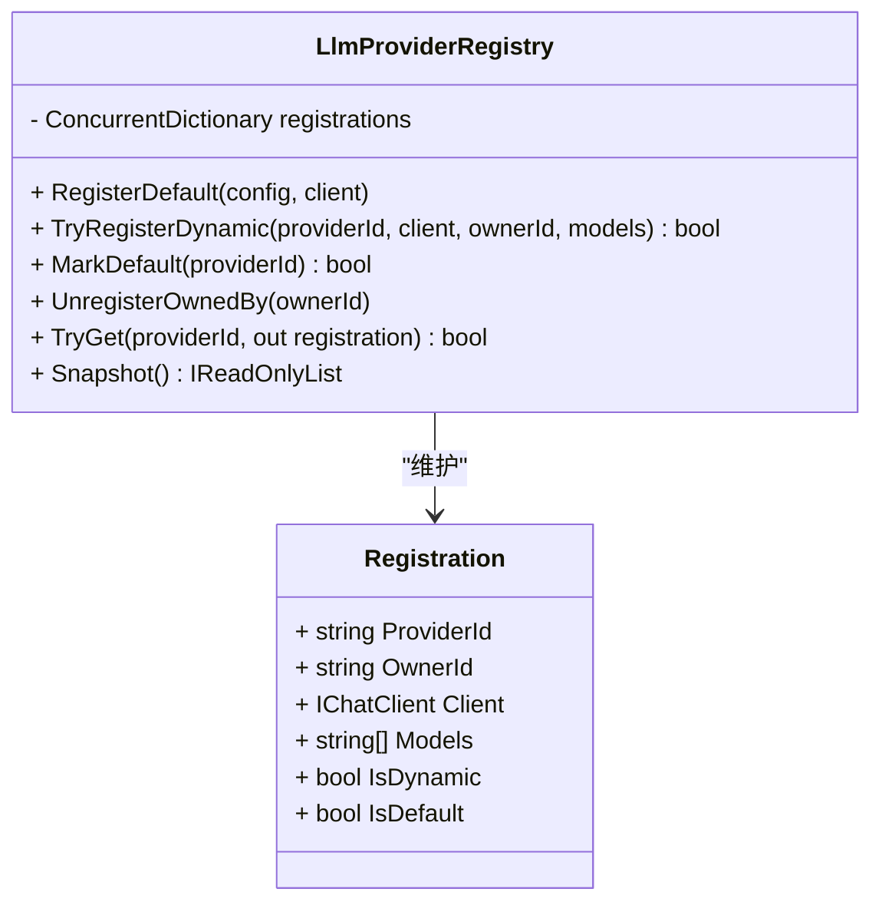
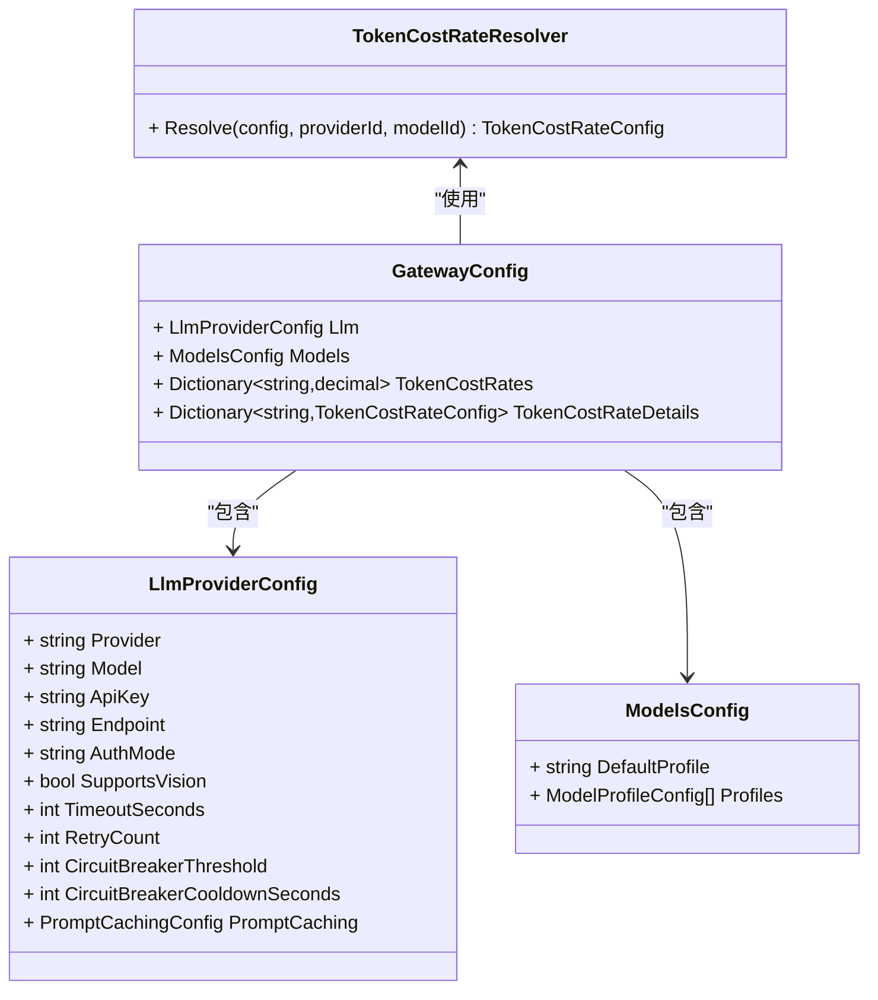
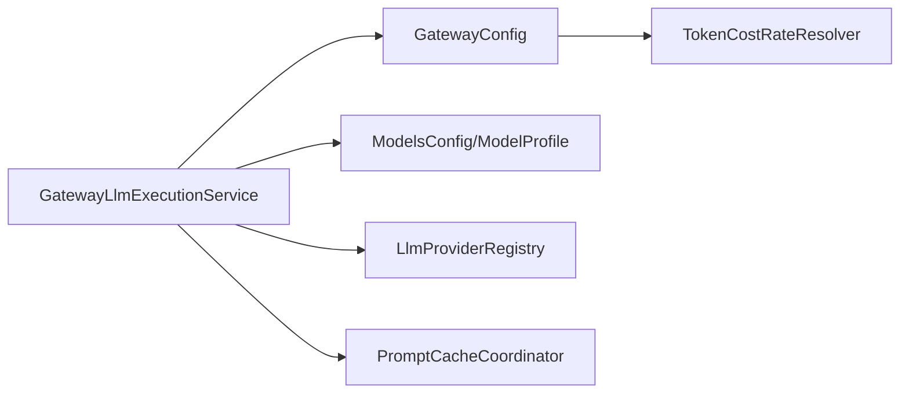

# LLM 提供商配置

<cite>
**本文引用的文件**
- [GatewayLlmExecutionService.cs](file://src/OpenClaw.Gateway/GatewayLlmExecutionService.cs)
- [GatewayConfig.cs](file://src/OpenClaw.Core/Models/GatewayConfig.cs)
- [LlmProviderRegistry.cs](file://src/OpenClaw.Gateway/LlmProviderRegistry.cs)
- [PromptCacheCoordinator.cs](file://src/OpenClaw.Gateway/PromptCaching/PromptCacheCoordinator.cs)
- [ModelProfiles.cs](file://src/OpenClaw.Core/Models/ModelProfiles.cs)
- [MODEL_PROFILES.md](file://docs/MODEL_PROFILES.md)
</cite>

## 目录
1. [简介](#简介)
2. [项目结构](#项目结构)
3. [核心组件](#核心组件)
4. [架构总览](#架构总览)
5. [详细组件分析](#详细组件分析)
6. [依赖关系分析](#依赖关系分析)
7. [性能考量](#性能考量)
8. [故障排除指南](#故障排除指南)
9. [结论](#结论)
10. [附录](#附录)

## 简介
本技术文档面向 LLM 提供商配置系统，系统通过统一的执行服务与提供商注册表，将“模型配置”与“提供商实现”解耦，支持多提供商、多模型、多路由策略与多级回退。文档覆盖以下主题：
- 提供商选择与模型参数
- API 密钥管理与端点配置
- 温度控制、最大令牌数、重试与熔断器
- 多模型回退策略、视觉能力支持、提示缓存
- 不同提供商（OpenAI、Anthropic、Ollama）的配置示例与最佳实践
- 模型成本计算、性能优化与故障排除

## 项目结构
围绕 LLM 配置的关键模块包括：
- 执行层：统一的 LLM 执行服务，负责路由选择、参数合成、重试与熔断、提示缓存协调与事件记录
- 配置层：集中式网关配置与模型配置，定义提供商、模型、能力、缓存与成本等
- 注册层：提供商注册表，维护默认与动态提供商及其可用模型清单
- 缓存层：提示缓存协调器，负责指纹生成、方言适配与保留策略

**图表来源**
- [GatewayLlmExecutionService.cs:18-164](file://src/OpenClaw.Gateway/GatewayLlmExecutionService.cs#L18-L164)
- [GatewayConfig.cs:87-119](file://src/OpenClaw.Core/Models/GatewayConfig.cs#L87-L119)
- [ModelProfiles.cs:3-80](file://src/OpenClaw.Core/Models/ModelProfiles.cs#L3-L80)
- [LlmProviderRegistry.cs:7-90](file://src/OpenClaw.Gateway/LlmProviderRegistry.cs#L7-L90)
- [PromptCacheCoordinator.cs:91-169](file://src/OpenClaw.Gateway/PromptCaching/PromptCacheCoordinator.cs#L91-L169)

**章节来源**
- [GatewayLlmExecutionService.cs:18-164](file://src/OpenClaw.Gateway/GatewayLlmExecutionService.cs#L18-L164)
- [GatewayConfig.cs:87-119](file://src/OpenClaw.Core/Models/GatewayConfig.cs#L87-L119)
- [ModelProfiles.cs:3-80](file://src/OpenClaw.Core/Models/ModelProfiles.cs#L3-L80)
- [LlmProviderRegistry.cs:7-90](file://src/OpenClaw.Gateway/LlmProviderRegistry.cs#L7-L90)
- [PromptCacheCoordinator.cs:91-169](file://src/OpenClaw.Gateway/PromptCaching/PromptCacheCoordinator.cs#L91-L169)

## 核心组件
- 统一执行服务
  - 负责模型选择、参数合成、重试与熔断、超时控制、提示缓存准备与使用统计、事件记录与错误分类
  - 支持标准响应与流式响应两种模式
- 配置模型
  - LlmProviderConfig：提供商与模型默认值、API 密钥、端点、鉴权方式、视觉支持、超时、重试次数、熔断阈值与冷却时间、提示缓存配置
  - ModelsConfig/ModelProfile：模型配置、能力标志、标签、回退模型与回退配置、提示缓存配置
  - GatewayConfig：全局运行时、内存、安全、工具、支付、诊断等配置，含令牌成本率
- 提示缓存协调器
  - 生成稳定指纹、提取系统提示片段、构建工具签名、写入提供商特定缓存键与保留策略，并记录追踪
- 提供商注册表
  - 维护默认与动态提供商注册，暴露可用模型清单，支持标记默认提供商

**章节来源**
- [GatewayLlmExecutionService.cs:218-432](file://src/OpenClaw.Gateway/GatewayLlmExecutionService.cs#L218-L432)
- [GatewayConfig.cs:87-119](file://src/OpenClaw.Core/Models/GatewayConfig.cs#L87-L119)
- [ModelProfiles.cs:3-80](file://src/OpenClaw.Core/Models/ModelProfiles.cs#L3-L80)
- [PromptCacheCoordinator.cs:103-169](file://src/OpenClaw.Gateway/PromptCaching/PromptCacheCoordinator.cs#L103-L169)
- [LlmProviderRegistry.cs:21-56](file://src/OpenClaw.Gateway/LlmProviderRegistry.cs#L21-L56)

## 架构总览
下图展示从请求到响应的关键流程，包括模型选择、参数合成、重试与熔断、提示缓存与流式处理。

**图表来源**
- [GatewayLlmExecutionService.cs:218-358](file://src/OpenClaw.Gateway/GatewayLlmExecutionService.cs#L218-L358)
- [PromptCacheCoordinator.cs:103-169](file://src/OpenClaw.Gateway/PromptCaching/PromptCacheCoordinator.cs#L103-L169)
- [LlmProviderRegistry.cs:80-81](file://src/OpenClaw.Gateway/LlmProviderRegistry.cs#L80-L81)

**章节来源**
- [GatewayLlmExecutionService.cs:218-358](file://src/OpenClaw.Gateway/GatewayLlmExecutionService.cs#L218-L358)
- [PromptCacheCoordinator.cs:103-169](file://src/OpenClaw.Gateway/PromptCaching/PromptCacheCoordinator.cs#L103-L169)
- [LlmProviderRegistry.cs:80-81](file://src/OpenClaw.Gateway/LlmProviderRegistry.cs#L80-L81)

## 详细组件分析

### 统一执行服务（GatewayLlmExecutionService）
- 模型选择与回退
  - 基于会话、消息、选项与估算输入令牌，结合策略与配置选择候选模型
  - 对每个候选模型尝试其自身模型与回退模型列表，去重后逐一尝试
- 参数合成与限制
  - 合成有效 ChatOptions，考虑模型能力上限、策略限制与用户显式设置
  - 计算总令牌预算并进行早停校验
- 重试与指数退避
  - 对瞬时性错误进行重试，采用指数退避（最大延迟上限），记录重试与错误指标
- 熔断器
  - 按路由维度维护熔断器，连续失败达到阈值后打开，冷却时间后探测恢复
- 超时控制
  - 可按提供商配置设置单次调用超时，避免长时间阻塞
- 提示缓存
  - 准备请求以启用提示缓存，记录缓存读写令牌，标准化用量字段
- 流式响应
  - 与标准响应类似，但逐条推送更新，异常时记录并抛出

**图表来源**
- [GatewayLlmExecutionService.cs:233-358](file://src/OpenClaw.Gateway/GatewayLlmExecutionService.cs#L233-L358)

**章节来源**
- [GatewayLlmExecutionService.cs:233-358](file://src/OpenClaw.Gateway/GatewayLlmExecutionService.cs#L233-L358)

### 提示缓存协调器（PromptCacheCoordinator）
- 稳定指纹与系统提示分段
  - 从第一条系统提示中分离“路由指令”标记后的稳定与易变部分，用于指纹生成
- 工具签名
  - 基于工具名称、描述与 JSON Schema 构建稳定签名，参与指纹
- 方言与保留策略
  - 自动或显式指定方言（OpenAI/Anthropic/Gemini/None），并规范化保留策略（none/short/long/auto）
- 提供商特定键
  - 写入提供商特定的缓存键与保留控制字段
- 追踪与记录
  - 请求与响应阶段写入追踪日志，便于审计与排障

**图表来源**
- [PromptCacheCoordinator.cs:103-169](file://src/OpenClaw.Gateway/PromptCaching/PromptCacheCoordinator.cs#L103-L169)

**章节来源**
- [PromptCacheCoordinator.cs:103-169](file://src/OpenClaw.Gateway/PromptCaching/PromptCacheCoordinator.cs#L103-L169)

### 提供商注册表（LlmProviderRegistry）
- 默认注册
  - 将默认提供商与模型加入注册表，并标记为默认
- 动态注册
  - 允许插件或运行时注册新的提供商与模型清单
- 查询与快照
  - 提供查询与快照能力，便于 UI 与诊断

**图表来源**
- [LlmProviderRegistry.cs:7-90](file://src/OpenClaw.Gateway/LlmProviderRegistry.cs#L7-L90)

**章节来源**
- [LlmProviderRegistry.cs:7-90](file://src/OpenClaw.Gateway/LlmProviderRegistry.cs#L7-L90)

### 配置模型与成本计算
- LlmProviderConfig
  - 提供商、模型、API 密钥、端点、鉴权模式、是否发送请求元数据、回退模型、最大输出令牌、温度、视觉支持、超时、重试次数、熔断阈值与冷却时间、提示缓存配置
- ModelsConfig/ModelProfile
  - 模型配置、能力标志（工具、视觉、结构化输出、流式、并行工具调用、推理努力、系统消息、音视频输入、上下文/输出令牌上限）、标签、回退配置、提示缓存配置
- 成本计算
  - 支持按“提供商:模型”或“提供商”两档配置；若未配置则使用内置默认费率；提供解析器按优先级解析

**图表来源**
- [GatewayConfig.cs:87-119](file://src/OpenClaw.Core/Models/GatewayConfig.cs#L87-L119)
- [GatewayConfig.cs:297-322](file://src/OpenClaw.Core/Models/GatewayConfig.cs#L297-L322)
- [ModelProfiles.cs:3-24](file://src/OpenClaw.Core/Models/ModelProfiles.cs#L3-L24)

**章节来源**
- [GatewayConfig.cs:87-119](file://src/OpenClaw.Core/Models/GatewayConfig.cs#L87-L119)
- [GatewayConfig.cs:297-322](file://src/OpenClaw.Core/Models/GatewayConfig.cs#L297-L322)
- [ModelProfiles.cs:3-24](file://src/OpenClaw.Core/Models/ModelProfiles.cs#L3-L24)

## 依赖关系分析
- 执行服务依赖
  - 配置：LlmProviderConfig、ModelsConfig/ModelProfile
  - 注册表：LlmProviderRegistry
  - 缓存：PromptCacheCoordinator
  - 运行时指标与事件：运行时指标、事件存储、用量追踪
- 提示缓存依赖
  - 配置：PromptCachingConfig
  - 追踪：PromptCacheTraceWriter
- 成本计算依赖
  - 配置：TokenCostRates/TokenCostRateDetails
  - 解析器：TokenCostRateResolver

**图表来源**
- [GatewayLlmExecutionService.cs:38-96](file://src/OpenClaw.Gateway/GatewayLlmExecutionService.cs#L38-L96)
- [GatewayConfig.cs:87-119](file://src/OpenClaw.Core/Models/GatewayConfig.cs#L87-L119)
- [PromptCacheCoordinator.cs:91-101](file://src/OpenClaw.Gateway/PromptCaching/PromptCacheCoordinator.cs#L91-L101)
- [GatewayConfig.cs:297-322](file://src/OpenClaw.Core/Models/GatewayConfig.cs#L297-L322)

**章节来源**
- [GatewayLlmExecutionService.cs:38-96](file://src/OpenClaw.Gateway/GatewayLlmExecutionService.cs#L38-L96)
- [PromptCacheCoordinator.cs:91-101](file://src/OpenClaw.Gateway/PromptCaching/PromptCacheCoordinator.cs#L91-L101)
- [GatewayConfig.cs:297-322](file://src/OpenClaw.Core/Models/GatewayConfig.cs#L297-L322)

## 性能考量
- 重试与熔断
  - 使用指数退避降低对下游压力，熔断器在持续失败后快速失败，减少资源浪费
- 超时控制
  - 单次调用超时避免长尾阻塞，提升整体吞吐
- 提示缓存
  - 通过稳定指纹与提供商方言键复用历史输入，显著降低令牌消耗与延迟
- 并行工具调用
  - 在允许的前提下并行执行多个工具调用，缩短端到端时延
- 令牌预算与早停
  - 估算输入令牌并在会话层面进行预算控制，避免无效请求

[本节为通用性能建议，无需特定文件引用]

## 故障排除指南
- 错误分类与上报
  - 对提供商失败进行分类，区分内容过滤与一般错误，向操作者发出指导性警告
- 事件记录
  - 关键事件（路由选择、请求开始/完成、失败）写入运行时事件存储，便于回溯
- 熔断器状态
  - 可通过路由快照查看各路由的请求/重试/错误计数与最后错误时间
- 提示缓存追踪
  - 启用缓存追踪可定位缓存命中/写入情况与提供商方言差异
- 常见问题
  - 输入令牌超过上下文上限：调整模型或减少输入
  - 策略限制导致拒绝：检查 MaxInputTokens/MaxTotalTokens
  - 视觉能力缺失：确认模型配置 SupportsVision 或改用工具分析图片

**章节来源**
- [GatewayLlmExecutionService.cs:181-216](file://src/OpenClaw.Gateway/GatewayLlmExecutionService.cs#L181-L216)
- [GatewayLlmExecutionService.cs:705-727](file://src/OpenClaw.Gateway/GatewayLlmExecutionService.cs#L705-L727)
- [GatewayLlmExecutionService.cs:729-751](file://src/OpenClaw.Gateway/GatewayLlmExecutionService.cs#L729-L751)
- [PromptCacheCoordinator.cs:161-172](file://src/OpenClaw.Gateway/PromptCaching/PromptCacheCoordinator.cs#L161-L172)

## 结论
该配置系统通过“统一执行服务 + 配置模型 + 提示缓存 + 熔断与重试”的组合，实现了对多提供商、多模型与多路由场景的灵活支撑。借助模型配置与能力标志，系统可在不引入提供商分支逻辑的前提下，安全地选择与回退模型；通过提示缓存与成本解析器，进一步优化性能与成本可控性。

[本节为总结，无需特定文件引用]

## 附录

### 配置项速查与最佳实践
- 提供商与模型
  - Provider/Model：默认提供商与模型
  - FallbackModels：回退模型列表
  - Endpoint/ApiKey/AuthMode：端点、密钥与鉴权方式
- 参数与行为
  - Temperature/MaxTokens：温度与最大输出令牌
  - SupportsVision：是否启用视觉直传（否则走工具分析）
  - TimeoutSeconds/RetryCount/CircuitBreakerThreshold/CircuitBreakerCooldownSeconds：超时、重试与熔断
- 提示缓存
  - PromptCaching.Enabled/Dialect/Retention/KeepWarmEnabled/KeepWarmIntervalMinutes：开关、方言、保留策略与常暖
- 成本与预算
  - TokenCostRates/TokenCostRateDetails：按提供商或模型的费率配置
  - SessionTokenBudget/EnableEstimatedTokenAdmissionControl：会话级令牌预算与早停

**章节来源**
- [GatewayConfig.cs:87-119](file://src/OpenClaw.Core/Models/GatewayConfig.cs#L87-L119)
- [GatewayConfig.cs:150-159](file://src/OpenClaw.Core/Models/GatewayConfig.cs#L150-L159)
- [GatewayConfig.cs:297-322](file://src/OpenClaw.Core/Models/GatewayConfig.cs#L297-L322)

### 不同提供商（OpenAI、Anthropic、Ollama）配置示例与最佳实践
- OpenAI
  - 使用 OpenAI 兼容端点时，建议开启提示缓存（方言自动），合理设置 MaxTokens 与温度
  - 若需结构化输出与工具调用，选择具备相应能力的模型并标注工具可靠标签
- Anthropic
  - 使用 Anthropic 方言时，注意保留策略与常暖配置；对高价值对话可设置较长保留
- Ollama
  - 本地开发推荐使用 Ollama，通过回退模型与能力标志确保功能可用性
  - 若模型不支持工具，应配置回退至具备工具能力的模型或路由

**章节来源**
- [MODEL_PROFILES.md:41-137](file://docs/MODEL_PROFILES.md#L41-L137)
- [MODEL_PROFILES.md:139-179](file://docs/MODEL_PROFILES.md#L139-L179)