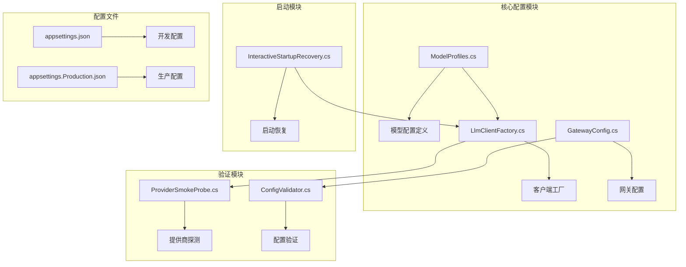
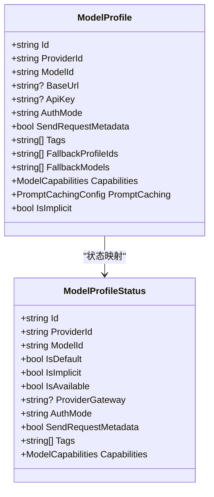
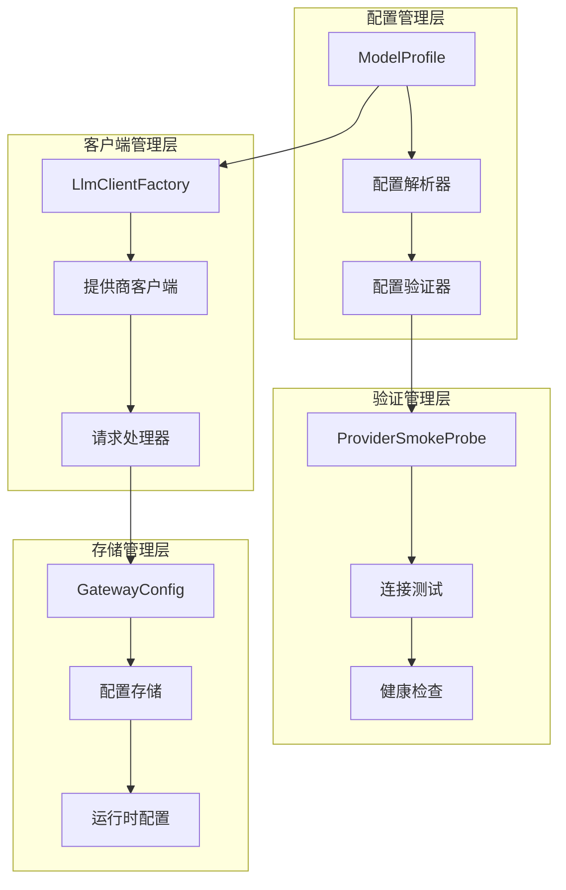
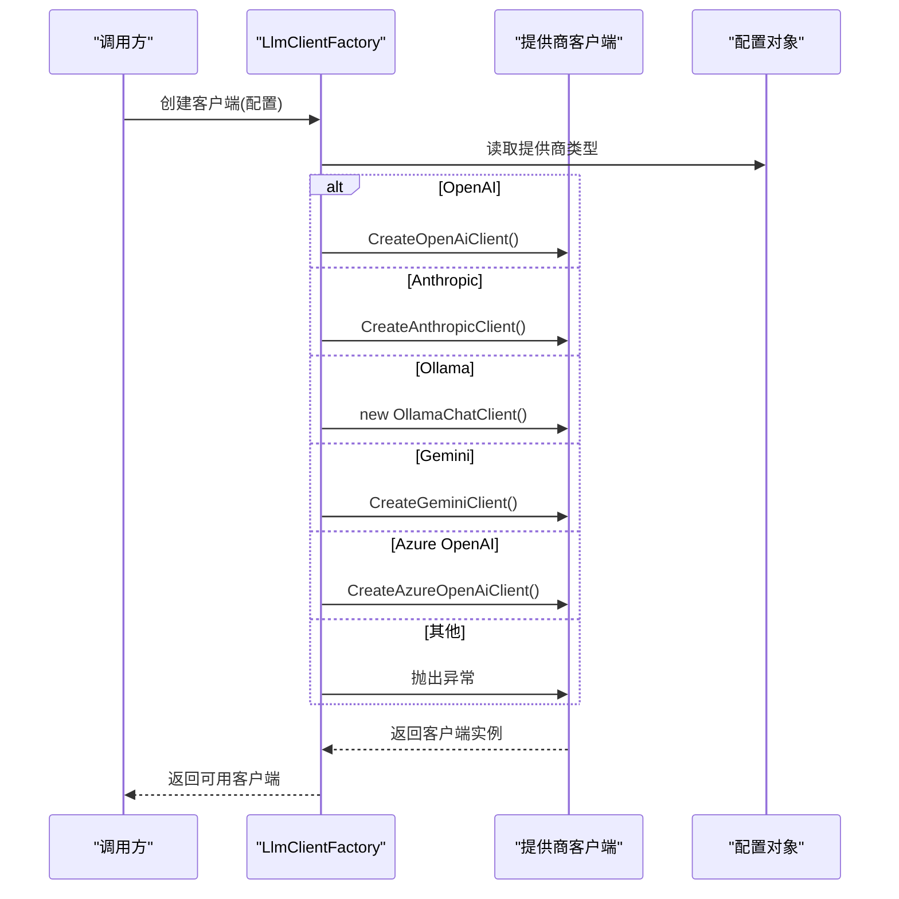
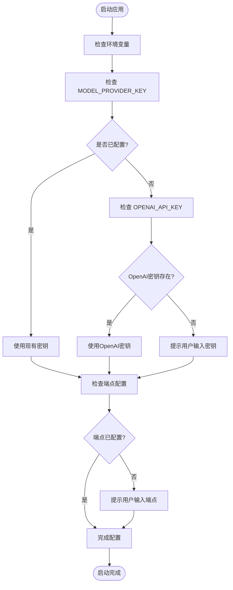
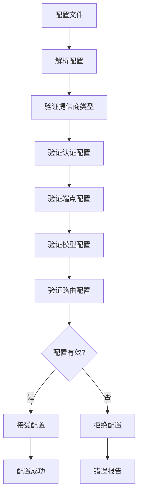
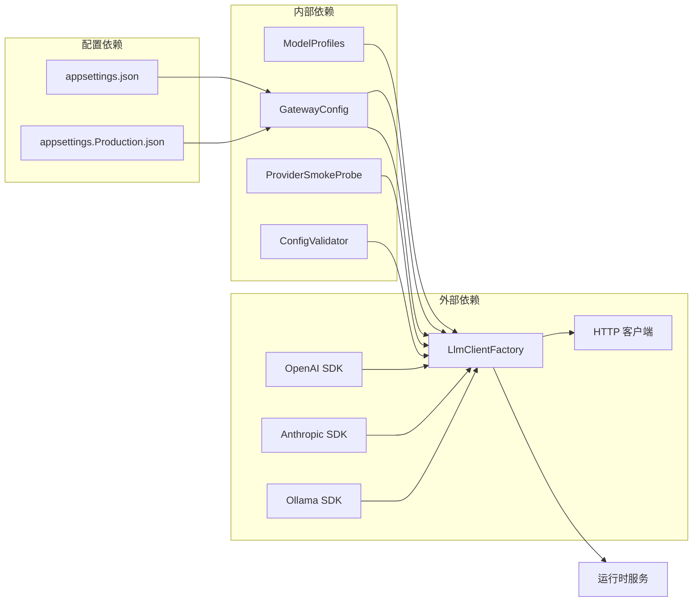
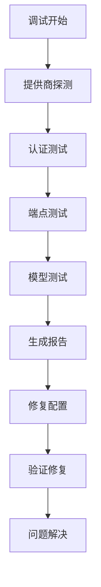

# 基础提供商设置

<cite>
**本文档引用的文件**
- [ModelProfiles.cs](file://src/OpenClaw.Core/Models/ModelProfiles.cs)
- [LlmClientFactory.cs](file://src/OpenClaw.Gateway/Extensions/LlmClientFactory.cs)
- [InteractiveStartupRecovery.cs](file://src/OpenClaw.Gateway/Bootstrap/InteractiveStartupRecovery.cs)
- [ProviderSmokeProbe.cs](file://src/OpenClaw.Core/Validation/ProviderSmokeProbe.cs)
- [GatewayConfig.cs](file://src/OpenClaw.Core/Models/GatewayConfig.cs)
- [appsettings.json](file://src/OpenClaw.Gateway/appsettings.json)
- [appsettings.Production.json](file://src/OpenClaw.Gateway/appsettings.Production.json)
- [ConfigValidator.cs](file://src/OpenClaw.Core/Validation/ConfigValidator.cs)
</cite>

## 目录
1. [简介](#简介)
2. [项目结构](#项目结构)
3. [核心组件](#核心组件)
4. [架构概览](#架构概览)
5. [详细组件分析](#详细组件分析)
6. [依赖关系分析](#依赖关系分析)
7. [性能考虑](#性能考虑)
8. [故障排除指南](#故障排除指南)
9. [结论](#结论)

## 简介

基础提供商设置是 OpenClaw 代理系统的核心配置模块，负责管理 LLM（大语言模型）提供商的各种配置选项。本文档深入解释了提供商类型选择、默认模型配置、API 密钥管理和端点设置等关键功能。

该系统支持多种主流 LLM 提供商，包括 OpenAI、Anthropic、Ollama、Google Gemini 等，并提供了灵活的配置机制来满足不同的部署需求。通过统一的配置接口，用户可以轻松地在不同的提供商之间进行切换，而无需修改应用程序代码。

## 项目结构

基础提供商设置涉及以下关键文件和目录：

**图表来源**
- [ModelProfiles.cs:62-95](file://src/OpenClaw.Core/Models/ModelProfiles.cs#L62-L95)
- [LlmClientFactory.cs:105-163](file://src/OpenClaw.Gateway/Extensions/LlmClientFactory.cs#L105-L163)
- [GatewayConfig.cs:279-295](file://src/OpenClaw.Core/Models/GatewayConfig.cs#L279-L295)

**章节来源**
- [ModelProfiles.cs:62-95](file://src/OpenClaw.Core/Models/ModelProfiles.cs#L62-L95)
- [LlmClientFactory.cs:105-163](file://src/OpenClaw.Gateway/Extensions/LlmClientFactory.cs#L105-L163)
- [GatewayConfig.cs:279-295](file://src/OpenClaw.Core/Models/GatewayConfig.cs#L279-L295)

## 核心组件

### 模型配置文件结构

模型配置采用统一的数据结构，支持多种提供商类型的配置：

**图表来源**
- [ModelProfiles.cs:62-95](file://src/OpenClaw.Core/Models/ModelProfiles.cs#L62-L95)

### 支持的提供商类型

系统支持以下 LLM 提供商类型：

| 提供商类型 | 支持的标识符 | 默认端点 | 认证模式 |
|-----------|-------------|----------|----------|
| OpenAI | openai | api.openai.com | bearer |
| Anthropic | anthropic, claude | api.anthropic.com | bearer |
| Google Gemini | gemini, google | generativelanguage.googleapis.com | bearer |
| Ollama | ollama | localhost:11434 | none |
| Azure OpenAI | azure-openai | 自定义 | bearer |
| 其他兼容提供商 | openai-compatible, aperture | 自定义 | bearer/tailnet-identity |

**章节来源**
- [LlmClientFactory.cs:105-163](file://src/OpenClaw.Gateway/Extensions/LlmClientFactory.cs#L105-L163)

## 架构概览

基础提供商设置采用分层架构设计，确保了良好的可扩展性和维护性：

**图表来源**
- [LlmClientFactory.cs:105-163](file://src/OpenClaw.Gateway/Extensions/LlmClientFactory.cs#L105-L163)
- [ProviderSmokeProbe.cs:180-194](file://src/OpenClaw.Core/Validation/ProviderSmokeProbe.cs#L180-L194)

## 详细组件分析

### 客户端工厂组件

客户端工厂负责根据配置动态创建相应的 LLM 客户端：

**图表来源**
- [LlmClientFactory.cs:105-163](file://src/OpenClaw.Gateway/Extensions/LlmClientFactory.cs#L105-L163)

**章节来源**
- [LlmClientFactory.cs:105-163](file://src/OpenClaw.Gateway/Extensions/LlmClientFactory.cs#L105-L163)

### 启动恢复流程

系统提供了智能的启动恢复机制，自动处理 API 密钥和端点配置：

**图表来源**
- [InteractiveStartupRecovery.cs:217-282](file://src/OpenClaw.Gateway/Bootstrap/InteractiveStartupRecovery.cs#L217-L282)

**章节来源**
- [InteractiveStartupRecovery.cs:217-282](file://src/OpenClaw.Gateway/Bootstrap/InteractiveStartupRecovery.cs#L217-L282)

### 配置验证机制

系统内置了全面的配置验证机制，确保配置的正确性和完整性：

**图表来源**
- [ConfigValidator.cs:705-739](file://src/OpenClaw.Core/Validation/ConfigValidator.cs#L705-L739)

**章节来源**
- [ConfigValidator.cs:705-739](file://src/OpenClaw.Core/Validation/ConfigValidator.cs#L705-L739)

## 依赖关系分析

基础提供商设置模块之间的依赖关系如下：

**图表来源**
- [LlmClientFactory.cs:105-163](file://src/OpenClaw.Gateway/Extensions/LlmClientFactory.cs#L105-L163)
- [GatewayConfig.cs:279-295](file://src/OpenClaw.Core/Models/GatewayConfig.cs#L279-L295)

**章节来源**
- [LlmClientFactory.cs:105-163](file://src/OpenClaw.Gateway/Extensions/LlmClientFactory.cs#L105-L163)
- [GatewayConfig.cs:279-295](file://src/OpenClaw.Core/Models/GatewayConfig.cs#L279-L295)

## 性能考虑

### 连接池管理

系统实现了智能的连接池管理机制，优化了提供商连接的使用效率：

- **连接复用**：相同配置的客户端实例会被缓存和复用
- **超时控制**：为所有网络请求设置了合理的超时时间
- **重试策略**：实现了指数退避的重试机制
- **资源清理**：自动清理不再使用的连接资源

### 缓存策略

为了提高响应速度，系统采用了多层缓存策略：

- **模型元数据缓存**：缓存模型能力信息和配置
- **提供商状态缓存**：缓存提供商的健康状态
- **配置变更缓存**：缓存最近的配置变更

## 故障排除指南

### 常见配置问题

| 问题类型 | 症状 | 解决方案 |
|---------|------|---------|
| API 密钥错误 | 认证失败，返回 401 错误 | 检查环境变量或配置文件中的密钥值 |
| 端点配置错误 | 连接超时或无法访问 | 验证端点 URL 的正确性和可达性 |
| 模型不支持 | 返回不支持的模型错误 | 确认模型名称与提供商要求一致 |
| 网络连接问题 | 超时或连接被拒绝 | 检查防火墙设置和网络连通性 |

### 调试工具

系统提供了多种调试工具来帮助诊断配置问题：

**章节来源**
- [ProviderSmokeProbe.cs:180-194](file://src/OpenClaw.Core/Validation/ProviderSmokeProbe.cs#L180-L194)

## 结论

基础提供商设置模块为 OpenClaw 代理系统提供了强大而灵活的 LLM 提供商管理能力。通过统一的配置接口和智能的启动恢复机制，用户可以轻松地在不同的提供商之间进行切换，并且能够快速定位和解决配置问题。

该模块的设计充分考虑了可扩展性和维护性，支持新的提供商类型轻松集成，并提供了完善的错误处理和调试机制。对于需要在生产环境中部署的用户来说，这个模块提供了可靠的基础设施支持，确保了系统的稳定性和可靠性。

通过遵循本文档中提供的最佳实践和配置指南，用户可以充分利用系统的能力，构建高效、可靠的 AI 应用程序。