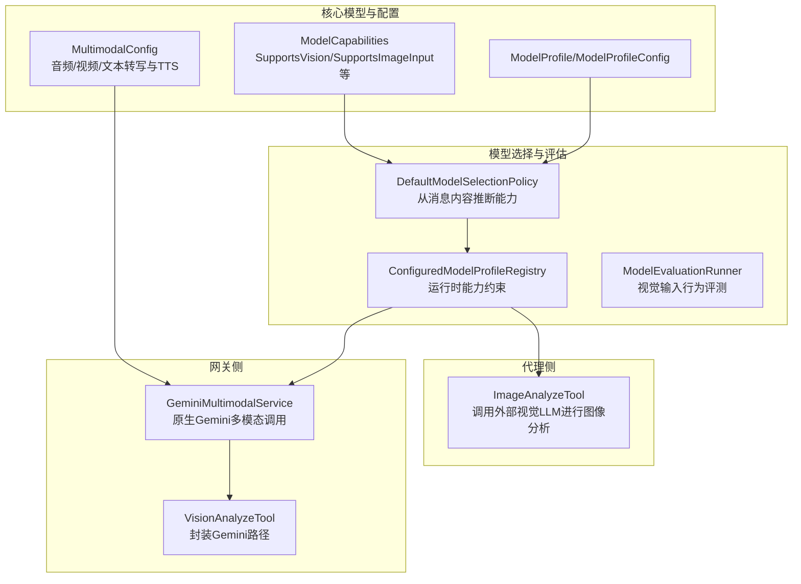
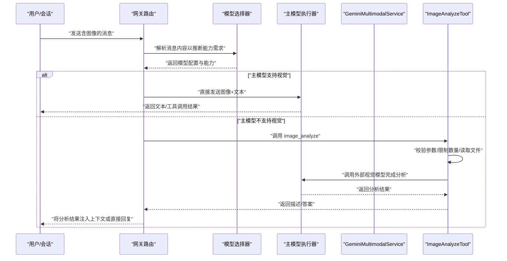
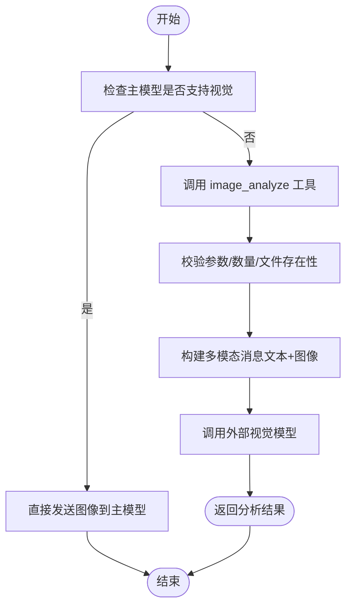
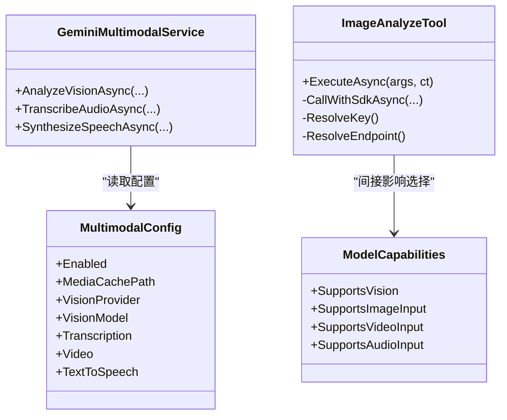

# 多模态支持配置

<cite>
**本文引用的文件**
- [ImageAnalyzeTool.cs](file://src/OpenClaw.Agent/Tools/ImageAnalyzeTool.cs)
- [VisionAnalyzeTool.cs](file://src/OpenClaw.Gateway/Tools/VisionAnalyzeTool.cs)
- [GeminiMultimodalService.cs](file://src/OpenClaw.Gateway/GeminiMultimodalService.cs)
- [MultimodalModels.cs](file://src/OpenClaw.Core/Models/MultimodalModels.cs)
- [ModelProfiles.cs](file://src/OpenClaw.Core/Models/ModelProfiles.cs)
- [DefaultModelSelectionPolicy.cs](file://src/OpenClaw.Gateway/Models/DefaultModelSelectionPolicy.cs)
- [ConfiguredModelProfileRegistry.cs](file://src/OpenClaw.Gateway/Models/ConfiguredModelProfileRegistry.cs)
- [ModelEvaluationRunner.cs](file://src/OpenClaw.Gateway/Models/ModelEvaluationRunner.cs)
- [MODEL_PROFILES.md](file://docs/MODEL_PROFILES.md)
- [COMPATIBILITY.md](file://docs/COMPATIBILITY.md)
</cite>

## 目录
1. [简介](#简介)
2. [项目结构](#项目结构)
3. [核心组件](#核心组件)
4. [架构总览](#架构总览)
5. [详细组件分析](#详细组件分析)
6. [依赖关系分析](#依赖关系分析)
7. [性能考量](#性能考量)
8. [故障排查指南](#故障排查指南)
9. [结论](#结论)
10. [附录](#附录)

## 简介
本技术文档聚焦于多模态支持配置，系统性阐述以下主题：
- 视觉能力支持（SupportsVision）的启用条件与配置要求
- 图像处理流程：直接发送到主模型 vs 通过 image_analyze 工具处理的区别
- 多模态消息格式、媒体类型支持与处理策略
- 不同模型的视觉能力对比与兼容性说明
- 多模态提示工程最佳实践与性能优化建议

## 项目结构
围绕多模态能力的关键代码分布在以下模块：
- 核心模型与配置：MultimodalConfig、ModelCapabilities、ModelProfile 等
- 网关侧多模态服务：GeminiMultimodalService 及其工具封装
- 代理侧图像分析工具：ImageAnalyzeTool（作为“第二层”图像分析）
- 模型选择与能力评估：DefaultModelSelectionPolicy、ConfiguredModelProfileRegistry、ModelEvaluationRunner
- 文档与参考：MODEL_PROFILES.md、COMPATIBILITY.md

图表来源
- [MultimodalModels.cs:3-15](file://src/OpenClaw.Core/Models/MultimodalModels.cs#L3-L15)
- [ModelProfiles.cs:26-45](file://src/OpenClaw.Core/Models/ModelProfiles.cs#L26-L45)
- [GeminiMultimodalService.cs:11-31](file://src/OpenClaw.Gateway/GeminiMultimodalService.cs#L11-L31)
- [VisionAnalyzeTool.cs:6-13](file://src/OpenClaw.Gateway/Tools/VisionAnalyzeTool.cs#L6-L13)
- [ImageAnalyzeTool.cs:16-20](file://src/OpenClaw.Agent/Tools/ImageAnalyzeTool.cs#L16-L20)
- [DefaultModelSelectionPolicy.cs:170-183](file://src/OpenClaw.Gateway/Models/DefaultModelSelectionPolicy.cs#L170-L183)
- [ConfiguredModelProfileRegistry.cs:349-368](file://src/OpenClaw.Gateway/Models/ConfiguredModelProfileRegistry.cs#L349-L368)
- [ModelEvaluationRunner.cs:497-523](file://src/OpenClaw.Gateway/Models/ModelEvaluationRunner.cs#L497-L523)

章节来源
- [MultimodalModels.cs:3-15](file://src/OpenClaw.Core/Models/MultimodalModels.cs#L3-L15)
- [ModelProfiles.cs:26-45](file://src/OpenClaw.Core/Models/ModelProfiles.cs#L26-L45)
- [GeminiMultimodalService.cs:11-31](file://src/OpenClaw.Gateway/GeminiMultimodalService.cs#L11-L31)
- [VisionAnalyzeTool.cs:6-13](file://src/OpenClaw.Gateway/Tools/VisionAnalyzeTool.cs#L6-L13)
- [ImageAnalyzeTool.cs:16-20](file://src/OpenClaw.Agent/Tools/ImageAnalyzeTool.cs#L16-L20)
- [DefaultModelSelectionPolicy.cs:170-183](file://src/OpenClaw.Gateway/Models/DefaultModelSelectionPolicy.cs#L170-L183)
- [ConfiguredModelProfileRegistry.cs:349-368](file://src/OpenClaw.Gateway/Models/ConfiguredModelProfileRegistry.cs#L349-L368)
- [ModelEvaluationRunner.cs:497-523](file://src/OpenClaw.Gateway/Models/ModelEvaluationRunner.cs#L497-L523)

## 核心组件
- 多模态配置（MultimodalConfig）
  - 控制是否启用多模态、媒体缓存路径、默认视觉/语音提供商与模型、转写与TTS参数等
- 模型能力标志（ModelCapabilities）
  - 关键视觉相关字段：SupportsVision、SupportsImageInput、SupportsVideoInput、SupportsAudioInput
- 网关侧原生Gemini多模态服务（GeminiMultimodalService）
  - 提供图像分析、音频转写、文本转语音等能力；支持本地文件、URL、dataURL等多种输入
- 代理侧图像分析工具（ImageAnalyzeTool）
  - 当主模型不支持视觉时，调用独立的视觉模型提供方进行图像分析
- 模型选择与能力评估
  - 从请求消息中推断是否需要视觉能力
  - 运行时对嵌入式模型附加能力约束
  - 评测场景验证视觉输入行为

章节来源
- [MultimodalModels.cs:3-15](file://src/OpenClaw.Core/Models/MultimodalModels.cs#L3-L15)
- [ModelProfiles.cs:26-45](file://src/OpenClaw.Core/Models/ModelProfiles.cs#L26-L45)
- [GeminiMultimodalService.cs:33-60](file://src/OpenClaw.Gateway/GeminiMultimodalService.cs#L33-L60)
- [ImageAnalyzeTool.cs:52-107](file://src/OpenClaw.Agent/Tools/ImageAnalyzeTool.cs#L52-L107)
- [DefaultModelSelectionPolicy.cs:170-183](file://src/OpenClaw.Gateway/Models/DefaultModelSelectionPolicy.cs#L170-L183)
- [ConfiguredModelProfileRegistry.cs:349-368](file://src/OpenClaw.Gateway/Models/ConfiguredModelProfileRegistry.cs#L349-L368)
- [ModelEvaluationRunner.cs:497-523](file://src/OpenClaw.Gateway/Models/ModelEvaluationRunner.cs#L497-L523)

## 架构总览
多模态处理在“主模型 + 视觉工具”的双层架构下工作：
- 主模型具备视觉能力（SupportsVision=true 且 SupportsImageInput=true）时，可直接接收图像/视频/音频内容并生成响应
- 主模型不具备视觉能力时，使用 image_analyze 工具调用独立的视觉模型提供方进行分析

图表来源
- [DefaultModelSelectionPolicy.cs:170-183](file://src/OpenClaw.Gateway/Models/DefaultModelSelectionPolicy.cs#L170-L183)
- [GeminiMultimodalService.cs:33-60](file://src/OpenClaw.Gateway/GeminiMultimodalService.cs#L33-L60)
- [ImageAnalyzeTool.cs:52-107](file://src/OpenClaw.Agent/Tools/ImageAnalyzeTool.cs#L52-L107)

## 详细组件分析

### 视觉能力启用条件与配置要求
- 启用条件
  - 消息中包含图像/视频/音频内容时，模型选择器会将 SupportsVision 与 SupportsImageInput/SupportsVideoInput/SupportsAudioInput 置位
  - 对嵌入式模型，若未启用多模态或未满足图像输入能力，则会强制关闭视频输入能力
- 配置要求
  - 多模态开关与默认提供商/模型由 MultimodalConfig 控制
  - 模型能力由 ModelCapabilities 的 SupportsVision/SupportsImageInput 等字段声明
  - 评测场景 ModelEvaluationRunner 中明确要求同时满足 SupportsVision 与 SupportsImageInput 才能通过视觉输入行为测试

章节来源
- [DefaultModelSelectionPolicy.cs:170-183](file://src/OpenClaw.Gateway/Models/DefaultModelSelectionPolicy.cs#L170-L183)
- [ConfiguredModelProfileRegistry.cs:349-368](file://src/OpenClaw.Gateway/Models/ConfiguredModelProfileRegistry.cs#L349-L368)
- [MultimodalModels.cs:3-15](file://src/OpenClaw.Core/Models/MultimodalModels.cs#L3-L15)
- [ModelProfiles.cs:26-45](file://src/OpenClaw.Core/Models/ModelProfiles.cs#L26-L45)
- [ModelEvaluationRunner.cs:497-523](file://src/OpenClaw.Gateway/Models/ModelEvaluationRunner.cs#L497-L523)

### 图像处理流程：直接发送 vs 通过 image_analyze
- 直接发送到主模型（主模型具备视觉能力）
  - 输入：文本 + 图像/视频/音频内容
  - 输出：主模型直接分析并生成响应
  - 优点：端到端链路短、延迟低
  - 适用：主模型明确支持视觉输入
- 通过 image_analyze 工具处理
  - 输入：image_urls 或 image_paths + prompt
  - 行为：读取本地文件或下载远程图片，构建多模态消息，调用外部视觉模型
  - 输出：返回图像描述或问题答案
  - 适用：主模型不支持视觉或需专用视觉模型

图表来源
- [ImageAnalyzeTool.cs:52-107](file://src/OpenClaw.Agent/Tools/ImageAnalyzeTool.cs#L52-L107)
- [GeminiMultimodalService.cs:33-60](file://src/OpenClaw.Gateway/GeminiMultimodalService.cs#L33-L60)

章节来源
- [ImageAnalyzeTool.cs:52-107](file://src/OpenClaw.Agent/Tools/ImageAnalyzeTool.cs#L52-L107)
- [VisionAnalyzeTool.cs:31-43](file://src/OpenClaw.Gateway/Tools/VisionAnalyzeTool.cs#L31-L43)
- [GeminiMultimodalService.cs:33-60](file://src/OpenClaw.Gateway/GeminiMultimodalService.cs#L33-L60)

### 多模态消息格式、媒体类型支持与处理策略
- 消息格式
  - 支持文本与媒体混合的内容单元（例如 URI 内容、数据内容），用于表达图像/视频/音频输入
- 媒体类型支持
  - 图像：png、jpeg、webp、gif
  - 音频：ogg、mp3、wav、m4a、webm 等
  - 服务内部根据扩展名或响应头自动推断 MIME 类型
- 处理策略
  - 本地文件：受允许根目录限制，避免任意路径读取
  - 远程 URL：仅允许 http/https，或被允许的本地文件路径
  - dataURL：支持 base64 与非 base64 形式，按最大字节限制估算与校验
  - 超大媒体：按配置的最大字节数进行严格限制，超限抛出异常

章节来源
- [GeminiMultimodalService.cs:243-289](file://src/OpenClaw.Gateway/GeminiMultimodalService.cs#L243-L289)
- [GeminiMultimodalService.cs:318-363](file://src/OpenClaw.Gateway/GeminiMultimodalService.cs#L318-L363)
- [GeminiMultimodalService.cs:439-453](file://src/OpenClaw.Gateway/GeminiMultimodalService.cs#L439-L453)

### 不同模型的视觉能力对比与兼容性说明
- 能力维度
  - SupportsVision：是否支持视觉输入
  - SupportsImageInput/SupportsVideoInput/SupportsAudioInput：分别对应图像/视频/音频输入
  - 其他相关能力：SupportsTools、SupportsStreaming、SupportsParallelToolCalls 等
- 评测场景
  - ModelEvaluationRunner 的“vision”场景要求模型同时满足 SupportsVision 与 SupportsImageInput，并对最小输出长度与文本可用性进行验证
- 配置示例与标签
  - MODEL_PROFILES.md 展示了如何通过标签（如 vision）与能力声明来区分生产与本地部署的模型配置

章节来源
- [ModelProfiles.cs:26-45](file://src/OpenClaw.Core/Models/ModelProfiles.cs#L26-L45)
- [ModelEvaluationRunner.cs:497-523](file://src/OpenClaw.Gateway/Models/ModelEvaluationRunner.cs#L497-L523)
- [MODEL_PROFILES.md:202-216](file://docs/MODEL_PROFILES.md#L202-L216)

### 多模态提示工程最佳实践
- 明确指令
  - 在图像分析 prompt 中清晰表达任务目标（如“描述图像内容”“提取所有文字”“识别物体并给出类别”）
- 控制输入规模
  - 使用 image_analyze 的 MaxImagesPerCall 限制单次调用的图像数量，避免超出外部视觉模型的并发与体积限制
- 安全与合规
  - 本地文件访问需在允许根目录内；dataURL 与远程 URL 需遵守大小限制与协议范围
- 性能与成本
  - 优先使用主模型直连视觉能力，减少额外调用链
  - 对高频图像分析场景，结合媒体缓存与转写/合成能力降低重复开销

章节来源
- [ImageAnalyzeTool.cs:72-74](file://src/OpenClaw.Agent/Tools/ImageAnalyzeTool.cs#L72-L74)
- [GeminiMultimodalService.cs:243-289](file://src/OpenClaw.Gateway/GeminiMultimodalService.cs#L243-L289)
- [MultimodalModels.cs:17-40](file://src/OpenClaw.Core/Models/MultimodalModels.cs#L17-L40)

## 依赖关系分析
- 组件耦合
  - GeminiMultimodalService 依赖 GatewayConfig、MediaCacheStore、日志与 HTTP 客户端
  - ImageAnalyzeTool 依赖 OpenAI SDK、配置与安全解析器
  - 模型选择器与注册表共同决定最终能力集
- 外部依赖
  - Gemini API（图像分析、转写、TTS）
  - OpenAI SDK（外部视觉模型调用）
- 循环依赖
  - 未见循环依赖迹象；各模块职责清晰

图表来源
- [GeminiMultimodalService.cs:20-31](file://src/OpenClaw.Gateway/GeminiMultimodalService.cs#L20-L31)
- [ImageAnalyzeTool.cs:18-20](file://src/OpenClaw.Agent/Tools/ImageAnalyzeTool.cs#L18-L20)
- [MultimodalModels.cs:3-15](file://src/OpenClaw.Core/Models/MultimodalModels.cs#L3-L15)
- [ModelProfiles.cs:26-45](file://src/OpenClaw.Core/Models/ModelProfiles.cs#L26-L45)

章节来源
- [GeminiMultimodalService.cs:20-31](file://src/OpenClaw.Gateway/GeminiMultimodalService.cs#L20-L31)
- [ImageAnalyzeTool.cs:18-20](file://src/OpenClaw.Agent/Tools/ImageAnalyzeTool.cs#L18-L20)
- [MultimodalModels.cs:3-15](file://src/OpenClaw.Core/Models/MultimodalModels.cs#L3-L15)
- [ModelProfiles.cs:26-45](file://src/OpenClaw.Core/Models/ModelProfiles.cs#L26-L45)

## 性能考量
- 延迟与吞吐
  - 主模型直连视觉能力通常优于跨服务调用 image_analyze
  - 外部视觉模型调用受网络与模型实例性能影响，应设置合理超时与重试策略
- 媒体处理
  - 严格控制媒体大小与数量，避免超限导致失败或高延迟
  - 使用媒体缓存减少重复传输与转码
- 并发与资源
  - 合理设置 MaxImagesPerCall 与并发调用上限，避免触发外部服务限流
- 评测与监控
  - 利用模型评估场景记录延迟、Token 消耗与通过率，持续优化配置

章节来源
- [ImageAnalyzeTool.cs:125-129](file://src/OpenClaw.Agent/Tools/ImageAnalyzeTool.cs#L125-L129)
- [GeminiMultimodalService.cs:365-369](file://src/OpenClaw.Gateway/GeminiMultimodalService.cs#L365-L369)
- [ModelEvaluationRunner.cs:513-522](file://src/OpenClaw.Gateway/Models/ModelEvaluationRunner.cs#L513-L522)

## 故障排查指南
- 常见错误与定位
  - “缺少图像”：image_analyze 参数缺失 image_urls 与 image_paths
  - “图像过多”：超过 MaxImagesPerCall 限制
  - “API密钥未配置”：未设置 Plugins:Native:ImageAnalyze:ApiKey 或环境变量 VISION_API_KEY
  - “文件不存在”：本地路径不存在或权限不足
  - “媒体过大”：超过配置的最大字节数限制
  - “本地文件未授权”：不在允许的媒体缓存根目录内
- 排查步骤
  - 检查模型配置中的能力标志（SupportsVision/SupportsImageInput）
  - 校验消息内容是否包含图像/视频/音频媒体
  - 确认外部视觉模型端点与凭据正确
  - 查看网关与代理的日志，定位具体失败阶段
- 诊断工具
  - 使用模型评估场景验证视觉输入行为
  - 通过 CLI 与管理接口查看模型状态与兼容性报告

章节来源
- [ImageAnalyzeTool.cs:69-78](file://src/OpenClaw.Agent/Tools/ImageAnalyzeTool.cs#L69-L78)
- [ImageAnalyzeTool.cs:91-103](file://src/OpenClaw.Agent/Tools/ImageAnalyzeTool.cs#L91-L103)
- [GeminiMultimodalService.cs:252-258](file://src/OpenClaw.Gateway/GeminiMultimodalService.cs#L252-L258)
- [GeminiMultimodalService.cs:301-303](file://src/OpenClaw.Gateway/GeminiMultimodalService.cs#L301-L303)
- [ModelEvaluationRunner.cs:497-523](file://src/OpenClaw.Gateway/Models/ModelEvaluationRunner.cs#L497-L523)
- [COMPATIBILITY.md:96-103](file://docs/COMPATIBILITY.md#L96-L103)

## 结论
- 视觉能力的启用由消息内容自动推断，并通过模型能力标志与运行时约束共同决定
- 主模型直连视觉能力是首选方案；当主模型不支持时，可通过 image_analyze 工具调用外部视觉模型
- 多模态配置与能力声明是保障兼容性与性能的关键；建议结合评测场景持续优化
- 安全、合规与性能需同步关注，确保在复杂场景下的稳定运行

## 附录
- 相关文档
  - MODEL_PROFILES.md：模型配置与能力声明示例
  - COMPATIBILITY.md：运行时模式与桥接矩阵

章节来源
- [MODEL_PROFILES.md:1-268](file://docs/MODEL_PROFILES.md#L1-L268)
- [COMPATIBILITY.md:1-131](file://docs/COMPATIBILITY.md#L1-L131)