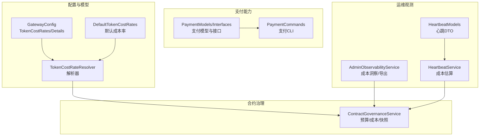
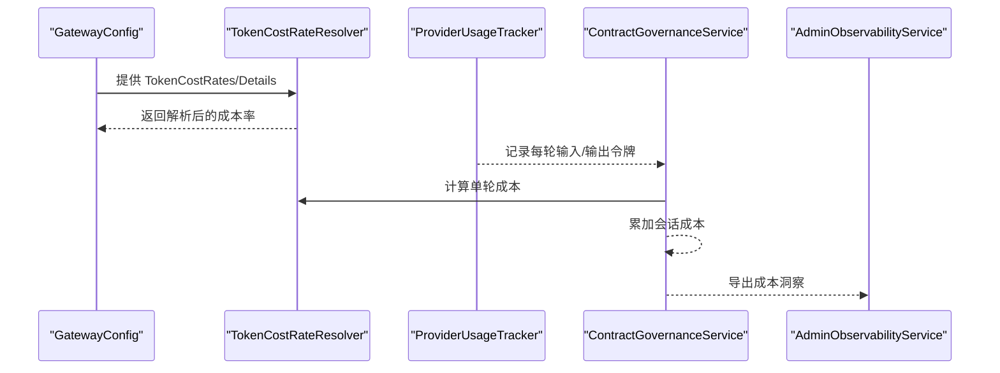
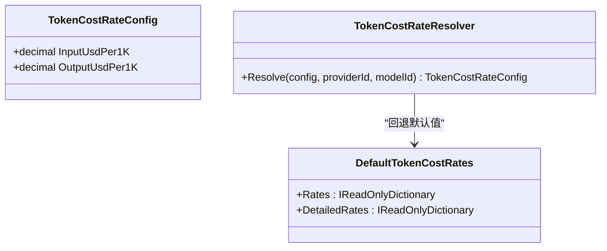
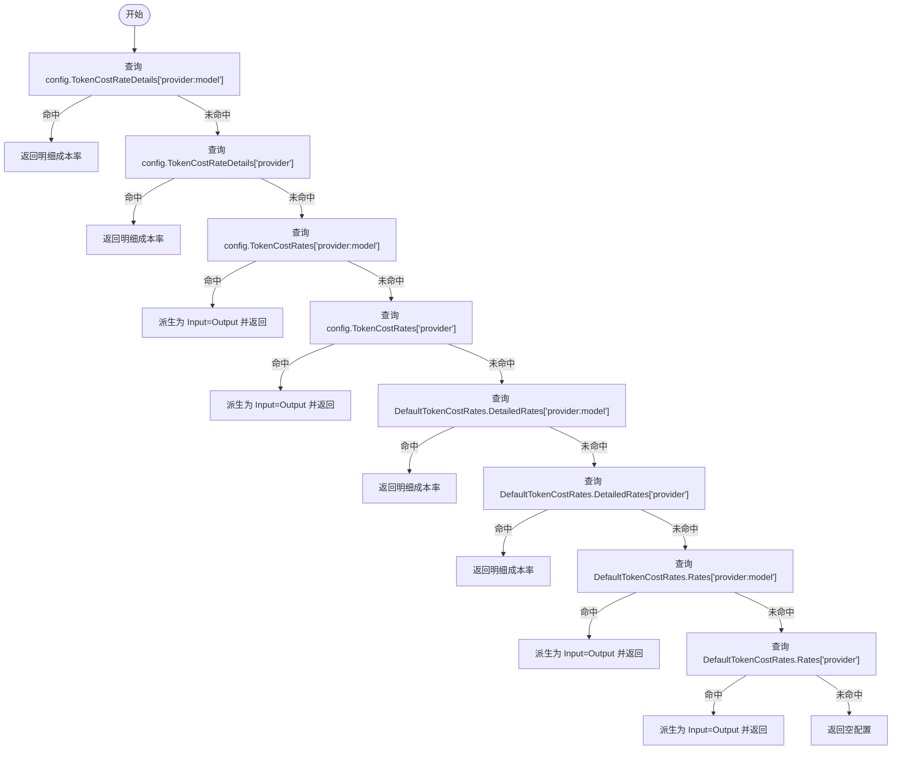
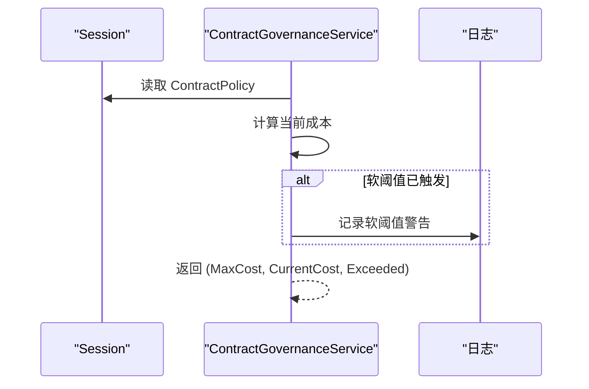
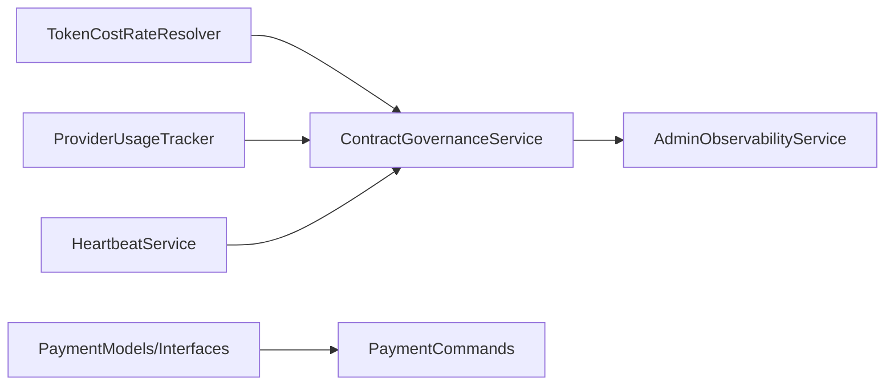

# 成本管理配置

<cite>
**本文档引用的文件**
- [GatewayConfig.cs](file://src/OpenClaw.Core/Models/GatewayConfig.cs)
- [ContractGovernanceService.cs](file://src/OpenClaw.Gateway/ContractGovernanceService.cs)
- [TokenCostRateResolver.cs](file://src/OpenClaw.Core/Models/GatewayConfig.cs)
- [DefaultTokenCostRates.cs](file://src/OpenClaw.Core/Models/GatewayConfig.cs)
- [ContractGovernanceTests.cs](file://src/OpenClaw.Tests/ContractGovernanceTests.cs)
- [PaymentCommands.cs](file://src/OpenClaw.Cli/PaymentCommands.cs)
- [PaymentModels.cs](file://src/OpenClaw.Payments.Abstractions/PaymentModels.cs)
- [PaymentInterfaces.cs](file://src/OpenClaw.Payments.Abstractions/PaymentInterfaces.cs)
- [AdminObservabilityService.cs](file://src/OpenClaw.Gateway/AdminObservabilityService.cs)
- [OperatorGovernanceModels.cs](file://src/OpenClaw.Core/Models/OperatorGovernanceModels.cs)
- [HeartbeatService.cs](file://src/OpenClaw.Gateway/HeartbeatService.cs)
- [HeartbeatModels.cs](file://src/OpenClaw.Core/Models/HeartbeatModels.cs)
</cite>

## 目录
1. [简介](#简介)
2. [项目结构](#项目结构)
3. [核心组件](#核心组件)
4. [架构总览](#架构总览)
5. [详细组件分析](#详细组件分析)
6. [依赖关系分析](#依赖关系分析)
7. [性能考虑](#性能考虑)
8. [故障排除指南](#故障排除指南)
9. [结论](#结论)
10. [附录](#附录)

## 简介
本文件面向成本管理配置，系统化说明以下主题：
- 令牌成本计算机制：TokenCostRates 与 TokenCostRateDetails 的区别与使用场景
- 输入/输出异步定价模型的配置方法
- 成本率解析器（TokenCostRateResolver）的工作流程与优先级规则
- 不同提供商的成本差异与优化策略
- 成本预算设置、超支预警与自动降级机制
- 成本分析工具使用指南与月度成本报告生成方法

## 项目结构
成本管理相关代码主要分布在以下模块：
- 配置与模型：GatewayConfig 中定义 TokenCostRates、TokenCostRateDetails、默认成本率与解析器
- 合约治理服务：ContractGovernanceService 负责预算检查、成本累计与快照
- 支付能力：Payments.Abstractions 定义支付模型与接口；CLI 提供支付命令行工具
- 运维观测：AdminObservabilityService 提供成本洞察与导出；HeartbeatService 提供成本估算

图表来源
- [GatewayConfig.cs:68-85](file://src/OpenClaw.Core/Models/GatewayConfig.cs#L68-L85)
- [ContractGovernanceService.cs:247-254](file://src/OpenClaw.Gateway/ContractGovernanceService.cs#L247-L254)
- [PaymentModels.cs:6-46](file://src/OpenClaw.Payments.Abstractions/PaymentModels.cs#L6-L46)
- [PaymentCommands.cs:12-105](file://src/OpenClaw.Cli/PaymentCommands.cs#L12-L105)
- [AdminObservabilityService.cs:55-115](file://src/OpenClaw.Gateway/AdminObservabilityService.cs#L55-L115)
- [HeartbeatService.cs:953-971](file://src/OpenClaw.Gateway/HeartbeatService.cs#L953-L971)
- [HeartbeatModels.cs:61-102](file://src/OpenClaw.Core/Models/HeartbeatModels.cs#L61-L102)

章节来源
- [GatewayConfig.cs:68-85](file://src/OpenClaw.Core/Models/GatewayConfig.cs#L68-L85)
- [ContractGovernanceService.cs:247-254](file://src/OpenClaw.Gateway/ContractGovernanceService.cs#L247-L254)

## 核心组件
- TokenCostRateConfig：包含 InputUsdPer1K 与 OutputUsdPer1K，用于异步定价模型
- TokenCostRateResolver：根据 providerId 与 modelId 解析成本率，支持模型级与提供商级覆盖
- DefaultTokenCostRates：内置常见提供商/模型的默认成本率
- ContractGovernanceService：负责会话成本累计、预算检查、超支预警与生命周期快照
- PaymentModels/Interfaces：支付环境、动作、决策、机密与接口抽象
- AdminObservabilityService：提供成本洞察、汇总与审计导出
- HeartbeatService：基于心跳任务配置进行成本估算

章节来源
- [GatewayConfig.cs:81-85](file://src/OpenClaw.Core/Models/GatewayConfig.cs#L81-L85)
- [GatewayConfig.cs:297-322](file://src/OpenClaw.Core/Models/GatewayConfig.cs#L297-L322)
- [GatewayConfig.cs:268-295](file://src/OpenClaw.Core/Models/GatewayConfig.cs#L268-L295)
- [ContractGovernanceService.cs:387-408](file://src/OpenClaw.Gateway/ContractGovernanceService.cs#L387-L408)
- [PaymentModels.cs:6-46](file://src/OpenClaw.Payments.Abstractions/PaymentModels.cs#L6-L46)
- [AdminObservabilityService.cs:55-115](file://src/OpenClaw.Gateway/AdminObservabilityService.cs#L55-L115)
- [HeartbeatService.cs:953-971](file://src/OpenClaw.Gateway/HeartbeatService.cs#L953-L971)

## 架构总览
成本管理从配置解析开始，贯穿执行期累计与预算控制，并通过观测与支付能力形成闭环。

图表来源
- [GatewayConfig.cs:68-85](file://src/OpenClaw.Core/Models/GatewayConfig.cs#L68-L85)
- [TokenCostRateResolver.cs:297-322](file://src/OpenClaw.Core/Models/GatewayConfig.cs#L297-L322)
- [ContractGovernanceService.cs:247-254](file://src/OpenClaw.Gateway/ContractGovernanceService.cs#L247-L254)
- [AdminObservabilityService.cs:55-115](file://src/OpenClaw.Gateway/AdminObservabilityService.cs#L55-L115)

## 详细组件分析

### 令牌成本计算机制：TokenCostRates 与 TokenCostRateDetails
- TokenCostRates：键为 "provider:model" 或 "provider"，值为统一的 USD/1K tokens，适用于输入输出价格一致的场景
- TokenCostRateDetails：键为 "provider:model" 或 "provider"，值为 TokenCostRateConfig，分别指定 InputUsdPer1K 与 OutputUsdPer1K，适用于输入/输出异步定价模型
- 默认成本率：DefaultTokenCostRates 提供内置默认值，作为回退来源

图表来源
- [GatewayConfig.cs:81-85](file://src/OpenClaw.Core/Models/GatewayConfig.cs#L81-L85)
- [GatewayConfig.cs:268-295](file://src/OpenClaw.Core/Models/GatewayConfig.cs#L268-L295)
- [GatewayConfig.cs:297-322](file://src/OpenClaw.Core/Models/GatewayConfig.cs#L297-L322)

章节来源
- [GatewayConfig.cs:68-85](file://src/OpenClaw.Core/Models/GatewayConfig.cs#L68-L85)
- [GatewayConfig.cs:268-295](file://src/OpenClaw.Core/Models/GatewayConfig.cs#L268-L295)
- [GatewayConfig.cs:297-322](file://src/OpenClaw.Core/Models/GatewayConfig.cs#L297-L322)

### 成本率解析器（TokenCostRateResolver）工作流程与优先级
解析器按以下优先级查找成本率并返回 TokenCostRateConfig：
1) 用户配置：TokenCostRateDetails["provider:model"]
2) 用户配置：TokenCostRateDetails["provider"]
3) 用户配置：TokenCostRates["provider:model"] → 自动派生为 Input=Output
4) 用户配置：TokenCostRates["provider"] → 自动派生为 Input=Output
5) 默认明细：DefaultTokenCostRates.DetailedRates["provider:model"]
6) 默认明细：DefaultTokenCostRates.DetailedRates["provider"]
7) 默认标量：DefaultTokenCostRates.Rates["provider:model"] → 自动派生为 Input=Output
8) 默认标量：DefaultTokenCostRates.Rates["provider"] → 自动派生为 Input=Output
9) 未找到时返回空配置

图表来源
- [TokenCostRateResolver.cs:297-322](file://src/OpenClaw.Core/Models/GatewayConfig.cs#L297-L322)

章节来源
- [TokenCostRateResolver.cs:297-322](file://src/OpenClaw.Core/Models/GatewayConfig.cs#L297-L322)

### 输入/输出异步定价模型配置方法
- 使用 TokenCostRateDetails 配置 "provider:model" 或 "provider" 键，分别设置 InputUsdPer1K 与 OutputUsdPer1K
- 若仅配置 TokenCostRates，则解析器会将其视为对称价格并派生为 Input=Output
- 默认明细与标量成本率可作为回退来源

章节来源
- [GatewayConfig.cs:74-78](file://src/OpenClaw.Core/Models/GatewayConfig.cs#L74-L78)
- [GatewayConfig.cs:283-294](file://src/OpenClaw.Core/Models/GatewayConfig.cs#L283-L294)
- [GatewayConfig.cs:307-318](file://src/OpenClaw.Core/Models/GatewayConfig.cs#L307-L318)

### 成本预算设置、超支预警与自动降级机制
- 预算设置：ContractPolicy 中的 MaxCostUsd、SoftCostWarningUsd、MaxTokens、MaxToolCalls、MaxRuntimeSeconds
- 超支预警：当当前成本达到软阈值但未达上限时记录警告日志
- 预算检查：CheckCostBudget 返回 (max, current, exceeded)，用于控制流
- 成本累计：RecordTurnUsage 将每轮成本累加至会话
- 生命周期快照：BuildSnapshot 记录累积成本、令牌用量、工具调用次数与运行时长

图表来源
- [ContractGovernanceService.cs:387-408](file://src/OpenClaw.Gateway/ContractGovernanceService.cs#L387-L408)
- [ContractGovernanceService.cs:274-280](file://src/OpenClaw.Gateway/ContractGovernanceService.cs#L274-L280)

章节来源
- [ContractGovernanceService.cs:103-116](file://src/OpenClaw.Gateway/ContractGovernanceService.cs#L103-L116)
- [ContractGovernanceService.cs:387-408](file://src/OpenClaw.Gateway/ContractGovernanceService.cs#L387-L408)
- [ContractGovernanceService.cs:274-280](file://src/OpenClaw.Gateway/ContractGovernanceService.cs#L274-L280)

### 不同提供商的成本差异与优化策略
- 默认成本率差异：不同提供商与模型的 Input/Output 价格不同，解析器按优先级选择
- 优化策略建议：
  - 优先使用 TokenCostRateDetails 精准配置输入/输出异步定价
  - 对于高输出模型，适当提高 SoftCostWarningUsd 阈值以减少误报
  - 利用 HeartbeatService 的成本估算指导任务频率与提示长度
  - 通过 AdminObservabilityService 的洞察识别高成本 Provider/Model 组合并调整策略

章节来源
- [DefaultTokenCostRates.cs:268-295](file://src/OpenClaw.Core/Models/GatewayConfig.cs#L268-L295)
- [HeartbeatService.cs:953-971](file://src/OpenClaw.Gateway/HeartbeatService.cs#L953-L971)
- [AdminObservabilityService.cs:55-115](file://src/OpenClaw.Gateway/AdminObservabilityService.cs#L55-L115)

### 成本分析工具使用指南
- 成本洞察：BuildInsightsAsync 输出总请求、错误、令牌与估算成本，按 Provider/Model 排序
- 摘要卡片：BuildSummaryAsync 展示审批决策、自动化失败、Provider 错误、死信队列、通道漂移与操作员行为
- 审计导出：ExportAuditBundleAsync 导出包含 Provider Usage 与路由健康在内的压缩包，便于离线分析
- 轨迹导出：ExportTrajectoryJsonlAsync 导出会话轨迹，结合证据与治理记录进行深度分析

章节来源
- [AdminObservabilityService.cs:55-115](file://src/OpenClaw.Gateway/AdminObservabilityService.cs#L55-L115)
- [AdminObservabilityService.cs:229-307](file://src/OpenClaw.Gateway/AdminObservabilityService.cs#L229-L307)
- [AdminObservabilityService.cs:309-380](file://src/OpenClaw.Gateway/AdminObservabilityService.cs#L309-L380)
- [OperatorGovernanceModels.cs:365-386](file://src/OpenClaw.Core/Models/OperatorGovernanceModels.cs#L365-L386)

### 月度成本报告生成方法
- 使用 HeartbeatService 的成本估算：根据 Cron 表达式与时区估算每月运行次数与单次/月度成本
- 结合 AdminObservabilityService 的 Provider Usage 与路由健康数据，生成月度成本概览
- 通过 ExportAuditBundleAsync 导出包含 Provider Usage 的审计包，用于合规与财务归集

章节来源
- [HeartbeatService.cs:953-971](file://src/OpenClaw.Gateway/HeartbeatService.cs#L953-L971)
- [HeartbeatModels.cs:61-102](file://src/OpenClaw.Core/Models/HeartbeatModels.cs#L61-L102)
- [AdminObservabilityService.cs:229-307](file://src/OpenClaw.Gateway/AdminObservabilityService.cs#L229-L307)

## 依赖关系分析
- ContractGovernanceService 依赖 TokenCostRateResolver 进行成本率解析
- AdminObservabilityService 依赖 ProviderUsageTracker 与路由快照进行成本估算
- HeartbeatService 依赖模型选择与运行时估计参数进行成本估算
- 支付能力通过 PaymentCommands 与 PaymentModels/Interfaces 提供外部支付集成

图表来源
- [TokenCostRateResolver.cs:297-322](file://src/OpenClaw.Core/Models/GatewayConfig.cs#L297-L322)
- [ContractGovernanceService.cs:247-254](file://src/OpenClaw.Gateway/ContractGovernanceService.cs#L247-L254)
- [AdminObservabilityService.cs:55-115](file://src/OpenClaw.Gateway/AdminObservabilityService.cs#L55-L115)
- [HeartbeatService.cs:953-971](file://src/OpenClaw.Gateway/HeartbeatService.cs#L953-L971)
- [PaymentModels.cs:6-46](file://src/OpenClaw.Payments.Abstractions/PaymentModels.cs#L6-L46)
- [PaymentCommands.cs:12-105](file://src/OpenClaw.Cli/PaymentCommands.cs#L12-L105)

章节来源
- [ContractGovernanceService.cs:247-254](file://src/OpenClaw.Gateway/ContractGovernanceService.cs#L247-L254)
- [AdminObservabilityService.cs:55-115](file://src/OpenClaw.Gateway/AdminObservabilityService.cs#L55-L115)
- [HeartbeatService.cs:953-971](file://src/OpenClaw.Gateway/HeartbeatService.cs#L953-L971)
- [PaymentCommands.cs:12-105](file://src/OpenClaw.Cli/PaymentCommands.cs#L12-L105)

## 性能考虑
- 成本计算复杂度：解析器为常数时间查找，成本累计为 O(n) 轮次遍历
- 观测导出：审计包与轨迹导出可能产生大量数据，建议按需导出并设置保留策略
- 心跳估算：Cron 解析与时区转换为轻量计算，建议合理设置估算周期以平衡精度与开销

## 故障排除指南
- 成本率未生效：确认配置键格式为 "provider:model" 或 "provider"，并检查是否被更高优先级项覆盖
- 软阈值告警频繁：适当提高 SoftCostWarningUsd 或优化模型选择与提示长度
- 预算检查不准确：核对会话成本累计是否正确记录，关注历史轮次数量限制
- 支付命令异常：检查环境参数与 --yes 标记，确保测试/生产模式正确

章节来源
- [ContractGovernanceTests.cs:335-372](file://src/OpenClaw.Tests/ContractGovernanceTests.cs#L335-L372)
- [PaymentCommands.cs:114-118](file://src/OpenClaw.Cli/PaymentCommands.cs#L114-L118)

## 结论
通过 TokenCostRateDetails 实现输入/输出异步定价，结合 TokenCostRateResolver 的多级优先级解析，配合 ContractGovernanceService 的预算控制与 AdminObservabilityService 的成本洞察，形成完整的成本管理闭环。HeartbeatService 的成本估算与审计导出进一步支撑月度报告与合规需求。建议在实际部署中：
- 明确输入/输出异步定价策略并配置 TokenCostRateDetails
- 设置合理的 MaxCostUsd 与 SoftCostWarningUsd
- 定期导出审计包与生成月度报告
- 依据观测数据优化模型选择与任务频率

## 附录
- 支付能力：通过 PaymentCommands 与 PaymentModels/Interfaces 提供支付能力，支持虚拟卡签发与机器支付执行
- 成本模型：OperatorInsightsTotals 提供估算成本聚合，便于仪表盘与报表展示

章节来源
- [PaymentCommands.cs:33-104](file://src/OpenClaw.Cli/PaymentCommands.cs#L33-L104)
- [PaymentModels.cs:6-46](file://src/OpenClaw.Payments.Abstractions/PaymentModels.cs#L6-L46)
- [OperatorGovernanceModels.cs:377-386](file://src/OpenClaw.Core/Models/OperatorGovernanceModels.cs#L377-L386)