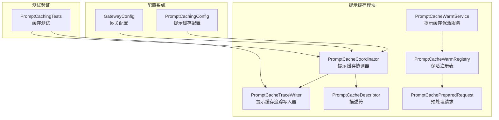
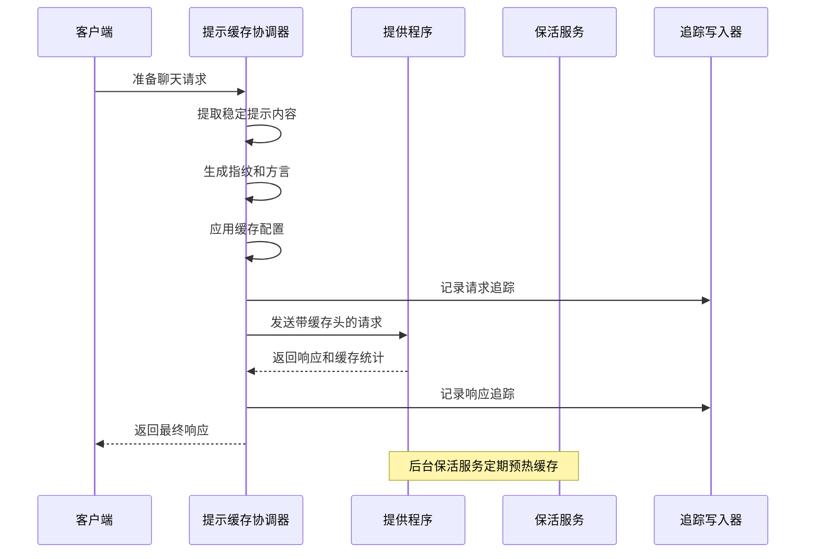
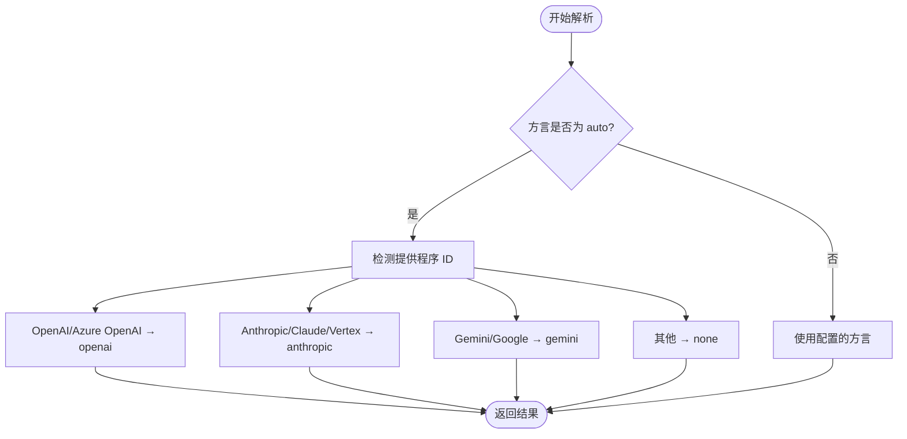
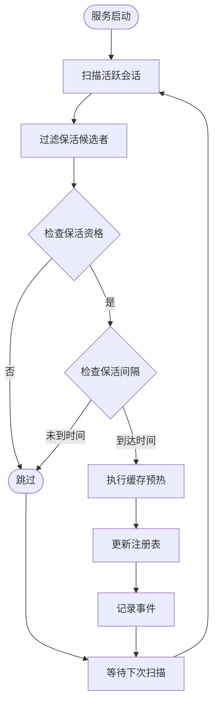
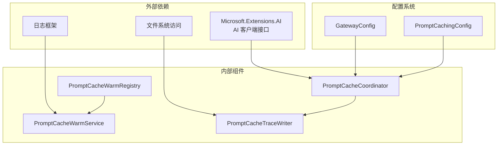

# 提示缓存配置

<cite>
**本文档引用的文件**
- [PROMPT_CACHING.md](file://docs/PROMPT_CACHING.md)
- [OpenClaw.NET-PromptCaching-Internal-Doc.md](file://docs/OpenClaw.NET-PromptCaching-Internal-Doc.md)
- [PromptCacheCoordinator.cs](file://src/OpenClaw.Gateway/PromptCaching/PromptCacheCoordinator.cs)
- [PromptCacheWarmService.cs](file://src/OpenClaw.Gateway/PromptCaching/PromptCacheWarmService.cs)
- [PromptCacheTraceWriter.cs](file://src/OpenClaw.Gateway/PromptCaching/PromptCacheTraceWriter.cs)
- [PromptCachingTests.cs](file://src/OpenClaw.Tests/PromptCachingTests.cs)
</cite>

## 目录
1. [简介](#简介)
2. [项目结构](#项目结构)
3. [核心组件](#核心组件)
4. [架构概览](#架构概览)
5. [详细组件分析](#详细组件分析)
6. [依赖关系分析](#依赖关系分析)
7. [性能考虑](#性能考虑)
8. [故障排除指南](#故障排除指南)
9. [结论](#结论)

## 简介

提示缓存是 OpenClaw.NET 中的一项关键性能优化功能，它通过在多个对话轮次中重用稳定的提示内容来显著降低延迟和成本。该功能作为提供程序感知的优化层，构建在现有的提供程序和模型配置架构之上，无需引入特定提供程序的运行时分支。

提示缓存在长对话会话中特别有效，当请求的大部分前缀保持稳定时（如基础系统提示、工具声明、技能提示内容、稳定的工件提示文件），它能够：

- 将缓存读取和写入标准化为统一的计数器
- 改善长期会话的成本和延迟可见性
- 在不引入提供程序特定运行时分支的情况下工作

## 项目结构

提示缓存功能主要分布在以下文件中：



**图表来源**
- [PromptCacheCoordinator.cs:91-269](file://src/OpenClaw.Gateway/PromptCaching/PromptCacheCoordinator.cs#L91-L269)
- [PromptCacheWarmService.cs:10-136](file://src/OpenClaw.Gateway/PromptCaching/PromptCacheWarmService.cs#L10-L136)
- [PromptCacheTraceWriter.cs:9-182](file://src/OpenClaw.Gateway/PromptCaching/PromptCacheTraceWriter.cs#L9-L182)

**章节来源**
- [PromptCacheCoordinator.cs:1-269](file://src/OpenClaw.Gateway/PromptCaching/PromptCacheCoordinator.cs#L1-L269)
- [PromptCacheWarmService.cs:1-136](file://src/OpenClaw.Gateway/PromptCaching/PromptCacheWarmService.cs#L1-L136)
- [PromptCacheTraceWriter.cs:1-182](file://src/OpenClaw.Gateway/PromptCaching/PromptCacheTraceWriter.cs#L1-L182)

## 核心组件

### 提示缓存协调器 (PromptCacheCoordinator)

提示缓存协调器是整个缓存系统的核心组件，负责：

- **提示内容提取**：从聊天消息中识别稳定的系统提示部分和易变的后缀部分
- **指纹生成**：基于稳定的提示内容、工具签名、响应格式等生成确定性指纹
- **方言解析**：根据提供程序 ID 自动解析缓存方言
- **配置应用**：将缓存配置应用到聊天选项中
- **追踪记录**：记录请求和响应的缓存使用情况

### 提示缓存保活服务 (PromptCacheWarmService)

保活服务是一个后台服务，负责：

- **活跃会话监控**：定期扫描活跃的对话会话
- **缓存预热**：对符合条件的会话执行缓存预热操作
- **间隔控制**：根据配置的间隔时间控制预热频率
- **错误处理**：优雅地处理预热过程中的异常情况

### 提示缓存追踪写入器 (PromptCacheTraceWriter)

追踪写入器负责：

- **JSONL 输出**：以 JSON Lines 格式输出缓存追踪数据
- **敏感信息脱敏**：对系统提示和消息内容进行脱敏处理
- **环境变量支持**：支持通过环境变量控制追踪行为
- **多级配置**：支持全局配置、诊断配置和运行时配置的组合

**章节来源**
- [PromptCacheCoordinator.cs:91-269](file://src/OpenClaw.Gateway/PromptCaching/PromptCacheCoordinator.cs#L91-L269)
- [PromptCacheWarmService.cs:10-136](file://src/OpenClaw.Gateway/PromptCaching/PromptCacheWarmService.cs#L10-L136)
- [PromptCacheTraceWriter.cs:9-182](file://src/OpenClaw.Gateway/PromptCaching/PromptCacheTraceWriter.cs#L9-L182)

## 架构概览

提示缓存系统的整体架构如下：



**图表来源**
- [PromptCacheCoordinator.cs:103-169](file://src/OpenClaw.Gateway/PromptCaching/PromptCacheCoordinator.cs#L103-L169)
- [PromptCacheWarmService.cs:35-134](file://src/OpenClaw.Gateway/PromptCaching/PromptCacheWarmService.cs#L35-L134)

## 详细组件分析

### 配置系统

提示缓存支持两种配置级别：

#### 全局配置
```json
{
  "OpenClaw": {
    "Llm": {
      "Provider": "openai",
      "Model": "gpt-4.1",
      "PromptCaching": {
        "Enabled": true,
        "Retention": "auto",
        "Dialect": "openai",
        "KeepWarmEnabled": false,
        "KeepWarmIntervalMinutes": 55,
        "TraceEnabled": false,
        "TraceFilePath": "./memory/logs/cache-trace.jsonl"
      }
    }
  }
}
```

#### 模型配置文件配置
```json
{
  "OpenClaw": {
    "Models": {
      "DefaultProfile": "gemma4-prod",
      "Profiles": [
        {
          "Id": "gemma4-prod",
          "Provider": "openai-compatible",
          "Model": "gemma-4",
          "BaseUrl": "https://gateway.example.com/v1",
          "ApiKey": "env:MODEL_PROVIDER_KEY",
          "PromptCaching": {
            "Enabled": true,
            "Dialect": "openai",
            "Retention": "auto"
          }
        }
      ]
    }
  }
}
```

**配置字段说明**：

| 字段名 | 类型 | 默认值 | 描述 |
|--------|------|--------|------|
| Enabled | 布尔值 | false | 启用提示缓存功能 |
| Retention | 字符串 | "auto" | 缓存保留策略：none/short/long/auto |
| Dialect | 字符串 | "auto" | 缓存方言：auto/openai/anthropic/gemini/none |
| KeepWarmEnabled | 布尔值 | false | 启用保活功能 |
| KeepWarmIntervalMinutes | 整数 | 55 | 保活间隔（分钟） |
| TraceEnabled | 布尔值 | false | 启用缓存追踪 |
| TraceFilePath | 字符串 | 无 | 追踪文件路径 |

**章节来源**
- [PROMPT_CACHING.md:21-94](file://docs/PROMPT_CACHING.md#L21-L94)
- [OpenClaw.NET-PromptCaching-Internal-Doc.md:356-367](file://docs/OpenClaw.NET-PromptCaching-Internal-Doc.md#L356-L367)

### 方言解析策略

方言解析遵循以下规则：



**图表来源**
- [PromptCacheCoordinator.cs:174-188](file://src/OpenClaw.Gateway/PromptCaching/PromptCacheCoordinator.cs#L174-L188)

### 保活功能实现

保活服务的工作流程：



**图表来源**
- [PromptCacheWarmService.cs:57-134](file://src/OpenClaw.Gateway/PromptCaching/PromptCacheWarmService.cs#L57-L134)

### 追踪系统

追踪系统支持多种配置方式：

#### 环境变量配置
- `OPENCLAW_CACHE_TRACE=1` - 启用缓存追踪
- `OPENCLAW_CACHE_TRACE_FILE=/path/to/cache-trace.jsonl` - 设置追踪文件路径
- `OPENCLAW_CACHE_TRACE_PROMPT=0|1` - 控制是否包含提示内容
- `OPENCLAW_CACHE_TRACE_SYSTEM=0|1` - 控制是否包含系统提示

#### 追踪数据结构
追踪输出包含以下关键信息：
- 选择的配置文件/提供程序/模型
- 方言和保留策略
- 稳定指纹
- 标准化的缓存使用计数器
- 请求和响应的附加属性

**章节来源**
- [PROMPT_CACHING.md:147-179](file://docs/PROMPT_CACHING.md#L147-L179)
- [PromptCacheTraceWriter.cs:21-63](file://src/OpenClaw.Gateway/PromptCaching/PromptCacheTraceWriter.cs#L21-L63)

## 依赖关系分析

提示缓存系统的依赖关系如下：



**图表来源**
- [PromptCacheCoordinator.cs:1-8](file://src/OpenClaw.Gateway/PromptCaching/PromptCacheCoordinator.cs#L1-L8)
- [PromptCacheWarmService.cs:1-7](file://src/OpenClaw.Gateway/PromptCaching/PromptCacheWarmService.cs#L1-L7)
- [PromptCacheTraceWriter.cs:1-6](file://src/OpenClaw.Gateway/PromptCaching/PromptCacheTraceWriter.cs#L1-L6)

**章节来源**
- [PromptCacheCoordinator.cs:1-8](file://src/OpenClaw.Gateway/PromptCaching/PromptCacheCoordinator.cs#L1-L8)
- [PromptCacheWarmService.cs:1-7](file://src/OpenClaw.Gateway/PromptCaching/PromptCacheWarmService.cs#L1-L7)
- [PromptCacheTraceWriter.cs:1-6](file://src/OpenClaw.Gateway/PromptCaching/PromptCacheTraceWriter.cs#L1-L6)

## 性能考虑

### 缓存命中率优化

为了最大化缓存命中率，建议：

1. **稳定的提示设计**：确保系统提示、工具声明和技能内容保持稳定
2. **合理的保留策略**：
   - `none`: 适用于临时会话
   - `short`: 适用于短期交互
   - `long`: 适用于长期对话会话
   - `auto`: 根据提供程序自动选择

3. **方言选择策略**：
   - OpenAI/Azure OpenAI: 使用 "openai"
   - Anthropic/Claude: 使用 "anthropic"
   - Gemini/Google: 使用 "gemini"
   - 兼容提供程序: 需要显式设置方言

### 存储空间管理

缓存系统提供了以下清理策略：

1. **会话清理**：定期清理非活跃会话的缓存条目
2. **时间限制**：支持基于时间的缓存过期
3. **大小限制**：可以配置最大缓存条目数量
4. **手动清理**：支持通过维护命令清理缓存

### 成本效益分析

提示缓存的主要成本节约来自：

1. **令牌节省**：重复使用稳定的提示内容，减少输入令牌消耗
2. **延迟降低**：缓存命中时避免重新计算和传输
3. **吞吐量提升**：减少 API 调用次数，提高整体系统性能

**章节来源**
- [PROMPT_CACHING.md:5-19](file://docs/PROMPT_CACHING.md#L5-L19)
- [PROMPT_CACHING.md:95-135](file://docs/PROMPT_CACHING.md#L95-L135)

## 故障排除指南

### 常见问题及解决方案

#### 问题：提示缓存未生效
**可能原因**：
- 提供程序不支持缓存功能
- 方言配置不正确
- 稳定提示内容不足

**解决步骤**：
1. 检查提供程序能力配置
2. 验证方言设置
3. 确认系统提示内容的稳定性

#### 问题：保活功能异常
**可能原因**：
- 保活间隔设置过短或过长
- 提供程序不支持保活功能
- 会话状态异常

**解决步骤**：
1. 调整保活间隔配置
2. 检查提供程序兼容性
3. 查看保活服务日志

#### 问题：追踪数据缺失
**可能原因**：
- 追踪功能未启用
- 文件权限问题
- 环境变量配置错误

**解决步骤**：
1. 启用追踪功能
2. 检查文件路径和权限
3. 验证环境变量设置

### 调试技巧

1. **启用详细追踪**：使用 `OPENCLAW_CACHE_TRACE=1` 启用完整追踪
2. **检查配置验证**：查看配置验证器的错误信息
3. **监控指标**：通过 `/metrics/providers` 端点监控缓存使用情况
4. **查看日志**：检查保活服务的日志输出

**章节来源**
- [PromptCachingTests.cs:17-46](file://src/OpenClaw.Tests/PromptCachingTests.cs#L17-L46)
- [PromptCacheWarmService.cs:47-51](file://src/OpenClaw.Gateway/PromptCaching/PromptCacheWarmService.cs#L47-L51)

## 结论

提示缓存配置为 OpenClaw.NET 提供了一个强大而灵活的性能优化解决方案。通过合理配置缓存参数、选择合适的方言和实施有效的保活策略，可以在不改变现有架构的情况下显著提升系统性能。

关键要点总结：

1. **配置灵活性**：支持全局和模型级别的配置覆盖
2. **方言适配**：自动方言解析确保与不同提供程序的兼容性
3. **保活机制**：智能的后台保活服务提升缓存命中率
4. **可观测性**：完整的追踪系统便于调试和性能分析
5. **成本效益**：显著降低令牌消耗和 API 调用成本

通过遵循本文档的配置建议和最佳实践，用户可以充分利用提示缓存功能，在保证系统稳定性的同时获得最佳的性能表现。