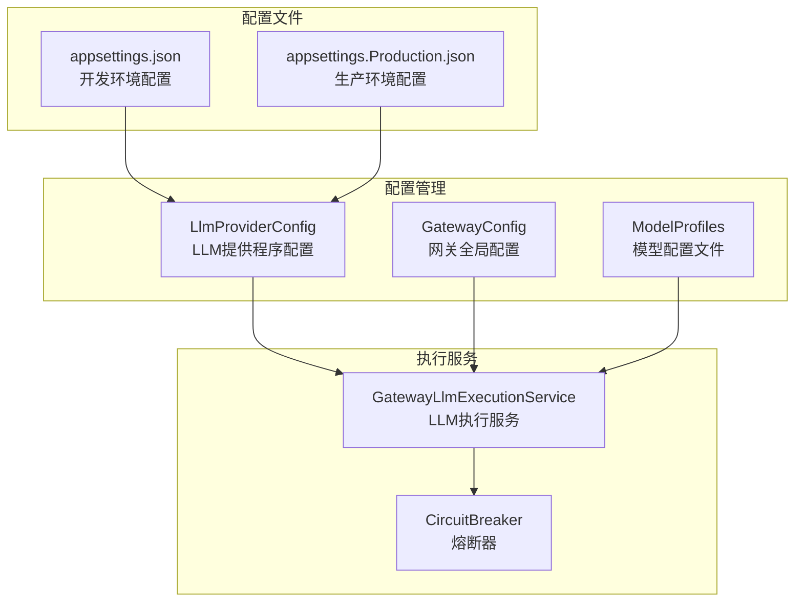
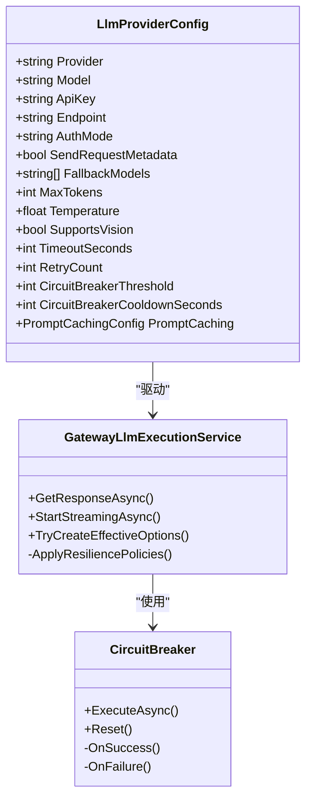
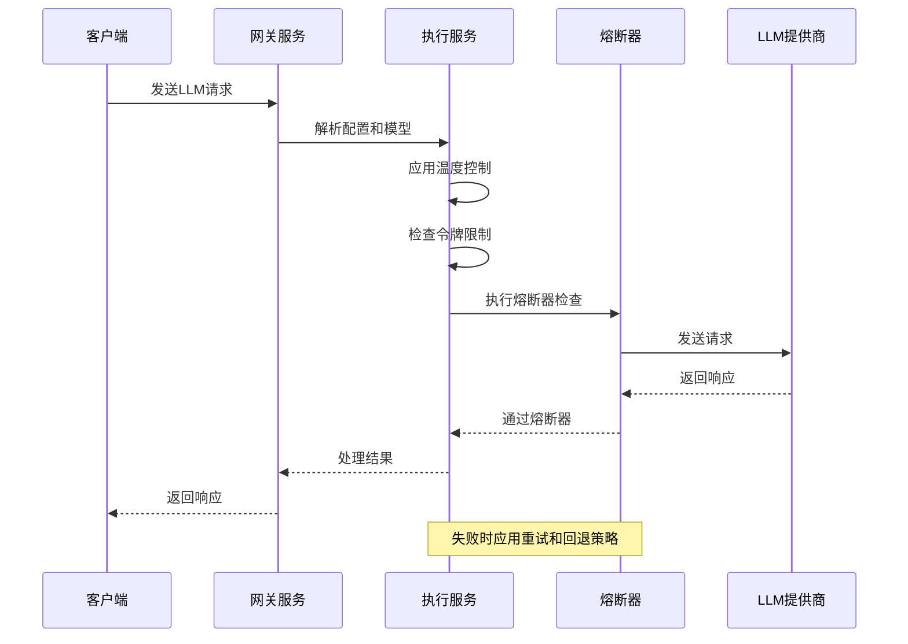
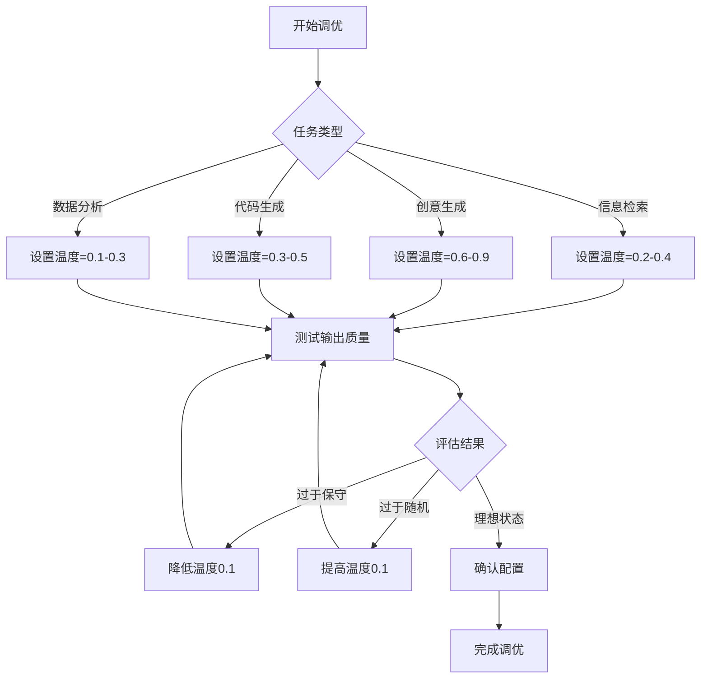
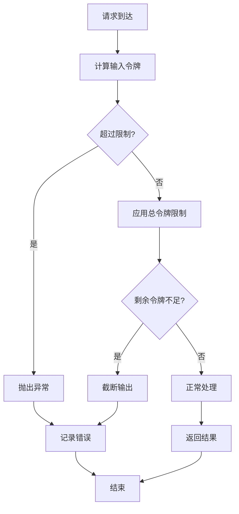
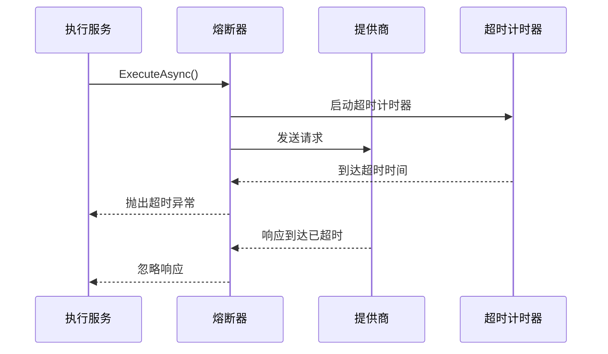
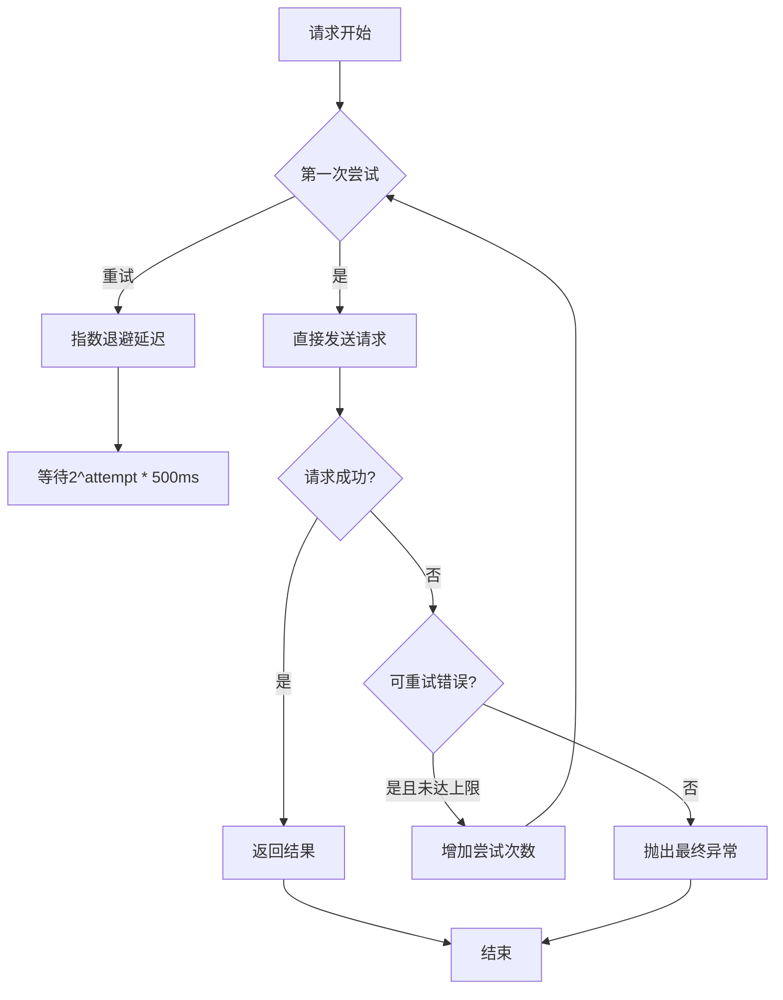
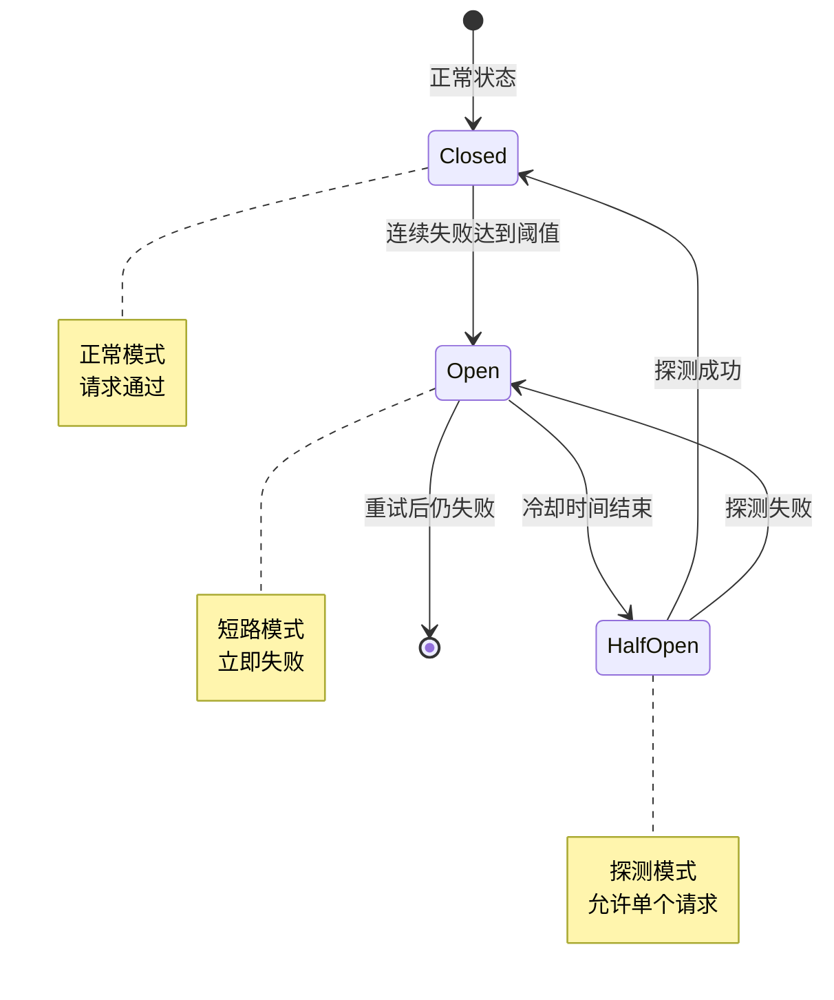
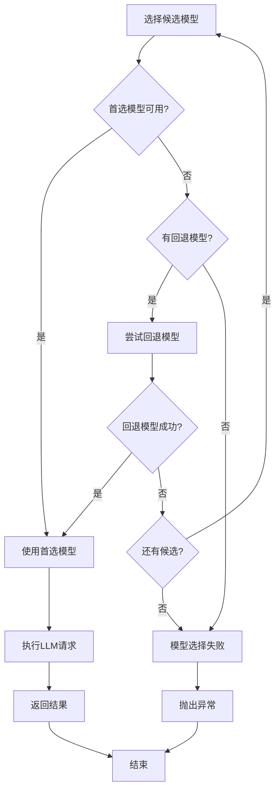
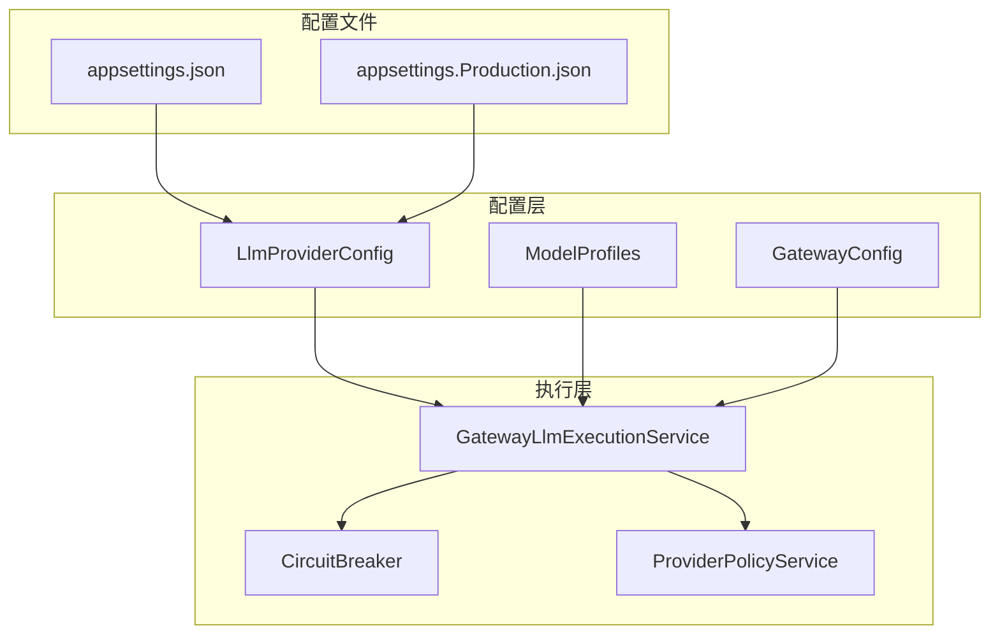

# 高级配置选项

<cite>
**本文档引用的文件**
- [LlmProviderConfig.cs](file://src/OpenClaw.Core/Models/GatewayConfig.cs)
- [GatewayLlmExecutionService.cs](file://src/OpenClaw.Gateway/GatewayLlmExecutionService.cs)
- [CircuitBreaker.cs](file://src/OpenClaw.Agent/CircuitBreaker.cs)
- [appsettings.json](file://src/OpenClaw.Gateway/appsettings.json)
- [appsettings.Production.json](file://src/OpenClaw.Gateway/appsettings.Production.json)
- [ResilienceTests.cs](file://src/OpenClaw.Tests/ResilienceTests.cs)
- [ModelProfiles.cs](file://src/OpenClaw.Core/Models/ModelProfiles.cs)
</cite>

## 目录
1. [简介](#简介)
2. [项目结构](#项目结构)
3. [核心组件](#核心组件)
4. [架构概览](#架构概览)
5. [详细组件分析](#详细组件分析)
6. [依赖关系分析](#依赖关系分析)
7. [性能考虑](#性能考虑)
8. [故障排除指南](#故障排除指南)
9. [结论](#结论)

## 简介

本文档深入解析Kingcrab项目中的高级配置选项，重点关注以下关键配置参数：

- **温度控制（Temperature）**：解释其对输出随机性和创造性的影响，以及调优策略
- **最大令牌数（MaxTokens）限制**：令牌预算管理和上下文控制
- **超时设置（TimeoutSeconds）**：请求超时管理和资源保护
- **重试机制（RetryCount）**：失败重试策略和指数退避
- **熔断器配置（CircuitBreakerThreshold、CircuitBreakerCooldownSeconds）**：故障检测和恢复机制
- **多模型回退策略（FallbackModels）**：模型选择和故障转移

这些配置选项共同构成了系统的弹性设计和性能优化基础。

## 项目结构

**图表来源**
- [LlmProviderConfig.cs:87-119](file://src/OpenClaw.Core/Models/GatewayConfig.cs#L87-L119)
- [GatewayLlmExecutionService.cs:18-96](file://src/OpenClaw.Gateway/GatewayLlmExecutionService.cs#L18-L96)

## 核心组件

### LLM提供程序配置模型

LlmProviderConfig是系统的核心配置类，定义了所有LLM相关的高级配置选项：

**图表来源**
- [LlmProviderConfig.cs:87-119](file://src/OpenClaw.Core/Models/GatewayConfig.cs#L87-L119)
- [GatewayLlmExecutionService.cs:218-358](file://src/OpenClaw.Gateway/GatewayLlmExecutionService.cs#L218-L358)
- [CircuitBreaker.cs:15-36](file://src/OpenClaw.Agent/CircuitBreaker.cs#L15-L36)

**章节来源**
- [LlmProviderConfig.cs:87-119](file://src/OpenClaw.Core/Models/GatewayConfig.cs#L87-L119)
- [GatewayLlmExecutionService.cs:218-358](file://src/OpenClaw.Gateway/GatewayLlmExecutionService.cs#L218-L358)

## 架构概览

系统采用分层架构设计，通过配置驱动的方式实现灵活的LLM服务管理：

**图表来源**
- [GatewayLlmExecutionService.cs:297-307](file://src/OpenClaw.Gateway/GatewayLlmExecutionService.cs#L297-L307)
- [CircuitBreaker.cs:91-147](file://src/OpenClaw.Agent/CircuitBreaker.cs#L91-L147)

## 详细组件分析

### 温度控制（Temperature）配置

温度参数直接影响LLM输出的随机性和创造性：

#### 影响机制
- **低温度值（0.0-0.3）**：输出更加确定性和保守，适合需要准确答案的任务
- **中等温度值（0.3-0.7）**：平衡创造性和准确性，适用于大多数对话场景
- **高温度值（0.7-1.0）**：输出更具创造性和多样性，适合创意写作和头脑风暴

#### 调优策略

**图表来源**
- [LlmProviderConfig.cs:97](file://src/OpenClaw.Core/Models/GatewayConfig.cs#L97)
- [GatewayLlmExecutionService.cs:610](file://src/OpenClaw.Gateway/GatewayLlmExecutionService.cs#L610)

**章节来源**
- [LlmProviderConfig.cs:97](file://src/OpenClaw.Core/Models/GatewayConfig.cs#L97)
- [GatewayLlmExecutionService.cs:610](file://src/OpenClaw.Gateway/GatewayLlmExecutionService.cs#L610)

### 最大令牌数（MaxTokens）限制

令牌限制确保系统资源的有效利用和成本控制：

#### 实现机制

**图表来源**
- [GatewayLlmExecutionService.cs:586-603](file://src/OpenClaw.Gateway/GatewayLlmExecutionService.cs#L586-L603)

#### 配置要点
- **MaxTokens**：单次响应的最大输出令牌数
- **MaxContextTokens**：模型支持的最大上下文长度
- **自动调整**：根据输入令牌动态调整输出令牌

**章节来源**
- [GatewayLlmExecutionService.cs:586-603](file://src/OpenClaw.Gateway/GatewayLlmExecutionService.cs#L586-L603)
- [LlmProviderConfig.cs:96](file://src/OpenClaw.Core/Models/GatewayConfig.cs#L96)

### 超时设置（TimeoutSeconds）

超时机制防止请求无限期挂起，保护系统资源：

#### 超时实现

**图表来源**
- [GatewayLlmExecutionService.cs:299-307](file://src/OpenClaw.Gateway/GatewayLlmExecutionService.cs#L299-L307)
- [CircuitBreaker.cs:91-147](file://src/OpenClaw.Agent/CircuitBreaker.cs#L91-L147)

**章节来源**
- [GatewayLlmExecutionService.cs:299-307](file://src/OpenClaw.Gateway/GatewayLlmExecutionService.cs#L299-L307)
- [LlmProviderConfig.cs:107](file://src/OpenClaw.Core/Models/GatewayConfig.cs#L107)

### 重试机制（RetryCount）

系统采用智能重试策略处理临时性故障：

#### 重试算法

**图表来源**
- [GatewayLlmExecutionService.cs:260-273](file://src/OpenClaw.Gateway/GatewayLlmExecutionService.cs#L260-L273)

#### 重试条件
- **HttpRequestException**：网络请求异常
- **TimeoutException**：请求超时
- **TaskCanceledException**：操作取消
- **CircuitOpenException**：熔断器打开

**章节来源**
- [GatewayLlmExecutionService.cs:260-273](file://src/OpenClaw.Gateway/GatewayLlmExecutionService.cs#L260-L273)
- [GatewayLlmExecutionService.cs:913-917](file://src/OpenClaw.Gateway/GatewayLlmExecutionService.cs#L913-L917)
- [LlmProviderConfig.cs:110](file://src/OpenClaw.Core/Models/GatewayConfig.cs#L110)

### 熔断器配置

熔断器提供故障隔离和快速失败机制：

#### 状态转换图

**图表来源**
- [CircuitBreaker.cs:210-215](file://src/OpenClaw.Agent/CircuitBreaker.cs#L210-L215)
- [GatewayLlmExecutionService.cs:947-951](file://src/OpenClaw.Gateway/GatewayLlmExecutionService.cs#L947-L951)

#### 配置参数
- **CircuitBreakerThreshold**：触发熔断的连续失败次数（默认5次）
- **CircuitBreakerCooldownSeconds**：熔断冷却时间（默认30秒）
- **指数退避**：探测失败时采用2^n倍退避策略

**章节来源**
- [CircuitBreaker.cs:30-36](file://src/OpenClaw.Agent/CircuitBreaker.cs#L30-L36)
- [GatewayLlmExecutionService.cs:947-951](file://src/OpenClaw.Gateway/GatewayLlmExecutionService.cs#L947-L951)
- [LlmProviderConfig.cs:113-116](file://src/OpenClaw.Core/Models/GatewayConfig.cs#L113-L116)

### 多模型回退策略

系统支持多级回退机制确保服务可用性：

#### 回退流程

**图表来源**
- [GatewayLlmExecutionService.cs:233-241](file://src/OpenClaw.Gateway/GatewayLlmExecutionService.cs#L233-L241)
- [GatewayLlmExecutionService.cs:243-251](file://src/OpenClaw.Gateway/GatewayLlmExecutionService.cs#L243-L251)

#### 配置方式
- **FallbackModels**：在LlmProviderConfig中定义
- **模型优先级**：按数组顺序依次尝试
- **动态选择**：运行时根据会话需求选择

**章节来源**
- [GatewayLlmExecutionService.cs:233-251](file://src/OpenClaw.Gateway/GatewayLlmExecutionService.cs#L233-L251)
- [ModelProfiles.cs:20](file://src/OpenClaw.Core/Models/ModelProfiles.cs#L20)

## 依赖关系分析

**图表来源**
- [GatewayLlmExecutionService.cs:38-49](file://src/OpenClaw.Gateway/GatewayLlmExecutionService.cs#L38-L49)
- [appsettings.json:22-44](file://src/OpenClaw.Gateway/appsettings.json#L22-L44)

**章节来源**
- [GatewayLlmExecutionService.cs:38-49](file://src/OpenClaw.Gateway/GatewayLlmExecutionService.cs#L38-L49)
- [appsettings.json:22-44](file://src/OpenClaw.Gateway/appsettings.json#L22-L44)

## 性能考虑

### 配置优化建议

1. **温度参数调优**
   - 对于对话系统：0.6-0.8
   - 对于代码生成：0.3-0.5
   - 对于数据分析：0.1-0.3

2. **令牌预算管理**
   - 设置合理的MaxTokens避免过度消耗
   - 监控总令牌使用量进行成本控制

3. **超时参数设置**
   - 根据网络环境调整TimeoutSeconds
   - 生产环境建议600秒以上

4. **熔断器参数**
   - 默认阈值5次失败合理
   - 冷却时间30秒适中，可根据业务调整

### 监控指标

- **请求成功率**：监控整体服务健康状况
- **平均响应时间**：评估性能表现
- **熔断器状态**：监控外部服务稳定性
- **令牌使用率**：控制成本和资源使用

## 故障排除指南

### 常见问题诊断

#### 熔断器频繁打开
**症状**：大量CircuitOpenException异常
**原因**：外部服务不稳定或配置阈值过低
**解决方案**：
1. 检查外部服务健康状况
2. 适当提高CircuitBreakerThreshold
3. 监控服务SLA指标

#### 请求超时频繁
**症状**：TimeoutException异常增多
**原因**：网络延迟或服务响应慢
**解决方案**：
1. 增加TimeoutSeconds配置
2. 检查网络连接质量
3. 考虑使用CDN或就近部署

#### 重试循环
**症状**：系统持续重试但无进展
**原因**：错误类型不支持重试或配置不当
**解决方案**：
1. 检查IsTransient判断逻辑
2. 调整RetryCount和退避策略
3. 实施更精细的错误分类

### 调试技巧

1. **启用详细日志**：监控每个配置参数的实际使用情况
2. **性能基准测试**：定期评估不同配置下的性能表现
3. **A/B测试**：对比不同配置组合的效果差异
4. **容量规划**：基于历史数据预测资源需求

**章节来源**
- [ResilienceTests.cs:16-252](file://src/OpenClaw.Tests/ResilienceTests.cs#L16-L252)

## 结论

Kingcrab项目的高级配置选项提供了完整的LLM服务治理能力。通过精心设计的配置参数，系统能够在保证服务质量的同时实现最佳的性能表现和成本控制。

关键优势包括：
- **灵活的温度控制**：支持从保守到创造性的各种应用场景
- **智能的令牌管理**：确保资源使用的可持续性
- **健壮的超时机制**：保护系统免受长时间阻塞影响
- **完善的重试策略**：提高服务可用性和用户体验
- **可靠的熔断器设计**：实现故障隔离和快速恢复
- **多级回退机制**：最大化服务连续性

建议在生产环境中：
1. 基于实际业务场景进行参数调优
2. 建立监控告警机制
3. 定期评估和更新配置策略
4. 制定应急预案和回滚方案

通过合理配置这些高级选项，可以构建一个既高效又可靠的LLM服务基础设施。