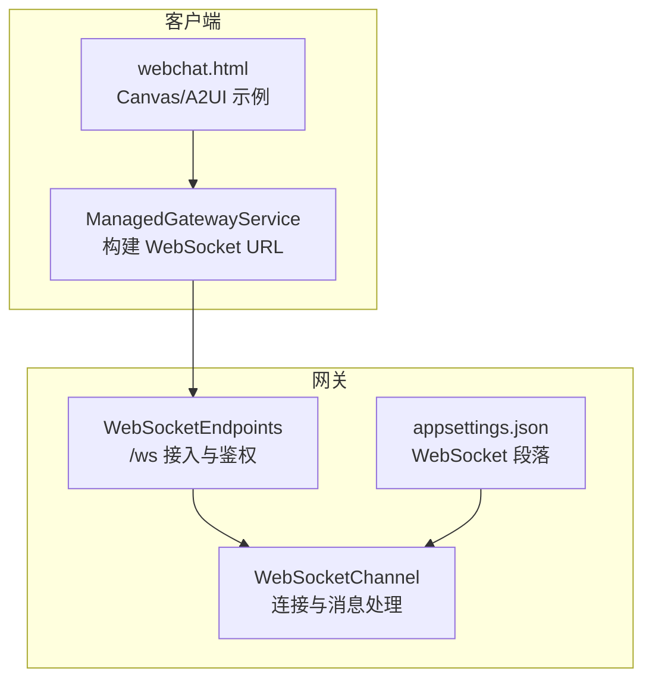
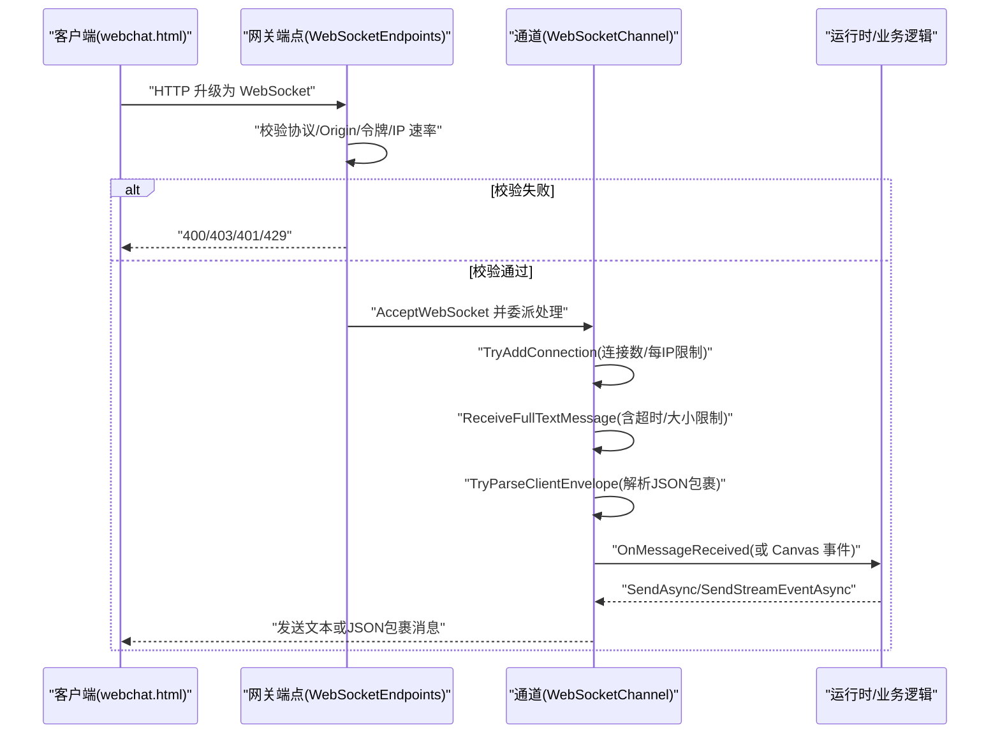
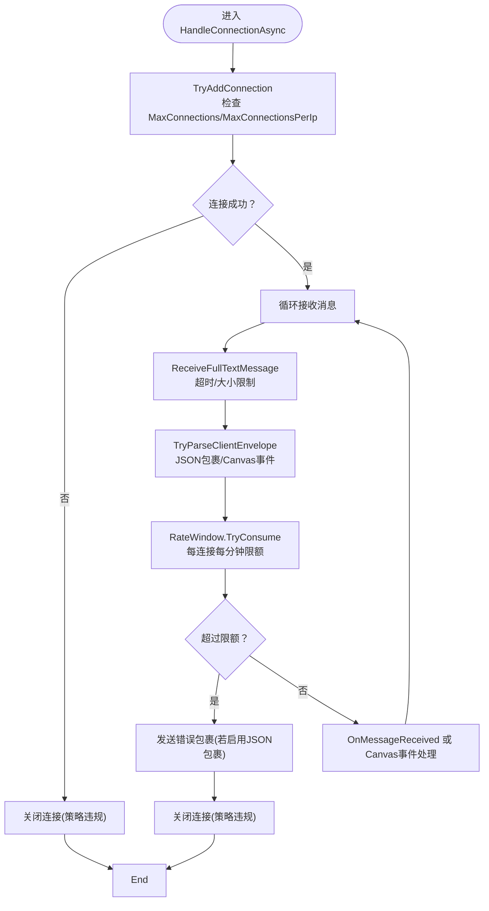
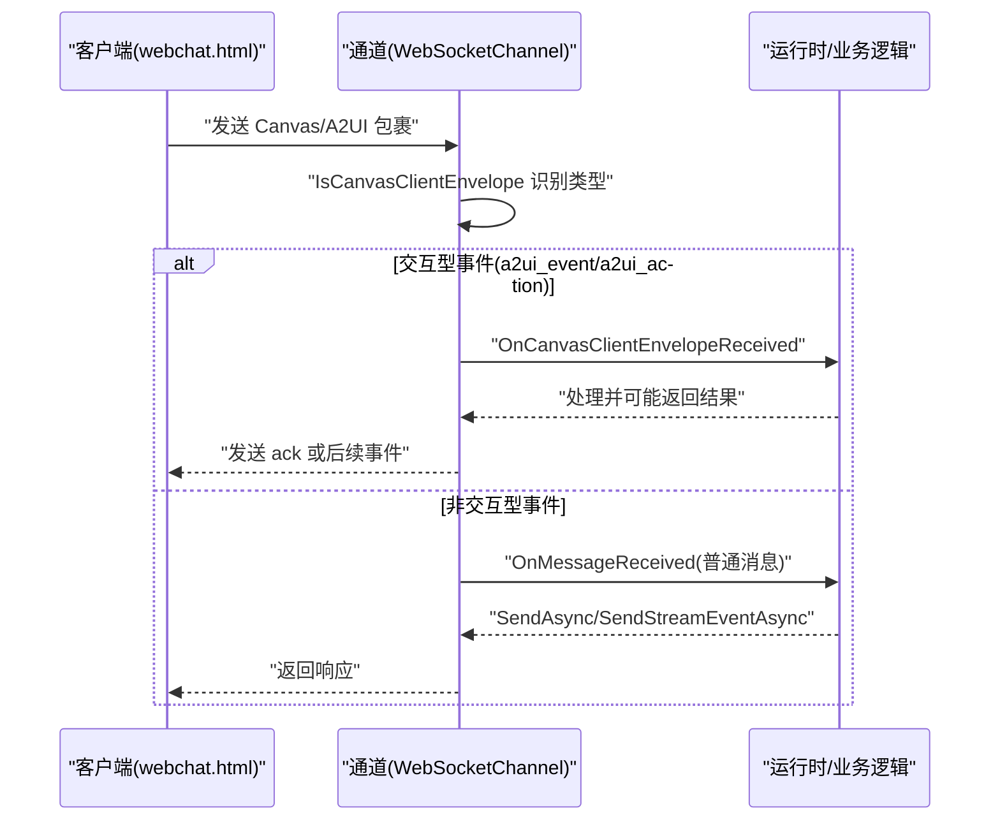
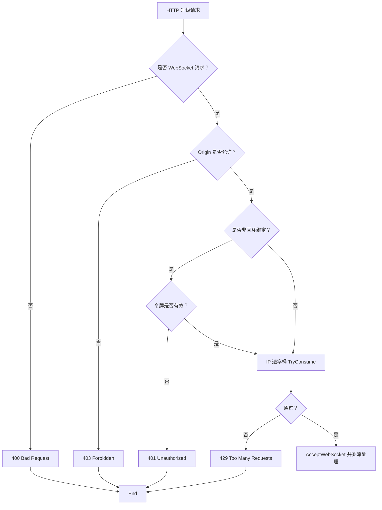
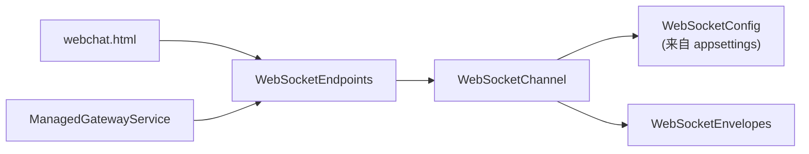
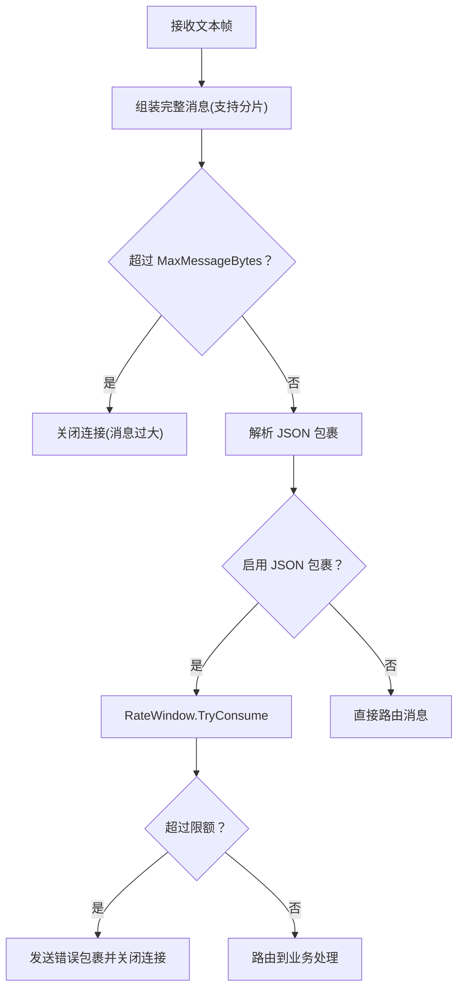

# WebSocket 配置

<cite>
**本文引用的文件**
- [WebSocketChannel.cs](file://src/OpenClaw.Channels/WebSocketChannel.cs)
- [WebSocketEndpoints.cs](file://src/OpenClaw.Gateway/Endpoints/WebSocketEndpoints.cs)
- [WebSocketEnvelopes.cs](file://src/OpenClaw.Core/Models/WebSocketEnvelopes.cs)
- [appsettings.json](file://src/OpenClaw.Gateway/appsettings.json)
- [ManagedGatewayService.cs](file://src/OpenClaw.Companion/Services/ManagedGatewayService.cs)
- [WebSocketChannelTests.cs](file://src/OpenClaw.Tests/WebSocketChannelTests.cs)
- [webchat.html](file://src/OpenClaw.Gateway/wwwroot/webchat.html)
</cite>

## 目录
1. [简介](#简介)
2. [项目结构](#项目结构)
3. [核心组件](#核心组件)
4. [架构总览](#架构总览)
5. [详细组件分析](#详细组件分析)
6. [依赖关系分析](#依赖关系分析)
7. [性能考虑](#性能考虑)
8. [故障排除指南](#故障排除指南)
9. [结论](#结论)
10. [附录](#附录)

## 简介
本文件面向 WebSocket 配置系统的使用者与维护者，系统性梳理消息大小限制、连接数量限制、每 IP 连接限制、消息速率限制、接收超时设置、帧推送限制、Canvas/A2UI 命令转发配置、本地 HTML 启用与远程导航策略、安全配置、心跳机制与连接管理策略，并提供性能调优建议、监控指标与故障排除清单。

## 项目结构
WebSocket 配置涉及以下关键模块：
- 网关端点：负责请求接入、鉴权与速率控制
- 通道适配器：负责连接生命周期、消息解析、速率与超时控制
- 模型：定义客户端与服务端的 JSON 包裹消息结构
- 配置：集中于网关配置文件中的 WebSocket 段落
- 客户端示例：网页聊天界面演示 Canvas/A2UI 能力与本地 HTML 支持

图表来源
- [WebSocketEndpoints.cs:18-26](file://src/OpenClaw.Gateway/Endpoints/WebSocketEndpoints.cs#L18-L26)
- [appsettings.json:103-109](file://src/OpenClaw.Gateway/appsettings.json#L103-L109)
- [WebSocketChannel.cs:67-74](file://src/OpenClaw.Channels/WebSocketChannel.cs#L67-L74)
- [webchat.html:3416-3656](file://src/OpenClaw.Gateway/wwwroot/webchat.html#L3416-L3656)
- [ManagedGatewayService.cs:455-479](file://src/OpenClaw.Companion/Services/ManagedGatewayService.cs#L455-L479)

章节来源
- [WebSocketEndpoints.cs:18-94](file://src/OpenClaw.Gateway/Endpoints/WebSocketEndpoints.cs#L18-L94)
- [appsettings.json:103-109](file://src/OpenClaw.Gateway/appsettings.json#L103-L109)
- [WebSocketChannel.cs:67-74](file://src/OpenClaw.Channels/WebSocketChannel.cs#L67-L74)
- [webchat.html:3416-3656](file://src/OpenClaw.Gateway/wwwroot/webchat.html#L3416-L3656)
- [ManagedGatewayService.cs:455-479](file://src/OpenClaw.Companion/Services/ManagedGatewayService.cs#L455-L479)

## 核心组件
- WebSocketChannel：负责连接建立、消息接收与解析、速率限制、发送序列化、Canvas/A2UI 事件分发、连接清理等。
- WebSocketEndpoints：负责 /ws 入口的请求校验（WebSocket 协议、Origin 白名单、非回环绑定的令牌鉴权、IP 速率桶），随后委派给通道处理。
- WebSocketEnvelopes：定义客户端与服务端使用的 JSON 包裹消息字段，支持 Canvas/A2UI 交互、工具审批、流式事件等。
- appsettings.json 中的 WebSocket 段落：集中定义消息大小、连接总数、每 IP 连接、每连接每分钟消息数、接收超时等参数。
- webchat.html：演示 Canvas/A2UI 能力、本地 HTML 与远程导航策略、帧推送等。

章节来源
- [WebSocketChannel.cs:16-74](file://src/OpenClaw.Channels/WebSocketChannel.cs#L16-L74)
- [WebSocketEndpoints.cs:13-94](file://src/OpenClaw.Gateway/Endpoints/WebSocketEndpoints.cs#L13-L94)
- [WebSocketEnvelopes.cs:7-108](file://src/OpenClaw.Core/Models/WebSocketEnvelopes.cs#L7-L108)
- [appsettings.json:103-109](file://src/OpenClaw.Gateway/appsettings.json#L103-L109)
- [webchat.html:3416-3656](file://src/OpenClaw.Gateway/wwwroot/webchat.html#L3416-L3656)

## 架构总览
WebSocket 请求从浏览器到网关的典型流程如下：

图表来源
- [WebSocketEndpoints.cs:18-94](file://src/OpenClaw.Gateway/Endpoints/WebSocketEndpoints.cs#L18-L94)
- [WebSocketChannel.cs:76-151](file://src/OpenClaw.Channels/WebSocketChannel.cs#L76-L151)
- [WebSocketChannel.cs:435-510](file://src/OpenClaw.Channels/WebSocketChannel.cs#L435-L510)
- [WebSocketChannel.cs:153-190](file://src/OpenClaw.Channels/WebSocketChannel.cs#L153-L190)

## 详细组件分析

### 参数与配置项
- 消息大小限制：MaxMessageBytes
- 连接数量限制：MaxConnections
- 每 IP 连接限制：MaxConnectionsPerIp
- 消息速率限制：MessagesPerMinutePerConnection（按连接维度）
- 接收超时设置：ReceiveTimeoutSeconds（秒）
- 帧推送限制：通道内部对 JSON 包裹消息进行解析与长度控制；Canvas/A2UI 帧推送受前端脚本与协议约束

章节来源
- [appsettings.json:103-109](file://src/OpenClaw.Gateway/appsettings.json#L103-L109)
- [WebSocketChannel.cs:435-510](file://src/OpenClaw.Channels/WebSocketChannel.cs#L435-L510)
- [WebSocketChannel.cs:334-370](file://src/OpenClaw.Channels/WebSocketChannel.cs#L334-L370)
- [WebSocketChannel.cs:41-65](file://src/OpenClaw.Channels/WebSocketChannel.cs#L41-L65)

### 连接与速率控制
- 连接建立：TryAddConnection 原子增加全局连接计数与每 IP 计数，超过任一阈值则拒绝并关闭连接。
- 速率控制：每个连接维护一个按分钟滑动窗口的速率计数器，超过限额即触发错误包裹与关闭。
- 发送并发：使用信号量与预留机制保证发送顺序与资源释放，避免并发写导致异常。

图表来源
- [WebSocketChannel.cs:334-370](file://src/OpenClaw.Channels/WebSocketChannel.cs#L334-L370)
- [WebSocketChannel.cs:41-65](file://src/OpenClaw.Channels/WebSocketChannel.cs#L41-L65)
- [WebSocketChannel.cs:76-151](file://src/OpenClaw.Channels/WebSocketChannel.cs#L76-L151)

章节来源
- [WebSocketChannel.cs:334-370](file://src/OpenClaw.Channels/WebSocketChannel.cs#L334-L370)
- [WebSocketChannel.cs:41-65](file://src/OpenClaw.Channels/WebSocketChannel.cs#L41-L65)
- [WebSocketChannel.cs:76-151](file://src/OpenClaw.Channels/WebSocketChannel.cs#L76-L151)

### Canvas/A2UI 命令转发与本地 HTML/远程导航
- Canvas/A2UI 事件类型识别：包括 canvas_ready、canvas_ack、canvas_snapshot_result、canvas_eval_result、a2ui_event、a2ui_action、a2ui_error、a2ui_sync_result 等。
- 本地 HTML 支持：当收到特定类型时，前端可切换到本地 HTML 模式并更新元数据。
- 远程导航限制：v1 不接受远程网页导航，会返回错误提示并拒绝导航。

图表来源
- [WebSocketChannel.cs:583-593](file://src/OpenClaw.Channels/WebSocketChannel.cs#L583-L593)
- [WebSocketChannel.cs:114-144](file://src/OpenClaw.Channels/WebSocketChannel.cs#L114-L144)
- [webchat.html:3416-3656](file://src/OpenClaw.Gateway/wwwroot/webchat.html#L3416-L3656)

章节来源
- [WebSocketChannel.cs:583-593](file://src/OpenClaw.Channels/WebSocketChannel.cs#L583-L593)
- [WebSocketChannel.cs:114-144](file://src/OpenClaw.Channels/WebSocketChannel.cs#L114-L144)
- [webchat.html:3416-3656](file://src/OpenClaw.Gateway/wwwroot/webchat.html#L3416-L3656)

### 安全配置与鉴权
- Origin 白名单：若配置了允许的 Origin 集合，则严格匹配；否则基于当前请求的 Scheme/Host/Port 进行对比。
- 非回环绑定的令牌鉴权：当监听地址非回环时，要求携带有效令牌（支持引导令牌或账户令牌）。
- IP 速率桶：在接入层对每个 IP 的请求进行速率控制，防止滥用。

图表来源
- [WebSocketEndpoints.cs:63-94](file://src/OpenClaw.Gateway/Endpoints/WebSocketEndpoints.cs#L63-L94)
- [WebSocketEndpoints.cs:120-149](file://src/OpenClaw.Gateway/Endpoints/WebSocketEndpoints.cs#L120-L149)
- [WebSocketEndpoints.cs:96-118](file://src/OpenClaw.Gateway/Endpoints/WebSocketEndpoints.cs#L96-L118)

章节来源
- [WebSocketEndpoints.cs:63-94](file://src/OpenClaw.Gateway/Endpoints/WebSocketEndpoints.cs#L63-L94)
- [WebSocketEndpoints.cs:120-149](file://src/OpenClaw.Gateway/Endpoints/WebSocketEndpoints.cs#L120-L149)
- [WebSocketEndpoints.cs:96-118](file://src/OpenClaw.Gateway/Endpoints/WebSocketEndpoints.cs#L96-L118)

### 心跳机制与连接管理
- 心跳策略：通道未实现内置心跳发送；但存在其他通道（如 WeCom）示例展示了基于时间间隔的心跳发送与超时重试逻辑，可作为参考实现。
- 连接管理：通道维护连接字典、每 IP 连接计数、全局连接计数；断开时清理资源并释放锁。

章节来源
- [WebSocketChannel.cs:314-317](file://src/OpenClaw.Channels/WebSocketChannel.cs#L314-L317)
- [WebSocketChannel.cs:372-381](file://src/OpenClaw.Channels/WebSocketChannel.cs#L372-L381)

### 数据模型与消息格式
- 客户端包裹（WsClientEnvelope）：包含类型、会话/消息标识、Canvas/A2UI 字段、工具审批决策等。
- 服务器包裹（WsServerEnvelope）：包含类型、回复消息标识、工具审批状态、流式事件字段、技能工件与阶段门事件等。

章节来源
- [WebSocketEnvelopes.cs:7-108](file://src/OpenClaw.Core/Models/WebSocketEnvelopes.cs#L7-L108)

### 配置项说明与默认值
- MaxMessageBytes：默认 1048576（1MB）
- MaxConnections：默认 1000
- MaxConnectionsPerIp：默认 50
- MessagesPerMinutePerConnection：默认 120
- ReceiveTimeoutSeconds：默认 600（秒）

章节来源
- [appsettings.json:103-109](file://src/OpenClaw.Gateway/appsettings.json#L103-L109)

## 依赖关系分析
- 网关端点依赖：安全策略（Origin、令牌）、速率桶、WebSocket 通道实例。
- 通道依赖：配置对象、JSON 序列化上下文、并发集合、网络套接字。
- 客户端依赖：前端脚本根据协议类型决定行为（本地 HTML、远程导航、帧推送）。

图表来源
- [WebSocketEndpoints.cs:13-26](file://src/OpenClaw.Gateway/Endpoints/WebSocketEndpoints.cs#L13-L26)
- [WebSocketChannel.cs:67-74](file://src/OpenClaw.Channels/WebSocketChannel.cs#L67-L74)
- [WebSocketEnvelopes.cs:7-108](file://src/OpenClaw.Core/Models/WebSocketEnvelopes.cs#L7-L108)
- [appsettings.json:103-109](file://src/OpenClaw.Gateway/appsettings.json#L103-L109)
- [ManagedGatewayService.cs:455-479](file://src/OpenClaw.Companion/Services/ManagedGatewayService.cs#L455-L479)

章节来源
- [WebSocketEndpoints.cs:13-26](file://src/OpenClaw.Gateway/Endpoints/WebSocketEndpoints.cs#L13-L26)
- [WebSocketChannel.cs:67-74](file://src/OpenClaw.Channels/WebSocketChannel.cs#L67-L74)
- [WebSocketEnvelopes.cs:7-108](file://src/OpenClaw.Core/Models/WebSocketEnvelopes.cs#L7-L108)
- [appsettings.json:103-109](file://src/OpenClaw.Gateway/appsettings.json#L103-L109)
- [ManagedGatewayService.cs:455-479](file://src/OpenClaw.Companion/Services/ManagedGatewayService.cs#L455-L479)

## 性能考虑
- 连接与内存：每连接持有独立的发送锁与速率窗口，建议合理设置 MaxConnections 与 MaxConnectionsPerIp，避免内存与 CPU 峰值。
- 消息大小：MaxMessageBytes 控制单次消息上限，过大可能导致内存压力与 GC 压力，建议结合业务场景调整。
- 速率限制：MessagesPerMinutePerConnection 以分钟为窗口，突发流量需评估峰值与平均值，必要时分桶或动态调整。
- 接收超时：ReceiveTimeoutSeconds 避免长时间阻塞，建议根据网络环境与客户端行为调优。
- 发送并发：通道内部已做并发保护，避免过度并发导致资源争用。

## 故障排除指南
- 连接被拒绝（策略违规）：检查 MaxConnections 与 MaxConnectionsPerIp 配置是否过低；确认客户端是否重复连接。
- 被限速关闭：确认 MessagesPerMinutePerConnection 是否过小；客户端应降低发送频率或合并消息。
- 接收超时：检查 ReceiveTimeoutSeconds 是否过短；排查网络抖动或客户端长时间无消息。
- Origin/令牌问题：非回环绑定时必须携带有效令牌；确保 AllowedOrigins 与实际访问一致。
- Canvas/A2UI 行为异常：确认前端脚本是否正确识别事件类型；远程导航在 v1 不被支持，应使用浏览器工具替代。

章节来源
- [WebSocketChannel.cs:78-112](file://src/OpenClaw.Channels/WebSocketChannel.cs#L78-L112)
- [WebSocketChannel.cs:455-474](file://src/OpenClaw.Channels/WebSocketChannel.cs#L455-L474)
- [WebSocketEndpoints.cs:75-91](file://src/OpenClaw.Gateway/Endpoints/WebSocketEndpoints.cs#L75-L91)
- [webchat.html:3630-3643](file://src/OpenClaw.Gateway/wwwroot/webchat.html#L3630-L3643)

## 结论
WebSocket 配置系统通过“网关端点 + 通道适配器 + 配置 + 模型”的协同，实现了对连接、速率、消息大小、超时与安全的全面控制。Canvas/A2UI 能力由前端脚本与通道事件分发共同支撑，既保证了灵活性，也保留了严格的边界控制。建议在生产环境中结合业务负载与网络条件，对各项参数进行压测与调优，并完善监控与告警。

## 附录

### 关键流程图：消息接收与速率控制

图表来源
- [WebSocketChannel.cs:435-510](file://src/OpenClaw.Channels/WebSocketChannel.cs#L435-L510)
- [WebSocketChannel.cs:96-112](file://src/OpenClaw.Channels/WebSocketChannel.cs#L96-L112)