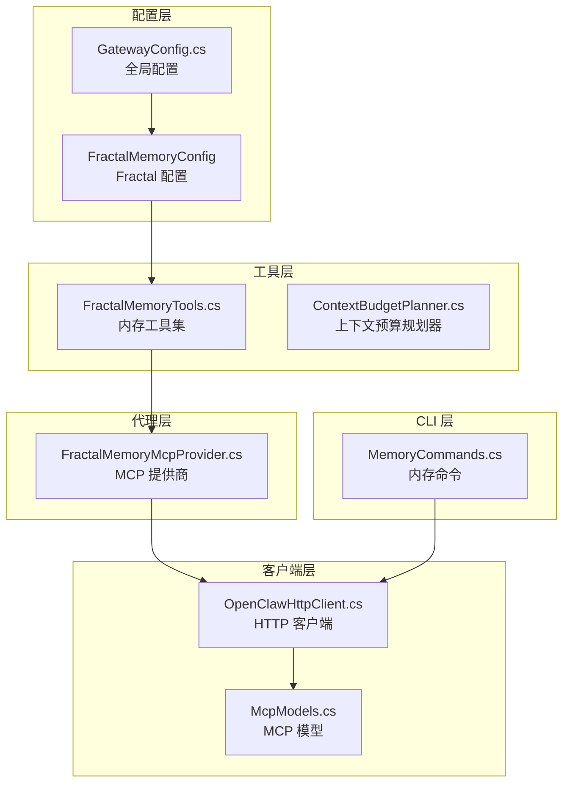
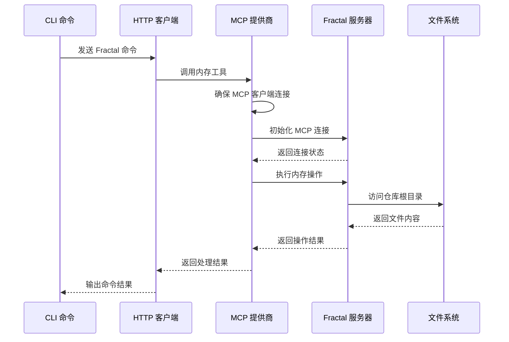
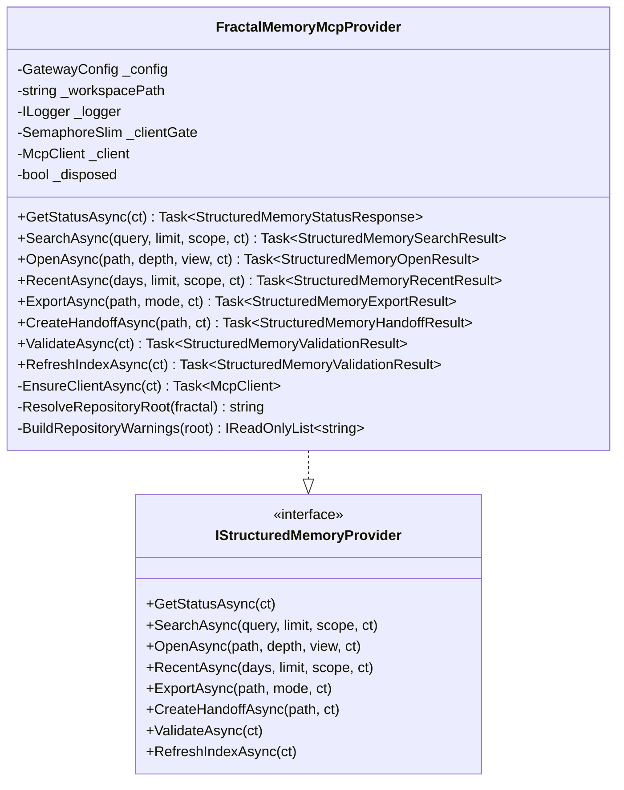
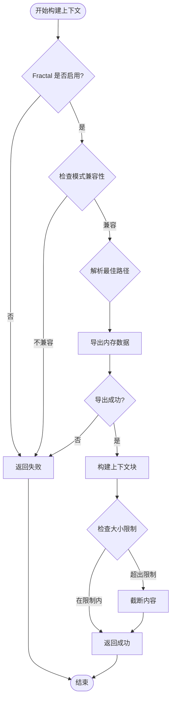
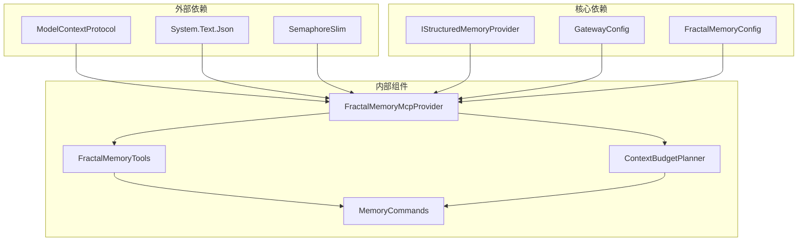

# Fractal 内存配置

<cite>
**本文档引用的文件**
- [FractalMemoryMcpProvider.cs](file://src/OpenClaw.Agent/Memory/FractalMemoryMcpProvider.cs)
- [FractalMemoryTools.cs](file://src/OpenClaw.Agent/Tools/FractalMemoryTools.cs)
- [ContextBudgetPlanner.cs](file://src/OpenClaw.Core/Memory/ContextBudgetPlanner.cs)
- [GatewayConfig.cs](file://src/OpenClaw.Core/Models/GatewayConfig.cs)
- [MemoryCommands.cs](file://src/OpenClaw.Cli/MemoryCommands.cs)
- [IStructuredMemoryProvider.cs](file://src/OpenClaw.Core/Abstractions/IStructuredMemoryProvider.cs)
- [McpModels.cs](file://src/OpenClaw.Client/McpModels.cs)
- [OpenClawHttpClient.cs](file://src/OpenClaw.Client/OpenClawHttpClient.cs)
</cite>

## 目录
1. [简介](#简介)
2. [项目结构](#项目结构)
3. [核心组件](#核心组件)
4. [架构概览](#架构概览)
5. [详细组件分析](#详细组件分析)
6. [依赖关系分析](#依赖关系分析)
7. [性能考虑](#性能考虑)
8. [故障排除指南](#故障排除指南)
9. [结论](#结论)

## 简介

Fractal 内存系统是 OpenClaw 平台中的重要组成部分，它提供了结构化的项目记忆体管理能力。该系统通过 MCP（Model Context Protocol）协议与外部 Fractal Memory 服务器进行通信，实现了对项目知识库的智能检索、上下文构建和内容管理。

本技术文档深入解析 Fractal 内存配置选项，包括 MCP 模式、仓库根目录和命令配置，详细说明上下文管理参数如默认深度、视图设置、导出模式和上下文大小限制。同时阐述自动上下文模式、索引刷新和写入权限控制等高级功能，并提供 MCP 提供商配置、命令行参数和通信协议的完整指南。

## 项目结构

Fractal 内存系统在代码库中分布于多个关键模块：



**图表来源**
- [GatewayConfig.cs:175-262](file://src/OpenClaw.Core/Models/GatewayConfig.cs#L175-L262)
- [FractalMemoryMcpProvider.cs:13-347](file://src/OpenClaw.Agent/Memory/FractalMemoryMcpProvider.cs#L13-L347)
- [FractalMemoryTools.cs:1-243](file://src/OpenClaw.Agent/Tools/FractalMemoryTools.cs#L1-L243)
- [ContextBudgetPlanner.cs:7-167](file://src/OpenClaw.Core/Memory/ContextBudgetPlanner.cs#L7-L167)

**章节来源**
- [GatewayConfig.cs:175-262](file://src/OpenClaw.Core/Models/GatewayConfig.cs#L175-L262)
- [FractalMemoryMcpProvider.cs:13-347](file://src/OpenClaw.Agent/Memory/FractalMemoryMcpProvider.cs#L13-L347)

## 核心组件

### Fractal 内存配置模型

Fractal 内存系统的核心配置位于 `FractalMemoryConfig` 类中，包含以下关键配置项：

| 配置项 | 类型 | 默认值 | 描述 |
|--------|------|--------|------|
| Enabled | bool | false | 启用 Fractal 内存功能 |
| Mode | string | "mcp" | 运行模式，支持 "mcp" |
| RepositoryRoot | string | "" | 仓库根目录路径 |
| McpCommand | string | "fractalmem-mcp" | MCP 服务器命令 |
| DefaultDepth | int | 1 | 默认上下文深度 (0-3) |
| DefaultView | string | "index" | 默认视图类型 |
| DefaultExportMode | string | "compact" | 默认导出模式 |
| MaxContextChars | int | 24,000 | 上下文最大字符数 |
| MaxContextTokens | int | 6,000 | 上下文最大令牌数 |
| AutoContextMode | string | "off" | 自动上下文模式 |
| AllowWrites | bool | false | 允许写入操作 |
| RequireApprovalForWrites | bool | true | 写入需要审批 |

### MCP 通信协议

Fractal 内存系统通过标准的 MCP 协议与外部服务器通信，支持以下核心方法：

- `initialize`: 初始化 MCP 连接
- `tools/list`: 列出可用工具
- `resources/list`: 列出可用资源
- `resources/read`: 读取资源内容

**章节来源**
- [GatewayConfig.cs:244-262](file://src/OpenClaw.Core/Models/GatewayConfig.cs#L244-L262)
- [McpModels.cs:45-97](file://src/OpenClaw.Client/McpModels.cs#L45-L97)

## 架构概览

Fractal 内存系统采用分层架构设计，确保了良好的可扩展性和维护性：



**图表来源**
- [FractalMemoryMcpProvider.cs:279-330](file://src/OpenClaw.Agent/Memory/FractalMemoryMcpProvider.cs#L279-L330)
- [OpenClawHttpClient.cs:262-280](file://src/OpenClaw.Client/OpenClawHttpClient.cs#L262-L280)

## 详细组件分析

### FractalMemoryMcpProvider 组件

FractalMemoryMcpProvider 是 Fractal 内存系统的核心实现类，负责与 MCP 服务器的通信和数据处理。



**图表来源**
- [FractalMemoryMcpProvider.cs:13-347](file://src/OpenClaw.Agent/Memory/FractalMemoryMcpProvider.cs#L13-L347)
- [IStructuredMemoryProvider.cs:5-16](file://src/OpenClaw.Core/Abstractions/IStructuredMemoryProvider.cs#L5-L16)

#### 关键功能特性

1. **MCP 客户端管理**: 使用信号量确保线程安全的客户端连接
2. **仓库根目录解析**: 支持多种路径解析策略
3. **错误处理机制**: 提供详细的异常处理和用户友好的错误消息
4. **环境变量传递**: 通过环境变量向 MCP 服务器传递配置信息

**章节来源**
- [FractalMemoryMcpProvider.cs:13-347](file://src/OpenClaw.Agent/Memory/FractalMemoryMcpProvider.cs#L13-L347)

### FractalMemoryTools 工具集

FractalMemoryTools 提供了完整的内存操作工具集，支持多种内存管理场景：

```mermaid
classDiagram
class FractalMemorySearchTool {
+string Name
+string Description
+string ParameterSchema
+ExecuteAsync(argumentsJson, ct) ValueTask~string~
}
class FractalMemoryOpenTool {
+string Name
+string Description
+string ParameterSchema
+ExecuteAsync(argumentsJson, ct) ValueTask~string~
}
class FractalMemoryRecentTool {
+string Name
+string Description
+string ParameterSchema
+ExecuteAsync(argumentsJson, ct) ValueTask~string~
}
class FractalMemoryExportTool {
+string Name
+string Description
+string ParameterSchema
+ExecuteAsync(argumentsJson, ct) ValueTask~string~
}
class FractalMemoryValidateTool {
+string Name
+string Description
+string ParameterSchema
+ExecuteAsync(argumentsJson, ct) ValueTask~string~
}
class FractalMemoryHandoffCreateTool {
+string Name
+string Description
+string ParameterSchema
+ExecuteAsync(argumentsJson, ct) ValueTask~string~
+ResolveActionDescriptor(argumentsJson) ToolActionDescriptor
}
class FractalMemoryIndexRefreshTool {
+string Name
+string Description
+string ParameterSchema
+ExecuteAsync(argumentsJson, ct) ValueTask~string~
+ResolveActionDescriptor(argumentsJson) ToolActionDescriptor
}
```



**图表来源**
- [FractalMemoryTools.cs:10-243](file://src/OpenClaw.Agent/Tools/FractalMemoryTools.cs#L10-L243)

#### 工具功能详解

每个工具都具有特定的功能和参数验证机制：

1. **搜索工具**: 支持关键词搜索和范围限定
2. **打开工具**: 提供多种视图模式和深度控制
3. **最近工具**: 查看最近修改的内存节点
4. **导出工具**: 支持多种导出模式 (compact/standard/verbose)
5. **验证工具**: 检查内存仓库的完整性
6. **交接工具**: 创建内存交接包用于数据迁移
7. **索引刷新工具**: 更新内存索引以提高搜索准确性

**章节来源**
- [FractalMemoryTools.cs:10-243](file://src/OpenClaw.Agent/Tools/FractalMemoryTools.cs#L10-L243)

### ContextBudgetPlanner 上下文规划器

ContextBudgetPlanner 负责智能构建和优化 Fractal 内存上下文，确保内容大小符合预设限制：



**图表来源**
- [ContextBudgetPlanner.cs:19-84](file://src/OpenClaw.Core/Memory/ContextBudgetPlanner.cs#L19-L84)

#### 上下文构建算法

1. **模式验证**: 确保请求的模式与配置的自动模式兼容
2. **路径解析**: 基于查询和最近更改历史确定最佳内存节点
3. **内容导出**: 获取内存节点的结构化内容
4. **大小计算**: 计算字符数和令牌数的最小值
5. **内容截断**: 在必要时截断内容以满足大小限制

**章节来源**
- [ContextBudgetPlanner.cs:19-167](file://src/OpenClaw.Core/Memory/ContextBudgetPlanner.cs#L19-L167)

### MemoryCommands CLI 命令

MemoryCommands 提供了完整的命令行接口，支持所有 Fractal 内存操作：

| 命令 | 参数 | 功能描述 |
|------|------|----------|
| status | --json | 显示 Fractal 内存状态 |
| search | query, --limit, --scope, --json | 搜索内存内容 |
| open | path, --depth, --view, --json | 打开内存节点 |
| export | path, --mode, --json | 导出内存内容 |
| recent | --days, --limit, --scope, --json | 查看最近更改 |
| validate | --json | 验证内存仓库 |
| index refresh | --json | 刷新索引 |
| handoff create | path, --json | 创建交接包 |

**章节来源**
- [MemoryCommands.cs:7-264](file://src/OpenClaw.Cli/MemoryCommands.cs#L7-L264)

## 依赖关系分析

Fractal 内存系统各组件之间的依赖关系如下：



**图表来源**
- [FractalMemoryMcpProvider.cs:1-30](file://src/OpenClaw.Agent/Memory/FractalMemoryMcpProvider.cs#L1-L30)
- [FractalMemoryTools.cs:1-10](file://src/OpenClaw.Agent/Tools/FractalMemoryTools.cs#L1-L10)
- [ContextBudgetPlanner.cs:1-17](file://src/OpenClaw.Core/Memory/ContextBudgetPlanner.cs#L1-L17)

### 关键依赖特性

1. **松耦合设计**: 通过接口抽象实现组件间的解耦
2. **配置驱动**: 所有行为都由配置文件驱动
3. **线程安全**: 使用信号量确保并发访问的安全性
4. **错误隔离**: 每个组件都有独立的错误处理机制

**章节来源**
- [FractalMemoryMcpProvider.cs:1-30](file://src/OpenClaw.Agent/Memory/FractalMemoryMcpProvider.cs#L1-L30)
- [IStructuredMemoryProvider.cs:5-16](file://src/OpenClaw.Core/Abstractions/IStructuredMemoryProvider.cs#L5-L16)

## 性能考虑

### 内存优化策略

1. **延迟初始化**: MCP 客户端采用延迟初始化，减少启动时间
2. **连接池管理**: 使用信号量控制并发连接数量
3. **内容截断**: 自动截断超大内容以满足大小限制
4. **缓存机制**: 利用环境变量传递仓库根目录信息

### 性能调优建议

1. **合理设置上下文大小**: 根据模型能力调整 `MaxContextChars` 和 `MaxContextTokens`
2. **优化搜索范围**: 使用 `scope` 参数缩小搜索范围
3. **选择合适的导出模式**: compact 模式适合大多数场景，verbose 模式用于调试
4. **监控索引更新**: 定期执行 `index refresh` 命令保持索引准确性

## 故障排除指南

### 常见问题及解决方案

| 问题类型 | 错误信息 | 可能原因 | 解决方案 |
|----------|----------|----------|----------|
| MCP 连接失败 | "Fractal Memory MCP command could not be started" | MCP 服务器未安装或命令错误 | 检查 `McpCommand` 配置，确保 MCP 服务器已安装 |
| 仓库根目录不存在 | "Repository root does not exist" | `RepositoryRoot` 路径错误 | 验证仓库路径存在且可访问 |
| 权限不足 | "Access denied" | 文件系统权限问题 | 检查文件系统权限设置 |
| 超时错误 | "Operation canceled" | 网络连接超时 | 增加超时时间或检查网络连接 |

### 调试步骤

1. **状态检查**: 使用 `openclaw memory fractal status` 命令检查系统状态
2. **验证配置**: 运行 `openclaw memory fractal validate` 验证配置正确性
3. **查看日志**: 检查应用日志中的详细错误信息
4. **测试连接**: 使用简单的 `search` 或 `recent` 命令测试基本功能

### 配置验证

使用以下命令验证 Fractal 内存配置：

```bash
# 检查状态
openclaw memory fractal status

# 验证配置
openclaw memory fractal validate

# 测试搜索
openclaw memory fractal search "test query"

# 查看最近更改
openclaw memory fractal recent --days 7 --limit 5
```

**章节来源**
- [FractalMemoryMcpProvider.cs:256-277](file://src/OpenClaw.Agent/Memory/FractalMemoryMcpProvider.cs#L256-L277)
- [MemoryCommands.cs:147-264](file://src/OpenClaw.Cli/MemoryCommands.cs#L147-L264)

## 结论

Fractal 内存系统通过精心设计的架构和丰富的配置选项，为 OpenClaw 平台提供了强大的结构化记忆体管理能力。系统支持 MCP 协议标准，具备良好的扩展性和安全性。

关键优势包括：
- **灵活的配置选项**: 支持多种运行模式和参数定制
- **智能上下文构建**: 自动优化内容大小和质量
- **完善的工具集**: 提供全面的内存管理功能
- **强大的错误处理**: 提供详细的错误诊断和恢复机制

通过合理配置和使用，Fractal 内存系统能够有效提升 AI 代理的知识管理和决策能力，为复杂项目的智能化运营提供坚实基础。