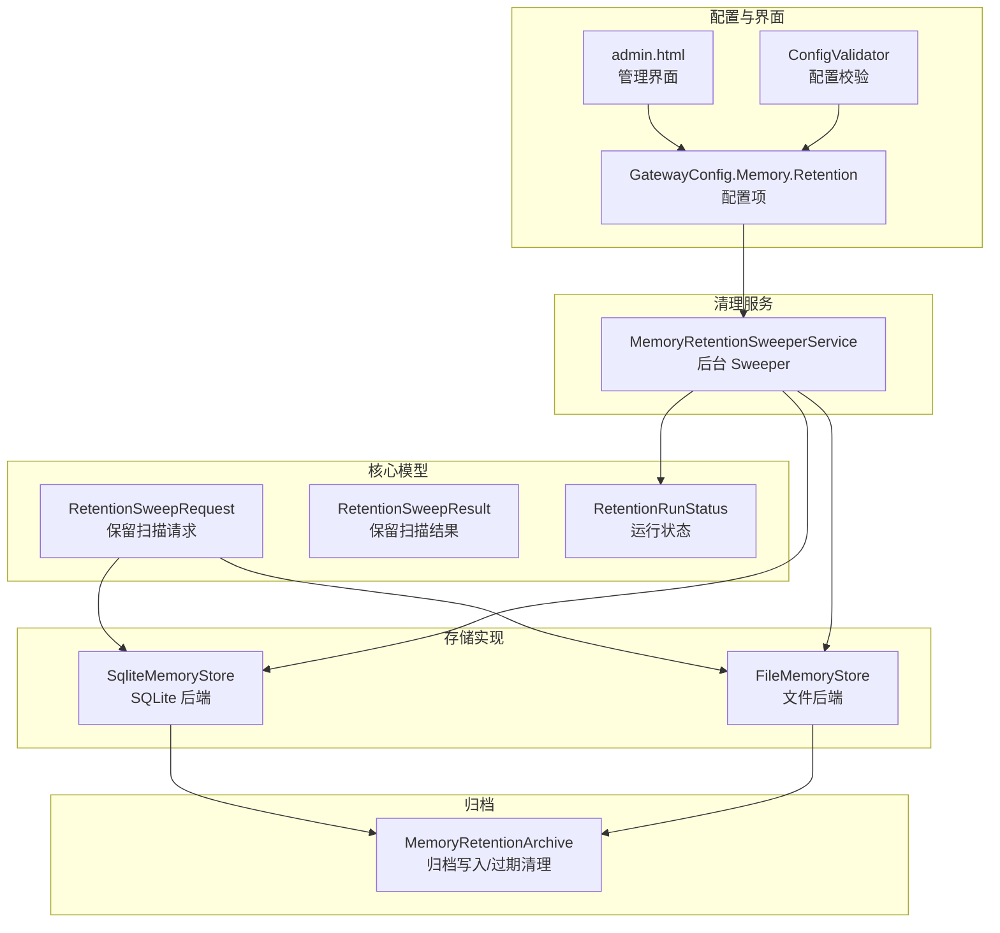
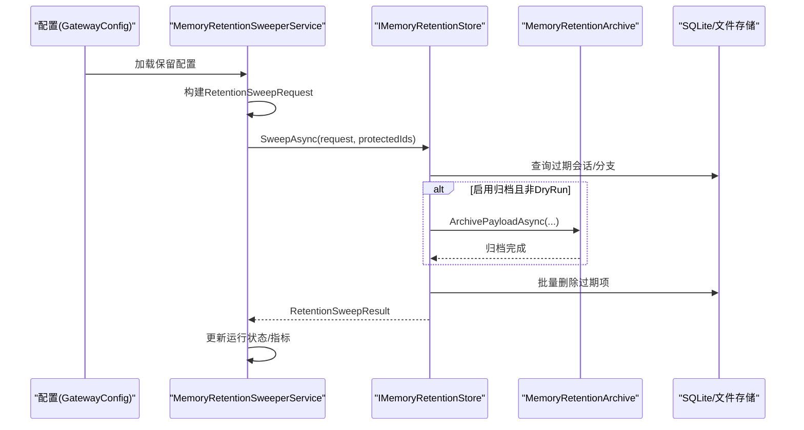
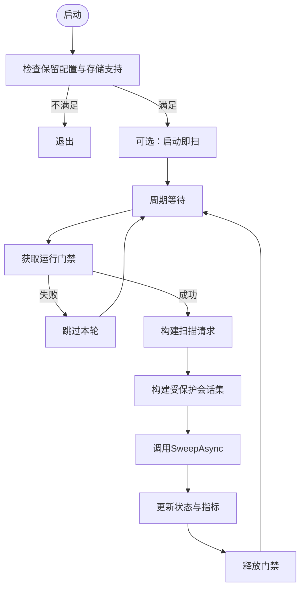
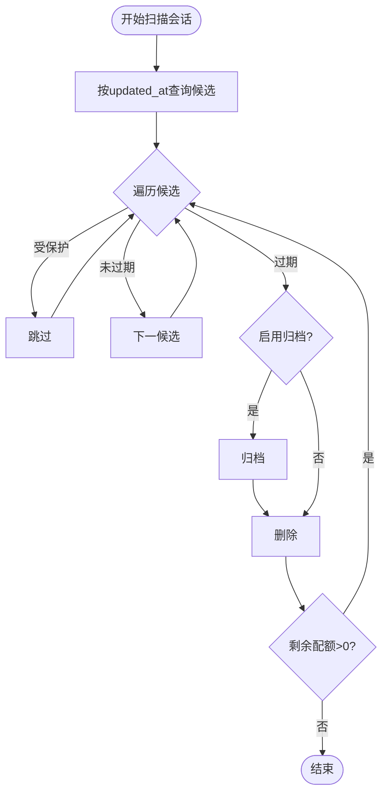
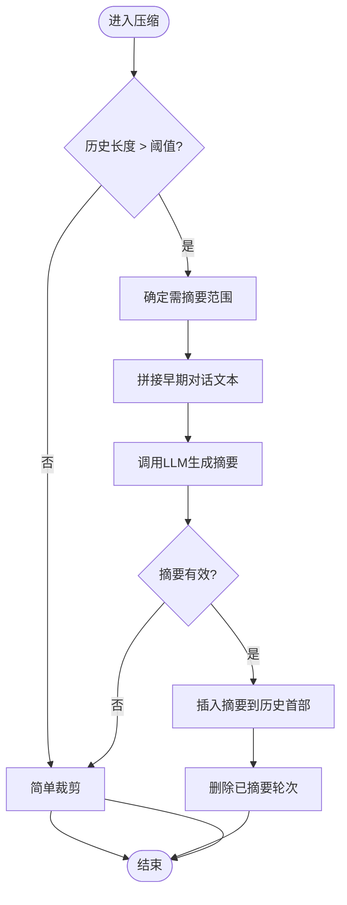
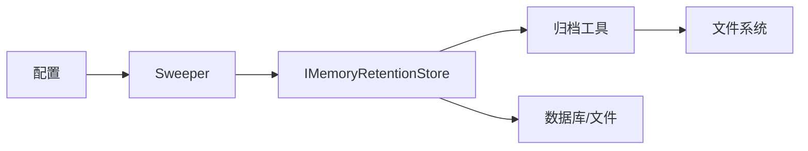

# 内存保留策略

<cite>
**本文引用的文件**
- [MemoryRetentionArchive.cs](file://src/OpenClaw.Core/Memory/MemoryRetentionArchive.cs)
- [MemoryRetentionModels.cs](file://src/OpenClaw.Core/Models/MemoryRetentionModels.cs)
- [MemoryRetentionSweeperService.cs](file://src/OpenClaw.Gateway/Extensions/MemoryRetentionSweeperService.cs)
- [SqliteMemoryStore.cs](file://src/OpenClaw.Core/Memory/SqliteMemoryStore.cs)
- [FileMemoryStore.cs](file://src/OpenClaw.Core/Memory/FileMemoryStore.cs)
- [MafAgentRuntime.cs](file://src/OpenClaw.Agent/MafAgentRuntime.cs)
- [openclaw-memory-recall-and-retention.md](file://docs/openclaw-memory-recall-and-retention.md)
- [AdminSettingsService.cs](file://src/OpenClaw.Gateway/AdminSettingsService.cs)
- [ConfigValidator.cs](file://src/OpenClaw.Core/Validation/ConfigValidator.cs)
- [admin.html](file://src/OpenClaw.Gateway/wwwroot/admin.html)
- [MaintenanceCoordinator.cs](file://src/OpenClaw.Core/Setup/MaintenanceCoordinator.cs)
- [Session.cs](file://src/OpenClaw.Core/Models/Session.cs)
</cite>

## 目录
1. [简介](#简介)
2. [项目结构](#项目结构)
3. [核心组件](#核心组件)
4. [架构总览](#架构总览)
5. [详细组件分析](#详细组件分析)
6. [依赖关系分析](#依赖关系分析)
7. [性能考量](#性能考量)
8. [故障排查指南](#故障排查指南)
9. [结论](#结论)
10. [附录](#附录)

## 简介
本文件系统性阐述 Kingcrab/OpenClaw 的内存保留策略与实现，覆盖以下主题：
- 会话与分支的生命周期管理：基于非活跃时间与创建时间的清理阈值
- 归档策略：删除前的归档与过期归档清理
- 配置参数：TTL 设置、清理间隔、归档路径与保留天数、批量上限等
- 内存压缩机制：历史轮次压缩、LLM 摘要生成与数据精简
- 清理服务工作原理：后台定时器、并发控制、错误处理与指标上报
- 不同场景下的配置建议与容量规划

## 项目结构
与内存保留策略直接相关的模块分布如下：
- 核心模型与接口：保留请求/结果、运行状态
- 存储实现：SQLite 与文件两种持久化后端的保留扫描
- 归档工具：统一的归档写入与过期清理
- 清理服务：后台 Sweeper，周期性触发扫描
- 配置与校验：配置项、默认值、UI 与校验规则
- 压缩机制：会话历史压缩与摘要注入

图表来源
- [MemoryRetentionModels.cs:7-51](file://src/OpenClaw.Core/Models/MemoryRetentionModels.cs#L7-L51)
- [SqliteMemoryStore.cs:654-701](file://src/OpenClaw.Core/Memory/SqliteMemoryStore.cs#L654-L701)
- [FileMemoryStore.cs:680-735](file://src/OpenClaw.Core/Memory/FileMemoryStore.cs#L680-L735)
- [MemoryRetentionArchive.cs:9-77](file://src/OpenClaw.Core/Memory/MemoryRetentionArchive.cs#L9-L77)
- [MemoryRetentionSweeperService.cs:22-63](file://src/OpenClaw.Gateway/Extensions/MemoryRetentionSweeperService.cs#L22-L63)
- [admin.html:1814-1846](file://src/OpenClaw.Gateway/wwwroot/admin.html#L1814-L1846)
- [ConfigValidator.cs:102-111](file://src/OpenClaw.Core/Validation/ConfigValidator.cs#L102-L111)

章节来源
- [MemoryRetentionModels.cs:7-51](file://src/OpenClaw.Core/Models/MemoryRetentionModels.cs#L7-L51)
- [MemoryRetentionSweeperService.cs:22-63](file://src/OpenClaw.Gateway/Extensions/MemoryRetentionSweeperService.cs#L22-L63)
- [SqliteMemoryStore.cs:654-701](file://src/OpenClaw.Core/Memory/SqliteMemoryStore.cs#L654-L701)
- [FileMemoryStore.cs:680-735](file://src/OpenClaw.Core/Memory/FileMemoryStore.cs#L680-L735)
- [MemoryRetentionArchive.cs:9-77](file://src/OpenClaw.Core/Memory/MemoryRetentionArchive.cs#L9-L77)
- [admin.html:1814-1846](file://src/OpenClaw.Gateway/wwwroot/admin.html#L1814-L1846)
- [ConfigValidator.cs:102-111](file://src/OpenClaw.Core/Validation/ConfigValidator.cs#L102-L111)

## 核心组件
- 保留扫描请求与结果
  - 请求包含当前时间、会话与分支过期阈值、是否启用归档、归档路径与保留天数、单次最大处理项数、是否 DryRun 等
  - 结果包含已归档/删除的会话/分支数量、跳过的受保护会话、跳过的损坏项、归档清理统计、错误列表与耗时
- 运行状态
  - 记录启用状态、是否支持保留、是否正在运行、最近一次运行时间、成功与否、累计运行次数与删除/归档总量等
- 存储后端
  - SQLite 与文件后端均实现保留扫描接口，分别按更新时间与创建时间判定过期
- 归档工具
  - 统一的归档写入与按日期分区的过期清理，支持失败回退与错误聚合
- 清理服务
  - 周期性触发扫描，支持启动即扫、并发门禁、错误日志与指标上报

章节来源
- [MemoryRetentionModels.cs:7-51](file://src/OpenClaw.Core/Models/MemoryRetentionModels.cs#L7-L51)
- [MemoryRetentionSweeperService.cs:65-86](file://src/OpenClaw.Gateway/Extensions/MemoryRetentionSweeperService.cs#L65-L86)
- [SqliteMemoryStore.cs:654-701](file://src/OpenClaw.Core/Memory/SqliteMemoryStore.cs#L654-L701)
- [FileMemoryStore.cs:680-735](file://src/OpenClaw.Core/Memory/FileMemoryStore.cs#L680-L735)
- [MemoryRetentionArchive.cs:79-166](file://src/OpenClaw.Core/Memory/MemoryRetentionArchive.cs#L79-L166)

## 架构总览
保留策略由“配置驱动 + 后台 Sweeper + 存储扫描 + 归档工具”构成的闭环。

图表来源
- [MemoryRetentionSweeperService.cs:201-219](file://src/OpenClaw.Gateway/Extensions/MemoryRetentionSweeperService.cs#L201-L219)
- [SqliteMemoryStore.cs:654-701](file://src/OpenClaw.Core/Memory/SqliteMemoryStore.cs#L654-L701)
- [FileMemoryStore.cs:680-735](file://src/OpenClaw.Core/Memory/FileMemoryStore.cs#L680-L735)
- [MemoryRetentionArchive.cs:9-77](file://src/OpenClaw.Core/Memory/MemoryRetentionArchive.cs#L9-L77)

## 详细组件分析

### 保留扫描请求与结果
- 请求字段
  - NowUtc：扫描开始时间（UTC）
  - SessionExpiresBeforeUtc：会话过期阈值（按 updated_at 判定）
  - BranchExpiresBeforeUtc：分支过期阈值（按 createdAt 判定）
  - ArchiveEnabled：是否归档
  - ArchivePath：归档根路径（自动补全为绝对路径）
  - ArchiveRetentionDays：归档保留天数
  - MaxItems：单次扫描最大处理项数
  - DryRun：仅预演，不删除
- 结果字段
  - EligibleSessions/Branches：待处理项数
  - ArchivedSessions/Branches：已归档数
  - DeletedSessions/Branches：已删除数
  - SkippedProtectedSessions：受保护会话跳过数
  - SkippedCorruptSession/Branches：损坏项跳过数
  - ArchivePurgedFiles/PurgeErrors：归档清理统计
  - Errors：最多记录 16 条错误消息
  - DurationMs：耗时毫秒数

章节来源
- [MemoryRetentionModels.cs:7-51](file://src/OpenClaw.Core/Models/MemoryRetentionModels.cs#L7-L51)

### 运行状态与指标
- 状态字段
  - Enabled、StoreSupportsRetention、IsRunning、LastRunStartedAtUtc、LastRunCompletedAtUtc、LastRunDurationMs、LastRunSucceeded、LastError、TotalRuns、TotalSweepErrors、TotalArchivedItems、TotalDeletedItems、LastResult、StoreStats
- 指标
  - 运行次数、归档/删除/失败计数、最近一次运行时间与耗时

章节来源
- [MemoryRetentionModels.cs:66-83](file://src/OpenClaw.Core/Models/MemoryRetentionModels.cs#L66-L83)
- [MemoryRetentionSweeperService.cs:255-282](file://src/OpenClaw.Gateway/Extensions/MemoryRetentionSweeperService.cs#L255-L282)

### 清理服务工作原理
- 启动逻辑
  - 若启用且存储支持保留，则在启动时可选择立即执行一次扫描
- 周期调度
  - 使用周期定时器，间隔由配置决定（最小 5 分钟）
- 并发控制
  - 通过信号量门禁确保同一时刻仅一次扫描运行
- 受保护会话集合
  - 当前活跃会话 ID 与带特定标签的会话（如 pinned、keep、retain、retention-exempt）加入保护集
- 错误处理
  - 捕获异常并记录日志；运行失败时仍更新状态与指标
- 指标上报
  - 成功/失败计数、耗时、删除/归档总量、最后运行时间

图表来源
- [MemoryRetentionSweeperService.cs:98-121](file://src/OpenClaw.Gateway/Extensions/MemoryRetentionSweeperService.cs#L98-L121)
- [MemoryRetentionSweeperService.cs:143-199](file://src/OpenClaw.Gateway/Extensions/MemoryRetentionSweeperService.cs#L143-L199)
- [MemoryRetentionSweeperService.cs:221-241](file://src/OpenClaw.Gateway/Extensions/MemoryRetentionSweeperService.cs#L221-L241)

章节来源
- [MemoryRetentionSweeperService.cs:98-121](file://src/OpenClaw.Gateway/Extensions/MemoryRetentionSweeperService.cs#L98-L121)
- [MemoryRetentionSweeperService.cs:143-199](file://src/OpenClaw.Gateway/Extensions/MemoryRetentionSweeperService.cs#L143-L199)
- [MemoryRetentionSweeperService.cs:221-241](file://src/OpenClaw.Gateway/Extensions/MemoryRetentionSweeperService.cs#L221-L241)

### 存储后端扫描逻辑（SQLite）
- 会话扫描
  - 按 updated_at 升序查询，先过滤受保护会话，再按 LastActiveAt 阈值判定过期
  - 支持 DryRun；启用归档则先写归档，再批量删除
  - FTS 启用时同步清理搜索索引
- 分支扫描
  - 按 JSON 字段 createdAt 升序查询，判定过期
  - 支持 DryRun；启用归档则先写归档，再批量删除
- 扫描上限
  - 单次扫描上限按 MaxItems 的倍数动态扩大，但不超过 20,000
- 批量删除
  - 以 100 项为批大小，事务内执行，减少锁竞争

图表来源
- [SqliteMemoryStore.cs:734-839](file://src/OpenClaw.Core/Memory/SqliteMemoryStore.cs#L734-L839)
- [SqliteMemoryStore.cs:841-935](file://src/OpenClaw.Core/Memory/SqliteMemoryStore.cs#L841-L935)
- [SqliteMemoryStore.cs:979-999](file://src/OpenClaw.Core/Memory/SqliteMemoryStore.cs#L979-L999)

章节来源
- [SqliteMemoryStore.cs:734-839](file://src/OpenClaw.Core/Memory/SqliteMemoryStore.cs#L734-L839)
- [SqliteMemoryStore.cs:841-935](file://src/OpenClaw.Core/Memory/SqliteMemoryStore.cs#L841-L935)
- [SqliteMemoryStore.cs:979-999](file://src/OpenClaw.Core/Memory/SqliteMemoryStore.cs#L979-L999)

### 存储后端扫描逻辑（文件）
- 会话扫描
  - 枚举会话文件，解析 JSON，判定过期与受保护
  - 启用归档则写归档，再删除文件并清理缓存
- 分支扫描
  - 枚举分支文件，解析 JSON，按 createdAt 判定过期
  - 启用归档则写归档，再删除文件
- 扫描上限与错误聚合
  - 与 SQLite 后端一致的上限与错误处理策略

章节来源
- [FileMemoryStore.cs:680-735](file://src/OpenClaw.Core/Memory/FileMemoryStore.cs#L680-L735)
- [FileMemoryStore.cs:737-837](file://src/OpenClaw.Core/Memory/FileMemoryStore.cs#L737-L837)

### 归档策略与过期清理
- 归档写入
  - 按年/月/日/类型分层目录，文件名包含扫描时间戳与 ID 的 SHA256 哈希
  - 文件内容为 JSON 包裹，包含 kind、id、sweptAtUtc、expiresAtUtc、sourceBackend 与 payload
- 过期清理
  - 优先使用 sweptAtUtc 判定；若缺失则回退到文件最后写入时间
  - 清理完成后尝试删除空目录
  - 最多记录 16 条错误消息

章节来源
- [MemoryRetentionArchive.cs:9-77](file://src/OpenClaw.Core/Memory/MemoryRetentionArchive.cs#L9-L77)
- [MemoryRetentionArchive.cs:79-166](file://src/OpenClaw.Core/Memory/MemoryRetentionArchive.cs#L79-L166)

### 配置参数与默认值
- 启用开关与行为
  - enabled：是否启用保留扫描
  - runOnStartup：网关启动时是否立即执行一次扫描
  - sweepIntervalMinutes：自动扫描间隔（最小 5 分钟）
- TTL 与批量
  - sessionTtlDays：会话非活跃天数阈值（最小 1 天）
  - branchTtlDays：分支创建天数阈值（最小 1 天）
  - maxItemsPerSweep：单次扫描最大处理项数（最小 10）
- 归档
  - archiveEnabled：删除前是否归档
  - archivePath：归档根目录（相对路径将转为绝对路径）
  - archiveRetentionDays：归档保留天数（最小 1 天）

章节来源
- [openclaw-memory-recall-and-retention.md:159-182](file://docs/openclaw-memory-recall-and-retention.md#L159-L182)
- [admin.html:1814-1846](file://src/OpenClaw.Gateway/wwwroot/admin.html#L1814-L1846)
- [ConfigValidator.cs:102-111](file://src/OpenClaw.Core/Validation/ConfigValidator.cs#L102-L111)
- [AdminSettingsService.cs:60-68](file://src/OpenClaw.Gateway/AdminSettingsService.cs#L60-L68)

### 内存压缩机制
- 历史轮次压缩
  - 当会话历史轮次超过阈值时，对早期轮次进行摘要生成，并保留最近若干轮次
  - 摘要生成失败时回退为简单裁剪
- LLM 摘要生成
  - 将早期对话文本拼接后交给 LLM 生成摘要，插入到历史开头
- 数据精简策略
  - 保留系统摘要轮次与最近若干用户/助手轮次，其余早期轮次移除

图表来源
- [MafAgentRuntime.cs:684-764](file://src/OpenClaw.Agent/MafAgentRuntime.cs#L684-L764)

章节来源
- [MafAgentRuntime.cs:684-764](file://src/OpenClaw.Agent/MafAgentRuntime.cs#L684-L764)

### 维护与运维集成
- 维护命令
  - 通过维护协调器构造保留扫描请求，结合会话元数据中的星标与标签构建保护集
- 管理界面
  - 提供保留相关配置项的输入控件，便于在线调整

章节来源
- [MaintenanceCoordinator.cs:620-646](file://src/OpenClaw.Core/Setup/MaintenanceCoordinator.cs#L620-L646)
- [admin.html:1814-1846](file://src/OpenClaw.Gateway/wwwroot/admin.html#L1814-L1846)

## 依赖关系分析
- 组件耦合
  - Sweeper 依赖配置、会话管理器、指标与存储接口
  - 存储后端依赖归档工具与数据库/文件系统
  - 归档工具独立于存储后端，仅依赖文件系统
- 关键依赖链
  - 配置 → Sweeper → 存储 → 归档 → 文件系统
  - 配置 → 归档清理 → 文件系统

图表来源
- [MemoryRetentionSweeperService.cs:22-63](file://src/OpenClaw.Gateway/Extensions/MemoryRetentionSweeperService.cs#L22-L63)
- [SqliteMemoryStore.cs:654-701](file://src/OpenClaw.Core/Memory/SqliteMemoryStore.cs#L654-L701)
- [FileMemoryStore.cs:680-735](file://src/OpenClaw.Core/Memory/FileMemoryStore.cs#L680-L735)
- [MemoryRetentionArchive.cs:79-166](file://src/OpenClaw.Core/Memory/MemoryRetentionArchive.cs#L79-L166)

章节来源
- [MemoryRetentionSweeperService.cs:22-63](file://src/OpenClaw.Gateway/Extensions/MemoryRetentionSweeperService.cs#L22-L63)
- [SqliteMemoryStore.cs:654-701](file://src/OpenClaw.Core/Memory/SqliteMemoryStore.cs#L654-L701)
- [FileMemoryStore.cs:680-735](file://src/OpenClaw.Core/Memory/FileMemoryStore.cs#L680-L735)
- [MemoryRetentionArchive.cs:79-166](file://src/OpenClaw.Core/Memory/MemoryRetentionArchive.cs#L79-L166)

## 性能考量
- 扫描上限与批处理
  - 单次扫描上限按 MaxItems 动态扩大，避免一次性处理过多数据
  - 批量删除采用固定批次大小，降低锁竞争与事务开销
- 并发与门禁
  - 通过信号量确保串行运行，避免重复扫描与资源争用
- I/O 优化
  - 归档采用临时文件 + 原子移动，减少部分写入风险
  - 归档清理按日期分区，便于快速定位与删除
- 指标与可观测性
  - 记录运行次数、耗时、删除/归档总量与错误数，便于容量与性能评估

[本节为通用性能讨论，无需列出具体文件来源]

## 故障排查指南
- 常见问题与定位
  - 扫描未执行：确认配置启用、存储实现支持保留、Sweeper 正常运行
  - 并发冲突：查看日志中“already running”提示，检查间隔设置
  - 归档失败：检查归档路径权限、磁盘空间与 JSON 解析错误
  - 过期清理异常：关注错误消息中的文件路径与解析失败原因
- 关键日志与指标
  - Sweeper 成功/失败计数、最近一次运行时间与耗时
  - 删除/归档总量、跳过受保护会话数、损坏项数
- 预演模式
  - 使用 DryRun 在不变更数据的前提下验证扫描效果

章节来源
- [MemoryRetentionSweeperService.cs:123-141](file://src/OpenClaw.Gateway/Extensions/MemoryRetentionSweeperService.cs#L123-L141)
- [SqliteMemoryStore.cs:820-825](file://src/OpenClaw.Core/Memory/SqliteMemoryStore.cs#L820-L825)
- [FileMemoryStore.cs:713-718](file://src/OpenClaw.Core/Memory/FileMemoryStore.cs#L713-L718)
- [MemoryRetentionArchive.cs:142-161](file://src/OpenClaw.Core/Memory/MemoryRetentionArchive.cs#L142-L161)

## 结论
该保留策略通过“配置驱动 + 后台 Sweeper + 存储扫描 + 归档工具”的架构，在保证数据安全（删除前归档）与可追溯（过期清理）的同时，提供了灵活的 TTL 与批量控制。配合历史压缩与可观测性指标，可在不同业务场景下平衡成本与可用性。

[本节为总结性内容，无需列出具体文件来源]

## 附录

### 配置参数对照表
- memory.retention.enabled：启用保留扫描
- memory.retention.runOnStartup：启动时立即扫描
- memory.retention.sweepIntervalMinutes：扫描间隔（≥5 分钟）
- memory.retention.sessionTtlDays：会话非活跃天数阈值（≥1 天）
- memory.retention.branchTtlDays：分支创建天数阈值（≥1 天）
- memory.retention.archiveEnabled：删除前归档
- memory.retention.archivePath：归档根目录（相对路径将转为绝对路径）
- memory.retention.archiveRetentionDays：归档保留天数（≥1 天）
- memory.retention.maxItemsPerSweep：单次扫描最大处理项数（≥10）

章节来源
- [openclaw-memory-recall-and-retention.md:159-182](file://docs/openclaw-memory-recall-and-retention.md#L159-L182)
- [admin.html:1814-1846](file://src/OpenClaw.Gateway/wwwroot/admin.html#L1814-L1846)
- [ConfigValidator.cs:102-111](file://src/OpenClaw.Core/Validation/ConfigValidator.cs#L102-L111)

### 场景配置建议与容量规划
- 开发/测试环境
  - 较短 TTL（会话 7 天，分支 7 天），较短扫描间隔（10 分钟），较小批量（100）
  - 启用归档，归档保留 7 天
- 生产环境
  - 会话 TTL ≥ 30 天，分支 TTL ≥ 14 天，扫描间隔 ≥ 30 分钟
  - 批量上限根据磁盘吞吐与数据库负载设定（建议 1000~5000）
  - 启用归档并设置合理归档保留（≥ 30 天）
- 高活跃度场景
  - 缩短扫描间隔，提高批量上限，同时监控删除/归档速率与磁盘占用
- 低资源场景
  - 适当延长 TTL 与扫描间隔，降低批量上限，避免高峰时段压力

[本节为通用建议，无需列出具体文件来源]