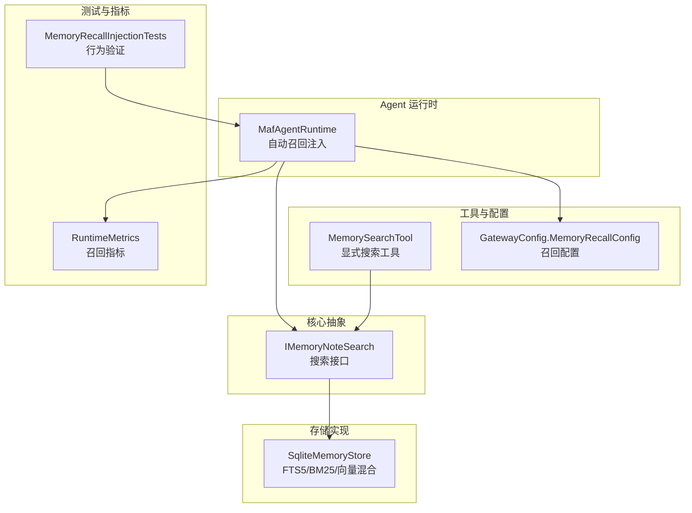
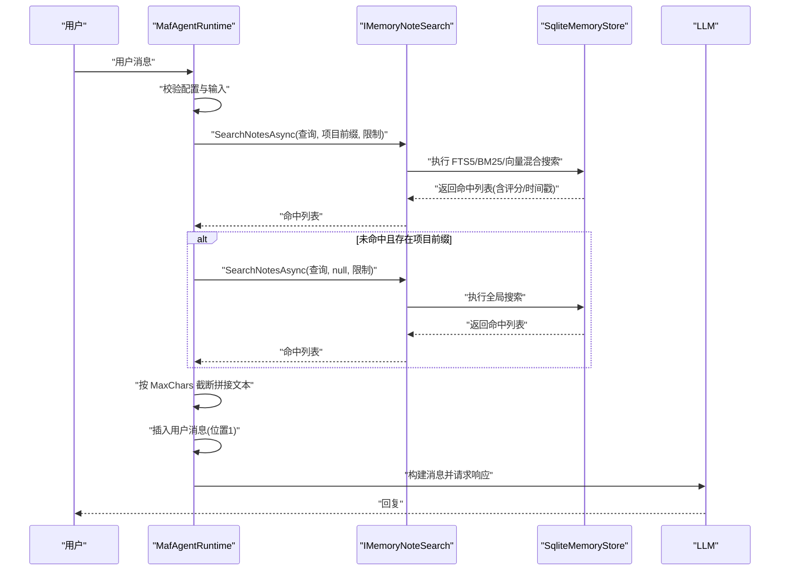
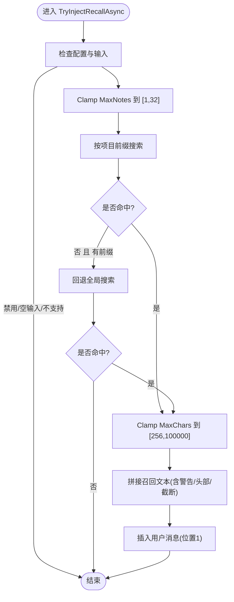
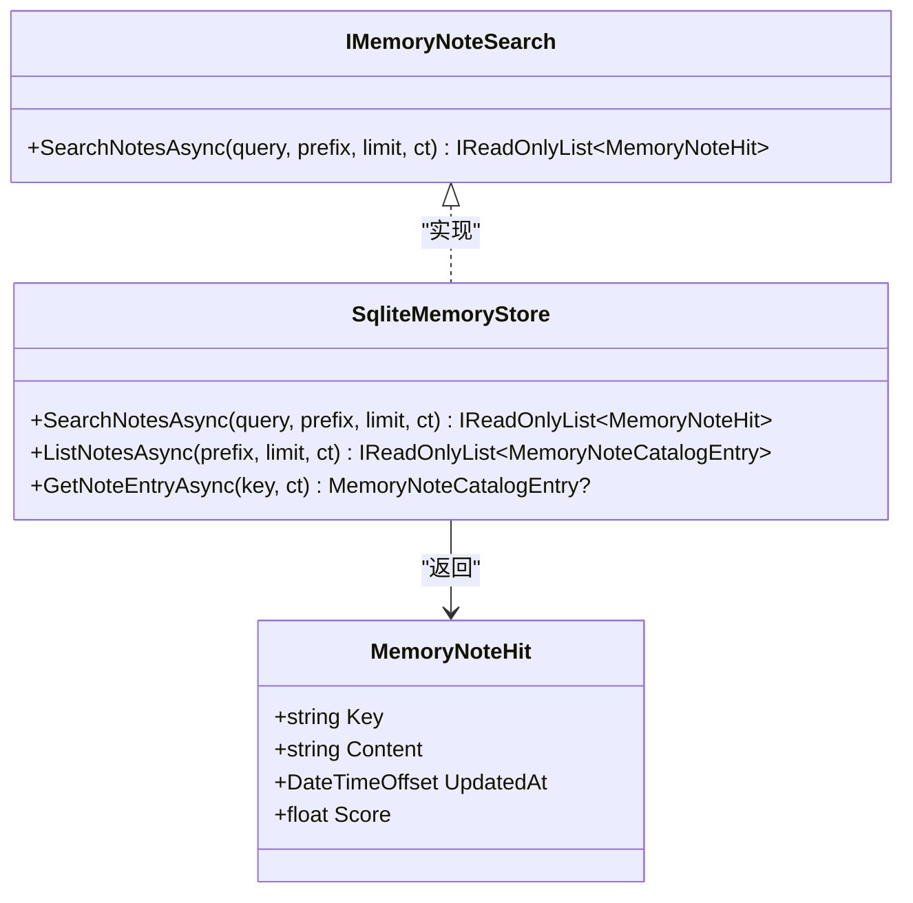
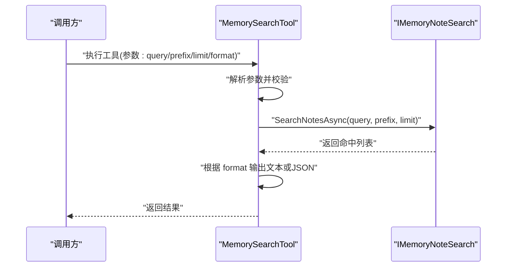
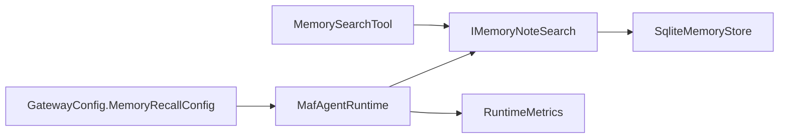

# 内存召回配置

<cite>
**本文引用的文件**
- [openclaw-memory-recall-and-retention.md](file://docs/openclaw-memory-recall-and-retention.md)
- [MafAgentRuntime.cs](file://src/OpenClaw.Agent/MafAgentRuntime.cs)
- [IMemoryNoteSearch.cs](file://src/OpenClaw.Core/Abstractions/IMemoryNoteSearch.cs)
- [SqliteMemoryStore.cs](file://src/OpenClaw.Core/Memory/SqliteMemoryStore.cs)
- [MemorySearchTool.cs](file://src/OpenClaw.Agent/Tools/MemorySearchTool.cs)
- [GatewayConfig.cs](file://src/OpenClaw.Core/Models/GatewayConfig.cs)
- [MemoryRecallInjectionTests.cs](file://src/OpenClaw.Tests/MemoryRecallInjectionTests.cs)
- [FractalMemoryTests.cs](file://src/OpenClaw.Tests/FractalMemoryTests.cs)
- [RuntimeMetrics.cs](file://src/OpenClaw.Core/Observability/RuntimeMetrics.cs)
</cite>

## 目录
1. [简介](#简介)
2. [项目结构](#项目结构)
3. [核心组件](#核心组件)
4. [架构总览](#架构总览)
5. [详细组件分析](#详细组件分析)
6. [依赖关系分析](#依赖关系分析)
7. [性能考量](#性能考量)
8. [故障排查指南](#故障排查指南)
9. [结论](#结论)
10. [附录](#附录)

## 简介
本文件面向“内存召回配置”的技术文档，聚焦于自动记忆召回机制的配置参数、召回策略、搜索算法与匹配规则、排序与相关性评分、过滤条件、性能优化、缓存策略与并发控制，以及不同应用场景下的配置建议与效果评估方法。文档基于仓库中的实现与说明文档进行整理，确保读者能够从高层到代码层面全面理解与实践。

## 项目结构
与“内存召回配置”直接相关的模块与文件分布如下：
- 文档说明：openclaw-memory-recall-and-retention.md
- 运行时注入逻辑：MafAgentRuntime.cs
- 搜索接口定义：IMemoryNoteSearch.cs
- SQLite 后端搜索实现：SqliteMemoryStore.cs
- 搜索工具：MemorySearchTool.cs
- 配置模型：GatewayConfig.cs（含 MemoryRecallConfig）
- 测试用例：MemoryRecallInjectionTests.cs、FractalMemoryTests.cs
- 运行时指标：RuntimeMetrics.cs

图表来源
- [MafAgentRuntime.cs:625-682](file://src/OpenClaw.Agent/MafAgentRuntime.cs#L625-L682)
- [IMemoryNoteSearch.cs:18-27](file://src/OpenClaw.Core/Abstractions/IMemoryNoteSearch.cs#L18-L27)
- [SqliteMemoryStore.cs:419-490](file://src/OpenClaw.Core/Memory/SqliteMemoryStore.cs#L419-L490)
- [MemorySearchTool.cs:1-69](file://src/OpenClaw.Agent/Tools/MemorySearchTool.cs#L1-L69)
- [GatewayConfig.cs:324-329](file://src/OpenClaw.Core/Models/GatewayConfig.cs#L324-L329)
- [MemoryRecallInjectionTests.cs:1-90](file://src/OpenClaw.Tests/MemoryRecallInjectionTests.cs#L1-L90)
- [RuntimeMetrics.cs:212-239](file://src/OpenClaw.Core/Observability/RuntimeMetrics.cs#L212-L239)

章节来源
- [openclaw-memory-recall-and-retention.md:67-112](file://docs/openclaw-memory-recall-and-retention.md#L67-L112)
- [MafAgentRuntime.cs:625-682](file://src/OpenClaw.Agent/MafAgentRuntime.cs#L625-L682)
- [IMemoryNoteSearch.cs:18-27](file://src/OpenClaw.Core/Abstractions/IMemoryNoteSearch.cs#L18-L27)
- [SqliteMemoryStore.cs:419-490](file://src/OpenClaw.Core/Memory/SqliteMemoryStore.cs#L419-L490)
- [MemorySearchTool.cs:1-69](file://src/OpenClaw.Agent/Tools/MemorySearchTool.cs#L1-L69)
- [GatewayConfig.cs:324-329](file://src/OpenClaw.Core/Models/GatewayConfig.cs#L324-L329)
- [MemoryRecallInjectionTests.cs:1-90](file://src/OpenClaw.Tests/MemoryRecallInjectionTests.cs#L1-L90)
- [RuntimeMetrics.cs:212-239](file://src/OpenClaw.Core/Observability/RuntimeMetrics.cs#L212-L239)

## 核心组件
- 召回配置模型：MemoryRecallConfig，包含 Enabled、MaxNotes、MaxChars 三项关键参数，分别控制开关、最大笔记数与注入字符预算。
- 自动召回注入：MafAgentRuntime.TryInjectRecallAsync 实现两阶段搜索与注入，优先项目作用域，失败则回退全局。
- 搜索接口与实现：IMemoryNoteSearch 定义 SearchNotesAsync；SqliteMemoryStore 提供 FTS5/BM25/向量混合搜索。
- 显式搜索工具：MemorySearchTool 支持关键字搜索、前缀过滤与格式化输出。
- 运行时指标：RuntimeMetrics 提供召回搜索次数与命中数统计。

章节来源
- [GatewayConfig.cs:324-329](file://src/OpenClaw.Core/Models/GatewayConfig.cs#L324-L329)
- [MafAgentRuntime.cs:625-682](file://src/OpenClaw.Agent/MafAgentRuntime.cs#L625-L682)
- [IMemoryNoteSearch.cs:18-27](file://src/OpenClaw.Core/Abstractions/IMemoryNoteSearch.cs#L18-L27)
- [SqliteMemoryStore.cs:419-490](file://src/OpenClaw.Core/Memory/SqliteMemoryStore.cs#L419-L490)
- [MemorySearchTool.cs:1-69](file://src/OpenClaw.Agent/Tools/MemorySearchTool.cs#L1-L69)
- [RuntimeMetrics.cs:212-239](file://src/OpenClaw.Core/Observability/RuntimeMetrics.cs#L212-L239)

## 架构总览
自动召回的整体流程如下：
- 输入：用户消息与当前会话上下文
- 配置：从 GatewayConfig.Memory.Recall 读取 Enabled、MaxNotes、MaxChars
- 搜索：优先使用项目前缀（如 project:{projectId}:）进行搜索，失败再回退到全局搜索
- 排序与截断：按后端评分排序，单条内容截断至 2000 字符，整体注入长度受 MaxChars 限制
- 注入：将召回内容作为用户消息插入到系统提示之后的位置，附加不可信数据警告

图表来源
- [MafAgentRuntime.cs:625-682](file://src/OpenClaw.Agent/MafAgentRuntime.cs#L625-L682)
- [IMemoryNoteSearch.cs:18-21](file://src/OpenClaw.Core/Abstractions/IMemoryNoteSearch.cs#L18-L21)
- [SqliteMemoryStore.cs:419-490](file://src/OpenClaw.Core/Memory/SqliteMemoryStore.cs#L419-L490)

章节来源
- [openclaw-memory-recall-and-retention.md:71-78](file://docs/openclaw-memory-recall-and-retention.md#L71-L78)
- [MafAgentRuntime.cs:625-682](file://src/OpenClaw.Agent/MafAgentRuntime.cs#L625-L682)

## 详细组件分析

### 组件A：自动召回注入（MafAgentRuntime.TryInjectRecallAsync）
- 触发条件：配置启用、输入非空、内存实现支持搜索接口
- 两阶段搜索：
  - 第一阶段：使用项目前缀（来自 GatewayConfig.Memory.ProjectId）搜索
  - 第二阶段：若第一阶段未命中且存在前缀，则回退到全局搜索
- 注入策略：
  - 将召回文本作为用户消息插入到位置 1（系统提示之后）
  - 文本包含不可信数据警告与结构化头部
  - 单条内容截断至 2000 字符，整体长度受 MaxChars 限制
- 异常处理：捕获异常并记录警告，不影响后续推理

图表来源
- [MafAgentRuntime.cs:625-682](file://src/OpenClaw.Agent/MafAgentRuntime.cs#L625-L682)

章节来源
- [MafAgentRuntime.cs:625-682](file://src/OpenClaw.Agent/MafAgentRuntime.cs#L625-L682)
- [openclaw-memory-recall-and-retention.md:71-78](file://docs/openclaw-memory-recall-and-retention.md#L71-L78)

### 组件B：搜索接口与实现（IMemoryNoteSearch 与 SqliteMemoryStore）
- 接口定义：SearchNotesAsync(query, prefix, limit, ct) 返回 MemoryNoteHit 列表，包含 Key、Content、UpdatedAt、Score
- SQLite 实现：
  - FTS5 启用时：使用 notes_fts 虚拟表，按 bm25 排序，再按更新时间倒序
  - FTS5 未启用时：按 key 前缀与查询字符串模糊匹配，按更新时间倒序
  - 向量与 BM25 混合：当启用向量时，综合 BM25 与余弦相似度评分（BM25 权重 40%，向量权重 60%）

图表来源
- [IMemoryNoteSearch.cs:18-27](file://src/OpenClaw.Core/Abstractions/IMemoryNoteSearch.cs#L18-L27)
- [SqliteMemoryStore.cs:419-490](file://src/OpenClaw.Core/Memory/SqliteMemoryStore.cs#L419-L490)

章节来源
- [IMemoryNoteSearch.cs:3-9](file://src/OpenClaw.Core/Abstractions/IMemoryNoteSearch.cs#L3-L9)
- [SqliteMemoryStore.cs:419-490](file://src/OpenClaw.Core/Memory/SqliteMemoryStore.cs#L419-L490)
- [openclaw-memory-recall-and-retention.md:59-63](file://docs/openclaw-memory-recall-and-retention.md#L59-L63)

### 组件C：显式搜索工具（MemorySearchTool）
- 参数：
  - query：必填，关键字查询
  - prefix：可选，键前缀过滤（如 project:myproj:）
  - limit：默认 10，最小 1，最大 50
  - format：text/json，默认 text
- 行为：调用 IMemoryNoteSearch 执行搜索，返回结构化结果或人类可读文本

图表来源
- [MemorySearchTool.cs:31-60](file://src/OpenClaw.Agent/Tools/MemorySearchTool.cs#L31-L60)
- [IMemoryNoteSearch.cs:20-21](file://src/OpenClaw.Core/Abstractions/IMemoryNoteSearch.cs#L20-L21)

章节来源
- [MemorySearchTool.cs:1-69](file://src/OpenClaw.Agent/Tools/MemorySearchTool.cs#L1-L69)

### 组件D：配置模型（GatewayConfig.MemoryRecallConfig）
- Enabled：是否启用自动召回
- MaxNotes：每轮注入的最大笔记数，Clamp 到 [1,32]
- MaxChars：注入的召回块字符预算，Clamp 到 [256,100000]

章节来源
- [GatewayConfig.cs:324-329](file://src/OpenClaw.Core/Models/GatewayConfig.cs#L324-L329)

### 组件E：测试与验证（MemoryRecallInjectionTests、FractalMemoryTests）
- 行为验证：确认启用时插入用户消息、项目前缀优先、全局回退等
- 回调用例：验证召回文本包含不可信警告与结构化头部

章节来源
- [MemoryRecallInjectionTests.cs:12-48](file://src/OpenClaw.Tests/MemoryRecallInjectionTests.cs#L12-L48)
- [MemoryRecallInjectionTests.cs:50-89](file://src/OpenClaw.Tests/MemoryRecallInjectionTests.cs#L50-L89)
- [FractalMemoryTests.cs:291-316](file://src/OpenClaw.Tests/FractalMemoryTests.cs#L291-L316)

## 依赖关系分析
- MafAgentRuntime 依赖 IMemoryNoteSearch 接口，具体实现为 SqliteMemoryStore
- MemorySearchTool 也依赖 IMemoryNoteSearch，提供显式搜索能力
- 配置模型 MemoryRecallConfig 由 GatewayConfig.Memory 持有并在运行时注入到 AgentRuntime
- 运行时指标通过 RuntimeMetrics 统计召回搜索与命中情况

图表来源
- [GatewayConfig.cs:324-329](file://src/OpenClaw.Core/Models/GatewayConfig.cs#L324-L329)
- [MafAgentRuntime.cs:625-682](file://src/OpenClaw.Agent/MafAgentRuntime.cs#L625-L682)
- [IMemoryNoteSearch.cs:18-27](file://src/OpenClaw.Core/Abstractions/IMemoryNoteSearch.cs#L18-L27)
- [SqliteMemoryStore.cs:419-490](file://src/OpenClaw.Core/Memory/SqliteMemoryStore.cs#L419-L490)
- [MemorySearchTool.cs:1-69](file://src/OpenClaw.Agent/Tools/MemorySearchTool.cs#L1-L69)
- [RuntimeMetrics.cs:212-239](file://src/OpenClaw.Core/Observability/RuntimeMetrics.cs#L212-L239)

章节来源
- [GatewayConfig.cs:324-329](file://src/OpenClaw.Core/Models/GatewayConfig.cs#L324-L329)
- [MafAgentRuntime.cs:625-682](file://src/OpenClaw.Agent/MafAgentRuntime.cs#L625-L682)
- [IMemoryNoteSearch.cs:18-27](file://src/OpenClaw.Core/Abstractions/IMemoryNoteSearch.cs#L18-L27)
- [SqliteMemoryStore.cs:419-490](file://src/OpenClaw.Core/Memory/SqliteMemoryStore.cs#L419-L490)
- [MemorySearchTool.cs:1-69](file://src/OpenClaw.Agent/Tools/MemorySearchTool.cs#L1-L69)
- [RuntimeMetrics.cs:212-239](file://src/OpenClaw.Core/Observability/RuntimeMetrics.cs#L212-L239)

## 性能考量
- 查询限制与截断
  - MaxNotes 限制每轮召回笔记数，避免上下文膨胀
  - MaxChars 控制注入文本总长度，防止超出 LLM 上下文上限
  - 单条内容截断至 2000 字符，兼顾信息密度与性能
- 排序与评分
  - SQLite 后端在启用 FTS5 时使用 bm25 排序，再按更新时间倒序
  - 启用向量时采用混合评分（BM25 40% + 向量 60%），提升语义相关性
- 并发与稳定性
  - SQLite 使用 WAL 模式与 PRAGMA synchronous=NORMAL，在吞吐与持久性间平衡
  - 文件后端采用条带状信号量，降低锁竞争
- 指标监控
  - 通过 RuntimeMetrics.IncrementMemoryRecallSearches 与 AddMemoryRecallHits 统计召回行为，便于容量规划与性能调优

章节来源
- [openclaw-memory-recall-and-retention.md:25-64](file://docs/openclaw-memory-recall-and-retention.md#L25-L64)
- [MafAgentRuntime.cs:638-649](file://src/OpenClaw.Agent/MafAgentRuntime.cs#L638-L649)
- [SqliteMemoryStore.cs:419-490](file://src/OpenClaw.Core/Memory/SqliteMemoryStore.cs#L419-L490)
- [RuntimeMetrics.cs:212-239](file://src/OpenClaw.Core/Observability/RuntimeMetrics.cs#L212-L239)

## 故障排查指南
- 未触发召回
  - 检查 MemoryRecallConfig.Enabled 是否为 true
  - 确认输入非空，且内存实现支持 IMemoryNoteSearch
  - 若项目前缀未命中，确认 GatewayConfig.Memory.ProjectId 是否正确
- 召回内容异常
  - 查看注入文本是否包含不可信数据警告与结构化头部
  - 检查 MaxChars 是否过小导致内容被截断
- 搜索性能问题
  - 确认 SQLite FTS5 是否启用，必要时开启 enableFts
  - 对高并发场景，关注 SQLite WAL 与同步级别配置
- 指标异常
  - 通过 RuntimeMetrics 检查召回搜索次数与命中数，定位异常波动

章节来源
- [MafAgentRuntime.cs:625-682](file://src/OpenClaw.Agent/MafAgentRuntime.cs#L625-L682)
- [MemoryRecallInjectionTests.cs:12-48](file://src/OpenClaw.Tests/MemoryRecallInjectionTests.cs#L12-L48)
- [openclaw-memory-recall-and-retention.md:100-111](file://docs/openclaw-memory-recall-and-retention.md#L100-L111)
- [RuntimeMetrics.cs:212-239](file://src/OpenClaw.Core/Observability/RuntimeMetrics.cs#L212-L239)

## 结论
内存召回配置围绕“开关、数量与字符预算”三大参数展开，结合两阶段搜索（项目前缀优先+全局回退）、后端评分与内容截断、不可信数据注入策略与严格的安全提示，实现了稳定高效的上下文增强机制。通过显式搜索工具与运行时指标，系统既满足自动化需求，又具备可观测性与可调试性。针对不同场景，应依据上下文预算、数据规模与性能目标合理设置 MaxNotes 与 MaxChars，并根据后端能力选择合适的 FTS5/向量配置。

## 附录

### 配置参数与取值范围
- memory.recall.enabled：布尔，控制开关
- memory.recall.maxNotes：整数，Clamp 到 [1,32]
- memory.recall.maxChars：整数，Clamp 到 [256,100000]

章节来源
- [GatewayConfig.cs:324-329](file://src/OpenClaw.Core/Models/GatewayConfig.cs#L324-L329)
- [MafAgentRuntime.cs:638-649](file://src/OpenClaw.Agent/MafAgentRuntime.cs#L638-L649)

### 搜索与匹配规则
- 项目作用域优先：使用 project:{projectId}: 前缀过滤
- 全局回退：项目前缀未命中时回退到全局搜索
- SQLite 后端：
  - FTS5 启用：bm25 排序 + 更新时间倒序
  - FTS5 未启用：模糊匹配 + 更新时间倒序
  - 启用向量：BM25 40% + 向量 60%

章节来源
- [openclaw-memory-recall-and-retention.md:71-78](file://docs/openclaw-memory-recall-and-retention.md#L71-L78)
- [SqliteMemoryStore.cs:419-490](file://src/OpenClaw.Core/Memory/SqliteMemoryStore.cs#L419-L490)

### 排序机制与相关性评分
- SQLite：bm25 排序（FTS5），随后按 UpdatedAt 倒序
- 混合评分：BM25 权重 40%，向量余弦相似度权重 60%
- 单条内容截断：2000 字符；整体注入长度受 MaxChars 限制

章节来源
- [SqliteMemoryStore.cs:419-490](file://src/OpenClaw.Core/Memory/SqliteMemoryStore.cs#L419-L490)
- [MafAgentRuntime.cs:667-668](file://src/OpenClaw.Agent/MafAgentRuntime.cs#L667-L668)

### 缓存策略与并发控制
- SQLite：WAL 日志模式 + PRAGMA synchronous=NORMAL
- 文件后端：条带状信号量，降低锁竞争
- 建议：在高并发场景下优先使用 SQLite 后端，并根据负载调整 limit 与 MaxNotes

章节来源
- [openclaw-memory-recall-and-retention.md:35-36](file://docs/openclaw-memory-recall-and-retention.md#L35-L36)

### 应用场景与配置建议
- 高交互对话：适度提高 MaxNotes（如 8–16），适当放宽 MaxChars（如 8000–16000）
- 大模型长上下文：严格控制 MaxNotes 与 MaxChars，避免上下文溢出
- 项目域专属：启用项目前缀，确保召回内容聚焦
- 混合检索：开启 FTS5 与向量，提升语义相关性

章节来源
- [openclaw-memory-recall-and-retention.md:71-78](file://docs/openclaw-memory-recall-and-retention.md#L71-L78)
- [MafAgentRuntime.cs:638-649](file://src/OpenClaw.Agent/MafAgentRuntime.cs#L638-L649)

### 效果评估方法
- 指标追踪：通过 RuntimeMetrics 统计召回搜索次数与命中数
- A/B 对比：在相同任务集上对比启用/关闭召回的响应质量与效率
- 用户反馈：收集任务完成率、错误指令风险与上下文长度满意度
- 负载测试：模拟并发场景，观察延迟与命中率变化

章节来源
- [RuntimeMetrics.cs:212-239](file://src/OpenClaw.Core/Observability/RuntimeMetrics.cs#L212-L239)
- [openclaw-memory-recall-and-retention.md:183-194](file://docs/openclaw-memory-recall-and-retention.md#L183-L194)