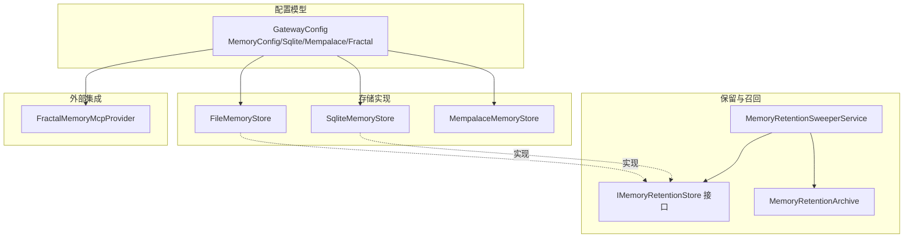
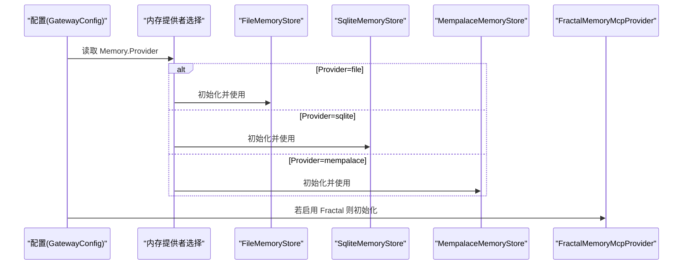
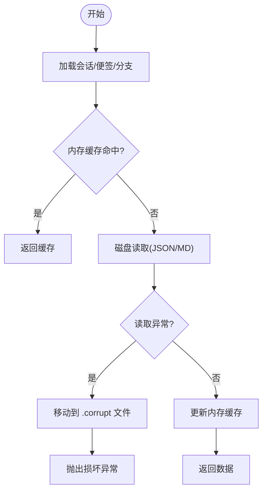
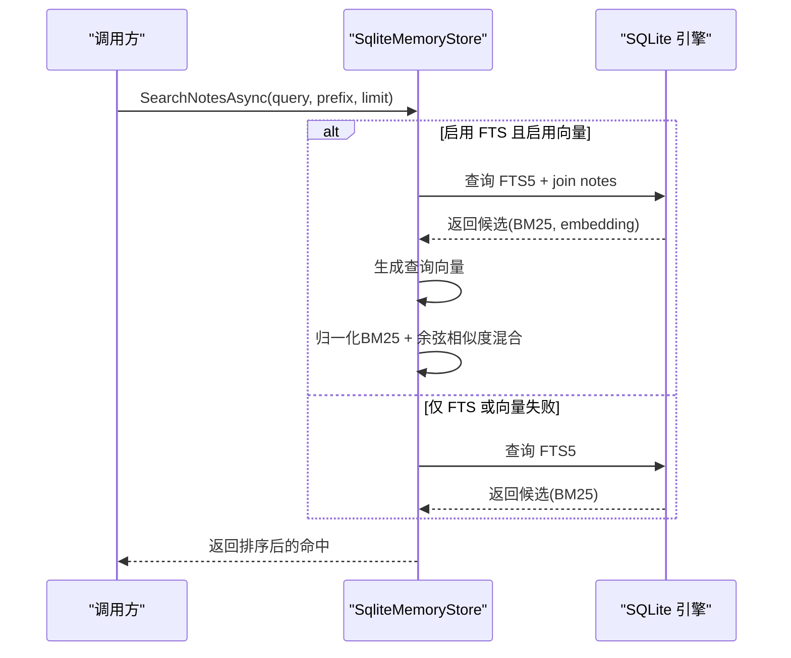
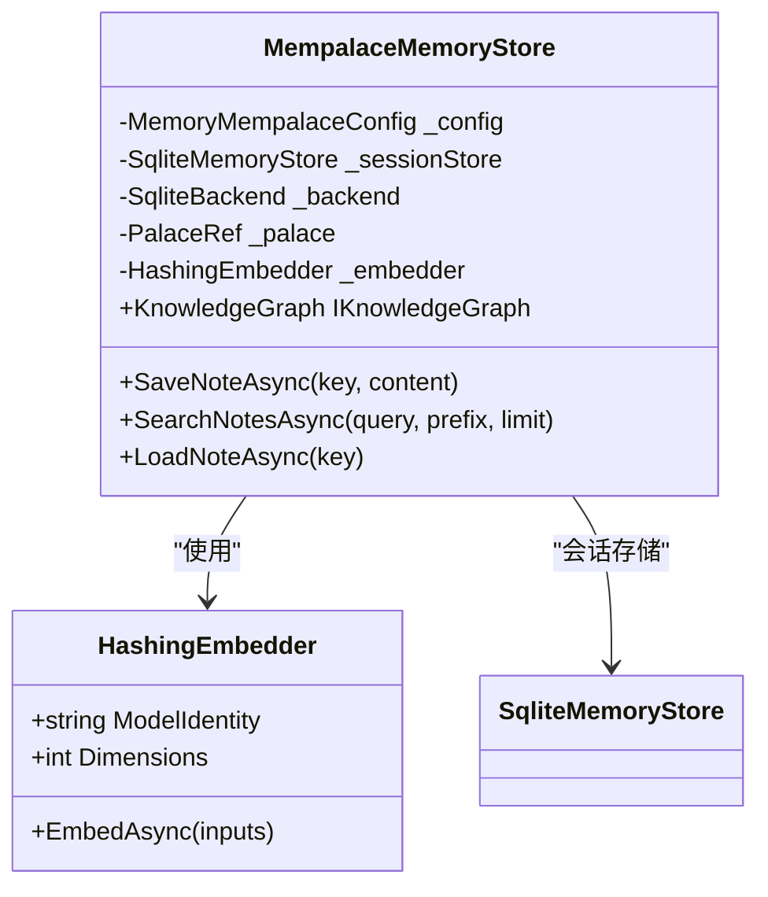
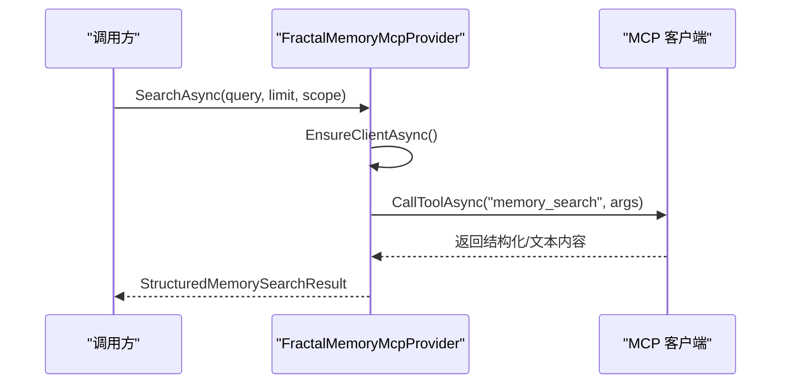
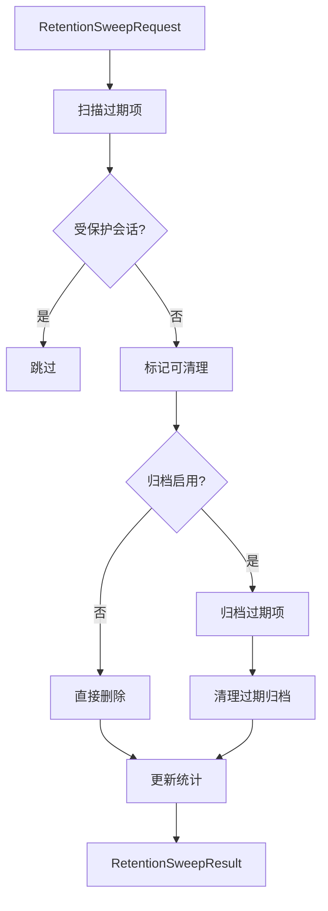
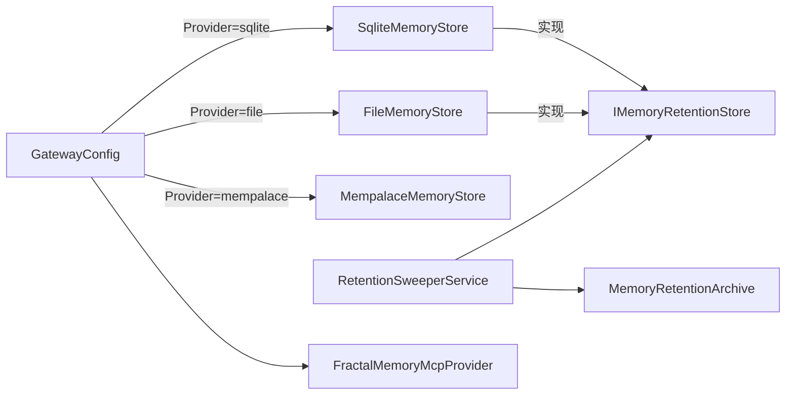

# 内存配置

<cite>
**本文引用的文件**
- [FileMemoryStore.cs](file://src/OpenClaw.Core/Memory/FileMemoryStore.cs)
- [SqliteMemoryStore.cs](file://src/OpenClaw.Core/Memory/SqliteMemoryStore.cs)
- [MempalaceMemoryStore.cs](file://src/OpenClaw.Plugins.Mempalace/MempalaceMemoryStore.cs)
- [FractalMemoryMcpProvider.cs](file://src/OpenClaw.Agent/Memory/FractalMemoryMcpProvider.cs)
- [GatewayConfig.cs](file://src/OpenClaw.Core/Models/GatewayConfig.cs)
- [MemoryRetentionModels.cs](file://src/OpenClaw.Core/Models/MemoryRetentionModels.cs)
- [IMemoryRetentionStore.cs](file://src/OpenClaw.Core/Abstractions/IMemoryRetentionStore.cs)
- [MemoryRetentionArchive.cs](file://src/OpenClaw.Core/Memory/MemoryRetentionArchive.cs)
- [MemoryRetentionSweeperService.cs](file://src/OpenClaw.Gateway/Extensions/MemoryRetentionSweeperService.cs)
- [openclaw-memory-recall-and-retention.md](file://docs/openclaw-memory-recall-and-retention.md)
</cite>

## 目录
1. [简介](#简介)
2. [项目结构](#项目结构)
3. [核心组件](#核心组件)
4. [架构总览](#架构总览)
5. [详细组件分析](#详细组件分析)
6. [依赖关系分析](#依赖关系分析)
7. [性能考虑](#性能考虑)
8. [故障排查指南](#故障排查指南)
9. [结论](#结论)
10. [附录](#附录)

## 简介
本技术文档聚焦于内存配置系统，涵盖以下主题：
- 内存存储后端配置：文件存储、SQLite 与 Mempalace 的具体设置与差异
- 内存保留策略、历史轮次限制与压缩机制
- SQLite 配置选项：FTS 启用、向量嵌入与数据库路径
- Mempalace 配置：知识图谱、集合命名与嵌入维度
- Fractal 内存配置、召回机制与数据保留策略
- 不同存储后端的性能对比、容量规划与迁移指南

## 项目结构
内存配置系统由多个层次组成：
- 配置模型层：集中定义内存相关配置（提供者、路径、保留策略、召回参数等）
- 存储实现层：文件存储、SQLite 存储、Mempalace 插件存储
- 召回与保留服务层：基于配置的自动保留清理与统计
- 外部集成层：Fractal 内存通过 MCP 协议对接外部仓库

图表来源
- [GatewayConfig.cs:175-262](file://src/OpenClaw.Core/Models/GatewayConfig.cs#L175-L262)
- [FileMemoryStore.cs:32-76](file://src/OpenClaw.Core/Memory/FileMemoryStore.cs#L32-L76)
- [SqliteMemoryStore.cs:12-45](file://src/OpenClaw.Core/Memory/SqliteMemoryStore.cs#L12-L45)
- [MempalaceMemoryStore.cs:15-57](file://src/OpenClaw.Plugins.Mempalace/MempalaceMemoryStore.cs#L15-L57)
- [IMemoryRetentionStore.cs:9-17](file://src/OpenClaw.Core/Abstractions/IMemoryRetentionStore.cs#L9-L17)
- [MemoryRetentionArchive.cs:7-77](file://src/OpenClaw.Core/Memory/MemoryRetentionArchive.cs#L7-L77)
- [MemoryRetentionSweeperService.cs:98-110](file://src/OpenClaw.Gateway/Extensions/MemoryRetentionSweeperService.cs#L98-L110)
- [FractalMemoryMcpProvider.cs:13-30](file://src/OpenClaw.Agent/Memory/FractalMemoryMcpProvider.cs#L13-L30)

章节来源
- [GatewayConfig.cs:175-262](file://src/OpenClaw.Core/Models/GatewayConfig.cs#L175-L262)
- [FileMemoryStore.cs:32-76](file://src/OpenClaw.Core/Memory/FileMemoryStore.cs#L32-L76)
- [SqliteMemoryStore.cs:12-45](file://src/OpenClaw.Core/Memory/SqliteMemoryStore.cs#L12-L45)
- [MempalaceMemoryStore.cs:15-57](file://src/OpenClaw.Plugins.Mempalace/MempalaceMemoryStore.cs#L15-L57)
- [IMemoryRetentionStore.cs:9-17](file://src/OpenClaw.Core/Abstractions/IMemoryRetentionStore.cs#L9-L17)
- [MemoryRetentionArchive.cs:7-77](file://src/OpenClaw.Core/Memory/MemoryRetentionArchive.cs#L7-L77)
- [MemoryRetentionSweeperService.cs:98-110](file://src/OpenClaw.Gateway/Extensions/MemoryRetentionSweeperService.cs#L98-L110)
- [FractalMemoryMcpProvider.cs:13-30](file://src/OpenClaw.Agent/Memory/FractalMemoryMcpProvider.cs#L13-L30)

## 核心组件
- 文件存储（FileMemoryStore）：以 JSON/Markdown 文件持久化会话、便签与分支；内置内存缓存与并发加载栅栏；支持保留策略扫描与归档
- SQLite 存储（SqliteMemoryStore）：使用 WAL 模式、FTS5 虚拟表与可选向量列；支持 BM25 文本检索与向量相似度重排
- Mempalace 存储（MempalaceMemoryStore）：在 SQLite 会话存储之上，结合 MemPalace 向量集合与知识图谱，提供语义检索与时空三元组记录
- Fractal 内存（FractalMemoryMcpProvider）：通过 MCP 协议连接外部 Fractal 仓库，提供搜索、打开、最近更新、导出与索引刷新等能力
- 保留与归档（Retention）：统一的保留请求/结果模型、归档写入与过期清理、后台 Sweeper 定时执行

章节来源
- [FileMemoryStore.cs:32-76](file://src/OpenClaw.Core/Memory/FileMemoryStore.cs#L32-L76)
- [SqliteMemoryStore.cs:12-45](file://src/OpenClaw.Core/Memory/SqliteMemoryStore.cs#L12-L45)
- [MempalaceMemoryStore.cs:15-57](file://src/OpenClaw.Plugins.Mempalace/MempalaceMemoryStore.cs#L15-L57)
- [FractalMemoryMcpProvider.cs:13-30](file://src/OpenClaw.Agent/Memory/FractalMemoryMcpProvider.cs#L13-L30)
- [MemoryRetentionModels.cs:7-51](file://src/OpenClaw.Core/Models/MemoryRetentionModels.cs#L7-L51)
- [MemoryRetentionArchive.cs:7-77](file://src/OpenClaw.Core/Memory/MemoryRetentionArchive.cs#L7-L77)
- [MemoryRetentionSweeperService.cs:98-110](file://src/OpenClaw.Gateway/Extensions/MemoryRetentionSweeperService.cs#L98-L110)

## 架构总览
内存配置系统通过配置模型驱动不同存储后端，并在需要时启用保留与召回功能。Fractal 作为外部结构化记忆提供者，通过 MCP 协议接入。

图表来源
- [GatewayConfig.cs:175-201](file://src/OpenClaw.Core/Models/GatewayConfig.cs#L175-L201)
- [FileMemoryStore.cs:32-76](file://src/OpenClaw.Core/Memory/FileMemoryStore.cs#L32-L76)
- [SqliteMemoryStore.cs:12-45](file://src/OpenClaw.Core/Memory/SqliteMemoryStore.cs#L12-L45)
- [MempalaceMemoryStore.cs:15-57](file://src/OpenClaw.Plugins.Mempalace/MempalaceMemoryStore.cs#L15-L57)
- [FractalMemoryMcpProvider.cs:13-30](file://src/OpenClaw.Agent/Memory/FractalMemoryMcpProvider.cs#L13-L30)

## 详细组件分析

### 文件存储后端（FileMemoryStore）
- 数据组织
  - 会话：sessions 目录下 JSON 文件，键名经 URL 安全 Base64 编码，防止路径遍历
  - 便签：notes 目录下 Markdown 文件与 .key 元数据文件，支持预览内容与更新时间
  - 分支：branches 目录下 JSON 文件，按分支 ID 存储
- 缓存与并发
  - 使用内存缓存限制最大会话数量
  - 加载采用分段栅栏（64 个信号量）避免热点会话竞争
- 保留策略
  - 支持扫描过期会话与分支，可归档到指定目录并清理
  - 提供保留统计与错误聚合
- 健壮性
  - 读取失败自动隔离损坏文件至 .corrupt 时间戳文件
  - 原子写入（临时文件 + 原子重命名）

图表来源
- [FileMemoryStore.cs:78-170](file://src/OpenClaw.Core/Memory/FileMemoryStore.cs#L78-L170)
- [FileMemoryStore.cs:191-223](file://src/OpenClaw.Core/Memory/FileMemoryStore.cs#L191-L223)

章节来源
- [FileMemoryStore.cs:32-76](file://src/OpenClaw.Core/Memory/FileMemoryStore.cs#L32-L76)
- [FileMemoryStore.cs:78-170](file://src/OpenClaw.Core/Memory/FileMemoryStore.cs#L78-L170)
- [FileMemoryStore.cs:225-277](file://src/OpenClaw.Core/Memory/FileMemoryStore.cs#L225-L277)
- [FileMemoryStore.cs:570-623](file://src/OpenClaw.Core/Memory/FileMemoryStore.cs#L570-L623)
- [FileMemoryStore.cs:625-800](file://src/OpenClaw.Core/Memory/FileMemoryStore.cs#L625-L800)

### SQLite 存储后端（SqliteMemoryStore）
- 初始化与模式
  - WAL 日志模式、外键开启、普通同步级别
  - sessions/notes/branches 表，带 updated_at 索引
- FTS 与向量
  - 可选启用 FTS5 虚拟表与触发器，自动同步 notes 与会话转录
  - 可选启用 embedding 列，保存向量二进制
- 搜索与重排
  - FTS5 BM25 排序；若启用向量且生成成功，则与余弦相似度组合重排
  - 查询失败或语法错误时优雅降级为纯文本匹配
- 事务与批量
  - 删除操作使用事务与批量执行提升吞吐

图表来源
- [SqliteMemoryStore.cs:319-490](file://src/OpenClaw.Core/Memory/SqliteMemoryStore.cs#L319-L490)
- [SqliteMemoryStore.cs:330-460](file://src/OpenClaw.Core/Memory/SqliteMemoryStore.cs#L330-L460)

章节来源
- [SqliteMemoryStore.cs:54-148](file://src/OpenClaw.Core/Memory/SqliteMemoryStore.cs#L54-L148)
- [SqliteMemoryStore.cs:319-490](file://src/OpenClaw.Core/Memory/SqliteMemoryStore.cs#L319-L490)
- [SqliteMemoryStore.cs:1011-1038](file://src/OpenClaw.Core/Memory/SqliteMemoryStore.cs#L1011-L1038)

### Mempalace 存储后端（MempalaceMemoryStore）
- 组成
  - 内部复用 SQLite 会话存储（确保会话一致性）
  - MemPalace 向量集合：按“翼-房间-抽屉”层次化放置，记录元数据 updatedAt
  - 知识图谱：记录“记忆-存放位置-房间-翼”的时空三元组
- 检索
  - 优先从 MemPalace 集合查询，未命中则回退到 SQLite 便签
  - 通过哈希嵌入器生成固定维度向量，支持距离评分
- 配置要点
  - BasePath、PalaceId、Namespace、CollectionName、EmbeddingDimensions、默认 Wing/Room、会话与知识图谱数据库路径、最大候选数

图表来源
- [MempalaceMemoryStore.cs:15-57](file://src/OpenClaw.Plugins.Mempalace/MempalaceMemoryStore.cs#L15-L57)
- [MempalaceMemoryStore.cs:317-372](file://src/OpenClaw.Plugins.Mempalace/MempalaceMemoryStore.cs#L317-L372)

章节来源
- [MempalaceMemoryStore.cs:33-57](file://src/OpenClaw.Plugins.Mempalace/MempalaceMemoryStore.cs#L33-L57)
- [MempalaceMemoryStore.cs:90-124](file://src/OpenClaw.Plugins.Mempalace/MempalaceMemoryStore.cs#L90-L124)
- [MempalaceMemoryStore.cs:129-176](file://src/OpenClaw.Plugins.Mempalace/MempalaceMemoryStore.cs#L129-L176)
- [MempalaceMemoryStore.cs:222-242](file://src/OpenClaw.Plugins.Mempalace/MempalaceMemoryStore.cs#L222-L242)

### Fractal 内存（FractalMemoryMcpProvider）
- 运行模式
  - 通过 MCP 命令启动外部 Fractal 服务器，工作目录指向仓库根
  - 支持状态检查、搜索、打开、最近更新、导出、手稿创建、验证与索引刷新
- 参数与限制
  - 默认深度、视图、导出模式、上下文字符/令牌上限、自动上下文模式、是否允许写入等
- 错误处理
  - 超时、对象已释放、无效参数、JSON 解析、IO 异常、超时等均有明确错误包装

图表来源
- [FractalMemoryMcpProvider.cs:70-95](file://src/OpenClaw.Agent/Memory/FractalMemoryMcpProvider.cs#L70-L95)
- [FractalMemoryMcpProvider.cs:222-277](file://src/OpenClaw.Agent/Memory/FractalMemoryMcpProvider.cs#L222-L277)
- [FractalMemoryMcpProvider.cs:279-330](file://src/OpenClaw.Agent/Memory/FractalMemoryMcpProvider.cs#L279-L330)

章节来源
- [FractalMemoryMcpProvider.cs:32-68](file://src/OpenClaw.Agent/Memory/FractalMemoryMcpProvider.cs#L32-L68)
- [FractalMemoryMcpProvider.cs:70-198](file://src/OpenClaw.Agent/Memory/FractalMemoryMcpProvider.cs#L70-L198)
- [FractalMemoryMcpProvider.cs:222-330](file://src/OpenClaw.Agent/Memory/FractalMemoryMcpProvider.cs#L222-L330)

### 保留策略与归档
- 请求/结果模型
  - RetentionSweepRequest：截止时间、归档开关与路径、最大项数、是否试运行
  - RetentionSweepResult：统计计数、错误列表、耗时等
  - RetentionStoreStats：后端类型与会话/分支计数
- 扫描与清理
  - 对会话与分支分别扫描，支持受保护会话跳过、损坏项跳过
  - 可选归档过期条目，随后清理源文件
  - 后台 Sweeper 定时执行，支持启动即扫与周期性扫描
- 归档格式
  - 按日期分层目录，文件名包含编码 ID 与时间戳，包含元信息与原始负载

图表来源
- [MemoryRetentionModels.cs:7-51](file://src/OpenClaw.Core/Models/MemoryRetentionModels.cs#L7-L51)
- [MemoryRetentionArchive.cs:9-77](file://src/OpenClaw.Core/Memory/MemoryRetentionArchive.cs#L9-L77)
- [MemoryRetentionArchive.cs:79-166](file://src/OpenClaw.Core/Memory/MemoryRetentionArchive.cs#L79-L166)
- [MemoryRetentionSweeperService.cs:88-96](file://src/OpenClaw.Gateway/Extensions/MemoryRetentionSweeperService.cs#L88-L96)

章节来源
- [MemoryRetentionModels.cs:7-51](file://src/OpenClaw.Core/Models/MemoryRetentionModels.cs#L7-L51)
- [IMemoryRetentionStore.cs:9-17](file://src/OpenClaw.Core/Abstractions/IMemoryRetentionStore.cs#L9-L17)
- [MemoryRetentionArchive.cs:7-77](file://src/OpenClaw.Core/Memory/MemoryRetentionArchive.cs#L7-L77)
- [MemoryRetentionArchive.cs:79-166](file://src/OpenClaw.Core/Memory/MemoryRetentionArchive.cs#L79-L166)
- [MemoryRetentionSweeperService.cs:98-110](file://src/OpenClaw.Gateway/Extensions/MemoryRetentionSweeperService.cs#L98-L110)
- [MemoryRetentionSweeperService.cs:235-241](file://src/OpenClaw.Gateway/Extensions/MemoryRetentionSweeperService.cs#L235-L241)

## 依赖关系分析
- 配置驱动存储选择：GatewayConfig.Memory.Provider 决定实例化文件/SQLite/Mempalace
- 保留接口统一：FileMemoryStore 与 SqliteMemoryStore 实现 IMemoryRetentionStore，Mempalace 通过内部 SQLite 会话存储参与保留
- 归档与清理：MemoryRetentionArchive 提供原子归档与过期清理；MemoryRetentionSweeperService 统一调度
- Fractal 通过 MCP 与外部仓库交互，不直接依赖内部存储接口

图表来源
- [GatewayConfig.cs:175-201](file://src/OpenClaw.Core/Models/GatewayConfig.cs#L175-L201)
- [FileMemoryStore.cs:32-76](file://src/OpenClaw.Core/Memory/FileMemoryStore.cs#L32-L76)
- [SqliteMemoryStore.cs:12-45](file://src/OpenClaw.Core/Memory/SqliteMemoryStore.cs#L12-L45)
- [MempalaceMemoryStore.cs:15-57](file://src/OpenClaw.Plugins.Mempalace/MempalaceMemoryStore.cs#L15-L57)
- [IMemoryRetentionStore.cs:9-17](file://src/OpenClaw.Core/Abstractions/IMemoryRetentionStore.cs#L9-L17)
- [MemoryRetentionSweeperService.cs:98-110](file://src/OpenClaw.Gateway/Extensions/MemoryRetentionSweeperService.cs#L98-L110)
- [MemoryRetentionArchive.cs:7-77](file://src/OpenClaw.Core/Memory/MemoryRetentionArchive.cs#L7-L77)
- [FractalMemoryMcpProvider.cs:13-30](file://src/OpenClaw.Agent/Memory/FractalMemoryMcpProvider.cs#L13-L30)

章节来源
- [GatewayConfig.cs:175-201](file://src/OpenClaw.Core/Models/GatewayConfig.cs#L175-L201)
- [IMemoryRetentionStore.cs:9-17](file://src/OpenClaw.Core/Abstractions/IMemoryRetentionStore.cs#L9-L17)
- [MemoryRetentionSweeperService.cs:98-110](file://src/OpenClaw.Gateway/Extensions/MemoryRetentionSweeperService.cs#L98-L110)
- [MemoryRetentionArchive.cs:7-77](file://src/OpenClaw.Core/Memory/MemoryRetentionArchive.cs#L7-L77)
- [FractalMemoryMcpProvider.cs:13-30](file://src/OpenClaw.Agent/Memory/FractalMemoryMcpProvider.cs#L13-L30)

## 性能考虑
- 文件存储
  - 优点：部署简单、无额外依赖；适合小规模与开发环境
  - 限制：并发读写受限于文件系统；全文检索需维护索引（见 SQLite）
- SQLite
  - 优点：内置 FTS5、WAL、索引；向量列可加速相似度检索
  - 注意：FTS5 查询语法错误时会降级；向量生成失败不影响文本检索
- Mempalace
  - 优点：向量检索与知识图谱增强；层级化放置便于管理
  - 注意：嵌入维度与候选数影响查询延迟；知识图谱写入带来额外开销
- 回收与保留
  - 合理设置保留间隔与最大项数，避免一次性大扫导致抖动
  - 归档启用建议配合定期清理过期归档，控制磁盘占用

## 故障排查指南
- 文件存储损坏
  - 现象：读取会话/便签抛出损坏异常，文件被移动到 .corrupt
  - 处理：检查日志定位损坏文件，必要时手动恢复或删除
- SQLite FTS 查询异常
  - 现象：FTS5 语法错误导致无结果
  - 处理：简化查询词或关闭向量重排回退到纯 FTS
- Mempalace 嵌入生成失败
  - 现象：保存便签成功但未生成向量
  - 处理：检查嵌入服务可用性；查询回退到 SQLite
- Fractal MCP 启动失败
  - 现象：命令不可用、工作目录不存在、MCP 服务不可达
  - 处理：确认 McpCommand、RepositoryRoot 与工作目录权限

章节来源
- [FileMemoryStore.cs:191-223](file://src/OpenClaw.Core/Memory/FileMemoryStore.cs#L191-L223)
- [SqliteMemoryStore.cs:377-381](file://src/OpenClaw.Core/Memory/SqliteMemoryStore.cs#L377-L381)
- [MempalaceMemoryStore.cs:98-113](file://src/OpenClaw.Plugins.Mempalace/MempalaceMemoryStore.cs#L98-L113)
- [FractalMemoryMcpProvider.cs:280-330](file://src/OpenClaw.Agent/Memory/FractalMemoryMcpProvider.cs#L280-L330)

## 结论
- 文件存储适合轻量与快速部署；SQLite 在检索与向量方面更完善；Mempalace 提供更强的语义检索与知识图谱能力
- 通过统一的保留接口与后台 Sweeper，三种后端均可实现一致的数据生命周期管理
- Fractal 通过 MCP 为外部结构化记忆提供标准化接入，便于扩展与集成

## 附录

### 配置参考与最佳实践
- 通用配置
  - Provider：file/sqlite/mempalace
  - StoragePath：基础存储路径
  - MaxHistoryTurns：历史轮次上限
  - EnableCompaction/CompactionThreshold/CompactionKeepRecent：压缩策略
- SQLite 配置
  - DbPath：数据库文件路径
  - EnableFts：启用 FTS5
  - EnableVectors：启用向量列
  - EmbeddingModel/EmbeddingDimensions：向量模型与维度
- Mempalace 配置
  - BasePath/PalaceId/Namespace/CollectionName：集合与命名空间
  - EmbeddingDimensions/EmbedderIdentifier：嵌入维度与标识
  - DefaultWing/DefaultRoom：默认层级
  - SessionDbPath/KnowledgeGraphDbPath：会话与知识图谱数据库
  - MaxSearchCandidates：最大候选数
- Fractal 配置
  - Enabled/Mode/RepositoryRoot/McpCommand：运行模式与 MCP 命令
  - DefaultDepth/DefaultView/DefaultExportMode：默认行为
  - MaxContextChars/MaxContextTokens：上下文大小限制
  - AutoContextMode/AllowWrites/RequireApprovalForWrites：自动上下文与写入策略
- 保留配置
  - Enabled/RunOnStartup/SweepIntervalMinutes：启用与调度
  - SessionTtlDays/BranchTtlDays：会话/分支保留天数
  - ArchiveEnabled/ArchivePath/ArchiveRetentionDays：归档策略
  - MaxItemsPerSweep：每次扫描最大项数

章节来源
- [GatewayConfig.cs:175-262](file://src/OpenClaw.Core/Models/GatewayConfig.cs#L175-L262)
- [openclaw-memory-recall-and-retention.md:199-234](file://docs/openclaw-memory-recall-and-retention.md#L199-L234)