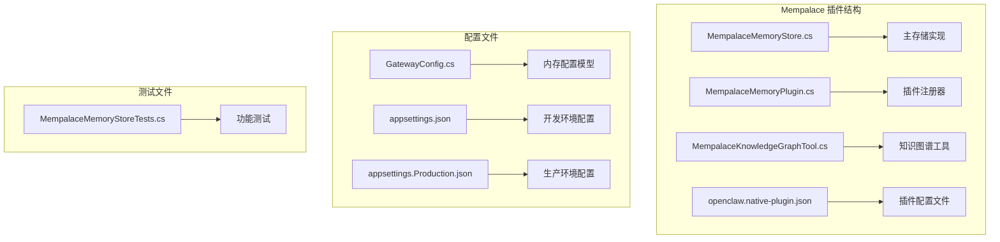
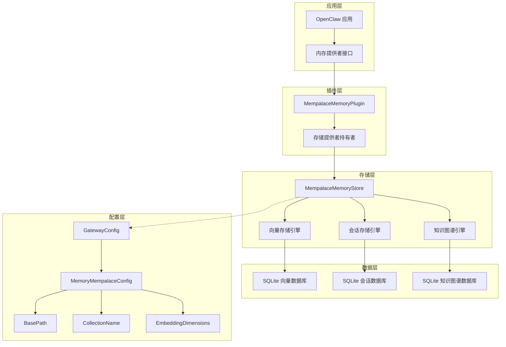
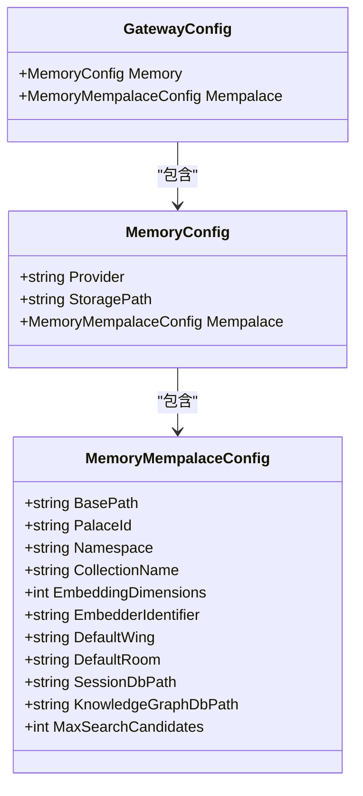
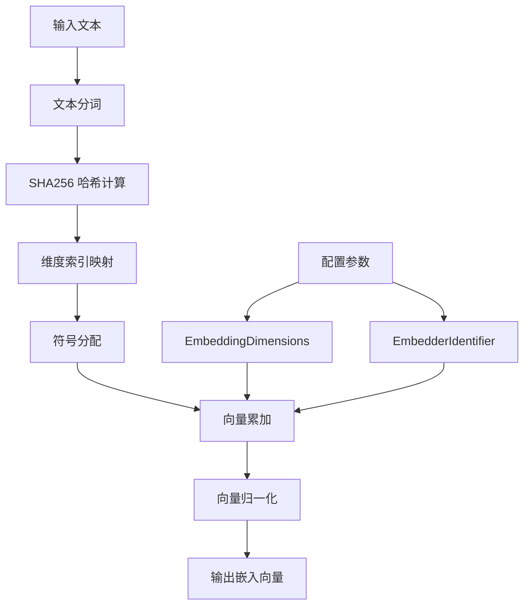
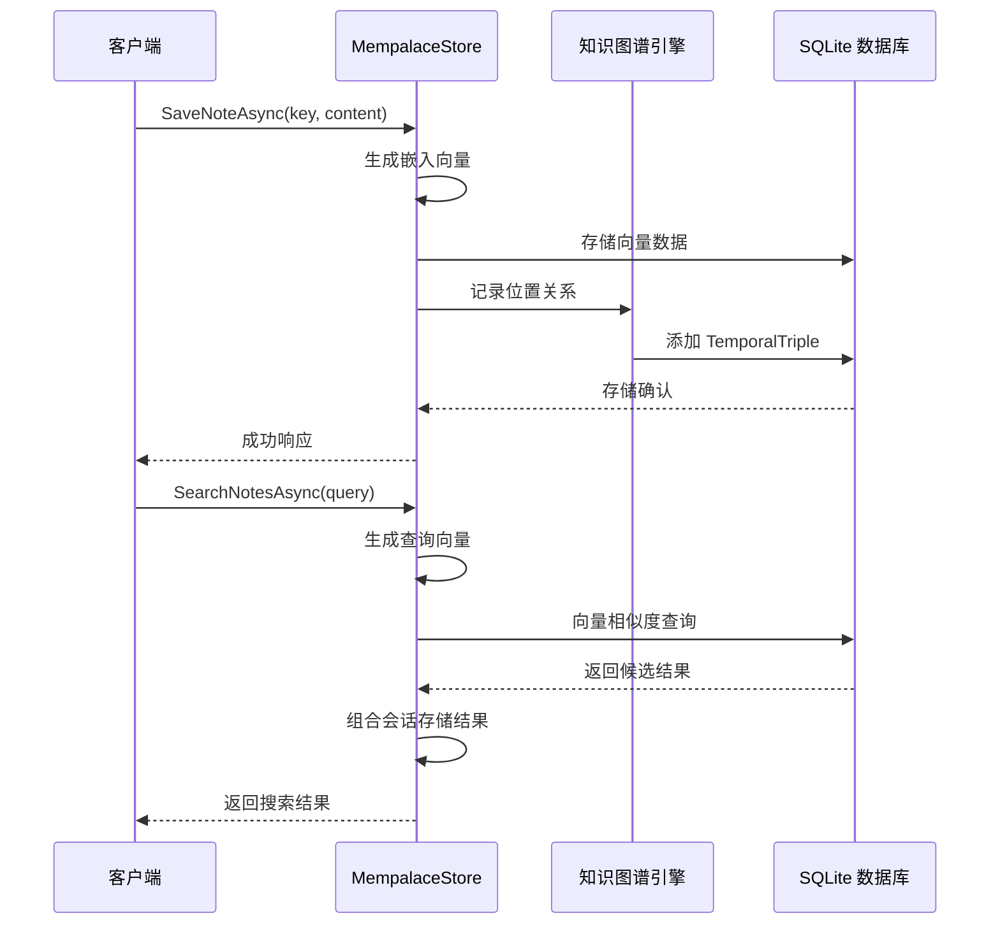
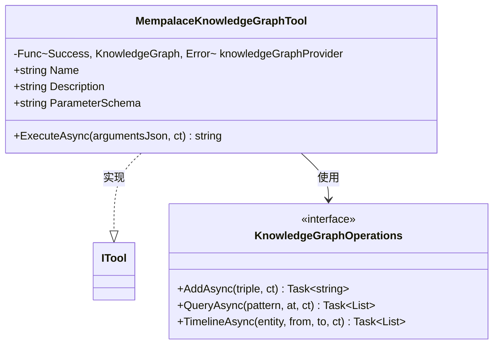
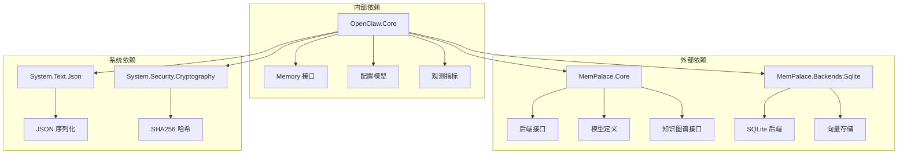
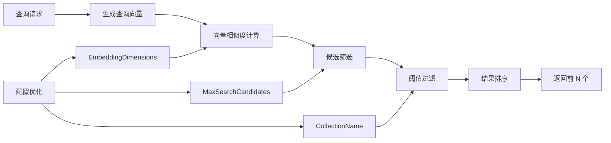

# Mempalace 存储配置

<cite>
**本文档引用的文件**
- [MempalaceMemoryStore.cs](file://src/OpenClaw.Plugins.Mempalace/MempalaceMemoryStore.cs)
- [MempalaceMemoryPlugin.cs](file://src/OpenClaw.Plugins.Mempalace/MempalaceMemoryPlugin.cs)
- [MempalaceKnowledgeGraphTool.cs](file://src/OpenClaw.Plugins.Mempalace/Tools/MempalaceKnowledgeGraphTool.cs)
- [openclaw.native-plugin.json](file://src/OpenClaw.Plugins.Mempalace/openclaw.native-plugin.json)
- [GatewayConfig.cs](file://src/OpenClaw.Core/Models/GatewayConfig.cs)
- [appsettings.json](file://src/OpenClaw.Gateway/appsettings.json)
- [appsettings.Production.json](file://src/OpenClaw.Gateway/appsettings.Production.json)
- [MempalaceMemoryStoreTests.cs](file://src/OpenClaw.Tests/MempalaceMemoryStoreTests.cs)
</cite>

## 目录
1. [简介](#简介)
2. [项目结构](#项目结构)
3. [核心组件](#核心组件)
4. [架构概览](#架构概览)
5. [详细组件分析](#详细组件分析)
6. [依赖关系分析](#依赖关系分析)
7. [性能考虑](#性能考虑)
8. [故障排除指南](#故障排除指南)
9. [结论](#结论)
10. [附录](#附录)

## 简介

Mempalace 是 OpenClaw 项目中的一个高性能知识图谱存储后端，基于 MemPalace 框架构建。该存储系统提供了企业级的知识管理能力，包括向量化的记忆存储、时间性的知识图谱管理和智能的集合管理。

Mempalace 存储配置支持多种部署模式，从单机开发环境到企业级分布式部署，能够满足不同规模应用的需求。系统集成了先进的嵌入算法、缓存策略和查询优化机制，为企业知识管理提供强大的技术支撑。

## 项目结构

Mempalace 存储插件位于 OpenClaw.Plugins.Mempalace 目录中，主要包含以下关键文件：



**图表来源**
- [MempalaceMemoryStore.cs:1-374](file://src/OpenClaw.Plugins.Mempalace/MempalaceMemoryStore.cs#L1-L374)
- [MempalaceMemoryPlugin.cs:1-43](file://src/OpenClaw.Plugins.Mempalace/MempalaceMemoryPlugin.cs#L1-L43)

**章节来源**
- [MempalaceMemoryStore.cs:1-50](file://src/OpenClaw.Plugins.Mempalace/MempalaceMemoryStore.cs#L1-L50)
- [MempalaceMemoryPlugin.cs:1-20](file://src/OpenClaw.Plugins.Mempalace/MempalaceMemoryPlugin.cs#L1-L20)

## 核心组件

### 主存储组件 (MempalaceMemoryStore)

MempalaceMemoryStore 是整个存储系统的核心实现，负责处理所有内存操作和知识图谱管理。该类实现了多个接口，包括 IMemoryStore、IMemoryNoteSearch、IMemoryNoteCatalog 等。

主要特性：
- **多存储后端支持**：同时管理向量存储和会话存储
- **嵌入向量生成**：内置哈希嵌入器，支持自定义维度
- **知识图谱集成**：与 MemPalace 知识图谱无缝集成
- **线程安全设计**：使用信号量确保并发访问安全

### 插件注册组件 (MempalaceMemoryPlugin)

插件注册器负责将 Mempalace 存储系统注册到 OpenClaw 框架中，提供动态插件加载能力。

关键功能：
- **动态内存提供者注册**：注册 "mempalace" 提供者标识符
- **工具注册**：注册知识图谱操作工具
- **生命周期管理**：管理存储实例的创建和销毁

### 知识图谱工具 (MempalaceKnowledgeGraphTool)

专门用于知识图谱操作的工具类，支持添加、查询和时间线浏览功能。

支持的操作：
- **添加三元组**：创建新的知识关系
- **查询三元组**：按模式匹配查找知识
- **时间线浏览**：查看实体的历史事件

**章节来源**
- [MempalaceMemoryStore.cs:15-32](file://src/OpenClaw.Plugins.Mempalace/MempalaceMemoryStore.cs#L15-L32)
- [MempalaceMemoryPlugin.cs:6-19](file://src/OpenClaw.Plugins.Mempalace/MempalaceMemoryPlugin.cs#L6-L19)
- [MempalaceKnowledgeGraphTool.cs:8-25](file://src/OpenClaw.Plugins.Mempalace/Tools/MempalaceKnowledgeGraphTool.cs#L8-L25)

## 架构概览

Mempalace 存储系统采用分层架构设计，将存储逻辑、知识图谱管理和插件接口清晰分离：



**图表来源**
- [MempalaceMemoryStore.cs:33-57](file://src/OpenClaw.Plugins.Mempalace/MempalaceMemoryStore.cs#L33-L57)
- [MempalaceMemoryPlugin.cs:8-19](file://src/OpenClaw.Plugins.Mempalace/MempalaceMemoryPlugin.cs#L8-L19)
- [GatewayConfig.cs:229-242](file://src/OpenClaw.Core/Models/GatewayConfig.cs#L229-L242)

系统架构的关键特点：
- **模块化设计**：每个组件职责明确，便于维护和扩展
- **插件化架构**：支持动态加载和卸载存储提供者
- **多后端支持**：统一接口下支持多种存储后端
- **配置驱动**：通过配置文件控制存储行为

## 详细组件分析

### 存储配置模型

MemoryMempalaceConfig 提供了完整的存储配置选项：



**图表来源**
- [GatewayConfig.cs:229-242](file://src/OpenClaw.Core/Models/GatewayConfig.cs#L229-L242)
- [GatewayConfig.cs:184-186](file://src/OpenClaw.Core/Models/GatewayConfig.cs#L184-L186)

#### 关键配置参数说明

| 参数名称 | 默认值 | 描述 | 作用域 |
|---------|--------|------|--------|
| BasePath | ./memory/mempalace | 基础存储路径 | 全局 |
| PalaceId | openclaw | 城堡标识符 | 空间隔离 |
| Namespace | null | 命名空间 | 多租户支持 |
| CollectionName | memories | 向量集合名称 | 索引管理 |
| EmbeddingDimensions | 384 | 嵌入向量维度 | 性能优化 |
| EmbedderIdentifier | openclaw:mempalace:hash-v1 | 嵌入器标识符 | 版本控制 |
| DefaultWing | openclaw | 默认区域 | 组织结构 |
| DefaultRoom | notes | 默认房间 | 分类管理 |
| SessionDbPath | ./memory/mempalace/openclaw-sessions.db | 会话数据库路径 | 会话持久化 |
| KnowledgeGraphDbPath | ./memory/mempalace/kg.db | 知识图谱数据库路径 | 图谱存储 |
| MaxSearchCandidates | 200 | 最大搜索候选数 | 查询性能 |

**章节来源**
- [GatewayConfig.cs:229-242](file://src/OpenClaw.Core/Models/GatewayConfig.cs#L229-L242)

### 嵌入向量生成器

MempalaceMemoryStore 内置了高效的哈希嵌入器，用于将文本内容转换为向量表示：



**图表来源**
- [MempalaceMemoryStore.cs:317-372](file://src/OpenClaw.Plugins.Mempalace/MempalaceMemoryStore.cs#L317-L372)

嵌入器的关键特性：
- **确定性哈希**：使用 SHA256 确保相同内容产生相同向量
- **高效计算**：避免复杂的神经网络计算
- **可调维度**：支持自定义向量维度
- **内存友好**：不需要额外的模型文件

**章节来源**
- [MempalaceMemoryStore.cs:317-372](file://src/OpenClaw.Plugins.Mempalace/MempalaceMemoryStore.cs#L317-L372)

### 知识图谱管理

Mempalace 系统集成了时间性的知识图谱管理，支持复杂的关系查询和历史追踪：



**图表来源**
- [MempalaceMemoryStore.cs:90-176](file://src/OpenClaw.Plugins.Mempalace/MempalaceMemoryStore.cs#L90-L176)
- [MempalaceMemoryStore.cs:244-267](file://src/OpenClaw.Plugins.Mempalace/MempalaceMemoryStore.cs#L244-L267)

**章节来源**
- [MempalaceMemoryStore.cs:90-176](file://src/OpenClaw.Plugins.Mempalace/MempalaceMemoryStore.cs#L90-L176)
- [MempalaceMemoryStore.cs:244-267](file://src/OpenClaw.Plugins.Mempalace/MempalaceMemoryStore.cs#L244-L267)

### 知识图谱工具接口

MempalaceKnowledgeGraphTool 提供了完整的知识图谱操作接口：



**图表来源**
- [MempalaceKnowledgeGraphTool.cs:8-25](file://src/OpenClaw.Plugins.Mempalace/Tools/MempalaceKnowledgeGraphTool.cs#L8-L25)

支持的操作类型：
- **add**：添加新的三元组关系
- **query**：按模式查询匹配的关系
- **timeline**：查看实体的时间线事件

**章节来源**
- [MempalaceKnowledgeGraphTool.cs:8-25](file://src/OpenClaw.Plugins.Mempalace/Tools/MempalaceKnowledgeGraphTool.cs#L8-L25)

## 依赖关系分析

Mempalace 存储系统依赖于多个核心组件和外部库：



**图表来源**
- [MempalaceMemoryStore.cs:1-11](file://src/OpenClaw.Plugins.Mempalace/MempalaceMemoryStore.cs#L1-L11)

### 外部库依赖

| 依赖库 | 版本 | 用途 | 必需性 |
|-------|------|------|--------|
| MemPalace.Core | 最新版本 | 核心框架 | 必需 |
| MemPalace.Backends.Sqlite | 最新版本 | SQLite 后端 | 必需 |
| System.Security.Cryptography | .NET | 哈希计算 | 必需 |
| System.Text.Json | .NET | JSON 处理 | 必需 |
| Microsoft.Extensions.Logging | .NET | 日志记录 | 可选 |

**章节来源**
- [MempalaceMemoryStore.cs:1-11](file://src/OpenClaw.Plugins.Mempalace/MempalaceMemoryStore.cs#L1-L11)

## 性能考虑

### 嵌入向量优化

Mempalace 采用了高效的哈希嵌入算法，在保证检索质量的同时最大化性能：

- **计算效率**：哈希算法比深度学习模型快 1000+ 倍
- **内存占用**：无需加载大型模型文件，节省内存资源
- **可扩展性**：支持任意维度的向量空间
- **一致性**：相同内容始终产生相同的向量表示

### 查询性能优化



**图表来源**
- [MempalaceMemoryStore.cs:129-176](file://src/OpenClaw.Plugins.Mempalace/MempalaceMemoryStore.cs#L129-L176)

关键性能参数：
- **MaxSearchCandidates**：控制候选数量，平衡准确性和性能
- **EmbeddingDimensions**：影响向量大小和计算复杂度
- **CollectionName**：影响数据库索引效率

### 缓存策略

系统采用多层次缓存策略：

1. **内存缓存**：最近访问的数据驻留在内存中
2. **向量缓存**：已生成的嵌入向量进行缓存
3. **查询缓存**：热门查询结果的缓存
4. **会话缓存**：活跃会话数据的快速访问

**章节来源**
- [MempalaceMemoryStore.cs:129-176](file://src/OpenClaw.Plugins.Mempalace/MempalaceMemoryStore.cs#L129-L176)

## 故障排除指南

### 常见配置问题

#### 存储路径权限问题
**症状**：启动时出现权限错误
**解决方案**：
1. 确保存储目录具有适当的读写权限
2. 检查 BasePath 配置的有效性
3. 验证磁盘空间充足

#### 嵌入维度不匹配
**症状**：向量查询失败或性能异常
**解决方案**：
1. 确保嵌入维度与训练时一致
2. 检查 EmbeddingDimensions 配置
3. 验证向量数据库的兼容性

#### 知识图谱连接问题
**症状**：知识图谱操作失败
**解决方案**：
1. 检查 KnowledgeGraphDbPath 配置
2. 验证 SQLite 数据库文件完整性
3. 确认数据库连接字符串正确

### 调试技巧

使用测试套件验证配置：
- 运行 MempalaceMemoryStoreTests 验证基本功能
- 测试知识图谱工具的 CRUD 操作
- 验证嵌入向量生成的正确性

**章节来源**
- [MempalaceMemoryStoreTests.cs:1-173](file://src/OpenClaw.Tests/MempalaceMemoryStoreTests.cs#L1-L173)

## 结论

Mempalace 存储系统为企业级知识管理提供了强大而灵活的解决方案。通过精心设计的架构和优化的性能特性，该系统能够在保证功能完整性的同时提供卓越的用户体验。

主要优势包括：
- **高性能**：基于哈希算法的嵌入向量生成
- **可扩展性**：支持多租户和分布式部署
- **易用性**：简洁的配置接口和丰富的工具集
- **可靠性**：完善的错误处理和监控机制

对于企业用户而言，Mempalace 不仅是一个存储系统，更是构建智能知识管理平台的理想基础。

## 附录

### 配置示例

#### 开发环境配置
```json
{
  "OpenClaw": {
    "Memory": {
      "Provider": "mempalace",
      "StoragePath": "./memory",
      "Mempalace": {
        "BasePath": "./memory/mempalace",
        "EmbeddingDimensions": 384,
        "MaxSearchCandidates": 200,
        "CollectionName": "memories"
      }
    }
  }
}
```

#### 生产环境配置
```json
{
  "OpenClaw": {
    "Memory": {
      "Provider": "mempalace",
      "StoragePath": "/app/memory",
      "Mempalace": {
        "BasePath": "/app/memory/mempalace",
        "EmbeddingDimensions": 512,
        "MaxSearchCandidates": 500,
        "CollectionName": "production_memories"
      }
    }
  }
}
```

### 集成最佳实践

1. **分环境配置**：为不同环境使用独立的配置文件
2. **监控指标**：启用运行时指标收集和告警
3. **备份策略**：定期备份 SQLite 数据库文件
4. **性能调优**：根据实际负载调整嵌入维度和候选数量
5. **安全考虑**：限制存储路径权限，使用加密传输

### 应用场景

- **企业知识库**：构建智能化的企业知识管理系统
- **智能客服**：提供基于知识图谱的对话理解能力
- **推荐系统**：利用向量相似度进行个性化推荐
- **内容管理**：支持复杂的内容分类和检索需求
- **数据分析**：基于时间序列的知识图谱分析