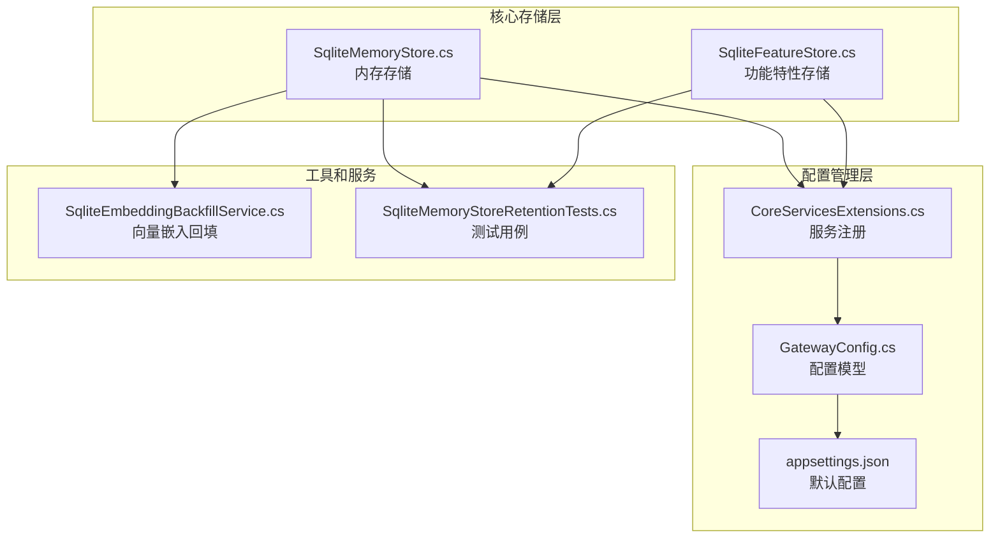
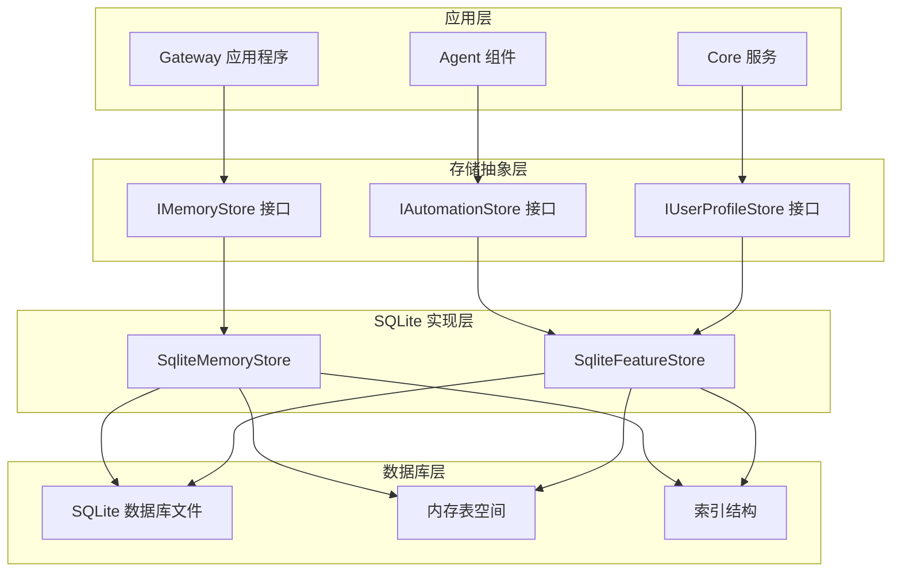
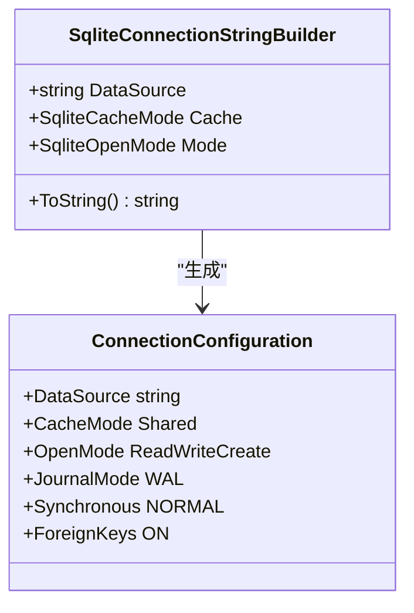
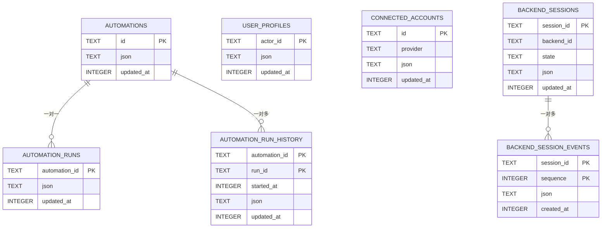
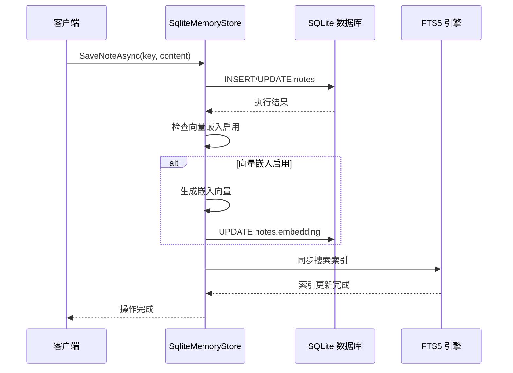
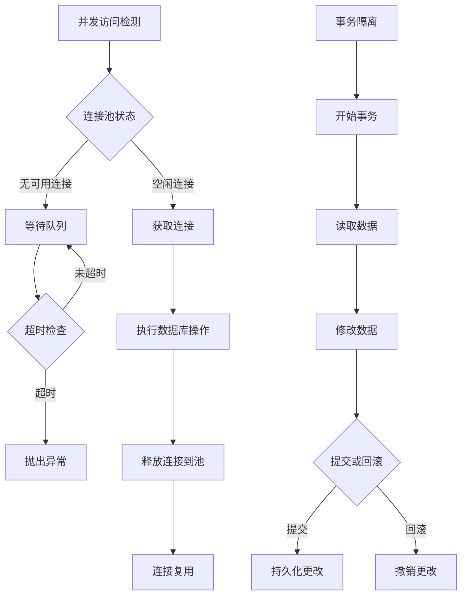
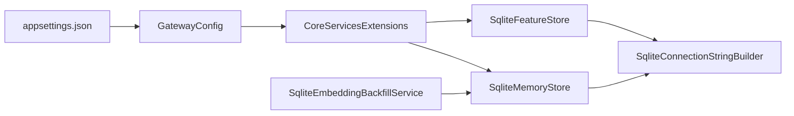
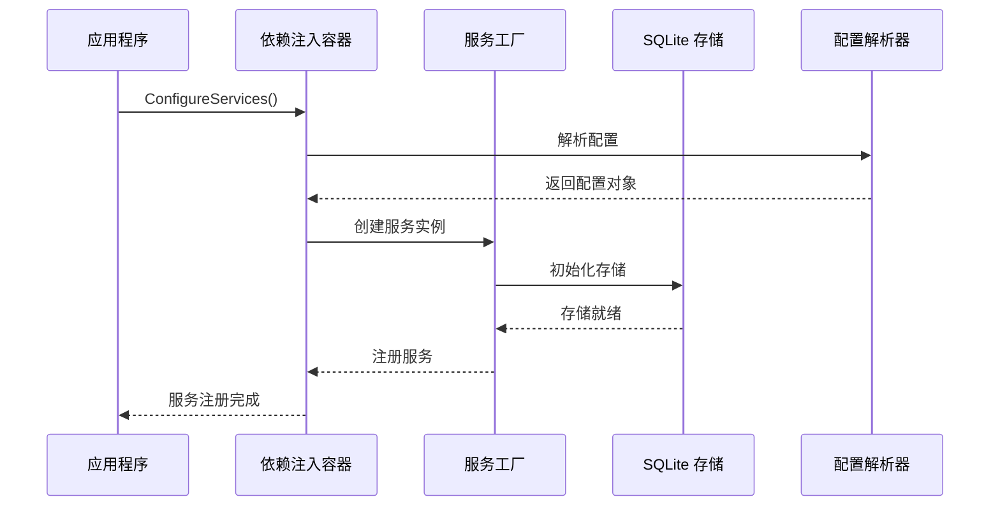
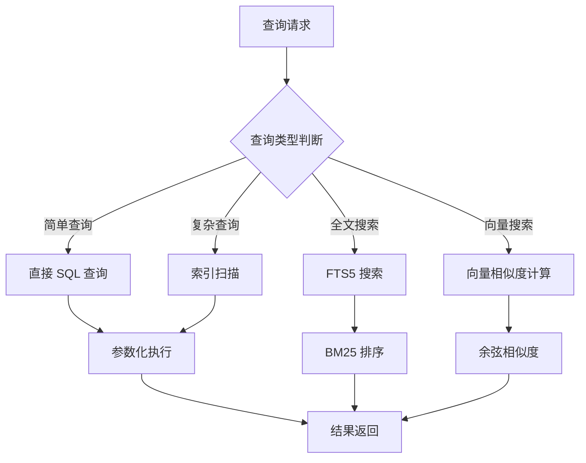

# SQLite 存储配置

<cite>
**本文档引用的文件**
- [SqliteFeatureStore.cs](file://src/OpenClaw.Core/Features/SqliteFeatureStore.cs)
- [SqliteMemoryStore.cs](file://src/OpenClaw.Core/Memory/SqliteMemoryStore.cs)
- [CoreServicesExtensions.cs](file://src/OpenClaw.Gateway/Composition/CoreServicesExtensions.cs)
- [GatewayConfig.cs](file://src/OpenClaw.Core/Models/GatewayConfig.cs)
- [SqliteEmbeddingBackfillService.cs](file://src/OpenClaw.Gateway/Composition/SqliteEmbeddingBackfillService.cs)
- [appsettings.json](file://src/OpenClaw.Gateway/appsettings.json)
- [SqliteMemoryStoreRetentionTests.cs](file://src/OpenClaw.Tests/SqliteMemoryStoreRetentionTests.cs)
</cite>

## 目录
1. [简介](#简介)
2. [项目结构](#项目结构)
3. [核心组件](#核心组件)
4. [架构概览](#架构概览)
5. [详细组件分析](#详细组件分析)
6. [依赖关系分析](#依赖关系分析)
7. [性能考虑](#性能考虑)
8. [故障排除指南](#故障排除指南)
9. [结论](#结论)

## 简介

本文档详细介绍了 OpenClaw 项目中 SQLite 存储配置的技术规范和最佳实践。该系统提供了两种主要的 SQLite 存储实现：功能特性存储（SqliteFeatureStore）用于持久化自动化、用户配置文件、学习提案等核心业务数据；内存存储（SqliteMemoryStore）用于会话管理、记忆笔记和分支管理。

系统采用 Microsoft.Data.Sqlite 提供程序，支持 AOT（Ahead-of-Time）编译，适用于多种部署场景。SQLite 配置包括连接字符串参数、表结构设计、索引优化、查询性能调优、事务管理和并发控制机制。

## 项目结构

OpenClaw 项目中的 SQLite 存储相关文件组织结构如下：



**图表来源**
- [SqliteFeatureStore.cs:1-50](file://src/OpenClaw.Core/Features/SqliteFeatureStore.cs#L1-L50)
- [SqliteMemoryStore.cs:1-50](file://src/OpenClaw.Core/Memory/SqliteMemoryStore.cs#L1-L50)
- [CoreServicesExtensions.cs:251-293](file://src/OpenClaw.Gateway/Composition/CoreServicesExtensions.cs#L251-L293)

**章节来源**
- [SqliteFeatureStore.cs:1-100](file://src/OpenClaw.Core/Features/SqliteFeatureStore.cs#L1-L100)
- [SqliteMemoryStore.cs:1-100](file://src/OpenClaw.Core/Memory/SqliteMemoryStore.cs#L1-L100)
- [CoreServicesExtensions.cs:251-293](file://src/OpenClaw.Gateway/Composition/CoreServicesExtensions.cs#L251-L293)

## 核心组件

### SqliteFeatureStore - 功能特性存储

SqliteFeatureStore 是一个专门设计的 SQLite 存储实现，用于处理以下核心业务数据：

**主要功能表结构：**
- `automations`: 存储自动化定义和状态
- `automation_runs`: 存储自动化运行状态
- `automation_run_history`: 存储自动化运行历史记录
- `user_profiles`: 存储用户配置文件
- `connected_accounts`: 存储已连接的账户信息
- `backend_sessions`: 存储后端会话状态
- `backend_session_events`: 存储后端会话事件

**连接字符串配置：**
```csharp
private string ConnectionString => new SqliteConnectionStringBuilder
{
    DataSource = _dbPath,
    Cache = SqliteCacheMode.Shared,
    Mode = SqliteOpenMode.ReadWriteCreate
}.ToString();
```

**索引优化：**
- `idx_learning_status`: 学习提案状态查询优化
- `idx_automation_run_history_lookup`: 自动化运行历史查询优化
- `idx_connected_accounts_provider`: 连接账户查询优化
- `idx_backend_sessions_backend`: 后端会话查询优化
- `idx_backend_session_events_lookup`: 会话事件查询优化

**章节来源**
- [SqliteFeatureStore.cs:33-98](file://src/OpenClaw.Core/Features/SqliteFeatureStore.cs#L33-L98)
- [SqliteFeatureStore.cs:21-26](file://src/OpenClaw.Core/Features/SqliteFeatureStore.cs#L21-L26)

### SqliteMemoryStore - 内存存储

SqliteMemoryStore 提供了更复杂的存储功能，包括：

**核心表结构：**
- `sessions`: 会话数据存储
- `notes`: 记忆笔记存储
- `branches`: 会话分支存储

**高级功能：**
- FTS5 全文搜索引擎集成
- 向量嵌入支持（可选）
- 会话搜索索引同步
- 数据保留和清理机制

**初始化配置：**
```csharp
PRAGMA journal_mode=WAL;
PRAGMA synchronous=NORMAL;
PRAGMA foreign_keys=ON;
```

**章节来源**
- [SqliteMemoryStore.cs:59-88](file://src/OpenClaw.Core/Memory/SqliteMemoryStore.cs#L59-L88)
- [SqliteMemoryStore.cs:47-52](file://src/OpenClaw.Core/Memory/SqliteMemoryStore.cs#L47-L52)

## 架构概览

OpenClaw 的 SQLite 存储架构采用分层设计，确保了良好的模块化和可维护性：



**图表来源**
- [CoreServicesExtensions.cs:93-118](file://src/OpenClaw.Gateway/Composition/CoreServicesExtensions.cs#L93-L118)
- [SqliteFeatureStore.cs:8-10](file://src/OpenClaw.Core/Features/SqliteFeatureStore.cs#L8-L10)
- [SqliteMemoryStore.cs:12-12](file://src/OpenClaw.Core/Memory/SqliteMemoryStore.cs#L12-L12)

**章节来源**
- [CoreServicesExtensions.cs:93-118](file://src/OpenClaw.Gateway/Composition/CoreServicesExtensions.cs#L93-L118)
- [CoreServicesExtensions.cs:262-279](file://src/OpenClaw.Gateway/Composition/CoreServicesExtensions.cs#L262-L279)

## 详细组件分析

### 连接字符串和数据库设置

SQLite 连接配置采用了优化的参数组合：



**图表来源**
- [SqliteFeatureStore.cs:21-26](file://src/OpenClaw.Core/Features/SqliteFeatureStore.cs#L21-L26)
- [SqliteMemoryStore.cs:47-52](file://src/OpenClaw.Core/Memory/SqliteMemoryStore.cs#L47-L52)

**配置参数说明：**

1. **缓存模式 (CacheMode.Shared)**: 允许多个连接共享缓存，提高并发性能
2. **打开模式 (SqliteOpenMode.ReadWriteCreate)**: 支持读写操作和自动创建数据库
3. **WAL 模式**: 使用预写日志（Write-Ahead Logging）提高并发读取性能
4. **同步级别**: NORMAL 级别在性能和安全性之间取得平衡
5. **外键约束**: 启用外键检查确保数据完整性

**章节来源**
- [SqliteFeatureStore.cs:21-26](file://src/OpenClaw.Core/Features/SqliteFeatureStore.cs#L21-L26)
- [SqliteMemoryStore.cs:62-64](file://src/OpenClaw.Core/Memory/SqliteMemoryStore.cs#L62-L64)

### 表结构设计和索引配置

系统采用规范化设计，确保数据一致性和查询效率：



**图表来源**
- [SqliteFeatureStore.cs:34-82](file://src/OpenClaw.Core/Features/SqliteFeatureStore.cs#L34-L82)

**索引优化策略：**

1. **复合索引**: 对于经常查询的字段组合建立复合索引
2. **前缀索引**: 优化 LIKE 查询模式
3. **时间戳索引**: 支持按时间排序的查询
4. **全文搜索索引**: FTS5 支持高效的文本搜索

**章节来源**
- [SqliteFeatureStore.cs:92-96](file://src/OpenClaw.Core/Features/SqliteFeatureStore.cs#L92-L96)

### 查询优化和事务管理

系统实现了多种查询优化技术和事务管理策略：



**图表来源**
- [SqliteMemoryStore.cs:237-282](file://src/OpenClaw.Core/Memory/SqliteMemoryStore.cs#L237-L282)
- [SqliteMemoryStore.cs:1343-1379](file://src/OpenClaw.Core/Memory/SqliteMemoryStore.cs#L1343-L1379)

**事务管理特性：**

1. **批量删除事务**: 使用事务批量删除多个记录，确保原子性
2. **索引同步事务**: 会话删除时同步删除对应的 FTS 索引
3. **向量回填事务**: 嵌入向量生成使用事务保证一致性
4. **保留策略事务**: 清理过期数据时使用事务确保数据完整性

**章节来源**
- [SqliteMemoryStore.cs:995-1009](file://src/OpenClaw.Core/Memory/SqliteMemoryStore.cs#L995-L1009)
- [SqliteMemoryStore.cs:1353-1379](file://src/OpenClaw.Core/Memory/SqliteMemoryStore.cs#L1353-L1379)

### 并发控制机制

系统采用多种并发控制机制确保数据一致性和性能：



**图表来源**
- [SqliteMemoryStore.cs:1104-1109](file://src/OpenClaw.Core/Memory/SqliteMemoryStore.cs#L1104-L1109)

**并发控制策略：**

1. **连接池管理**: 使用共享缓存模式优化连接复用
2. **WAL 模式**: 支持多读单写的并发访问模式
3. **事务边界**: 明确的事务开始和结束点
4. **批量操作**: 减少事务开销的批量处理

**章节来源**
- [SqliteMemoryStore.cs:1104-1109](file://src/OpenClaw.Core/Memory/SqliteMemoryStore.cs#L1104-L1109)

## 依赖关系分析

### 配置依赖关系



**图表来源**
- [CoreServicesExtensions.cs:281-293](file://src/OpenClaw.Gateway/Composition/CoreServicesExtensions.cs#L281-L293)
- [GatewayConfig.cs:216-227](file://src/OpenClaw.Core/Models/GatewayConfig.cs#L216-L227)

**配置层次结构：**

1. **应用配置**: 通过 appsettings.json 提供默认值
2. **运行时配置**: CoreServicesExtensions 解析和验证配置
3. **存储配置**: Sqlite 存储组件使用最终配置
4. **服务配置**: SqliteEmbeddingBackfillService 处理向量嵌入

**章节来源**
- [CoreServicesExtensions.cs:281-293](file://src/OpenClaw.Gateway/Composition/CoreServicesExtensions.cs#L281-L293)
- [appsettings.json:49-81](file://src/OpenClaw.Gateway/appsettings.json#L49-L81)

### 服务注册和生命周期

系统采用依赖注入模式管理 SQLite 存储服务：



**图表来源**
- [CoreServicesExtensions.cs:262-279](file://src/OpenClaw.Gateway/Composition/CoreServicesExtensions.cs#L262-L279)

**章节来源**
- [CoreServicesExtensions.cs:262-279](file://src/OpenClaw.Gateway/Composition/CoreServicesExtensions.cs#L262-L279)

## 性能考虑

### SQLite 性能调优参数

系统采用了多项性能优化措施：

**存储引擎优化：**
- **WAL 模式**: 提高并发读取性能，减少锁竞争
- **NORMAL 同步**: 在性能和数据安全间平衡
- **共享缓存**: 连接池复用，减少连接开销

**查询性能优化：**
- **索引策略**: 针对常见查询模式建立优化索引
- **参数化查询**: 防止 SQL 注入，提高查询计划重用率
- **批量操作**: 减少网络往返次数

**内存管理：**
- **连接池**: 重用数据库连接，降低分配开销
- **向量数据**: 可选的二进制向量存储优化

### 查询优化策略



**图表来源**
- [SqliteMemoryStore.cs:330-415](file://src/OpenClaw.Core/Memory/SqliteMemoryStore.cs#L330-L415)

**性能监控指标：**
- 查询响应时间
- 连接池利用率
- 索引命中率
- 内存使用情况

**章节来源**
- [SqliteMemoryStore.cs:330-415](file://src/OpenClaw.Core/Memory/SqliteMemoryStore.cs#L330-L415)
- [SqliteMemoryStore.cs:1026-1041](file://src/OpenClaw.Core/Memory/SqliteMemoryStore.cs#L1026-L1041)

## 故障排除指南

### 常见问题和解决方案

**数据库连接问题：**
- **问题**: 连接字符串格式错误
- **解决方案**: 检查 DataSource 路径和权限
- **预防**: 使用 ResolveSqliteDbPath 方法解析路径

**性能问题：**
- **问题**: 查询响应缓慢
- **解决方案**: 检查索引使用情况，优化查询语句
- **预防**: 定期分析查询计划

**数据一致性问题：**
- **问题**: 并发访问导致的数据不一致
- **解决方案**: 检查事务边界和锁机制
- **预防**: 使用适当的事务隔离级别

**内存泄漏问题：**
- **问题**: 连接池耗尽
- **解决方案**: 确保正确释放数据库连接
- **预防**: 实施连接池清理机制

**章节来源**
- [SqliteMemoryStore.cs:170-178](file://src/OpenClaw.Core/Memory/SqliteMemoryStore.cs#L170-L178)
- [SqliteMemoryStore.cs:609-612](file://src/OpenClaw.Core/Memory/SqliteMemoryStore.cs#L609-L612)

### 测试和验证

系统包含全面的测试用例验证 SQLite 存储功能：

**测试覆盖范围：**
- 数据保留和清理功能
- 并发访问处理
- 错误情况处理
- 性能基准测试

**章节来源**
- [SqliteMemoryStoreRetentionTests.cs:10-77](file://src/OpenClaw.Tests/SqliteMemoryStoreRetentionTests.cs#L10-L77)

## 结论

OpenClaw 项目的 SQLite 存储配置展现了现代数据库设计的最佳实践。通过合理的表结构设计、索引优化、事务管理和并发控制，系统在保证数据一致性的同时实现了优异的性能表现。

**关键优势：**
1. **模块化设计**: 清晰的抽象层分离，便于维护和扩展
2. **性能优化**: WAL 模式、索引策略和批量操作提升性能
3. **可靠性**: 事务管理和错误处理确保数据完整性
4. **可配置性**: 灵活的配置选项适应不同部署需求

**适用场景：**
- 开发和测试环境
- 小规模生产部署
- 边缘计算场景
- 单机应用程序

通过遵循本文档的配置指南和最佳实践，开发者可以充分利用 SQLite 的优势，在各种环境中构建高性能、可靠的存储解决方案。