# 存储后端配置

<cite>
**本文档引用的文件**
- [GatewayConfig.cs](file://src/OpenClaw.Core/Models/GatewayConfig.cs)
- [CoreServicesExtensions.cs](file://src/OpenClaw.Gateway/Composition/CoreServicesExtensions.cs)
- [FileMemoryStore.cs](file://src/OpenClaw.Core/Memory/FileMemoryStore.cs)
- [SqliteMemoryStore.cs](file://src/OpenClaw.Core/Memory/SqliteMemoryStore.cs)
- [MempalaceMemoryStore.cs](file://src/OpenClaw.Plugins.Mempalace/MempalaceMemoryStore.cs)
- [MempalaceMemoryPlugin.cs](file://src/OpenClaw.Plugins.Mempalace/MempalaceMemoryPlugin.cs)
- [appsettings.json](file://src/OpenClaw.Gateway/appsettings.json)
- [openclaw-memory-recall-and-retention.md](file://docs/openclaw-memory-recall-and-retention.md)
</cite>

## 目录
1. [简介](#简介)
2. [项目结构](#项目结构)
3. [核心组件](#核心组件)
4. [架构概览](#架构概览)
5. [详细组件分析](#详细组件分析)
6. [依赖关系分析](#依赖关系分析)
7. [性能考虑](#性能考虑)
8. [故障排除指南](#故障排除指南)
9. [结论](#结论)
10. [附录](#附录)

## 简介

本文档详细介绍了OpenClaw系统中三种内存存储后端的配置选项和实现细节。系统支持三种存储后端：文件存储（file）、SQLite和Mempalace，每种都有其特定的配置参数、性能特征和适用场景。

存储后端是OpenClaw记忆管理的核心组件，负责持久化会话、笔记和分支数据。选择合适的存储后端对于系统的性能、可靠性和功能完整性至关重要。

## 项目结构

存储后端配置涉及以下关键文件和组件：

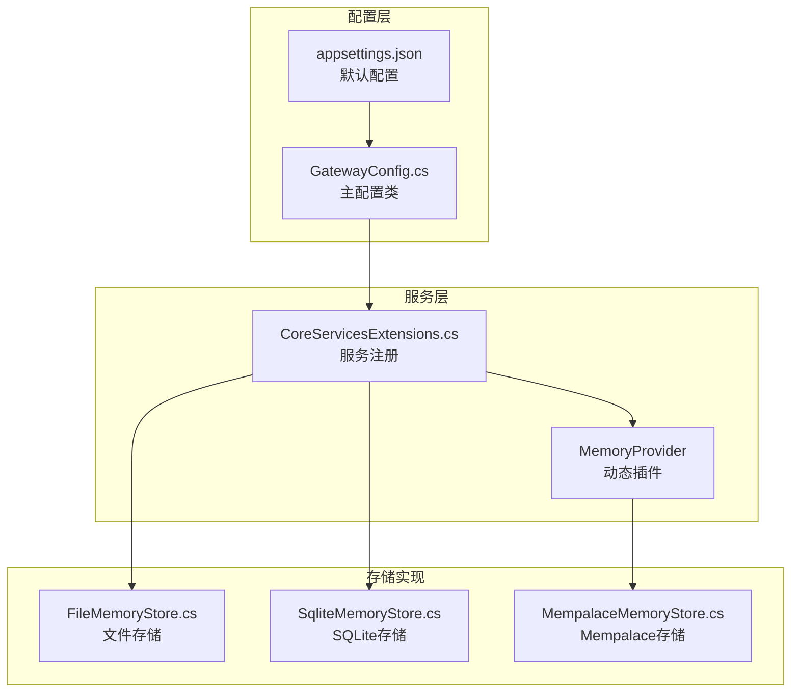

**图表来源**
- [GatewayConfig.cs:175-242](file://src/OpenClaw.Core/Models/GatewayConfig.cs#L175-L242)
- [CoreServicesExtensions.cs:295-331](file://src/OpenClaw.Gateway/Composition/CoreServicesExtensions.cs#L295-L331)

**章节来源**
- [GatewayConfig.cs:175-242](file://src/OpenClaw.Core/Models/GatewayConfig.cs#L175-L242)
- [CoreServicesExtensions.cs:38-49](file://src/OpenClaw.Gateway/Composition/CoreServicesExtensions.cs#L38-L49)

## 核心组件

### 存储后端配置架构

系统通过统一的配置架构支持三种存储后端：

| 组件 | 类型 | 主要职责 |
|------|------|----------|
| MemoryConfig | 配置类 | 主存储配置入口 |
| MemorySqliteConfig | 配置类 | SQLite专用配置 |
| MemoryMempalaceConfig | 配置类 | Mempalace专用配置 |
| IMemoryStore | 接口 | 存储抽象接口 |
| FileMemoryStore | 实现类 | 文件系统存储实现 |
| SqliteMemoryStore | 实现类 | SQLite数据库存储实现 |
| MempalaceMemoryStore | 实现类 | Mempalace知识图谱存储实现 |

### 配置参数总览

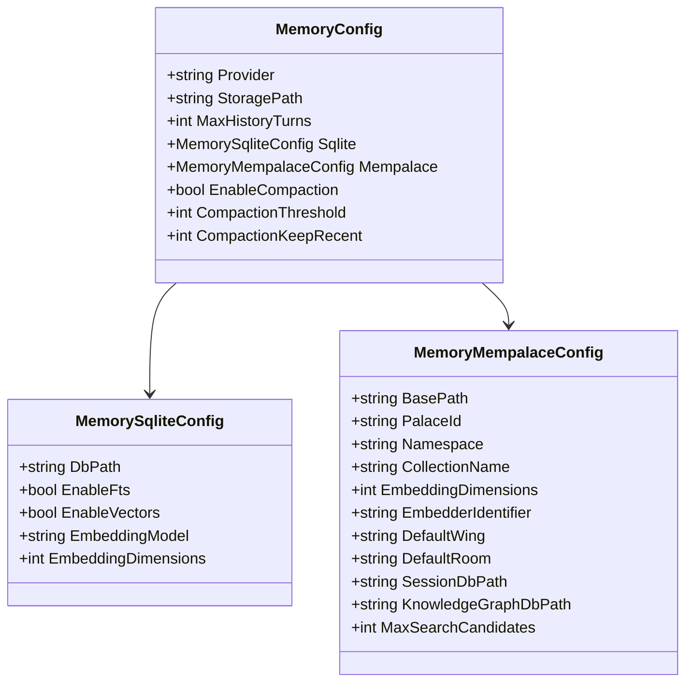

**图表来源**
- [GatewayConfig.cs:175-242](file://src/OpenClaw.Core/Models/GatewayConfig.cs#L175-L242)

**章节来源**
- [GatewayConfig.cs:175-242](file://src/OpenClaw.Core/Models/GatewayConfig.cs#L175-L242)

## 架构概览

### 存储后端选择流程

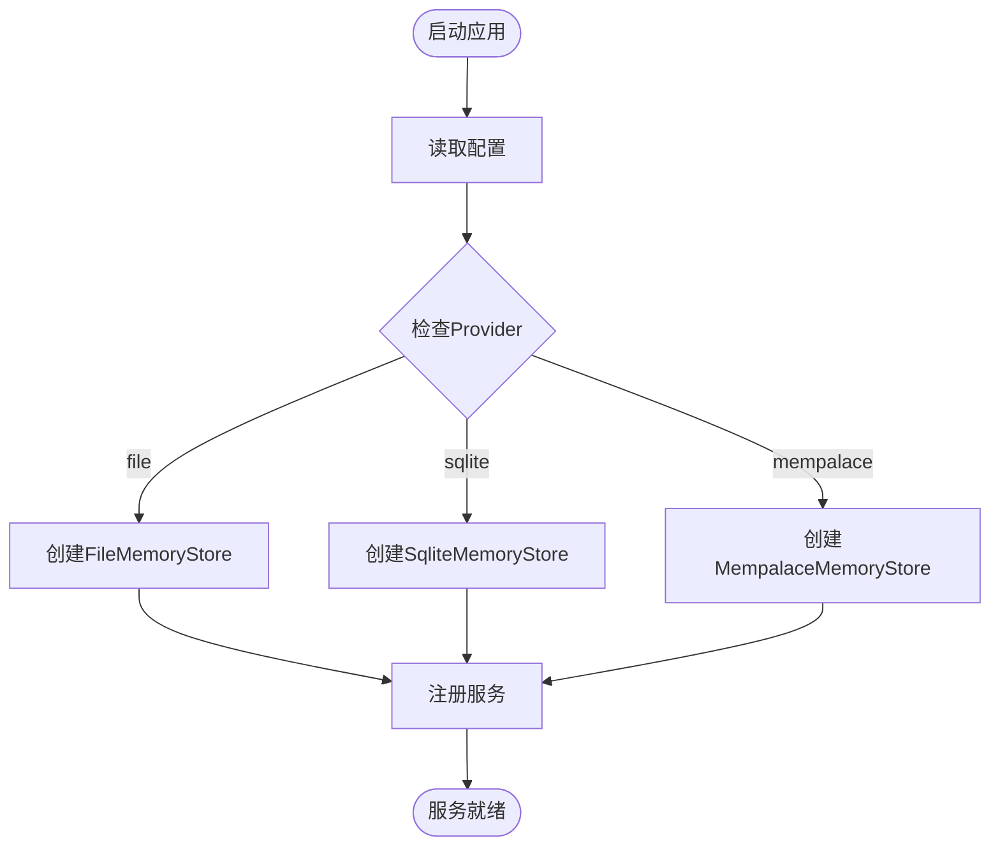

**图表来源**
- [CoreServicesExtensions.cs:295-331](file://src/OpenClaw.Gateway/Composition/CoreServicesExtensions.cs#L295-L331)

### 数据流架构

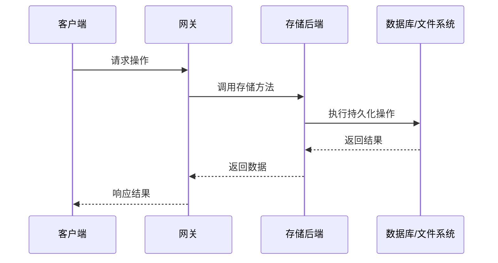

**图表来源**
- [CoreServicesExtensions.cs:93-100](file://src/OpenClaw.Gateway/Composition/CoreServicesExtensions.cs#L93-L100)

**章节来源**
- [CoreServicesExtensions.cs:295-331](file://src/OpenClaw.Gateway/Composition/CoreServicesExtensions.cs#L295-L331)

## 详细组件分析

### 文件存储后端（File）

文件存储后端是最简单的存储方案，适用于开发测试和小规模部署。

#### 配置参数

| 参数 | 默认值 | 描述 |
|------|--------|------|
| Provider | "file" | 存储后端类型标识 |
| StoragePath | "./memory" | 存储根目录路径 |
| MaxHistoryTurns | 50 | 历史记录最大数量 |
| MaxCachedSessions | null | 最大缓存会话数 |

#### 目录结构

文件存储后端在指定的存储路径下创建以下子目录：

```
memory/
├── sessions/     # 会话数据
├── notes/       # 笔记数据  
├── branches/    # 分支数据
├── audit/       # 审计日志
├── admin/       # 管理数据
└── retention/   # 保留策略数据
```

#### 安全特性

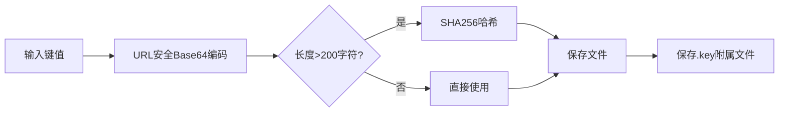

**图表来源**
- [FileMemoryStore.cs:300-326](file://src/OpenClaw.Core/Memory/FileMemoryStore.cs#L300-L326)

#### 可靠性设计

文件存储实现了多重可靠性保障：

1. **原子写入**：使用临时文件和原子重命名确保写入一致性
2. **损坏隔离**：损坏文件被重命名为带时间戳的备份文件
3. **LRU缓存**：内存中的会话缓存提高访问性能
4. **并发控制**：会话加载分段锁避免并发冲突

**章节来源**
- [FileMemoryStore.cs:27-76](file://src/OpenClaw.Core/Memory/FileMemoryStore.cs#L27-L76)
- [FileMemoryStore.cs:191-223](file://src/OpenClaw.Core/Memory/FileMemoryStore.cs#L191-L223)

### SQLite存储后端（SQLite）

SQLite存储后端提供了完整的数据库功能，适合生产环境使用。

#### 配置参数

| 参数 | 默认值 | 描述 |
|------|--------|------|
| DbPath | "./memory/openclaw.db" | 数据库文件路径 |
| EnableFts | true | 启用全文搜索 |
| EnableVectors | false | 启用向量搜索 |
| EmbeddingModel | null | 嵌入模型名称 |
| EmbeddingDimensions | 1536 | 嵌入向量维度 |

#### 数据库架构

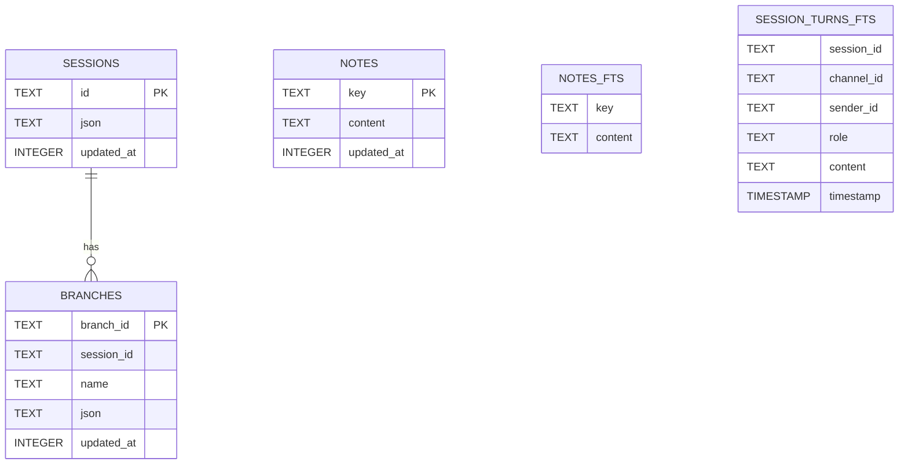

**图表来源**
- [SqliteMemoryStore.cs:66-84](file://src/OpenClaw.Core/Memory/SqliteMemoryStore.cs#L66-L84)
- [SqliteMemoryStore.cs:92-133](file://src/OpenClaw.Core/Memory/SqliteMemoryStore.cs#L92-L133)

#### 性能优化

SQLite存储实现了多项性能优化：

1. **WAL模式**：使用预写日志提升并发性能
2. **索引优化**：为常用查询字段建立索引
3. **FTS5集成**：全文搜索引擎提供快速文本检索
4. **向量搜索**：支持嵌入向量的相似度搜索

#### 搜索算法

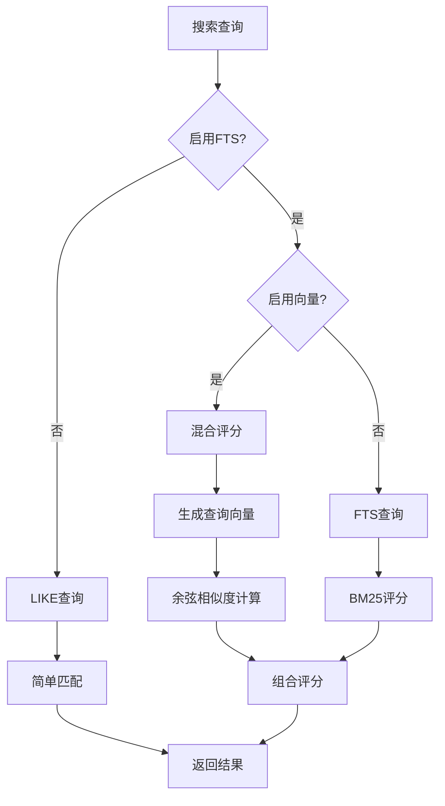

**图表来源**
- [SqliteMemoryStore.cs:319-490](file://src/OpenClaw.Core/Memory/SqliteMemoryStore.cs#L319-L490)

**章节来源**
- [SqliteMemoryStore.cs:54-148](file://src/OpenClaw.Core/Memory/SqliteMemoryStore.cs#L54-L148)
- [SqliteMemoryStore.cs:319-490](file://src/OpenClaw.Core/Memory/SqliteMemoryStore.cs#L319-L490)

### Mempalace存储后端（Mempalace）

Mempalace存储后端提供了高级的知识图谱和智能记忆管理功能。

#### 配置参数

| 参数 | 默认值 | 描述 |
|------|--------|------|
| BasePath | "./memory/mempalace" | 基础存储路径 |
| PalaceId | "openclaw" | 城堡标识符 |
| Namespace | null | 命名空间 |
| CollectionName | "memories" | 集合名称 |
| EmbeddingDimensions | 384 | 嵌入向量维度 |
| EmbedderIdentifier | "openclaw:mempalace:hash-v1" | 嵌入器标识符 |
| DefaultWing | "openclaw" | 默认区域 |
| DefaultRoom | "notes" | 默认房间 |
| SessionDbPath | "./memory/mempalace/openclaw-sessions.db" | 会话数据库路径 |
| KnowledgeGraphDbPath | "./memory/mempalace/kg.db" | 知识图谱数据库路径 |
| MaxSearchCandidates | 200 | 最大搜索候选数 |

#### 架构设计

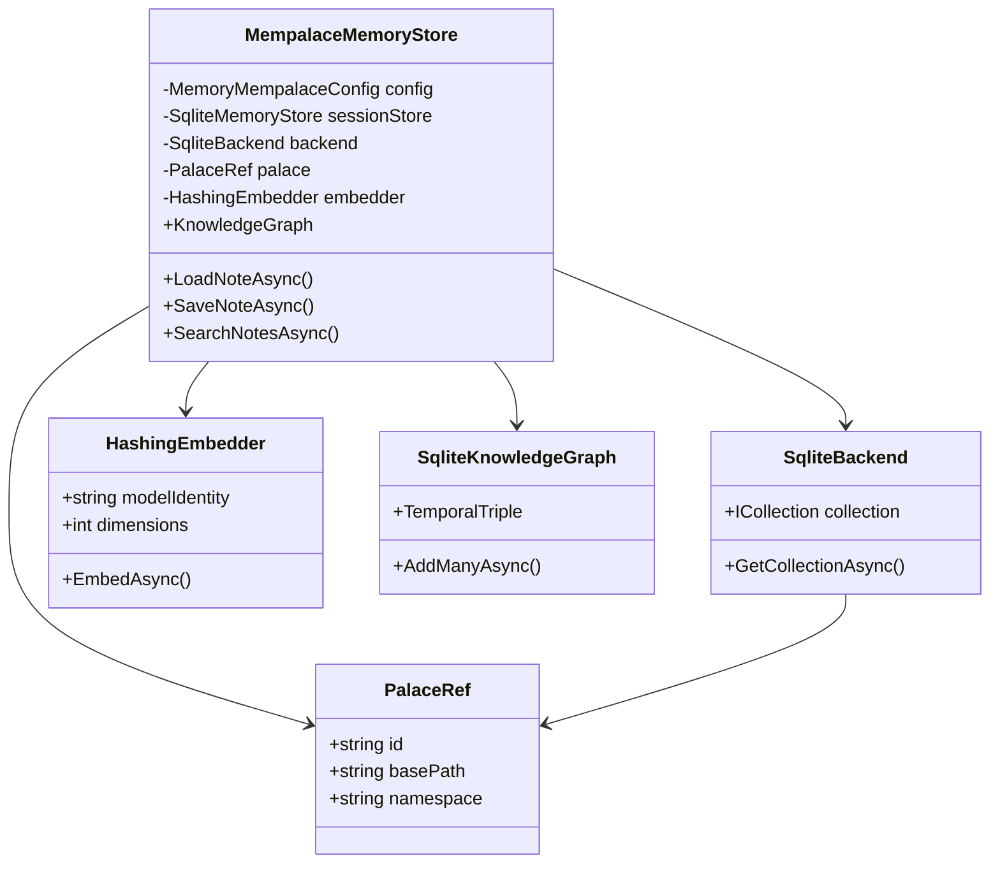

**图表来源**
- [MempalaceMemoryStore.cs:15-57](file://src/OpenClaw.Plugins.Mempalace/MempalaceMemoryStore.cs#L15-L57)

#### 知识图谱集成

Mempalace实现了智能的记忆组织和检索：

1. **层次化存储**：基于"翼-室-抽屉"的概念组织记忆
2. **智能嵌入**：使用哈希嵌入器生成固定维度的向量表示
3. **语义搜索**：结合向量相似度和关键词搜索
4. **知识推理**：通过知识图谱进行语义关联

#### 记忆组织策略

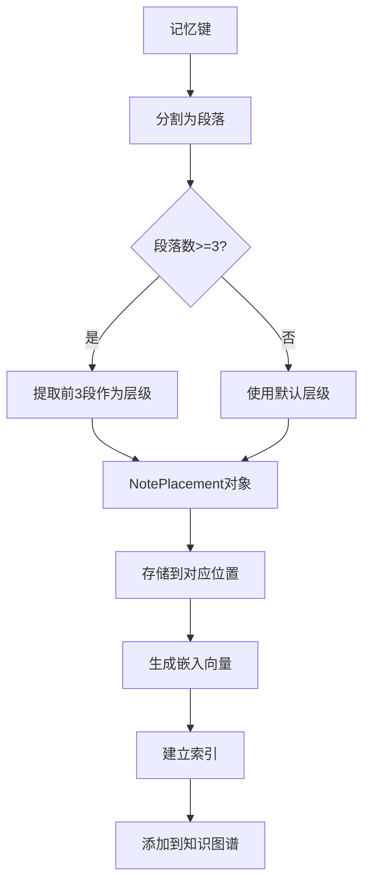

**图表来源**
- [MempalaceMemoryStore.cs:300-315](file://src/OpenClaw.Plugins.Mempalace/MempalaceMemoryStore.cs#L300-L315)

**章节来源**
- [MempalaceMemoryStore.cs:15-57](file://src/OpenClaw.Plugins.Mempalace/MempalaceMemoryStore.cs#L15-L57)
- [MempalaceMemoryStore.cs:300-315](file://src/OpenClaw.Plugins.Mempalace/MempalaceMemoryStore.cs#L300-L315)

## 依赖关系分析

### 服务注册依赖

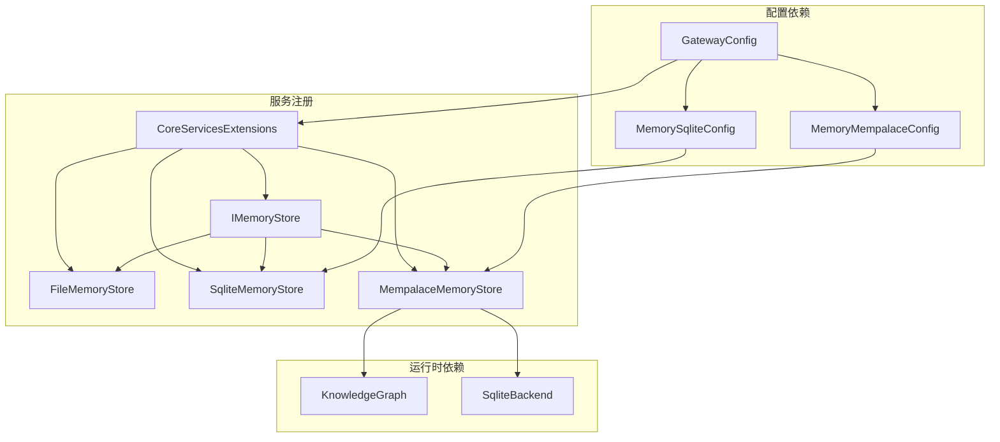

**图表来源**
- [CoreServicesExtensions.cs:295-331](file://src/OpenClaw.Gateway/Composition/CoreServicesExtensions.cs#L295-L331)

### 动态插件机制

Mempalace存储后端通过动态插件机制实现：

1. **插件发现**：扫描配置的插件路径
2. **能力注册**：插件声明支持memory能力
3. **实例创建**：按需创建存储实例
4. **生命周期管理**：插件的加载和卸载

**章节来源**
- [CoreServicesExtensions.cs:333-380](file://src/OpenClaw.Gateway/Composition/CoreServicesExtensions.cs#L333-L380)
- [MempalaceMemoryPlugin.cs:6-19](file://src/OpenClaw.Plugins.Mempalace/MempalaceMemoryPlugin.cs#L6-L19)

## 性能考虑

### 存储后端性能对比

| 特性 | 文件存储 | SQLite | Mempalace |
|------|----------|--------|-----------|
| **启动速度** | 快速 | 中等 | 较慢（插件加载） |
| **内存占用** | 低 | 中等 | 中等（嵌入向量） |
| **磁盘I/O** | 高（频繁小文件） | 低（批量操作） | 中等（向量存储） |
| **查询性能** | 一般 | 优秀（索引） | 优秀（向量+知识图谱） |
| **扩展性** | 有限 | 良好 | 优秀（分布式） |
| **维护成本** | 低 | 中等 | 高（插件管理） |

### 性能优化建议

#### 文件存储优化
1. **缓存策略**：合理设置MaxCachedSessions
2. **批处理**：合并频繁的小文件操作
3. **监控**：定期检查磁盘空间和文件数量

#### SQLite优化
1. **索引策略**：根据查询模式优化索引
2. **WAL配置**：使用WAL模式提升并发
3. **FTS配置**：启用全文搜索提升查询性能
4. **向量优化**：合理设置嵌入维度和模型

#### Mempalace优化
1. **嵌入器选择**：根据需求选择合适的嵌入模型
2. **知识图谱维护**：定期清理和优化图谱结构
3. **资源管理**：监控内存和CPU使用情况

### 容量规划建议

#### 文件存储容量
- **单文件大小**：建议不超过1MB
- **文件数量**：会话文件数量与并发用户数成正比
- **磁盘空间**：按每个会话平均10KB估算

#### SQLite容量
- **数据库大小**：建议不超过10GB用于单一实例
- **索引维护**：定期执行VACUUM和ANALYZE
- **备份策略**：制定定期备份和恢复计划

#### Mempalace容量
- **嵌入向量**：每个向量384字节（float）
- **知识图谱**：根据实体关系复杂度估算
- **插件资源**：预留足够的内存和CPU资源

## 故障排除指南

### 常见问题诊断

#### 文件存储问题
1. **权限错误**：检查存储目录的读写权限
2. **磁盘空间不足**：监控磁盘使用情况
3. **文件损坏**：查看损坏文件的隔离日志

#### SQLite问题
1. **数据库锁定**：检查并发访问模式
2. **WAL文件过多**：定期清理WAL文件
3. **FTS索引损坏**：重建FTS虚拟表

#### Mempalace问题
1. **插件加载失败**：检查插件路径和依赖
2. **嵌入向量异常**：验证嵌入模型配置
3. **知识图谱同步**：检查图谱更新状态

### 错误处理机制

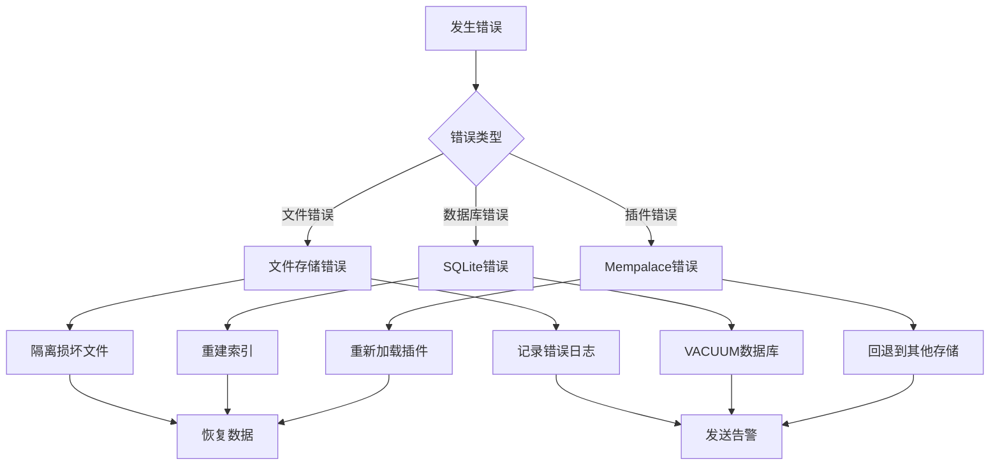

**图表来源**
- [FileMemoryStore.cs:191-223](file://src/OpenClaw.Core/Memory/FileMemoryStore.cs#L191-L223)

**章节来源**
- [FileMemoryStore.cs:191-223](file://src/OpenClaw.Core/Memory/FileMemoryStore.cs#L191-L223)

### 迁移指南

#### 从文件存储迁移到SQLite

1. **备份数据**：导出所有会话和笔记数据
2. **转换脚本**：编写数据转换脚本
3. **验证数据**：检查转换后的数据完整性
4. **切换配置**：更新配置文件中的Provider
5. **测试验证**：进行全面的功能测试

#### 从SQLite迁移到Mempalace

1. **插件安装**：安装Mempalace插件
2. **配置调整**：更新Mempalace相关配置
3. **数据迁移**：将现有数据转换为新格式
4. **功能测试**：验证知识图谱和向量搜索功能
5. **性能调优**：根据实际使用情况进行优化

#### 迁移注意事项

1. **数据一致性**：确保迁移过程中的数据完整性
2. **停机时间**：尽量减少业务中断时间
3. **回滚计划**：准备完整的回滚方案
4. **监控指标**：密切监控迁移过程中的各项指标

## 结论

OpenClaw系统提供了三种不同级别的存储后端选择，每种都有其独特的优势和适用场景：

- **文件存储**：适合开发测试、小规模部署和简单应用场景
- **SQLite存储**：适合生产环境，提供完整的数据库功能
- **Mempalace存储**：适合需要高级知识管理和智能检索的复杂应用

选择合适的存储后端需要综合考虑性能需求、功能要求、维护成本和团队技能等因素。建议在生产环境中优先考虑SQLite或Mempalace存储后端，以获得更好的性能和功能支持。

## 附录

### 配置示例

#### 基础配置示例
```json
{
  "OpenClaw": {
    "Memory": {
      "Provider": "sqlite",
      "StoragePath": "./memory",
      "Sqlite": {
        "DbPath": "./memory/openclaw.db",
        "EnableFts": true,
        "EnableVectors": false
      }
    }
  }
}
```

#### 高级配置示例
```json
{
  "OpenClaw": {
    "Memory": {
      "Provider": "mempalace",
      "StoragePath": "./memory",
      "Mempalace": {
        "BasePath": "./memory/mempalace",
        "EmbeddingDimensions": 384,
        "MaxSearchCandidates": 200
      }
    }
  }
}
```

### 最佳实践

1. **生产环境推荐**：使用SQLite或Mempalace存储后端
2. **开发环境**：可以使用文件存储后端
3. **性能监控**：定期监控存储后端的性能指标
4. **备份策略**：制定完善的数据备份和恢复计划
5. **安全配置**：确保存储目录的安全访问控制
6. **容量规划**：根据业务增长预测合理规划存储容量