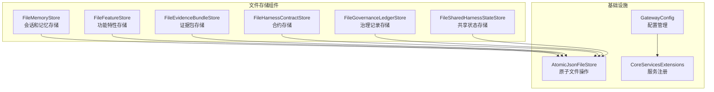
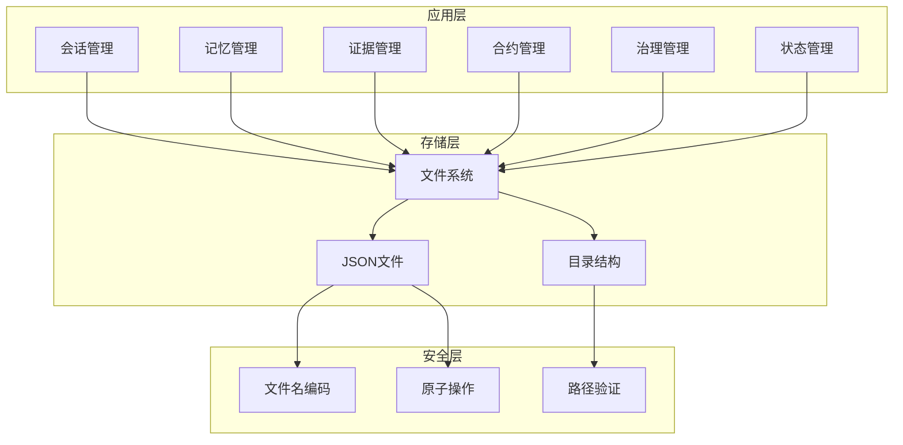
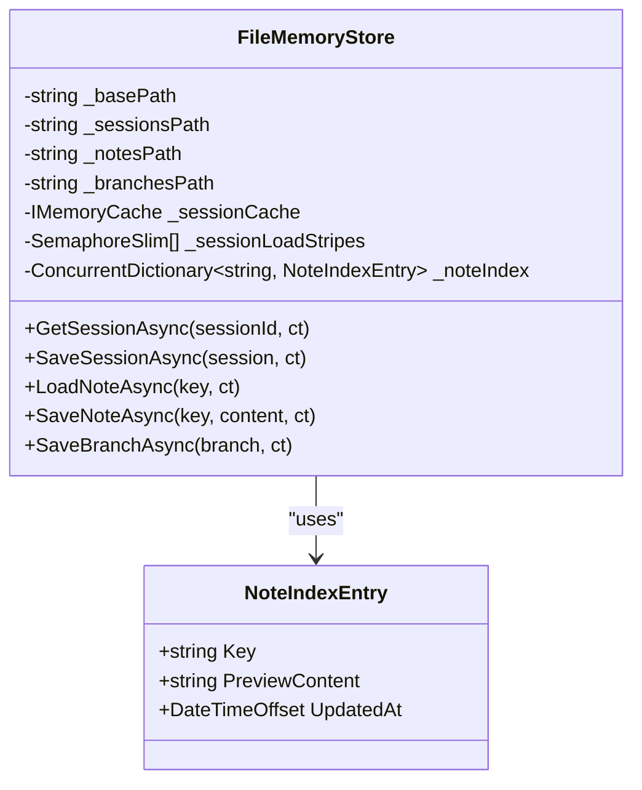
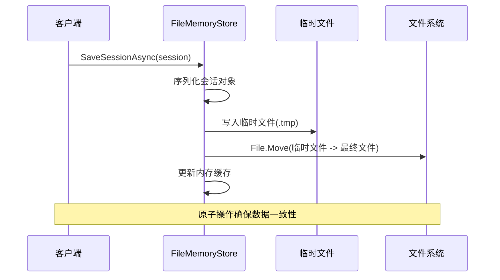
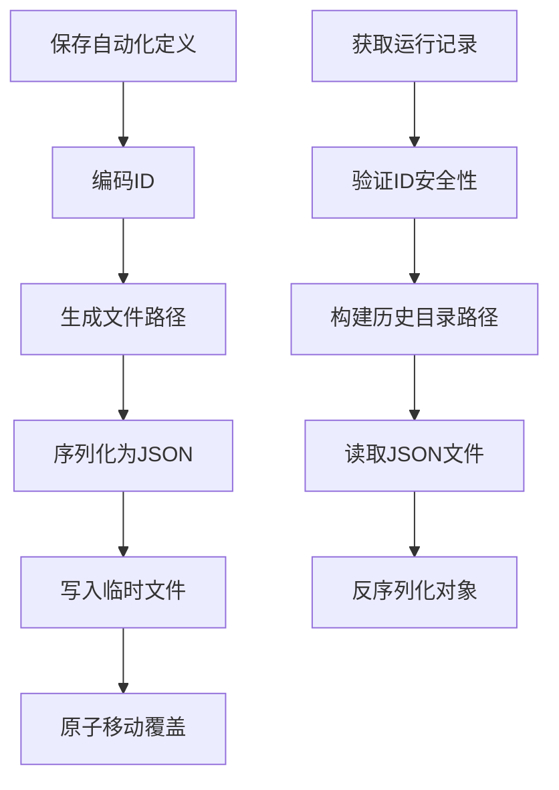
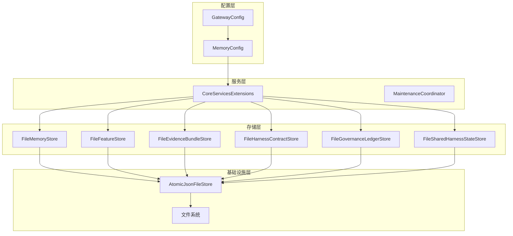
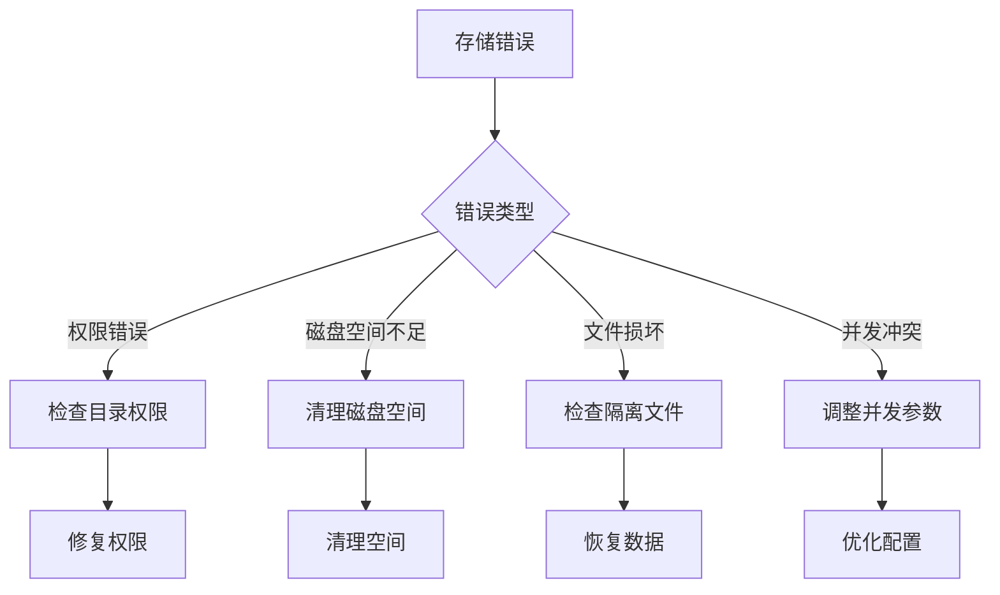

# 文件存储配置

<cite>
**本文档引用的文件**
- [FileMemoryStore.cs](file://src/OpenClaw.Core/Memory/FileMemoryStore.cs)
- [FileFeatureStore.cs](file://src/OpenClaw.Core/Features/FileFeatureStore.cs)
- [FileEvidenceBundleStore.cs](file://src/OpenClaw.Core/Features/FileEvidenceBundleStore.cs)
- [FileHarnessContractStore.cs](file://src/OpenClaw.Core/Features/FileHarnessContractStore.cs)
- [FileGovernanceLedgerStore.cs](file://src/OpenClaw.Core/Features/FileGovernanceLedgerStore.cs)
- [FileSharedHarnessStateStore.cs](file://src/OpenClaw.Core/Features/FileSharedHarnessStateStore.cs)
- [AtomicJsonFileStore.cs](file://src/OpenClaw.Gateway/AtomicJsonFileStore.cs)
- [GatewayConfig.cs](file://src/OpenClaw.Core/Models/GatewayConfig.cs)
- [CoreServicesExtensions.cs](file://src/OpenClaw.Gateway/Composition/CoreServicesExtensions.cs)
- [MaintenanceCoordinator.cs](file://src/OpenClaw.Core/Setup/MaintenanceCoordinator.cs)
- [openclaw-memory-recall-and-retention.md](file://docs/openclaw-memory-recall-and-retention.md)
- [StartupFailureReporter.cs](file://src/OpenClaw.Gateway/Bootstrap/StartupFailureReporter.cs)
</cite>

## 目录
1. [简介](#简介)
2. [项目结构](#项目结构)
3. [核心组件](#核心组件)
4. [架构概览](#架构概览)
5. [详细组件分析](#详细组件分析)
6. [依赖关系分析](#依赖关系分析)
7. [性能考虑](#性能考虑)
8. [容量与限制](#容量与限制)
9. [并发访问控制](#并发访问控制)
10. [配置示例](#配置示例)
11. [最佳实践](#最佳实践)
12. [故障排除指南](#故障排除指南)
13. [与其他存储后端的差异](#与其他存储后端的差异)
14. [结论](#结论)

## 简介

文件存储配置是 OpenClaw 系统中用于持久化各类数据的核心机制。该配置提供了基于文件系统的存储方案，支持会话管理、记忆存储、证据包管理、合约管理、治理记录和共享状态等多种数据类型的持久化。

文件存储配置的主要特点包括：
- 基于文件系统的可靠持久化
- 安全的文件命名机制
- 原子写入操作
- 并发访问控制
- 数据完整性保障
- 支持多种数据类型存储

## 项目结构

文件存储配置涉及多个核心组件，分布在不同的命名空间中：



**图表来源**
- [FileMemoryStore.cs:27-32](file://src/OpenClaw.Core/Memory/FileMemoryStore.cs#L27-L32)
- [FileFeatureStore.cs:8-17](file://src/OpenClaw.Core/Features/FileFeatureStore.cs#L8-L17)
- [AtomicJsonFileStore.cs:7-89](file://src/OpenClaw.Gateway/AtomicJsonFileStore.cs#L7-L89)

**章节来源**
- [FileMemoryStore.cs:1-1263](file://src/OpenClaw.Core/Memory/FileMemoryStore.cs#L1-L1263)
- [FileFeatureStore.cs:1-272](file://src/OpenClaw.Core/Features/FileFeatureStore.cs#L1-L272)
- [GatewayConfig.cs:175-201](file://src/OpenClaw.Core/Models/GatewayConfig.cs#L175-L201)

## 核心组件

文件存储系统由以下核心组件构成：

### 1. FileMemoryStore - 内存存储
负责会话、笔记和分支的持久化存储，采用 JSON 格式存储，支持缓存机制和并发控制。

### 2. FileFeatureStore - 功能特性存储
管理自动化定义、运行状态、用户配置文件等特性数据，提供完整的 CRUD 操作。

### 3. FileEvidenceBundleStore - 证据包存储
专门用于存储执行证据包，支持查询、过滤和生命周期管理。

### 4. FileHarnessContractStore - 合约存储
管理执行合约的生命周期，包括创建、查询、更新和删除操作。

### 5. FileGovernanceLedgerStore - 治理记录存储
维护治理决策的历史记录，支持撤销和审计功能。

### 6. FileSharedHarnessStateStore - 共享状态存储
提供跨会话的状态共享机制，支持状态查询和管理。

**章节来源**
- [FileMemoryStore.cs:27-32](file://src/OpenClaw.Core/Memory/FileMemoryStore.cs#L27-L32)
- [FileFeatureStore.cs:8-17](file://src/OpenClaw.Core/Features/FileFeatureStore.cs#L8-L17)
- [FileEvidenceBundleStore.cs:10-13](file://src/OpenClaw.Core/Features/FileEvidenceBundleStore.cs#L10-L13)
- [FileHarnessContractStore.cs:10-13](file://src/OpenClaw.Core/Features/FileHarnessContractStore.cs#L10-L13)
- [FileGovernanceLedgerStore.cs:10-13](file://src/OpenClaw.Core/Features/FileGovernanceLedgerStore.cs#L10-L13)
- [FileSharedHarnessStateStore.cs:10-13](file://src/OpenClaw.Core/Features/FileSharedHarnessStateStore.cs#L10-L13)

## 架构概览

文件存储架构采用分层设计，确保数据的一致性和可靠性：



**图表来源**
- [FileMemoryStore.cs:36-67](file://src/OpenClaw.Core/Memory/FileMemoryStore.cs#L36-L67)
- [FileFeatureStore.cs:19-38](file://src/OpenClaw.Core/Features/FileFeatureStore.cs#L19-L38)
- [AtomicJsonFileStore.cs:42-58](file://src/OpenClaw.Gateway/AtomicJsonFileStore.cs#L42-L58)

## 详细组件分析

### FileMemoryStore 组件分析

FileMemoryStore 是文件存储系统的核心组件，提供完整的内存管理功能：

#### 数据结构设计



**图表来源**
- [FileMemoryStore.cs:32-47](file://src/OpenClaw.Core/Memory/FileMemoryStore.cs#L32-L47)

#### 并发控制机制

文件存储系统采用多层并发控制策略：

1. **会话加载分段锁**：使用 64 个信号量实现细粒度的并发控制
2. **内存缓存**：基于 MemoryCache 的会话缓存，支持 LRU 淘汰
3. **笔记索引保护**：使用互斥锁保护笔记索引的并发访问
4. **原子文件操作**：所有文件写入都采用临时文件 + 移动的原子操作

#### 原子写入流程



**图表来源**
- [FileMemoryStore.cs:225-262](file://src/OpenClaw.Core/Memory/FileMemoryStore.cs#L225-L262)
- [AtomicJsonFileStore.cs:34-59](file://src/OpenClaw.Gateway/AtomicJsonFileStore.cs#L34-L59)

**章节来源**
- [FileMemoryStore.cs:78-170](file://src/OpenClaw.Core/Memory/FileMemoryStore.cs#L78-L170)
- [FileMemoryStore.cs:225-262](file://src/OpenClaw.Core/Memory/FileMemoryStore.cs#L225-L262)

### FileFeatureStore 组件分析

FileFeatureStore 提供功能特性的统一存储接口：

#### 目录结构组织

| 子目录 | 用途 | 文件格式 |
|--------|------|----------|
| automations/ | 自动化定义 | JSON |
| automation-runs/ | 自动化运行状态 | JSON |
| automation-run-history/ | 自动化运行历史 | JSON |
| connected-accounts/ | 连接账户信息 | JSON |
| backend-sessions/ | 后端会话记录 | JSON |
| backend-session-events/ | 后端会话事件 | JSON |
| profiles/ | 用户配置文件 | JSON |
| learning-proposals/ | 学习提案 | JSON |

#### 关键操作流程



**图表来源**
- [FileFeatureStore.cs:47-92](file://src/OpenClaw.Core/Features/FileFeatureStore.cs#L47-L92)
- [FileFeatureStore.cs:170-187](file://src/OpenClaw.Core/Features/FileFeatureStore.cs#L170-L187)

**章节来源**
- [FileFeatureStore.cs:19-38](file://src/OpenClaw.Core/Features/FileFeatureStore.cs#L19-L38)
- [FileFeatureStore.cs:41-92](file://src/OpenClaw.Core/Features/FileFeatureStore.cs#L41-L92)

### 安全设计与防护机制

文件存储系统实现了多层次的安全防护：

#### 路径安全验证

所有文件 ID 都经过严格的验证和编码：

1. **ID 长度限制**：最大 128 字符
2. **字符集限制**：仅允许字母数字和 `_`, `-`, `.` 字符
3. **路径遍历防护**：通过路径前缀验证防止目录遍历攻击
4. **文件名编码**：使用 URL 安全的 Base64 编码

#### 数据完整性保障

1. **原子写入**：所有写入操作都采用临时文件 + 移动的模式
2. **损坏文件隔离**：损坏的文件会被重命名为带时间戳的隔离文件
3. **校验和机制**：长键使用 SHA256 哈希，原始键保存在 `.key` 附属文件中

**章节来源**
- [FileEvidenceBundleStore.cs:199-209](file://src/OpenClaw.Core/Features/FileEvidenceBundleStore.cs#L199-L209)
- [FileMemoryStore.cs:191-223](file://src/OpenClaw.Core/Memory/FileMemoryStore.cs#L191-L223)

## 依赖关系分析

文件存储系统的依赖关系体现了清晰的分层架构：



**图表来源**
- [CoreServicesExtensions.cs:251-279](file://src/OpenClaw.Gateway/Composition/CoreServicesExtensions.cs#L251-L279)
- [MaintenanceCoordinator.cs:769-793](file://src/OpenClaw.Core/Setup/MaintenanceCoordinator.cs#L769-L793)

**章节来源**
- [CoreServicesExtensions.cs:251-279](file://src/OpenClaw.Gateway/Composition/CoreServicesExtensions.cs#L251-L279)
- [MaintenanceCoordinator.cs:769-793](file://src/OpenClaw.Core/Setup/MaintenanceCoordinator.cs#L769-L793)

## 性能考虑

文件存储系统在性能方面采用了多项优化策略：

### 缓存策略
- **会话缓存**：默认缓存 100 个会话对象
- **LRU 淘汰**：基于 MemoryCache 实现智能缓存淘汰
- **并发访问**：64 个分段信号量实现细粒度并发控制

### I/O 优化
- **异步文件操作**：所有文件 I/O 都使用异步 API
- **顺序访问优化**：针对大文件读取使用顺序扫描优化
- **批量操作**：支持批量文件枚举和处理

### 内存管理
- **流式处理**：大文件读取使用流式处理避免内存峰值
- **资源释放**：及时释放文件句柄和内存资源
- **异常安全**：确保异常情况下资源正确释放

## 容量与限制

### 存储容量
- **无固定上限**：文件存储基于文件系统，理论上无固定容量限制
- **磁盘空间监控**：建议监控存储路径的可用空间
- **归档机制**：支持数据归档减少活跃数据量

### 文件系统限制
- **文件数量**：受文件系统目录项数量限制影响
- **单文件大小**：受文件系统单文件大小限制
- **路径长度**：受操作系统路径长度限制

### 配置参数
- **最大历史轮次**：默认 50 轮，可根据需求调整
- **最大缓存会话数**：默认 100 个，可通过配置调整
- **保留策略**：支持会话和分支的自动清理

**章节来源**
- [GatewayConfig.cs:180-201](file://src/OpenClaw.Core/Models/GatewayConfig.cs#L180-L201)
- [openclaw-memory-recall-and-retention.md:159-169](file://docs/openclaw-memory-recall-and-retention.md#L159-L169)

## 并发访问控制

文件存储系统实现了多层并发控制机制：

### 会话并发控制
- **分段信号量**：64 个独立信号量，通过哈希算法分配到不同段
- **细粒度锁定**：避免全局锁竞争，提高并发性能
- **超时机制**：支持超时控制，防止死锁

### 文件操作并发
- **原子操作**：所有写入操作都是原子的
- **文件共享**：读操作允许多个进程共享访问
- **冲突解决**：通过临时文件机制解决并发写入冲突

### 索引并发控制
- **互斥锁保护**：笔记索引使用互斥锁保护
- **读写分离**：读操作和写操作分离，减少锁竞争
- **增量更新**：支持增量索引更新，避免重建整个索引

**章节来源**
- [FileMemoryStore.cs:185-189](file://src/OpenClaw.Core/Memory/FileMemoryStore.cs#L185-L189)
- [FileMemoryStore.cs:42-43](file://src/OpenClaw.Core/Memory/FileMemoryStore.cs#L42-L43)

## 配置示例

### 基础配置

```json
{
  "memory": {
    "provider": "file",
    "storagePath": "./memory",
    "maxHistoryTurns": 50,
    "maxCachedSessions": 100
  }
}
```

### 高级配置

```json
{
  "memory": {
    "provider": "file",
    "storagePath": "/var/lib/openclaw/memory",
    "maxHistoryTurns": 100,
    "maxCachedSessions": 500,
    "enableCompaction": true,
    "compactionThreshold": 80,
    "compactionKeepRecent": 10,
    "projectId": "my-project",
    "retention": {
      "enabled": true,
      "runOnStartup": true,
      "sweepIntervalMinutes": 60,
      "sessionTtlDays": 30,
      "branchTtlDays": 14,
      "archiveEnabled": true,
      "archivePath": "/var/lib/openclaw/memory/archive",
      "archiveRetentionDays": 30,
      "maxItemsPerSweep": 1000
    }
  }
}
```

### 环境变量配置

```bash
export OpenClaw__Memory__Provider=file
export OpenClaw__Memory__StoragePath=/var/lib/openclaw/memory
export OpenClaw__Memory__MaxHistoryTurns=100
export OpenClaw__Memory__MaxCachedSessions=500
```

**章节来源**
- [GatewayConfig.cs:175-201](file://src/OpenClaw.Core/Models/GatewayConfig.cs#L175-L201)
- [openclaw-memory-recall-and-retention.md:197-234](file://docs/openclaw-memory-recall-and-retention.md#L197-L234)

## 最佳实践

### 目录结构规划
1. **独立存储路径**：为文件存储选择独立的存储路径
2. **权限设置**：确保应用程序对存储目录有读写权限
3. **磁盘空间监控**：定期监控存储空间使用情况

### 性能优化
1. **缓存调优**：根据工作负载调整缓存大小
2. **并发配置**：合理设置并发参数以平衡性能和资源使用
3. **I/O 优化**：使用 SSD 存储提升 I/O 性能

### 安全考虑
1. **路径验证**：始终验证文件路径的安全性
2. **权限最小化**：为存储目录设置最小必要权限
3. **数据备份**：定期备份重要数据

### 监控和维护
1. **日志监控**：监控文件存储相关的错误日志
2. **性能指标**：监控文件操作的性能指标
3. **清理策略**：定期清理过期数据

## 故障排除指南

### 常见问题及解决方案

#### 存储路径不可写
**症状**：启动时出现存储路径不可写的错误
**解决方案**：
1. 检查存储路径是否存在
2. 确认应用程序对路径有写权限
3. 使用可写目录替换当前配置

#### 文件损坏
**症状**：读取文件时出现 JSON 解析错误
**解决方案**：
1. 检查损坏文件的隔离副本
2. 从备份恢复数据
3. 清理损坏文件

#### 并发冲突
**症状**：文件操作出现竞争条件
**解决方案**：
1. 检查并发配置参数
2. 优化应用程序的并发访问模式
3. 增加系统资源

### 错误诊断



**图表来源**
- [StartupFailureReporter.cs:125-148](file://src/OpenClaw.Gateway/Bootstrap/StartupFailureReporter.cs#L125-L148)

**章节来源**
- [StartupFailureReporter.cs:125-148](file://src/OpenClaw.Gateway/Bootstrap/StartupFailureReporter.cs#L125-L148)

## 与其他存储后端的差异

### 文件存储 vs SQLite 存储

| 特性 | 文件存储 | SQLite 存储 |
|------|----------|-------------|
| **部署复杂度** | 简单，只需文件系统 | 中等，需要数据库环境 |
| **扩展性** | 受文件系统限制 | 受数据库限制 |
| **查询能力** | 基本文件操作 | 复杂查询和索引 |
| **事务支持** | 原子文件操作 | 完整 ACID 事务 |
| **并发性能** | 通过文件系统锁 | 通过数据库锁 |
| **维护成本** | 低 | 中等 |
| **适用场景** | 开发环境、小规模部署 | 生产环境、大规模部署 |

### 选择指导原则

**选择文件存储当**：
- 开发和测试环境
- 小规模部署 (< 1000 个会话)
- 简单的数据结构
- 无需复杂查询

**选择 SQLite 存储当**：
- 生产环境部署
- 大规模数据 (> 1000 个会话)
- 需要复杂查询和索引
- 高并发访问场景

**章节来源**
- [CoreServicesExtensions.cs:262-279](file://src/OpenClaw.Gateway/Composition/CoreServicesExtensions.cs#L262-L279)
- [MaintenanceCoordinator.cs:769-793](file://src/OpenClaw.Core/Setup/MaintenanceCoordinator.cs#L769-L793)

## 结论

文件存储配置为 OpenClaw 系统提供了可靠、安全且易于部署的数据持久化解决方案。通过精心设计的安全机制、并发控制和性能优化，文件存储能够在各种部署环境中稳定运行。

关键优势包括：
- **简单易用**：基于标准文件系统，部署和维护简单
- **安全可靠**：多重安全防护机制确保数据安全
- **性能优化**：多层缓存和并发控制提升性能
- **灵活配置**：支持丰富的配置选项适应不同需求

对于生产环境的大规模部署，建议结合 SQLite 存储或其他数据库方案，以获得更好的查询能力和事务支持。而对于开发测试环境或小规模部署，文件存储配置提供了完美的解决方案。

通过遵循最佳实践和适当的监控维护，文件存储配置能够为 OpenClaw 系统提供长期稳定的数据持久化服务。