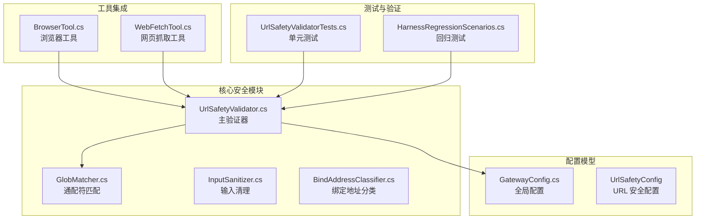
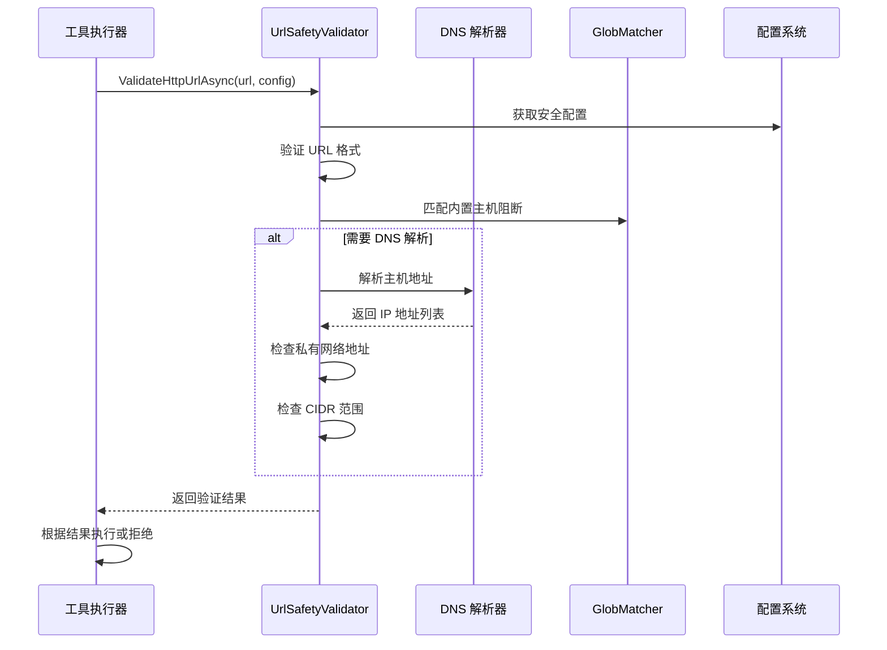
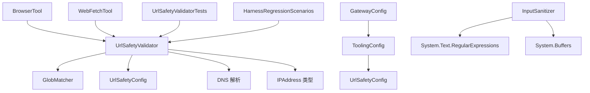

# URL 安全验证

<cite>
**本文档引用的文件**
- [UrlSafetyValidator.cs](file://src/OpenClaw.Core/Security/UrlSafetyValidator.cs)
- [GatewayConfig.cs](file://src/OpenClaw.Core/Models/GatewayConfig.cs)
- [InputSanitizer.cs](file://src/OpenClaw.Core/Security/InputSanitizer.cs)
- [GlobMatcher.cs](file://src/OpenClaw.Core/Security/GlobMatcher.cs)
- [BrowserTool.cs](file://src/OpenClaw.Agent/Tools/BrowserTool.cs)
- [WebFetchTool.cs](file://src/OpenClaw.Agent/Tools/WebFetchTool.cs)
- [UrlSafetyValidatorTests.cs](file://src/OpenClaw.Tests/UrlSafetyValidatorTests.cs)
- [HarnessRegressionScenarios.cs](file://src/OpenClaw.Testing/HarnessRegressionScenarios.cs)
</cite>

## 目录
1. [简介](#简介)
2. [项目结构](#项目结构)
3. [核心组件](#核心组件)
4. [架构概览](#架构概览)
5. [详细组件分析](#详细组件分析)
6. [依赖关系分析](#依赖关系分析)
7. [性能考虑](#性能考虑)
8. [故障排除指南](#故障排除指南)
9. [结论](#结论)
10. [附录](#附录)

## 简介

URL 安全验证系统是 OpenClaw 平台中用于保护系统免受服务器端请求伪造(SSRF)攻击和其他网络威胁的重要安全组件。该系统通过多层验证机制确保所有出站 HTTP/HTTPS 请求都经过严格的安全检查，防止访问内部网络资源、元数据服务和私有地址范围。

本系统的核心目标是：
- 阻断对私有网络目标的访问
- 防止内部网络探测和扫描
- 检测和阻止恶意 URL
- 提供灵活的配置选项以适应不同部署环境
- 为工具执行提供统一的安全验证接口

## 项目结构

URL 安全验证系统主要分布在以下模块中：



**图表来源**
- [UrlSafetyValidator.cs:1-168](file://src/OpenClaw.Core/Security/UrlSafetyValidator.cs#L1-L168)
- [GatewayConfig.cs:371-384](file://src/OpenClaw.Core/Models/GatewayConfig.cs#L371-L384)
- [BrowserTool.cs:144-180](file://src/OpenClaw.Agent/Tools/BrowserTool.cs#L144-L180)
- [WebFetchTool.cs:48-71](file://src/OpenClaw.Agent/Tools/WebFetchTool.cs#L48-L71)

**章节来源**
- [UrlSafetyValidator.cs:1-168](file://src/OpenClaw.Core/Security/UrlSafetyValidator.cs#L1-L168)
- [GatewayConfig.cs:371-384](file://src/OpenClaw.Core/Models/GatewayConfig.cs#L371-L384)

## 核心组件

### UrlSafetyValidator 主验证器

UrlSafetyValidator 是整个 URL 安全验证系统的核心组件，提供了静态方法来验证 HTTP/HTTPS URL 的安全性。

**主要功能特性：**
- 绝对 URL 验证（仅允许 http/https）
- 主机名规范化处理
- DNS 解析和地址验证
- 私有网络目标阻断
- CIDR 范围阻断
- 主机通配符匹配

### UrlSafetyConfig 配置模型

UrlSafetyConfig 提供了完整的 URL 安全配置选项：

| 配置项 | 类型 | 默认值 | 描述 |
|--------|------|--------|------|
| Enabled | bool | true | 启用 URL 验证功能 |
| BlockPrivateNetworkTargets | bool | true | 阻断私有网络目标 |
| BlockedHostGlobs | string[] | [] | 额外的主机通配符阻断列表 |
| BlockedCidrs | string[] | [] | 额外的 CIDR 范围阻断列表 |

### GlobMatcher 通配符匹配器

提供高效的通配符匹配算法，支持 `*` 作为通配符，避免字符串分割分配。

### InputSanitizer 输入清理器

提供多种输入清理和验证功能，包括：
- Shell 元字符检测
- CRLF 字符剥离
- 内存键名验证
- IMAP 文件夹名验证

**章节来源**
- [UrlSafetyValidator.cs:17-168](file://src/OpenClaw.Core/Security/UrlSafetyValidator.cs#L17-L168)
- [GatewayConfig.cs:371-384](file://src/OpenClaw.Core/Models/GatewayConfig.cs#L371-L384)
- [InputSanitizer.cs:9-84](file://src/OpenClaw.Core/Security/InputSanitizer.cs#L9-L84)

## 架构概览

URL 安全验证系统采用分层架构设计，确保安全验证在工具执行的每个阶段都能得到实施：



**图表来源**
- [UrlSafetyValidator.cs:27-58](file://src/OpenClaw.Core/Security/UrlSafetyValidator.cs#L27-L58)
- [BrowserTool.cs:144-180](file://src/OpenClaw.Agent/Tools/BrowserTool.cs#L144-L180)
- [WebFetchTool.cs:68-71](file://src/OpenClaw.Agent/Tools/WebFetchTool.cs#L68-L71)

## 详细组件分析

### 私有网络目标阻断机制

系统实现了多层次的私有网络目标阻断机制：

#### IPv4 地址范围阻断
系统识别以下 IPv4 地址范围：
- 0.0.0.0/8（保留地址）
- 10.0.0.0/8（私有网络）
- 127.0.0.0/8（回环地址）
- 169.254.0.0/16（链路本地）
- 172.16.0.0/12（私有网络）
- 192.168.0.0/16（私有网络）
- 198.18.0.0/15（测试网络）
- 224.0.0.0/4 及以上（组播）

#### IPv6 地址范围阻断
系统识别以下 IPv6 地址范围：
- 链路本地地址（fe80::/10）
- 站点本地地址（fec0::/10）
- 组播地址（ff00::/8）
- 未指定地址（::）
- 回环地址（::1）

#### 内置主机阻断列表
系统默认阻断以下主机模式：
- localhost
- *.localhost
- metadata
- metadata.google.internal

**章节来源**
- [UrlSafetyValidator.cs:140-168](file://src/OpenClaw.Core/Security/UrlSafetyValidator.cs#L140-L168)
- [BrowserTool.cs:34-46](file://src/OpenClaw.Agent/Tools/BrowserTool.cs#L34-L46)

### 主机通配符配置（BlockedHostGlobs）

主机通配符配置允许用户定义自定义的主机阻断规则：

#### 通配符语法
- `*` 匹配任意字符序列
- 支持部分匹配和完全匹配
- 大小写不敏感匹配

#### 配置示例
```json
{
  "BlockedHostGlobs": [
    "*.internal",
    "metadata.google.internal",
    "192.168.*"
  ]
}
```

### CIDR 范围阻断（BlockedCidrs）

CIDR 范围阻断提供了更精确的网络地址控制：

#### 支持的格式
- IPv4: `203.0.113.0/24`
- IPv6: `2001:db8::/32`

#### 实现机制
系统使用位运算进行 CIDR 匹配，确保高效的大规模地址范围检查。

**章节来源**
- [UrlSafetyValidator.cs:124-131](file://src/OpenClaw.Core/Security/UrlSafetyValidator.cs#L124-L131)
- [BrowserTool.cs:110-123](file://src/OpenClaw.Agent/Tools/BrowserTool.cs#L110-L123)

### 输入清理（InputSanitizer）机制

InputSanitizer 提供了多层输入清理和验证功能：

#### Shell 元字符检测
检测并阻止以下危险字符：
- 分号 (`;`)
- 管道 (`|`)
- 与符号 (`&`)
- 反引号 (`` ` ``)
- 美元符号 (`$`)
- 圆括号 (`()`)
- 花括号 (`{}`)
- 小于号 (`<`)
- 大于号 (`>`)
- 换行符 (`\n`)
- 回车符 (`\r`)

#### CRLF 字符剥离
自动移除 IMAP/SMTP 协议中的换行符，防止命令注入攻击。

#### 内存键名验证
防止路径遍历攻击，确保内存键名只包含安全字符。

**章节来源**
- [InputSanitizer.cs:14-82](file://src/OpenClaw.Core/Security/InputSanitizer.cs#L14-L82)

### 恶意 URL 检测策略

系统采用了多层次的恶意 URL 检测策略：

#### 基础验证
- 仅允许绝对 URL
- 仅允许 http/https 协议
- 验证主机名格式

#### 高级检测
- DNS 解析失败处理
- 空地址列表检测
- 地址映射到 IPv4 检查
- CIDR 范围匹配

#### 错误处理
系统提供了详细的错误信息，包括：
- DNS 解析失败原因
- 地址解析结果
- 阻断原因说明

**章节来源**
- [UrlSafetyValidator.cs:60-111](file://src/OpenClaw.Core/Security/UrlSafetyValidator.cs#L60-L111)

## 依赖关系分析

URL 安全验证系统的依赖关系如下：



**图表来源**
- [UrlSafetyValidator.cs:1-168](file://src/OpenClaw.Core/Security/UrlSafetyValidator.cs#L1-L168)
- [GatewayConfig.cs:453](file://src/OpenClaw.Core/Models/GatewayConfig.cs#L453)

**章节来源**
- [UrlSafetyValidator.cs:1-168](file://src/OpenClaw.Core/Security/UrlSafetyValidator.cs#L1-L168)
- [GatewayConfig.cs:453](file://src/OpenClaw.Core/Models/GatewayConfig.cs#L453)

## 性能考虑

### DNS 解析优化
- 异步 DNS 解析避免阻塞
- 缓存 DNS 结果减少重复查询
- 超时控制防止长时间等待

### 内存管理
- 使用 Span<T> 进行零分配字符串操作
- 避免不必要的字符串分割
- 及时释放网络资源

### 算法复杂度
- 通配符匹配时间复杂度：O(n*m)，其中 n 为模式长度，m 为值长度
- CIDR 匹配时间复杂度：O(1)
- 地址范围检查：O(k)，其中 k 为配置的范围数量

## 故障排除指南

### 常见问题及解决方案

#### URL 被错误阻断
**症状：** 合法的外部 URL 被安全系统阻断

**排查步骤：**
1. 检查是否启用了 `BlockPrivateNetworkTargets`
2. 验证 `BlockedHostGlobs` 是否包含了误判的主机模式
3. 检查 `BlockedCidrs` 是否包含了误判的 CIDR 范围

#### DNS 解析失败
**症状：** URL 验证返回 DNS 解析失败错误

**解决方案：**
1. 检查网络连接和 DNS 服务器配置
2. 验证主机名是否正确
3. 检查防火墙设置

#### 性能问题
**症状：** URL 验证响应缓慢

**优化建议：**
1. 减少 `BlockedCidrs` 和 `BlockedHostGlobs` 的数量
2. 启用 DNS 缓存
3. 调整超时参数

**章节来源**
- [UrlSafetyValidatorTests.cs:12-77](file://src/OpenClaw.Tests/UrlSafetyValidatorTests.cs#L12-L77)

## 结论

URL 安全验证系统通过多层防御机制有效保护了 OpenClaw 平台免受各种网络攻击威胁。其设计特点包括：

1. **全面的地址范围阻断**：覆盖 IPv4 和 IPv6 的所有私有和非公开地址范围
2. **灵活的配置选项**：支持主机通配符和 CIDR 范围的自定义阻断规则
3. **高效的实现**：使用零分配算法和异步处理确保高性能
4. **完善的测试覆盖**：包含单元测试和回归测试确保系统稳定性
5. **工具集成**：无缝集成到浏览器工具和网页抓取工具中

该系统为 OpenClaw 平台提供了坚实的安全基础，能够有效防范 SSRFT 攻击、内部网络探测和各种其他网络威胁。

## 附录

### 配置示例

#### 基础安全配置
```json
{
  "Tooling": {
    "UrlSafety": {
      "Enabled": true,
      "BlockPrivateNetworkTargets": true,
      "BlockedHostGlobs": [],
      "BlockedCidrs": []
    }
  }
}
```

#### 严格安全配置
```json
{
  "Tooling": {
    "UrlSafety": {
      "Enabled": true,
      "BlockPrivateNetworkTargets": true,
      "BlockedHostGlobs": [
        "*.internal",
        "metadata.google.internal"
      ],
      "BlockedCidrs": [
        "10.0.0.0/8",
        "172.16.0.0/12",
        "192.168.0.0/16",
        "169.254.0.0/16"
      ]
    }
  }
}
```

### 攻击防护场景

#### SSRF 攻击防护
- 阻断对 `127.0.0.1` 和 `localhost` 的访问
- 阻断对元数据服务 (`metadata`) 的访问
- 阻断对私有网络地址范围的访问

#### 内部网络探测防护
- 阻断对 `192.168.0.0/16` 网段的访问
- 阻断对 `10.0.0.0/8` 网段的访问
- 阻断对 `172.16.0.0/12` 网段的访问

#### 内部网络扫描防护
- 阻断对链路本地地址 (`169.254.0.0/16`) 的访问
- 阻断对 IPv6 链路本地地址的访问
- 阻断对站点本地地址的访问