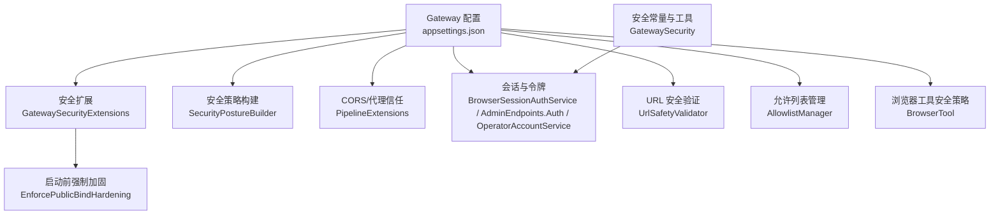
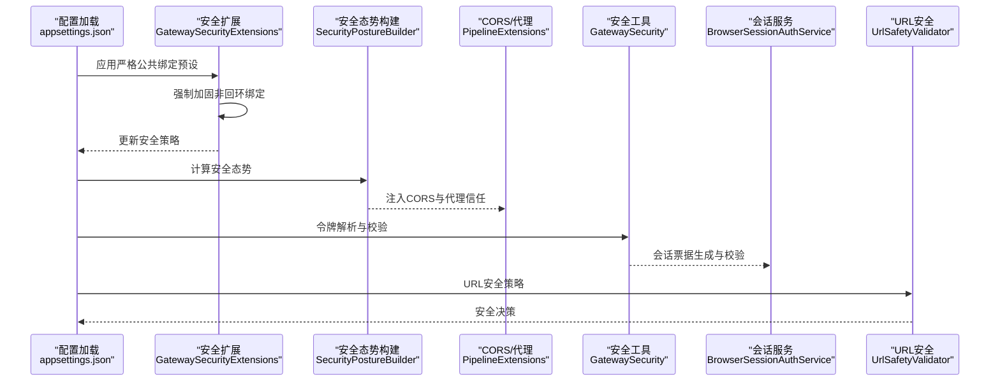
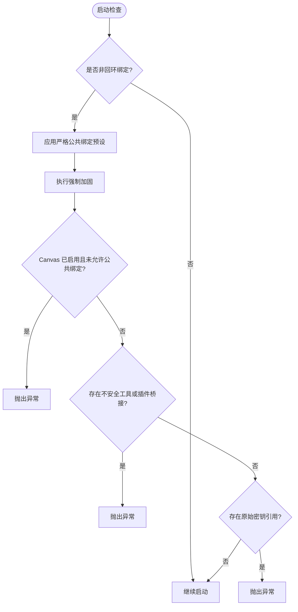
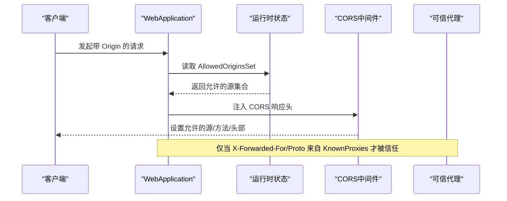
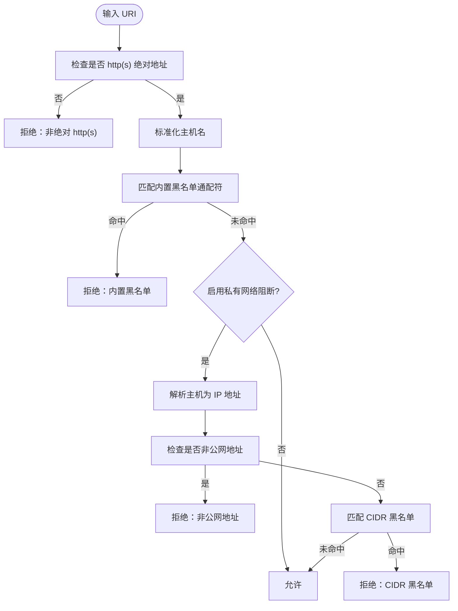
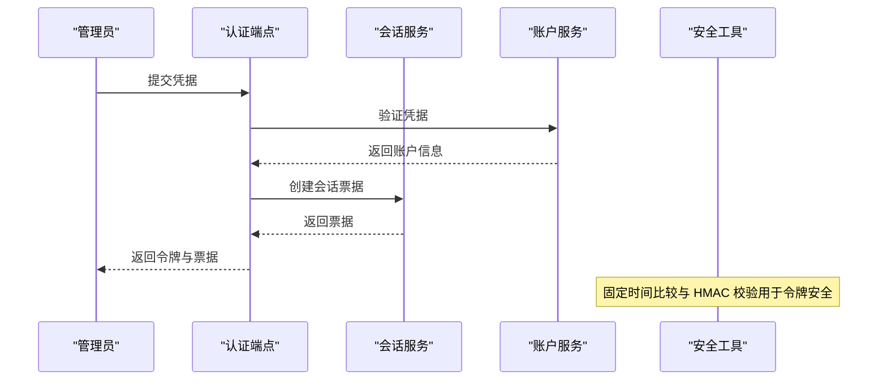
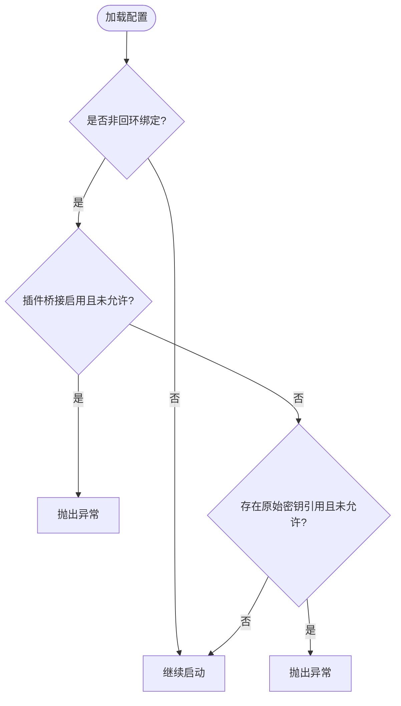
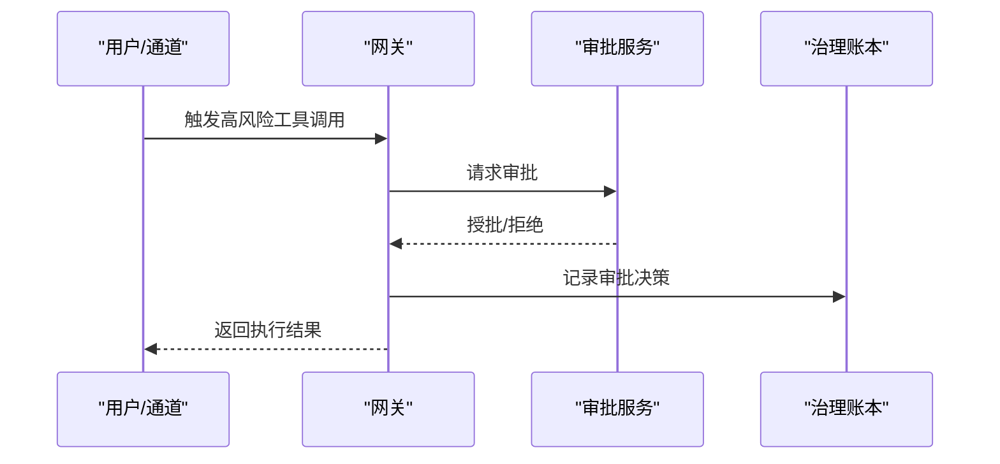
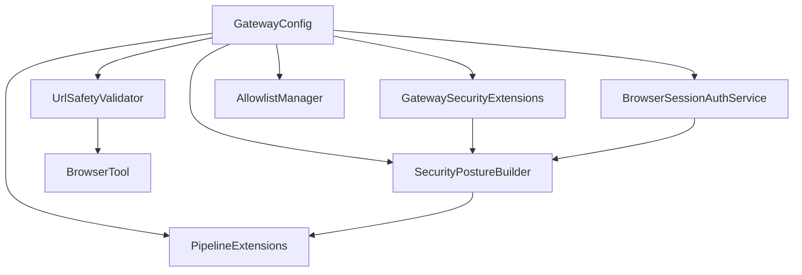

# 安全配置

<cite>
**本文档引用的文件**
- [appsettings.json](file://src/OpenClaw.Gateway/appsettings.json)
- [appsettings.Production.json](file://src/OpenClaw.Gateway/appsettings.Production.json)
- [GatewaySecurityExtensions.cs](file://src/OpenClaw.Gateway/Extensions/GatewaySecurityExtensions.cs)
- [SecurityPostureBuilder.cs](file://src/OpenClaw.Gateway/SecurityPostureBuilder.cs)
- [GatewaySecurity.cs](file://src/OpenClaw.Gateway/GatewaySecurity.cs)
- [BrowserSessionAuthService.cs](file://src/OpenClaw.Gateway/BrowserSessionAuthService.cs)
- [AdminEndpoints.Auth.cs](file://src/OpenClaw.Gateway/Endpoints/AdminEndpoints.Auth.cs)
- [OperatorAccountService.cs](file://src/OpenClaw.Gateway/OperatorAccountService.cs)
- [PipelineExtensions.cs](file://src/OpenClaw.Gateway/Pipeline/PipelineExtensions.cs)
- [UrlSafetyValidator.cs](file://src/OpenClaw.Core/Security/UrlSafetyValidator.cs)
- [AllowlistManager.cs](file://src/OpenClaw.Core/Security/AllowlistManager.cs)
- [BrowserTool.cs](file://src/OpenClaw.Agent/Tools/BrowserTool.cs)
- [TOOLS_GUIDE.md](file://docs/TOOLS_GUIDE.md)
- [GatewaySecurityHardeningTests.cs](file://src/OpenClaw.Tests/GatewaySecurityHardeningTests.cs)
- [GatewayAdminEndpointTests.cs](file://src/OpenClaw.Tests/GatewayAdminEndpointTests.cs)
- [admin.html](file://src/OpenClaw.Gateway/wwwroot/admin.html)
- [GatewayConfig.cs](file://src/OpenClaw.Core/Models/GatewayConfig.cs)
</cite>

## 目录
1. [简介](#简介)
2. [项目结构](#项目结构)
3. [核心组件](#核心组件)
4. [架构总览](#架构总览)
5. [详细组件分析](#详细组件分析)
6. [依赖关系分析](#依赖关系分析)
7. [性能考量](#性能考量)
8. [故障排查指南](#故障排查指南)
9. [结论](#结论)
10. [附录](#附录)

## 简介
本文件面向安全配置系统，围绕以下关键主题展开：严格公共绑定配置、跨域资源共享（CORS）设置、代理信任与转发头处理、URL 安全验证、私有网络目标阻断、主机通配符策略、浏览器会话管理、令牌分发与访问控制、第三方插件桥接安全、原始密钥引用限制与工具批准机制，并提供生产环境安全加固指南、威胁模型分析与安全审计最佳实践。

## 项目结构
安全相关能力主要分布在网关启动与运行期配置、安全扩展与策略、核心安全工具库、前端管理界面以及测试用例中。下图展示与安全配置直接相关的模块关系：

**图表来源**
- [appsettings.json:1-908](file://src/OpenClaw.Gateway/appsettings.json#L1-L908)
- [GatewaySecurityExtensions.cs:1-317](file://src/OpenClaw.Gateway/Extensions/GatewaySecurityExtensions.cs#L1-L317)
- [SecurityPostureBuilder.cs:1-24](file://src/OpenClaw.Gateway/SecurityPostureBuilder.cs#L1-L24)
- [PipelineExtensions.cs:91-127](file://src/OpenClaw.Gateway/Pipeline/PipelineExtensions.cs#L91-L127)
- [BrowserSessionAuthService.cs:39-179](file://src/OpenClaw.Gateway/BrowserSessionAuthService.cs#L39-L179)
- [AdminEndpoints.Auth.cs:145-178](file://src/OpenClaw.Gateway/Endpoints/AdminEndpoints.Auth.cs#L145-L178)
- [OperatorAccountService.cs:166-200](file://src/OpenClaw.Gateway/OperatorAccountService.cs#L166-L200)
- [UrlSafetyValidator.cs:1-219](file://src/OpenClaw.Core/Security/UrlSafetyValidator.cs#L1-L219)
- [AllowlistManager.cs:1-126](file://src/OpenClaw.Core/Security/AllowlistManager.cs#L1-L126)
- [BrowserTool.cs:116-204](file://src/OpenClaw.Agent/Tools/BrowserTool.cs#L116-L204)
- [GatewaySecurity.cs:1-109](file://src/OpenClaw.Gateway/GatewaySecurity.cs#L1-L109)

**章节来源**
- [appsettings.json:1-908](file://src/OpenClaw.Gateway/appsettings.json#L1-L908)
- [appsettings.Production.json:1-65](file://src/OpenClaw.Gateway/appsettings.Production.json#L1-L65)

## 核心组件
- 严格公共绑定配置：通过启动前强制加固与严格公共绑定预设，确保非回环绑定时默认收紧策略，包括请求者匹配审批、禁止不安全工具与插件桥接、禁止原始密钥引用等。
- 跨域资源共享（CORS）设置：基于允许的源集合动态注入 CORS 响应头，限定方法与头部，并支持 Vary 头以避免缓存污染。
- 代理信任与转发头：仅在已知代理列表内信任 X-Forwarded-* 头，防止客户端伪造。
- URL 安全验证：对 HTTP(S) 绝对地址进行校验，阻断回环/私有/链路本地/元数据等非公网地址，支持 CIDR 白/黑名单与主机通配符。
- 私有网络目标阻断：针对 IPv4/IPv6 的私有与非公网范围进行阻断，结合 DNS 解析结果判定。
- 主机通配符配置：内置与自定义阻断主机通配符，支持 glob 模式匹配。
- 浏览器会话管理：基于 Cookie 的会话票据，支持持久化与空闲超时，CSRF 令牌生成与校验。
- 令牌分发与访问控制：支持 Bearer 令牌与可选查询串令牌，提供固定时间比较与 HMAC 校验。
- 第三方插件桥接安全：在非回环绑定时默认拒绝第三方桥接插件，除非显式授权。
- 原始密钥引用限制：在非回环绑定时默认拒绝 raw: 密钥引用，除非显式授权。
- 工具批准机制：高风险工具需审批，支持一次性或可复用的批准授予与治理记录。

**章节来源**
- [GatewaySecurityExtensions.cs:11-27](file://src/OpenClaw.Gateway/Extensions/GatewaySecurityExtensions.cs#L11-L27)
- [PipelineExtensions.cs:91-127](file://src/OpenClaw.Gateway/Pipeline/PipelineExtensions.cs#L91-L127)
- [UrlSafetyValidator.cs:17-135](file://src/OpenClaw.Core/Security/UrlSafetyValidator.cs#L17-L135)
- [BrowserSessionAuthService.cs:39-179](file://src/OpenClaw.Gateway/BrowserSessionAuthService.cs#L39-L179)
- [GatewaySecurity.cs:13-76](file://src/OpenClaw.Gateway/GatewaySecurity.cs#L13-L76)
- [GatewaySecurityExtensions.cs:29-218](file://src/OpenClaw.Gateway/Extensions/GatewaySecurityExtensions.cs#L29-L218)
- [AllowlistManager.cs:19-84](file://src/OpenClaw.Core/Security/AllowlistManager.cs#L19-L84)

## 架构总览
下图展示从配置到运行期安全策略的总体流程：

**图表来源**
- [appsettings.json:1-908](file://src/OpenClaw.Gateway/appsettings.json#L1-L908)
- [GatewaySecurityExtensions.cs:11-27](file://src/OpenClaw.Gateway/Extensions/GatewaySecurityExtensions.cs#L11-L27)
- [SecurityPostureBuilder.cs:9-24](file://src/OpenClaw.Gateway/SecurityPostureBuilder.cs#L9-L24)
- [PipelineExtensions.cs:91-127](file://src/OpenClaw.Gateway/Pipeline/PipelineExtensions.cs#L91-L127)
- [GatewaySecurity.cs:13-76](file://src/OpenClaw.Gateway/GatewaySecurity.cs#L13-L76)
- [UrlSafetyValidator.cs:27-111](file://src/OpenClaw.Core/Security/UrlSafetyValidator.cs#L27-L111)

## 详细组件分析

### 严格公共绑定配置
- 启动前强制加固：在非回环绑定时拒绝不安全配置（如 Canvas 未显式允许、插件桥接启用、不安全工具暴露、未启用请求者匹配审批、原始密钥引用等），并抛出明确异常。
- 严格公共绑定预设：自动启用请求者匹配审批、禁止不安全工具与插件桥接、禁止原始密钥引用、收紧工具审批清单。
- 生产基线建议：在生产配置中默认关闭允许公共绑定的不安全选项，结合只读模式与严格的工具审批策略。

**图表来源**
- [GatewaySecurityExtensions.cs:11-27](file://src/OpenClaw.Gateway/Extensions/GatewaySecurityExtensions.cs#L11-L27)
- [GatewaySecurityExtensions.cs:29-218](file://src/OpenClaw.Gateway/Extensions/GatewaySecurityExtensions.cs#L29-L218)

**章节来源**
- [GatewaySecurityExtensions.cs:11-27](file://src/OpenClaw.Gateway/Extensions/GatewaySecurityExtensions.cs#L11-L27)
- [GatewaySecurityExtensions.cs:29-218](file://src/OpenClaw.Gateway/Extensions/GatewaySecurityExtensions.cs#L29-L218)
- [GatewaySecurityHardeningTests.cs:34-202](file://src/OpenClaw.Tests/GatewaySecurityHardeningTests.cs#L34-L202)
- [TOOLS_GUIDE.md:288-325](file://docs/TOOLS_GUIDE.md#L288-L325)

### 跨域资源共享（CORS）与代理信任
- CORS 动态注入：根据允许的 Origin 集合设置 Access-Control-Allow-Origin、方法、头部与缓存时间，并对预检请求进行处理。
- 代理信任：仅在 KnownProxies 中列出的 IP 被视为可信代理，ForwardLimit 设为 1，避免多级代理带来的头部污染。

**图表来源**
- [PipelineExtensions.cs:108-127](file://src/OpenClaw.Gateway/Pipeline/PipelineExtensions.cs#L108-L127)
- [appsettings.json:82-102](file://src/OpenClaw.Gateway/appsettings.json#L82-L102)

**章节来源**
- [PipelineExtensions.cs:91-127](file://src/OpenClaw.Gateway/Pipeline/PipelineExtensions.cs#L91-L127)
- [appsettings.json:82-102](file://src/OpenClaw.Gateway/appsettings.json#L82-L102)

### URL 安全验证与私有网络阻断
- 支持绝对 http(s) URL，阻断 localhost 及其通配、metadata.* 等内置黑名单；支持自定义主机通配符阻断。
- 当启用私有网络阻断时，对解析到回环、私有、链路本地、组播或非公网地址的主机进行阻断；支持 CIDR 白/黑名单。
- 浏览器工具端侧同样在路由阶段进行 URL 安全校验，阻止进入不安全目标。

**图表来源**
- [UrlSafetyValidator.cs:27-135](file://src/OpenClaw.Core/Security/UrlSafetyValidator.cs#L27-L135)
- [BrowserTool.cs:144-204](file://src/OpenClaw.Agent/Tools/BrowserTool.cs#L144-L204)

**章节来源**
- [UrlSafetyValidator.cs:17-219](file://src/OpenClaw.Core/Security/UrlSafetyValidator.cs#L17-L219)
- [BrowserTool.cs:116-204](file://src/OpenClaw.Agent/Tools/BrowserTool.cs#L116-L204)

### 浏览器会话管理、令牌分发与访问控制
- 会话票据：包含会话 ID、CSRF 令牌、过期时间、持久化标记、角色与身份信息；支持空闲超时与“记住我”持久会话。
- 令牌解析：优先 Authorization: Bearer，可选查询串 token；提供固定时间比较与 HMAC-SHA256 校验。
- 管理端令牌发放：凭据认证成功后生成操作员令牌并记录审计日志。

**图表来源**
- [BrowserSessionAuthService.cs:39-179](file://src/OpenClaw.Gateway/BrowserSessionAuthService.cs#L39-L179)
- [AdminEndpoints.Auth.cs:145-178](file://src/OpenClaw.Gateway/Endpoints/AdminEndpoints.Auth.cs#L145-L178)
- [OperatorAccountService.cs:166-200](file://src/OpenClaw.Gateway/OperatorAccountService.cs#L166-L200)
- [GatewaySecurity.cs:13-76](file://src/OpenClaw.Gateway/GatewaySecurity.cs#L13-L76)

**章节来源**
- [BrowserSessionAuthService.cs:39-179](file://src/OpenClaw.Gateway/BrowserSessionAuthService.cs#L39-L179)
- [AdminEndpoints.Auth.cs:145-178](file://src/OpenClaw.Gateway/Endpoints/AdminEndpoints.Auth.cs#L145-L178)
- [OperatorAccountService.cs:166-200](file://src/OpenClaw.Gateway/OperatorAccountService.cs#L166-L200)
- [GatewaySecurity.cs:13-76](file://src/OpenClaw.Gateway/GatewaySecurity.cs#L13-L76)

### 第三方插件桥接安全与原始密钥引用限制
- 插件桥接：在非回环绑定时默认拒绝第三方桥接插件，除非显式开启 AllowPluginBridgeOnPublicBind。
- 原始密钥引用：在非回环绑定时默认拒绝 raw: 密钥引用，除非显式开启 AllowRawSecretRefsOnPublicBind；系统会扫描配置树定位潜在敏感字段。

**图表来源**
- [GatewaySecurityExtensions.cs:57-62](file://src/OpenClaw.Gateway/Extensions/GatewaySecurityExtensions.cs#L57-L62)
- [GatewaySecurityExtensions.cs:205-217](file://src/OpenClaw.Gateway/Extensions/GatewaySecurityExtensions.cs#L205-L217)

**章节来源**
- [GatewaySecurityExtensions.cs:57-62](file://src/OpenClaw.Gateway/Extensions/GatewaySecurityExtensions.cs#L57-L62)
- [GatewaySecurityExtensions.cs:205-217](file://src/OpenClaw.Gateway/Extensions/GatewaySecurityExtensions.cs#L205-L217)
- [GatewaySecurityHardeningTests.cs:34-69](file://src/OpenClaw.Tests/GatewaySecurityHardeningTests.cs#L34-L69)

### 工具批准机制与访问控制策略
- 高风险工具审批：在受控模式下要求审批，支持一次性与可复用批准授予；审批决策记录到治理账本与运行事件。
- 请求者匹配：在公共绑定场景下强制启用请求者匹配审批，降低越权风险。
- 管理界面：提供安全配置与风险提示的可视化界面，便于运维人员调整策略。

**图表来源**
- [GatewaySecurityExtensions.cs:16-26](file://src/OpenClaw.Gateway/Extensions/GatewaySecurityExtensions.cs#L16-L26)
- [admin.html:1741-1763](file://src/OpenClaw.Gateway/wwwroot/admin.html#L1741-L1763)

**章节来源**
- [GatewaySecurityExtensions.cs:16-26](file://src/OpenClaw.Gateway/Extensions/GatewaySecurityExtensions.cs#L16-L26)
- [admin.html:1741-1763](file://src/OpenClaw.Gateway/wwwroot/admin.html#L1741-L1763)

## 依赖关系分析
- 配置驱动：所有安全策略由 GatewayConfig 决定，包括安全、工具、通道、插件等子配置。
- 运行时依赖：安全扩展在启动阶段读取配置并执行强制加固；运行期由安全工具与会话服务负责令牌与会话管理。
- 前端集成：管理界面提供安全配置项与风险提示，支持导出审计证据包。

**图表来源**
- [GatewayConfig.cs:331-384](file://src/OpenClaw.Core/Models/GatewayConfig.cs#L331-L384)
- [GatewaySecurityExtensions.cs:1-317](file://src/OpenClaw.Gateway/Extensions/GatewaySecurityExtensions.cs#L1-L317)
- [SecurityPostureBuilder.cs:9-24](file://src/OpenClaw.Gateway/SecurityPostureBuilder.cs#L9-L24)
- [PipelineExtensions.cs:91-127](file://src/OpenClaw.Gateway/Pipeline/PipelineExtensions.cs#L91-L127)
- [BrowserSessionAuthService.cs:39-179](file://src/OpenClaw.Gateway/BrowserSessionAuthService.cs#L39-L179)
- [UrlSafetyValidator.cs:1-219](file://src/OpenClaw.Core/Security/UrlSafetyValidator.cs#L1-L219)
- [AllowlistManager.cs:1-126](file://src/OpenClaw.Core/Security/AllowlistManager.cs#L1-L126)
- [BrowserTool.cs:116-204](file://src/OpenClaw.Agent/Tools/BrowserTool.cs#L116-L204)

**章节来源**
- [GatewayConfig.cs:331-384](file://src/OpenClaw.Core/Models/GatewayConfig.cs#L331-L384)

## 性能考量
- URL 安全验证涉及 DNS 解析，建议在工具层缓存解析结果或限制并发，避免成为瓶颈。
- 会话票据与 CSRF 校验采用固定时间比较，避免时序泄漏，但需注意内存分配与哈希计算开销。
- CORS 注入为轻量中间件，影响较小；代理信任仅在可信范围内生效，避免额外解析成本。
- 工具审批与治理记录可能带来写放大，建议异步落盘与批量提交。

## 故障排查指南
- 启动失败（非回环绑定）：检查是否启用了不安全工具或插件桥接，确认是否显式允许公共绑定的不安全选项。
- CORS 无效：确认 AllowedOrigins 是否包含当前前端源，检查代理信任配置与 ForwardedHeaders。
- URL 安全拦截：检查 UrlSafetyConfig 的 BlockPrivateNetworkTargets 与 BlockedCidrs，确认主机通配符与 CIDR 设置。
- 会话失效：确认 Cookie 是否随请求发送，检查持久化与空闲超时配置，核对 CSRF 令牌有效性。
- 审批异常：检查审批超时、治理账本写入与运行事件记录，确认请求者匹配策略。

**章节来源**
- [GatewaySecurityHardeningTests.cs:34-202](file://src/OpenClaw.Tests/GatewaySecurityHardeningTests.cs#L34-L202)
- [GatewayAdminEndpointTests.cs:1538-1555](file://src/OpenClaw.Tests/GatewayAdminEndpointTests.cs#L1538-L1555)

## 结论
该安全配置体系通过“启动前强制加固 + 运行期细粒度控制”的双层设计，在公共绑定场景下显著提升安全性。配合 URL 安全验证、代理信任、会话与令牌管理、工具审批与治理记录，形成闭环的安全控制链。建议在生产环境中启用严格公共绑定预设与只读/审批策略，并定期进行安全审计与风险评估。

## 附录
- 生产环境安全加固要点
  - 默认关闭 AllowUnsafeToolingOnPublicBind、AllowPluginBridgeOnPublicBind、AllowRawSecretRefsOnPublicBind。
  - 在生产配置中启用 RequireRequesterMatchForHttpToolApproval 与只读模式。
  - 使用 env: 密钥引用替代 raw:，并限制 AllowedReadRoots/AllowedWriteRoots。
  - 开启签名验证与公有基地址配置，防止中间人攻击与重放。
- 威胁模型与缓解
  - 中间人攻击：启用 HTTPS、签名验证与代理信任白名单。
  - 越权与滥用：启用请求者匹配审批、工具审批与治理记录。
  - 内网探测与横向移动：启用 URL 安全验证与私有网络阻断。
- 安全审计最佳实践
  - 定期导出审计证据包，审查风险标志与推荐项。
  - 监控会话锁数量、持久化失败与速率限制命中情况。
  - 对高风险工具与外部 API 调用建立专项审计。

**章节来源**
- [TOOLS_GUIDE.md:288-325](file://docs/TOOLS_GUIDE.md#L288-L325)
- [GatewaySecurityExtensions.cs:11-27](file://src/OpenClaw.Gateway/Extensions/GatewaySecurityExtensions.cs#L11-L27)
- [appsettings.Production.json:22-30](file://src/OpenClaw.Gateway/appsettings.Production.json#L22-L30)