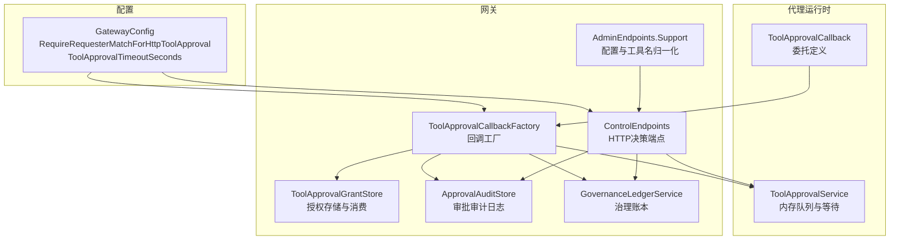
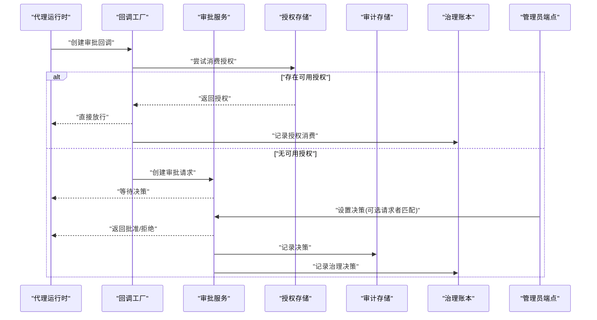
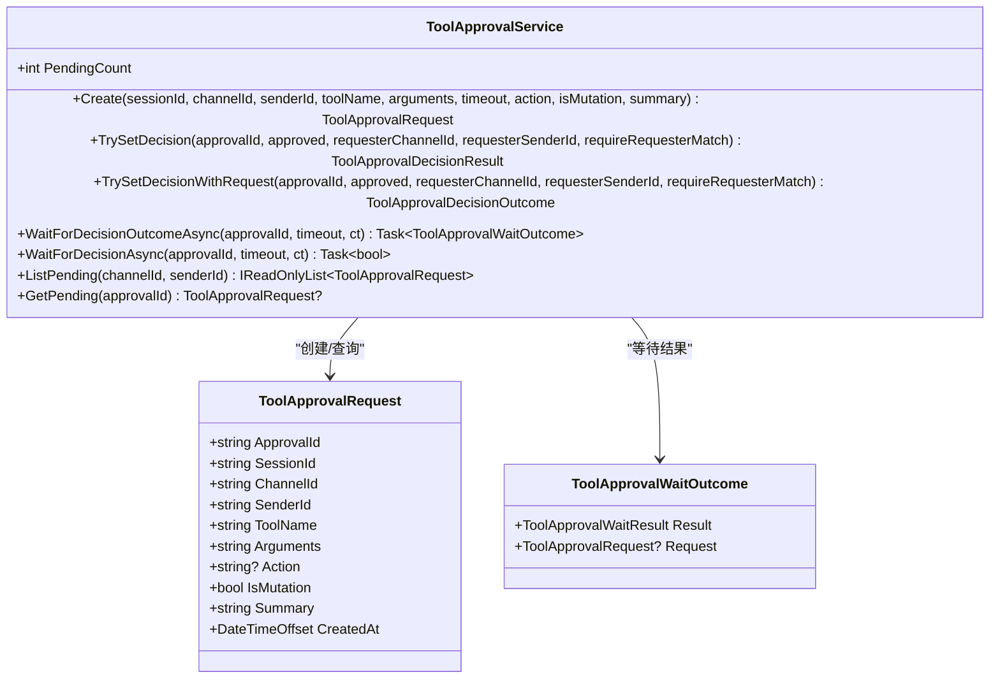
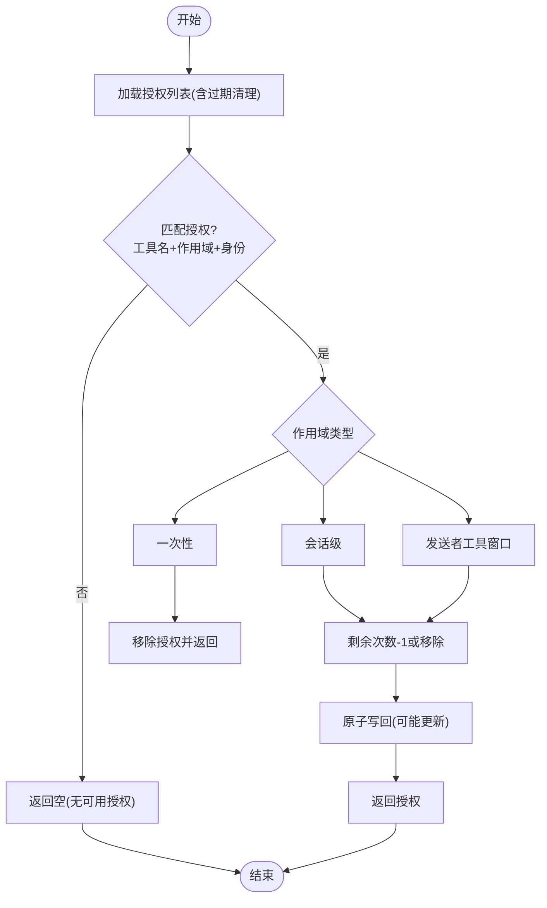
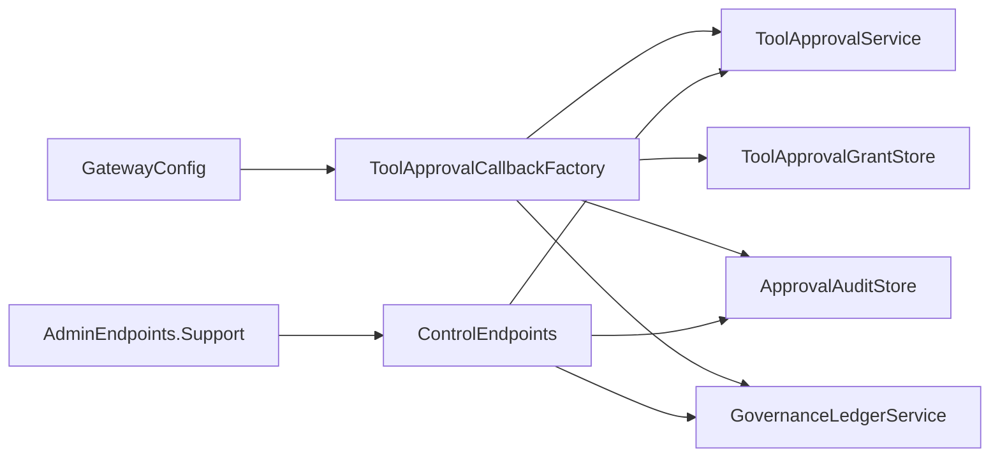

# 工具审批机制

<cite>
**本文引用的文件**
- [ToolApprovalCallback.cs](file://src/OpenClaw.Agent/ToolApprovalCallback.cs)
- [ToolApprovalService.cs](file://src/OpenClaw.Core/Pipeline/ToolApprovalService.cs)
- [ToolApprovalGrantStore.cs](file://src/OpenClaw.Gateway/ToolApprovalGrantStore.cs)
- [ApprovalAuditStore.cs](file://src/OpenClaw.Gateway/ApprovalAuditStore.cs)
- [ToolApprovalCallbackFactory.cs](file://src/OpenClaw.Gateway/ToolApprovalCallbackFactory.cs)
- [AdminEndpoints.Support.cs](file://src/OpenClaw.Gateway/Endpoints/AdminEndpoints.Support.cs)
- [ControlEndpoints.cs](file://src/OpenClaw.Gateway/Endpoints/ControlEndpoints.cs)
- [GovernanceLedgerService.cs](file://src/OpenClaw.Gateway/GovernanceLedgerService.cs)
- [AdminEndpoints.Runtime.cs](file://src/OpenClaw.Gateway/Endpoints/AdminEndpoints.Runtime.cs)
- [GatewayConfig.cs](file://src/OpenClaw.Core/Models/GatewayConfig.cs)
- [ToolApprovalServiceTests.cs](file://src/OpenClaw.Tests/ToolApprovalServiceTests.cs)
- [ToolApprovalGrantStoreTests.cs](file://src/OpenClaw.Tests/ToolApprovalGrantStoreTests.cs)
- [HarnessRegressionScenarios.cs](file://src/OpenClaw.Testing/HarnessRegressionScenarios.cs)
</cite>

## 目录
1. [简介](#简介)
2. [项目结构](#项目结构)
3. [核心组件](#核心组件)
4. [架构总览](#架构总览)
5. [组件详解](#组件详解)
6. [依赖关系分析](#依赖关系分析)
7. [性能与可扩展性](#性能与可扩展性)
8. [故障排查指南](#故障排查指南)
9. [结论](#结论)
10. [附录：配置示例与合规实践](#附录配置示例与合规实践)

## 简介
本技术文档围绕“工具审批机制”展开，系统性阐述以下关键点：
- 工具审批回调（ToolApprovalCallback）的工作流程：从审批请求生成、到用户交互与决策处理。
- 工具审批授权存储（ToolApprovalGrantStore）的实现：审批状态管理、超时处理与持久化。
- 请求者匹配（RequireRequesterMatchForHttpToolApproval）的安全策略与应用场景。
- 审批超时配置（ToolApprovalTimeoutSeconds）与自动拒绝机制。
- 实际配置示例：高风险工具审批策略、批量工具审批流程、紧急快速审批通道。
- 审批审计日志与合规性要求。

## 项目结构
审批机制涉及三个层面：
- 回调与服务层：在代理运行时侧定义审批回调委托，在核心管道中实现审批服务。
- 网关与授权层：在网关侧实现审批授权存储、审计与治理账本记录。
- 配置与端点层：通过配置项控制审批行为，通过管理端点进行授权授予与决策。

图表来源
- [ToolApprovalCallback.cs:1-13](file://src/OpenClaw.Agent/ToolApprovalCallback.cs#L1-L13)
- [ToolApprovalService.cs:1-265](file://src/OpenClaw.Core/Pipeline/ToolApprovalService.cs#L1-L265)
- [ToolApprovalGrantStore.cs:1-165](file://src/OpenClaw.Gateway/ToolApprovalGrantStore.cs#L1-L165)
- [ApprovalAuditStore.cs:1-126](file://src/OpenClaw.Gateway/ApprovalAuditStore.cs#L1-L126)
- [ToolApprovalCallbackFactory.cs:1-66](file://src/OpenClaw.Gateway/ToolApprovalCallbackFactory.cs#L1-L66)
- [ControlEndpoints.cs:176-328](file://src/OpenClaw.Gateway/Endpoints/ControlEndpoints.cs#L176-L328)
- [AdminEndpoints.Support.cs:1630-1675](file://src/OpenClaw.Gateway/Endpoints/AdminEndpoints.Support.cs#L1630-L1675)
- [GovernanceLedgerService.cs:174-204](file://src/OpenClaw.Gateway/GovernanceLedgerService.cs#L174-L204)
- [GatewayConfig.cs:331-352](file://src/OpenClaw.Core/Models/GatewayConfig.cs#L331-L352)

章节来源
- [ToolApprovalCallback.cs:1-13](file://src/OpenClaw.Agent/ToolApprovalCallback.cs#L1-L13)
- [ToolApprovalService.cs:1-265](file://src/OpenClaw.Core/Pipeline/ToolApprovalService.cs#L1-L265)
- [ToolApprovalGrantStore.cs:1-165](file://src/OpenClaw.Gateway/ToolApprovalGrantStore.cs#L1-L165)
- [ApprovalAuditStore.cs:1-126](file://src/OpenClaw.Gateway/ApprovalAuditStore.cs#L1-L126)
- [ToolApprovalCallbackFactory.cs:1-66](file://src/OpenClaw.Gateway/ToolApprovalCallbackFactory.cs#L1-L66)
- [ControlEndpoints.cs:176-328](file://src/OpenClaw.Gateway/Endpoints/ControlEndpoints.cs#L176-L328)
- [AdminEndpoints.Support.cs:1630-1675](file://src/OpenClaw.Gateway/Endpoints/AdminEndpoints.Support.cs#L1630-L1675)
- [GovernanceLedgerService.cs:174-204](file://src/OpenClaw.Gateway/GovernanceLedgerService.cs#L174-L204)
- [GatewayConfig.cs:331-352](file://src/OpenClaw.Core/Models/GatewayConfig.cs#L331-L352)

## 核心组件
- 工具审批回调委托（ToolApprovalCallback）
  - 定义在代理运行时侧，用于在执行工具前触发审批流程，返回批准或拒绝结果。
- 工具审批服务（ToolApprovalService）
  - 内存队列实现，支持创建审批请求、等待决策、超时自动拒绝、请求者匹配校验、过期清理等。
- 工具审批授权存储（ToolApprovalGrantStore）
  - 基于原子JSON文件的授权存储，支持一次性、会话级、发送者窗口级等作用域，自动过期与剩余次数消费。
- 审批审计存储（ApprovalAuditStore）
  - JSONL格式审计日志，记录审批创建与决策事件，支持查询与参数截断。
- 治理账本服务（GovernanceLedgerService）
  - 记录审批决策与授权消费的治理事件，支持范围、风险级别、摘要等字段。
- 工具审批回调工厂（ToolApprovalCallbackFactory）
  - 组合配置、服务与存储，生成最终的审批回调；根据授权策略决定是否跳过待审批环节。
- 管理端点与安全策略
  - 控制端点支持管理员决策与请求者匹配校验；配置项控制HTTP审批请求者的匹配策略与超时秒数。

章节来源
- [ToolApprovalCallback.cs:1-13](file://src/OpenClaw.Agent/ToolApprovalCallback.cs#L1-L13)
- [ToolApprovalService.cs:1-265](file://src/OpenClaw.Core/Pipeline/ToolApprovalService.cs#L1-L265)
- [ToolApprovalGrantStore.cs:1-165](file://src/OpenClaw.Gateway/ToolApprovalGrantStore.cs#L1-L165)
- [ApprovalAuditStore.cs:1-126](file://src/OpenClaw.Gateway/ApprovalAuditStore.cs#L1-L126)
- [GovernanceLedgerService.cs:174-204](file://src/OpenClaw.Gateway/GovernanceLedgerService.cs#L174-L204)
- [ToolApprovalCallbackFactory.cs:1-66](file://src/OpenClaw.Gateway/ToolApprovalCallbackFactory.cs#L1-L66)
- [ControlEndpoints.cs:176-328](file://src/OpenClaw.Gateway/Endpoints/ControlEndpoints.cs#L176-L328)

## 架构总览
审批机制的关键交互如下：

图表来源
- [ToolApprovalCallbackFactory.cs:1-66](file://src/OpenClaw.Gateway/ToolApprovalCallbackFactory.cs#L1-L66)
- [ToolApprovalService.cs:1-265](file://src/OpenClaw.Core/Pipeline/ToolApprovalService.cs#L1-L265)
- [ToolApprovalGrantStore.cs:1-165](file://src/OpenClaw.Gateway/ToolApprovalGrantStore.cs#L1-L165)
- [ApprovalAuditStore.cs:1-126](file://src/OpenClaw.Gateway/ApprovalAuditStore.cs#L1-L126)
- [GovernanceLedgerService.cs:174-204](file://src/OpenClaw.Gateway/GovernanceLedgerService.cs#L174-L204)
- [ControlEndpoints.cs:176-328](file://src/OpenClaw.Gateway/Endpoints/ControlEndpoints.cs#L176-L328)

## 组件详解

### 工具审批回调（ToolApprovalCallback）
- 角色与职责
  - 在工具执行前触发审批流程，返回布尔值表示批准或拒绝。
  - 该委托在代理运行时侧定义，便于跨运行时复用。
- 关键点
  - 回调由工厂统一创建，结合配置与运行时状态生成。
  - 若存在可消费的授权，则直接放行并记录治理事件。

章节来源
- [ToolApprovalCallback.cs:1-13](file://src/OpenClaw.Agent/ToolApprovalCallback.cs#L1-L13)
- [ToolApprovalCallbackFactory.cs:1-66](file://src/OpenClaw.Gateway/ToolApprovalCallbackFactory.cs#L1-L66)

### 工具审批服务（ToolApprovalService）
- 功能特性
  - 创建审批请求：生成唯一ID、记录会话/渠道/发送者信息、动作类型、是否变更操作、摘要与创建时间。
  - 等待决策：支持超时等待，超时默认拒绝并移除待处理项。
  - 决策设置：支持请求者匹配校验（可选），防止越权决策。
  - 过期清理：定期扫描并移除已过期或已完成的任务。
  - 列表查询：按渠道与发送者过滤待处理请求。
- 数据结构
  - 请求体包含审批ID、会话ID、渠道ID、发送者ID、工具名、参数、动作、是否变更、摘要与创建时间。
  - 等待结果枚举：批准、拒绝、超时、未找到。
  - 决策结果枚举：已记录、未找到、未授权。

图表来源
- [ToolApprovalService.cs:1-265](file://src/OpenClaw.Core/Pipeline/ToolApprovalService.cs#L1-L265)

章节来源
- [ToolApprovalService.cs:1-265](file://src/OpenClaw.Core/Pipeline/ToolApprovalService.cs#L1-L265)

### 工具审批授权存储（ToolApprovalGrantStore）
- 作用域与消费
  - 支持一次性（once）、会话级（session）、发送者工具窗口（sender_tool_window）等作用域。
  - 消费后若剩余次数为0或作用域为一次性，则移除授权；否则更新剩余次数。
- 超时与持久化
  - 加载时清理过期授权；保存采用原子写入，失败抛出异常。
  - 使用缓存减少频繁IO，必要时刷新缓存。
- 授权模型
  - 授权包含ID、作用域、渠道/发送者/会话约束、工具名、有效期、授予人与来源、剩余使用次数。

图表来源
- [ToolApprovalGrantStore.cs:1-165](file://src/OpenClaw.Gateway/ToolApprovalGrantStore.cs#L1-L165)

章节来源
- [ToolApprovalGrantStore.cs:1-165](file://src/OpenClaw.Gateway/ToolApprovalGrantStore.cs#L1-L165)
- [ToolApprovalGrantStoreTests.cs:1-39](file://src/OpenClaw.Tests/ToolApprovalGrantStoreTests.cs#L1-L39)

### 审批审计存储（ApprovalAuditStore）
- 记录内容
  - 创建事件：审批ID、会话ID、渠道ID、发送者ID、工具名、参数预览、动作、是否变更、摘要、时间戳。
  - 决策事件：在创建基础上增加决策时间、决策来源、操作者渠道/发送者、批准结果。
- 查询能力
  - 支持按渠道、发送者、工具名、时间范围查询，限制最大返回条数。
- 参数保护
  - 对参数进行截断，避免敏感信息泄露。

章节来源
- [ApprovalAuditStore.cs:1-126](file://src/OpenClaw.Gateway/ApprovalAuditStore.cs#L1-L126)

### 治理账本（GovernanceLedgerService）
- 记录场景
  - 授权消费：记录授权ID、作用域、摘要、风险级别、参数摘要等。
  - 审批决策：记录决策、状态、来源、工具名、动作类型、摘要、风险级别、范围等。
- 与运行时事件集成
  - 失败时记录运行时事件，便于可观测性。

章节来源
- [GovernanceLedgerService.cs:174-204](file://src/OpenClaw.Gateway/GovernanceLedgerService.cs#L174-L204)

### 工具审批回调工厂（ToolApprovalCallbackFactory）
- 关键逻辑
  - 依据配置计算审批超时（裁剪到合理范围）。
  - 先尝试消费授权，若成功则直接放行并记录运行时事件与治理账本。
  - 否则创建审批请求，交由审批服务等待决策。

章节来源
- [ToolApprovalCallbackFactory.cs:1-66](file://src/OpenClaw.Gateway/ToolApprovalCallbackFactory.cs#L1-L66)

### 请求者匹配与HTTP端点
- 安全策略
  - 当启用请求者匹配时，HTTP端点要求提供requesterChannelId与requesterSenderId，且必须与待审批请求的创建者一致。
  - 未启用时，管理员可通过非请求者匹配路径进行决策，但需具备相应角色权限。
- 端点行为
  - 成功决策后记录审计与治理账本，并追加运行时事件。
  - 未授权时返回403并记录拒绝事件。

章节来源
- [ControlEndpoints.cs:176-328](file://src/OpenClaw.Gateway/Endpoints/ControlEndpoints.cs#L176-L328)
- [GatewayConfig.cs:331-352](file://src/OpenClaw.Core/Models/GatewayConfig.cs#L331-L352)

## 依赖关系分析
- 组件耦合
  - 回调工厂依赖配置、审批服务、审计存储、授权存储与治理账本。
  - 审批服务与授权存储相互独立，通过回调工厂协调。
  - 管理端点依赖审批服务与审计存储，同时联动治理账本。
- 外部依赖
  - 配置模型提供超时与安全策略开关。
  - 测试用例验证关键行为（请求者匹配、超时、重复决策、过期清理）。

图表来源
- [GatewayConfig.cs:331-352](file://src/OpenClaw.Core/Models/GatewayConfig.cs#L331-L352)
- [ToolApprovalCallbackFactory.cs:1-66](file://src/OpenClaw.Gateway/ToolApprovalCallbackFactory.cs#L1-L66)
- [ToolApprovalService.cs:1-265](file://src/OpenClaw.Core/Pipeline/ToolApprovalService.cs#L1-L265)
- [ToolApprovalGrantStore.cs:1-165](file://src/OpenClaw.Gateway/ToolApprovalGrantStore.cs#L1-L165)
- [ApprovalAuditStore.cs:1-126](file://src/OpenClaw.Gateway/ApprovalAuditStore.cs#L1-L126)
- [GovernanceLedgerService.cs:174-204](file://src/OpenClaw.Gateway/GovernanceLedgerService.cs#L174-L204)
- [ControlEndpoints.cs:176-328](file://src/OpenClaw.Gateway/Endpoints/ControlEndpoints.cs#L176-L328)
- [AdminEndpoints.Support.cs:1630-1675](file://src/OpenClaw.Gateway/Endpoints/AdminEndpoints.Support.cs#L1630-L1675)

章节来源
- [ToolApprovalServiceTests.cs:1-134](file://src/OpenClaw.Tests/ToolApprovalServiceTests.cs#L1-L134)
- [ToolApprovalGrantStoreTests.cs:1-39](file://src/OpenClaw.Tests/ToolApprovalGrantStoreTests.cs#L1-L39)
- [HarnessRegressionScenarios.cs:297-330](file://src/OpenClaw.Testing/HarnessRegressionScenarios.cs#L297-L330)

## 性能与可扩展性
- 内存队列与并发
  - 审批服务使用并发字典存储待处理请求，线程安全；等待使用TCS异步完成，避免阻塞。
- IO与持久化
  - 授权存储采用原子JSON文件写入，失败即抛异常，确保一致性；缓存降低读取开销。
- 可观测性
  - 提供待处理数量指标，便于容量规划与告警。
- 扩展建议
  - 将授权存储替换为分布式KV或数据库以支持多实例共享。
  - 引入审批历史分页与索引以提升查询性能。

[本节为通用指导，不直接分析具体文件]

## 故障排查指南
- 常见问题与定位
  - 请求者不匹配导致决策被拒：检查HTTP端点是否正确传入requesterChannelId与requesterSenderId，确认配置开关。
  - 超时自动拒绝：核对ToolApprovalTimeoutSeconds配置与实际等待时间，必要时延长超时。
  - 重复决策无效：已决策的请求无法再次修改，需重新创建审批请求。
  - 授权未生效：确认授权作用域、工具名、渠道/发送者/会话是否匹配，以及剩余次数。
- 日志与审计
  - 通过审批审计日志与治理账本查询审批历史，定位异常决策与参数问题。
- 单元测试参考
  - 请求者匹配、超时、重复决策、过期清理等行为均有测试覆盖，可作为回归验证依据。

章节来源
- [ToolApprovalServiceTests.cs:1-134](file://src/OpenClaw.Tests/ToolApprovalServiceTests.cs#L1-L134)
- [ToolApprovalGrantStoreTests.cs:1-39](file://src/OpenClaw.Tests/ToolApprovalGrantStoreTests.cs#L1-L39)
- [ControlEndpoints.cs:176-328](file://src/OpenClaw.Gateway/Endpoints/ControlEndpoints.cs#L176-L328)

## 结论
该审批机制通过“授权优先、请求者匹配、超时自动拒绝”的设计，在保证安全性的同时兼顾了可用性与可观测性。授权存储与审计/治理账本提供了完善的合规支撑，适合在生产环境中部署高风险工具的受控执行。

[本节为总结，不直接分析具体文件]

## 附录：配置示例与合规实践

### 审批超时配置与自动拒绝
- 配置项
  - ToolApprovalTimeoutSeconds：审批超时秒数，工厂会将其裁剪到合理范围后使用。
- 行为
  - 等待超时默认拒绝并移除待处理请求；管理员可在启用请求者匹配时进行决策。

章节来源
- [ToolApprovalCallbackFactory.cs:38-66](file://src/OpenClaw.Gateway/ToolApprovalCallbackFactory.cs#L38-L66)
- [ToolApprovalService.cs:156-218](file://src/OpenClaw.Core/Pipeline/ToolApprovalService.cs#L156-L218)

### 请求者匹配安全策略
- 开关
  - RequireRequesterMatchForHttpToolApproval：启用后HTTP端点要求提供请求者身份，且必须与待审批请求一致。
- 应用场景
  - 强监管环境、多租户或多发送者场景，防止越权决策。
- 管理员路径
  - 未启用时，管理员可绕过请求者匹配进行决策，但仍需满足角色权限。

章节来源
- [GatewayConfig.cs:331-352](file://src/OpenClaw.Core/Models/GatewayConfig.cs#L331-L352)
- [ControlEndpoints.cs:176-328](file://src/OpenClaw.Gateway/Endpoints/ControlEndpoints.cs#L176-L328)

### 高风险工具的审批策略
- 示例策略
  - 在监督自治模式下，将shell、write_file、code_exec、git、external_cli、payment等工具纳入审批必经清单。
- 验证
  - 回归场景确保高风险工具描述符仍要求审批，且策略覆盖所有高风险工具。

章节来源
- [HarnessRegressionScenarios.cs:297-330](file://src/OpenClaw.Testing/HarnessRegressionScenarios.cs#L297-L330)

### 批量工具的审批流程
- 授权优先
  - 通过授权存储为批量工具设置一次性或会话级授权，减少重复审批。
- 自动化
  - 工厂在创建回调时先尝试消费授权，成功则直接放行，提高吞吐。

章节来源
- [ToolApprovalCallbackFactory.cs:38-66](file://src/OpenClaw.Gateway/ToolApprovalCallbackFactory.cs#L38-L66)
- [ToolApprovalGrantStore.cs:63-135](file://src/OpenClaw.Gateway/ToolApprovalGrantStore.cs#L63-L135)

### 紧急情况下的快速审批通道
- 管理员直通
  - 在未启用请求者匹配时，管理员可绕过请求者匹配进行决策，但需具备相应角色。
- 风险提示
  - 快速通道应配合严格的审计与治理账本记录，确保事后可追溯。

章节来源
- [ControlEndpoints.cs:176-200](file://src/OpenClaw.Gateway/Endpoints/ControlEndpoints.cs#L176-L200)

### 审批审计日志与合规性
- 审计日志
  - 记录审批创建与决策事件，支持按渠道/发送者/工具/时间范围查询。
- 合规要求
  - 治理账本记录决策、状态、来源、风险级别、范围与摘要，满足审计导出与合规审查。
- 导出与保留
  - 支持导出包含审批历史在内的审计包，可按策略设置保留天数。

章节来源
- [ApprovalAuditStore.cs:1-126](file://src/OpenClaw.Gateway/ApprovalAuditStore.cs#L1-L126)
- [GovernanceLedgerService.cs:174-204](file://src/OpenClaw.Gateway/GovernanceLedgerService.cs#L174-L204)
- [AdminEndpoints.Support.cs:1630-1675](file://src/OpenClaw.Gateway/Endpoints/AdminEndpoints.Support.cs#L1630-L1675)