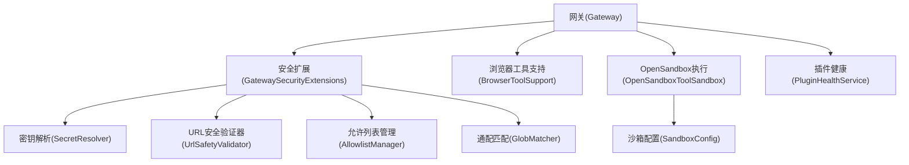
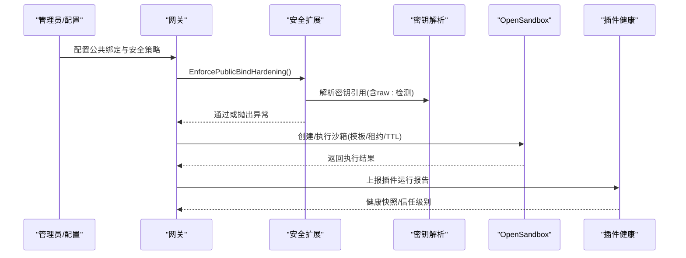
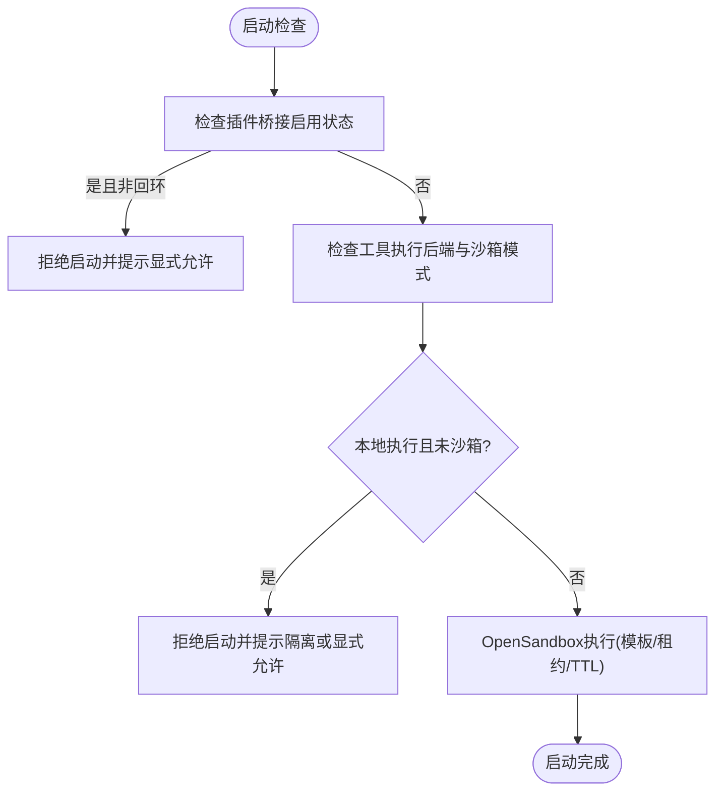
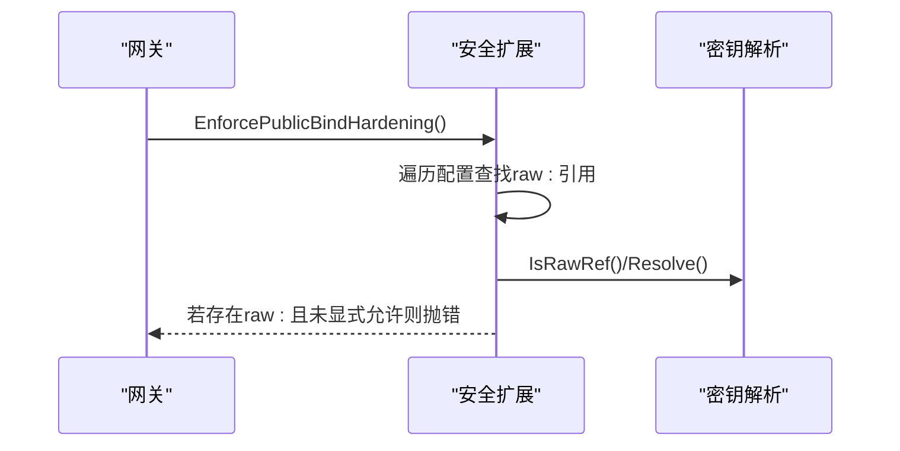
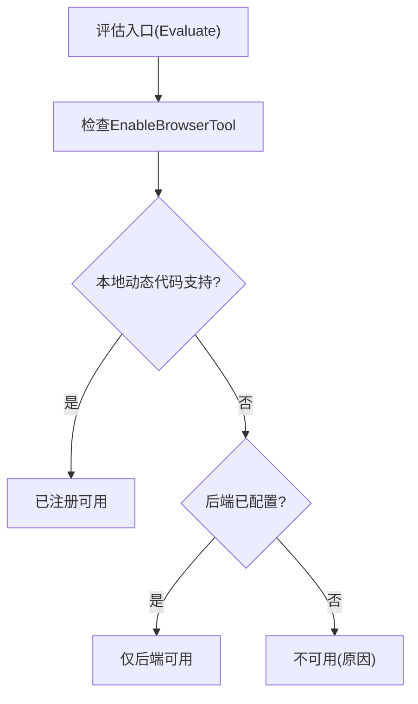
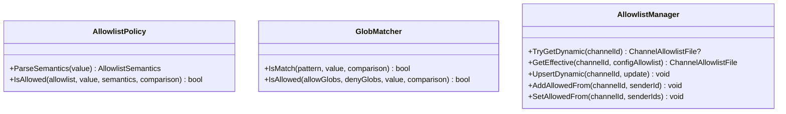
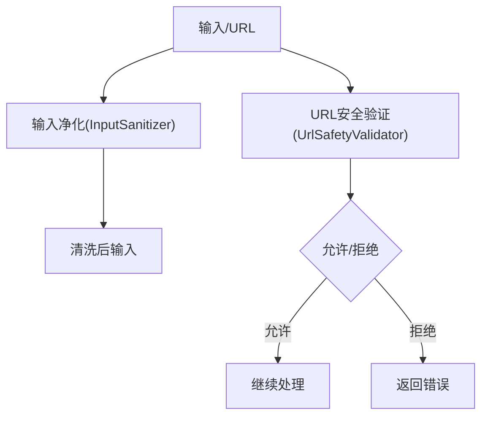
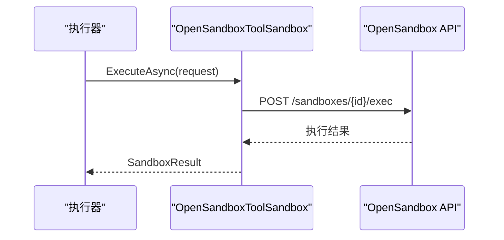
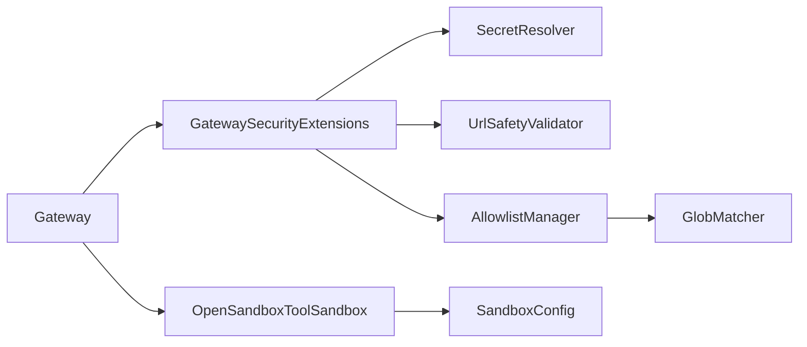
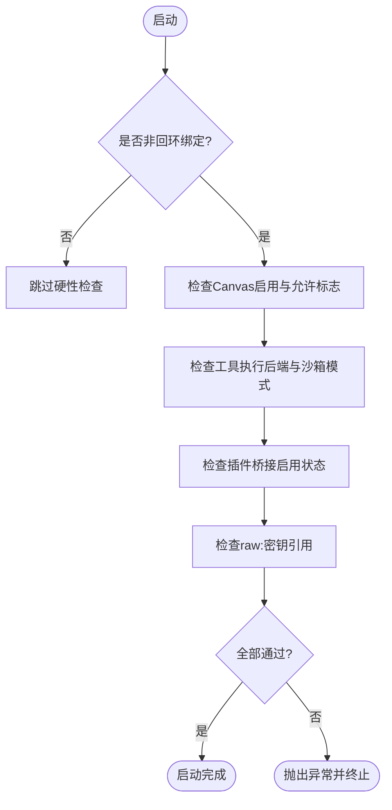

# 插件安全

<cite>
**本文档引用的文件**
- [GatewaySecurityExtensions.cs](file://src/OpenClaw.Gateway/Extensions/GatewaySecurityExtensions.cs)
- [BrowserToolCapabilityEvaluator.cs](file://src/OpenClaw.Core/Security/BrowserToolCapabilityEvaluator.cs)
- [BrowserToolSupport.cs](file://src/OpenClaw.Gateway/BrowserToolSupport.cs)
- [SecretResolver.cs](file://src/OpenClaw.Core/Security/SecretResolver.cs)
- [OperatorApiModels.cs](file://src/OpenClaw.Core/Models/OperatorApiModels.cs)
- [ToolPathPolicy.cs](file://src/OpenClaw.Core/Security/ToolPathPolicy.cs)
- [AllowlistManager.cs](file://src/OpenClaw.Core/Security/AllowlistManager.cs)
- [AllowlistPolicy.cs](file://src/OpenClaw.Core/Security/AllowlistPolicy.cs)
- [GlobMatcher.cs](file://src/OpenClaw.Core/Security/GlobMatcher.cs)
- [InputSanitizer.cs](file://src/OpenClaw.Core/Security/InputSanitizer.cs)
- [UrlSafetyValidator.cs](file://src/OpenClaw.Core/Security/UrlSafetyValidator.cs)
- [SandboxConfig.cs](file://src/OpenClaw.Core/Models/SandboxConfig.cs)
- [OpenSandboxToolSandbox.cs](file://src/OpenClawNet.Sandbox.OpenSandbox/OpenSandboxToolSandbox.cs)
- [OpenSandboxJsonContext.cs](file://src/OpenClawNet.Sandbox.OpenSandbox/OpenSandboxJsonContext.cs)
- [PluginHealthService.cs](file://src/OpenClaw.Gateway/PluginHealthService.cs)
- [GatewaySecurityHardeningTests.cs](file://src/OpenClaw.Tests/GatewaySecurityHardeningTests.cs)
- [SecurityTests.cs](file://src/OpenClaw.Tests/SecurityTests.cs)
- [OpenSandboxToolSandboxTests.cs](file://src/OpenClaw.Tests/OpenSandboxToolSandboxTests.cs)
- [HarnessRegressionScenarios.cs](file://src/OpenClaw.Testing/HarnessRegressionScenarios.cs)
</cite>

## 目录
1. [引言](#引言)
2. [项目结构](#项目结构)
3. [核心组件](#核心组件)
4. [架构总览](#架构总览)
5. [详细组件分析](#详细组件分析)
6. [依赖关系分析](#依赖关系分析)
7. [性能考量](#性能考量)
8. [故障排查指南](#故障排查指南)
9. [结论](#结论)
10. [附录](#附录)

## 引言
本文件面向插件安全系统，聚焦第三方插件桥接的安全设计与实现，覆盖 TypeScript/JavaScript 插件的沙箱隔离与执行限制、原始密钥引用限制（AllowRawSecretRefsOnPublicBind）、敏感信息保护机制、工具路径策略（ToolPathPolicy）、浏览器工具能力评估（BrowserToolCapabilityEvaluator）与安全策略配置，并提供最佳实践与高级安全特性建议（如签名验证、代码扫描、运行时监控）。

## 项目结构
围绕“插件安全”的关键模块分布于以下命名空间与项目中：
- 网关侧安全策略与启动校验：OpenClaw.Gateway.Extensions（公共绑定硬性检查、策略应用）
- 核心安全能力：OpenClaw.Core.Security（密钥解析、输入净化、URL 安全、白名单、通配匹配）
- 沙箱与工具执行：OpenClawNet.Sandbox.OpenSandbox（OpenSandbox 执行后端）
- 运行时健康与信任度：OpenClaw.Gateway（插件健康服务）
- 测试与回归：OpenClaw.Tests 与 OpenClaw.Testing（安全策略与沙箱行为验证）

图示来源
- [GatewaySecurityExtensions.cs:1-317](file://src/OpenClaw.Gateway/Extensions/GatewaySecurityExtensions.cs#L1-L317)
- [BrowserToolSupport.cs:1-25](file://src/OpenClaw.Gateway/BrowserToolSupport.cs#L1-L25)
- [SecretResolver.cs:1-65](file://src/OpenClaw.Core/Security/SecretResolver.cs#L1-L65)
- [UrlSafetyValidator.cs:1-219](file://src/OpenClaw.Core/Security/UrlSafetyValidator.cs#L1-L219)
- [AllowlistManager.cs:1-126](file://src/OpenClaw.Core/Security/AllowlistManager.cs#L1-L126)
- [GlobMatcher.cs:1-89](file://src/OpenClaw.Core/Security/GlobMatcher.cs#L1-L89)
- [OpenSandboxToolSandbox.cs:103-386](file://src/OpenClawNet.Sandbox.OpenSandbox/OpenSandboxToolSandbox.cs#L103-L386)
- [SandboxConfig.cs:83-152](file://src/OpenClaw.Core/Models/SandboxConfig.cs#L83-L152)
- [PluginHealthService.cs:32-89](file://src/OpenClaw.Gateway/PluginHealthService.cs#L32-L89)

章节来源
- [GatewaySecurityExtensions.cs:1-317](file://src/OpenClaw.Gateway/Extensions/GatewaySecurityExtensions.cs#L1-L317)
- [BrowserToolSupport.cs:1-25](file://src/OpenClaw.Gateway/BrowserToolSupport.cs#L1-L25)
- [OpenSandboxToolSandbox.cs:103-386](file://src/OpenClawNet.Sandbox.OpenSandbox/OpenSandboxToolSandbox.cs#L103-L386)

## 核心组件
- 公共绑定硬性检查与策略应用：在非回环绑定场景下强制安全策略，禁止不安全工具、插件桥接、原始密钥引用等。
- 浏览器工具能力评估：根据配置与运行态判定浏览器工具是否可用及本地执行支持情况。
- 密钥解析与敏感信息保护：统一解析 secret 引用，支持 env: 与 raw: 前缀，严格限制 raw: 在公共绑定下的使用。
- 工具路径策略：预留文件系统读写白名单与根目录限制能力（当前实现为占位注释，未来可启用）。
- 白名单与通配匹配：支持严格/传统语义的允许列表，以及允许/拒绝组合策略。
- 输入净化与 URL 安全：针对注入风险进行输入净化，对 HTTP(S) URL 的私网地址与 CIDR 进行阻断。
- 沙箱与执行：通过 OpenSandbox 提供容器化执行环境，支持模板、租约、TTL 等。
- 插件健康与信任：基于诊断、预算与重启次数等指标评估插件健康状态与信任等级。

章节来源
- [GatewaySecurityExtensions.cs:29-218](file://src/OpenClaw.Gateway/Extensions/GatewaySecurityExtensions.cs#L29-L218)
- [BrowserToolCapabilityEvaluator.cs:1-34](file://src/OpenClaw.Core/Security/BrowserToolCapabilityEvaluator.cs#L1-L34)
- [SecretResolver.cs:14-65](file://src/OpenClaw.Core/Security/SecretResolver.cs#L14-L65)
- [ToolPathPolicy.cs:1-136](file://src/OpenClaw.Core/Security/ToolPathPolicy.cs#L1-L136)
- [AllowlistPolicy.cs:9-43](file://src/OpenClaw.Core/Security/AllowlistPolicy.cs#L9-L43)
- [GlobMatcher.cs:3-89](file://src/OpenClaw.Core/Security/GlobMatcher.cs#L3-L89)
- [InputSanitizer.cs:9-84](file://src/OpenClaw.Core/Security/InputSanitizer.cs#L9-L84)
- [UrlSafetyValidator.cs:17-219](file://src/OpenClaw.Core/Security/UrlSafetyValidator.cs#L17-L219)
- [SandboxConfig.cs:83-152](file://src/OpenClaw.Core/Models/SandboxConfig.cs#L83-L152)
- [OpenSandboxToolSandbox.cs:103-386](file://src/OpenClawNet.Sandbox.OpenSandbox/OpenSandboxToolSandbox.cs#L103-L386)
- [PluginHealthService.cs:32-89](file://src/OpenClaw.Gateway/PluginHealthService.cs#L32-L89)

## 架构总览
下图展示插件安全相关组件在启动期与运行期的关键交互：

图示来源
- [GatewaySecurityExtensions.cs:29-218](file://src/OpenClaw.Gateway/Extensions/GatewaySecurityExtensions.cs#L29-L218)
- [SecretResolver.cs:24-65](file://src/OpenClaw.Core/Security/SecretResolver.cs#L24-L65)
- [OpenSandboxToolSandbox.cs:103-386](file://src/OpenClawNet.Sandbox.OpenSandbox/OpenSandboxToolSandbox.cs#L103-L386)
- [PluginHealthService.cs:44-89](file://src/OpenClaw.Gateway/PluginHealthService.cs#L44-L89)

## 详细组件分析

### TypeScript/JavaScript 插件桥接与沙箱隔离
- 启动期公共绑定硬性检查会阻止在非回环绑定上启用第三方插件桥接，除非显式允许。
- 对于 shell/process 等高危工具，若未启用沙箱或默认后端为本地，则视为不安全暴露。
- OpenSandbox 提供容器化执行环境，支持模板、租约与 TTL，降低原生进程风险。

图示来源
- [GatewaySecurityExtensions.cs:41-62](file://src/OpenClaw.Gateway/Extensions/GatewaySecurityExtensions.cs#L41-L62)
- [GatewaySecurityExtensions.cs:220-236](file://src/OpenClaw.Gateway/Extensions/GatewaySecurityExtensions.cs#L220-L236)
- [OpenSandboxToolSandbox.cs:103-137](file://src/OpenClawNet.Sandbox.OpenSandbox/OpenSandboxToolSandbox.cs#L103-L137)

章节来源
- [GatewaySecurityExtensions.cs:29-62](file://src/OpenClaw.Gateway/Extensions/GatewaySecurityExtensions.cs#L29-L62)
- [OpenSandboxToolSandbox.cs:103-137](file://src/OpenClawNet.Sandbox.OpenSandbox/OpenSandboxToolSandbox.cs#L103-L137)

### 原始密钥引用限制（AllowRawSecretRefsOnPublicBind）
- SecretResolver 支持 env: 与 raw: 前缀；raw: 不推荐用于生产。
- 在非回环绑定下，若检测到 raw: 密钥引用，将拒绝启动并要求改用 env: 或 OS 密钥链，或显式允许。
- Operator API 中包含 AllowsRawSecretRefsOnPublicBind 字段，用于策略开关。

图示来源
- [GatewaySecurityExtensions.cs:205-218](file://src/OpenClaw.Gateway/Extensions/GatewaySecurityExtensions.cs#L205-L218)
- [SecretResolver.cs:14-65](file://src/OpenClaw.Core/Security/SecretResolver.cs#L14-L65)
- [OperatorApiModels.cs:721](file://src/OpenClaw.Core/Models/OperatorApiModels.cs#L721)

章节来源
- [GatewaySecurityExtensions.cs:205-218](file://src/OpenClaw.Gateway/Extensions/GatewaySecurityExtensions.cs#L205-L218)
- [SecretResolver.cs:14-65](file://src/OpenClaw.Core/Security/SecretResolver.cs#L14-L65)
- [OperatorApiModels.cs:721](file://src/OpenClaw.Core/Models/OperatorApiModels.cs#L721)

### 工具路径策略（ToolPathPolicy）
- 当前实现为占位注释，预留文件系统读写白名单、根目录限制与路径解析能力。
- 建议后续启用该策略以配合 AllowedReadRoots/AllowedWriteRoots 实现最小权限文件访问。

章节来源
- [ToolPathPolicy.cs:1-136](file://src/OpenClaw.Core/Security/ToolPathPolicy.cs#L1-L136)

### 浏览器工具能力评估（BrowserToolCapabilityEvaluator）
- 综合配置启用状态、本地动态代码支持与执行后端配置，评估浏览器工具可用性与原因。
- Gateway 层提供 BrowserToolSupport 将评估结果封装为可读状态。

图示来源
- [BrowserToolCapabilityEvaluator.cs:7-30](file://src/OpenClaw.Core/Security/BrowserToolCapabilityEvaluator.cs#L7-L30)
- [BrowserToolSupport.cs:15-24](file://src/OpenClaw.Gateway/BrowserToolSupport.cs#L15-L24)

章节来源
- [BrowserToolCapabilityEvaluator.cs:1-34](file://src/OpenClaw.Core/Security/BrowserToolCapabilityEvaluator.cs#L1-L34)
- [BrowserToolSupport.cs:1-25](file://src/OpenClaw.Gateway/BrowserToolSupport.cs#L1-L25)

### 白名单与通配匹配
- AllowlistPolicy 支持 Legacy/Strict 两种语义，默认 Legacy 表示空列表即放行。
- GlobMatcher 提供简单通配符匹配，支持 allow/deny 组合，deny 优先。
- AllowlistManager 负责动态/静态白名单合并与持久化。

图示来源
- [AllowlistPolicy.cs:9-43](file://src/OpenClaw.Core/Security/AllowlistPolicy.cs#L9-L43)
- [GlobMatcher.cs:3-89](file://src/OpenClaw.Core/Security/GlobMatcher.cs#L3-L89)
- [AllowlistManager.cs:19-126](file://src/OpenClaw.Core/Security/AllowlistManager.cs#L19-L126)

章节来源
- [AllowlistPolicy.cs:1-43](file://src/OpenClaw.Core/Security/AllowlistPolicy.cs#L1-L43)
- [GlobMatcher.cs:1-89](file://src/OpenClaw.Core/Security/GlobMatcher.cs#L1-L89)
- [AllowlistManager.cs:1-126](file://src/OpenClaw.Core/Security/AllowlistManager.cs#L1-L126)

### 输入净化与 URL 安全
- InputSanitizer 提供 Shell 元字符检测、CRLF 剥离、IMAP 文件夹名与内存键名校验。
- UrlSafetyValidator 对 HTTP(S) URL 进行 DNS 解析、私网地址与 CIDR 阻断、内置黑名单匹配。

图示来源
- [InputSanitizer.cs:9-84](file://src/OpenClaw.Core/Security/InputSanitizer.cs#L9-L84)
- [UrlSafetyValidator.cs:27-135](file://src/OpenClaw.Core/Security/UrlSafetyValidator.cs#L27-L135)

章节来源
- [InputSanitizer.cs:1-84](file://src/OpenClaw.Core/Security/InputSanitizer.cs#L1-L84)
- [UrlSafetyValidator.cs:1-219](file://src/OpenClaw.Core/Security/UrlSafetyValidator.cs#L1-L219)

### 沙箱与执行限制
- SandboxConfig 提供工具级沙箱模式解析、模板与 TTL 解析、是否强制沙箱判断。
- OpenSandboxToolSandbox 通过 HTTP 接口与 OpenSandbox 交互，支持命令执行、租约续期与清理。

图示来源
- [SandboxConfig.cs:83-152](file://src/OpenClaw.Core/Models/SandboxConfig.cs#L83-L152)
- [OpenSandboxToolSandbox.cs:103-137](file://src/OpenClawNet.Sandbox.OpenSandbox/OpenSandboxToolSandbox.cs#L103-L137)
- [OpenSandboxJsonContext.cs:5-16](file://src/OpenClawNet.Sandbox.OpenSandbox/OpenSandboxJsonContext.cs#L5-L16)

章节来源
- [SandboxConfig.cs:83-152](file://src/OpenClaw.Core/Models/SandboxConfig.cs#L83-L152)
- [OpenSandboxToolSandbox.cs:103-137](file://src/OpenClawNet.Sandbox.OpenSandbox/OpenSandboxToolSandbox.cs#L103-L137)
- [OpenSandboxJsonContext.cs:1-17](file://src/OpenClawNet.Sandbox.OpenSandbox/OpenSandboxJsonContext.cs#L1-L17)

### 插件健康与信任度
- PluginHealthService 基于诊断、重启次数、内存快照与预算违规统计生成健康快照与信任级别。
- 可用于识别异常插件并触发隔离/禁用。

章节来源
- [PluginHealthService.cs:32-89](file://src/OpenClaw.Gateway/PluginHealthService.cs#L32-L89)

## 依赖关系分析
- 网关启动阶段依赖安全扩展进行硬性检查，随后依赖 OpenSandbox 执行高危工具。
- 密钥解析贯穿配置加载与运行时，确保敏感信息按策略处理。
- 白名单与通配匹配为通道级访问控制提供基础。
- 输入净化与 URL 安全作为通用安全层，被多种工具复用。

图示来源
- [GatewaySecurityExtensions.cs:1-317](file://src/OpenClaw.Gateway/Extensions/GatewaySecurityExtensions.cs#L1-L317)
- [SecretResolver.cs:1-65](file://src/OpenClaw.Core/Security/SecretResolver.cs#L1-L65)
- [UrlSafetyValidator.cs:1-219](file://src/OpenClaw.Core/Security/UrlSafetyValidator.cs#L1-L219)
- [AllowlistManager.cs:1-126](file://src/OpenClaw.Core/Security/AllowlistManager.cs#L1-L126)
- [GlobMatcher.cs:1-89](file://src/OpenClaw.Core/Security/GlobMatcher.cs#L1-L89)
- [OpenSandboxToolSandbox.cs:103-386](file://src/OpenClawNet.Sandbox.OpenSandbox/OpenSandboxToolSandbox.cs#L103-L386)
- [SandboxConfig.cs:83-152](file://src/OpenClaw.Core/Models/SandboxConfig.cs#L83-L152)

章节来源
- [GatewaySecurityExtensions.cs:1-317](file://src/OpenClaw.Gateway/Extensions/GatewaySecurityExtensions.cs#L1-L317)
- [OpenSandboxToolSandbox.cs:103-386](file://src/OpenClawNet.Sandbox.OpenSandbox/OpenSandboxToolSandbox.cs#L103-L386)

## 性能考量
- OpenSandbox 执行涉及网络往返与容器生命周期管理，应合理设置 TTL 与模板缓存。
- URL 安全验证包含 DNS 解析，建议在工具层缓存常见域名解析结果。
- 白名单匹配采用 Span-based 匹配，避免分配开销；建议预编译常用模式。
- 输入净化使用 SIMD 加速搜索，适合高频调用场景。

## 故障排查指南
- 公共绑定拒绝启动：检查 AllowUnsafeToolingOnPublicBind、AllowPluginBridgeOnPublicBind、AllowRawSecretRefsOnPublicBind 等策略开关。
- 原始密钥引用被阻断：将 raw: 替换为 env: 或使用系统密钥链，并在必要时开启 AllowRawSecretRefsOnPublicBind。
- 沙箱执行失败：确认 OpenSandbox Endpoint、模板与租约参数；查看租约续期与清理日志。
- 插件异常：通过 PluginHealthService 快照定位诊断、重启次数与内存占用问题。

章节来源
- [GatewaySecurityExtensions.cs:29-218](file://src/OpenClaw.Gateway/Extensions/GatewaySecurityExtensions.cs#L29-L218)
- [OpenSandboxToolSandbox.cs:368-386](file://src/OpenClawNet.Sandbox.OpenSandbox/OpenSandboxToolSandbox.cs#L368-L386)
- [PluginHealthService.cs:58-89](file://src/OpenClaw.Gateway/PluginHealthService.cs#L58-L89)

## 结论
本系统通过启动期硬性检查、统一密钥解析、白名单与通配匹配、输入净化与 URL 安全、容器化沙箱执行以及插件健康监控，构建了多层纵深防御。建议在生产环境中默认启用严格公共绑定策略、最小权限文件访问、严格的工具沙箱与运行时审计，持续完善签名验证、代码扫描与运行时威胁检测能力。

## 附录

### 最佳实践清单
- 最小权限原则
  - 仅开放必要工具与通道，限制 AllowedReadRoots/AllowedWriteRoots。
  - 使用沙箱执行 shell/process/code_exec 等高危工具。
- 资源限制
  - 为沙箱设置合理 TTL 与工作集上限，防止资源滥用。
  - 控制插件重启次数与诊断阈值。
- 监控与审计
  - 开启工具使用追踪与审计日志，定期审查风险标志与建议。
  - 利用 PluginHealthService 快照进行健康巡检与信任评估。
- 高级安全特性
  - 插件签名验证：在插件加载前校验签名与来源可信度。
  - 代码扫描：对第三方插件包进行静态与依赖漏洞扫描。
  - 运行时安全监控：结合沙箱事件与插件健康数据进行异常检测与告警。

### 关键流程图：公共绑定硬性检查

图示来源
- [GatewaySecurityExtensions.cs:29-218](file://src/OpenClaw.Gateway/Extensions/GatewaySecurityExtensions.cs#L29-L218)
- [HarnessRegressionScenarios.cs:175-202](file://src/OpenClaw.Testing/HarnessRegressionScenarios.cs#L175-L202)