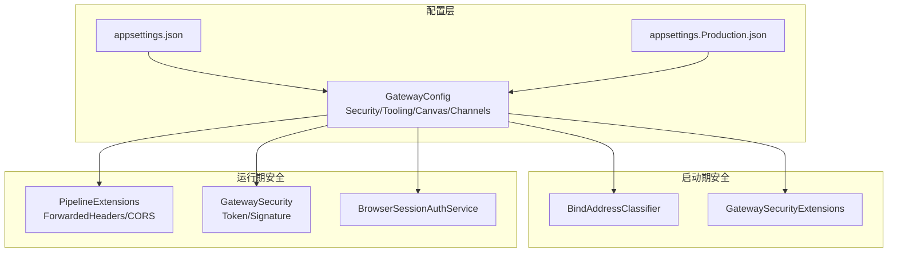
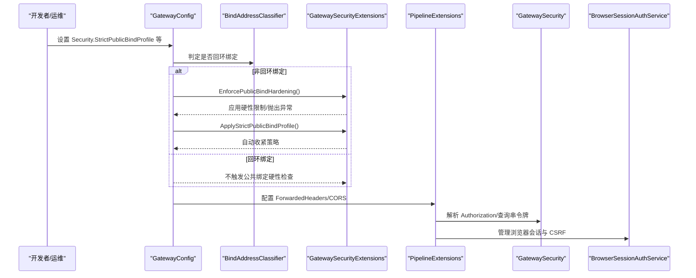
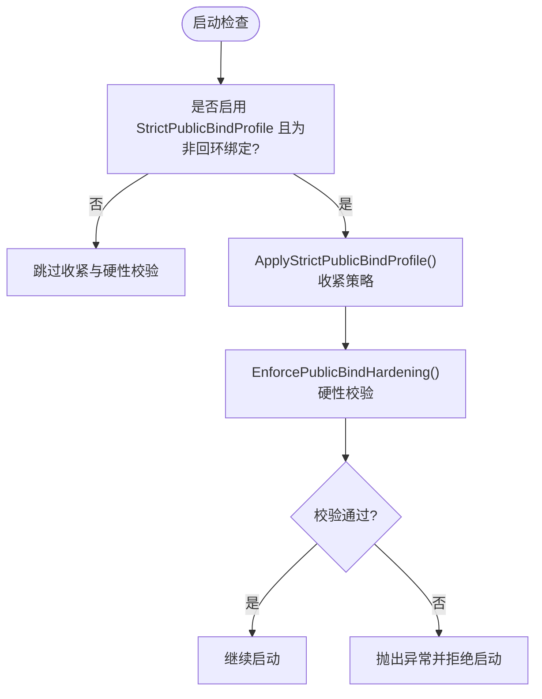
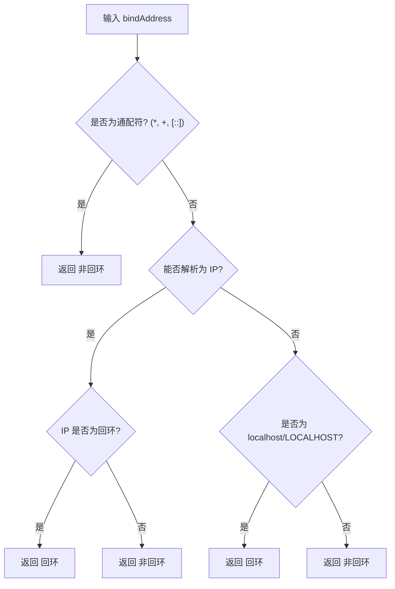
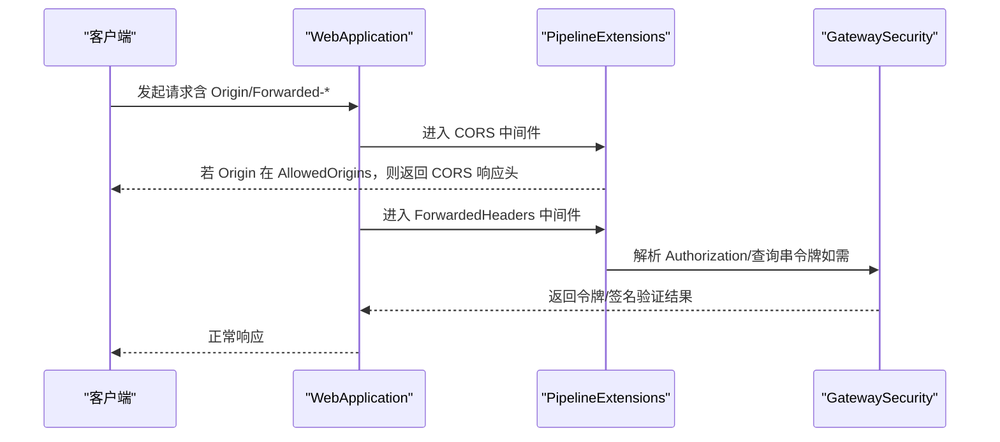
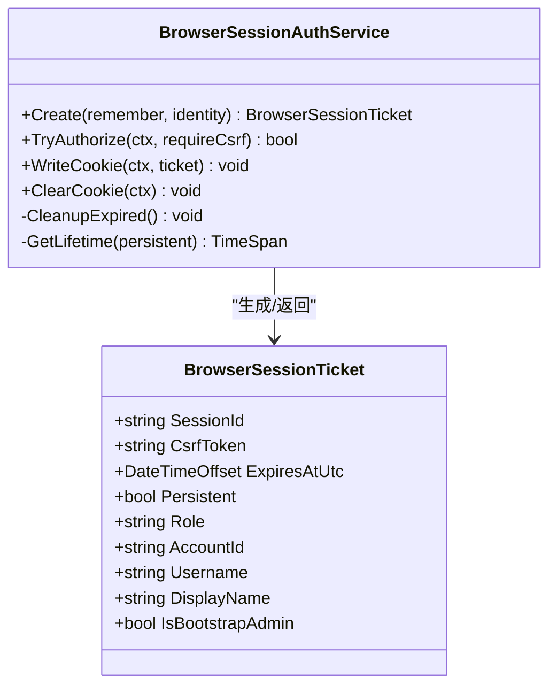
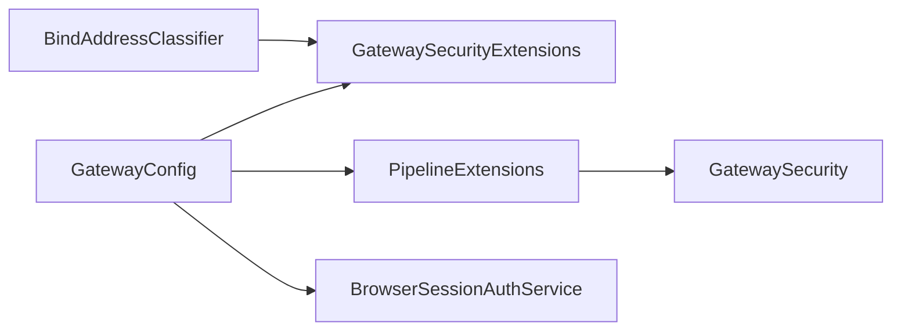

# 网络安全

<cite>
**本文引用的文件**
- [BindAddressClassifier.cs](file://src/OpenClaw.Core/Security/BindAddressClassifier.cs)
- [GatewaySecurityExtensions.cs](file://src/OpenClaw.Gateway/Extensions/GatewaySecurityExtensions.cs)
- [PipelineExtensions.cs](file://src/OpenClaw.Gateway/Pipeline/PipelineExtensions.cs)
- [GatewaySecurity.cs](file://src/OpenClaw.Gateway/GatewaySecurity.cs)
- [BrowserSessionAuthService.cs](file://src/OpenClaw.Gateway/BrowserSessionAuthService.cs)
- [GatewayConfig.cs](file://src/OpenClaw.Core/Models/GatewayConfig.cs)
- [appsettings.json](file://src/OpenClaw.Gateway/appsettings.json)
- [appsettings.Production.json](file://src/OpenClaw.Gateway/appsettings.Production.json)
- [GatewaySecurityTests.cs](file://src/OpenClaw.Tests/GatewaySecurityTests.cs)
- [GatewaySecurityHardeningTests.cs](file://src/OpenClaw.Tests/GatewaySecurityHardeningTests.cs)
- [BindAddressClassifierTests.cs](file://src/OpenClaw.Tests/BindAddressClassifierTests.cs)
- [PRODUCTION_FIXES.md](file://docs/PRODUCTION_FIXES.md)
</cite>

## 目录
1. [简介](#简介)
2. [项目结构](#项目结构)
3. [核心组件](#核心组件)
4. [架构总览](#架构总览)
5. [详细组件分析](#详细组件分析)
6. [依赖关系分析](#依赖关系分析)
7. [性能考量](#性能考量)
8. [故障排查指南](#故障排查指南)
9. [结论](#结论)
10. [附录](#附录)

## 简介
本文件面向网络安全与运维工程人员，系统化梳理并解释本项目的网络安全配置与实现，重点覆盖以下方面：
- 严格公共绑定配置（StrictPublicBindProfile）的工作原理与安全影响：在非回环地址绑定时如何强制启用更严格的策略，以及对工具审批、Canvas、插件桥接等的限制。
- 跨域资源共享（CORS）配置：AllowedOrigins 的作用范围、与转发头处理（Forwarded Headers）的协同。
- 代理信任与转发头处理：TrustForwardedHeaders 与 KnownProxies 的使用场景与边界。
- 浏览器会话管理：BrowserSessionIdleMinutes 与 BrowserRememberDays 的行为与安全影响。
- 生产环境网络安全加固最佳实践：防火墙规则、网络隔离与安全监控建议。

## 项目结构
围绕网络安全的关键代码分布在如下模块：
- 安全配置模型：GatewayConfig 中的 Security、Tooling、Canvas、Channels 等子配置对象。
- 绑定地址分类：BindAddressClassifier 提供是否回环绑定的判定。
- 启动期安全加固：GatewaySecurityExtensions 在非回环绑定时执行硬性校验与默认收紧。
- 请求管线安全：PipelineExtensions 配置转发头与 CORS；GatewaySecurity 提供令牌解析与签名验证工具。
- 浏览器会话服务：BrowserSessionAuthService 实现基于 Cookie 的会话与 CSRF 保护。

图表来源
- [GatewayConfig.cs](file://src/OpenClaw.Core/Models/GatewayConfig.cs)
- [BindAddressClassifier.cs](file://src/OpenClaw.Core/Security/BindAddressClassifier.cs)
- [GatewaySecurityExtensions.cs](file://src/OpenClaw.Gateway/Extensions/GatewaySecurityExtensions.cs)
- [PipelineExtensions.cs](file://src/OpenClaw.Gateway/Pipeline/PipelineExtensions.cs)
- [GatewaySecurity.cs](file://src/OpenClaw.Gateway/GatewaySecurity.cs)
- [BrowserSessionAuthService.cs](file://src/OpenClaw.Gateway/BrowserSessionAuthService.cs)
- [appsettings.json](file://src/OpenClaw.Gateway/appsettings.json)
- [appsettings.Production.json](file://src/OpenClaw.Gateway/appsettings.Production.json)

章节来源
- [GatewayConfig.cs](file://src/OpenClaw.Core/Models/GatewayConfig.cs)
- [appsettings.json](file://src/OpenClaw.Gateway/appsettings.json)
- [appsettings.Production.json](file://src/OpenClaw.Gateway/appsettings.Production.json)

## 核心组件
- 严格公共绑定配置（StrictPublicBindProfile）
  - 当配置开启且为非回环绑定时，自动收紧策略：要求请求者匹配的 HTTP 工具审批、禁止 Canvas 默认启用、强制工具审批、对危险工具（如 shell、process 等）纳入审批白名单。
- 绑定地址分类（IsLoopbackBind）
  - 对通配符与 IP/主机名进行识别，确保“非回环”判断准确，避免误判导致安全策略未生效。
- 转发头与 CORS
  - TrustForwardedHeaders/KnownProxies 控制是否信任上游代理注入的 X-Forwarded-* 头；CORS 通过 AllowedOrigins 限定允许来源，并设置标准响应头。
- 浏览器会话管理
  - 基于 Cookie 的会话票据，支持持久化与非持久化两种模式，结合 CSRF 头保护，生命周期由 BrowserSessionIdleMinutes 与 BrowserRememberDays 控制。

章节来源
- [GatewaySecurityExtensions.cs](file://src/OpenClaw.Gateway/Extensions/GatewaySecurityExtensions.cs)
- [BindAddressClassifier.cs](file://src/OpenClaw.Core/Security/BindAddressClassifier.cs)
- [PipelineExtensions.cs](file://src/OpenClaw.Gateway/Pipeline/PipelineExtensions.cs)
- [BrowserSessionAuthService.cs](file://src/OpenClaw.Gateway/BrowserSessionAuthService.cs)
- [GatewayConfig.cs](file://src/OpenClaw.Core/Models/GatewayConfig.cs)

## 架构总览
下图展示从配置到运行期管线的关键交互路径，突出安全策略在启动期与运行期的落地位置。

图表来源
- [GatewaySecurityExtensions.cs](file://src/OpenClaw.Gateway/Extensions/GatewaySecurityExtensions.cs)
- [BindAddressClassifier.cs](file://src/OpenClaw.Core/Security/BindAddressClassifier.cs)
- [PipelineExtensions.cs](file://src/OpenClaw.Gateway/Pipeline/PipelineExtensions.cs)
- [GatewaySecurity.cs](file://src/OpenClaw.Gateway/GatewaySecurity.cs)
- [BrowserSessionAuthService.cs](file://src/OpenClaw.Gateway/BrowserSessionAuthService.cs)
- [GatewayConfig.cs](file://src/OpenClaw.Core/Models/GatewayConfig.cs)

## 详细组件分析

### 严格公共绑定配置（StrictPublicBindProfile）
- 触发条件
  - 配置项 Security.StrictPublicBindProfile 为真，且 BindAddress 非回环。
- 自动收紧策略
  - 强制开启 RequireRequesterMatchForHttpToolApproval，提升 HTTP 工具调用的请求者匹配强度。
  - 禁止 Canvas 默认启用（若未显式允许），降低前端命令转发风险。
  - 强制 RequireToolApproval，并将 shell、process、write_file、code_exec、git 等危险工具加入审批白名单。
- 启动期硬性校验（EnforcePublicBindHardening）
  - 若 Canvas 在非回环绑定下启用但未显式允许，直接拒绝启动。
  - 若存在不安全的本地工具执行（如 shell/process 或读写根目录为通配），且未显式允许，拒绝启动。
  - 第三方插件桥接（Plugins.*）在非回环绑定下默认拒绝，除非显式允许。
  - 检测并拒绝 raw: 密钥引用（除 Twilio 外），除非显式允许。
  - 各通道（WhatsApp/Twilio/Telegram/Teams/Slack/Discord）在非回环绑定下必须启用对应签名/令牌验证或提供必要凭据，否则拒绝启动。

图表来源
- [GatewaySecurityExtensions.cs](file://src/OpenClaw.Gateway/Extensions/GatewaySecurityExtensions.cs)

章节来源
- [GatewaySecurityExtensions.cs](file://src/OpenClaw.Gateway/Extensions/GatewaySecurityExtensions.cs)
- [GatewaySecurityHardeningTests.cs](file://src/OpenClaw.Tests/GatewaySecurityHardeningTests.cs)

### 绑定地址分类（IsLoopbackBind）
- 判定逻辑
  - 通配符（*、+、[::]）视为非回环。
  - IP 地址使用 IsLoopback 判断。
  - 主机名 localhost/LOCALHOST 视为回环。
- 用途
  - 用于决定是否应用公共绑定安全策略，避免本地开发环境被误伤。

图表来源
- [BindAddressClassifier.cs](file://src/OpenClaw.Core/Security/BindAddressClassifier.cs)

章节来源
- [BindAddressClassifier.cs](file://src/OpenClaw.Core/Security/BindAddressClassifier.cs)
- [BindAddressClassifierTests.cs](file://src/OpenClaw.Tests/BindAddressClassifierTests.cs)

### 跨域资源共享（CORS）与转发头处理
- CORS
  - 当 AllowedOrigins 集合存在时，中间件拦截请求，仅对允许的 Origin 返回 Access-Control-Allow-* 响应头，并设置 Vary=Origin。
  - 预检请求（OPTIONS）直接返回 204。
- 转发头（Forwarded Headers）
  - 当 TrustForwardedHeaders 为真时，启用 X-Forwarded-For 与 X-Forwarded-Proto，并将 KnownProxies 中的可信代理 IP 加入 KnownProxies 列表。
  - 仅在明确信任上游代理时启用，避免客户端伪造源地址。

图表来源
- [PipelineExtensions.cs](file://src/OpenClaw.Gateway/Pipeline/PipelineExtensions.cs)
- [GatewaySecurity.cs](file://src/OpenClaw.Gateway/GatewaySecurity.cs)

章节来源
- [PipelineExtensions.cs](file://src/OpenClaw.Gateway/Pipeline/PipelineExtensions.cs)
- [GatewaySecurity.cs](file://src/OpenClaw.Gateway/GatewaySecurity.cs)
- [appsettings.json](file://src/OpenClaw.Gateway/appsettings.json)
- [appsettings.Production.json](file://src/OpenClaw.Gateway/appsettings.Production.json)

### 浏览器会话管理（BrowserSessionAuthService）
- 会话票据
  - 包含 SessionId、CSRF Token、过期时间、是否持久化、角色与身份信息。
- 生命周期
  - 非持久化：按 BrowserSessionIdleMinutes 计算超时。
  - 持久化：按 BrowserRememberDays 计算有效期。
- Cookie 安全属性
  - HttpOnly=true、SameSite=Lax、Secure=仅 HTTPS、Path=/。
- CSRF 保护
  - 读取请求头 X-CSRF-Token 并与票据内 CSRF Token 常量时间比较，防止跨站请求伪造。

图表来源
- [BrowserSessionAuthService.cs](file://src/OpenClaw.Gateway/BrowserSessionAuthService.cs)

章节来源
- [BrowserSessionAuthService.cs](file://src/OpenClaw.Gateway/BrowserSessionAuthService.cs)
- [GatewaySecurityTests.cs](file://src/OpenClaw.Tests/GatewaySecurityTests.cs)

## 依赖关系分析
- 配置驱动安全策略
  - Security.StrictPublicBindProfile 作为开关，驱动启动期收紧与硬性校验。
  - Security.TrustForwardedHeaders/KnownProxies 决定是否信任上游代理。
  - Security.AllowedOrigins 控制 CORS 允许列表。
- 组件耦合
  - PipelineExtensions 依赖配置中的转发头与 CORS 设置。
  - GatewaySecurityExtensions 依赖配置中的工具、Canvas、Plugins、Channels 等子配置。
  - BrowserSessionAuthService 依赖配置中的会话超时参数。

图表来源
- [GatewayConfig.cs](file://src/OpenClaw.Core/Models/GatewayConfig.cs)
- [GatewaySecurityExtensions.cs](file://src/OpenClaw.Gateway/Extensions/GatewaySecurityExtensions.cs)
- [PipelineExtensions.cs](file://src/OpenClaw.Gateway/Pipeline/PipelineExtensions.cs)
- [GatewaySecurity.cs](file://src/OpenClaw.Gateway/GatewaySecurity.cs)
- [BrowserSessionAuthService.cs](file://src/OpenClaw.Gateway/BrowserSessionAuthService.cs)
- [BindAddressClassifier.cs](file://src/OpenClaw.Core/Security/BindAddressClassifier.cs)

章节来源
- [GatewayConfig.cs](file://src/OpenClaw.Core/Models/GatewayConfig.cs)
- [GatewaySecurityExtensions.cs](file://src/OpenClaw.Gateway/Extensions/GatewaySecurityExtensions.cs)
- [PipelineExtensions.cs](file://src/OpenClaw.Gateway/Pipeline/PipelineExtensions.cs)
- [BrowserSessionAuthService.cs](file://src/OpenClaw.Gateway/BrowserSessionAuthService.cs)
- [BindAddressClassifier.cs](file://src/OpenClaw.Core/Security/BindAddressClassifier.cs)

## 性能考量
- CORS 预检缓存
  - Access-Control-Max-Age 设置为 3600 秒，可减少重复预检请求，降低延迟。
- 转发头解析
  - ForwardLimit=1，避免被滥用的多级代理链导致的头部污染与解析开销。
- 令牌与签名验证
  - 使用常量时间比较与固定长度哈希，避免时序侧信道，同时保持验证成本可控。

## 故障排查指南
- 启动失败：非回环绑定拒绝启动
  - 现象：启动时报错，提示 Canvas/工具/插件/签名验证/原始密钥引用等问题。
  - 排查要点：检查 Security.StrictPublicBindProfile、Canvas.AllowOnPublicBind、Tooling.AllowUnsafeToolingOnPublicBind、Plugins.AllowPluginBridgeOnPublicBind、各通道 ValidateSignature/ValidateToken/ValidateSignature 等。
  - 参考测试用例：GatewaySecurityHardeningTests 中的断言与错误消息。
- CORS 无效或被拒绝
  - 现象：浏览器报跨域错误。
  - 排查要点：确认 AllowedOrigins 是否包含当前前端地址；检查是否正确设置 Origin 头；确认中间件顺序。
- 转发头导致的协议/来源错误
  - 现象：请求被判定为 HTTP 而非 HTTPS，或客户端 IP 显示为代理。
  - 排查要点：确认 TrustForwardedHeaders 与 KnownProxies；仅在可信代理链路中启用。
- 令牌/签名验证失败
  - 现象：Authorization 或签名校验失败。
  - 排查要点：确认令牌格式与前缀；签名是否包含 sha256= 前缀；Hex 格式是否正确。

章节来源
- [GatewaySecurityHardeningTests.cs](file://src/OpenClaw.Tests/GatewaySecurityHardeningTests.cs)
- [GatewaySecurityTests.cs](file://src/OpenClaw.Tests/GatewaySecurityTests.cs)
- [PipelineExtensions.cs](file://src/OpenClaw.Gateway/Pipeline/PipelineExtensions.cs)
- [GatewaySecurity.cs](file://src/OpenClaw.Gateway/GatewaySecurity.cs)

## 结论
本项目通过“配置驱动 + 启动期硬性校验 + 运行期中间件防护”的方式，构建了面向公网部署的网络安全基线。StrictPublicBindProfile 在非回环绑定时强制收紧策略，结合 CORS、转发头与浏览器会话管理，形成完整的边界控制与访问治理闭环。建议在生产环境中严格启用上述安全配置，并配合防火墙、网络隔离与持续监控，以进一步提升整体安全韧性。

## 附录

### 生产环境网络安全加固建议
- 防火墙与网络隔离
  - 仅开放必需端口（如 18789），限制来源 IP 至受信网段。
  - 将网关置于反向代理（Nginx/Traefik）之后，统一处理 TLS、限流与 WAF。
- 代理信任与转发头
  - 仅在可信代理链路启用 TrustForwardedHeaders，并将 KnownProxies 精确到代理节点 IP。
- CORS 策略
  - AllowedOrigins 仅包含受信域名与端口，避免使用通配符。
- 会话与令牌
  - 强制使用 HTTPS Cookie（Secure），启用 HttpOnly 与 SameSite=Lax。
  - 严格限制查询串令牌（AllowQueryStringToken=false），优先使用 Authorization Bearer。
- 监控与告警
  - 关注会话锁数量、持久化失败、速率限制命中与优雅停机耗时等指标，建立阈值告警。

章节来源
- [PRODUCTION_FIXES.md](file://docs/PRODUCTION_FIXES.md)