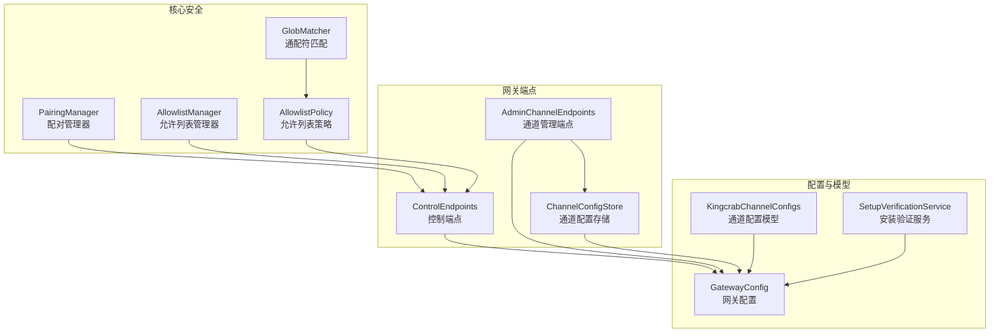
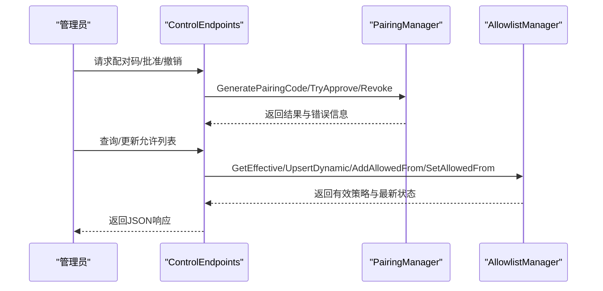
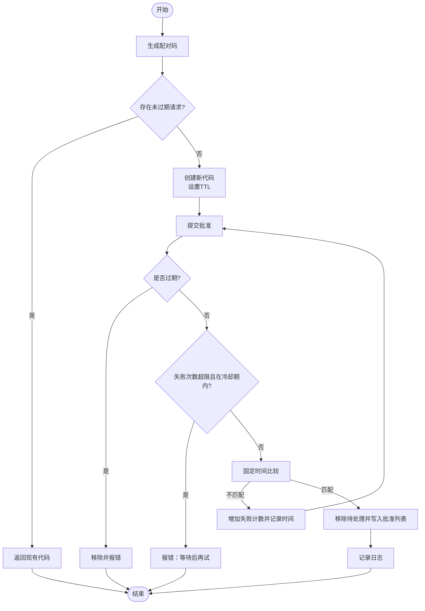
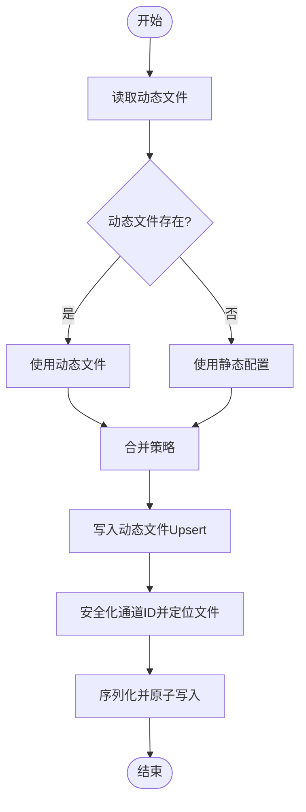
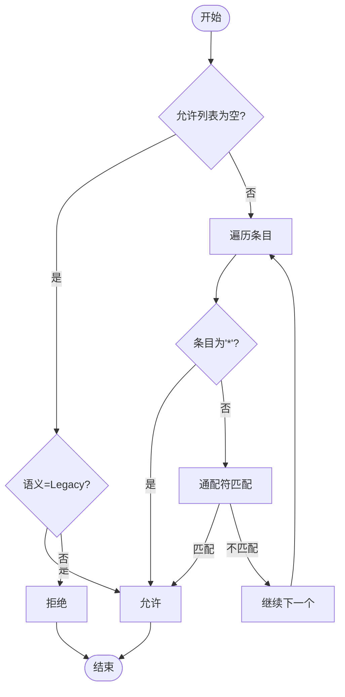
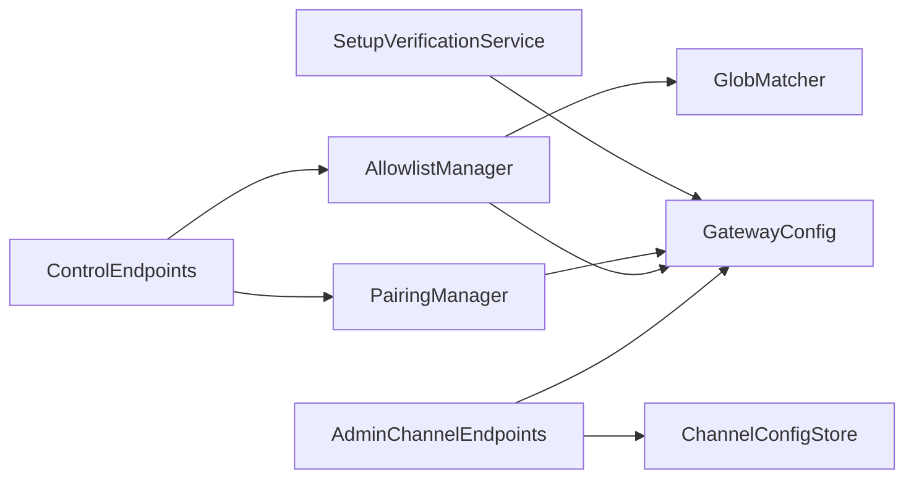

# 访问控制

<cite>
**本文引用的文件**
- [PairingManager.cs](file://src/OpenClaw.Core/Security/PairingManager.cs)
- [AllowlistManager.cs](file://src/OpenClaw.Core/Security/AllowlistManager.cs)
- [AllowlistPolicy.cs](file://src/OpenClaw.Core/Security/AllowlistPolicy.cs)
- [GlobMatcher.cs](file://src/OpenClaw.Core/Security/GlobMatcher.cs)
- [ControlEndpoints.cs](file://src/OpenClaw.Gateway/Endpoints/ControlEndpoints.cs)
- [AdminChannelEndpoints.cs](file://src/OpenClaw.Gateway/Endpoints/AdminChannelEndpoints.cs)
- [ChannelConfigStore.cs](file://src/OpenClaw.Gateway/Channels/ChannelConfigStore.cs)
- [KingcrabChannelConfigs.cs](file://src/OpenClaw.Core/Models/KingcrabChannelConfigs.cs)
- [GatewayConfig.cs](file://src/OpenClaw.Core/Models/GatewayConfig.cs)
- [SetupVerificationService.cs](file://src/OpenClaw.Core/Validation/SetupVerificationService.cs)
- [PairingManagerTests.cs](file://src/OpenClaw.Tests/PairingManagerTests.cs)
- [AllowlistManagerTests.cs](file://src/OpenClaw.Tests/AllowlistManagerTests.cs)
- [AllowlistPolicyTests.cs](file://src/OpenClaw.Tests/AllowlistPolicyTests.cs)
</cite>

## 目录
1. [简介](#简介)
2. [项目结构](#项目结构)
3. [核心组件](#核心组件)
4. [架构总览](#架构总览)
5. [详细组件分析](#详细组件分析)
6. [依赖关系分析](#依赖关系分析)
7. [性能考量](#性能考量)
8. [故障排查指南](#故障排查指南)
9. [结论](#结论)
10. [附录](#附录)

## 简介
本技术文档聚焦于访问控制系统，围绕两大核心机制展开：配对管理（PairingManager）与允许列表管理（AllowlistManager）。文档将深入解释设备配对流程、令牌管理与会话生命周期；详述允许列表策略（AllowlistPolicy）的“legacy”与“strict”语义差异及适用场景；并给出各渠道（SMS、WhatsApp、Teams、Telegram 等）的允许列表配置方法与最佳实践。同时提供多租户环境下的权限管理与安全边界设置建议。

## 项目结构
访问控制相关代码主要分布在以下模块：
- 核心安全模块：PairingManager、AllowlistManager、AllowlistPolicy、GlobMatcher
- 网关端点：ControlEndpoints（配对与允许列表管理接口）、AdminChannelEndpoints（通道配置管理）
- 通道配置模型：KingcrabChannelConfigs、ChannelConfigStore
- 配置模型：GatewayConfig
- 验证与诊断：SetupVerificationService
- 测试用例：PairingManagerTests、AllowlistManagerTests、AllowlistPolicyTests

图表来源
- [PairingManager.cs:1-211](file://src/OpenClaw.Core/Security/PairingManager.cs#L1-L211)
- [AllowlistManager.cs:1-126](file://src/OpenClaw.Core/Security/AllowlistManager.cs#L1-L126)
- [AllowlistPolicy.cs:1-43](file://src/OpenClaw.Core/Security/AllowlistPolicy.cs#L1-L43)
- [GlobMatcher.cs:1-89](file://src/OpenClaw.Core/Security/GlobMatcher.cs#L1-L89)
- [ControlEndpoints.cs:57-130](file://src/OpenClaw.Gateway/Endpoints/ControlEndpoints.cs#L57-L130)
- [AdminChannelEndpoints.cs:18-32](file://src/OpenClaw.Gateway/Endpoints/AdminChannelEndpoints.cs#L18-L32)
- [ChannelConfigStore.cs:16-43](file://src/OpenClaw.Gateway/Channels/ChannelConfigStore.cs#L16-L43)
- [KingcrabChannelConfigs.cs:1-126](file://src/OpenClaw.Core/Models/KingcrabChannelConfigs.cs#L1-L126)
- [GatewayConfig.cs:1-200](file://src/OpenClaw.Core/Models/GatewayConfig.cs#L1-L200)
- [SetupVerificationService.cs:951-976](file://src/OpenClaw.Core/Validation/SetupVerificationService.cs#L951-L976)

章节来源
- [PairingManager.cs:1-211](file://src/OpenClaw.Core/Security/PairingManager.cs#L1-L211)
- [AllowlistManager.cs:1-126](file://src/OpenClaw.Core/Security/AllowlistManager.cs#L1-L126)
- [AllowlistPolicy.cs:1-43](file://src/OpenClaw.Core/Security/AllowlistPolicy.cs#L1-L43)
- [GlobMatcher.cs:1-89](file://src/OpenClaw.Core/Security/GlobMatcher.cs#L1-L89)
- [ControlEndpoints.cs:57-130](file://src/OpenClaw.Gateway/Endpoints/ControlEndpoints.cs#L57-L130)
- [AdminChannelEndpoints.cs:18-32](file://src/OpenClaw.Gateway/Endpoints/AdminChannelEndpoints.cs#L18-L32)
- [ChannelConfigStore.cs:16-43](file://src/OpenClaw.Gateway/Channels/ChannelConfigStore.cs#L16-L43)
- [KingcrabChannelConfigs.cs:1-126](file://src/OpenClaw.Core/Models/KingcrabChannelConfigs.cs#L1-L126)
- [GatewayConfig.cs:1-200](file://src/OpenClaw.Core/Models/GatewayConfig.cs#L1-L200)
- [SetupVerificationService.cs:951-976](file://src/OpenClaw.Core/Validation/SetupVerificationService.cs#L951-L976)

## 核心组件
- 配对管理器（PairingManager）
  - 负责生成一次性配对码、校验配对码、批准/撤销发送者、持久化已批准列表
  - 支持冷却期与失败次数限制，防止暴力破解
  - 使用固定时间比较算法避免时序攻击
- 允许列表管理器（AllowlistManager）
  - 按通道维度维护允许列表，支持静态配置与动态覆盖
  - 动态文件优先于静态配置，便于在线调整
  - 提供并发安全的增删改操作
- 允许列表策略（AllowlistPolicy）
  - 定义“legacy”与“strict”两种语义
  - “legacy”下空白名单视为放行；“strict”下空白名单视为拒绝
  - 结合通配符匹配实现灵活策略
- 通配符匹配（GlobMatcher）
  - 支持“*”通配符，提供前缀/后缀/中间段匹配
  - 提供允许/拒绝评估逻辑（拒绝优先）

章节来源
- [PairingManager.cs:14-144](file://src/OpenClaw.Core/Security/PairingManager.cs#L14-L144)
- [AllowlistManager.cs:19-125](file://src/OpenClaw.Core/Security/AllowlistManager.cs#L19-L125)
- [AllowlistPolicy.cs:9-41](file://src/OpenClaw.Core/Security/AllowlistPolicy.cs#L9-L41)
- [GlobMatcher.cs:3-87](file://src/OpenClaw.Core/Security/GlobMatcher.cs#L3-L87)

## 架构总览
访问控制在网关层通过端点暴露管理能力，并与核心安全模块协作完成策略执行与状态持久化。

图表来源
- [ControlEndpoints.cs:57-130](file://src/OpenClaw.Gateway/Endpoints/ControlEndpoints.cs#L57-L130)
- [PairingManager.cs:53-144](file://src/OpenClaw.Core/Security/PairingManager.cs#L53-L144)
- [AllowlistManager.cs:50-115](file://src/OpenClaw.Core/Security/AllowlistManager.cs#L50-L115)

## 详细组件分析

### 配对管理（PairingManager）
- 关键职责
  - 生成一次性配对码（6位数字），带过期时间
  - 校验提交的配对码，支持失败次数与冷却期限制
  - 批准/撤销发送者，并持久化到磁盘
  - 固定时间比较，抵御时序攻击
- 数据结构与状态
  - 内存缓存：待处理配对（并发字典）、已批准发送者（并发字典）
  - 磁盘持久化：已批准列表JSON文件
- 处理流程
  - 生成配对码：检查是否存在未过期的请求，否则新建并设置TTL
  - 批准流程：校验过期、失败次数与冷却期、固定时间比较，成功则移除待处理并写入批准列表
  - 撤销流程：从批准列表移除并落盘

图表来源
- [PairingManager.cs:53-124](file://src/OpenClaw.Core/Security/PairingManager.cs#L53-L124)

章节来源
- [PairingManager.cs:14-211](file://src/OpenClaw.Core/Security/PairingManager.cs#L14-L211)
- [PairingManagerTests.cs:9-60](file://src/OpenClaw.Tests/PairingManagerTests.cs#L9-L60)

### 允许列表管理（AllowlistManager）
- 关键职责
  - 读取/写入按通道划分的动态允许列表文件
  - 合并静态配置与动态覆盖，动态优先
  - 并发安全地进行增删改操作
- 文件命名与路径
  - 采用通道ID安全化规则，防止目录穿越
  - 默认未知通道使用“unknown.json”
- 有效策略计算
  - 若动态文件存在则以其为准；否则回退到静态配置

图表来源
- [AllowlistManager.cs:32-125](file://src/OpenClaw.Core/Security/AllowlistManager.cs#L32-L125)

章节来源
- [AllowlistManager.cs:19-126](file://src/OpenClaw.Core/Security/AllowlistManager.cs#L19-L126)
- [AllowlistManagerTests.cs:9-42](file://src/OpenClaw.Tests/AllowlistManagerTests.cs#L9-L42)

### 允许列表策略（AllowlistPolicy）
- 语义定义
  - Legacy：空白名单视为允许（历史兼容）
  - Strict：空白名单视为拒绝（安全优先）
- 匹配规则
  - 支持“*”通配符
  - 忽略空白条目
  - 严格区分大小写（默认）
- 评估流程
  - 空白名单：Legacy返回true，Strict返回false
  - 非空：遍历条目，命中“*”或通配符即允许

图表来源
- [AllowlistPolicy.cs:18-40](file://src/OpenClaw.Core/Security/AllowlistPolicy.cs#L18-L40)
- [GlobMatcher.cs:9-63](file://src/OpenClaw.Core/Security/GlobMatcher.cs#L9-L63)

章节来源
- [AllowlistPolicy.cs:3-41](file://src/OpenClaw.Core/Security/AllowlistPolicy.cs#L3-L41)
- [AllowlistPolicyTests.cs:8-32](file://src/OpenClaw.Tests/AllowlistPolicyTests.cs#L8-L32)

### 通配符匹配（GlobMatcher）
- 功能特性
  - 前缀/后缀/中间段匹配，避免Split分配
  - 支持“*”作为任意序列通配
  - 提供允许/拒绝评估（拒绝优先）
- 性能优化
  - Span-based匹配，减少内存分配
  - 快速路径：无通配符时直接比较

章节来源
- [GlobMatcher.cs:3-89](file://src/OpenClaw.Core/Security/GlobMatcher.cs#L3-L89)

### 渠道访问控制策略与配置
- 渠道配置模型
  - Teams/Slack/Discord/Signal/Telegram/WhatsApp/SMS等均支持AllowedFromUserIds/AllowedFromIds/AllowedFromNumbers等字段
  - 支持组策略（GroupPolicy）与提及要求（RequireMentionInGroup）
- 配置来源
  - 静态配置：appsettings中的Channels.*段
  - 动态覆盖：通过管理端点更新通道配置文件
- 管理端点
  - 允许列表快照查询与动态更新
  - 添加最近发送者到允许列表
  - 基于已配对列表收紧允许列表

章节来源
- [KingcrabChannelConfigs.cs:13-126](file://src/OpenClaw.Core/Models/KingcrabChannelConfigs.cs#L13-L126)
- [AdminChannelEndpoints.cs:18-32](file://src/OpenClaw.Gateway/Endpoints/AdminChannelEndpoints.cs#L18-L32)
- [ChannelConfigStore.cs:16-43](file://src/OpenClaw.Gateway/Channels/ChannelConfigStore.cs#L16-L43)
- [ControlEndpoints.cs:75-130](file://src/OpenClaw.Gateway/Endpoints/ControlEndpoints.cs#L75-L130)
- [SetupVerificationService.cs:951-976](file://src/OpenClaw.Core/Validation/SetupVerificationService.cs#L951-L976)

## 依赖关系分析
- 组件耦合
  - ControlEndpoints依赖PairingManager与AllowlistManager执行业务逻辑
  - AllowlistManager依赖GlobMatcher进行策略匹配
  - AdminChannelEndpoints与ChannelConfigStore配合实现通道配置的持久化与热更新
- 外部依赖
  - 配置模型（GatewayConfig、KingcrabChannelConfigs）驱动策略与行为
  - SetupVerificationService提供静态配置层面的允许列表诊断

图表来源
- [ControlEndpoints.cs:57-130](file://src/OpenClaw.Gateway/Endpoints/ControlEndpoints.cs#L57-L130)
- [AdminChannelEndpoints.cs:18-32](file://src/OpenClaw.Gateway/Endpoints/AdminChannelEndpoints.cs#L18-L32)
- [ChannelConfigStore.cs:16-43](file://src/OpenClaw.Gateway/Channels/ChannelConfigStore.cs#L16-L43)
- [GatewayConfig.cs:1-200](file://src/OpenClaw.Core/Models/GatewayConfig.cs#L1-L200)
- [SetupVerificationService.cs:951-976](file://src/OpenClaw.Core/Validation/SetupVerificationService.cs#L951-L976)

章节来源
- [ControlEndpoints.cs:57-130](file://src/OpenClaw.Gateway/Endpoints/ControlEndpoints.cs#L57-L130)
- [AdminChannelEndpoints.cs:18-32](file://src/OpenClaw.Gateway/Endpoints/AdminChannelEndpoints.cs#L18-L32)
- [ChannelConfigStore.cs:16-43](file://src/OpenClaw.Gateway/Channels/ChannelConfigStore.cs#L16-L43)
- [GatewayConfig.cs:1-200](file://src/OpenClaw.Core/Models/GatewayConfig.cs#L1-L200)
- [SetupVerificationService.cs:951-976](file://src/OpenClaw.Core/Validation/SetupVerificationService.cs#L951-L976)

## 性能考量
- 内存与并发
  - PairingManager与AllowlistManager均使用并发字典，降低锁竞争
  - AllowlistManager对每个通道使用独立锁，提升并发度
- I/O与持久化
  - 采用临时文件+原子移动的方式写入，避免部分写入
  - 动态文件读取失败时记录警告而非崩溃
- 匹配效率
  - GlobMatcher使用Span避免字符串分割分配
  - 无通配符时快速路径直接比较

## 故障排查指南
- 配对失败
  - 检查配对码是否过期、失败次数是否超过阈值、是否处于冷却期
  - 确认提交的配对码长度与格式正确
- 允许列表不生效
  - 确认动态文件是否覆盖了静态配置
  - 检查通道ID安全化后的文件名与路径
- 通道配置更新无效
  - 确认管理端点调用成功且返回200
  - 检查通道是否支持热重载（部分通道需重启）
- 安全诊断
  - 使用安装验证服务检查各渠道的允许列表配置状态

章节来源
- [PairingManager.cs:70-124](file://src/OpenClaw.Core/Security/PairingManager.cs#L70-L124)
- [AllowlistManager.cs:32-84](file://src/OpenClaw.Core/Security/AllowlistManager.cs#L32-L84)
- [SetupVerificationService.cs:951-976](file://src/OpenClaw.Core/Validation/SetupVerificationService.cs#L951-L976)

## 结论
访问控制系统通过配对管理与允许列表管理实现了“可审计、可动态调整、可扩展”的安全边界。策略层面提供“legacy”与“strict”两种语义以满足不同安全需求；通道维度的允许列表配置与动态覆盖机制确保在多租户环境下具备灵活的安全边界设置能力。结合管理端点与配置模型，系统在保证安全性的同时兼顾了运维效率。

## 附录

### 实际配置示例（多租户与安全边界）
- 允许列表策略
  - 严格模式（推荐生产）：将“channels.allowlistSemantics”设为“strict”，空白名单默认拒绝
  - 历史兼容（开发/测试）：将“channels.allowlistSemantics”设为“legacy”，空白名单默认允许
- 渠道允许列表
  - Teams：配置AllowedFromIds与GroupPolicy
  - Telegram：配置AllowedFromUserIds
  - WhatsApp：配置AllowedFromIds与DmPolicy（如“pairing”）
  - SMS（Twilio）：配置AllowedFromNumbers
- 动态更新
  - 通过管理端点查询/更新允许列表快照
  - 使用“添加最近发送者”与“基于配对列表收紧”功能快速收敛白名单
- 安全边界建议
  - 对外网绑定启用令牌认证与CSRF保护
  - 为高风险渠道（如SMS/WhatsApp）启用配对策略
  - 定期审计允许列表与配对撤销记录

章节来源
- [GatewayConfig.cs:1-200](file://src/OpenClaw.Core/Models/GatewayConfig.cs#L1-L200)
- [KingcrabChannelConfigs.cs:13-126](file://src/OpenClaw.Core/Models/KingcrabChannelConfigs.cs#L13-L126)
- [ControlEndpoints.cs:75-130](file://src/OpenClaw.Gateway/Endpoints/ControlEndpoints.cs#L75-L130)
- [SetupVerificationService.cs:951-976](file://src/OpenClaw.Core/Validation/SetupVerificationService.cs#L951-L976)