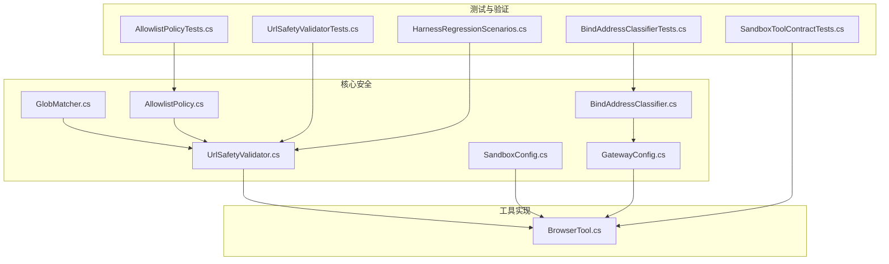
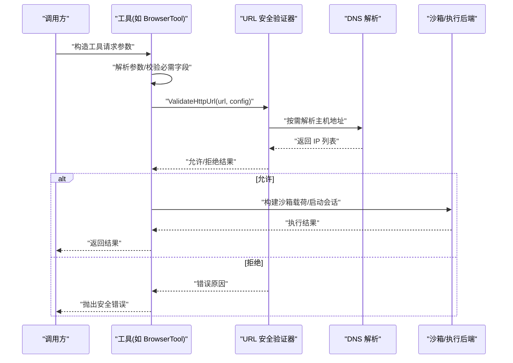
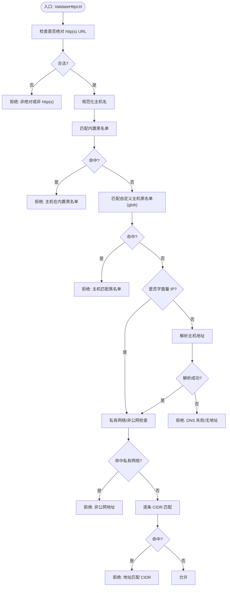
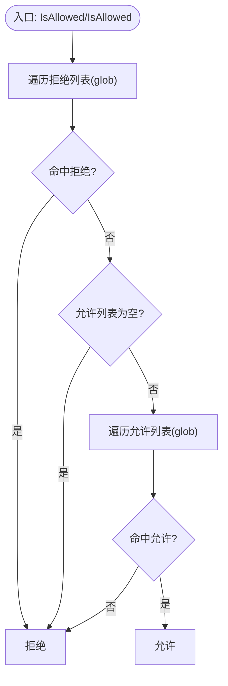
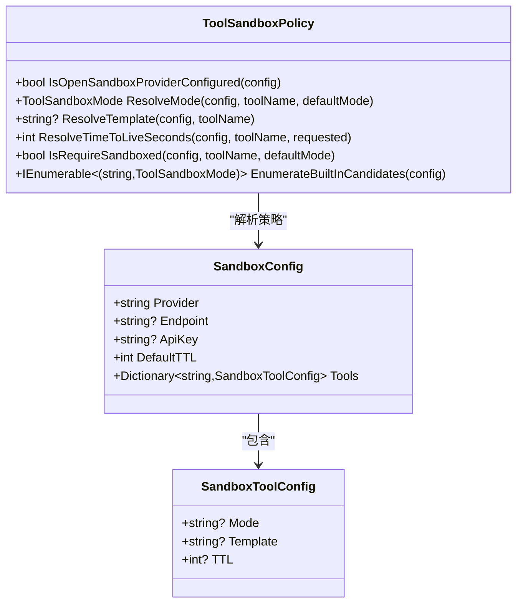
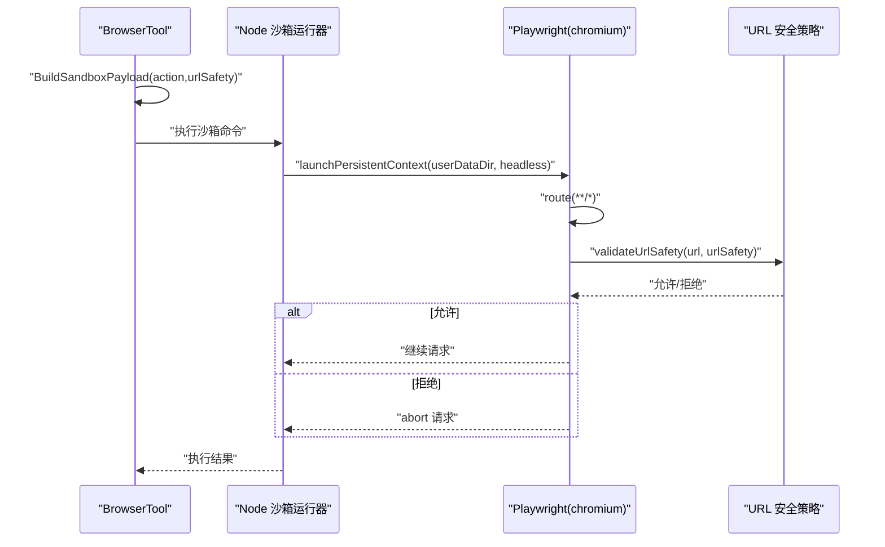
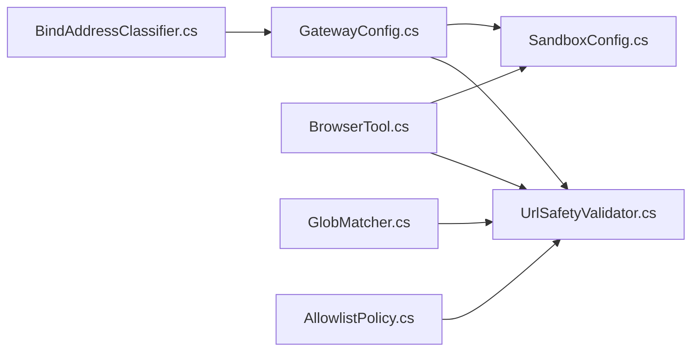

# 安全策略

<cite>
**本文引用的文件**
- [UrlSafetyValidator.cs](file://src/OpenClaw.Core/Security/UrlSafetyValidator.cs)
- [BrowserTool.cs](file://src/OpenClaw.Agent/Tools/BrowserTool.cs)
- [ToolPathPolicy.cs](file://src/OpenClaw.Core/Security/ToolPathPolicy.cs)
- [GlobMatcher.cs](file://src/OpenClaw.Core/Security/GlobMatcher.cs)
- [AllowlistPolicy.cs](file://src/OpenClaw.Core/Security/AllowlistPolicy.cs)
- [BindAddressClassifier.cs](file://src/OpenClaw.Core/Security/BindAddressClassifier.cs)
- [SandboxConfig.cs](file://src/OpenClaw.Core/Models/SandboxConfig.cs)
- [GatewayConfig.cs](file://src/OpenClaw.Core/Models/GatewayConfig.cs)
- [SecurityPostureBuilder.cs](file://src/OpenClaw.Gateway/SecurityPostureBuilder.cs)
- [UrlSafetyValidatorTests.cs](file://src/OpenClaw.Tests/UrlSafetyValidatorTests.cs)
- [SandboxToolContractTests.cs](file://src/OpenClaw.Tests/SandboxToolContractTests.cs)
- [HarnessRegressionScenarios.cs](file://src/OpenClaw.Testing/HarnessRegressionScenarios.cs)
- [AllowlistPolicyTests.cs](file://src/OpenClaw.Tests/AllowlistPolicyTests.cs)
- [BindAddressClassifierTests.cs](file://src/OpenClaw.Tests/BindAddressClassifierTests.cs)
</cite>

## 目录
1. [简介](#简介)
2. [项目结构](#项目结构)
3. [核心组件](#核心组件)
4. [架构总览](#架构总览)
5. [详细组件分析](#详细组件分析)
6. [依赖关系分析](#依赖关系分析)
7. [性能考量](#性能考量)
8. [故障排查指南](#故障排查指南)
9. [结论](#结论)
10. [附录](#附录)

## 简介
本文件系统化阐述本仓库中的安全策略与实现，覆盖以下方面：
- 路径策略：工作空间限制、根目录白名单、路径通配符匹配、路径访问控制
- URL 安全策略：URL 验证机制、私有网络阻断、CIDR 范围过滤、主机域名黑名单
- 工具执行安全：Shell/命令允许列表、禁止路径配置、只读模式、安全沙箱
- 浏览器工具安全：无头模式、评估权限控制、安全上下文
- 安全策略配置示例、最佳实践与常见威胁防护

## 项目结构
围绕安全策略的关键代码分布在以下模块：
- 核心安全模型与策略：OpenClaw.Core/Security 与 Models
- 工具实现与沙箱集成：OpenClaw.Agent/Tools 与 OpenClaw.Gateway
- 测试与回归校验：OpenClaw.Tests 与 OpenClaw.Testing

图表来源
- [UrlSafetyValidator.cs:1-219](file://src/OpenClaw.Core/Security/UrlSafetyValidator.cs#L1-L219)
- [GlobMatcher.cs:1-89](file://src/OpenClaw.Core/Security/GlobMatcher.cs#L1-L89)
- [AllowlistPolicy.cs:1-43](file://src/OpenClaw.Core/Security/AllowlistPolicy.cs#L1-L43)
- [BindAddressClassifier.cs:1-19](file://src/OpenClaw.Core/Security/BindAddressClassifier.cs#L1-L19)
- [SandboxConfig.cs:1-168](file://src/OpenClaw.Core/Models/SandboxConfig.cs#L1-L168)
- [GatewayConfig.cs:371-378](file://src/OpenClaw.Core/Models/GatewayConfig.cs#L371-L378)
- [BrowserTool.cs:1-653](file://src/OpenClaw.Agent/Tools/BrowserTool.cs#L1-L653)
- [UrlSafetyValidatorTests.cs:38-77](file://src/OpenClaw.Tests/UrlSafetyValidatorTests.cs#L38-L77)
- [SandboxToolContractTests.cs:69-104](file://src/OpenClaw.Tests/SandboxToolContractTests.cs#L69-L104)
- [HarnessRegressionScenarios.cs:268-284](file://src/OpenClaw.Testing/HarnessRegressionScenarios.cs#L268-L284)
- [AllowlistPolicyTests.cs:1-33](file://src/OpenClaw.Tests/AllowlistPolicyTests.cs#L1-L33)
- [BindAddressClassifierTests.cs:1-24](file://src/OpenClaw.Tests/BindAddressClassifierTests.cs#L1-L24)

章节来源
- [UrlSafetyValidator.cs:1-219](file://src/OpenClaw.Core/Security/UrlSafetyValidator.cs#L1-L219)
- [BrowserTool.cs:1-653](file://src/OpenClaw.Agent/Tools/BrowserTool.cs#L1-L653)
- [SandboxConfig.cs:1-168](file://src/OpenClaw.Core/Models/SandboxConfig.cs#L1-L168)
- [GatewayConfig.cs:371-378](file://src/OpenClaw.Core/Models/GatewayConfig.cs#L371-L378)

## 核心组件
- URL 安全验证器：提供绝对 http(s) URL 的预检、主机黑名单、私有网络阻断、CIDR 过滤与 DNS 解析校验
- 通配符匹配器：支持 “*” 通配的高效匹配与“先否后允”的允许/拒绝判定
- 允许清单策略：支持“严格/传统”两种语义，空即“严格下拒绝、传统下允许”
- 绑定地址分类器：识别非回环绑定，用于安全加固策略
- 沙箱配置与策略：定义沙箱提供方、工具级模式、模板与 TTL，以及内置候选高风险工具
- 浏览器工具：基于 Playwright 的无头浏览器，支持 URL 安全策略注入与评估权限控制

章节来源
- [UrlSafetyValidator.cs:17-135](file://src/OpenClaw.Core/Security/UrlSafetyValidator.cs#L17-L135)
- [GlobMatcher.cs:3-86](file://src/OpenClaw.Core/Security/GlobMatcher.cs#L3-L86)
- [AllowlistPolicy.cs:9-41](file://src/OpenClaw.Core/Security/AllowlistPolicy.cs#L9-L41)
- [BindAddressClassifier.cs:5-18](file://src/OpenClaw.Core/Security/BindAddressClassifier.cs#L5-L18)
- [SandboxConfig.cs:48-166](file://src/OpenClaw.Core/Models/SandboxConfig.cs#L48-L166)
- [BrowserTool.cs:17-282](file://src/OpenClaw.Agent/Tools/BrowserTool.cs#L17-L282)

## 架构总览
安全策略在运行时通过“前置校验 + 动态决策”的方式贯穿工具调用链路，确保对外部资源访问与本地执行具备最小授权。

图表来源
- [BrowserTool.cs:605-695](file://src/OpenClaw.Agent/Tools/BrowserTool.cs#L605-L695)
- [UrlSafetyValidator.cs:27-111](file://src/OpenClaw.Core/Security/UrlSafetyValidator.cs#L27-L111)

## 详细组件分析

### URL 安全策略（验证机制、私有网络阻断、CIDR 过滤、主机黑名单）
- 预检规则
  - 仅允许绝对 http/https URL；空主机或非法协议直接拒绝
  - 内置主机黑名单：localhost 及其通配、metadata、metadata.google.internal
  - 支持自定义主机通配黑名单（glob）
- 私有网络阻断
  - 当启用 BlockPrivateNetworkTargets 时，对回环、0.0.0.0、IPv6 未指定、多播、链路本地等非公网地址进行阻断
- CIDR 范围过滤
  - 对解析到的每个地址进行 CIDR 匹配，命中即拒绝
- DNS 解析与容错
  - 解析失败或无地址返回明确拒绝原因
- 结果封装
  - 返回 Allow/Deny 与可诊断原因，并可转换为工具错误消息

图表来源
- [UrlSafetyValidator.cs:60-135](file://src/OpenClaw.Core/Security/UrlSafetyValidator.cs#L60-L135)

章节来源
- [UrlSafetyValidator.cs:17-135](file://src/OpenClaw.Core/Security/UrlSafetyValidator.cs#L17-L135)
- [UrlSafetyValidatorTests.cs:38-77](file://src/OpenClaw.Tests/UrlSafetyValidatorTests.cs#L38-L77)
- [HarnessRegressionScenarios.cs:268-284](file://src/OpenClaw.Testing/HarnessRegressionScenarios.cs#L268-L284)

### 路径策略（工作空间限制、根目录白名单、通配符匹配、访问控制）
- 设计意图
  - 提供文件系统读写访问的白名单/黑名单控制，避免工具越权访问任意路径
  - 通过通配符匹配与“先否后允”策略，兼顾灵活性与安全性
- 关键能力
  - 通配符匹配：支持 “*” 作为任意序列匹配
  - 允许/拒绝判定：拒绝优先于允许，空允许列表默认拒绝
  - 语义切换：允许清单支持“严格/传统”两种语义
- 实现要点
  - 通过 GlobMatcher 与 AllowlistPolicy 提供统一匹配与判定逻辑
  - ToolPathPolicy（当前为占位注释）体现了“根目录白名单 + 解析真实路径 + 存在性处理”的设计思路

图表来源
- [GlobMatcher.cs:68-86](file://src/OpenClaw.Core/Security/GlobMatcher.cs#L68-L86)
- [AllowlistPolicy.cs:18-40](file://src/OpenClaw.Core/Security/AllowlistPolicy.cs#L18-L40)
- [ToolPathPolicy.cs:1-136](file://src/OpenClaw.Core/Security/ToolPathPolicy.cs#L1-L136)

章节来源
- [GlobMatcher.cs:3-86](file://src/OpenClaw.Core/Security/GlobMatcher.cs#L3-L86)
- [AllowlistPolicy.cs:9-41](file://src/OpenClaw.Core/Security/AllowlistPolicy.cs#L9-L41)
- [ToolPathPolicy.cs:5-136](file://src/OpenClaw.Core/Security/ToolPathPolicy.cs#L5-L136)
- [AllowlistPolicyTests.cs:1-33](file://src/OpenClaw.Tests/AllowlistPolicyTests.cs#L1-L33)

### 工具执行安全（Shell/命令允许列表、禁止路径、只读模式、安全沙箱）
- Shell/命令允许列表
  - 通过工具集配置与工具动作描述，结合审批策略，限定可执行工具与动作
- 禁止路径
  - 通过路径策略的根目录白名单与通配符匹配，限制读写范围
- 只读模式
  - GatewayConfig 中提供只读模式开关，影响工具集可用性与动作属性
- 安全沙箱
  - SandboxConfig 定义沙箱提供方、工具级模式（None/Prefer/Require）、模板与 TTL
  - 内置候选高风险工具集合：process、shell、code_exec、browser
  - 安全加固：当以非回环地址暴露服务时，若未满足“必须沙箱化”要求则拒绝启动

图表来源
- [SandboxConfig.cs:3-168](file://src/OpenClaw.Core/Models/SandboxConfig.cs#L3-L168)
- [GatewayConfig.cs:349-378](file://src/OpenClaw.Core/Models/GatewayConfig.cs#L349-L378)

章节来源
- [SandboxConfig.cs:48-166](file://src/OpenClaw.Core/Models/SandboxConfig.cs#L48-L166)
- [GatewayConfig.cs:349-378](file://src/OpenClaw.Core/Models/GatewayConfig.cs#L349-L378)
- [SecurityPostureBuilder.cs:103-127](file://src/OpenClaw.Gateway/SecurityPostureBuilder.cs#L103-L127)
- [SandboxToolContractTests.cs:69-104](file://src/OpenClaw.Tests/SandboxToolContractTests.cs#L69-L104)

### 浏览器工具安全（无头模式、评估权限控制、安全上下文）
- 无头模式
  - 由配置决定是否启用无头模式，降低交互暴露面
- 评估权限控制
  - 默认禁用 JavaScript 评估；可通过配置显式开启
- 安全上下文
  - 在沙箱中启动持久化用户数据目录，注入 URL 安全策略，拦截不合规请求
  - 通过路由钩子在进入页面前进行 URL 安全校验

图表来源
- [BrowserTool.cs:182-200](file://src/OpenClaw.Agent/Tools/BrowserTool.cs#L182-L200)
- [BrowserTool.cs:605-695](file://src/OpenClaw.Agent/Tools/BrowserTool.cs#L605-L695)
- [UrlSafetyValidator.cs:27-111](file://src/OpenClaw.Core/Security/UrlSafetyValidator.cs#L27-L111)

章节来源
- [BrowserTool.cs:17-282](file://src/OpenClaw.Agent/Tools/BrowserTool.cs#L17-L282)
- [BrowserTool.cs:605-695](file://src/OpenClaw.Agent/Tools/BrowserTool.cs#L605-L695)
- [SandboxToolContractTests.cs:69-104](file://src/OpenClaw.Tests/SandboxToolContractTests.cs#L69-L104)

## 依赖关系分析
- 工具层依赖安全策略
  - BrowserTool 在构建沙箱请求时注入 URL 安全配置，并在执行前进行 URL 校验
- 策略层依赖通用匹配与分类
  - URL 安全策略依赖 GlobMatcher 与 BindAddressClassifier
- 配置层驱动行为
  - GatewayConfig 与 SandboxConfig 决定策略启用、工具可用性与沙箱模式

图表来源
- [GatewayConfig.cs:371-378](file://src/OpenClaw.Core/Models/GatewayConfig.cs#L371-L378)
- [UrlSafetyValidator.cs:17-135](file://src/OpenClaw.Core/Security/UrlSafetyValidator.cs#L17-L135)
- [SandboxConfig.cs:48-166](file://src/OpenClaw.Core/Models/SandboxConfig.cs#L48-L166)
- [BrowserTool.cs:605-695](file://src/OpenClaw.Agent/Tools/BrowserTool.cs#L605-L695)
- [GlobMatcher.cs:3-86](file://src/OpenClaw.Core/Security/GlobMatcher.cs#L3-L86)
- [AllowlistPolicy.cs:9-41](file://src/OpenClaw.Core/Security/AllowlistPolicy.cs#L9-L41)
- [BindAddressClassifier.cs:5-18](file://src/OpenClaw.Core/Security/BindAddressClassifier.cs#L5-L18)

章节来源
- [GatewayConfig.cs:371-378](file://src/OpenClaw.Core/Models/GatewayConfig.cs#L371-L378)
- [UrlSafetyValidator.cs:17-135](file://src/OpenClaw.Core/Security/UrlSafetyValidator.cs#L17-L135)
- [SandboxConfig.cs:48-166](file://src/OpenClaw.Core/Models/SandboxConfig.cs#L48-L166)
- [BrowserTool.cs:605-695](file://src/OpenClaw.Agent/Tools/BrowserTool.cs#L605-L695)

## 性能考量
- URL 安全校验
  - DNS 解析为异步操作，建议在批量请求场景中复用解析结果或缓存
  - IPv4/IPv6 映射与 CIDR 计算为轻量 CPU 操作，通常可忽略
- 通配符匹配
  - GlobMatcher 使用 Span 避免 Split 分割带来的分配，适合高频匹配
- 沙箱启动
  - Node/Playwright 启动成本较高，建议合理设置 TTL 与模板复用

## 故障排查指南
- URL 被阻断
  - 检查是否为绝对 http(s) URL、主机是否命中内置/自定义黑名单、是否解析到私有网络或被 CIDR 拦截
  - 参考测试用例定位问题场景
- 浏览器工具报错
  - 确认已启用浏览器工具且具备执行后端或本地执行能力
  - 若禁用了评估功能，避免使用 evaluate 动作
- 沙箱相关
  - 非回环绑定时，高风险工具需配置为“必须沙箱化”，否则启动会被拒绝
  - 确保沙箱提供方配置正确、模板与 TTL 设置合理

章节来源
- [UrlSafetyValidatorTests.cs:38-77](file://src/OpenClaw.Tests/UrlSafetyValidatorTests.cs#L38-L77)
- [SandboxToolContractTests.cs:69-104](file://src/OpenClaw.Tests/SandboxToolContractTests.cs#L69-L104)
- [SecurityPostureBuilder.cs:103-127](file://src/OpenClaw.Gateway/SecurityPostureBuilder.cs#L103-L127)
- [BindAddressClassifierTests.cs:1-24](file://src/OpenClaw.Tests/BindAddressClassifierTests.cs#L1-L24)

## 结论
本项目通过“前置校验 + 动态决策 + 沙箱隔离”的组合拳，实现了对 URL 外部访问、文件系统路径、工具执行与浏览器交互的多维安全控制。建议在生产环境中：
- 默认启用 URL 安全策略与私有网络阻断
- 对高风险工具（shell/code_exec/browser/process）强制沙箱化
- 使用严格允许清单语义，避免历史兼容导致的宽泛放行
- 对非回环绑定进行安全加固，必要时关闭第三方插件桥接

## 附录

### 安全策略配置示例（说明性）
- URL 安全
  - 开启：Tooling.UrlSafety.Enabled=true
  - 阻断私网：Tooling.UrlSafety.BlockPrivateNetworkTargets=true
  - 自定义黑名单：Tooling.UrlSafety.BlockedHostGlobs=["*.internal","intranet.*"]
  - CIDR 过滤：Tooling.UrlSafety.BlockedCidrs=["10.0.0.0/8","172.16.0.0/12","192.168.0.0/16","fc00::/7"]
- 沙箱
  - 提供方：Sandbox.Provider=OpenSandbox
  - 工具模式：Sandbox.Tools.shell.Mode=Require
  - 模板与 TTL：Sandbox.Tools.shell.Template=镜像URI；Sandbox.Tools.shell.TTL=秒
- 浏览器
  - 无头：Tooling.BrowserHeadless=true
  - 评估：Tooling.AllowBrowserEvaluate=false（默认）
- 路径策略
  - 严格语义：AllowlistPolicy.ParseSemantics(strict)
  - 允许列表：["/safe/root/*"]，拒绝列表：["/safe/root/secret/*"]

### 最佳实践
- 以“默认拒绝”为原则，仅在受控范围内开放例外
- 对外部网络访问实施最小权限：仅允许必要域名与 CIDR
- 将高风险工具全部置于沙箱内执行，避免直接宿主环境执行
- 对非回环绑定的服务，强制要求“必须沙箱化”策略
- 定期审查与审计 URL 安全策略与工具集配置