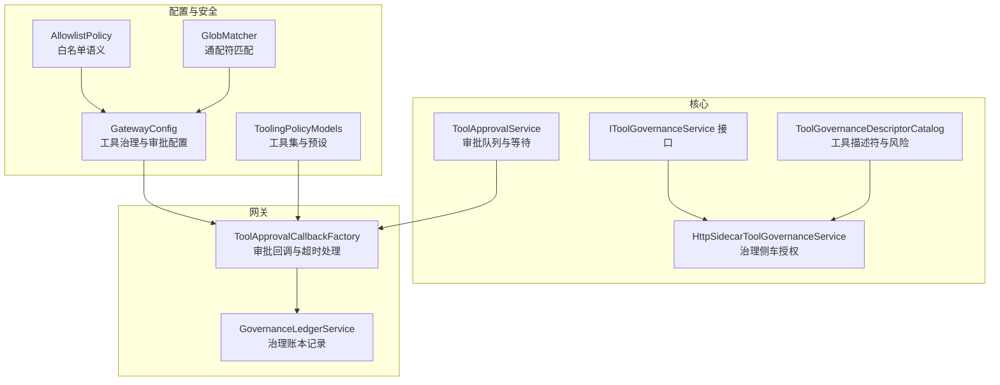
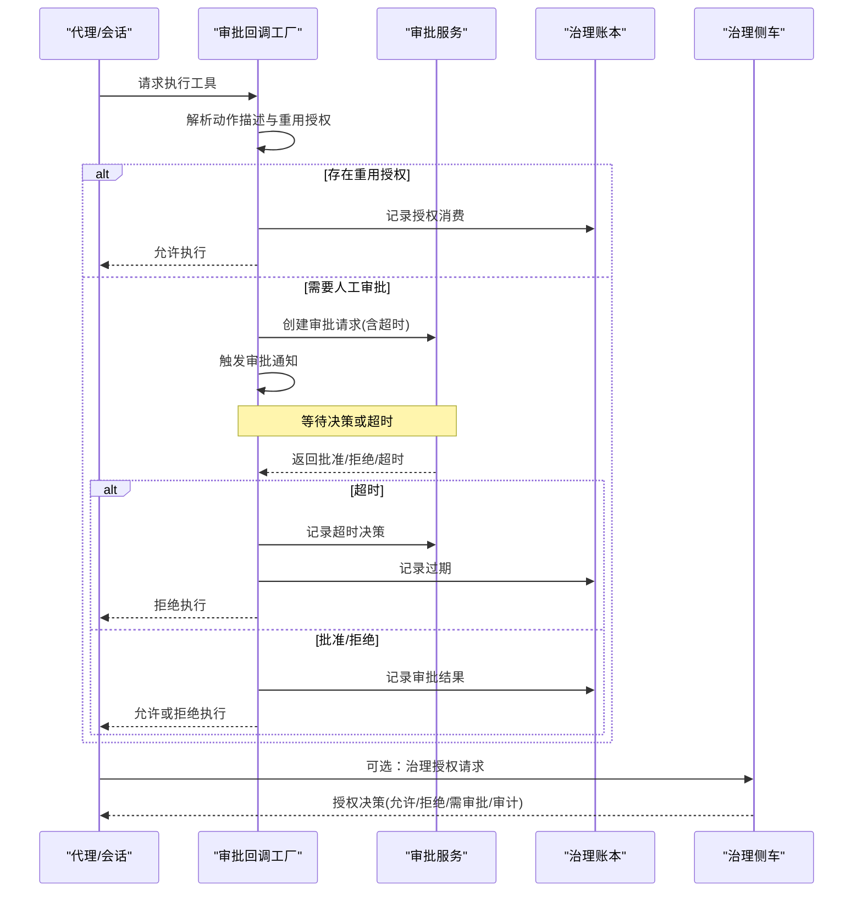
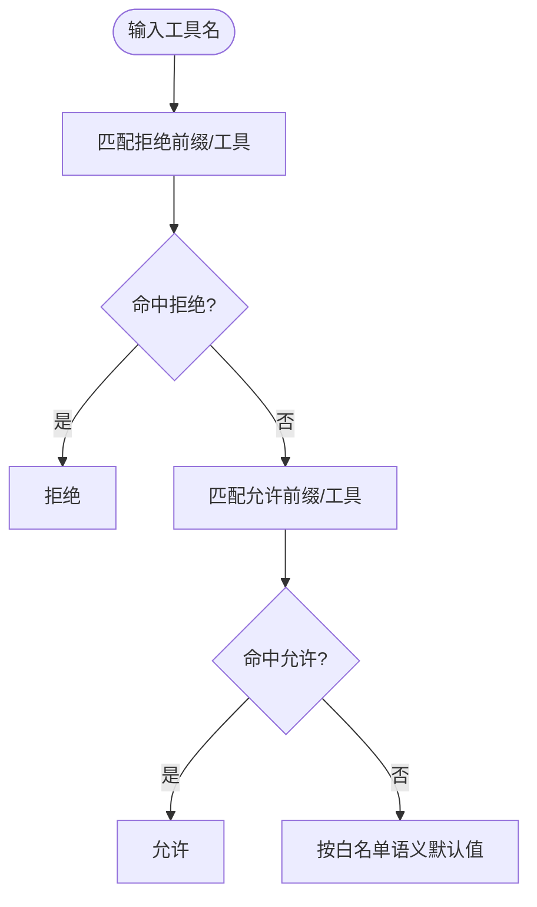
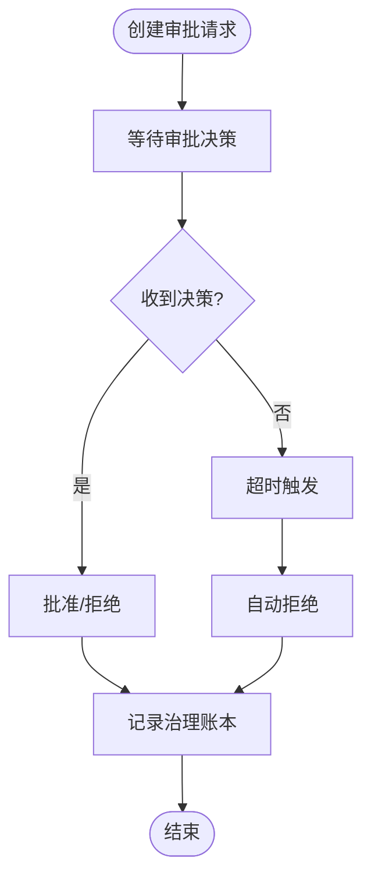
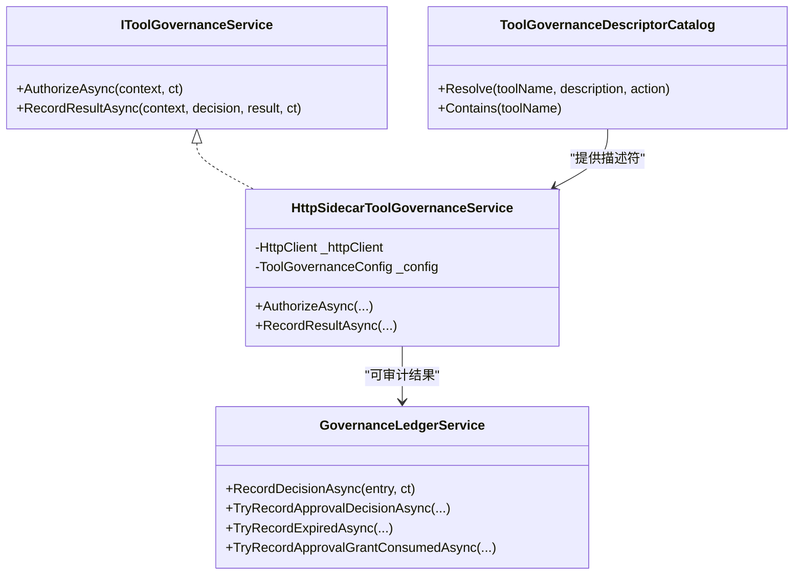
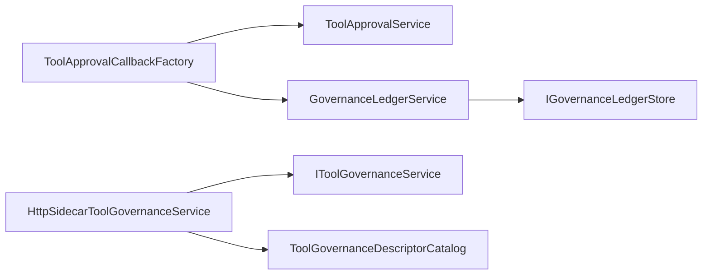

# 审批工作流

<cite>
**本文引用的文件**
- [ToolApprovalService.cs](file://src/OpenClaw.Core/Pipeline/ToolApprovalService.cs)
- [ToolApprovalCallbackFactory.cs](file://src/OpenClaw.Gateway/ToolApprovalCallbackFactory.cs)
- [ToolGovernanceDescriptorCatalog.cs](file://src/OpenClaw.Core/Governance/ToolGovernanceDescriptorCatalog.cs)
- [HttpSidecarToolGovernanceService.cs](file://src/OpenClaw.Core/Governance/HttpSidecarToolGovernanceService.cs)
- [IToolGovernanceService.cs](file://src/OpenClaw.Core/Abstractions/IToolGovernanceService.cs)
- [ToolingPolicyModels.cs](file://src/OpenClaw.Core/Models/ToolingPolicyModels.cs)
- [GatewayConfig.cs](file://src/OpenClaw.Core/Models/GatewayConfig.cs)
- [ToolGovernanceModels.cs](file://src/OpenClaw.Core/Models/ToolGovernanceModels.cs)
- [GovernanceLedgerService.cs](file://src/OpenClaw.Gateway/GovernanceLedgerService.cs)
- [GovernanceLedgerModels.cs](file://src/OpenClaw.Core/Models/GovernanceLedgerModels.cs)
- [AllowlistPolicy.cs](file://src/OpenClaw.Core/Security/AllowlistPolicy.cs)
- [GlobMatcher.cs](file://src/OpenClaw.Core/Security/GlobMatcher.cs)
- [ToolApprovalServiceTests.cs](file://src/OpenClaw.Tests/ToolApprovalServiceTests.cs)
- [HarnessRegressionScenarios.cs](file://src/OpenClaw.Testing/HarnessRegressionScenarios.cs)
- [AdminEndpoints.Support.cs](file://src/OpenClaw.Gateway/Endpoints/AdminEndpoints.Support.cs)
</cite>

## 目录
1. [简介](#简介)
2. [项目结构](#项目结构)
3. [核心组件](#核心组件)
4. [架构总览](#架构总览)
5. [详细组件分析](#详细组件分析)
6. [依赖关系分析](#依赖关系分析)
7. [性能考量](#性能考量)
8. [故障排查指南](#故障排查指南)
9. [结论](#结论)
10. [附录](#附录)

## 简介
本文件系统化阐述 Kingcrab 项目中的“审批工作流”技术方案，覆盖以下主题：
- 审批模式：只读模式、监督模式、完全自主模式的配置与影响
- 审批工具集：高风险工具识别、审批工具白名单与黑名单
- 审批超时：审批等待时间、超时处理策略与自动拒绝机制
- 工具治理服务：治理策略配置、合规性检查与审计日志
- 自定义配置、审批规则与异常处理

目标是帮助开发者与运维人员快速理解并正确配置审批工作流，确保在不同安全级别下实现可控、可观测、可追溯的工具执行。

## 项目结构
审批工作流相关代码主要分布在以下模块：
- 核心管道与审批服务：OpenClaw.Core/Pipeline（审批队列、等待与决策）
- 网关层审批回调工厂：OpenClaw.Gateway（审批请求创建、超时处理、审计与治理记录）
- 工具治理与描述符：OpenClaw.Core/Governance（内置工具风险等级、能力与治理动作映射）
- 配置模型：OpenClaw.Core/Models（工具治理配置、工具集与策略模型、网关配置）
- 安全策略与匹配器：OpenClaw.Core/Security（白名单语义、通配符匹配）
- 测试与回归场景：OpenClaw.Tests 与 OpenClaw.Testing（验证审批超时、策略覆盖等）

图表来源
- [ToolApprovalService.cs:49-264](file://src/OpenClaw.Core/Pipeline/ToolApprovalService.cs#L49-L264)
- [ToolApprovalCallbackFactory.cs:8-171](file://src/OpenClaw.Gateway/ToolApprovalCallbackFactory.cs#L8-L171)
- [ToolGovernanceDescriptorCatalog.cs:5-181](file://src/OpenClaw.Core/Governance/ToolGovernanceDescriptorCatalog.cs#L5-L181)
- [HttpSidecarToolGovernanceService.cs:8-236](file://src/OpenClaw.Core/Governance/HttpSidecarToolGovernanceService.cs#L8-L236)
- [GatewayConfig.cs:412-457](file://src/OpenClaw.Core/Models/GatewayConfig.cs#L412-L457)
- [ToolingPolicyModels.cs:3-44](file://src/OpenClaw.Core/Models/ToolingPolicyModels.cs#L3-L44)
- [AllowlistPolicy.cs:9-42](file://src/OpenClaw.Core/Security/AllowlistPolicy.cs#L9-L42)
- [GlobMatcher.cs:3-89](file://src/OpenClaw.Core/Security/GlobMatcher.cs#L3-L89)
- [GovernanceLedgerService.cs:10-554](file://src/OpenClaw.Gateway/GovernanceLedgerService.cs#L10-L554)

章节来源
- [GatewayConfig.cs:412-457](file://src/OpenClaw.Core/Models/GatewayConfig.cs#L412-L457)
- [ToolingPolicyModels.cs:3-44](file://src/OpenClaw.Core/Models/ToolingPolicyModels.cs#L3-L44)

## 核心组件
- 审批服务（ToolApprovalService）：内存队列管理待审批请求，支持超时取消、决策记录与查询。
- 审批回调工厂（ToolApprovalCallbackFactory）：根据配置生成审批回调，处理重用审批授权、创建审批请求、超时自动拒绝与治理账本记录。
- 工具治理描述符（ToolGovernanceDescriptorCatalog）：内置工具的风险等级、能力与是否需要审批的判定依据。
- 治理侧车服务（HttpSidecarToolGovernanceService）：调用外部治理侧车进行授权决策，支持失败闭合/开合策略与审计上报。
- 治理账本服务（GovernanceLedgerService）：持久化与规范化治理决策，支持撤销、过期与审计事件追加。
- 配置模型（GatewayConfig、ToolingPolicyModels、ToolGovernanceModels）：统一承载审批模式、工具集、治理策略与超时配置。

章节来源
- [ToolApprovalService.cs:49-264](file://src/OpenClaw.Core/Pipeline/ToolApprovalService.cs#L49-L264)
- [ToolApprovalCallbackFactory.cs:8-171](file://src/OpenClaw.Gateway/ToolApprovalCallbackFactory.cs#L8-L171)
- [ToolGovernanceDescriptorCatalog.cs:5-181](file://src/OpenClaw.Core/Governance/ToolGovernanceDescriptorCatalog.cs#L5-L181)
- [HttpSidecarToolGovernanceService.cs:8-236](file://src/OpenClaw.Core/Governance/HttpSidecarToolGovernanceService.cs#L8-L236)
- [GovernanceLedgerService.cs:10-554](file://src/OpenClaw.Gateway/GovernanceLedgerService.cs#L10-L554)
- [GatewayConfig.cs:412-457](file://src/OpenClaw.Core/Models/GatewayConfig.cs#L412-L457)
- [ToolingPolicyModels.cs:3-44](file://src/OpenClaw.Core/Models/ToolingPolicyModels.cs#L3-L44)
- [ToolGovernanceModels.cs:24-93](file://src/OpenClaw.Core/Models/ToolGovernanceModels.cs#L24-L93)

## 架构总览
审批工作流的关键交互如下：

图表来源
- [ToolApprovalCallbackFactory.cs:42-146](file://src/OpenClaw.Gateway/ToolApprovalCallbackFactory.cs#L42-L146)
- [ToolApprovalService.cs:65-218](file://src/OpenClaw.Core/Pipeline/ToolApprovalService.cs#L65-L218)
- [GovernanceLedgerService.cs:48-176](file://src/OpenClaw.Gateway/GovernanceLedgerService.cs#L48-L176)
- [HttpSidecarToolGovernanceService.cs:24-107](file://src/OpenClaw.Core/Governance/HttpSidecarToolGovernanceService.cs#L24-L107)

## 详细组件分析

### 审批模式与配置
- 只读模式（readonly）
  - 关键配置：工具治理配置启用、只读工具集、禁用写操作路径与命令执行
  - 影响：所有写类工具被拒绝；仅网络/文件只读访问可用
- 监督模式（supervised）
  - 关键配置：RequireToolApproval=true，指定 ApprovalRequiredTools 列表
  - 影响：列表内工具必须经人工审批；未在列表中但高风险工具可能由治理侧车判定需审批
- 完全自主模式（full）
  - 关键配置：AutonomyMode=full，关闭 RequireToolApproval 或不设置审批必经项
  - 影响：低风险与非变更工具可直接执行；高风险工具仍受治理侧车约束

章节来源
- [GatewayConfig.cs:412-457](file://src/OpenClaw.Core/Models/GatewayConfig.cs#L412-L457)
- [HarnessRegressionScenarios.cs:315-330](file://src/OpenClaw.Testing/HarnessRegressionScenarios.cs#L315-L330)

### 审批工具集：高风险工具识别、白名单与黑名单
- 高风险工具识别
  - 内置描述符包含文件系统写入、进程执行、外部网络、代码执行、支付等能力的工具被标记为高/危急风险
  - 动作描述（是否变更、是否只读、风险等级）叠加影响最终审批需求
- 审批工具白名单/黑名单
  - 工具集模型提供 AllowTools/AllowPrefixes/DenyTools/DenyPrefixes 字段
  - 通配符匹配器支持 "*" 与中间通配，deny 优先于 allow
- 白名单语义
  - Legacy：空列表即放行（历史 Telegram 行为）
  - Strict：空列表即拒绝，仅 "*" 放行全部

图表来源
- [ToolingPolicyModels.cs:3-9](file://src/OpenClaw.Core/Models/ToolingPolicyModels.cs#L3-L9)
- [GlobMatcher.cs:68-86](file://src/OpenClaw.Core/Security/GlobMatcher.cs#L68-L86)
- [AllowlistPolicy.cs:18-40](file://src/OpenClaw.Core/Security/AllowlistPolicy.cs#L18-L40)

章节来源
- [ToolingPolicyModels.cs:3-44](file://src/OpenClaw.Core/Models/ToolingPolicyModels.cs#L3-L44)
- [ToolGovernanceDescriptorCatalog.cs:66-181](file://src/OpenClaw.Core/Governance/ToolGovernanceDescriptorCatalog.cs#L66-L181)
- [GlobMatcher.cs:3-89](file://src/OpenClaw.Core/Security/GlobMatcher.cs#L3-L89)
- [AllowlistPolicy.cs:9-42](file://src/OpenClaw.Core/Security/AllowlistPolicy.cs#L9-L42)

### 审批超时配置与自动拒绝机制
- 超时参数
  - ToolApprovalTimeoutSeconds：审批等待秒数，限制在 5–3600 秒之间
  - ToolTimeoutSeconds：单工具执行超时（与审批超时独立）
- 超时处理流程
  - 审批回调创建请求后等待；若超时未决，自动拒绝并记录过期
  - 审批服务在超时后清理队列并返回超时结果
- 自动拒绝
  - 超时即拒绝；同时向治理账本记录过期条目并产生运行时事件

图表来源
- [ToolApprovalCallbackFactory.cs:40-146](file://src/OpenClaw.Gateway/ToolApprovalCallbackFactory.cs#L40-L146)
- [ToolApprovalService.cs:156-218](file://src/OpenClaw.Core/Pipeline/ToolApprovalService.cs#L156-L218)
- [GovernanceLedgerService.cs:96-109](file://src/OpenClaw.Gateway/GovernanceLedgerService.cs#L96-L109)

章节来源
- [ToolApprovalCallbackFactory.cs:40-146](file://src/OpenClaw.Gateway/ToolApprovalCallbackFactory.cs#L40-L146)
- [ToolApprovalService.cs:65-218](file://src/OpenClaw.Core/Pipeline/ToolApprovalService.cs#L65-L218)
- [ToolApprovalServiceTests.cs:122-133](file://src/OpenClaw.Tests/ToolApprovalServiceTests.cs#L122-L133)

### 工具治理服务：策略配置、合规检查与审计日志
- 治理策略配置
  - 启用开关、提供者选择（http_sidecar）、端点、超时、失败闭合/开合策略、是否审计结果
- 合规检查
  - 侧车授权：根据工具名称、类别、风险等级、动作描述与参数进行决策
  - 失效处理：不可用时按 fail-closed/fail-open 策略决定继续或拒绝
- 审计日志
  - 记录治理决策、执行结果与元数据；支持撤销、过期与授权消费记录
  - 运行时事件同步治理账本状态，便于可观测性

图表来源
- [IToolGovernanceService.cs:5-16](file://src/OpenClaw.Core/Abstractions/IToolGovernanceService.cs#L5-L16)
- [HttpSidecarToolGovernanceService.cs:8-236](file://src/OpenClaw.Core/Governance/HttpSidecarToolGovernanceService.cs#L8-L236)
- [ToolGovernanceDescriptorCatalog.cs:12-32](file://src/OpenClaw.Core/Governance/ToolGovernanceDescriptorCatalog.cs#L12-L32)
- [GovernanceLedgerService.cs:48-228](file://src/OpenClaw.Gateway/GovernanceLedgerService.cs#L48-L228)

章节来源
- [ToolGovernanceModels.cs:24-93](file://src/OpenClaw.Core/Models/ToolGovernanceModels.cs#L24-L93)
- [HttpSidecarToolGovernanceService.cs:24-236](file://src/OpenClaw.Core/Governance/HttpSidecarToolGovernanceService.cs#L24-L236)
- [GovernanceLedgerService.cs:48-228](file://src/OpenClaw.Gateway/GovernanceLedgerService.cs#L48-L228)

### 自定义配置与审批规则
- 工具集与预设
  - ToolsetConfig：允许/拒绝工具与前缀
  - ToolPresetConfig：组合工具集、审批必经工具、自治模式与说明
  - ResolvedToolPreset：解析后的生效集合（允许工具、需审批工具）
- 审批规则
  - 动作描述（是否变更、是否只读、摘要、风险等级）决定是否需要审批
  - 内置描述符与动作描述叠加，提升准确性

章节来源
- [ToolingPolicyModels.cs:11-44](file://src/OpenClaw.Core/Models/ToolingPolicyModels.cs#L11-L44)
- [ToolGovernanceDescriptorCatalog.cs:12-32](file://src/OpenClaw.Core/Governance/ToolGovernanceDescriptorCatalog.cs#L12-L32)

### 异常处理机制
- 审批超时
  - 自动拒绝并记录过期；治理账本与运行时事件同步
- 治理侧车不可用
  - 按 fail-closed/fail-open 策略回退；记录不可用原因
- 审批服务异常
  - 超时清理、并发完成源状态维护、异常日志记录

章节来源
- [ToolApprovalCallbackFactory.cs:125-146](file://src/OpenClaw.Gateway/ToolApprovalCallbackFactory.cs#L125-L146)
- [HttpSidecarToolGovernanceService.cs:94-106](file://src/OpenClaw.Core/Governance/HttpSidecarToolGovernanceService.cs#L94-L106)
- [GovernanceLedgerService.cs:156-176](file://src/OpenClaw.Gateway/GovernanceLedgerService.cs#L156-L176)

## 依赖关系分析
- 组件耦合
  - ToolApprovalCallbackFactory 依赖 ToolApprovalService、ApprovalAuditStore、RuntimeOperationsState 与 GovernanceLedgerService
  - HttpSidecarToolGovernanceService 依赖 IToolGovernanceService 接口与 ToolGovernanceDescriptorCatalog
  - GovernanceLedgerService 依赖 IGovernanceLedgerStore、运行时事件与脱敏管线
- 外部依赖
  - HTTP 客户端用于治理侧车通信
  - 文件存储用于治理账本持久化

图表来源
- [ToolApprovalCallbackFactory.cs:29-40](file://src/OpenClaw.Gateway/ToolApprovalCallbackFactory.cs#L29-L40)
- [HttpSidecarToolGovernanceService.cs:14-22](file://src/OpenClaw.Core/Governance/HttpSidecarToolGovernanceService.cs#L14-L22)
- [GovernanceLedgerService.cs:19-29](file://src/OpenClaw.Gateway/GovernanceLedgerService.cs#L19-L29)

章节来源
- [ToolApprovalCallbackFactory.cs:29-40](file://src/OpenClaw.Gateway/ToolApprovalCallbackFactory.cs#L29-L40)
- [HttpSidecarToolGovernanceService.cs:14-22](file://src/OpenClaw.Core/Governance/HttpSidecarToolGovernanceService.cs#L14-L22)
- [GovernanceLedgerService.cs:19-29](file://src/OpenClaw.Gateway/GovernanceLedgerService.cs#L19-L29)

## 性能考量
- 审批队列
  - 使用并发字典与任务完成源，避免阻塞；注意超时清理与内存占用
- 治理侧车
  - 设置合理超时与失败策略，避免阻塞工具执行；对高频决策进行缓存与去重
- 日志与审计
  - 审计与事件追加应异步化，避免影响主执行路径

## 故障排查指南
- 审批超时频繁
  - 检查 ToolApprovalTimeoutSeconds 是否过短；确认审批通知链路是否可达
- 治理侧车不可用
  - 查看失败闭合/开合配置；核对端点、超时与网络连通性
- 审批未生效
  - 确认 AutonomyMode 与 RequireToolApproval 配置；检查 ApprovalRequiredTools 是否覆盖目标工具
- 审批规则误判
  - 校验动作描述与工具描述符；必要时调整工具集白/黑名单

章节来源
- [ToolApprovalServiceTests.cs:122-133](file://src/OpenClaw.Tests/ToolApprovalServiceTests.cs#L122-L133)
- [AdminEndpoints.Support.cs:1637-1664](file://src/OpenClaw.Gateway/Endpoints/AdminEndpoints.Support.cs#L1637-L1664)

## 结论
通过“只读/监督/完全自主”的多级审批模式、完善的工具治理与描述符体系、严格的超时与自动拒绝机制，以及可审计的治理账本，系统实现了从策略到执行的闭环治理。建议在生产环境采用监督模式并结合治理侧车，配合严格的工具集白/黑名单与超时配置，以达到安全与效率的平衡。

## 附录
- 配置要点速查
  - 审批模式：AutonomyMode
  - 审批必经：RequireToolApproval + ApprovalRequiredTools
  - 超时：ToolApprovalTimeoutSeconds
  - 工具集：Toolsets/Presets
  - 治理侧车：ToolGovernanceConfig.Enabled/Provider/Endpoints/Timeout/FailClosed
- 常见问题
  - 为什么某些工具仍被要求审批？检查工具描述符与动作描述叠加后的 RequiresApproval
  - 如何降低审批延迟？缩短审批通知链路、合理设置超时、优化治理侧车响应