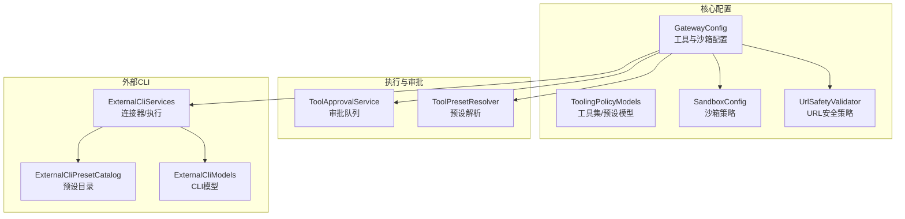
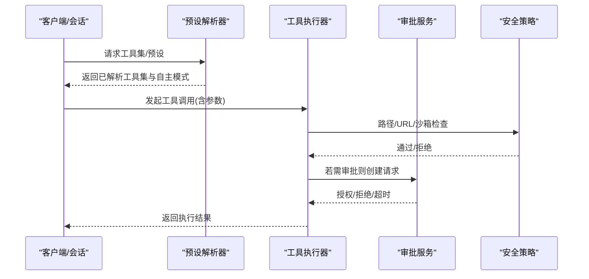
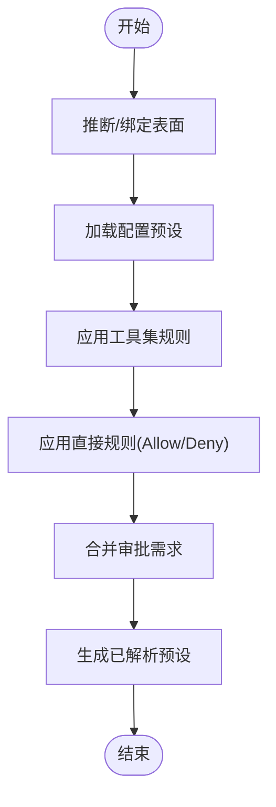
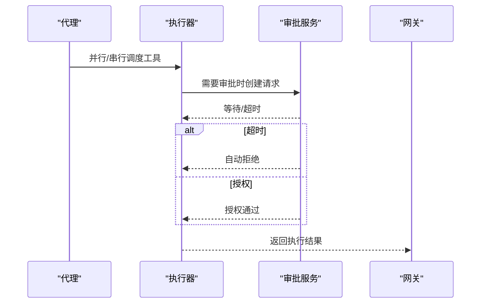
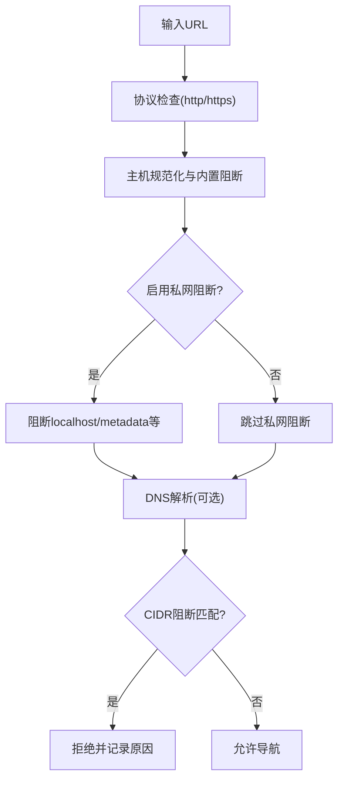
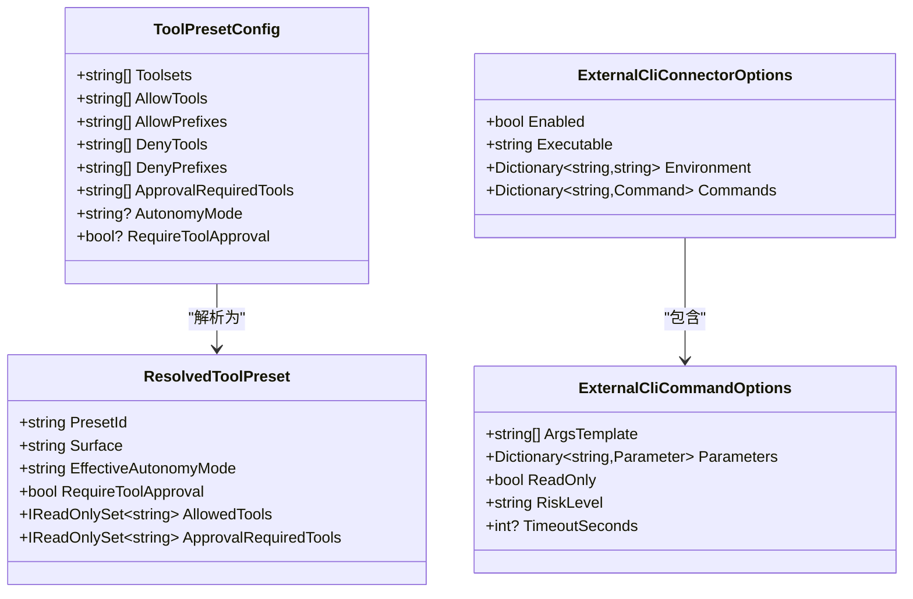
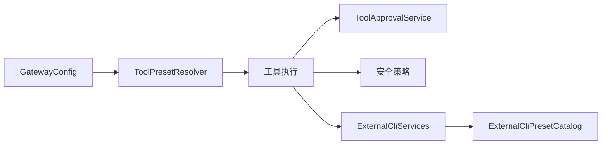

# 工具配置

<cite>
**本文引用的文件**
- [GatewayConfig.cs](file://src/OpenClaw.Core/Models/GatewayConfig.cs)
- [ToolingPolicyModels.cs](file://src/OpenClaw.Core/Models/ToolingPolicyModels.cs)
- [SandboxConfig.cs](file://src/OpenClaw.Core/Models/SandboxConfig.cs)
- [ToolApprovalService.cs](file://src/OpenClaw.Core/Pipeline/ToolApprovalService.cs)
- [ToolPresetResolver.cs](file://src/OpenClaw.Gateway/ToolPresetResolver.cs)
- [ExternalCliServices.cs](file://src/OpenClaw.Core/ExternalCli/ExternalCliServices.cs)
- [ExternalCliPresetCatalog.cs](file://src/OpenClaw.Core/ExternalCli/ExternalCliPresetCatalog.cs)
- [ExternalCliModels.cs](file://src/OpenClaw.Core/Models/ExternalCliModels.cs)
- [UrlSafetyValidator.cs](file://src/OpenClaw.Core/Security/UrlSafetyValidator.cs)
- [BrowserTool.cs](file://src/OpenClaw.Agent/Tools/BrowserTool.cs)
- [OpenClawToolExecutorTests.cs](file://src/OpenClaw.Tests/OpenClawToolExecutorTests.cs)
- [ConfigValidator.cs](file://src/OpenClaw.Core/Validation/ConfigValidator.cs)
</cite>

## 目录
1. [简介](#简介)
2. [项目结构](#项目结构)
3. [核心组件](#核心组件)
4. [架构总览](#架构总览)
5. [详细组件分析](#详细组件分析)
6. [依赖关系分析](#依赖关系分析)
7. [性能考量](#性能考量)
8. [故障排除指南](#故障排除指南)
9. [结论](#结论)
10. [附录](#附录)

## 简介
本技术文档围绕工具配置系统进行系统化说明，覆盖以下关键主题：
- 自主模式（只读、监督、全权限）与工作空间限制
- 工具集与工具预设的组合与解析
- 工具执行策略（并行执行、超时控制、审批流程）
- 路径策略、Shell 命令白名单与禁止路径
- 浏览器工具的安全策略与 URL 安全验证
- 工具表面绑定与会话路由
- 外部 CLI 工具的预设、连接器与执行管线
- 安全最佳实践、性能优化与故障排除建议

## 项目结构
工具配置系统主要分布在以下模块：
- 核心模型与策略：GatewayConfig、ToolingPolicyModels、SandboxConfig、UrlSafetyValidator
- 执行与审批：ToolApprovalService、ToolPresetResolver
- 外部 CLI：ExternalCliServices、ExternalCliPresetCatalog、ExternalCliModels
- 工具实现与安全：BrowserTool、测试用例与配置校验

**图表来源**
- [GatewayConfig.cs:412-457](file://src/OpenClaw.Core/Models/GatewayConfig.cs#L412-L457)
- [ToolingPolicyModels.cs:3-44](file://src/OpenClaw.Core/Models/ToolingPolicyModels.cs#L3-L44)
- [SandboxConfig.cs:3-167](file://src/OpenClaw.Core/Models/SandboxConfig.cs#L3-L167)
- [UrlSafetyValidator.cs:17-43](file://src/OpenClaw.Core/Security/UrlSafetyValidator.cs#L17-L43)
- [ToolApprovalService.cs:49-264](file://src/OpenClaw.Core/Pipeline/ToolApprovalService.cs#L49-L264)
- [ToolPresetResolver.cs:68-279](file://src/OpenClaw.Gateway/ToolPresetResolver.cs#L68-L279)
- [ExternalCliServices.cs:63-800](file://src/OpenClaw.Core/ExternalCli/ExternalCliServices.cs#L63-L800)
- [ExternalCliPresetCatalog.cs:5-93](file://src/OpenClaw.Core/ExternalCli/ExternalCliPresetCatalog.cs#L5-L93)
- [ExternalCliModels.cs:6-301](file://src/OpenClaw.Core/Models/ExternalCliModels.cs#L6-L301)

**章节来源**
- [GatewayConfig.cs:412-457](file://src/OpenClaw.Core/Models/GatewayConfig.cs#L412-L457)
- [ToolingPolicyModels.cs:3-44](file://src/OpenClaw.Core/Models/ToolingPolicyModels.cs#L3-L44)
- [SandboxConfig.cs:3-167](file://src/OpenClaw.Core/Models/SandboxConfig.cs#L3-L167)
- [UrlSafetyValidator.cs:17-43](file://src/OpenClaw.Core/Security/UrlSafetyValidator.cs#L17-L43)
- [ToolApprovalService.cs:49-264](file://src/OpenClaw.Core/Pipeline/ToolApprovalService.cs#L49-L264)
- [ToolPresetResolver.cs:68-279](file://src/OpenClaw.Gateway/ToolPresetResolver.cs#L68-L279)
- [ExternalCliServices.cs:63-800](file://src/OpenClaw.Core/ExternalCli/ExternalCliServices.cs#L63-L800)
- [ExternalCliPresetCatalog.cs:5-93](file://src/OpenClaw.Core/ExternalCli/ExternalCliPresetCatalog.cs#L5-L93)
- [ExternalCliModels.cs:6-301](file://src/OpenClaw.Core/Models/ExternalCliModels.cs#L6-L301)

## 核心组件
- 工具与执行策略
  - 自主模式：只读、监督、全权限，受工具预设与全局配置共同影响
  - 并行执行：支持多工具并发调用
  - 超时控制：工具级超时与审批超时
  - 审批要求：可按工具或动作类型强制审批
- 工作空间限制
  - 仅限工作区：WorkspaceOnly 与 WorkspaceRoot
  - 路径根限制：AllowedReadRoots/AllowedWriteRoots
  - Shell 命令白名单：AllowedShellCommandGlobs
  - 禁止路径：ForbiddenPathGlobs
- 沙箱策略
  - 提供商与模板：OpenSandbox 或 None
  - TTL 与模式：工具级模式与默认 TTL
  - 全局开关与工具特定配置
- 浏览器工具与 URL 安全
  - URL 安全策略：协议、主机、CIDR、私有网络阻断
  - 浏览器路由与拦截
- 工具集与预设
  - 工具集：Allow/Deny 列表与前缀规则
  - 工具预设：组合工具集、直接规则、审批需求、表面绑定
- 外部 CLI
  - 连接器注册与命令模式
  - 参数校验、输出格式、超时与截断
  - 预设应用与合并

**章节来源**
- [GatewayConfig.cs:412-457](file://src/OpenClaw.Core/Models/GatewayConfig.cs#L412-L457)
- [SandboxConfig.cs:48-167](file://src/OpenClaw.Core/Models/SandboxConfig.cs#L48-L167)
- [ToolingPolicyModels.cs:3-44](file://src/OpenClaw.Core/Models/ToolingPolicyModels.cs#L3-L44)
- [UrlSafetyValidator.cs:17-43](file://src/OpenClaw.Core/Security/UrlSafetyValidator.cs#L17-L43)
- [ExternalCliServices.cs:140-224](file://src/OpenClaw.Core/ExternalCli/ExternalCliServices.cs#L140-L224)

## 架构总览
工具配置系统通过“配置—解析—执行—审批—安全”闭环实现：
- 配置层：GatewayConfig 统一承载工具、沙箱、外部 CLI、URL 安全等配置
- 解析层：ToolPresetResolver 将表面与会话映射到具体预设，合并工具集与直接规则
- 执行层：ExternalCliServices/内置工具执行，结合并行策略与超时控制
- 审批层：ToolApprovalService 提供审批请求创建、等待与决策
- 安全层：UrlSafetyValidator、BrowserTool、路径策略与沙箱策略协同

**图表来源**
- [ToolPresetResolver.cs:68-279](file://src/OpenClaw.Gateway/ToolPresetResolver.cs#L68-L279)
- [ToolApprovalService.cs:65-218](file://src/OpenClaw.Core/Pipeline/ToolApprovalService.cs#L65-L218)
- [ExternalCliServices.cs:630-742](file://src/OpenClaw.Core/ExternalCli/ExternalCliServices.cs#L630-L742)
- [UrlSafetyValidator.cs:27-43](file://src/OpenClaw.Core/Security/UrlSafetyValidator.cs#L27-L43)

## 详细组件分析

### 自主模式、工作空间限制与工具集配置
- 自主模式
  - 只读：禁止写入与高风险操作
  - 监督：需要审批或预设中声明审批工具
  - 全权限：默认开放，受工具集与路径策略约束
- 工作空间限制
  - WorkspaceOnly 与 WorkspaceRoot 控制文件访问范围
  - AllowedReadRoots/AllowedWriteRoots 限定读写根目录
  - AllowedShellCommandGlobs 限制 Shell 命令匹配模式
  - ForbiddenPathGlobs 作为拒绝优先规则
- 工具集与预设
  - ToolsetConfig 支持 Allow/Deny 与前缀规则
  - ToolPresetConfig 支持组合多个工具集、直接规则、审批需求与自主模式
  - SurfaceBindings 将通道/表面映射到预设

**图表来源**
- [ToolPresetResolver.cs:68-279](file://src/OpenClaw.Gateway/ToolPresetResolver.cs#L68-L279)
- [ToolingPolicyModels.cs:3-44](file://src/OpenClaw.Core/Models/ToolingPolicyModels.cs#L3-L44)
- [GatewayConfig.cs:412-457](file://src/OpenClaw.Core/Models/GatewayConfig.cs#L412-L457)

**章节来源**
- [GatewayConfig.cs:412-457](file://src/OpenClaw.Core/Models/GatewayConfig.cs#L412-L457)
- [ToolingPolicyModels.cs:3-44](file://src/OpenClaw.Core/Models/ToolingPolicyModels.cs#L3-L44)
- [ToolPresetResolver.cs:68-279](file://src/OpenClaw.Gateway/ToolPresetResolver.cs#L68-L279)

### 工具执行策略：并行执行、超时与审批
- 并行执行
  - ParallelToolExecution 开关控制是否并行处理多工具调用
- 超时控制
  - ToolTimeoutSeconds：单工具执行超时
  - ToolApprovalTimeoutSeconds：审批等待超时
- 审批流程
  - ToolApprovalService 创建审批请求，支持超时自动拒绝与授权匹配
  - 审批回调工厂根据配置构造审批请求与超时

**图表来源**
- [ToolApprovalService.cs:65-218](file://src/OpenClaw.Core/Pipeline/ToolApprovalService.cs#L65-L218)
- [GatewayConfig.cs:434-447](file://src/OpenClaw.Core/Models/GatewayConfig.cs#L434-L447)

**章节来源**
- [ToolApprovalService.cs:49-264](file://src/OpenClaw.Core/Pipeline/ToolApprovalService.cs#L49-L264)
- [GatewayConfig.cs:434-447](file://src/OpenClaw.Core/Models/GatewayConfig.cs#L434-L447)

### 路径策略、Shell 命令白名单与禁止路径
- 路径策略
  - AllowedReadRoots/AllowedWriteRoots 与 WorkspaceOnly/Root 协同
  - ForbiddenPathGlobs 作为拒绝优先规则
- Shell 命令白名单
  - AllowedShellCommandGlobs 默认允许全部，可收紧为特定模式
- 实施要点
  - 文件类工具与 Shell 工具均受路径策略约束
  - 禁止路径优先于允许路径

**章节来源**
- [GatewayConfig.cs:417-427](file://src/OpenClaw.Core/Models/GatewayConfig.cs#L417-L427)

### 浏览器工具配置、URL 安全策略与工具表面绑定
- URL 安全策略
  - Enabled、BlockPrivateNetworkTargets、BlockedHostGlobs、BlockedCidrs
  - 异步 DNS 解析与 CIDR 匹配
- 浏览器工具
  - 启用/禁用、无头模式、超时、脚本执行能力
  - 前端路由拦截与 URL 安全校验
- 表面绑定
  - SurfaceBindings 将通道/表面映射到预设，影响工具可用性与审批需求

**图表来源**
- [UrlSafetyValidator.cs:27-43](file://src/OpenClaw.Core/Security/UrlSafetyValidator.cs#L27-L43)
- [BrowserTool.cs:144-204](file://src/OpenClaw.Agent/Tools/BrowserTool.cs#L144-L204)
- [GatewayConfig.cs:449-456](file://src/OpenClaw.Core/Models/GatewayConfig.cs#L449-L456)

**章节来源**
- [UrlSafetyValidator.cs:17-43](file://src/OpenClaw.Core/Security/UrlSafetyValidator.cs#L17-L43)
- [BrowserTool.cs:116-204](file://src/OpenClaw.Agent/Tools/BrowserTool.cs#L116-L204)
- [GatewayConfig.cs:449-456](file://src/OpenClaw.Core/Models/GatewayConfig.cs#L449-L456)

### 工具预设、工具集管理与外部 CLI 配置
- 工具预设
  - ToolPresetConfig 支持组合工具集、直接规则、审批需求与自主模式
  - ResolvedToolPreset 输出最终允许工具集合与审批需求
- 工具集
  - ToolsetConfig 支持 Allow/Deny 与前缀规则
  - 内置工具集（如运行时组）可被预设引用
- 外部 CLI
  - 连接器注册与命令模式：参数模板、风险等级、只读标记
  - 预设目录：预定义连接器与命令集合，支持合并与覆盖
  - 执行管线：参数校验、工作目录解析、超时与截断、结构化输出解析

**图表来源**
- [ToolingPolicyModels.cs:11-33](file://src/OpenClaw.Core/Models/ToolingPolicyModels.cs#L11-L33)
- [ExternalCliModels.cs:19-60](file://src/OpenClaw.Core/Models/ExternalCliModels.cs#L19-L60)

**章节来源**
- [ToolPresetResolver.cs:68-279](file://src/OpenClaw.Gateway/ToolPresetResolver.cs#L68-L279)
- [ToolingPolicyModels.cs:3-44](file://src/OpenClaw.Core/Models/ToolingPolicyModels.cs#L3-L44)
- [ExternalCliServices.cs:63-311](file://src/OpenClaw.Core/ExternalCli/ExternalCliServices.cs#L63-L311)
- [ExternalCliPresetCatalog.cs:5-93](file://src/OpenClaw.Core/ExternalCli/ExternalCliPresetCatalog.cs#L5-L93)
- [ExternalCliModels.cs:6-301](file://src/OpenClaw.Core/Models/ExternalCliModels.cs#L6-L301)

## 依赖关系分析
- 配置到解析
  - GatewayConfig.Tooling → ToolPresetResolver：预设与工具集解析
- 解析到执行
  - ResolvedToolPreset → 工具执行：决定哪些工具可用、是否需要审批
- 执行到审批
  - 工具执行 → ToolApprovalService：审批请求创建与等待
- 执行到安全
  - 工具执行 → UrlSafetyValidator/BrowserTool/路径策略：安全检查
- 外部 CLI
  - ExternalCliServices → ExternalCliPresetCatalog：预设应用与连接器合并

**图表来源**
- [GatewayConfig.cs:412-457](file://src/OpenClaw.Core/Models/GatewayConfig.cs#L412-L457)
- [ToolPresetResolver.cs:68-279](file://src/OpenClaw.Gateway/ToolPresetResolver.cs#L68-L279)
- [ToolApprovalService.cs:49-264](file://src/OpenClaw.Core/Pipeline/ToolApprovalService.cs#L49-L264)
- [ExternalCliServices.cs:63-800](file://src/OpenClaw.Core/ExternalCli/ExternalCliServices.cs#L63-L800)
- [ExternalCliPresetCatalog.cs:5-93](file://src/OpenClaw.Core/ExternalCli/ExternalCliPresetCatalog.cs#L5-L93)

**章节来源**
- [GatewayConfig.cs:412-457](file://src/OpenClaw.Core/Models/GatewayConfig.cs#L412-L457)
- [ToolPresetResolver.cs:68-279](file://src/OpenClaw.Gateway/ToolPresetResolver.cs#L68-L279)
- [ToolApprovalService.cs:49-264](file://src/OpenClaw.Core/Pipeline/ToolApprovalService.cs#L49-L264)
- [ExternalCliServices.cs:63-800](file://src/OpenClaw.Core/ExternalCli/ExternalCliServices.cs#L63-L800)
- [ExternalCliPresetCatalog.cs:5-93](file://src/OpenClaw.Core/ExternalCli/ExternalCliPresetCatalog.cs#L5-L93)

## 性能考量
- 并行执行
  - 合理开启并行以提升吞吐，但需考虑资源竞争与超时
- 超时设置
  - 工具超时与审批超时应结合任务性质与 SLA 设定
- 外部 CLI
  - 输出截断与超时控制避免内存与进程占用过高
  - 参数哈希与指纹用于缓存与去重
- 沙箱
  - TTL 与模板选择影响启动与销毁开销
- URL 安全
  - DNS 解析可异步进行，避免阻塞主线程

[本节为通用指导，无需代码来源]

## 故障排除指南
- 审批未响应
  - 检查 ToolApprovalTimeoutSeconds 是否过短
  - 确认审批回调工厂正确创建请求并记录事件
- 外部 CLI 执行失败
  - 校验连接器 Executable 是否存在与可执行
  - 检查参数模板与必填参数
  - 关注超时与输出截断
- 沙箱模式异常
  - 确认 Sandbox.Provider 与工具模式配置
  - 校验模板与 TTL 设置
- URL 安全拦截
  - 检查 UrlSafetyConfig 的 Enabled、BlockPrivateNetworkTargets、BlockedCidrs
  - 验证浏览器工具路由拦截逻辑

**章节来源**
- [ToolApprovalService.cs:156-218](file://src/OpenClaw.Core/Pipeline/ToolApprovalService.cs#L156-L218)
- [ExternalCliServices.cs:226-275](file://src/OpenClaw.Core/ExternalCli/ExternalCliServices.cs#L226-L275)
- [ConfigValidator.cs:160-187](file://src/OpenClaw.Core/Validation/ConfigValidator.cs#L160-L187)
- [UrlSafetyValidator.cs:27-43](file://src/OpenClaw.Core/Security/UrlSafetyValidator.cs#L27-L43)
- [OpenClawToolExecutorTests.cs:214-241](file://src/OpenClaw.Tests/OpenClawToolExecutorTests.cs#L214-L241)

## 结论
工具配置系统通过“预设—解析—执行—审批—安全”的闭环，实现了对工具使用行为的精细化控制。合理配置自主模式、工作空间限制、路径与 URL 安全策略、并行执行与超时、以及外部 CLI 的连接器与预设，可在保障安全的前提下提升自动化效率。

[本节为总结，无需代码来源]

## 附录
- 最佳实践
  - 默认采用监督模式，逐步放开至全权限
  - 严格限制工作空间与路径根，启用禁止路径优先策略
  - 为高风险工具（如 shell、write_file）启用审批
  - 为外部 CLI 启用参数校验、输出格式与超时控制
  - 使用预设目录统一管理连接器与命令，减少重复配置
- 常见问题定位清单
  - 审批超时：调整 ToolApprovalTimeoutSeconds
  - 外部 CLI 无法找到可执行：检查 PATH 与 Executable
  - 沙箱模板缺失：为启用沙箱的工具配置 Template
  - URL 安全拦截误伤：调整 UrlSafetyConfig 的阻断规则

[本节为通用指导，无需代码来源]