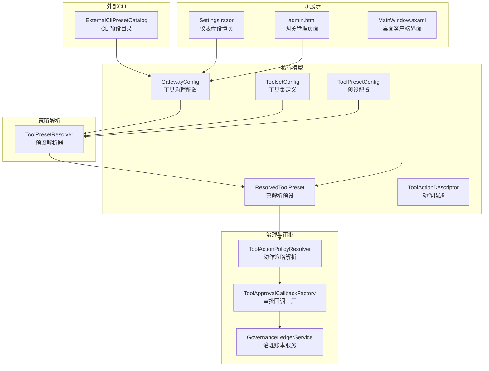
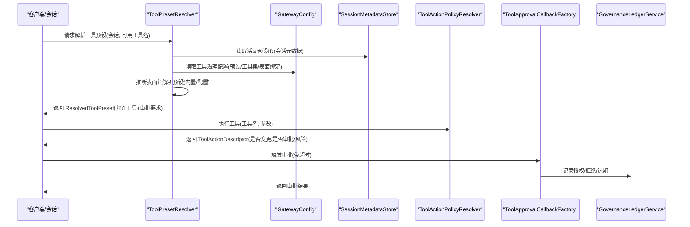
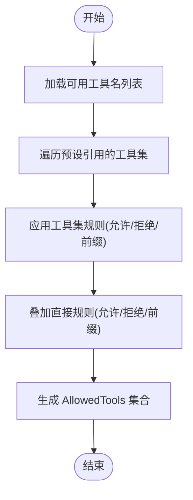
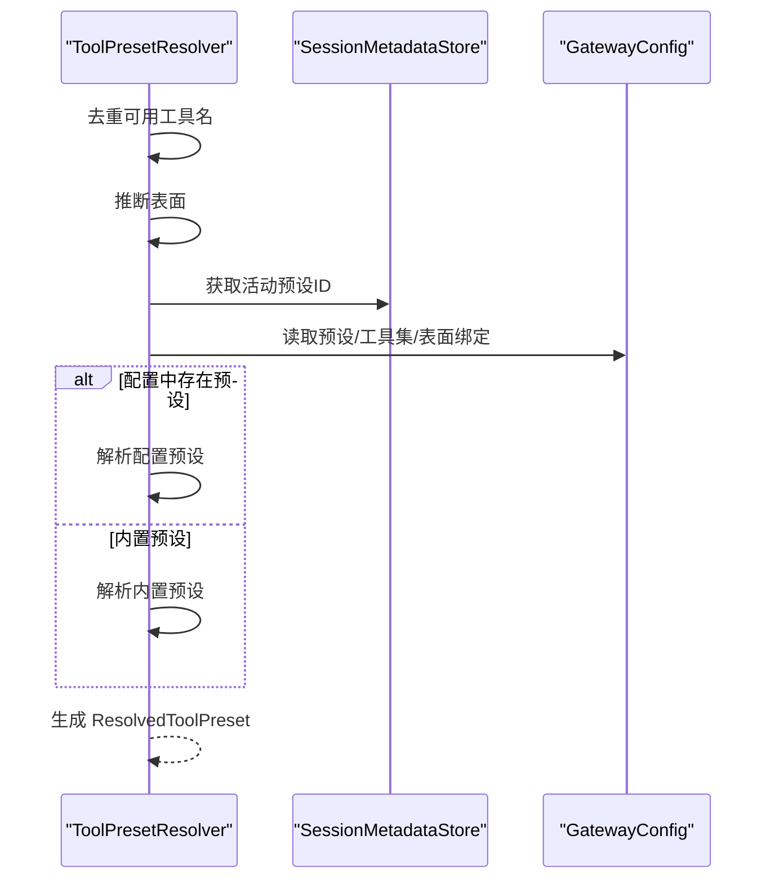
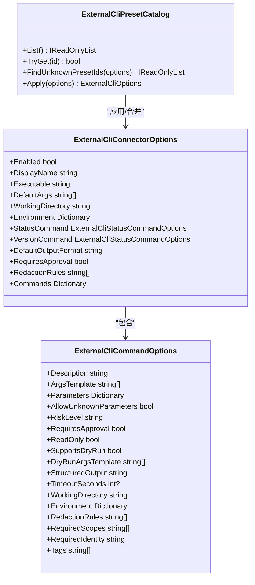
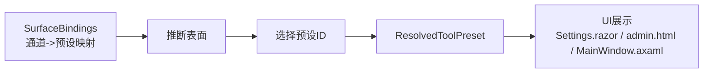
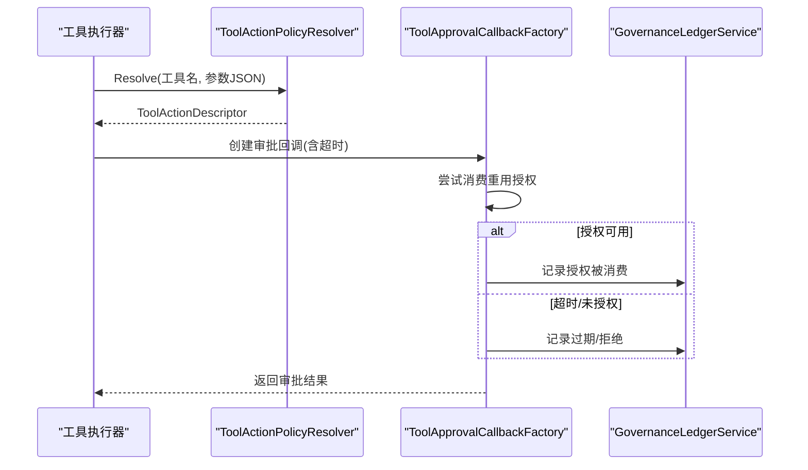
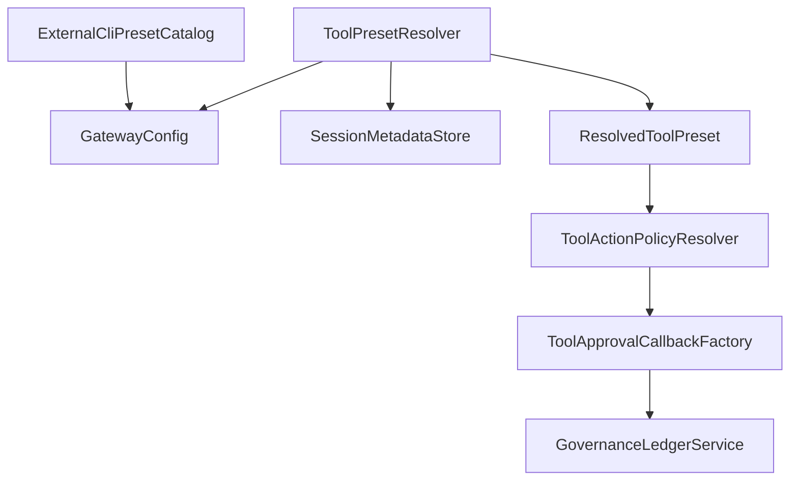

# 工具集管理

<cite>
**本文引用的文件**
- [ToolPresetResolver.cs](file://src/OpenClaw.Gateway/ToolPresetResolver.cs)
- [IToolPresetResolver.cs](file://src/OpenClaw.Core/Abstractions/IToolPresetResolver.cs)
- [ToolingPolicyModels.cs](file://src/OpenClaw.Core/Models/ToolingPolicyModels.cs)
- [ExternalCliPresetCatalog.cs](file://src/OpenClaw.Core/ExternalCli/ExternalCliPresetCatalog.cs)
- [GatewayConfig.cs](file://src/OpenClaw.Core/Models/GatewayConfig.cs)
- [ToolActionPolicyResolver.cs](file://src/OpenClaw.Core/Pipeline/ToolActionPolicyResolver.cs)
- [ToolGovernanceDescriptorCatalog.cs](file://src/OpenClaw.Core/Governance/ToolGovernanceDescriptorCatalog.cs)
- [ToolApprovalCallbackFactory.cs](file://src/OpenClaw.Gateway/ToolApprovalCallbackFactory.cs)
- [GovernanceLedgerService.cs](file://src/OpenClaw.Gateway/GovernanceLedgerService.cs)
- [MainWindow.axaml](file://src/OpenClaw.Companion/Views/MainWindow.axaml)
- [Settings.razor](file://src/OpenClaw.Dashboard/Pages/Settings.razor)
- [admin.html](file://src/OpenClaw.Gateway/wwwroot/admin.html)
- [ToolPresetResolverTests.cs](file://src/OpenClaw.Tests/ToolPresetResolverTests.cs)
</cite>

## 目录
1. [简介](#简介)
2. [项目结构](#项目结构)
3. [核心组件](#核心组件)
4. [架构总览](#架构总览)
5. [详细组件分析](#详细组件分析)
6. [依赖关系分析](#依赖关系分析)
7. [性能考量](#性能考量)
8. [故障排查指南](#故障排查指南)
9. [结论](#结论)
10. [附录](#附录)

## 简介
本文件系统化阐述工具集管理系统的实现与使用方法，覆盖以下关键主题：
- 工具集配置：工具集定义、工具集继承与组合机制
- 工具预设：预设模板、预设参数配置与预设应用策略
- 外部 CLI 工具集：CLI 预设目录、命令行参数映射与外部工具集成
- 工具表面绑定：UI 表面配置、工具可见性控制与用户界面定制
- 动态加载、热更新与版本管理策略（基于现有实现与配置模型）

## 项目结构
工具集管理涉及多个层次：
- 核心模型层：定义工具集、预设、动作描述等数据结构
- 策略解析层：根据会话与配置解析最终可用工具集合
- 外部 CLI 层：内置 CLI 预设与连接器选项合并策略
- 治理与审批层：工具动作风险评估、审批回调与治理记录
- UI 层：仪表盘与桌面客户端对工具预设与治理状态的展示

**图表来源**
- [GatewayConfig.cs:1-200](file://src/OpenClaw.Core/Models/GatewayConfig.cs#L1-L200)
- [ToolingPolicyModels.cs:1-45](file://src/OpenClaw.Core/Models/ToolingPolicyModels.cs#L1-L45)
- [ToolPresetResolver.cs:1-280](file://src/OpenClaw.Gateway/ToolPresetResolver.cs#L1-L280)
- [ExternalCliPresetCatalog.cs:1-683](file://src/OpenClaw.Core/ExternalCli/ExternalCliPresetCatalog.cs#L1-L683)
- [ToolActionPolicyResolver.cs:1-43](file://src/OpenClaw.Core/Pipeline/ToolActionPolicyResolver.cs#L1-L43)
- [ToolApprovalCallbackFactory.cs:38-66](file://src/OpenClaw.Gateway/ToolApprovalCallbackFactory.cs#L38-L66)
- [GovernanceLedgerService.cs:72-204](file://src/OpenClaw.Gateway/GovernanceLedgerService.cs#L72-L204)
- [Settings.razor:85-105](file://src/OpenClaw.Dashboard/Pages/Settings.razor#L85-L105)
- [MainWindow.axaml:452-461](file://src/OpenClaw.Companion/Views/MainWindow.axaml#L452-L461)
- [admin.html:1761-1785](file://src/OpenClaw.Gateway/wwwroot/admin.html#L1761-L1785)

**章节来源**
- [GatewayConfig.cs:1-200](file://src/OpenClaw.Core/Models/GatewayConfig.cs#L1-L200)
- [ToolingPolicyModels.cs:1-45](file://src/OpenClaw.Core/Models/ToolingPolicyModels.cs#L1-L45)
- [ToolPresetResolver.cs:1-280](file://src/OpenClaw.Gateway/ToolPresetResolver.cs#L1-L280)
- [ExternalCliPresetCatalog.cs:1-683](file://src/OpenClaw.Core/ExternalCli/ExternalCliPresetCatalog.cs#L1-L683)
- [ToolActionPolicyResolver.cs:1-43](file://src/OpenClaw.Core/Pipeline/ToolActionPolicyResolver.cs#L1-L43)
- [ToolApprovalCallbackFactory.cs:38-66](file://src/OpenClaw.Gateway/ToolApprovalCallbackFactory.cs#L38-L66)
- [GovernanceLedgerService.cs:72-204](file://src/OpenClaw.Gateway/GovernanceLedgerService.cs#L72-L204)
- [Settings.razor:85-105](file://src/OpenClaw.Dashboard/Pages/Settings.razor#L85-L105)
- [MainWindow.axaml:452-461](file://src/OpenClaw.Companion/Views/MainWindow.axaml#L452-L461)
- [admin.html:1761-1785](file://src/OpenClaw.Gateway/wwwroot/admin.html#L1761-L1785)

## 核心组件
- 工具集定义与组合
  - 工具集通过 AllowTools/AllowPrefixes/DenyTools/DenyPrefixes 实现白名单/前缀匹配与黑名单/前缀匹配的组合规则
  - 预设可引用多个工具集，并叠加直接规则（允许/拒绝/前缀）
- 预设解析与表面绑定
  - 解析器根据会话通道、别名映射与表面绑定表推断表面，再选择或回退到内置预设
  - 支持从会话元数据或路由参数中读取当前活动预设 ID
- 外部 CLI 工具集
  - 内置 CLI 预设目录提供多厂商 CLI 的命令模板、参数校验与输出格式
  - 合并策略支持将预设连接器选项与用户配置进行深度合并
- 治理与审批
  - 动作策略解析器根据工具名称与参数推断是否为变更操作、是否需要审批及风险等级
  - 审批回调工厂结合重用审批授权与超时处理，治理账本记录决策与过期事件

**章节来源**
- [ToolingPolicyModels.cs:1-45](file://src/OpenClaw.Core/Models/ToolingPolicyModels.cs#L1-L45)
- [ToolPresetResolver.cs:68-101](file://src/OpenClaw.Gateway/ToolPresetResolver.cs#L68-L101)
- [ExternalCliPresetCatalog.cs:40-70](file://src/OpenClaw.Core/ExternalCli/ExternalCliPresetCatalog.cs#L40-L70)
- [ToolActionPolicyResolver.cs:26-43](file://src/OpenClaw.Core/Pipeline/ToolActionPolicyResolver.cs#L26-L43)
- [ToolApprovalCallbackFactory.cs:38-66](file://src/OpenClaw.Gateway/ToolApprovalCallbackFactory.cs#L38-L66)
- [GovernanceLedgerService.cs:72-204](file://src/OpenClaw.Gateway/GovernanceLedgerService.cs#L72-L204)

## 架构总览
工具集管理的运行时流程如下：

**图表来源**
- [ToolPresetResolver.cs:68-101](file://src/OpenClaw.Gateway/ToolPresetResolver.cs#L68-L101)
- [GatewayConfig.cs:1-200](file://src/OpenClaw.Core/Models/GatewayConfig.cs#L1-L200)
- [ToolActionPolicyResolver.cs:26-43](file://src/OpenClaw.Core/Pipeline/ToolActionPolicyResolver.cs#L26-L43)
- [ToolApprovalCallbackFactory.cs:38-66](file://src/OpenClaw.Gateway/ToolApprovalCallbackFactory.cs#L38-L66)
- [GovernanceLedgerService.cs:72-204](file://src/OpenClaw.Gateway/GovernanceLedgerService.cs#L72-L204)

## 详细组件分析

### 组件一：工具集定义与组合机制
- 工具集定义
  - 使用 ToolsetConfig 的 AllowTools/AllowPrefixes/DenyTools/DenyPrefixes 实现灵活的白/黑名单与前缀匹配
- 组合策略
  - 预设可引用多个工具集，解析时逐个应用工具集规则，最后叠加直接规则
  - 允许优先于拒绝，前缀匹配扩展工具集范围
- 内置工具集
  - 提供 group:runtime、group:fs、group:sessions、group:memory、group:web、group:automation、group:messaging 等常用分组

**图表来源**
- [ToolPresetResolver.cs:155-189](file://src/OpenClaw.Gateway/ToolPresetResolver.cs#L155-L189)
- [ToolingPolicyModels.cs:1-9](file://src/OpenClaw.Core/Models/ToolingPolicyModels.cs#L1-L9)

**章节来源**
- [ToolPresetResolver.cs:48-57](file://src/OpenClaw.Gateway/ToolPresetResolver.cs#L48-L57)
- [ToolPresetResolver.cs:191-219](file://src/OpenClaw.Gateway/ToolPresetResolver.cs#L191-L219)
- [ToolingPolicyModels.cs:1-9](file://src/OpenClaw.Core/Models/ToolingPolicyModels.cs#L1-L9)

### 组件二：工具预设解析与应用策略
- 预设解析步骤
  - 去除空值并去重可用工具名
  - 推断表面：通道别名映射、表面绑定、默认映射
  - 读取会话元数据中的活动预设 ID 或路由参数
  - 若配置中存在该预设则按配置解析，否则回退到内置预设
- 内置预设行为
  - full：全量允许
  - coding/messaging/minimal/web/telegram/automation/readonly：按场景裁剪工具集并设定审批要求
- 列举所有预设
  - 同时列出配置预设与未在配置中覆盖的内置预设

**图表来源**
- [ToolPresetResolver.cs:68-101](file://src/OpenClaw.Gateway/ToolPresetResolver.cs#L68-L101)
- [ToolPresetResolver.cs:221-278](file://src/OpenClaw.Gateway/ToolPresetResolver.cs#L221-L278)

**章节来源**
- [ToolPresetResolver.cs:68-101](file://src/OpenClaw.Gateway/ToolPresetResolver.cs#L68-L101)
- [ToolPresetResolver.cs:138-153](file://src/OpenClaw.Gateway/ToolPresetResolver.cs#L138-L153)
- [ToolPresetResolver.cs:221-278](file://src/OpenClaw.Gateway/ToolPresetResolver.cs#L221-L278)
- [ToolPresetResolverTests.cs:1-41](file://src/OpenClaw.Tests/ToolPresetResolverTests.cs#L1-L41)

### 组件三：外部 CLI 工具集与命令映射
- 预设目录
  - 内置预设包括 gh、az、kubectl、stripe、lark、github-copilot、codex、gemini 等
  - 每个预设定义连接器、命令模板、参数校验（必填、长度、正则、枚举）、输出格式与标签
- 参数映射与校验
  - 参数支持必填、最大长度、正则模式与允许值集合
  - 命令可声明只读、风险等级、是否需要审批、Dry-run 参数模板等
- 合并策略
  - 将用户配置与预设连接器选项进行深度合并，优先采用用户配置
  - 合并命令、参数、环境变量、工作目录、超时、输出格式、标签等

**图表来源**
- [ExternalCliPresetCatalog.cs:1-683](file://src/OpenClaw.Core/ExternalCli/ExternalCliPresetCatalog.cs#L1-L683)

**章节来源**
- [ExternalCliPresetCatalog.cs:13-38](file://src/OpenClaw.Core/ExternalCli/ExternalCliPresetCatalog.cs#L13-L38)
- [ExternalCliPresetCatalog.cs:40-70](file://src/OpenClaw.Core/ExternalCli/ExternalCliPresetCatalog.cs#L40-L70)
- [ExternalCliPresetCatalog.cs:468-519](file://src/OpenClaw.Core/ExternalCli/ExternalCliPresetCatalog.cs#L468-L519)
- [ExternalCliPresetCatalog.cs:521-567](file://src/OpenClaw.Core/ExternalCli/ExternalCliPresetCatalog.cs#L521-L567)

### 组件四：工具表面绑定与 UI 定制
- 表面绑定
  - 通过 GatewayConfig.Tooling.SurfaceBindings 将通道 ID 映射到预设 ID
  - 支持通道别名（如 openai-http -> openai-http）与默认映射
- UI 展示
  - 仪表盘 Settings 页面提供开关项：全局审批要求、只读模式、并行执行、浏览器工具启用与评估
  - 管理页面 admin.html 提供自治模式、审批超时、并行工具、Shell 工具等配置入口
  - 桌面客户端 MainWindow.axaml 展示工具预设列表（预设 ID、审批要求、描述）

**图表来源**
- [ToolPresetResolver.cs:103-136](file://src/OpenClaw.Gateway/ToolPresetResolver.cs#L103-L136)
- [Settings.razor:85-105](file://src/OpenClaw.Dashboard/Pages/Settings.razor#L85-L105)
- [admin.html:1761-1785](file://src/OpenClaw.Gateway/wwwroot/admin.html#L1761-L1785)
- [MainWindow.axaml:452-461](file://src/OpenClaw.Companion/Views/MainWindow.axaml#L452-L461)

**章节来源**
- [ToolPresetResolver.cs:103-136](file://src/OpenClaw.Gateway/ToolPresetResolver.cs#L103-L136)
- [Settings.razor:85-105](file://src/OpenClaw.Dashboard/Pages/Settings.razor#L85-L105)
- [admin.html:1761-1785](file://src/OpenClaw.Gateway/wwwroot/admin.html#L1761-L1785)
- [MainWindow.axaml:452-461](file://src/OpenClaw.Companion/Views/MainWindow.axaml#L452-L461)

### 组件五：治理与审批流程
- 动作策略解析
  - 根据工具名与参数 JSON 推断是否为变更类操作、是否需要审批、风险等级
- 审批回调与重用授权
  - 结合重用审批授权与超时处理，记录治理账本
- 治理记录
  - 记录批准、拒绝、过期等决策，支持溯源与审计

**图表来源**
- [ToolActionPolicyResolver.cs:26-43](file://src/OpenClaw.Core/Pipeline/ToolActionPolicyResolver.cs#L26-L43)
- [ToolApprovalCallbackFactory.cs:38-66](file://src/OpenClaw.Gateway/ToolApprovalCallbackFactory.cs#L38-L66)
- [GovernanceLedgerService.cs:72-204](file://src/OpenClaw.Gateway/GovernanceLedgerService.cs#L72-L204)

**章节来源**
- [ToolActionPolicyResolver.cs:26-43](file://src/OpenClaw.Core/Pipeline/ToolActionPolicyResolver.cs#L26-L43)
- [ToolApprovalCallbackFactory.cs:38-66](file://src/OpenClaw.Gateway/ToolApprovalCallbackFactory.cs#L38-L66)
- [GovernanceLedgerService.cs:72-204](file://src/OpenClaw.Gateway/GovernanceLedgerService.cs#L72-L204)

## 依赖关系分析
- 组件耦合
  - ToolPresetResolver 依赖 GatewayConfig 与 SessionMetadataStore，负责预设解析与表面绑定
  - ToolActionPolicyResolver 与 ToolApprovalCallbackFactory 协同完成动作策略与审批流程
  - GovernanceLedgerService 提供治理记录能力，支撑审计与合规
- 外部 CLI 依赖
  - ExternalCliPresetCatalog 作为独立模块，通过 Apply 方法与 GatewayConfig.ExternalCli 进行整合

**图表来源**
- [ToolPresetResolver.cs:59-66](file://src/OpenClaw.Gateway/ToolPresetResolver.cs#L59-L66)
- [GatewayConfig.cs:1-200](file://src/OpenClaw.Core/Models/GatewayConfig.cs#L1-L200)
- [ToolActionPolicyResolver.cs:1-43](file://src/OpenClaw.Core/Pipeline/ToolActionPolicyResolver.cs#L1-L43)
- [ToolApprovalCallbackFactory.cs:38-66](file://src/OpenClaw.Gateway/ToolApprovalCallbackFactory.cs#L38-L66)
- [GovernanceLedgerService.cs:72-204](file://src/OpenClaw.Gateway/GovernanceLedgerService.cs#L72-L204)
- [ExternalCliPresetCatalog.cs:40-70](file://src/OpenClaw.Core/ExternalCli/ExternalCliPresetCatalog.cs#L40-L70)

**章节来源**
- [ToolPresetResolver.cs:59-66](file://src/OpenClaw.Gateway/ToolPresetResolver.cs#L59-L66)
- [GatewayConfig.cs:1-200](file://src/OpenClaw.Core/Models/GatewayConfig.cs#L1-L200)
- [ExternalCliPresetCatalog.cs:40-70](file://src/OpenClaw.Core/ExternalCli/ExternalCliPresetCatalog.cs#L40-L70)

## 性能考量
- 预设解析复杂度
  - 工具集应用与前缀匹配为线性扫描，整体复杂度与工具数量成线性关系
  - 建议在配置中尽量使用前缀匹配减少全量工具扫描
- 外部 CLI 合并策略
  - 合并字典与命令集合时避免重复构建，优先采用浅拷贝与增量合并
- 审批与治理记录
  - 审批超时与重用授权可显著降低等待时间；治理记录建议异步写入以减少阻塞

## 故障排查指南
- 预设未生效
  - 检查 GatewayConfig.Tooling.SurfaceBindings 是否正确映射通道到预设
  - 确认会话元数据中是否存在活动预设 ID，或路由参数是否传入
- 工具不可见
  - 核对工具集 Allow/Deny 与前缀匹配规则，确认工具名大小写与拼写
  - 对比内置预设与配置预设的差异
- 审批异常
  - 检查 ToolApprovalCallbackFactory 的超时配置与 GovernanceLedgerService 的记录状态
  - 确认重用授权是否过期或作用域不匹配
- 外部 CLI 不可用
  - 使用 ExternalCliPresetCatalog.FindUnknownPresetIds 检测无效预设 ID
  - 校验连接器可执行文件路径、工作目录与环境变量

**章节来源**
- [ToolPresetResolver.cs:75-87](file://src/OpenClaw.Gateway/ToolPresetResolver.cs#L75-L87)
- [ToolPresetResolverTests.cs:1-41](file://src/OpenClaw.Tests/ToolPresetResolverTests.cs#L1-L41)
- [ToolApprovalCallbackFactory.cs:38-66](file://src/OpenClaw.Gateway/ToolApprovalCallbackFactory.cs#L38-L66)
- [GovernanceLedgerService.cs:72-204](file://src/OpenClaw.Gateway/GovernanceLedgerService.cs#L72-L204)
- [ExternalCliPresetCatalog.cs:31-38](file://src/OpenClaw.Core/ExternalCli/ExternalCliPresetCatalog.cs#L31-L38)

## 结论
工具集管理系统通过“工具集 + 预设 + 表面绑定”的三层抽象，实现了灵活的工具可见性控制与安全治理。配合动作策略解析与审批回调，系统在保障安全性的同时提供了良好的可运维性与可观测性。外部 CLI 预设目录进一步扩展了工具生态，便于快速集成第三方命令行工具。

## 附录
- 动态加载与热更新
  - 当前实现未发现针对工具集配置的动态热加载机制；建议通过重启进程或引入配置热载入服务实现
- 版本管理策略
  - 外部 CLI 预设目录内置固定版本命令模板，建议在升级时同步更新预设 ID 并进行兼容性验证