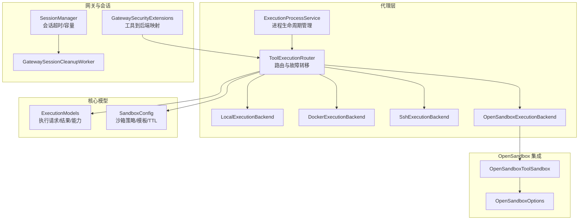
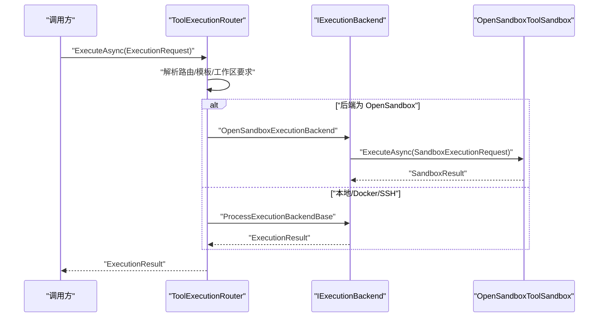
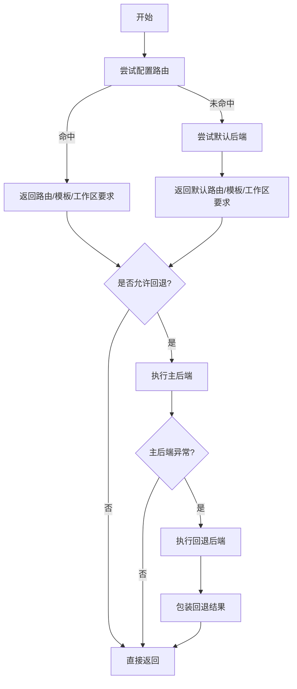
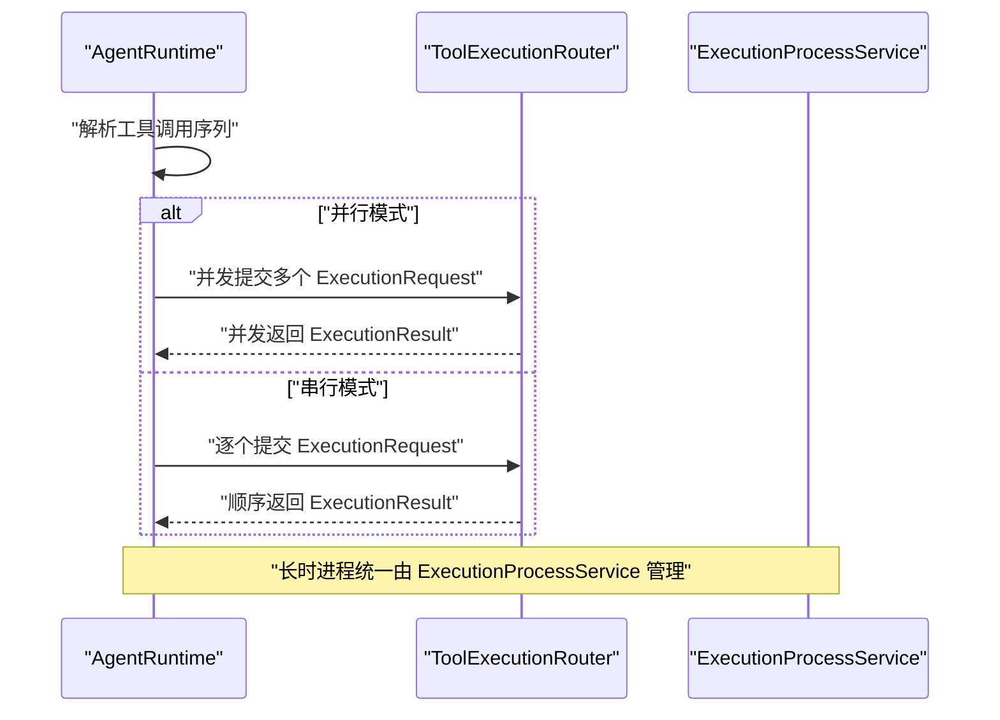
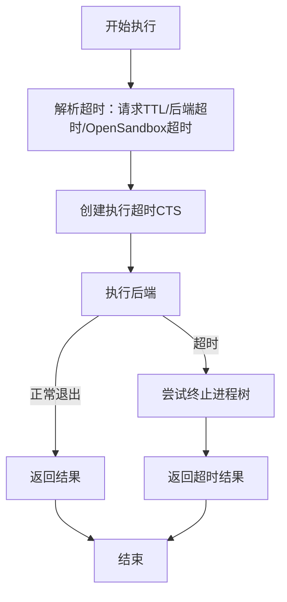
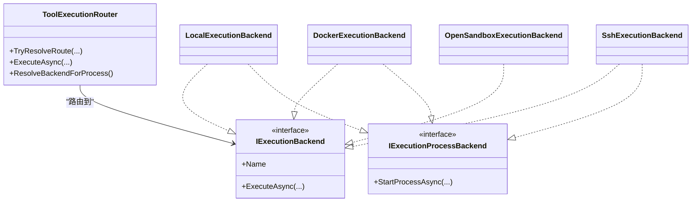
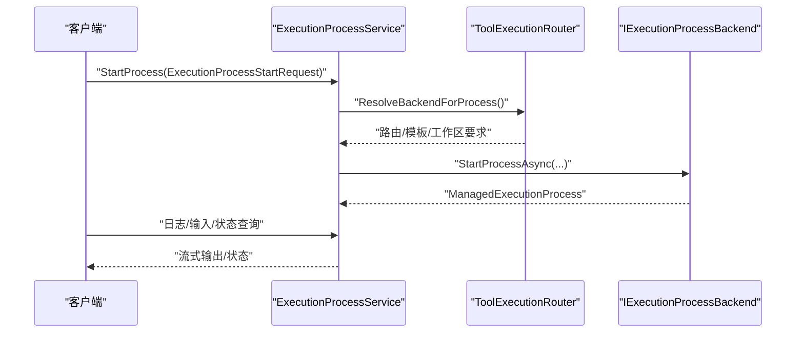
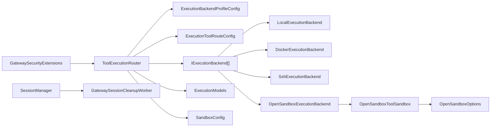

# 执行策略

<cite>
**本文引用的文件**
- [ToolExecutionRouter.cs](file://src/OpenClaw.Agent/Execution/ToolExecutionRouter.cs)
- [ExecutionProcessService.cs](file://src/OpenClaw.Agent/Execution/ExecutionProcessService.cs)
- [ProcessExecutionBackendBase.cs](file://src/OpenClaw.Agent/Execution/ProcessExecutionBackendBase.cs)
- [LocalExecutionBackend.cs](file://src/OpenClaw.Agent/Execution/LocalExecutionBackend.cs)
- [DockerExecutionBackend.cs](file://src/OpenClaw.Agent/Execution/DockerExecutionBackend.cs)
- [SshExecutionBackend.cs](file://src/OpenClaw.Agent/Execution/SshExecutionBackend.cs)
- [OpenSandboxExecutionBackend.cs](file://src/OpenClaw.Agent/Execution/OpenSandboxExecutionBackend.cs)
- [ExecutionModels.cs](file://src/OpenClaw.Core/Models/ExecutionModels.cs)
- [SandboxConfig.cs](file://src/OpenClaw.Core/Models/SandboxConfig.cs)
- [OpenSandboxOptions.cs](file://src/OpenClawNet.Sandbox.OpenSandbox/OpenSandboxOptions.cs)
- [OpenSandboxToolSandbox.cs](file://src/OpenClawNet.Sandbox.OpenSandbox/OpenSandboxToolSandbox.cs)
- [GatewaySecurityExtensions.cs](file://src/OpenClaw.Gateway/Extensions/GatewaySecurityExtensions.cs)
- [OpenClawToolExecutor.cs](file://src/OpenClaw.Agent/OpenClawToolExecutor.cs)
- [SessionManager.cs](file://src/OpenClaw.Core/Sessions/SessionManager.cs)
- [GatewaySessionCleanupWorker.cs](file://src/OpenClaw.Gateway/Extensions/GatewaySessionCleanupWorker.cs)
- [OpenClaw-Session-Management.md](file://docs/OpenClaw-Session-Management.md)
- [CircuitBreaker.cs](file://src/OpenClaw.Agent/CircuitBreaker.cs)
</cite>

## 目录
1. [简介](#简介)
2. [项目结构](#项目结构)
3. [核心组件](#核心组件)
4. [架构总览](#架构总览)
5. [详细组件分析](#详细组件分析)
6. [依赖关系分析](#依赖关系分析)
7. [性能考量](#性能考量)
8. [故障排查指南](#故障排查指南)
9. [结论](#结论)

## 简介
本文件系统性阐述工具执行策略，覆盖以下主题：
- 执行模式：并行执行、串行执行与混合执行的实现与适用场景
- 超时配置：工具超时、会话超时管理、全局超时控制
- 执行后端：本地执行、Docker 执行、SSH 执行、OpenSandbox 执行
- 执行路由：工具类型路由、负载均衡与故障转移
- 性能优化、资源管理与错误处理最佳实践

## 项目结构
执行策略相关代码主要分布在以下模块：
- 路由与后端：OpenClaw.Agent/Execution
- 执行模型与配置：OpenClaw.Core/Models
- OpenSandbox 集成：OpenClawNet.Sandbox.OpenSandbox
- 会话管理：OpenClaw.Core/Sessions 与 Gateway 扩展
- 网关路由与安全扩展：OpenClaw.Gateway/Extensions

图示来源
- [ToolExecutionRouter.cs:1-253](file://src/OpenClaw.Agent/Execution/ToolExecutionRouter.cs#L1-L253)
- [ExecutionProcessService.cs:1-331](file://src/OpenClaw.Agent/Execution/ExecutionProcessService.cs#L1-L331)
- [LocalExecutionBackend.cs:1-99](file://src/OpenClaw.Agent/Execution/LocalExecutionBackend.cs#L1-L99)
- [DockerExecutionBackend.cs:1-66](file://src/OpenClaw.Agent/Execution/DockerExecutionBackend.cs#L1-L66)
- [SshExecutionBackend.cs:1-63](file://src/OpenClaw.Agent/Execution/SshExecutionBackend.cs#L1-L63)
- [OpenSandboxExecutionBackend.cs:1-69](file://src/OpenClaw.Agent/Execution/OpenSandboxExecutionBackend.cs#L1-L69)
- [ExecutionModels.cs:1-179](file://src/OpenClaw.Core/Models/ExecutionModels.cs#L1-L179)
- [SandboxConfig.cs:1-168](file://src/OpenClaw.Core/Models/SandboxConfig.cs#L1-L168)
- [OpenSandboxOptions.cs:1-18](file://src/OpenClawNet.Sandbox.OpenSandbox/OpenSandboxOptions.cs#L1-L18)
- [OpenSandboxToolSandbox.cs:206-245](file://src/OpenClawNet.Sandbox.OpenSandbox/OpenSandboxToolSandbox.cs#L206-L245)
- [GatewaySecurityExtensions.cs:291-316](file://src/OpenClaw.Gateway/Extensions/GatewaySecurityExtensions.cs#L291-L316)
- [SessionManager.cs:1-106](file://src/OpenClaw.Core/Sessions/SessionManager.cs#L1-L106)
- [GatewaySessionCleanupWorker.cs:1-34](file://src/OpenClaw.Gateway/Extensions/GatewaySessionCleanupWorker.cs#L1-L34)

章节来源
- [ToolExecutionRouter.cs:1-253](file://src/OpenClaw.Agent/Execution/ToolExecutionRouter.cs#L1-L253)
- [ExecutionModels.cs:1-179](file://src/OpenClaw.Core/Models/ExecutionModels.cs#L1-L179)

## 核心组件
- 工具执行路由器：负责根据工具名称与配置解析后端、模板与工作区要求，并支持故障转移
- 进程执行服务：负责长时进程的启动、监控、日志拉取与生命周期管理
- 执行后端基类与具体实现：封装本地、Docker、SSH 以及 OpenSandbox 的执行细节
- 执行模型：定义请求、结果、进程句柄、状态等数据结构
- 沙箱策略与 TTL：定义沙箱模式、模板与过期时间解析逻辑
- 会话管理：控制会话超时、并发上限与清理

章节来源
- [ExecutionProcessService.cs:1-331](file://src/OpenClaw.Agent/Execution/ExecutionProcessService.cs#L1-L331)
- [ProcessExecutionBackendBase.cs:1-142](file://src/OpenClaw.Agent/Execution/ProcessExecutionBackendBase.cs#L1-L142)
- [ExecutionModels.cs:62-179](file://src/OpenClaw.Core/Models/ExecutionModels.cs#L62-L179)
- [SandboxConfig.cs:48-168](file://src/OpenClaw.Core/Models/SandboxConfig.cs#L48-L168)
- [SessionManager.cs:1-106](file://src/OpenClaw.Core/Sessions/SessionManager.cs#L1-L106)

## 架构总览
执行策略采用“路由驱动 + 后端抽象 + 可插拔沙箱”的分层设计：
- 路由层：根据工具名与配置决定后端、模板与工作区要求；支持回退后端
- 执行层：统一的执行接口与进程接口，屏蔽不同后端差异
- 沙箱层：OpenSandbox 提供隔离执行环境，支持租约续期与 TTL 控制
- 会话层：统一的会话生命周期与超时控制，保障资源回收

图示来源
- [ToolExecutionRouter.cs:114-157](file://src/OpenClaw.Agent/Execution/ToolExecutionRouter.cs#L114-L157)
- [OpenSandboxExecutionBackend.cs:22-67](file://src/OpenClaw.Agent/Execution/OpenSandboxExecutionBackend.cs#L22-L67)
- [ProcessExecutionBackendBase.cs:61-128](file://src/OpenClaw.Agent/Execution/ProcessExecutionBackendBase.cs#L61-L128)

## 详细组件分析

### 路由与故障转移
- 工具到后端映射：优先从配置的工具路由表匹配；若未配置则回退到默认后端
- 模板解析：根据后端配置或工具特定配置解析镜像/模板
- 工作区要求：Docker/SSH 后端通常需要工作区约束
- 故障转移：当主后端抛出异常且存在回退后端时自动切换，并返回回退结果标记

图示来源
- [ToolExecutionRouter.cs:65-157](file://src/OpenClaw.Agent/Execution/ToolExecutionRouter.cs#L65-L157)

章节来源
- [ToolExecutionRouter.cs:65-157](file://src/OpenClaw.Agent/Execution/ToolExecutionRouter.cs#L65-L157)
- [GatewaySecurityExtensions.cs:294-315](file://src/OpenClaw.Gateway/Extensions/GatewaySecurityExtensions.cs#L294-L315)

### 并行、串行与混合执行
- 并行执行：在代理运行时可启用并行工具执行，多个工具可并发调度
- 串行执行：默认逐个执行，适合资源受限或有顺序依赖的场景
- 混合执行：结合业务策略，对部分工具并行、部分串行，平衡吞吐与稳定性

图示来源
- [ToolExecutionRouter.cs:114-157](file://src/OpenClaw.Agent/Execution/ToolExecutionRouter.cs#L114-L157)
- [ExecutionProcessService.cs:301-331](file://src/OpenClaw.Agent/Execution/ExecutionProcessService.cs#L301-L331)

章节来源
- [ToolExecutionRouter.cs:114-157](file://src/OpenClaw.Agent/Execution/ToolExecutionRouter.cs#L114-L157)
- [ExecutionProcessService.cs:301-331](file://src/OpenClaw.Agent/Execution/ExecutionProcessService.cs#L301-L331)

### 超时配置与会话超时管理
- 工具超时设置
  - 后端级超时：各后端配置中的超时字段用于单次命令执行
  - OpenSandbox 超时：独立的超时秒数，用于沙箱执行
  - 请求级超时：执行请求可携带 TTL，优先级高于后端默认
- 会话超时管理
  - 会话空闲过期：由会话管理器基于配置的超时分钟数进行淘汰
  - 定期清理：网关后台任务周期性扫描并清理过期会话与锁
- 全局超时控制
  - 执行层统一使用取消令牌与超时 CTS，超时后尝试终止进程树并返回超时结果
  - OpenSandbox 使用独立的超时 CTS，捕获取消异常并标记超时

图示来源
- [ProcessExecutionBackendBase.cs:87-116](file://src/OpenClaw.Agent/Execution/ProcessExecutionBackendBase.cs#L87-L116)
- [OpenSandboxExecutionBackend.cs:26-66](file://src/OpenClaw.Agent/Execution/OpenSandboxExecutionBackend.cs#L26-L66)
- [SandboxConfig.cs:129-144](file://src/OpenClaw.Core/Models/SandboxConfig.cs#L129-L144)
- [OpenSandboxOptions.cs:1-18](file://src/OpenClawNet.Sandbox.OpenSandbox/OpenSandboxOptions.cs#L1-L18)
- [SessionManager.cs:22-23](file://src/OpenClaw.Core/Sessions/SessionManager.cs#L22-L23)
- [GatewaySessionCleanupWorker.cs:14-32](file://src/OpenClaw.Gateway/Extensions/GatewaySessionCleanupWorker.cs#L14-L32)

章节来源
- [ProcessExecutionBackendBase.cs:61-128](file://src/OpenClaw.Agent/Execution/ProcessExecutionBackendBase.cs#L61-L128)
- [OpenSandboxExecutionBackend.cs:22-67](file://src/OpenClaw.Agent/Execution/OpenSandboxExecutionBackend.cs#L22-L67)
- [SandboxConfig.cs:129-144](file://src/OpenClaw.Core/Models/SandboxConfig.cs#L129-L144)
- [OpenSandboxOptions.cs:1-18](file://src/OpenClawNet.Sandbox.OpenSandbox/OpenSandboxOptions.cs#L1-L18)
- [SessionManager.cs:22-23](file://src/OpenClaw.Core/Sessions/SessionManager.cs#L22-L23)
- [GatewaySessionCleanupWorker.cs:14-32](file://src/OpenClaw.Gateway/Extensions/GatewaySessionCleanupWorker.cs#L14-L32)

### 执行后端选择
- 本地执行（Local）
  - 支持一次性命令与进程；工作区校验严格，非工作区内目录访问会被拒绝
  - 交互式输入与 PTY 支持因平台而异
- Docker 执行（Docker）
  - 通过 docker CLI 启动容器执行；镜像必填；支持环境变量注入与工作目录映射
- SSH 执行（SSH）
  - 通过 ssh 远程执行命令；支持密钥认证与工作目录切换
- OpenSandbox 执行（OpenSandbox）
  - 通过沙箱服务执行，支持租约续期与 TTL；超时独立于后端超时

图示来源
- [ToolExecutionRouter.cs:7-63](file://src/OpenClaw.Agent/Execution/ToolExecutionRouter.cs#L7-L63)
- [LocalExecutionBackend.cs:6-25](file://src/OpenClaw.Agent/Execution/LocalExecutionBackend.cs#L6-L25)
- [DockerExecutionBackend.cs:6-20](file://src/OpenClaw.Agent/Execution/DockerExecutionBackend.cs#L6-L20)
- [SshExecutionBackend.cs:6-20](file://src/OpenClaw.Agent/Execution/SshExecutionBackend.cs#L6-L20)
- [OpenSandboxExecutionBackend.cs:7-20](file://src/OpenClaw.Agent/Execution/OpenSandboxExecutionBackend.cs#L7-L20)

章节来源
- [LocalExecutionBackend.cs:17-99](file://src/OpenClaw.Agent/Execution/LocalExecutionBackend.cs#L17-L99)
- [DockerExecutionBackend.cs:19-66](file://src/OpenClaw.Agent/Execution/DockerExecutionBackend.cs#L19-L66)
- [SshExecutionBackend.cs:19-63](file://src/OpenClaw.Agent/Execution/SshExecutionBackend.cs#L19-L63)
- [OpenSandboxExecutionBackend.cs:22-67](file://src/OpenClaw.Agent/Execution/OpenSandboxExecutionBackend.cs#L22-L67)

### 执行路由策略：工具类型路由、负载均衡与故障转移
- 工具类型路由
  - 针对 shell、code_exec、browser 等工具可配置专属后端
  - process 工具可回退到 shell 的后端配置
- 负载均衡
  - 通过多后端配置与回退策略实现简单负载均衡与容灾
- 故障转移
  - 主后端异常时自动切换至回退后端，保证执行可用性

章节来源
- [GatewaySecurityExtensions.cs:294-315](file://src/OpenClaw.Gateway/Extensions/GatewaySecurityExtensions.cs#L294-L315)
- [ToolExecutionRouter.cs:236-251](file://src/OpenClaw.Agent/Execution/ToolExecutionRouter.cs#L236-L251)
- [ExecutionModels.cs:47-52](file://src/OpenClaw.Core/Models/ExecutionModels.cs#L47-L52)

### 执行流程与长时进程
- 一次性命令：统一由后端基类封装，支持超时与进程树终止
- 长时进程：由进程服务统一管理，支持 PTY、输入、日志流与状态查询
- 进程后端判定：仅非本地且实现进程接口的后端才可用于长时进程

图示来源
- [ExecutionProcessService.cs:301-331](file://src/OpenClaw.Agent/Execution/ExecutionProcessService.cs#L301-L331)
- [ToolExecutionRouter.cs:164-203](file://src/OpenClaw.Agent/Execution/ToolExecutionRouter.cs#L164-L203)
- [ProcessExecutionBackendBase.cs:23-44](file://src/OpenClaw.Agent/Execution/ProcessExecutionBackendBase.cs#L23-L44)

章节来源
- [ExecutionProcessService.cs:1-331](file://src/OpenClaw.Agent/Execution/ExecutionProcessService.cs#L1-L331)
- [ToolExecutionRouter.cs:164-203](file://src/OpenClaw.Agent/Execution/ToolExecutionRouter.cs#L164-L203)
- [ProcessExecutionBackendBase.cs:23-44](file://src/OpenClaw.Agent/Execution/ProcessExecutionBackendBase.cs#L23-L44)

### 沙箱策略与 TTL
- 沙箱模式解析：支持 None/Prefer/Require 三种模式，可按工具或默认模式配置
- 模板解析：OpenSandbox 场景下使用工具模板作为镜像标识
- TTL 解析：优先使用请求级 TTL，其次工具级 TTL，最后全局默认 TTL
- 租约续期：沙箱服务定期续期租约，过期自动回收

章节来源
- [SandboxConfig.cs:86-168](file://src/OpenClaw.Core/Models/SandboxConfig.cs#L86-L168)
- [OpenSandboxToolSandbox.cs:214-245](file://src/OpenClawNet.Sandbox.OpenSandbox/OpenSandboxToolSandbox.cs#L214-L245)
- [OpenSandboxOptions.cs:1-18](file://src/OpenClawNet.Sandbox.OpenSandbox/OpenSandboxOptions.cs#L1-L18)

## 依赖关系分析
- 路由器依赖后端集合与配置；后端实现依赖统一的执行模型
- OpenSandbox 执行后端依赖沙箱工具箱与选项
- 会话管理器与网关清理任务共同维护会话生命周期
- 网关扩展提供工具到后端的静态映射辅助

图示来源
- [ToolExecutionRouter.cs:20-63](file://src/OpenClaw.Agent/Execution/ToolExecutionRouter.cs#L20-L63)
- [ExecutionModels.cs:26-75](file://src/OpenClaw.Core/Models/ExecutionModels.cs#L26-L75)
- [SandboxConfig.cs:3-16](file://src/OpenClaw.Core/Models/SandboxConfig.cs#L3-L16)
- [OpenSandboxExecutionBackend.cs:13-18](file://src/OpenClaw.Agent/Execution/OpenSandboxExecutionBackend.cs#L13-L18)
- [OpenSandboxToolSandbox.cs:206-245](file://src/OpenClawNet.Sandbox.OpenSandbox/OpenSandboxToolSandbox.cs#L206-L245)
- [OpenSandboxOptions.cs:1-18](file://src/OpenClawNet.Sandbox.OpenSandbox/OpenSandboxOptions.cs#L1-L18)
- [GatewaySecurityExtensions.cs:294-315](file://src/OpenClaw.Gateway/Extensions/GatewaySecurityExtensions.cs#L294-L315)
- [SessionManager.cs:22-23](file://src/OpenClaw.Core/Sessions/SessionManager.cs#L22-L23)
- [GatewaySessionCleanupWorker.cs:14-32](file://src/OpenClaw.Gateway/Extensions/GatewaySessionCleanupWorker.cs#L14-L32)

章节来源
- [ToolExecutionRouter.cs:20-63](file://src/OpenClaw.Agent/Execution/ToolExecutionRouter.cs#L20-L63)
- [ExecutionModels.cs:26-75](file://src/OpenClaw.Core/Models/ExecutionModels.cs#L26-L75)
- [SandboxConfig.cs:3-16](file://src/OpenClaw.Core/Models/SandboxConfig.cs#L3-L16)
- [OpenSandboxExecutionBackend.cs:13-18](file://src/OpenClaw.Agent/Execution/OpenSandboxExecutionBackend.cs#L13-L18)
- [OpenSandboxToolSandbox.cs:206-245](file://src/OpenClawNet.Sandbox.OpenSandbox/OpenSandboxToolSandbox.cs#L206-L245)
- [OpenSandboxOptions.cs:1-18](file://src/OpenClawNet.Sandbox.OpenSandbox/OpenSandboxOptions.cs#L1-L18)
- [GatewaySecurityExtensions.cs:294-315](file://src/OpenClaw.Gateway/Extensions/GatewaySecurityExtensions.cs#L294-L315)
- [SessionManager.cs:22-23](file://src/OpenClaw.Core/Sessions/SessionManager.cs#L22-L23)
- [GatewaySessionCleanupWorker.cs:14-32](file://src/OpenClaw.Gateway/Extensions/GatewaySessionCleanupWorker.cs#L14-L32)

## 性能考量
- 并行执行：在 CPU/IO 富余时提升吞吐；注意资源争用与超时设置
- 工作区约束：本地后端严格的工作区校验可避免越权访问，但可能增加路径解析成本
- 超时策略：合理设置后端超时与请求 TTL，避免长时间阻塞；对 OpenSandbox 单独设置超时
- 进程管理：统一的进程生命周期管理减少资源泄漏；长时进程启用 PTY 时注意平台兼容性
- 沙箱租约：合理设置 TTL 与续期策略，避免频繁创建/销毁带来的开销

## 故障排查指南
- 执行后端未配置
  - 现象：抛出“执行后端未配置”异常
  - 处理：检查路由配置与后端启用状态
- 长时进程后端不支持
  - 现象：本地或不支持进程的后端被路由到长时进程
  - 处理：将 process 路由到 Docker/SSH 等进程后端，或放宽沙箱要求
- 超时与进程树终止
  - 现象：超时后返回超时结果并尝试终止进程树
  - 处理：调整超时阈值或优化工具执行效率
- OpenSandbox 超时
  - 现象：沙箱执行超时返回超时标记
  - 处理：检查沙箱服务可用性与网络，调整 TTL 或超时设置
- 会话超时与清理
  - 现象：会话被清理导致上下文丢失
  - 处理：延长会话超时或在关键流程中保持活跃

章节来源
- [ToolExecutionRouter.cs:156-157](file://src/OpenClaw.Agent/Execution/ToolExecutionRouter.cs#L156-L157)
- [ExecutionProcessService.cs:306-331](file://src/OpenClaw.Agent/Execution/ExecutionProcessService.cs#L306-L331)
- [ProcessExecutionBackendBase.cs:95-116](file://src/OpenClaw.Agent/Execution/ProcessExecutionBackendBase.cs#L95-L116)
- [OpenSandboxExecutionBackend.cs:54-66](file://src/OpenClaw.Agent/Execution/OpenSandboxExecutionBackend.cs#L54-L66)
- [SessionManager.cs:22-23](file://src/OpenClaw.Core/Sessions/SessionManager.cs#L22-L23)
- [GatewaySessionCleanupWorker.cs:14-32](file://src/OpenClaw.Gateway/Extensions/GatewaySessionCleanupWorker.cs#L14-L32)

## 结论
本执行策略通过“路由驱动 + 后端抽象 + 沙箱隔离 + 会话治理”的架构，在保证安全性与可运维性的前提下，提供了灵活的执行模式与完善的超时/故障处理机制。建议在生产环境中：
- 明确工具的路由与沙箱策略，合理设置 TTL 与超时
- 在高并发场景启用并行执行，并配合进程后端与租约续期
- 通过会话清理与容量控制避免资源泄露与雪崩
- 使用电路开关与回退策略增强系统韧性