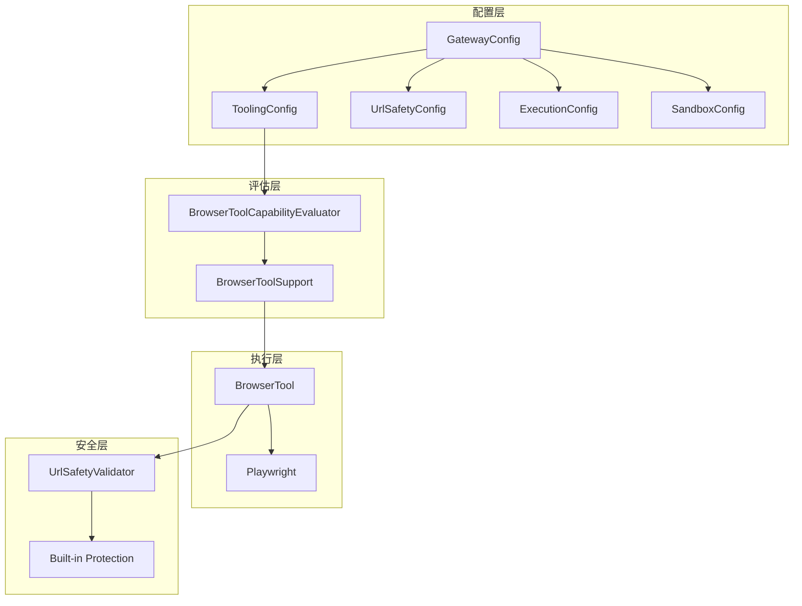
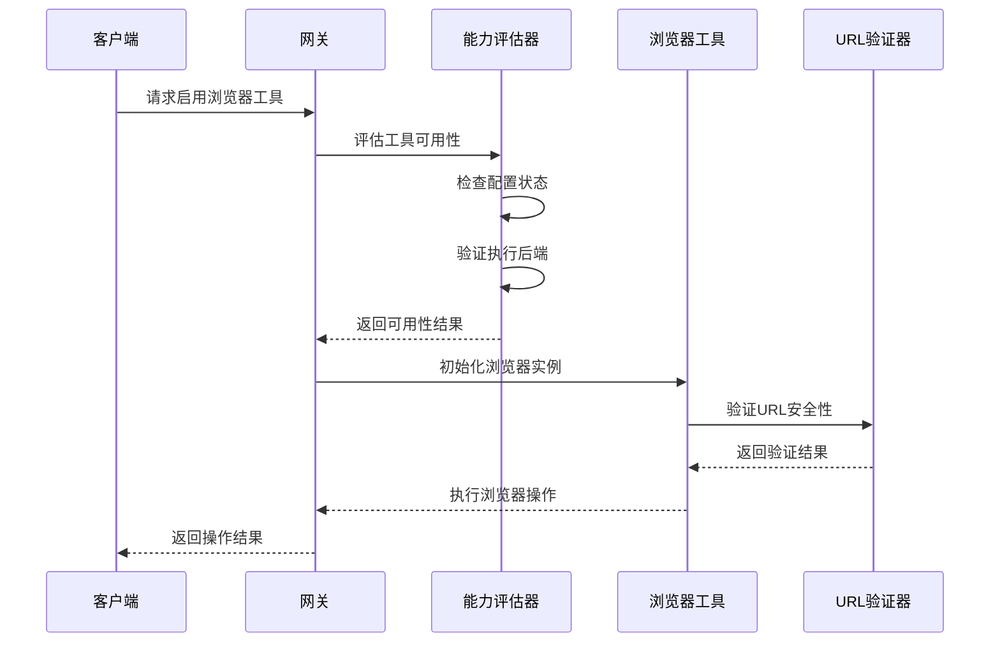
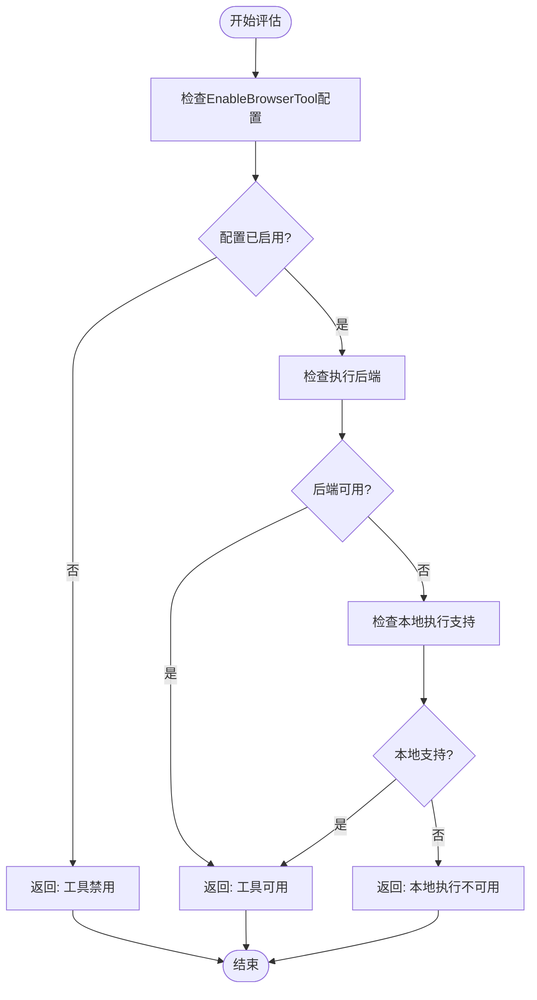
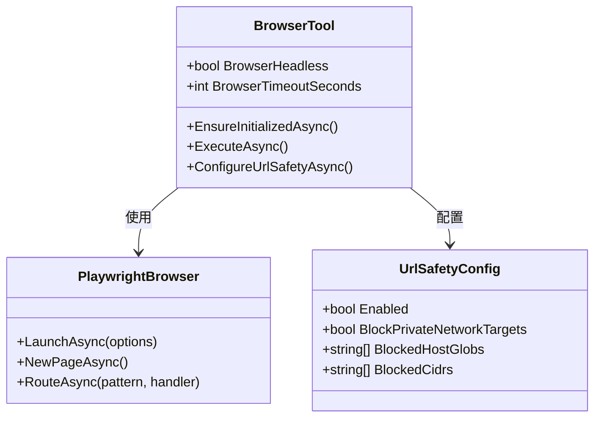
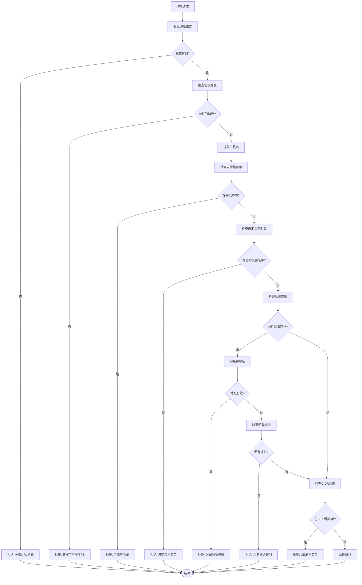
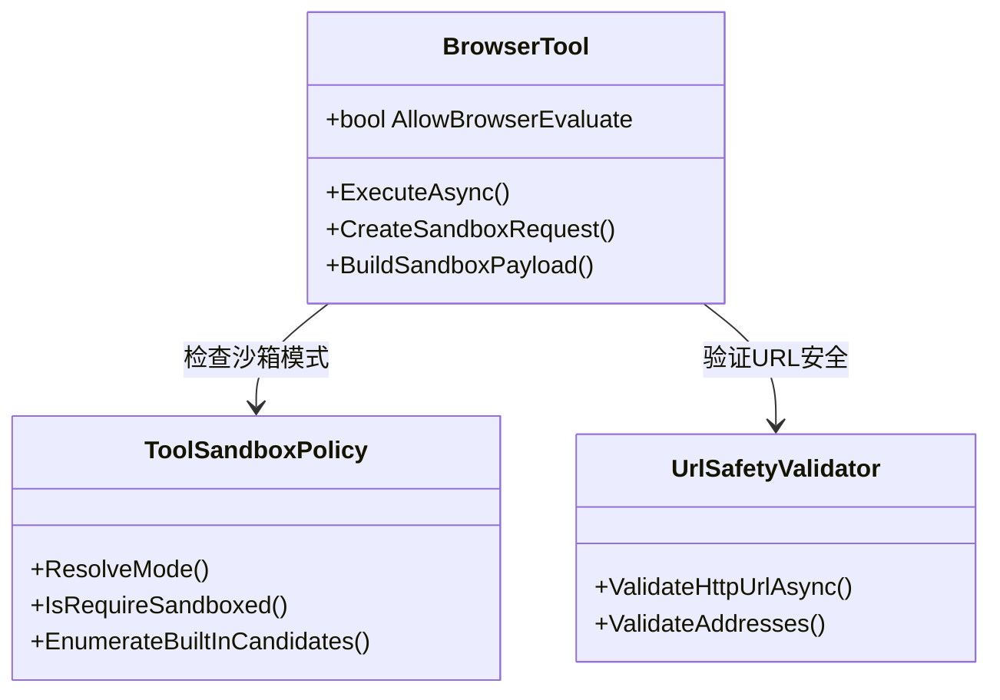
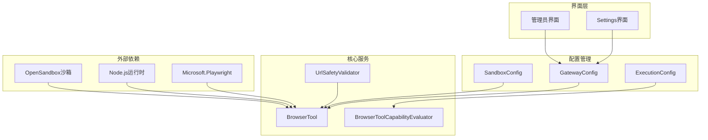

# 浏览器工具配置

<cite>
**本文档引用的文件**
- [BrowserTool.cs](file://src/OpenClaw.Agent/Tools/BrowserTool.cs)
- [GatewayTool.cs](file://src/OpenClaw.Gateway/Tools/GatewayTool.cs)
- [BrowserToolSupport.cs](file://src/OpenClaw.Gateway/BrowserToolSupport.cs)
- [BrowserToolCapabilityEvaluator.cs](file://src/OpenClaw.Core/Security/BrowserToolCapabilityEvaluator.cs)
- [UrlSafetyValidator.cs](file://src/OpenClaw.Core/Security/UrlSafetyValidator.cs)
- [GatewayConfig.cs](file://src/OpenClaw.Core/Models/GatewayConfig.cs)
- [ExecutionModels.cs](file://src/OpenClaw.Core/Models/ExecutionModels.cs)
- [SandboxConfig.cs](file://src/OpenClaw.Core/Models/SandboxConfig.cs)
- [Settings.razor](file://src/OpenClaw.Dashboard/Pages/Settings.razor)
- [admin.html](file://src/OpenClaw.Gateway/wwwroot/admin.html)
- [SetupVerificationService.cs](file://src/OpenClaw.Core/Validation/SetupVerificationService.cs)
- [AdminEndpoints.Support.cs](file://src/OpenClaw.Gateway/Endpoints/AdminEndpoints.Support.cs)
</cite>

## 目录
1. [简介](#简介)
2. [项目结构](#项目结构)
3. [核心组件](#核心组件)
4. [架构概览](#架构概览)
5. [详细组件分析](#详细组件分析)
6. [依赖关系分析](#依赖关系分析)
7. [性能考虑](#性能考虑)
8. [故障排除指南](#故障排除指南)
9. [结论](#结论)

## 简介

本文档深入解析了Kingcrab项目中的浏览器工具配置系统，涵盖浏览器工具启用配置、功能开关控制、工具可用性评估、浏览器行为配置、URL安全策略以及浏览器评估权限等关键方面。该系统通过Playwright实现交互式无头浏览器，支持JavaScript执行、DOM操作和安全浏览模式。

## 项目结构

浏览器工具配置涉及多个层次的组件协作：

**图表来源**
- [GatewayConfig.cs:412-457](file://src/OpenClaw.Core/Models/GatewayConfig.cs#L412-L457)
- [BrowserToolCapabilityEvaluator.cs:5-30](file://src/OpenClaw.Core/Security/BrowserToolCapabilityEvaluator.cs#L5-L30)
- [BrowserTool.cs:17-258](file://src/OpenClaw.Agent/Tools/BrowserTool.cs#L17-L258)

**章节来源**
- [GatewayConfig.cs:412-457](file://src/OpenClaw.Core/Models/GatewayConfig.cs#L412-L457)
- [BrowserToolCapabilityEvaluator.cs:5-30](file://src/OpenClaw.Core/Security/BrowserToolCapabilityEvaluator.cs#L5-L30)

## 核心组件

### 浏览器工具配置模型

浏览器工具配置主要由以下核心组件构成：

#### 工具启用配置
- `EnableBrowserTool`: 控制浏览器工具的整体启用状态
- `AllowBrowserEvaluate`: 允许JavaScript脚本执行权限
- `BrowserHeadless`: 无头模式开关
- `BrowserTimeoutSeconds`: 浏览器超时时间配置

#### URL安全策略
- `UrlSafety.Enabled`: 启用URL验证功能
- `UrlSafety.BlockPrivateNetworkTargets`: 阻断私有网络目标
- `UrlSafety.BlockedHostGlobs`: 被阻止的主机通配符列表
- `UrlSafety.BlockedCidrs`: 被阻止的CIDR地址段

#### 执行后端配置
- `Execution.Enabled`: 执行后端总开关
- `Execution.Tools`: 工具路由配置
- `Sandbox.Provider`: 沙箱提供者配置

**章节来源**
- [GatewayConfig.cs:449-453](file://src/OpenClaw.Core/Models/GatewayConfig.cs#L449-L453)
- [GatewayConfig.cs:371-384](file://src/OpenClaw.Core/Models/GatewayConfig.cs#L371-L384)

## 架构概览

浏览器工具配置系统采用分层架构设计，确保安全性与功能性平衡：

**图表来源**
- [BrowserToolSupport.cs:15-24](file://src/OpenClaw.Gateway/BrowserToolSupport.cs#L15-L24)
- [BrowserToolCapabilityEvaluator.cs:7-30](file://src/OpenClaw.Core/Security/BrowserToolCapabilityEvaluator.cs#L7-L30)
- [BrowserTool.cs:302-338](file://src/OpenClaw.Agent/Tools/BrowserTool.cs#L302-L338)

## 详细组件分析

### 浏览器工具启用配置

浏览器工具的启用配置通过多层检查机制确保安全性和可用性：

#### 配置参数详解

| 配置项 | 类型 | 默认值 | 描述 |
|--------|------|--------|------|
| EnableBrowserTool | bool | true | 启用浏览器工具功能 |
| AllowBrowserEvaluate | bool | true | 允许JavaScript脚本执行 |
| BrowserHeadless | bool | true | 无头模式运行 |
| BrowserTimeoutSeconds | int | 30 | 浏览器超时时间(秒) |

#### 能力评估流程

**图表来源**
- [BrowserToolCapabilityEvaluator.cs:7-30](file://src/OpenClaw.Core/Security/BrowserToolCapabilityEvaluator.cs#L7-L30)

**章节来源**
- [BrowserToolCapabilityEvaluator.cs:7-30](file://src/OpenClaw.Core/Security/BrowserToolCapabilityEvaluator.cs#L7-L30)
- [GatewayTool.cs:66-77](file://src/OpenClaw.Gateway/Tools/GatewayTool.cs#L66-L77)

### 浏览器行为配置

浏览器行为配置涵盖了无头模式、超时控制和页面加载策略等关键参数：

#### 无头模式设置

无头模式通过Playwright的`Headless`选项控制：

**图表来源**
- [BrowserTool.cs:324-328](file://src/OpenClaw.Agent/Tools/BrowserTool.cs#L324-L328)
- [BrowserTool.cs:491-526](file://src/OpenClaw.Agent/Tools/BrowserTool.cs#L491-L526)

#### 超时控制机制

浏览器超时控制通过多种层级实现：

1. **全局超时设置**: `BrowserTimeoutSeconds`定义默认超时时间
2. **请求级超时**: 单个操作的独立超时控制
3. **取消令牌支持**: 支持操作取消和资源清理

**章节来源**
- [BrowserTool.cs:324-328](file://src/OpenClaw.Agent/Tools/BrowserTool.cs#L324-L328)
- [BrowserTool.cs:555-578](file://src/OpenClaw.Agent/Tools/BrowserTool.cs#L555-L578)

### URL安全策略

URL安全策略是浏览器工具的核心安全防护机制：

#### 安全验证流程

**图表来源**
- [UrlSafetyValidator.cs:27-135](file://src/OpenClaw.Core/Security/UrlSafetyValidator.cs#L27-L135)

#### 安全策略配置

| 配置项 | 默认值 | 描述 |
|--------|--------|------|
| Enabled | true | 启用URL验证功能 |
| BlockPrivateNetworkTargets | true | 阻断私有网络目标 |
| BlockedHostGlobs | [] | 被阻止的主机通配符 |
| BlockedCidrs | [] | 被阻止的CIDR地址段 |

**章节来源**
- [UrlSafetyValidator.cs:17-137](file://src/OpenClaw.Core/Security/UrlSafetyValidator.cs#L17-L137)
- [GatewayConfig.cs:371-384](file://src/OpenClaw.Core/Models/GatewayConfig.cs#L371-L384)

### 浏览器评估权限

浏览器评估权限控制着JavaScript执行的安全边界：

#### 权限控制机制

**图表来源**
- [BrowserTool.cs:414-423](file://src/OpenClaw.Agent/Tools/BrowserTool.cs#L414-L423)
- [BrowserTool.cs:615-619](file://src/OpenClaw.Agent/Tools/BrowserTool.cs#L615-L619)

#### JavaScript执行控制

浏览器工具支持两种执行模式：

1. **本地执行模式**: 直接在网关环境中运行
2. **沙箱执行模式**: 在隔离环境中运行，增强安全性

**章节来源**
- [BrowserTool.cs:414-423](file://src/OpenClaw.Agent/Tools/BrowserTool.cs#L414-L423)
- [BrowserTool.cs:615-619](file://src/OpenClaw.Agent/Tools/BrowserTool.cs#L615-L619)

## 依赖关系分析

浏览器工具配置系统的依赖关系呈现清晰的分层结构：

**图表来源**
- [BrowserTool.cs:1-10](file://src/OpenClaw.Agent/Tools/BrowserTool.cs#L1-L10)
- [GatewayConfig.cs:1-50](file://src/OpenClaw.Core/Models/GatewayConfig.cs#L1-L50)

**章节来源**
- [BrowserToolSupport.cs:1-26](file://src/OpenClaw.Gateway/BrowserToolSupport.cs#L1-L26)
- [BrowserToolCapabilityEvaluator.cs:1-61](file://src/OpenClaw.Core/Security/BrowserToolCapabilityEvaluator.cs#L1-L61)

## 性能考虑

### 内存管理优化

浏览器工具在内存管理方面采用了多项优化措施：

#### 连接池管理
- **页面复用**: 重用活跃页面实例减少内存分配
- **自动清理**: 及时关闭不再使用的页面和浏览器实例
- **资源监控**: 监控内存使用情况并触发垃圾回收

#### 缓存策略
- **用户数据目录**: 使用持久化用户数据目录缓存会话状态
- **DNS缓存**: 利用浏览器内置DNS缓存机制
- **静态资源缓存**: 缓存常用静态资源减少网络开销

### 性能监控指标

系统提供了详细的性能监控指标：

| 指标名称 | 描述 | 用途 |
|----------|------|------|
| BrowserCancellationResets | 浏览器取消重置次数 | 监控操作取消频率 |
| PageNavigationDuration | 页面导航耗时 | 评估网络性能 |
| ScriptExecutionTime | 脚本执行时间 | 监控JavaScript性能 |
| MemoryUsageBytes | 内存使用量 | 监控资源消耗 |

**章节来源**
- [BrowserTool.cs:368-370](file://src/OpenClaw.Agent/Tools/BrowserTool.cs#L368-L370)
- [BrowserTool.cs:450-475](file://src/OpenClaw.Agent/Tools/BrowserTool.cs#L450-L475)

## 故障排除指南

### 常见问题诊断

#### 浏览器工具不可用

**症状**: 浏览器工具显示为不可用状态

**可能原因**:
1. 配置未启用 `EnableBrowserTool`
2. 执行后端未正确配置
3. 本地执行环境不支持

**解决方案**:
1. 检查配置文件中的浏览器工具设置
2. 验证执行后端配置
3. 确认运行环境支持Playwright

#### URL访问被拒绝

**症状**: 访问特定网站时被安全策略阻止

**可能原因**:
1. URL不在允许列表中
2. 目标地址属于私有网络范围
3. DNS解析失败

**解决方案**:
1. 检查URL安全配置
2. 添加允许的主机或CIDR范围
3. 验证DNS服务器配置

#### JavaScript执行失败

**症状**: `evaluate`操作执行失败

**可能原因**:
1. `AllowBrowserEvaluate`设置为false
2. JavaScript语法错误
3. 安全上下文限制

**解决方案**:
1. 启用`AllowBrowserEvaluate`配置
2. 检查JavaScript代码语法
3. 简化脚本逻辑

**章节来源**
- [SetupVerificationService.cs:541-576](file://src/OpenClaw.Core/Validation/SetupVerificationService.cs#L541-L576)
- [AdminEndpoints.Support.cs:436-459](file://src/OpenClaw.Gateway/Endpoints/AdminEndpoints.Support.cs#L436-L459)

## 结论

浏览器工具配置系统通过多层次的安全控制和灵活的配置选项，为用户提供了一个既强大又安全的浏览器自动化解决方案。系统的关键优势包括：

1. **分层安全架构**: 从配置层到执行层的多层安全防护
2. **灵活的执行模式**: 支持本地执行和沙箱执行两种模式
3. **全面的URL安全策略**: 包括协议验证、地址过滤和CIDR检查
4. **完善的性能监控**: 提供详细的性能指标和资源使用情况
5. **用户友好的配置界面**: 通过Web界面直观地管理各项配置

该系统为生产环境部署提供了可靠的基础，同时保持了足够的灵活性以适应不同的使用场景和安全要求。