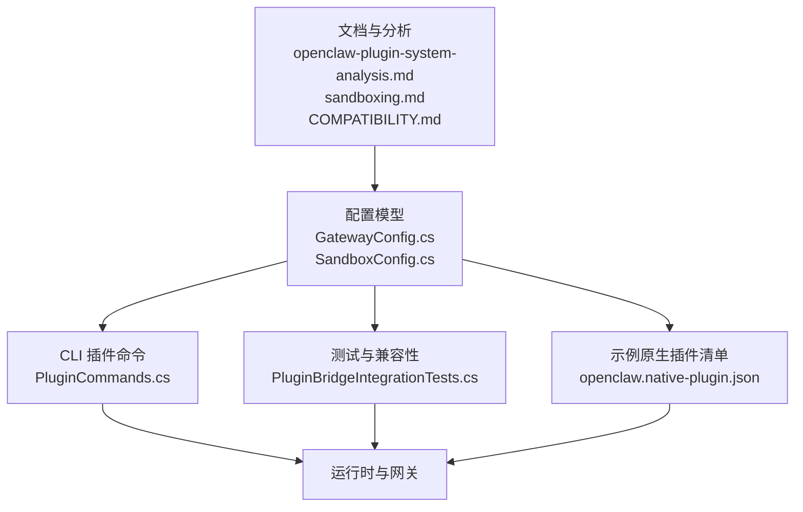
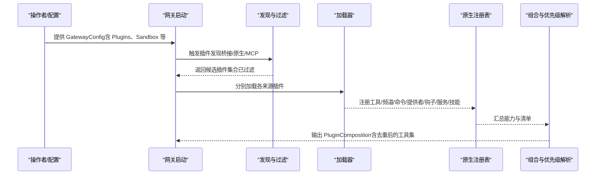
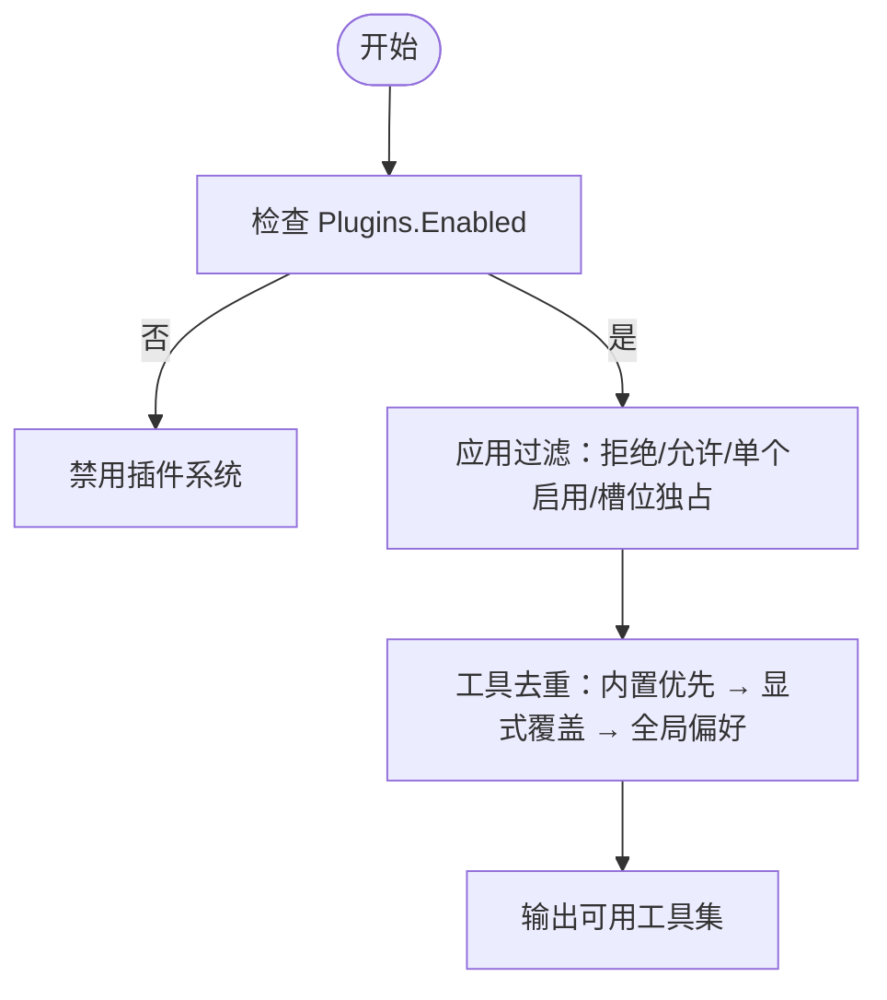
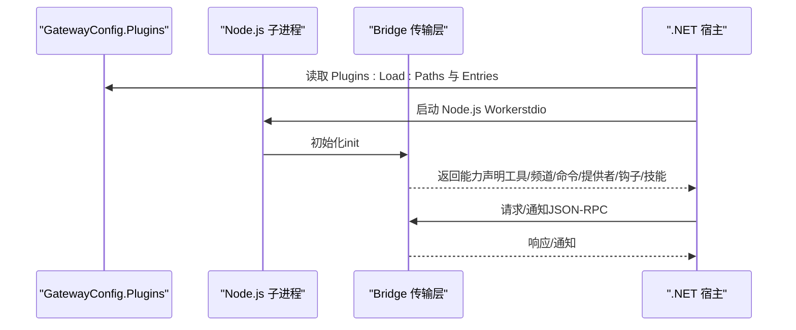
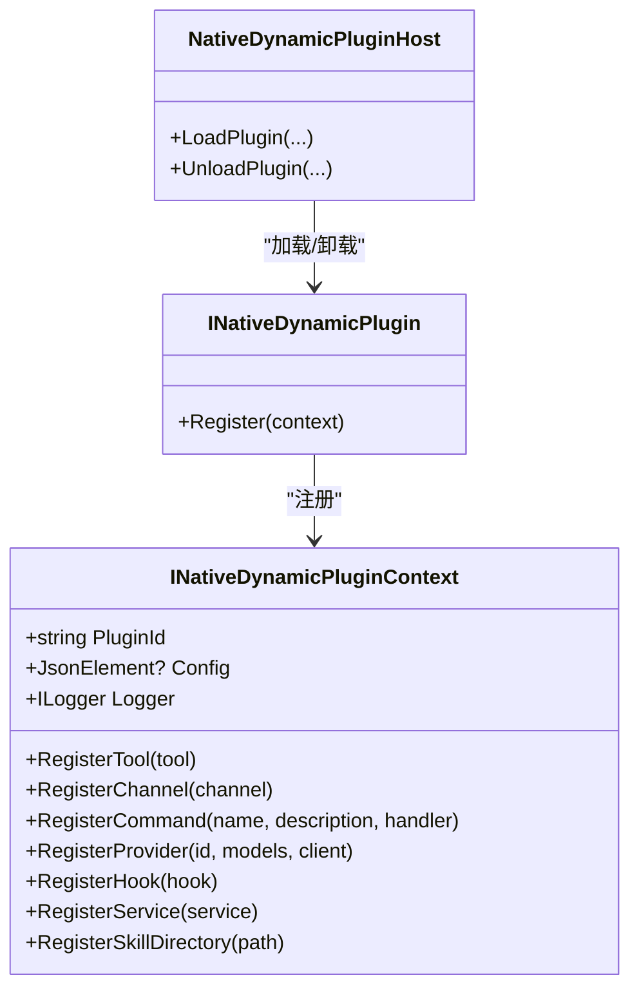
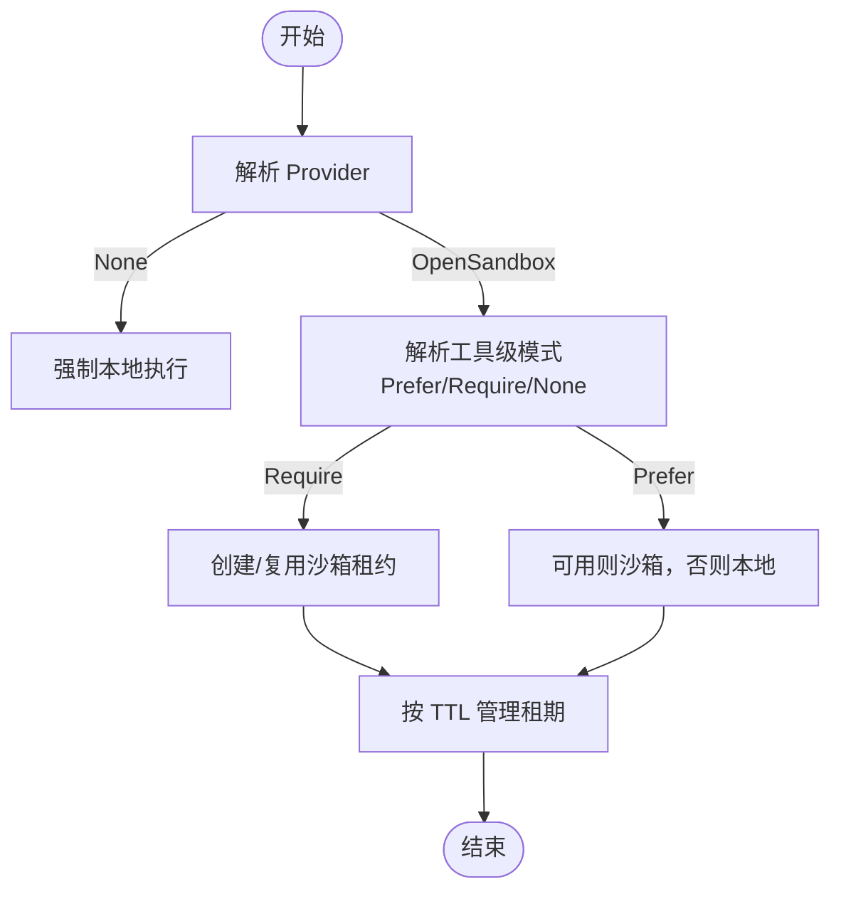
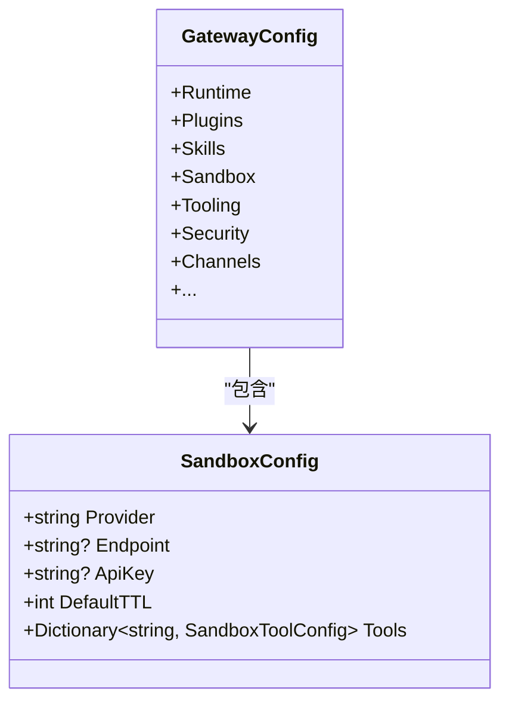
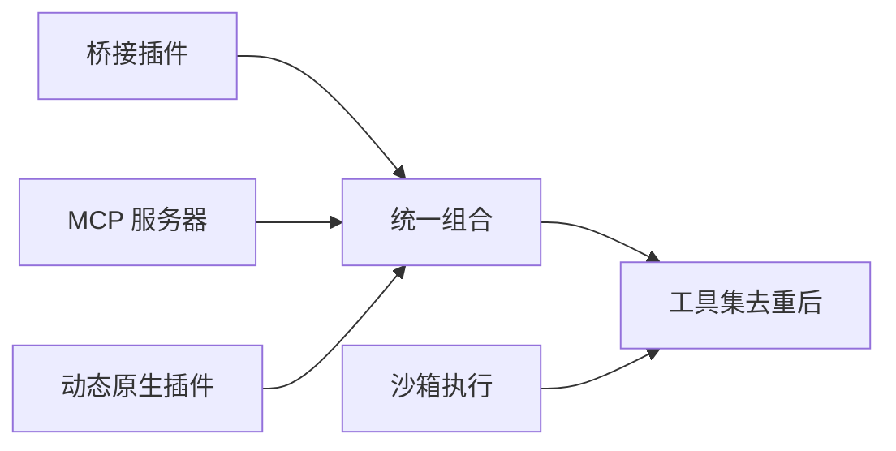

# 插件配置

<cite>
**本文引用的文件**
- [openclaw-plugin-system-analysis.md](file://docs/openclaw-plugin-system-analysis.md)
- [sandboxing.md](file://docs/sandboxing.md)
- [GatewayConfig.cs](file://src/OpenClaw.Core/Models/GatewayConfig.cs)
- [SandboxConfig.cs](file://src/OpenClaw.Core/Models/SandboxConfig.cs)
- [openclaw.native-plugin.json](file://src/OpenClaw.Plugins.EmploymentCoachWorkflow/openclaw.native-plugin.json)
- [PluginCommands.cs](file://src/OpenClaw.Cli/PluginCommands.cs)
- [PluginBridgeIntegrationTests.cs](file://src/OpenClaw.Tests/PluginBridgeIntegrationTests.cs)
- [COMPATIBILITY.md](file://docs/COMPATIBILITY.md)
</cite>

## 目录
1. [简介](#简介)
2. [项目结构](#项目结构)
3. [核心组件](#核心组件)
4. [架构总览](#架构总览)
5. [详细组件分析](#详细组件分析)
6. [依赖关系分析](#依赖关系分析)
7. [性能考量](#性能考量)
8. [故障排查指南](#故障排查指南)
9. [结论](#结论)
10. [附录](#附录)

## 简介
本文件面向插件配置系统，系统性阐述插件启用状态、桥接配置与原生插件设置，详解 TypeScript/JavaScript 插件的 Node.js 运行时配置、工作目录与环境变量，以及 .NET 原生插件的 JIT 模式配置、动态加载与生命周期管理。同时覆盖插件安全策略、沙箱配置与资源限制，并提供插件开发配置、调试设置与性能监控建议。

## 项目结构
围绕插件配置的关键模块分布于以下位置：
- 文档与分析：docs/openclaw-plugin-system-analysis.md、docs/sandboxing.md、docs/COMPATIBILITY.md
- 配置模型：src/OpenClaw.Core/Models 下的 GatewayConfig.cs、SandboxConfig.cs
- 示例原生插件清单：src/OpenClaw.Plugins.EmploymentCoachWorkflow/openclaw.native-plugin.json
- CLI 插件命令：src/OpenClaw.Cli/PluginCommands.cs
- 测试与兼容性：src/OpenClaw.Tests/PluginBridgeIntegrationTests.cs
- 运行时与网关：src/OpenClaw.Gateway（启动与组合流程）

**图表来源**
- [openclaw-plugin-system-analysis.md:1-439](file://docs/openclaw-plugin-system-analysis.md#L1-L439)
- [sandboxing.md:1-264](file://docs/sandboxing.md#L1-L264)
- [GatewayConfig.cs:1-898](file://src/OpenClaw.Core/Models/GatewayConfig.cs#L1-L898)
- [SandboxConfig.cs:1-168](file://src/OpenClaw.Core/Models/SandboxConfig.cs#L1-L168)
- [openclaw.native-plugin.json:1-11](file://src/OpenClaw.Plugins.EmploymentCoachWorkflow/openclaw.native-plugin.json#L1-L11)
- [PluginCommands.cs:302-332](file://src/OpenClaw.Cli/PluginCommands.cs#L302-L332)
- [PluginBridgeIntegrationTests.cs:406-513](file://src/OpenClaw.Tests/PluginBridgeIntegrationTests.cs#L406-L513)

**章节来源**
- [openclaw-plugin-system-analysis.md:1-439](file://docs/openclaw-plugin-system-analysis.md#L1-L439)
- [sandboxing.md:1-264](file://docs/sandboxing.md#L1-L264)
- [GatewayConfig.cs:1-898](file://src/OpenClaw.Core/Models/GatewayConfig.cs#L1-L898)
- [SandboxConfig.cs:1-168](file://src/OpenClaw.Core/Models/SandboxConfig.cs#L1-L168)
- [openclaw.native-plugin.json:1-11](file://src/OpenClaw.Plugins.EmploymentCoachWorkflow/openclaw.native-plugin.json#L1-L11)
- [PluginCommands.cs:302-332](file://src/OpenClaw.Cli/PluginCommands.cs#L302-L332)
- [PluginBridgeIntegrationTests.cs:406-513](file://src/OpenClaw.Tests/PluginBridgeIntegrationTests.cs#L406-L513)

## 核心组件
- 插件系统总体架构与来源：桥接插件（TS/JS，Node.js 子进程）、原生插件副本（C#，进程内）、动态原生插件（.NET，JIT，AssemblyLoadContext）、MCP 服务器（进程间）
- 发现与过滤：基于 openclaw.plugin.json/openclaw.native-plugin.json 的清单发现、路径解析与过滤（拒绝/允许/单个启用/槽位独占）
- 传输层：基于 stdio 的 JSON-RPC，支持 socket 模式
- 动态原生插件：AssemblyLoadContext 隔离、共享策略、兼容性校验（最低宿主版本、插件 API 版本、PluginKit 引用）
- 能力策略与优先级：AOT/JIT 门控、工具去重（内置优先、显式覆盖、全局偏好）
- 沙箱执行：OpenSandbox 集成，按工具粒度的 Prefer/Require/None 模式与模板、TTL、全局 Provider 开关

**章节来源**
- [openclaw-plugin-system-analysis.md:15-439](file://docs/openclaw-plugin-system-analysis.md#L15-L439)
- [COMPATIBILITY.md:72-103](file://docs/COMPATIBILITY.md#L72-L103)

## 架构总览
插件配置贯穿“发现—过滤—加载—组合—运行”全流程，核心在于统一的配置模型与多来源加载编排。

**图表来源**
- [openclaw-plugin-system-analysis.md:408-417](file://docs/openclaw-plugin-system-analysis.md#L408-L417)

## 详细组件分析

### 插件启用状态与优先级策略
- 启用开关：Plugins.Enabled 控制是否启用插件子系统
- 全局偏好：Plugins.Prefer 决定同名工具的归属（native 或 bridge）
- 单个启用：Plugins.Entries.{id}.Enabled 控制具体插件
- 槽位独占：Plugins.Slots.{kind} 指定某类能力的独占插件 ID
- 冲突解决：内置工具优先；显式覆盖；全局偏好

**图表来源**
- [openclaw-plugin-system-analysis.md:133-141](file://docs/openclaw-plugin-system-analysis.md#L133-L141)
- [openclaw-plugin-system-analysis.md:400-407](file://docs/openclaw-plugin-system-analysis.md#L400-L407)

**章节来源**
- [openclaw-plugin-system-analysis.md:133-141](file://docs/openclaw-plugin-system-analysis.md#L133-L141)
- [openclaw-plugin-system-analysis.md:400-407](file://docs/openclaw-plugin-system-analysis.md#L400-L407)

### 桥接插件（TS/JS）配置与运行时
- 配置入口：OpenClaw:Plugins（Bridge 层），而非 DynamicNative
- 路径与入口：Plugins:Load:Paths 支持插件目录、单文件入口、npm 风格包目录
- 清单与入口解析：openclaw.plugin.json 与 index.ts/js/mjs 候选解析，支持 skills 字段
- 运行时模式：Bridge 插件可在 AOT/JIT 模式运行，Node.js 子进程承载
- 传输模式：stdio（推荐）、socket、hybrid（预留）
- 环境变量与配置：支持 env: 引用；configSchema 用于启动前校验

**图表来源**
- [openclaw-plugin-system-analysis.md:40-132](file://docs/openclaw-plugin-system-analysis.md#L40-L132)

**章节来源**
- [openclaw-plugin-system-analysis.md:40-132](file://docs/openclaw-plugin-system-analysis.md#L40-L132)
- [COMPATIBILITY.md:72-103](file://docs/COMPATIBILITY.md#L72-L103)

### 原生插件（C#）与动态原生插件（.NET）
- 原生插件副本：进程内，使用 openclaw.native-plugin.json 清单，声明 assemblyPath/typeName/capabilities/skills/jitOnly
- 动态原生插件：JIT 专用，通过 AssemblyLoadContext 动态加载，具备热重载能力；需满足最低宿主版本、插件 API 版本与 PluginKit 引用一致性
- 兼容性校验：minHostVersion、pluginApiVersion 主版本匹配、PluginKit 引用检查
- 程序集共享策略：System.*、Microsoft.*、netstandard、OpenClaw.Core、OpenClaw.PluginKit 从宿主共享，其余从插件依赖目录加载

**图表来源**
- [openclaw-plugin-system-analysis.md:363-387](file://docs/openclaw-plugin-system-analysis.md#L363-L387)
- [openclaw-plugin-system-analysis.md:334-362](file://docs/openclaw-plugin-system-analysis.md#L334-L362)

**章节来源**
- [openclaw-plugin-system-analysis.md:142-248](file://docs/openclaw-plugin-system-analysis.md#L142-L248)
- [openclaw-plugin-system-analysis.md:334-387](file://docs/openclaw-plugin-system-analysis.md#L334-L387)
- [openclaw.native-plugin.json:1-11](file://src/OpenClaw.Plugins.EmploymentCoachWorkflow/openclaw.native-plugin.json#L1-L11)

### 沙箱配置与资源限制
- Provider 选择：None（禁用）、OpenSandbox（默认）
- 全局开关：OpenClaw:Sandbox:Provider=None 强制本地执行
- 工具级策略：shell/code_exec/browser 的 Prefer/Require/None 与模板镜像、TTL
- 默认 TTL：DefaultTTL
- 与安全策略联动：在非回环绑定场景下，Require+OpenSandbox 被视为已沙箱化；Prefer 仍可能回落到本地执行

**图表来源**
- [sandboxing.md:55-141](file://docs/sandboxing.md#L55-L141)
- [SandboxConfig.cs:1-168](file://src/OpenClaw.Core/Models/SandboxConfig.cs#L1-L168)

**章节来源**
- [sandboxing.md:55-141](file://docs/sandboxing.md#L55-L141)
- [SandboxConfig.cs:1-168](file://src/OpenClaw.Core/Models/SandboxConfig.cs#L1-L168)

### 配置模型与字段映射
- GatewayConfig：集中承载运行时、插件、技能、沙箱、工具治理、通道等配置
- SandboxConfig：Provider、Endpoint、ApiKey、DefaultTTL、Tools（按工具粒度的 Mode/Template/TTL）

**图表来源**
- [GatewayConfig.cs:1-800](file://src/OpenClaw.Core/Models/GatewayConfig.cs#L1-L800)
- [SandboxConfig.cs:1-168](file://src/OpenClaw.Core/Models/SandboxConfig.cs#L1-L168)

**章节来源**
- [GatewayConfig.cs:1-800](file://src/OpenClaw.Core/Models/GatewayConfig.cs#L1-L800)
- [SandboxConfig.cs:1-168](file://src/OpenClaw.Core/Models/SandboxConfig.cs#L1-L168)

### 插件开发配置、调试与性能监控
- 开发配置
  - TS/JS 插件：使用 jiti 依赖；清单 openclaw.plugin.json；配置 schema 校验
  - 原生插件：openclaw.native-plugin.json；assemblyPath/typeName/capabilities/skills/jitOnly
- 调试设置
  - CLI 插件命令：列出插件清单、信任级别与声明表面
  - 测试：PluginBridgeIntegrationTests 展示配置 schema 校验、无效配置诊断
- 性能监控
  - 运行时模式：AOT/JIT 影响启动成本与运行特性
  - 启动成本：Bridge（Node.js 进程）~100–300ms；动态原生（程序集加载）~10–50ms；MCP 服务器 ~100–500ms
  - 并行工具执行：Tooling.ParallelToolExecution 可提升吞吐

**章节来源**
- [openclaw-plugin-system-analysis.md:418-429](file://docs/openclaw-plugin-system-analysis.md#L418-L429)
- [PluginCommands.cs:302-332](file://src/OpenClaw.Cli/PluginCommands.cs#L302-L332)
- [PluginBridgeIntegrationTests.cs:406-513](file://src/OpenClaw.Tests/PluginBridgeIntegrationTests.cs#L406-L513)

## 依赖关系分析
- 插件来源耦合：Bridge/MCP/DynamicNative 通过统一的组合根汇聚到 PluginComposition
- 运行时模式耦合：AOT 模式下禁止动态原生插件，Bridge 插件不受影响
- 沙箱依赖：OpenSandbox 提供容器化执行环境，与工具策略解耦

**图表来源**
- [openclaw-plugin-system-analysis.md:391-407](file://docs/openclaw-plugin-system-analysis.md#L391-L407)
- [sandboxing.md:1-264](file://docs/sandboxing.md#L1-L264)

**章节来源**
- [openclaw-plugin-system-analysis.md:391-407](file://docs/openclaw-plugin-system-analysis.md#L391-L407)
- [sandboxing.md:1-264](file://docs/sandboxing.md#L1-L264)

## 性能考量
- 启动成本：Bridge 插件引入 Node.js 子进程开销；动态原生插件加载更快；MCP 服务器额外进程开销
- 并行执行：Tooling.ParallelToolExecution 可提升并发吞吐
- 沙箱租期：合理设置 TTL，平衡安全与性能
- 运行时模式：AOT 减少 JIT 成本，但限制动态原生插件；Bridge 插件在 AOT/JIT 均可运行

[本节为通用指导，无需特定文件引用]

## 故障排查指南
- 配置 schema 校验失败：确保 openclaw.plugin.json 的 configSchema 使用受支持关键字；错误将发生在 Node 启动前
- 不支持的桥接 API：初始化阶段会返回兼容性错误码
- AOT 模式中的 JIT-only 能力：在装配前报错，提示运行时模式不兼容
- 工具名冲突：首个工具获胜，后续重复将被跳过并记录诊断
- 沙箱不可用：Require 模式下若无可用沙箱，将失败关闭；Prefer 模式可回落到本地执行

**章节来源**
- [COMPATIBILITY.md:72-103](file://docs/COMPATIBILITY.md#L72-L103)
- [PluginBridgeIntegrationTests.cs:406-513](file://src/OpenClaw.Tests/PluginBridgeIntegrationTests.cs#L406-L513)
- [sandboxing.md:133-157](file://docs/sandboxing.md#L133-L157)

## 结论
OpenClaw 的插件配置体系以统一的配置模型与多来源加载为核心，结合严格的发现、过滤与优先级策略，既保证了灵活性，又确保了安全性与可运维性。TS/JS 桥接插件适合需要外部运行时的场景，动态原生插件适合需要深度集成与热重载的场景，MCP 服务器提供标准化外部工具生态接入。配合沙箱执行与工具级策略，可在生产环境中实现安全与性能的平衡。

[本节为总结，无需特定文件引用]

## 附录
- 示例原生插件清单字段说明：id/name/version/assemblyPath/typeName/capabilities/skills/jitOnly
- CLI 插件命令：展示插件路径、信任级别与声明表面
- 测试用例：验证配置 schema 校验、无效配置诊断与工具执行

**章节来源**
- [openclaw.native-plugin.json:1-11](file://src/OpenClaw.Plugins.EmploymentCoachWorkflow/openclaw.native-plugin.json#L1-L11)
- [PluginCommands.cs:302-332](file://src/OpenClaw.Cli/PluginCommands.cs#L302-L332)
- [PluginBridgeIntegrationTests.cs:406-513](file://src/OpenClaw.Tests/PluginBridgeIntegrationTests.cs#L406-L513)