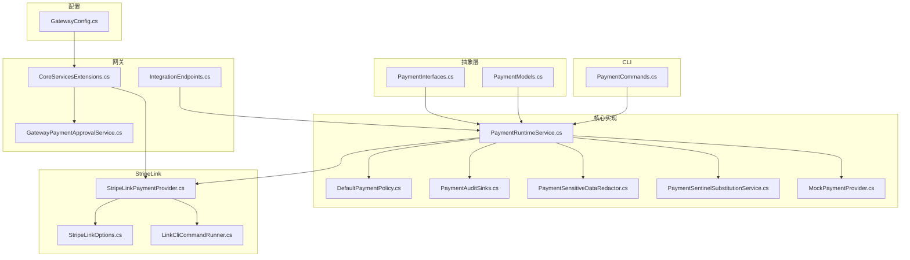
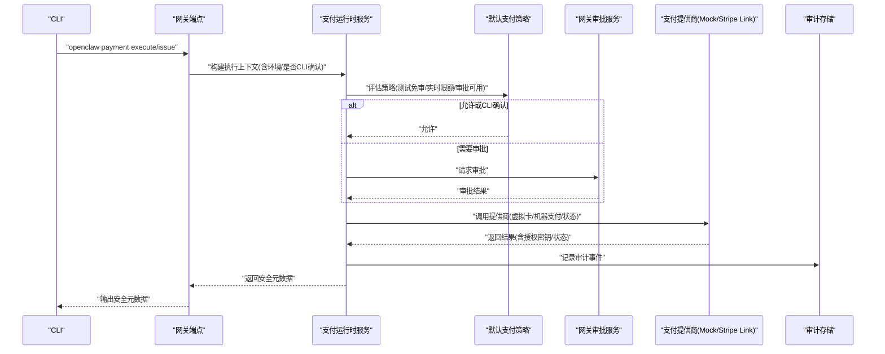
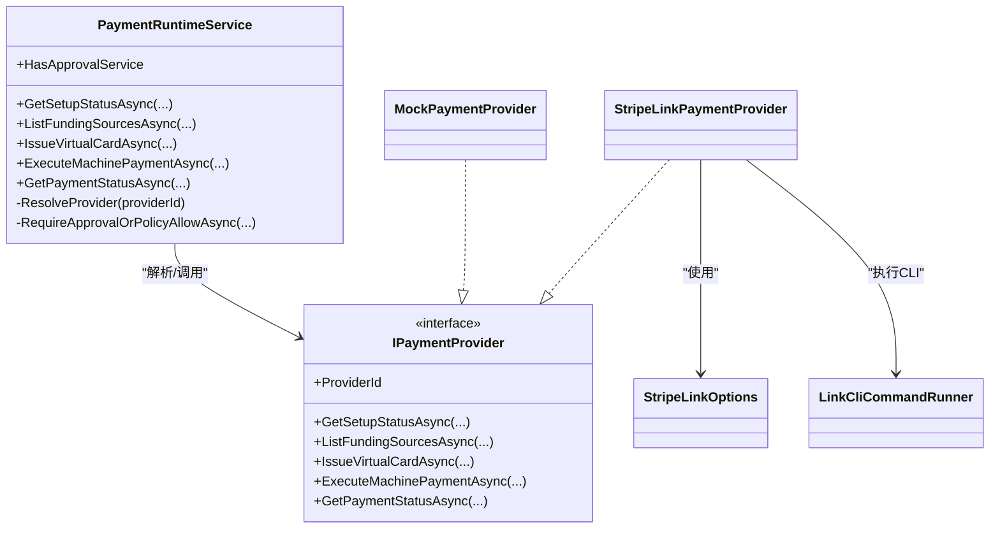
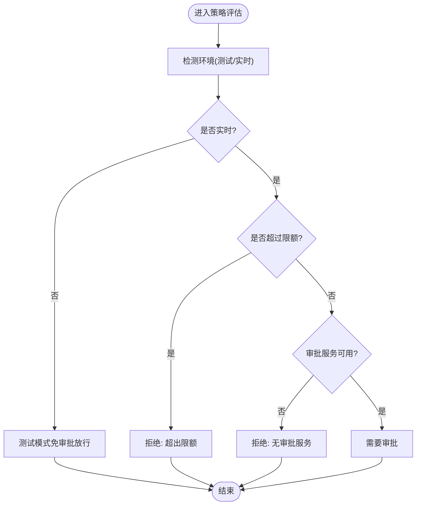
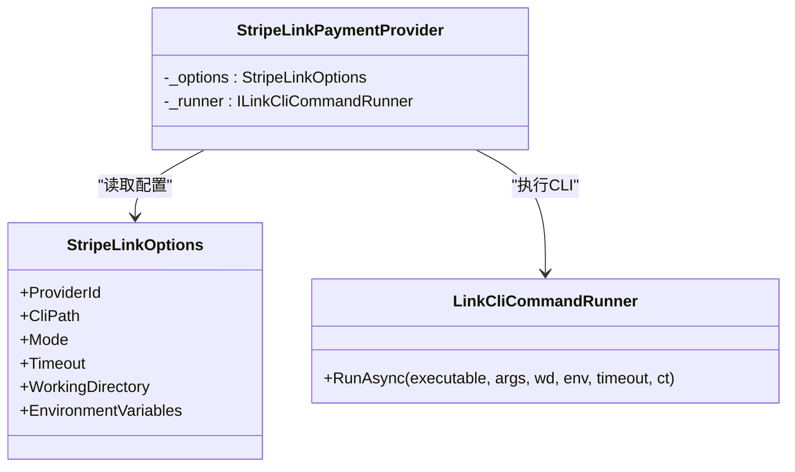
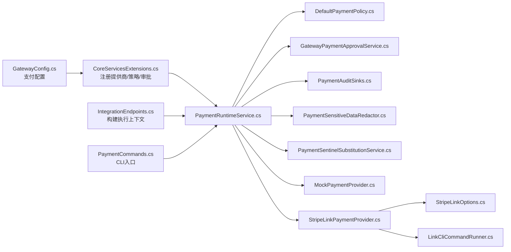

# 支付配置

<cite>
**本文引用的文件**
- [CoreServicesExtensions.cs](file://src/OpenClaw.Gateway/Composition/CoreServicesExtensions.cs)
- [GatewayConfig.cs](file://src/OpenClaw.Core/Models/GatewayConfig.cs)
- [PaymentInterfaces.cs](file://src/OpenClaw.Payments.Abstractions/PaymentInterfaces.cs)
- [PaymentModels.cs](file://src/OpenClaw.Payments.Abstractions/PaymentModels.cs)
- [PaymentRuntimeService.cs](file://src/OpenClaw.Payments.Core/PaymentRuntimeService.cs)
- [MockPaymentProvider.cs](file://src/OpenClaw.Payments.Core/MockPaymentProvider.cs)
- [StripeLinkPaymentProvider.cs](file://src/OpenClaw.Payments.StripeLink/StripeLinkPaymentProvider.cs)
- [StripeLinkOptions.cs](file://src/OpenClaw.Payments.StripeLink/StripeLinkOptions.cs)
- [LinkCliCommandRunner.cs](file://src/OpenClaw.Payments.StripeLink/LinkCliCommandRunner.cs)
- [DefaultPaymentPolicy.cs](file://src/OpenClaw.Payments.Core/DefaultPaymentPolicy.cs)
- [GatewayPaymentApprovalService.cs](file://src/OpenClaw.Gateway/GatewayPaymentApprovalService.cs)
- [PaymentAuditSinks.cs](file://src/OpenClaw.Payments.Core/PaymentAuditSinks.cs)
- [PaymentSensitiveDataRedactor.cs](file://src/OpenClaw.Payments.Core/PaymentSensitiveDataRedactor.cs)
- [PaymentSentinelSubstitutionService.cs](file://src/OpenClaw.Payments.Core/PaymentSentinelSubstitutionService.cs)
- [PaymentCommands.cs](file://src/OpenClaw.Cli/PaymentCommands.cs)
- [IntegrationEndpoints.cs](file://src/OpenClaw.Gateway/Endpoints/IntegrationEndpoints.cs)
</cite>

## 目录
1. [简介](#简介)
2. [项目结构](#项目结构)
3. [核心组件](#核心组件)
4. [架构总览](#架构总览)
5. [详细组件分析](#详细组件分析)
6. [依赖关系分析](#依赖关系分析)
7. [性能考量](#性能考量)
8. [故障排除指南](#故障排除指南)
9. [结论](#结论)
10. [附录](#附录)

## 简介
本技术文档面向支付配置系统，聚焦以下关键主题：
- 支付提供商选择：支持 Mock 与 Stripe Link，并可扩展至其他实现
- 测试模式配置与策略：测试模式免审批、实时支付限额与审批强制
- 敏感数据保护：自动脱敏、令牌化与最小化可见性
- 审计日志：贯穿全链路的审计事件记录
- Stripe Link 配置要点：CLI 路径、超时、工作目录与环境变量
- 支付机配置：HTTP 402 处理开关

## 项目结构
支付能力由多个子项目协同实现：
- 抽象层（Abstractions）：定义支付接口、模型与环境常量
- 核心实现（Core）：运行时服务、策略、审计、脱敏与哨兵替换
- 提供商实现（StripeLink）：基于 link-cli 的外部支付提供程序
- 网关集成（Gateway）：注册服务、策略注入、审批服务与端点上下文
- CLI 工具：支付命令行工具，支持测试/实时模式与 --yes 标记
- 配置模型（Core Models）：集中定义支付配置项

**图表来源**
- [PaymentInterfaces.cs:1-60](file://src/OpenClaw.Payments.Abstractions/PaymentInterfaces.cs#L1-L60)
- [PaymentModels.cs:1-400](file://src/OpenClaw.Payments.Abstractions/PaymentModels.cs#L1-L400)
- [PaymentRuntimeService.cs:1-433](file://src/OpenClaw.Payments.Core/PaymentRuntimeService.cs#L1-L433)
- [DefaultPaymentPolicy.cs:1-60](file://src/OpenClaw.Payments.Core/DefaultPaymentPolicy.cs#L1-L60)
- [PaymentAuditSinks.cs:1-19](file://src/OpenClaw.Payments.Core/PaymentAuditSinks.cs#L1-L19)
- [PaymentSensitiveDataRedactor.cs:1-88](file://src/OpenClaw.Payments.Core/PaymentSensitiveDataRedactor.cs#L1-L88)
- [PaymentSentinelSubstitutionService.cs:1-119](file://src/OpenClaw.Payments.Core/PaymentSentinelSubstitutionService.cs#L1-L119)
- [MockPaymentProvider.cs:1-165](file://src/OpenClaw.Payments.Core/MockPaymentProvider.cs#L1-L165)
- [StripeLinkPaymentProvider.cs:1-286](file://src/OpenClaw.Payments.StripeLink/StripeLinkPaymentProvider.cs#L1-L286)
- [StripeLinkOptions.cs:1-12](file://src/OpenClaw.Payments.StripeLink/StripeLinkOptions.cs#L1-L12)
- [LinkCliCommandRunner.cs:1-170](file://src/OpenClaw.Payments.StripeLink/LinkCliCommandRunner.cs#L1-L170)
- [CoreServicesExtensions.cs:60-78](file://src/OpenClaw.Gateway/Composition/CoreServicesExtensions.cs#L60-L78)
- [GatewayPaymentApprovalService.cs:1-104](file://src/OpenClaw.Gateway/GatewayPaymentApprovalService.cs#L1-L104)
- [IntegrationEndpoints.cs:845-855](file://src/OpenClaw.Gateway/Endpoints/IntegrationEndpoints.cs#L845-L855)
- [PaymentCommands.cs:1-206](file://src/OpenClaw.Cli/PaymentCommands.cs#L1-L206)
- [GatewayConfig.cs:492-532](file://src/OpenClaw.Core/Models/GatewayConfig.cs#L492-L532)

**章节来源**
- [GatewayConfig.cs:492-532](file://src/OpenClaw.Core/Models/GatewayConfig.cs#L492-L532)
- [CoreServicesExtensions.cs:60-78](file://src/OpenClaw.Gateway/Composition/CoreServicesExtensions.cs#L60-L78)

## 核心组件
- 支付运行时服务：统一编排提供商、策略、审批与审计，负责虚拟卡签发、机器支付执行与状态查询
- 默认支付策略：根据环境（测试/实时）、金额上限与审批可用性决定是否放行或要求审批
- 审计与脱敏：内置内存审计存储与敏感数据脱敏器，确保日志与输出不泄露敏感信息
- 哨兵替换服务：在浏览器填充场景中按需解封支付敏感字段，受策略与审批约束
- Mock 提供商：用于测试的确定性实现，提供资金来源与支付结果
- Stripe Link 提供商：通过 link-cli 执行真实支付操作，支持测试/实时模式与超时控制

**章节来源**
- [PaymentRuntimeService.cs:5-433](file://src/OpenClaw.Payments.Core/PaymentRuntimeService.cs#L5-L433)
- [DefaultPaymentPolicy.cs:5-60](file://src/OpenClaw.Payments.Core/DefaultPaymentPolicy.cs#L5-L60)
- [PaymentAuditSinks.cs:6-19](file://src/OpenClaw.Payments.Core/PaymentAuditSinks.cs#L6-L19)
- [PaymentSensitiveDataRedactor.cs:8-88](file://src/OpenClaw.Payments.Core/PaymentSensitiveDataRedactor.cs#L8-L88)
- [PaymentSentinelSubstitutionService.cs:8-119](file://src/OpenClaw.Payments.Core/PaymentSentinelSubstitutionService.cs#L8-L119)
- [MockPaymentProvider.cs:6-165](file://src/OpenClaw.Payments.Core/MockPaymentProvider.cs#L6-L165)
- [StripeLinkPaymentProvider.cs:6-286](file://src/OpenClaw.Payments.StripeLink/StripeLinkPaymentProvider.cs#L6-L286)

## 架构总览
支付配置系统通过网关启动阶段完成提供商与策略的装配，并在运行期由支付运行时服务协调各组件。

**图表来源**
- [PaymentCommands.cs:12-206](file://src/OpenClaw.Cli/PaymentCommands.cs#L12-L206)
- [IntegrationEndpoints.cs:845-855](file://src/OpenClaw.Gateway/Endpoints/IntegrationEndpoints.cs#L845-L855)
- [PaymentRuntimeService.cs:269-334](file://src/OpenClaw.Payments.Core/PaymentRuntimeService.cs#L269-L334)
- [DefaultPaymentPolicy.cs:21-51](file://src/OpenClaw.Payments.Core/DefaultPaymentPolicy.cs#L21-L51)
- [GatewayPaymentApprovalService.cs:27-102](file://src/OpenClaw.Gateway/GatewayPaymentApprovalService.cs#L27-L102)
- [StripeLinkPaymentProvider.cs:105-129](file://src/OpenClaw.Payments.StripeLink/StripeLinkPaymentProvider.cs#L105-L129)
- [MockPaymentProvider.cs:100-148](file://src/OpenClaw.Payments.Core/MockPaymentProvider.cs#L100-L148)
- [PaymentAuditSinks.cs:12-17](file://src/OpenClaw.Payments.Core/PaymentAuditSinks.cs#L12-L17)

## 详细组件分析

### 支付提供商选择与装配
- 提供商注册：根据配置选择 Stripe Link 或使用 Mock 作为默认提供商
- 运行时解析：按请求中的 ProviderId 解析具体提供商实例
- 环境切换：运行时上下文可覆盖环境（测试/实时），影响策略与提供商行为

**图表来源**
- [PaymentRuntimeService.cs:5-433](file://src/OpenClaw.Payments.Core/PaymentRuntimeService.cs#L5-L433)
- [MockPaymentProvider.cs:6-165](file://src/OpenClaw.Payments.Core/MockPaymentProvider.cs#L6-L165)
- [StripeLinkPaymentProvider.cs:6-286](file://src/OpenClaw.Payments.StripeLink/StripeLinkPaymentProvider.cs#L6-L286)
- [StripeLinkOptions.cs:3-12](file://src/OpenClaw.Payments.StripeLink/StripeLinkOptions.cs#L3-L12)
- [LinkCliCommandRunner.cs:15-170](file://src/OpenClaw.Payments.StripeLink/LinkCliCommandRunner.cs#L15-L170)

**章节来源**
- [CoreServicesExtensions.cs:60-78](file://src/OpenClaw.Gateway/Composition/CoreServicesExtensions.cs#L60-L78)
- [PaymentRuntimeService.cs:336-343](file://src/OpenClaw.Payments.Core/PaymentRuntimeService.cs#L336-L343)

### 测试模式配置与策略
- 测试模式免审批：策略允许测试环境下的支付直接放行
- 实时支付限制：可配置最大实时金额，超出限额直接拒绝
- 审批可用性：实时且无审批服务时可被拒绝；CLI 确认可绕过交互式审批

**图表来源**
- [DefaultPaymentPolicy.cs:21-51](file://src/OpenClaw.Payments.Core/DefaultPaymentPolicy.cs#L21-L51)

**章节来源**
- [DefaultPaymentPolicy.cs:5-60](file://src/OpenClaw.Payments.Core/DefaultPaymentPolicy.cs#L5-L60)
- [PaymentRuntimeService.cs:269-334](file://src/OpenClaw.Payments.Core/PaymentRuntimeService.cs#L269-L334)

### Stripe Link 配置要点
- CLI 路径：可配置 link-cli 可执行文件路径，默认值为 "link-cli"
- 超时设置：以秒为单位，最小为 1 秒，防止长时间阻塞
- 工作目录：可选的工作目录，影响 CLI 执行环境
- 环境变量：传递给 link-cli 的环境变量字典
- 模式：测试/实时模式，影响提供商行为与资金来源列表

**图表来源**
- [StripeLinkOptions.cs:3-12](file://src/OpenClaw.Payments.StripeLink/StripeLinkOptions.cs#L3-L12)
- [StripeLinkPaymentProvider.cs:11-141](file://src/OpenClaw.Payments.StripeLink/StripeLinkPaymentProvider.cs#L11-L141)
- [LinkCliCommandRunner.cs:36-114](file://src/OpenClaw.Payments.StripeLink/LinkCliCommandRunner.cs#L36-L114)

**章节来源**
- [StripeLinkOptions.cs:1-12](file://src/OpenClaw.Payments.StripeLink/StripeLinkOptions.cs#L1-L12)
- [StripeLinkPaymentProvider.cs:19-68](file://src/OpenClaw.Payments.StripeLink/StripeLinkPaymentProvider.cs#L19-L68)
- [LinkCliCommandRunner.cs:36-114](file://src/OpenClaw.Payments.StripeLink/LinkCliCommandRunner.cs#L36-L114)

### Mock 提供商配置与资金来源显示
- 提供商 ID：默认 "mock"
- 资金来源显示名：如 "Mock Visa ending 4242"
- 资金来源列表：返回固定资金来源，便于前端展示
- 虚拟卡签发：生成确定性的卡号、CVV、有效期与消费请求 ID
- 机器支付：返回确定性支付结果与短期授权密钥

**章节来源**
- [GatewayConfig.cs:514-518](file://src/OpenClaw.Core/Models/GatewayConfig.cs#L514-L518)
- [MockPaymentProvider.cs:32-45](file://src/OpenClaw.Payments.Core/MockPaymentProvider.cs#L32-L45)
- [MockPaymentProvider.cs:47-98](file://src/OpenClaw.Payments.Core/MockPaymentProvider.cs#L47-L98)
- [MockPaymentProvider.cs:100-148](file://src/OpenClaw.Payments.Core/MockPaymentProvider.cs#L100-L148)

### 支付机配置（HTTP 402）
- 开关：EnableHttp402Handler 控制是否启用 HTTP 402 处理
- 作用：在网关层对 402 挑战进行处理，结合机器支付流程

**章节来源**
- [GatewayConfig.cs:529-532](file://src/OpenClaw.Core/Models/GatewayConfig.cs#L529-L532)

### 审计日志与敏感数据保护
- 审计事件：涵盖虚拟卡签发、机器支付尝试/完成/失败、状态查询、审批请求/结果等
- 内存审计存储：提供快照能力，便于调试与回溯
- 脱敏规则：对卡号、CVV、授权头、JSON 字段与令牌进行识别与替换
- 哨兵替换：在浏览器填充场景中按需解封敏感字段，受策略与审批约束

**章节来源**
- [PaymentRuntimeService.cs:84-114](file://src/OpenClaw.Payments.Core/PaymentRuntimeService.cs#L84-L114)
- [PaymentRuntimeService.cs:135-175](file://src/OpenClaw.Payments.Core/PaymentRuntimeService.cs#L135-L175)
- [PaymentRuntimeService.cs:178-199](file://src/OpenClaw.Payments.Core/PaymentRuntimeService.cs#L178-L199)
- [PaymentRuntimeService.cs:217-264](file://src/OpenClaw.Payments.Core/PaymentRuntimeService.cs#L217-L264)
- [PaymentAuditSinks.cs:6-19](file://src/OpenClaw.Payments.Core/PaymentAuditSinks.cs#L6-L19)
- [PaymentSensitiveDataRedactor.cs:32-50](file://src/OpenClaw.Payments.Core/PaymentSensitiveDataRedactor.cs#L32-L50)
- [PaymentSentinelSubstitutionService.cs:21-86](file://src/OpenClaw.Payments.Core/PaymentSentinelSubstitutionService.cs#L21-L86)

## 依赖关系分析
- 组件耦合：运行时服务聚合策略、审批与审计，降低对具体提供商的耦合
- 外部依赖：Stripe Link 依赖 link-cli 可执行文件与环境变量；Mock 提供商为纯内存实现
- 集成点：网关端点将查询参数转换为执行上下文，驱动运行时服务

**图表来源**
- [GatewayConfig.cs:492-532](file://src/OpenClaw.Core/Models/GatewayConfig.cs#L492-L532)
- [CoreServicesExtensions.cs:60-78](file://src/OpenClaw.Gateway/Composition/CoreServicesExtensions.cs#L60-L78)
- [PaymentRuntimeService.cs:1-433](file://src/OpenClaw.Payments.Core/PaymentRuntimeService.cs#L1-L433)
- [DefaultPaymentPolicy.cs:1-60](file://src/OpenClaw.Payments.Core/DefaultPaymentPolicy.cs#L1-L60)
- [GatewayPaymentApprovalService.cs:1-104](file://src/OpenClaw.Gateway/GatewayPaymentApprovalService.cs#L1-L104)
- [PaymentAuditSinks.cs:1-19](file://src/OpenClaw.Payments.Core/PaymentAuditSinks.cs#L1-L19)
- [PaymentSensitiveDataRedactor.cs:1-88](file://src/OpenClaw.Payments.Core/PaymentSensitiveDataRedactor.cs#L1-L88)
- [PaymentSentinelSubstitutionService.cs:1-119](file://src/OpenClaw.Payments.Core/PaymentSentinelSubstitutionService.cs#L1-L119)
- [MockPaymentProvider.cs:1-165](file://src/OpenClaw.Payments.Core/MockPaymentProvider.cs#L1-L165)
- [StripeLinkPaymentProvider.cs:1-286](file://src/OpenClaw.Payments.StripeLink/StripeLinkPaymentProvider.cs#L1-L286)
- [StripeLinkOptions.cs:1-12](file://src/OpenClaw.Payments.StripeLink/StripeLinkOptions.cs#L1-L12)
- [LinkCliCommandRunner.cs:1-170](file://src/OpenClaw.Payments.StripeLink/LinkCliCommandRunner.cs#L1-L170)
- [IntegrationEndpoints.cs:845-855](file://src/OpenClaw.Gateway/Endpoints/IntegrationEndpoints.cs#L845-L855)
- [PaymentCommands.cs:1-206](file://src/OpenClaw.Cli/PaymentCommands.cs#L1-L206)

**章节来源**
- [CoreServicesExtensions.cs:60-78](file://src/OpenClaw.Gateway/Composition/CoreServicesExtensions.cs#L60-L78)
- [IntegrationEndpoints.cs:845-855](file://src/OpenClaw.Gateway/Endpoints/IntegrationEndpoints.cs#L845-L855)

## 性能考量
- 超时控制：Stripe Link CLI 调用具备超时机制，避免阻塞；建议根据网络与 CLI 启动时间合理设置
- 审计队列：内存审计存储采用并发队列，注意在高并发场景下定期导出或持久化
- 脱敏成本：正则匹配与字符串替换存在 CPU 成本，建议在必要路径启用并避免重复脱敏
- 机密存储：短期授权密钥 TTL 较短，减少泄露窗口；长有效期凭据按最长有效时间或默认阈值控制

[本节为通用指导，不直接分析具体文件]

## 故障排除指南
- Stripe Link 未安装或无法启动
  - 症状：设置状态显示未安装，stderr 包含错误信息
  - 排查：检查 link-cli 可执行文件路径、工作目录与环境变量；确认 CLI 版本与权限
  - 参考
    - [StripeLinkPaymentProvider.cs:19-68](file://src/OpenClaw.Payments.StripeLink/StripeLinkPaymentProvider.cs#L19-L68)
    - [LinkCliCommandRunner.cs:36-114](file://src/OpenClaw.Payments.StripeLink/LinkCliCommandRunner.cs#L36-L114)
- 虚拟卡/机器支付失败
  - 症状：stderr 包含错误信息，抛出异常
  - 排查：核对商户名称、金额、币种、资金来源 ID；检查 CLI 输出与提供商响应
  - 参考
    - [StripeLinkPaymentProvider.cs:79-103](file://src/OpenClaw.Payments.StripeLink/StripeLinkPaymentProvider.cs#L79-L103)
    - [StripeLinkPaymentProvider.cs:105-129](file://src/OpenClaw.Payments.StripeLink/StripeLinkPaymentProvider.cs#L105-L129)
- 审批未通过或超时
  - 症状：策略拒绝或审批超时
  - 排查：确认实时支付限额、审批服务可用性与 CLI 确认标记；检查审批超时配置
  - 参考
    - [DefaultPaymentPolicy.cs:21-51](file://src/OpenClaw.Payments.Core/DefaultPaymentPolicy.cs#L21-L51)
    - [GatewayPaymentApprovalService.cs:27-102](file://src/OpenClaw.Gateway/GatewayPaymentApprovalService.cs#L27-L102)
- 审计缺失或敏感信息泄露
  - 症状：缺少审计事件或日志包含敏感信息
  - 排查：确认审计存储已注册；检查脱敏器是否生效；避免在非安全路径输出完整凭据
  - 参考
    - [PaymentAuditSinks.cs:12-17](file://src/OpenClaw.Payments.Core/PaymentAuditSinks.cs#L12-L17)
    - [PaymentSensitiveDataRedactor.cs:32-50](file://src/OpenClaw.Payments.Core/PaymentSensitiveDataRedactor.cs#L32-L50)
- CLI 使用注意事项
  - 症状：实时支付报错需要 --yes
  - 排查：实时支付必须显式确认；测试模式默认允许
  - 参考
    - [PaymentCommands.cs:114-118](file://src/OpenClaw.Cli/PaymentCommands.cs#L114-L118)

**章节来源**
- [StripeLinkPaymentProvider.cs:19-68](file://src/OpenClaw.Payments.StripeLink/StripeLinkPaymentProvider.cs#L19-L68)
- [LinkCliCommandRunner.cs:36-114](file://src/OpenClaw.Payments.StripeLink/LinkCliCommandRunner.cs#L36-L114)
- [DefaultPaymentPolicy.cs:21-51](file://src/OpenClaw.Payments.Core/DefaultPaymentPolicy.cs#L21-L51)
- [GatewayPaymentApprovalService.cs:27-102](file://src/OpenClaw.Gateway/GatewayPaymentApprovalService.cs#L27-L102)
- [PaymentAuditSinks.cs:12-17](file://src/OpenClaw.Payments.Core/PaymentAuditSinks.cs#L12-L17)
- [PaymentSensitiveDataRedactor.cs:32-50](file://src/OpenClaw.Payments.Core/PaymentSensitiveDataRedactor.cs#L32-L50)
- [PaymentCommands.cs:114-118](file://src/OpenClaw.Cli/PaymentCommands.cs#L114-L118)

## 结论
该支付配置系统通过清晰的抽象与模块化设计，实现了从策略、审批到提供商执行与审计的全链路闭环。测试模式免审批与实时限额相结合，既保障了开发效率，又强化了风险控制。Stripe Link 与 Mock 提供商的可插拔设计，使得系统在不同环境下具备一致的行为与可观测性。配合严格的敏感数据脱敏与审计日志，满足生产级的安全与合规要求。

[本节为总结性内容，不直接分析具体文件]

## 附录
- 配置项速览
  - 支付启用、工具启用、提供商、环境、密钥TTL
  - 策略：测试免审批、实时拒绝无审批、最大实时金额
  - Mock：提供商 ID、资金来源显示名
  - Stripe Link：提供商 ID、CLI 路径、超时秒数、工作目录、环境变量
  - 支付机：HTTP 402 处理开关

**章节来源**
- [GatewayConfig.cs:492-532](file://src/OpenClaw.Core/Models/GatewayConfig.cs#L492-L532)