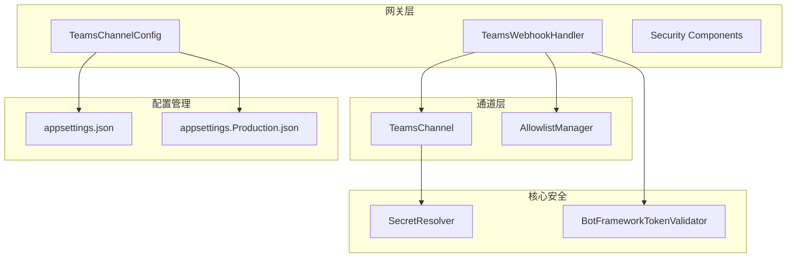
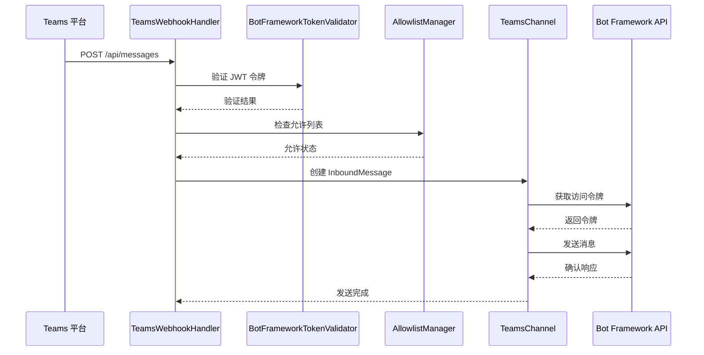
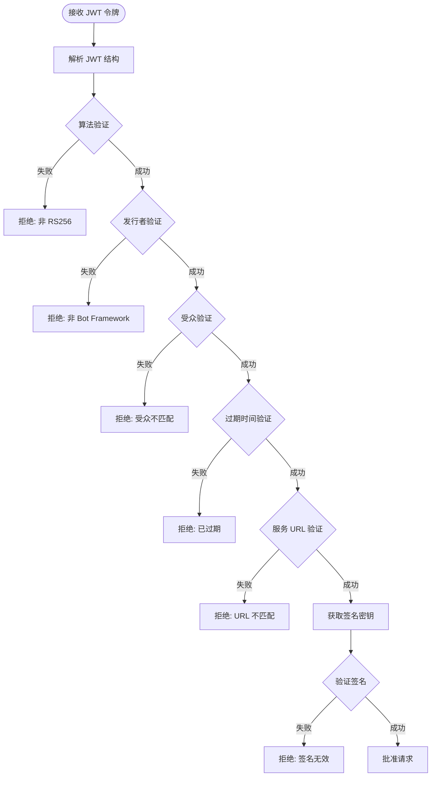
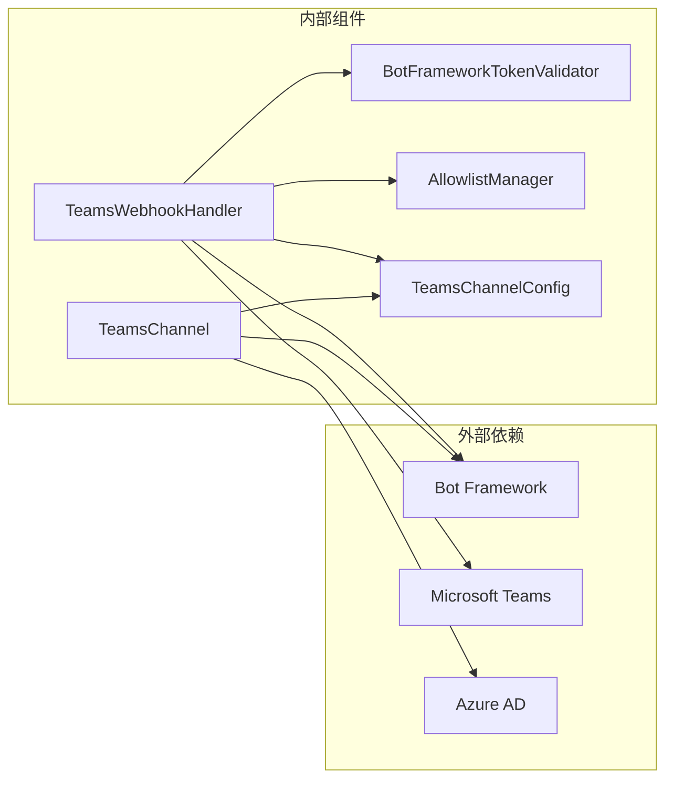
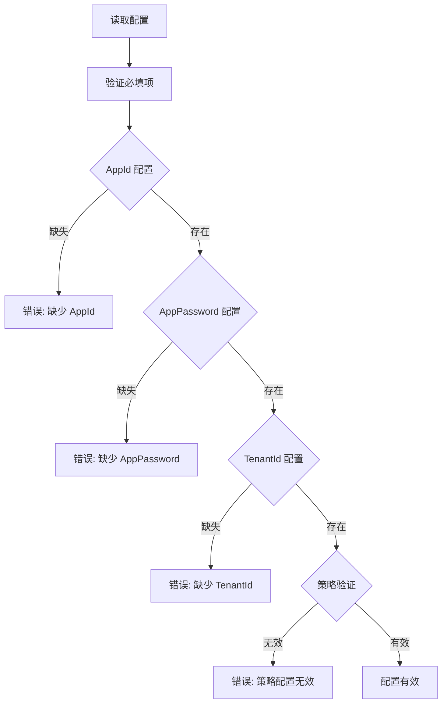

# Teams 渠道配置

<cite>
**本文档引用的文件**
- [TEAMS_SETUP.md](file://docs/TEAMS_SETUP.md)
- [TeamsChannel.cs](file://src/OpenClaw.Channels/TeamsChannel.cs)
- [TeamsWebhookHandler.cs](file://src/OpenClaw.Gateway/TeamsWebhookHandler.cs)
- [GatewayConfig.cs](file://src/OpenClaw.Core/Models/GatewayConfig.cs)
- [AllowlistManager.cs](file://src/OpenClaw.Core/Security/AllowlistManager.cs)
- [BotFrameworkTokenValidator.cs](file://src/OpenClaw.Gateway/BotFrameworkTokenValidator.cs)
- [SecretResolver.cs](file://src/OpenClaw.Core/Security/SecretResolver.cs)
- [appsettings.json](file://src/OpenClaw.Gateway/appsettings.json)
- [appsettings.Production.json](file://src/OpenClaw.Gateway/appsettings.Production.json)
- [ChannelReadinessEvaluator.cs](file://src/OpenClaw.Gateway/ChannelReadinessEvaluator.cs)
- [ConfigValidator.cs](file://src/OpenClaw.Core/Validation/ConfigValidator.cs)
- [TeamsWebhookHandlerTests.cs](file://src/OpenClaw.Tests/TeamsWebhookHandlerTests.cs)
</cite>

## 目录
1. [简介](#简介)
2. [项目结构](#项目结构)
3. [核心组件](#核心组件)
4. [架构概览](#架构概览)
5. [详细组件分析](#详细组件分析)
6. [依赖关系分析](#依赖关系分析)
7. [性能考虑](#性能考虑)
8. [故障排除指南](#故障排除指南)
9. [结论](#结论)
10. [附录](#附录)

## 简介

本文档为 OpenClaw 项目的 Teams 渠道配置提供全面的技术指导。OpenClaw 通过 Azure Bot Framework 支持 Microsoft Teams，采用 HTTPS Webhook 接收消息并通过 Bot Connector REST API 进行回复。

该系统支持多种访问控制策略，包括直接消息策略（open/pairing/closed）和群组策略（open/allowlist/disabled），并提供灵活的安全配置选项，如租户 ID 允许列表、发送者 ID 允许列表和团队 ID 允许列表。

## 项目结构

OpenClaw 项目采用分层架构设计，Teams 渠道相关的核心组件分布在以下模块中：



**图表来源**
- [TeamsWebhookHandler.cs:15-40](file://src/OpenClaw.Gateway/TeamsWebhookHandler.cs#L15-L40)
- [TeamsChannel.cs:21-52](file://src/OpenClaw.Channels/TeamsChannel.cs#L21-L52)
- [GatewayConfig.cs:636-686](file://src/OpenClaw.Core/Models/GatewayConfig.cs#L636-L686)

**章节来源**
- [appsettings.json:431-453](file://src/OpenClaw.Gateway/appsettings.json#L431-L453)
- [appsettings.Production.json:1-65](file://src/OpenClaw.Gateway/appsettings.Production.json#L1-L65)

## 核心组件

### TeamsChannelConfig 配置模型

TeamsChannelConfig 定义了 Teams 渠道的所有配置参数：

| 参数名称 | 类型 | 默认值 | 描述 |
|---------|------|--------|------|
| Enabled | bool | false | 主开关 |
| DmPolicy | string | "pairing" | 直接消息策略 |
| GroupPolicy | string | "allowlist" | 群组策略 |
| AppId | string | null | Azure Bot App ID |
| AppIdRef | string | "env:TEAMS_APP_ID" | App ID 引用 |
| AppPassword | string | null | Azure Bot 密钥 |
| AppPasswordRef | string | "env:TEAMS_APP_PASSWORD" | 密钥引用 |
| TenantId | string | null | Azure AD 租户 ID |
| TenantIdRef | string | "env:TEAMS_TENANT_ID" | 租户 ID 引用 |
| WebhookPath | string | "/api/messages" | Webhook 路径 |
| ValidateToken | bool | true | JWT 验证开关 |
| RequireMention | bool | true | @提及要求 |
| ReplyStyle | string | "thread" | 回复样式 |
| TextChunkLimit | int | 4000 | 文本分块限制 |
| ChunkMode | string | "length" | 分块模式 |

**章节来源**
- [GatewayConfig.cs:636-686](file://src/OpenClaw.Core/Models/GatewayConfig.cs#L636-L686)

### SecretResolver 密钥解析器

统一的密钥解析机制支持三种格式：
- `env:VAR_NAME` - 从环境变量读取
- `raw:literal` - 直接字面量值
- `bare_string` - 环境变量名回退到字面量

**章节来源**
- [SecretResolver.cs:14-65](file://src/OpenClaw.Core/Security/SecretResolver.cs#L14-L65)

## 架构概览

OpenClaw 的 Teams 集成采用事件驱动架构，通过以下关键组件协同工作：



**图表来源**
- [TeamsWebhookHandler.cs:42-188](file://src/OpenClaw.Gateway/TeamsWebhookHandler.cs#L42-L188)
- [BotFrameworkTokenValidator.cs:40-134](file://src/OpenClaw.Gateway/BotFrameworkTokenValidator.cs#L40-L134)
- [TeamsChannel.cs:138-175](file://src/OpenClaw.Channels/TeamsChannel.cs#L138-L175)

## 详细组件分析

### TeamsWebhookHandler 处理器

TeamsWebhookHandler 是入站消息的主要处理入口，负责：

#### JWT 令牌验证
- 验证 Azure Bot Framework JWT 令牌的完整性
- 检查发行者、受众、服务 URL 等声明
- 使用 Bot Framework 公开密钥验证签名

#### 访问控制检查
- 租户 ID 允许列表验证
- 发送者 ID 允许列表检查
- 群组策略执行（open/allowlist/disabled）

#### 消息预处理
- @提及检测和清理
- 文本长度截断
- 会话信息记录

**章节来源**
- [TeamsWebhookHandler.cs:42-188](file://src/OpenClaw.Gateway/TeamsWebhookHandler.cs#L42-L188)

### TeamsChannel 出站消息组件

TeamsChannel 负责将消息发送到 Teams：

#### 令牌管理
- 自动获取和缓存访问令牌
- 令牌过期处理和并发控制
- OAuth 2.0 客户端凭据流程

#### 消息发送
- 支持线程回复和顶级回复
- 文本分块和换行符保留
- 错误处理和重试机制

#### 会话引用存储
- 存储对话参考信息
- 支持主动消息推送
- 多种键值存储方式

**章节来源**
- [TeamsChannel.cs:63-110](file://src/OpenClaw.Channels/TeamsChannel.cs#L63-L110)
- [TeamsChannel.cs:138-175](file://src/OpenClaw.Channels/TeamsChannel.cs#L138-L175)

### BotFrameworkTokenValidator 令牌验证器

实现完整的 JWT 验证逻辑：



**图表来源**
- [BotFrameworkTokenValidator.cs:40-134](file://src/OpenClaw.Gateway/BotFrameworkTokenValidator.cs#L40-L134)

**章节来源**
- [BotFrameworkTokenValidator.cs:15-134](file://src/OpenClaw.Gateway/BotFrameworkTokenValidator.cs#L15-L134)

### AllowlistManager 允许列表管理

提供动态和静态允许列表管理：

#### 动态允许列表
- 基于存储路径的 JSON 文件持久化
- 运行时热更新支持
- 并发安全的文件写入

#### 配置优先级
- 动态文件优先于静态配置
- 支持 per-channel 配置
- 实时生效的策略调整

**章节来源**
- [AllowlistManager.cs:19-84](file://src/OpenClaw.Core/Security/AllowlistManager.cs#L19-L84)

## 依赖关系分析



**图表来源**
- [TeamsWebhookHandler.cs:15-40](file://src/OpenClaw.Gateway/TeamsWebhookHandler.cs#L15-L40)
- [TeamsChannel.cs:21-52](file://src/OpenClaw.Channels/TeamsChannel.cs#L21-L52)

### 组件耦合度分析

- **低耦合设计**：各组件职责明确，通过接口和配置进行交互
- **高内聚性**：每个组件专注于特定功能领域
- **可扩展性**：支持新的访问控制策略和安全机制

**章节来源**
- [GatewayConfig.cs:636-686](file://src/OpenClaw.Core/Models/GatewayConfig.cs#L636-L686)
- [TeamsWebhookHandler.cs:15-40](file://src/OpenClaw.Gateway/TeamsWebhookHandler.cs#L15-L40)

## 性能考虑

### 令牌缓存优化
- 5分钟提前刷新机制
- 互斥锁防止并发重复获取
- 内存缓存减少 API 调用

### 消息处理优化
- 异步流式处理
- 连接池复用
- 批量操作支持

### 内存管理
- 会话引用的弱引用存储
- 及时释放 HTTP 客户端
- 日志级别的条件记录

## 故障排除指南

### 常见问题诊断

#### 401 未授权错误
- 检查 JWT 令牌验证是否启用
- 验证 Bot Framework 证书配置
- 确认服务 URL 匹配

#### 消息不响应
- 验证 Teams 应用安装状态
- 检查 @提及要求设置
- 确认允许列表配置

#### 主动消息失败
- 确保用户已与机器人交互
- 检查会话引用存储状态
- 验证访问令牌有效性

**章节来源**
- [TEAMS_SETUP.md:182-205](file://docs/TEAMS_SETUP.md#L182-L205)

### 配置验证

系统提供自动配置验证功能：



**图表来源**
- [ConfigValidator.cs:339-355](file://src/OpenClaw.Core/Validation/ConfigValidator.cs#L339-L355)

**章节来源**
- [ConfigValidator.cs:339-355](file://src/OpenClaw.Core/Validation/ConfigValidator.cs#L339-L355)

## 结论

OpenClaw 的 Teams 渠道配置提供了企业级的安全性和灵活性。通过模块化的架构设计和完善的配置管理机制，系统能够满足不同规模组织的需求。

关键优势包括：
- **安全性**：多层访问控制和严格的令牌验证
- **灵活性**：可配置的策略和动态允许列表
- **可靠性**：完善的错误处理和监控机制
- **可维护性**：清晰的代码结构和详细的文档

## 附录

### 完整配置示例

```json
{
  "Channels": {
    "Teams": {
      "Enabled": true,
      "AppId": "your-app-id",
      "AppPassword": "your-client-secret",
      "TenantId": "your-tenant-id",
      "WebhookPath": "/api/messages",
      "DmPolicy": "pairing",
      "GroupPolicy": "allowlist",
      "RequireMention": true,
      "AllowedTenantIds": ["tenant-id-1", "tenant-id-2"],
      "AllowedFromIds": ["user-id-1", "user-id-2"],
      "AllowedTeamIds": ["team-id-1", "team-id-2"],
      "AllowedConversationIds": ["conv-id-1", "conv-id-2"]
    }
  }
}
```

### 环境变量设置

```bash
export TEAMS_APP_ID="your-app-id"
export TEAMS_APP_PASSWORD="your-client-secret"
export TEAMS_TENANT_ID="your-tenant-id"
```

**章节来源**
- [TEAMS_SETUP.md:23-53](file://docs/TEAMS_SETUP.md#L23-L53)
- [appsettings.json:431-453](file://src/OpenClaw.Gateway/appsettings.json#L431-L453)