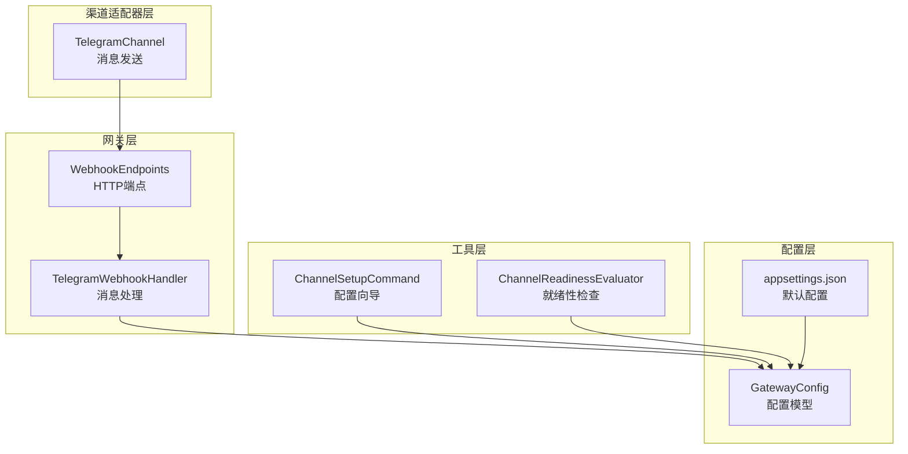
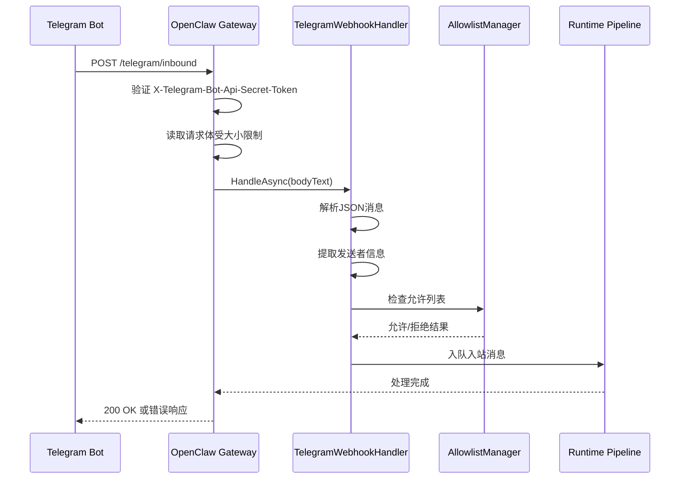
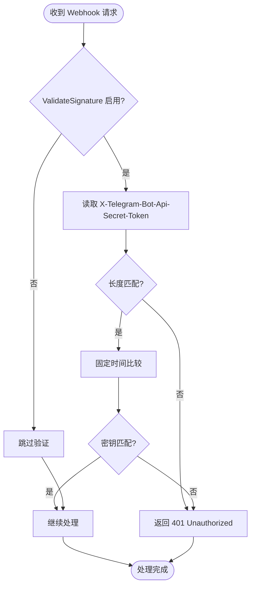
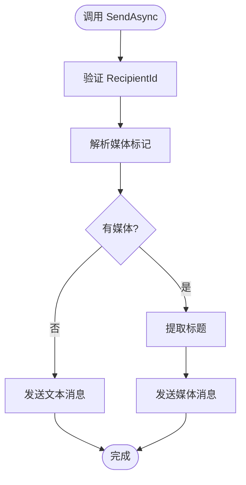
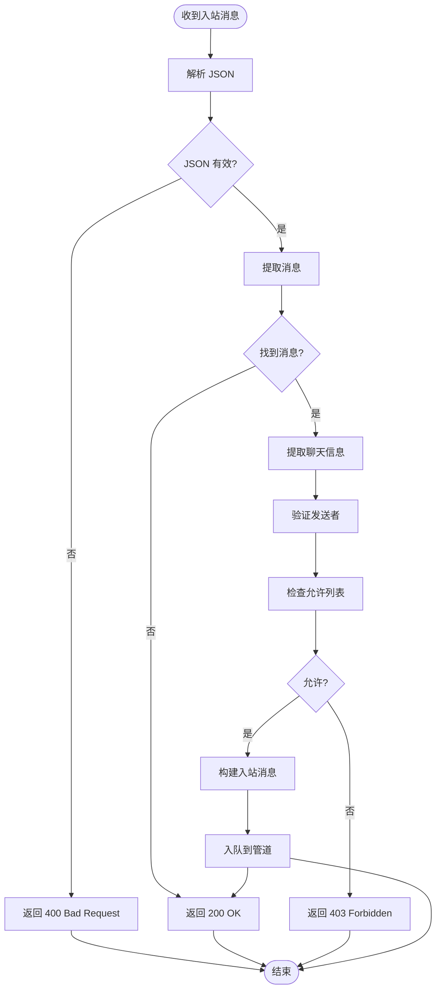
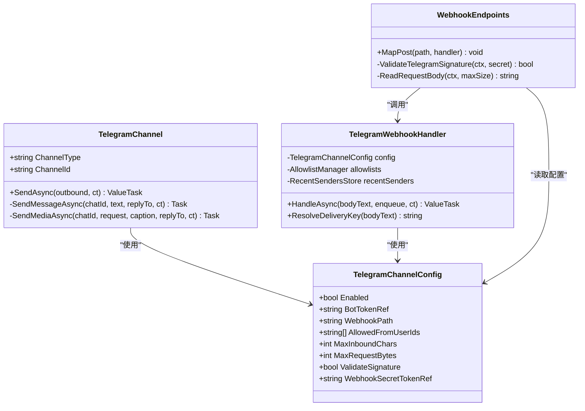

# Telegram 渠道配置

<cite>
**本文档引用的文件**
- [TelegramChannel.cs](file://src/OpenClaw.Channels/TelegramChannel.cs)
- [TelegramWebhookHandler.cs](file://src/OpenClaw.Gateway/TelegramWebhookHandler.cs)
- [WebhookEndpoints.cs](file://src/OpenClaw.Gateway/Endpoints/WebhookEndpoints.cs)
- [GatewayConfig.cs](file://src/OpenClaw.Core/Models/GatewayConfig.cs)
- [ChannelSetupCommand.cs](file://src/OpenClaw.Cli/ChannelSetupCommand.cs)
- [ChannelReadinessEvaluator.cs](file://src/OpenClaw.Gateway/ChannelReadinessEvaluator.cs)
- [TelegramChannelTests.cs](file://src/OpenClaw.Tests/TelegramChannelTests.cs)
- [README.md](file://README.md)
- [appsettings.json](file://src/OpenClaw.Gateway/appsettings.json)
</cite>

## 目录
1. [简介](#简介)
2. [项目结构](#项目结构)
3. [核心组件](#核心组件)
4. [架构概览](#架构概览)
5. [详细组件分析](#详细组件分析)
6. [依赖关系分析](#依赖关系分析)
7. [性能考虑](#性能考虑)
8. [故障排除指南](#故障排除指南)
9. [结论](#结论)
10. [附录](#附录)

## 简介
本文档详细说明了 OpenClaw 中 Telegram 渠道的配置与实现，包括 Bot Token 获取、Webhook 设置、签名验证机制、允许的发送者用户 ID 列表配置，以及最大入站字符数和请求大小限制等安全配置。文档还提供了完整的 Telegram 机器人创建流程、Webhook 配置示例和常见问题解决方案。

## 项目结构
OpenClaw 将 Telegram 渠道功能分布在多个模块中：
- 渠道适配器：负责与 Telegram Bot API 交互，处理消息发送
- 网关端点：接收 Telegram Webhook 请求并进行验证
- 配置模型：定义 Telegram 渠道的所有可配置参数
- CLI 工具：提供交互式配置向导
- 就绪性检查：验证配置完整性



**图表来源**
- [TelegramChannel.cs:18-44](file://src/OpenClaw.Channels/TelegramChannel.cs#L18-L44)
- [WebhookEndpoints.cs:122-193](file://src/OpenClaw.Gateway/Endpoints/WebhookEndpoints.cs#L122-L193)
- [GatewayConfig.cs:713-733](file://src/OpenClaw.Core/Models/GatewayConfig.cs#L713-L733)

**章节来源**
- [TelegramChannel.cs:1-338](file://src/OpenClaw.Channels/TelegramChannel.cs#L1-L338)
- [WebhookEndpoints.cs:120-319](file://src/OpenClaw.Gateway/Endpoints/WebhookEndpoints.cs#L120-L319)
- [GatewayConfig.cs:713-733](file://src/OpenClaw.Core/Models/GatewayConfig.cs#L713-L733)

## 核心组件
Telegram 渠道的核心组件包括：

### 配置模型
TelegramChannelConfig 定义了所有可配置参数：
- 启用状态和 DM 策略
- Bot Token 配置（直接值或环境变量引用）
- Webhook 路径和公共基础 URL
- 允许的发送者用户 ID 列表
- 最大入站字符数和请求大小限制
- 签名验证开关和 Webhook Secret Token

### 渠道适配器
TelegramChannel 负责与 Telegram Bot API 交互：
- 解析和验证目标聊天 ID
- 处理文本消息和媒体消息
- 实现自动分片发送
- 支持回复消息功能

### Webhook 处理器
TelegramWebhookHandler 负责处理入站 Webhook：
- 解析 JSON 消息体
- 提取发送者信息和消息内容
- 应用允许列表策略
- 构建入站消息对象

**章节来源**
- [GatewayConfig.cs:713-733](file://src/OpenClaw.Core/Models/GatewayConfig.cs#L713-L733)
- [TelegramChannel.cs:18-189](file://src/OpenClaw.Channels/TelegramChannel.cs#L18-L189)
- [TelegramWebhookHandler.cs:10-103](file://src/OpenClaw.Gateway/TelegramWebhookHandler.cs#L10-L103)

## 架构概览
Telegram 渠道采用分层架构，确保安全性和可维护性：



**图表来源**
- [WebhookEndpoints.cs:122-193](file://src/OpenClaw.Gateway/Endpoints/WebhookEndpoints.cs#L122-L193)
- [TelegramWebhookHandler.cs:47-103](file://src/OpenClaw.Gateway/TelegramWebhookHandler.cs#L47-L103)

## 详细组件分析

### 配置参数详解

#### 机器人令牌引用
- **BotToken**: 直接设置的机器人令牌值
- **BotTokenRef**: 环境变量引用格式，如 "env:TELEGRAM_BOT_TOKEN"
- **支持的引用类型**: 
  - 环境变量引用: "env:VARIABLE_NAME"
  - 原始值引用: "raw:literal_value"

#### Webhook 路径配置
- **WebhookPath**: 默认 "/telegram/inbound"
- 可通过配置修改为自定义路径
- 必须与 Telegram Bot API 的 setWebhook 调用保持一致

#### 公共基础 URL 设置
- **WebhookPublicBaseUrl**: 公共访问的基础 URL
- 用于生成完整的 Webhook URL
- 在反向代理部署时必需

#### 签名验证机制
- **ValidateSignature**: 是否启用签名验证
- **WebhookSecretToken**: 直接设置的密钥值
- **WebhookSecretTokenRef**: 密钥引用格式
- 使用固定时间比较防止时序攻击

#### 允许的发送者用户 ID 列表
- **AllowedFromUserIds**: 允许的聊天 ID 列表
- 支持数字聊天 ID 和公开用户名
- 数字 ID 优先于用户名匹配

#### 安全配置参数
- **MaxInboundChars**: 最大入站字符数，默认 4096
- **MaxRequestBytes**: 最大请求字节数，默认 65536
- **DmPolicy**: 直接消息策略（open/pairing/closed）

**章节来源**
- [GatewayConfig.cs:713-733](file://src/OpenClaw.Core/Models/GatewayConfig.cs#L713-L733)
- [appsettings.json:384-397](file://src/OpenClaw.Gateway/appsettings.json#L384-L397)

### 签名验证机制

#### 验证流程


**图表来源**
- [WebhookEndpoints.cs:124-134](file://src/OpenClaw.Gateway/Endpoints/WebhookEndpoints.cs#L124-L134)

#### 密钥解析策略
- 优先使用 WebhookSecretToken 直接值
- 如果为空，则解析 WebhookSecretTokenRef 引用
- 支持 "env:" 环境变量引用和 "raw:" 直接值

**章节来源**
- [WebhookEndpoints.cs:107-120](file://src/OpenClaw.Gateway/Endpoints/WebhookEndpoints.cs#L107-L120)
- [ChannelReadinessEvaluator.cs:548-554](file://src/OpenClaw.Gateway/ChannelReadinessEvaluator.cs#L548-L554)

### 消息发送处理

#### 发送流程


**图表来源**
- [TelegramChannel.cs:54-124](file://src/OpenClaw.Channels/TelegramChannel.cs#L54-L124)

#### 媒体处理
- 支持图片、视频、音频、文档、贴纸
- 自动标题截断（最大 1024 字符）
- 文本和媒体的组合发送
- 回复消息支持

**章节来源**
- [TelegramChannel.cs:126-160](file://src/OpenClaw.Channels/TelegramChannel.cs#L126-L160)

### 入站消息处理

#### 消息解析


**图表来源**
- [TelegramWebhookHandler.cs:47-103](file://src/OpenClaw.Gateway/TelegramWebhookHandler.cs#L47-L103)

#### 允许列表策略
- 支持严格模式和传统模式
- 允许的发送者 ID 来自配置和动态管理
- 记录最近发送者信息

**章节来源**
- [TelegramWebhookHandler.cs:73-82](file://src/OpenClaw.Gateway/TelegramWebhookHandler.cs#L73-L82)

## 依赖关系分析



**图表来源**
- [TelegramChannel.cs:18-44](file://src/OpenClaw.Channels/TelegramChannel.cs#L18-L44)
- [TelegramWebhookHandler.cs:18-30](file://src/OpenClaw.Gateway/TelegramWebhookHandler.cs#L18-L30)
- [WebhookEndpoints.cs:122-193](file://src/OpenClaw.Gateway/Endpoints/WebhookEndpoints.cs#L122-L193)

**章节来源**
- [TelegramChannel.cs:18-189](file://src/OpenClaw.Channels/TelegramChannel.cs#L18-L189)
- [TelegramWebhookHandler.cs:10-103](file://src/OpenClaw.Gateway/TelegramWebhookHandler.cs#L10-L103)
- [WebhookEndpoints.cs:120-319](file://src/OpenClaw.Gateway/Endpoints/WebhookEndpoints.cs#L120-L319)

## 性能考虑
- **请求大小限制**: 默认 65536 字节，可根据需要调整
- **消息分片**: 文本消息自动按 4096 字符分片发送
- **标题截断**: 媒体标题自动截断至 1024 字符
- **重复检测**: 基于 update_id 或哈希的重复消息检测
- **内存管理**: 使用流式 JSON 解析避免大消息内存占用

## 故障排除指南

### 常见配置问题

#### 1. 机器人令牌未配置
**症状**: 启动时抛出异常，提示缺少机器人令牌
**解决方案**: 
- 设置环境变量 `TELEGRAM_BOT_TOKEN`
- 或在配置中设置 `BotToken` 字段
- 确保引用格式正确（env: 或 raw:）

#### 2. Webhook 签名验证失败
**症状**: 返回 401 Unauthorized
**解决方案**:
- 确认 `ValidateSignature` 设置为 true
- 设置 `TELEGRAM_WEBHOOK_SECRET` 环境变量
- 确保 Telegram Bot API 的 setWebhook 调用使用相同的密钥

#### 3. 公共 URL 配置错误
**症状**: Webhook 无法被 Telegram 访问
**解决方案**:
- 设置 `WebhookPublicBaseUrl` 为可访问的公共 URL
- 确保 DNS 解析正确
- 验证防火墙和反向代理配置

#### 4. 允许列表阻止消息
**症状**: 收到 403 Forbidden
**解决方案**:
- 检查 `AllowedFromUserIds` 列表
- 验证聊天 ID 格式（数字或用户名）
- 使用严格模式或传统模式根据需要调整

### 配置验证

#### 就绪性检查
系统提供自动就绪性检查，会报告以下问题：
- 未启用的渠道
- 缺少必要的令牌
- 禁用签名验证的安全警告
- 配置不完整的建议

**章节来源**
- [ChannelReadinessEvaluator.cs:95-146](file://src/OpenClaw.Gateway/ChannelReadinessEvaluator.cs#L95-L146)
- [ChannelSetupCommand.cs:106-115](file://src/OpenClaw.Cli/ChannelSetupCommand.cs#L106-L115)

## 结论
OpenClaw 的 Telegram 渠道配置提供了完整的安全框架，包括：
- 灵活的令牌管理和引用机制
- 强制的 Webhook 签名验证
- 细粒度的发送者控制
- 合理的大小限制和性能优化
- 完善的配置验证和故障排除工具

通过遵循本文档的配置指南，可以安全可靠地部署 Telegram 渠道集成。

## 附录

### 完整配置示例

#### 基础配置
```json
{
  "OpenClaw": {
    "Channels": {
      "Telegram": {
        "Enabled": true,
        "BotTokenRef": "env:TELEGRAM_BOT_TOKEN",
        "WebhookPath": "/telegram/inbound",
        "WebhookPublicBaseUrl": "https://your-domain.com",
        "ValidateSignature": true,
        "WebhookSecretTokenRef": "env:TELEGRAM_WEBHOOK_SECRET",
        "AllowedFromUserIds": ["-1001234567890"],
        "MaxInboundChars": 4096,
        "MaxRequestBytes": 65536
      }
    }
  }
}
```

#### 环境变量设置
```bash
export TELEGRAM_BOT_TOKEN="your-bot-token-here"
export TELEGRAM_WEBHOOK_SECRET="your-webhook-secret-here"
```

### Webhook 注册命令
```bash
curl -X POST "https://api.telegram.org/bot$TELEGRAM_BOT_TOKEN/setWebhook?url=https://your-domain.com/telegram/inbound"
```

### 测试验证
运行单元测试验证配置：
```bash
dotnet test src/OpenClaw.Tests/TelegramChannelTests.cs
```

**章节来源**
- [README.md:344-362](file://README.md#L344-L362)
- [appsettings.json:384-397](file://src/OpenClaw.Gateway/appsettings.json#L384-L397)
- [TelegramChannelTests.cs:17-53](file://src/OpenClaw.Tests/TelegramChannelTests.cs#L17-L53)