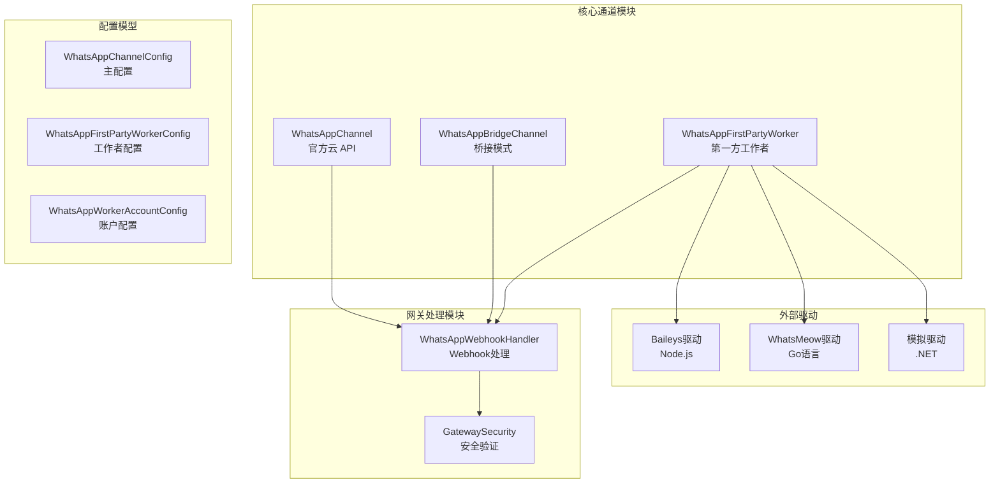
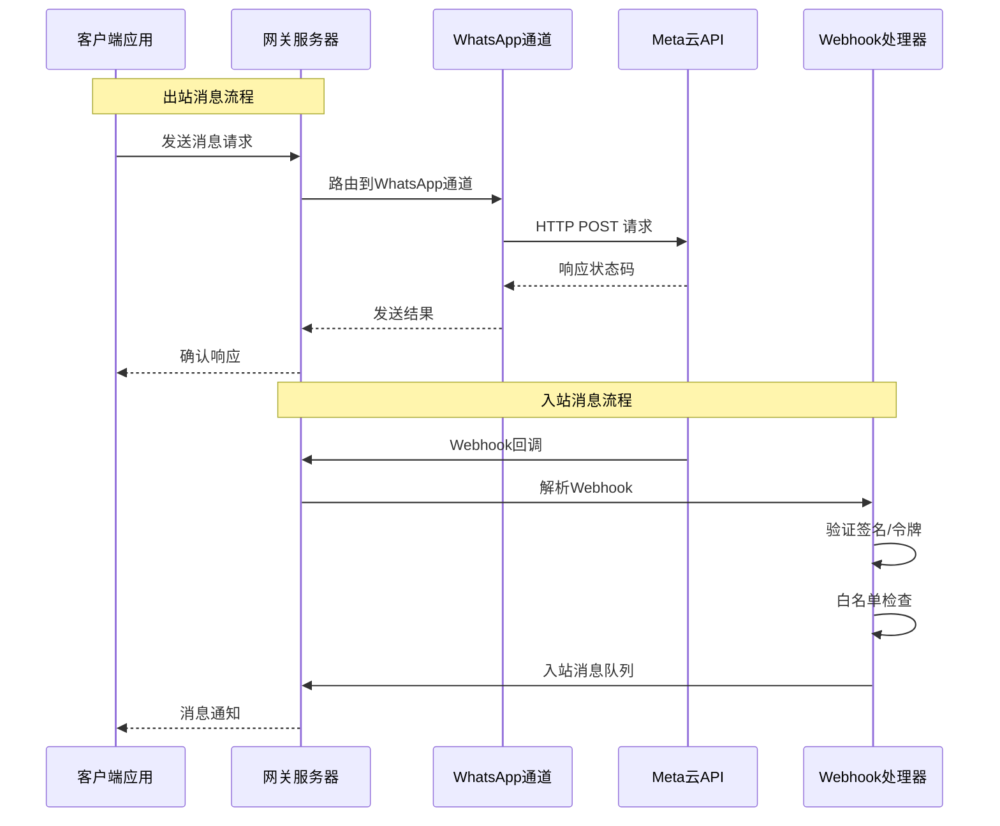
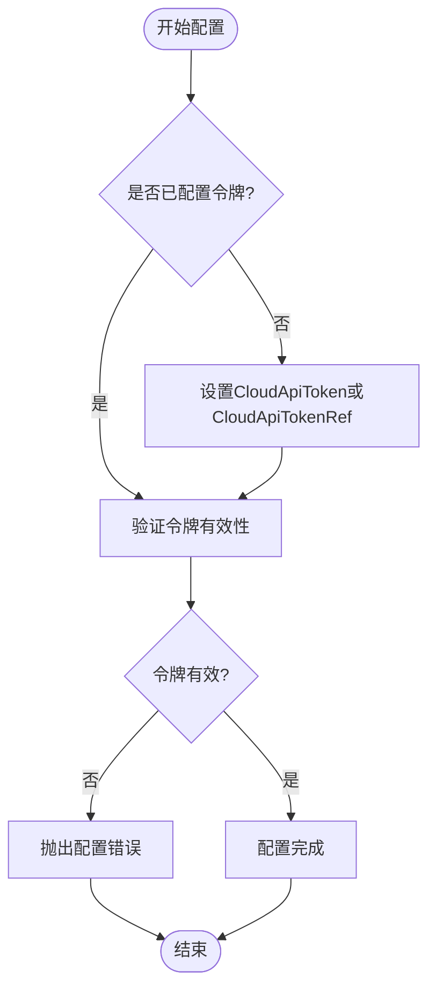
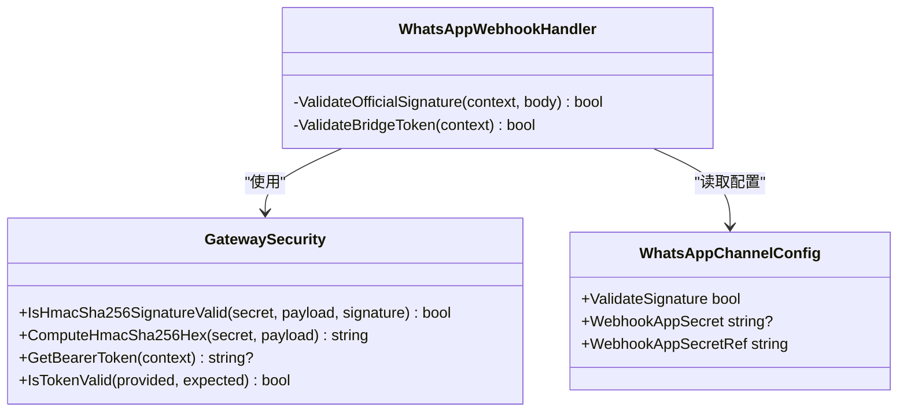
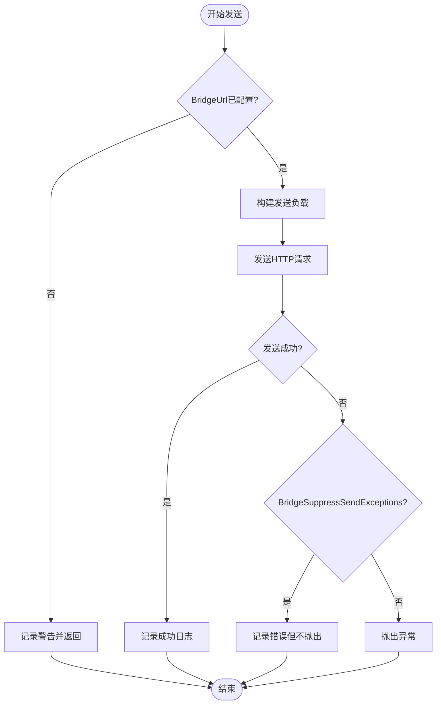
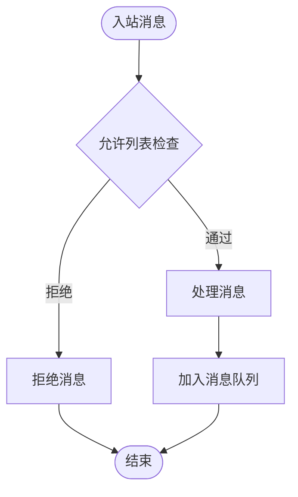
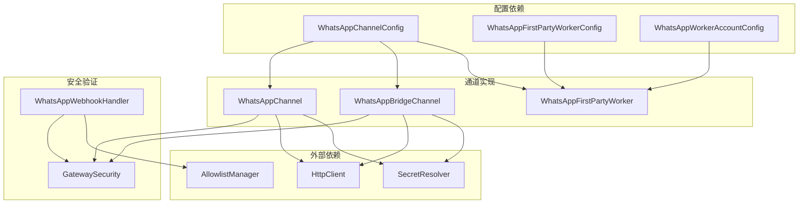
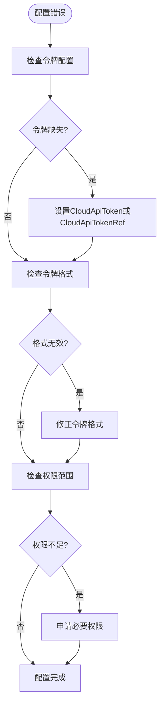

# WhatsApp 渠道配置

<cite>
**本文档引用的文件**
- [WhatsAppChannel.cs](file://src/OpenClaw.Channels/WhatsAppChannel.cs)
- [WhatsAppBridgeChannel.cs](file://src/OpenClaw.Channels/WhatsAppBridgeChannel.cs)
- [GatewayConfig.cs](file://src/OpenClaw.Core/Models/GatewayConfig.cs)
- [WhatsAppWebhookHandler.cs](file://src/OpenClaw.Gateway/WhatsAppWebhookHandler.cs)
- [WhatsAppFirstPartyWorkerConfig.cs](file://src/OpenClaw.Core/Models/WhatsAppFirstPartyWorkerConfig.cs)
- [WhatsAppWorkerAccountConfig.cs](file://src/OpenClaw.Core/Models/WhatsAppWorkerAccountConfig.cs)
- [WhatsAppWorkerService.cs](file://src/OpenClaw.WhatsApp.BaileysWorker/WhatsAppWorkerService.cs)
- [Program.cs](file://src/OpenClaw.WhatsApp.BaileysWorker/Program.cs)
- [WHATSAPP_SETUP.md](file://docs/WHATSAPP_SETUP.md)
- [ConfigValidator.cs](file://src/OpenClaw.Core/Validation/ConfigValidator.cs)
- [GatewaySecurity.cs](file://src/OpenClaw.Gateway/GatewaySecurity.cs)
- [ChannelReadinessEvaluator.cs](file://src/OpenClaw.Gateway/ChannelReadinessEvaluator.cs)
</cite>

## 目录
1. [简介](#简介)
2. [项目结构](#项目结构)
3. [核心组件](#核心组件)
4. [架构概览](#架构概览)
5. [详细组件分析](#详细组件分析)
6. [依赖关系分析](#依赖关系分析)
7. [性能考虑](#性能考虑)
8. [故障排除指南](#故障排除指南)
9. [结论](#结论)

## 简介

本文件为 OpenClaw 平台的 WhatsApp 渠道配置提供全面的技术文档。OpenClaw 支持三种 WhatsApp 连接模式：官方云 API（Official）、桥接模式（Bridge）和第一方工作者（First Party Worker）。每种模式都有其特定的配置要求、安全验证机制和集成方式。

官方云 API 模式直接连接 Meta 的 WhatsApp Business Cloud API，适用于企业级部署；桥接模式通过 HTTP 接口与外部 WhatsApp 代理通信；第一方工作者模式使用原生驱动程序（Baileys 或 WhatsMeow）直接连接 WhatsApp Web。

## 项目结构

OpenClaw 的 WhatsApp 集成分布在多个核心模块中：

**图表来源**
- [WhatsAppChannel.cs:1-320](file://src/OpenClaw.Channels/WhatsAppChannel.cs#L1-L320)
- [WhatsAppBridgeChannel.cs:1-219](file://src/OpenClaw.Channels/WhatsAppBridgeChannel.cs#L1-L219)
- [GatewayConfig.cs:550-634](file://src/OpenClaw.Core/Models/GatewayConfig.cs#L550-L634)

**章节来源**
- [WhatsAppChannel.cs:1-320](file://src/OpenClaw.Channels/WhatsAppChannel.cs#L1-L320)
- [WhatsAppBridgeChannel.cs:1-219](file://src/OpenClaw.Channels/WhatsAppBridgeChannel.cs#L1-L219)
- [GatewayConfig.cs:550-634](file://src/OpenClaw.Core/Models/GatewayConfig.cs#L550-L634)

## 核心组件

### WhatsAppChannel（官方云 API）

官方云 API 通道实现了对 Meta WhatsApp Business Cloud API 的直接集成。该组件负责：

- **认证管理**：使用 Cloud API 令牌进行身份验证
- **消息发送**：支持文本、图片、视频、音频、文档和贴纸消息
- **媒体处理**：处理绝对 HTTP(S) URL 的媒体附件
- **上下文消息**：支持回复消息的上下文关联

关键特性：
- 支持单个媒体附件的消息发送
- 自动处理媒体标题和文件名
- 错误处理和日志记录

**章节来源**
- [WhatsAppChannel.cs:11-84](file://src/OpenClaw.Channels/WhatsAppChannel.cs#L11-L84)
- [WhatsAppChannel.cs:85-170](file://src/OpenClaw.Channels/WhatsAppChannel.cs#L85-L170)

### WhatsAppBridgeChannel（桥接模式）

桥接通道通过 HTTP 接口与外部 WhatsApp 代理通信。主要功能包括：

- **桥接协议**：遵循简单的 HTTP POST 协议
- **令牌验证**：支持 Bearer 令牌和自定义头部验证
- **异常抑制**：可配置的发送异常抑制机制
- **多附件支持**：支持多个媒体附件的批量处理

配置选项：
- Bridge URL：桥接服务的端点地址
- Bridge Token：访问令牌验证
- BridgeSuppressSendExceptions：异常抑制开关

**章节来源**
- [WhatsAppBridgeChannel.cs:11-108](file://src/OpenClaw.Channels/WhatsAppBridgeChannel.cs#L11-L108)
- [WhatsAppBridgeChannel.cs:39-94](file://src/OpenClaw.Channels/WhatsAppBridgeChannel.cs#L39-L94)

### WhatsAppWebhookHandler（Webhook 处理器）

Webhook 处理器统一处理来自不同 WhatsApp 模式的入站消息：

- **官方模式验证**：使用 X-Hub-Signature-256 进行 HMAC-SHA256 签名验证
- **桥接模式验证**：支持 Bearer 令牌和自定义头部验证
- **发送者白名单**：基于 wa_id/from 字段的入站消息过滤
- **请求大小限制**：防止恶意的大请求攻击

**章节来源**
- [WhatsAppWebhookHandler.cs:10-60](file://src/OpenClaw.Gateway/WhatsAppWebhookHandler.cs#L10-L60)
- [WhatsAppWebhookHandler.cs:80-167](file://src/OpenClaw.Gateway/WhatsAppWebhookHandler.cs#L80-L167)

## 架构概览

**图表来源**
- [WhatsAppChannel.cs:40-70](file://src/OpenClaw.Channels/WhatsAppChannel.cs#L40-L70)
- [WhatsAppWebhookHandler.cs:35-60](file://src/OpenClaw.Gateway/WhatsAppWebhookHandler.cs#L35-L60)

## 详细组件分析

### 官方云 API 配置详解

#### Cloud API 令牌配置

官方云 API 需要有效的访问令牌进行身份验证：

**图表来源**
- [WhatsAppChannel.cs:21-31](file://src/OpenClaw.Channels/WhatsAppChannel.cs#L21-L31)
- [GatewayConfig.cs:573-576](file://src/OpenClaw.Core/Models/GatewayConfig.cs#L573-L576)

#### 电话号码 ID 和业务账户 ID 设置

- **PhoneNumberId**：必需字段，标识要使用的 WhatsApp 电话号码
- **BusinessAccountId**：可选字段，指定业务账户 ID
- **验证机制**：在发送前检查这些字段的有效性

#### 签名验证配置

官方云 API 支持基于 HMAC-SHA256 的签名验证：

**图表来源**
- [GatewaySecurity.cs:8-108](file://src/OpenClaw.Gateway/GatewaySecurity.cs#L8-L108)
- [WhatsAppWebhookHandler.cs:328-347](file://src/OpenClaw.Gateway/WhatsAppWebhookHandler.cs#L328-L347)
- [GatewayConfig.cs:560-571](file://src/OpenClaw.Core/Models/GatewayConfig.cs#L560-L571)

**章节来源**
- [WhatsAppChannel.cs:21-31](file://src/OpenClaw.Channels/WhatsAppChannel.cs#L21-L31)
- [WhatsAppWebhookHandler.cs:328-347](file://src/OpenClaw.Gateway/WhatsAppWebhookHandler.cs#L328-L347)
- [GatewayConfig.cs:560-571](file://src/OpenClaw.Core/Models/GatewayConfig.cs#L560-L571)

### 桥接模式配置详解

#### 桥接 URL 和令牌配置

桥接模式需要配置桥接服务的访问信息：

- **BridgeUrl**：桥接服务的 HTTP 端点
- **BridgeToken**：访问令牌，支持 Bearer 头部和自定义头部
- **BridgeSuppressSendExceptions**：发送异常时的处理策略

#### 抑制发送异常配置

**图表来源**
- [WhatsAppBridgeChannel.cs:39-94](file://src/OpenClaw.Channels/WhatsAppBridgeChannel.cs#L39-L94)

**章节来源**
- [WhatsAppBridgeChannel.cs:22-31](file://src/OpenClaw.Channels/WhatsAppBridgeChannel.cs#L22-L31)
- [WhatsAppBridgeChannel.cs:39-94](file://src/OpenClaw.Channels/WhatsAppBridgeChannel.cs#L39-L94)

### 第一方工作者配置详解

#### 驱动程序选择

第一方工作者支持三种驱动程序：

- **Baileys**：基于 Node.js 的 WhatsApp Web 库
- **WhatsMeow**：基于 Go 语言的 WhatsApp Web 库  
- **Simulated**：用于测试的模拟驱动

#### 可执行文件路径和工作目录

- **ExecutablePath**：可选的显式路径配置
- **WorkingDirectory**：子进程的工作目录
- **自动检测**：未配置时尝试共部署路径

#### 存储路径配置

- **StoragePath**：根存储路径（会话、媒体、缓存）
- **MediaCachePath**：媒体缓存路径
- **历史同步**：首次连接时的历史消息同步

**章节来源**
- [GatewayConfig.cs:596-620](file://src/OpenClaw.Core/Models/GatewayConfig.cs#L596-L620)
- [GatewayConfig.cs:622-634](file://src/OpenClaw.Core/Models/GatewayConfig.cs#L622-L634)

### Webhook 配置和安全验证

#### 验证令牌配置

Webhook 验证支持多种令牌类型：

- **WebhookVerifyToken**：验证令牌值
- **WebhookVerifyTokenRef**：令牌引用（支持环境变量）
- **WebhookAppSecret**：官方模式的 App Secret
- **WebhookAppSecretRef**：App Secret 引用

#### 入站发送者允许列表

**图表来源**
- [WhatsAppWebhookHandler.cs:114-122](file://src/OpenClaw.Gateway/WhatsAppWebhookHandler.cs#L114-L122)

**章节来源**
- [WhatsAppWebhookHandler.cs:62-78](file://src/OpenClaw.Gateway/WhatsAppWebhookHandler.cs#L62-L78)
- [WhatsAppWebhookHandler.cs:114-122](file://src/OpenClaw.Gateway/WhatsAppWebhookHandler.cs#L114-L122)

## 依赖关系分析

**图表来源**
- [GatewayConfig.cs:550-634](file://src/OpenClaw.Core/Models/GatewayConfig.cs#L550-L634)
- [WhatsAppChannel.cs:16-29](file://src/OpenClaw.Channels/WhatsAppChannel.cs#L16-L29)
- [WhatsAppBridgeChannel.cs:22-30](file://src/OpenClaw.Channels/WhatsAppBridgeChannel.cs#L22-L30)

**章节来源**
- [GatewayConfig.cs:550-634](file://src/OpenClaw.Core/Models/GatewayConfig.cs#L550-L634)
- [WhatsAppChannel.cs:16-29](file://src/OpenClaw.Channels/WhatsAppChannel.cs#L16-L29)
- [WhatsAppBridgeChannel.cs:22-30](file://src/OpenClaw.Channels/WhatsAppBridgeChannel.cs#L22-L30)

## 性能考虑

### 请求大小限制

- **MaxRequestBytes**：默认 64KB，防止恶意大请求
- **MaxInboundChars**：默认 4096 字符，防止超长消息
- **媒体文件大小**：受上游 WhatsApp API 限制

### 连接池和重试

- **HTTP 客户端复用**：使用共享 HttpClient 实例
- **异常处理**：区分可重试和不可重试错误
- **资源清理**：正确释放 HTTP 连接和文件句柄

### 缓存策略

- **媒体缓存**：本地缓存减少重复下载
- **会话持久化**：避免频繁重新认证
- **配置缓存**：减少配置解析开销

## 故障排除指南

### 常见配置错误

#### 令牌配置问题

**图表来源**
- [ConfigValidator.cs:295-307](file://src/OpenClaw.Core/Validation/ConfigValidator.cs#L295-L307)

#### 工作器启动失败

- **可执行文件不存在**：检查 ExecutablePath 配置
- **运行时依赖缺失**：安装 Node.js 18+ 或 Go 1.21+
- **权限问题**：确保工作器有必要的文件系统权限

#### Webhook 验证失败

- **签名验证失败**：检查 WebhookAppSecret 配置
- **令牌不匹配**：确认 BridgeToken 正确配置
- **时间同步**：确保系统时间准确

**章节来源**
- [ConfigValidator.cs:295-330](file://src/OpenClaw.Core/Validation/ConfigValidator.cs#L295-L330)
- [WHATSAPP_SETUP.md:163-207](file://docs/WHATSAPP_SETUP.md#L163-L207)

### 最佳实践

#### 生产环境部署

1. **启用签名验证**：始终启用 ValidateSignature
2. **使用环境变量**：敏感配置使用环境变量引用
3. **监控告警**：设置适当的日志级别和告警
4. **备份策略**：定期备份会话和配置文件

#### 性能优化

1. **合理配置缓存**：设置合适的 MediaCachePath
2. **连接池管理**：复用 HTTP 客户端实例
3. **批量处理**：合理设计消息批处理策略
4. **资源监控**：监控内存和 CPU 使用情况

#### 安全建议

1. **最小权限原则**：仅授予必要的 API 权限
2. **网络隔离**：将工作器部署在网络隔离环境中
3. **定期更新**：保持驱动程序和依赖库最新
4. **审计日志**：启用详细的操作审计日志

**章节来源**
- [WHATSAPP_SETUP.md:1-207](file://docs/WHATSAPP_SETUP.md#L1-L207)
- [ChannelReadinessEvaluator.cs:183-212](file://src/OpenClaw.Gateway/ChannelReadinessEvaluator.cs#L183-L212)

## 结论

OpenClaw 提供了灵活且强大的 WhatsApp 渠道配置方案，支持三种不同的连接模式以满足各种部署需求。官方云 API 模式适合企业级部署，桥接模式提供了最大的灵活性，而第一方工作者模式则提供了最直接的控制能力。

通过完善的配置验证、安全验证和错误处理机制，OpenClaw 确保了 WhatsApp 集成的可靠性、安全性和可维护性。建议根据具体的业务需求和基础设施条件选择合适的部署模式，并遵循最佳实践来确保系统的稳定运行。