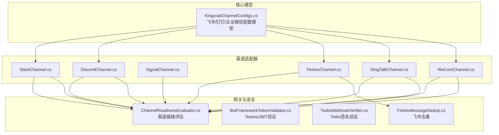
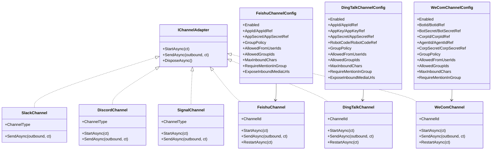
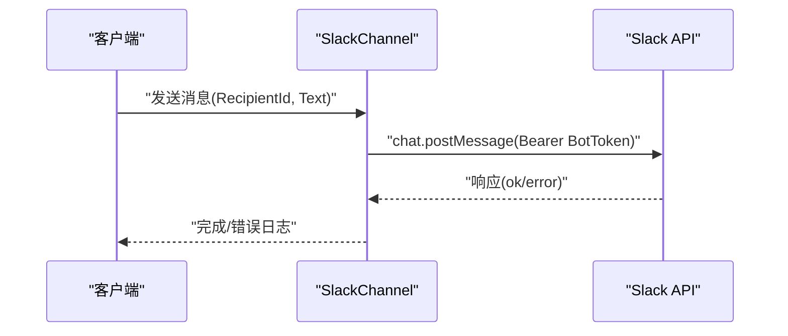
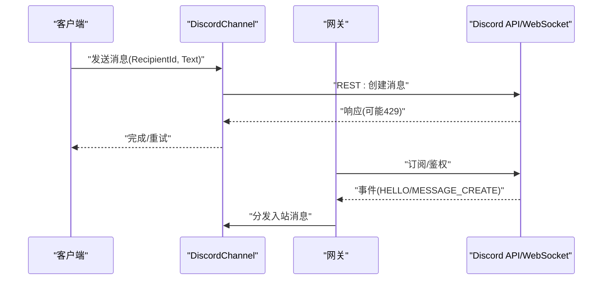
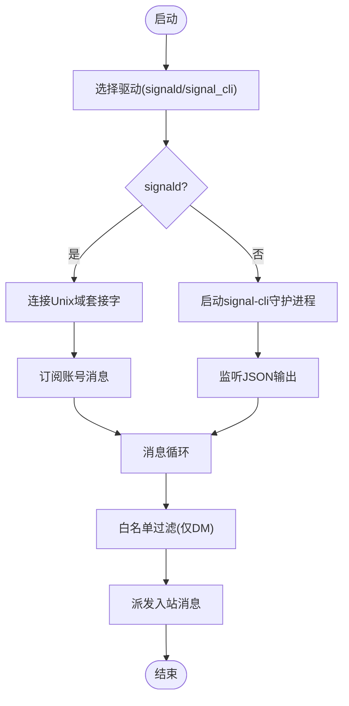
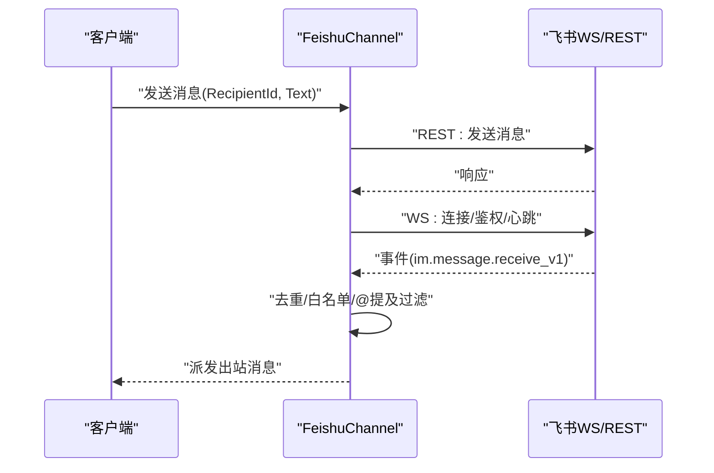
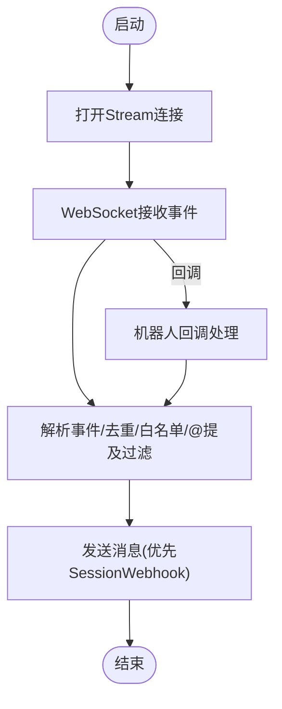
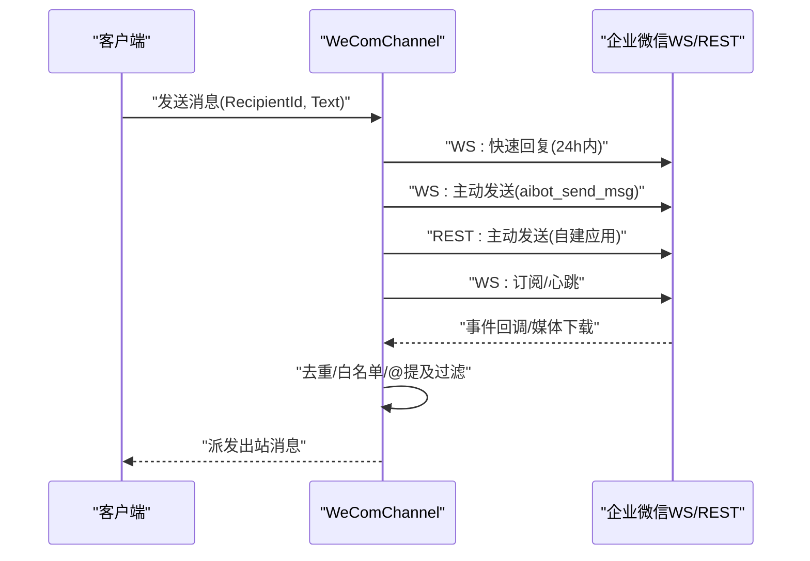
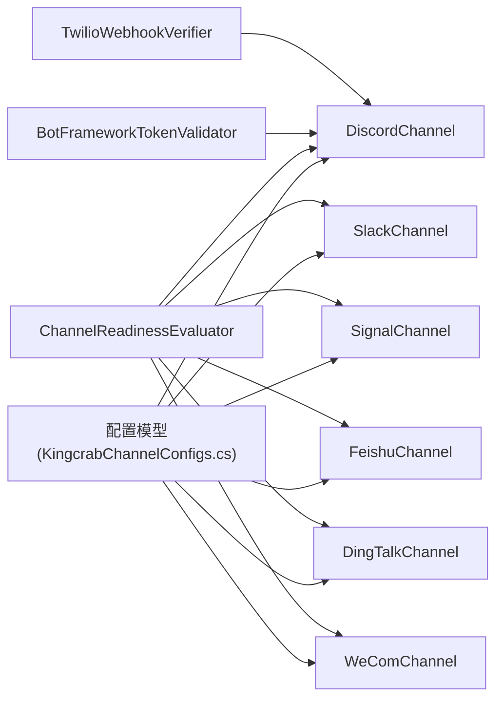

# 其他渠道配置

<cite>
**本文档引用的文件**
- [SlackChannel.cs](file://src/OpenClaw.Channels/SlackChannel.cs)
- [DiscordChannel.cs](file://src/OpenClaw.Channels/DiscordChannel.cs)
- [SignalChannel.cs](file://src/OpenClaw.Channels/SignalChannel.cs)
- [FeishuChannel.cs](file://src/OpenClaw.Channels/FeishuChannel.cs)
- [DingTalkChannel.cs](file://src/OpenClaw.Channels/DingTalkChannel.cs)
- [WeComChannel.cs](file://src/OpenClaw.Channels/WeComChannel.cs)
- [KingcrabChannelConfigs.cs](file://src/OpenClaw.Core/Models/KingcrabChannelConfigs.cs)
- [ChannelReadinessEvaluator.cs](file://src/OpenClaw.Gateway/ChannelReadinessEvaluator.cs)
- [BotFrameworkTokenValidator.cs](file://src/OpenClaw.Gateway/BotFrameworkTokenValidator.cs)
- [TwilioWebhookVerifier.cs](file://src/OpenClaw.Gateway/TwilioWebhookVerifier.cs)
- [FeishuMessageDedup.cs](file://src/OpenClaw.Channels/FeishuMessageDedup.cs)
</cite>

## 目录
1. [简介](#简介)
2. [项目结构](#项目结构)
3. [核心组件](#核心组件)
4. [架构总览](#架构总览)
5. [详细组件分析](#详细组件分析)
6. [依赖关系分析](#依赖关系分析)
7. [性能考量](#性能考量)
8. [故障排除指南](#故障排除指南)
9. [结论](#结论)
10. [附录](#附录)

## 简介
本文件面向需要在系统中配置多种即时通讯渠道（Slack、Discord、Signal、飞书、钉钉、企业微信）的工程师与运维人员，提供统一的配置方法论与实践指南。文档重点阐述以下方面：
- 各渠道的通用配置模式：启用状态、直接消息策略、Webhook 路径设置
- 各渠道特有配置：如 Slack 的 Bot Token、Discord 的 Application ID/Public Key、Signal 的 Socket Path/账户配置
- 签名验证机制在各渠道中的应用
- 访问控制配置：允许的用户 ID、频道/群组 ID、服务器 ID 等
- 集成示例、配置模板与故障排除

## 项目结构
本项目采用“核心能力 + 渠道适配器”的分层设计。渠道适配器位于 OpenClaw.Channels 命名空间下，负责对接具体平台的协议与 API；通用配置模型位于 OpenClaw.Core.Models 中；网关侧的安全与就绪评估逻辑位于 OpenClaw.Gateway。

图表来源
- [KingcrabChannelConfigs.cs:13-125](file://src/OpenClaw.Core/Models/KingcrabChannelConfigs.cs#L13-L125)
- [SlackChannel.cs:19-116](file://src/OpenClaw.Channels/SlackChannel.cs#L19-L116)
- [DiscordChannel.cs:21-411](file://src/OpenClaw.Channels/DiscordChannel.cs#L21-L411)
- [SignalChannel.cs:17-358](file://src/OpenClaw.Channels/SignalChannel.cs#L17-L358)
- [FeishuChannel.cs:21-193](file://src/OpenClaw.Channels/FeishuChannel.cs#L21-L193)
- [DingTalkChannel.cs:24-148](file://src/OpenClaw.Channels/DingTalkChannel.cs#L24-L148)
- [WeComChannel.cs:21-172](file://src/OpenClaw.Channels/WeComChannel.cs#L21-L172)
- [ChannelReadinessEvaluator.cs:446-521](file://src/OpenClaw.Gateway/ChannelReadinessEvaluator.cs#L446-L521)
- [BotFrameworkTokenValidator.cs:15-134](file://src/OpenClaw.Gateway/BotFrameworkTokenValidator.cs#L15-L134)
- [TwilioWebhookVerifier.cs:6-38](file://src/OpenClaw.Gateway/TwilioWebhookVerifier.cs#L6-L38)
- [FeishuMessageDedup.cs:19-165](file://src/OpenClaw.Channels/FeishuMessageDedup.cs#L19-L165)

章节来源
- [KingcrabChannelConfigs.cs:13-125](file://src/OpenClaw.Core/Models/KingcrabChannelConfigs.cs#L13-L125)
- [SlackChannel.cs:19-116](file://src/OpenClaw.Channels/SlackChannel.cs#L19-L116)
- [DiscordChannel.cs:21-411](file://src/OpenClaw.Channels/DiscordChannel.cs#L21-L411)
- [SignalChannel.cs:17-358](file://src/OpenClaw.Channels/SignalChannel.cs#L17-L358)
- [FeishuChannel.cs:21-193](file://src/OpenClaw.Channels/FeishuChannel.cs#L21-L193)
- [DingTalkChannel.cs:24-148](file://src/OpenClaw.Channels/DingTalkChannel.cs#L24-L148)
- [WeComChannel.cs:21-172](file://src/OpenClaw.Channels/WeComChannel.cs#L21-L172)
- [ChannelReadinessEvaluator.cs:446-521](file://src/OpenClaw.Gateway/ChannelReadinessEvaluator.cs#L446-L521)

## 核心组件
- 渠道配置模型：飞书、钉钉、企业微信的配置项集中定义于 KingcrabChannelConfigs.cs，包含启用开关、凭证来源、白名单、群聊策略、@提及要求、媒体暴露策略等。
- 渠道适配器：每个渠道适配器实现 IChannelAdapter 接口，负责：
  - 启动与生命周期管理（如 WebSocket 连接、心跳、重连）
  - 入站消息解析与过滤（白名单、@提及、群聊策略）
  - 出站消息发送（REST API 或 WebSocket）
  - 去重与媒体处理（部分渠道）
- 网关与安全：ChannelReadinessEvaluator 对各渠道进行就绪检查，BotFrameworkTokenValidator 实现 Teams/JWT 验证，TwilioWebhookVerifier 提供 Twilio 签名验证工具。

章节来源
- [KingcrabChannelConfigs.cs:13-125](file://src/OpenClaw.Core/Models/KingcrabChannelConfigs.cs#L13-L125)
- [ChannelReadinessEvaluator.cs:446-521](file://src/OpenClaw.Gateway/ChannelReadinessEvaluator.cs#L446-L521)
- [BotFrameworkTokenValidator.cs:15-134](file://src/OpenClaw.Gateway/BotFrameworkTokenValidator.cs#L15-L134)
- [TwilioWebhookVerifier.cs:6-38](file://src/OpenClaw.Gateway/TwilioWebhookVerifier.cs#L6-L38)

## 架构总览
下图展示各渠道适配器与通用配置、安全模块的关系：

图表来源
- [SlackChannel.cs:19-116](file://src/OpenClaw.Channels/SlackChannel.cs#L19-L116)
- [DiscordChannel.cs:21-411](file://src/OpenClaw.Channels/DiscordChannel.cs#L21-L411)
- [SignalChannel.cs:17-358](file://src/OpenClaw.Channels/SignalChannel.cs#L17-L358)
- [FeishuChannel.cs:21-193](file://src/OpenClaw.Channels/FeishuChannel.cs#L21-L193)
- [DingTalkChannel.cs:24-148](file://src/OpenClaw.Channels/DingTalkChannel.cs#L24-L148)
- [WeComChannel.cs:21-172](file://src/OpenClaw.Channels/WeComChannel.cs#L21-L172)
- [KingcrabChannelConfigs.cs:13-125](file://src/OpenClaw.Core/Models/KingcrabChannelConfigs.cs#L13-L125)

## 详细组件分析

### Slack 渠道配置
- 启用状态：通过配置对象的 Enabled 字段控制
- 直接消息策略：Slack 适配器通过聊天 API 发送消息，无需 Webhook；直接消息由 RecipientId 指定
- Webhook 路径设置：Slack 事件通过网关端点接收（事件 API），非本适配器直接配置
- 特有配置
  - Bot Token：支持明文或密钥引用（AppIdRef/AppSecretRef）
  - 签名验证：网关侧可对 Slack 事件进行签名验证（见就绪评估）
- 访问控制：通过消息发送时的 RecipientId 控制目标；Slack 本身无直接“允许用户/频道”白名单接口，可通过外部策略或网关层过滤
- 错误处理：对速率限制与 API 返回错误进行处理与日志记录

图表来源
- [SlackChannel.cs:44-91](file://src/OpenClaw.Channels/SlackChannel.cs#L44-L91)

章节来源
- [SlackChannel.cs:19-116](file://src/OpenClaw.Channels/SlackChannel.cs#L19-L116)
- [ChannelReadinessEvaluator.cs:446-467](file://src/OpenClaw.Gateway/ChannelReadinessEvaluator.cs#L446-L467)

### Discord 渠道配置
- 启用状态：Enabled 控制
- 直接消息策略：通过 REST API 发送消息；WebSocket 接收消息
- Webhook 路径设置：交互式命令（Slash Commands）通过网关注册；普通消息通过 WebSocket
- 特有配置
  - Bot Token：支持密钥引用
  - Application ID：用于注册 Slash Commands
  - Public Key：用于验证交互签名（网关侧）
- 访问控制：支持白名单（AllowedGuildIds、AllowedChannelIds、AllowedFromUserIds）、群聊策略（open/allowlist/disabled）、@提及要求
- 错误处理：速率限制重试、断线重连、心跳维持

图表来源
- [DiscordChannel.cs:66-109](file://src/OpenClaw.Channels/DiscordChannel.cs#L66-L109)
- [DiscordChannel.cs:122-238](file://src/OpenClaw.Channels/DiscordChannel.cs#L122-L238)
- [DiscordChannel.cs:279-373](file://src/OpenClaw.Channels/DiscordChannel.cs#L279-L373)

章节来源
- [DiscordChannel.cs:21-411](file://src/OpenClaw.Channels/DiscordChannel.cs#L21-L411)
- [ChannelReadinessEvaluator.cs:446-467](file://src/OpenClaw.Gateway/ChannelReadinessEvaluator.cs#L446-L467)

### Signal 渠道配置
- 启用状态：Enabled 控制
- 直接消息策略：支持两种驱动
  - signald：Unix Domain Socket JSON-RPC
  - signal-cli：子进程 JSON-RPC
- Webhook 路径设置：Signal 为直接消息通道，无需 Webhook
- 特有配置
  - 账号手机号：AccountPhoneNumber 或 AccountPhoneNumberRef
  - 驱动选择：Driver = signald 或 signal_cli
  - Socket Path：signald 驱动的 Unix 域套接字路径
  - signal-cli 路径：SignalCliPath
  - 信任策略：TrustAllKeys（生产环境不建议开启）
- 访问控制：仅允许白名单号码 AllowedFromNumbers
- 错误处理：连接断开自动重连、进程退出重启、内容脱敏日志

图表来源
- [SignalChannel.cs:40-52](file://src/OpenClaw.Channels/SignalChannel.cs#L40-L52)
- [SignalChannel.cs:83-132](file://src/OpenClaw.Channels/SignalChannel.cs#L83-L132)
- [SignalChannel.cs:190-255](file://src/OpenClaw.Channels/SignalChannel.cs#L190-L255)
- [SignalChannel.cs:316-343](file://src/OpenClaw.Channels/SignalChannel.cs#L316-L343)

章节来源
- [SignalChannel.cs:17-358](file://src/OpenClaw.Channels/SignalChannel.cs#L17-L358)
- [ChannelReadinessEvaluator.cs:469-521](file://src/OpenClaw.Gateway/ChannelReadinessEvaluator.cs#L469-L521)

### 飞书（Lark）渠道配置
- 启用状态：Enabled 控制
- 直接消息策略：WebSocket 长连接接收消息；REST API 发送消息
- Webhook 路径设置：无需公网 Webhook；通过 WebSocket 接收事件
- 特有配置
  - App ID/Secret：支持密钥引用
  - 群聊策略：open/allowlist/disabled
  - @提及要求：RequireMentionInGroup
  - 媒体暴露：ExposeInboundMediaUrls
  - 白名单：AllowedFromUserIds、AllowedGroupIds
- 访问控制：基于 open_id 的用户与群组白名单；@提及门禁
- 错误处理：心跳保活、断线重连、事件去重（内存+磁盘双层）

图表来源
- [FeishuChannel.cs:126-147](file://src/OpenClaw.Channels/FeishuChannel.cs#L126-L147)
- [FeishuChannel.cs:213-262](file://src/OpenClaw.Channels/FeishuChannel.cs#L213-L262)
- [FeishuChannel.cs:415-446](file://src/OpenClaw.Channels/FeishuChannel.cs#L415-L446)
- [FeishuMessageDedup.cs:115-165](file://src/OpenClaw.Channels/FeishuMessageDedup.cs#L115-L165)

章节来源
- [FeishuChannel.cs:21-193](file://src/OpenClaw.Channels/FeishuChannel.cs#L21-L193)
- [FeishuMessageDedup.cs:19-165](file://src/OpenClaw.Channels/FeishuMessageDedup.cs#L19-L165)

### 钉钉渠道配置
- 启用状态：Enabled 控制
- 直接消息策略：Stream 模式（WebSocket）接收消息；REST API 发送消息
- Webhook 路径设置：无需公网 Webhook；通过 Stream 接收事件
- 特有配置
  - App Key/Secret：支持密钥引用
  - RobotCode：机器人编码
  - 群聊策略：open/allowlist/disabled
  - @提及要求：RequireMentionInGroup
  - 媒体暴露：ExposeInboundMediaUrls
  - 白名单：AllowedFromUserIds、AllowedGroupIds
- 访问控制：基于 staffId 的用户与群组白名单；@提及门禁
- 错误处理：心跳保活、断线重连、事件去重（内存）

图表来源
- [DingTalkChannel.cs:85-103](file://src/OpenClaw.Channels/DingTalkChannel.cs#L85-L103)
- [DingTalkChannel.cs:169-210](file://src/OpenClaw.Channels/DingTalkChannel.cs#L169-L210)
- [DingTalkChannel.cs:278-316](file://src/OpenClaw.Channels/DingTalkChannel.cs#L278-L316)
- [DingTalkChannel.cs:458-470](file://src/OpenClaw.Channels/DingTalkChannel.cs#L458-L470)

章节来源
- [DingTalkChannel.cs:24-148](file://src/OpenClaw.Channels/DingTalkChannel.cs#L24-L148)
- [DingTalkChannel.cs:584-740](file://src/OpenClaw.Channels/DingTalkChannel.cs#L584-L740)

### 企业微信渠道配置
- 启用状态：Enabled 控制
- 直接消息策略：WebSocket 长连接接收消息；REST API 发送消息
- Webhook 路径设置：无需公网 Webhook；通过 WebSocket 接收事件
- 特有配置
  - BotId/BotSecret：智能机器人凭证
  - CorpId/AgentId/CorpSecret：自建应用凭证（用于主动发送与媒体上传）
  - 群聊策略：open/allowlist/disabled
  - @提及要求：RequireMentionInGroup
  - 白名单：AllowedFromUserIds、AllowedGroupIds
- 访问控制：基于 userid 的用户与群组白名单；@提及门禁
- 错误处理：心跳保活、断线重连、事件去重（内存）、媒体下载与标记

图表来源
- [WeComChannel.cs:113-128](file://src/OpenClaw.Channels/WeComChannel.cs#L113-L128)
- [WeComChannel.cs:207-255](file://src/OpenClaw.Channels/WeComChannel.cs#L207-L255)
- [WeComChannel.cs:377-503](file://src/OpenClaw.Channels/WeComChannel.cs#L377-L503)

章节来源
- [WeComChannel.cs:21-172](file://src/OpenClaw.Channels/WeComChannel.cs#L21-L172)
- [WeComChannel.cs:744-800](file://src/OpenClaw.Channels/WeComChannel.cs#L744-L800)

## 依赖关系分析
- 渠道适配器依赖通用配置模型（KingcrabChannelConfigs.cs）与安全工具（签名验证、就绪评估）
- 飞书、钉钉、企业微信具备“热重载配置”能力，通过 IRestartableChannelAdapter 接口实现
- 各渠道在入站处理阶段均实现白名单与@提及过滤，确保访问控制一致性

图表来源
- [KingcrabChannelConfigs.cs:13-125](file://src/OpenClaw.Core/Models/KingcrabChannelConfigs.cs#L13-L125)
- [ChannelReadinessEvaluator.cs:446-521](file://src/OpenClaw.Gateway/ChannelReadinessEvaluator.cs#L446-L521)
- [BotFrameworkTokenValidator.cs:15-134](file://src/OpenClaw.Gateway/BotFrameworkTokenValidator.cs#L15-L134)
- [TwilioWebhookVerifier.cs:6-38](file://src/OpenClaw.Gateway/TwilioWebhookVerifier.cs#L6-L38)

章节来源
- [KingcrabChannelConfigs.cs:13-125](file://src/OpenClaw.Core/Models/KingcrabChannelConfigs.cs#L13-L125)
- [ChannelReadinessEvaluator.cs:446-521](file://src/OpenClaw.Gateway/ChannelReadinessEvaluator.cs#L446-L521)

## 性能考量
- 连接与重连
  - Discord/飞书/钉钉/企业微信均采用指数退避策略，避免频繁重试导致资源浪费
  - 飞书/钉钉/企业微信具备心跳保活与断线恢复
- 去重与限流
  - 飞书采用内存+磁盘双层去重，降低重复消息影响
  - 各渠道对速率限制（429）进行处理，必要时延迟重试
- 媒体处理
  - 飞书/钉钉/企业微信在入站时可下载媒体并生成本地路径标记，减少对外部资源的依赖
- 并发与稳定性
  - 企业微信对 WebSocket 写操作加锁，避免并发写导致的数据竞争

## 故障排除指南
- 渠道就绪检查
  - 使用 ChannelReadinessEvaluator 检查各渠道配置缺失与警告，例如 Discord 的 Public Key、Signal 的 AccountPhoneNumber/SignalCliPath
- Slack
  - 若出现 API 错误或 429，请检查 Bot Token 与速率限制；确认 RecipientId 正确
- Discord
  - 若交互签名验证失败，检查 Public Key 与 ValidateSignature 配置；确保网关绑定非回环地址时启用验证
- Signal
  - 若 signald 连接失败，检查 Socket Path 与 TrustAllKeys；若 signal-cli 失败，检查 SignalCliPath 与进程权限
- 飞书
  - 若消息重复或丢失，检查去重存储目录与磁盘空间；确认 App ID/Secret 有效
- 钉钉
  - 若消息未送达，检查 RobotCode 与会话 Webhook；确认群聊策略与@提及要求
- 企业微信
  - 若无法主动发送，检查 CorpId/AgentId/CorpSecret；若媒体下载失败，检查 REST 凭证

章节来源
- [ChannelReadinessEvaluator.cs:446-521](file://src/OpenClaw.Gateway/ChannelReadinessEvaluator.cs#L446-L521)
- [SlackChannel.cs:66-91](file://src/OpenClaw.Channels/SlackChannel.cs#L66-L91)
- [DiscordChannel.cs:122-161](file://src/OpenClaw.Channels/DiscordChannel.cs#L122-L161)
- [SignalChannel.cs:83-132](file://src/OpenClaw.Channels/SignalChannel.cs#L83-L132)
- [FeishuMessageDedup.cs:194-246](file://src/OpenClaw.Channels/FeishuMessageDedup.cs#L194-L246)
- [DingTalkChannel.cs:584-740](file://src/OpenClaw.Channels/DingTalkChannel.cs#L584-L740)
- [WeComChannel.cs:744-800](file://src/OpenClaw.Channels/WeComChannel.cs#L744-L800)

## 结论
通过统一的配置模型与渠道适配器架构，系统能够以一致的方式接入多种即时通讯渠道，并在签名验证、访问控制、去重与媒体处理等方面提供稳健保障。建议在生产环境中：
- 明确各渠道的白名单与@提及策略
- 启用必要的签名验证与速率限制处理
- 定期检查去重存储与日志，确保消息处理的可靠性

## 附录
- 配置模板（以键名形式呈现，便于在配置文件中使用）
  - Slack
    - OpenClaw:Channels:Slack:Enabled
    - OpenClaw:Channels:Slack:BotTokenRef 或 OpenClaw:Channels:Slack:BotToken
  - Discord
    - OpenClaw:Channels:Discord:Enabled
    - OpenClaw:Channels:Discord:BotTokenRef 或 OpenClaw:Channels:Discord:BotToken
    - OpenClaw:Channels:Discord:ApplicationIdRef 或 OpenClaw:Channels:Discord:ApplicationId
    - OpenClaw:Channels:Discord:ValidateSignature
  - Signal
    - OpenClaw:Channels:Signal:Enabled
    - OpenClaw:Channels:Signal:Driver = signald 或 signal_cli
    - OpenClaw:Channels:Signal:AccountPhoneNumberRef 或 OpenClaw:Channels:Signal:AccountPhoneNumber
    - OpenClaw:Channels:Signal:SocketPath（当 Driver=signald）
    - OpenClaw:Channels:Signal:SignalCliPath（当 Driver=signal_cli）
    - OpenClaw:Channels:Signal:AllowedFromNumbers
  - 飞书
    - OpenClaw:Channels:Feishu:Enabled
    - OpenClaw:Channels:Feishu:AppIdRef 或 OpenClaw:Channels:Feishu:AppId
    - OpenClaw:Channels:Feishu:AppSecretRef 或 OpenClaw:Channels:Feishu:AppSecret
    - OpenClaw:Channels:Feishu:GroupPolicy
    - OpenClaw:Channels:Feishu:AllowedFromUserIds
    - OpenClaw:Channels:Feishu:AllowedGroupIds
    - OpenClaw:Channels:Feishu:RequireMentionInGroup
    - OpenClaw:Channels:Feishu:ExposeInboundMediaUrls
  - 钉钉
    - OpenClaw:Channels:DingTalk:Enabled
    - OpenClaw:Channels:DingTalk:AppIdRef 或 OpenClaw:Channels:DingTalk:AppId
    - OpenClaw:Channels:DingTalk:AppKeyRef 或 OpenClaw:Channels:DingTalk:AppKey
    - OpenClaw:Channels:DingTalk:AppSecretRef 或 OpenClaw:Channels:DingTalk:AppSecret
    - OpenClaw:Channels:DingTalk:RobotCodeRef 或 OpenClaw:Channels:DingTalk:RobotCode
    - OpenClaw:Channels:DingTalk:GroupPolicy
    - OpenClaw:Channels:DingTalk:AllowedFromUserIds
    - OpenClaw:Channels:DingTalk:AllowedGroupIds
    - OpenClaw:Channels:DingTalk:RequireMentionInGroup
    - OpenClaw:Channels:DingTalk:ExposeInboundMediaUrls
  - 企业微信
    - OpenClaw:Channels:WeCom:Enabled
    - OpenClaw:Channels:WeCom:BotIdRef 或 OpenClaw:Channels:WeCom:BotId
    - OpenClaw:Channels:WeCom:BotSecretRef 或 OpenClaw:Channels:WeCom:BotSecret
    - OpenClaw:Channels:WeCom:CorpIdRef 或 OpenClaw:Channels:WeCom:CorpId
    - OpenClaw:Channels:WeCom:AgentIdRef 或 OpenClaw:Channels:WeCom:AgentId
    - OpenClaw:Channels:WeCom:CorpSecretRef 或 OpenClaw:Channels:WeCom:CorpSecret
    - OpenClaw:Channels:WeCom:GroupPolicy
    - OpenClaw:Channels:WeCom:AllowedFromUserIds
    - OpenClaw:Channels:WeCom:AllowedGroupIds
    - OpenClaw:Channels:WeCom:RequireMentionInGroup

章节来源
- [KingcrabChannelConfigs.cs:13-125](file://src/OpenClaw.Core/Models/KingcrabChannelConfigs.cs#L13-L125)
- [ChannelReadinessEvaluator.cs:446-521](file://src/OpenClaw.Gateway/ChannelReadinessEvaluator.cs#L446-L521)