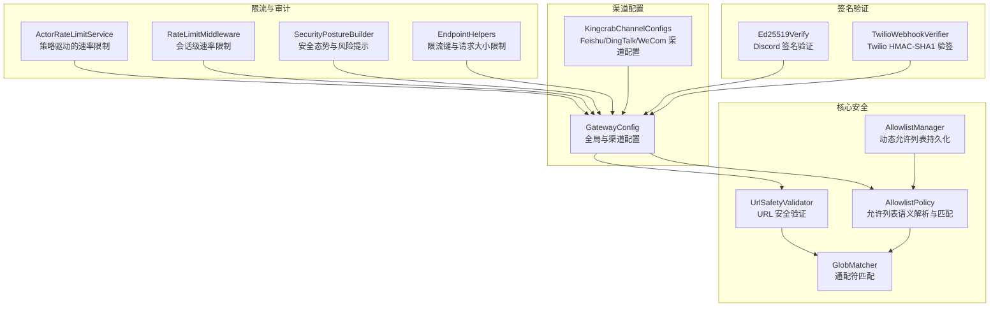
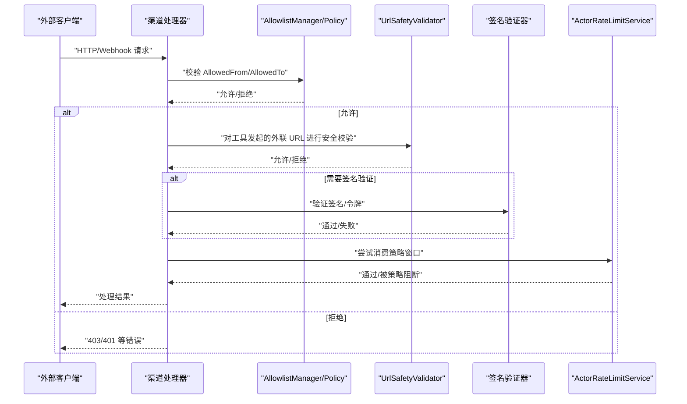
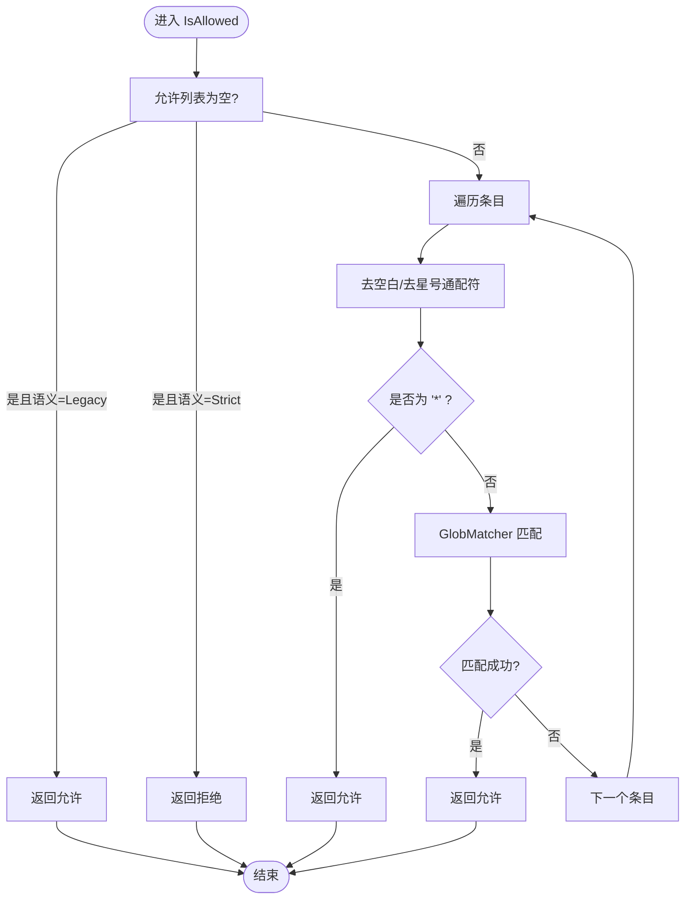
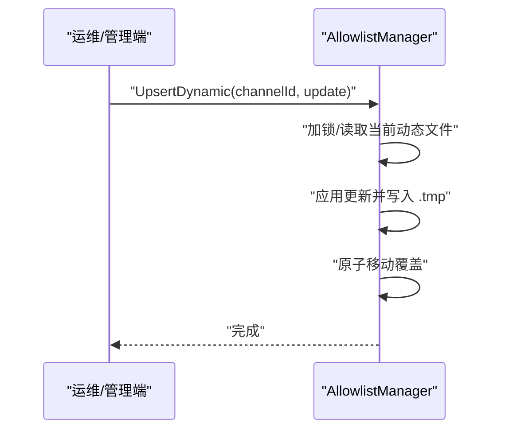
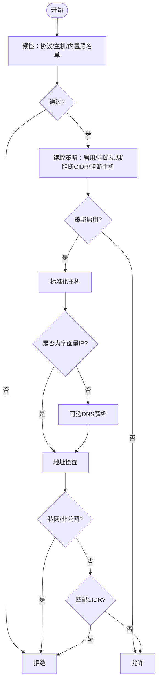
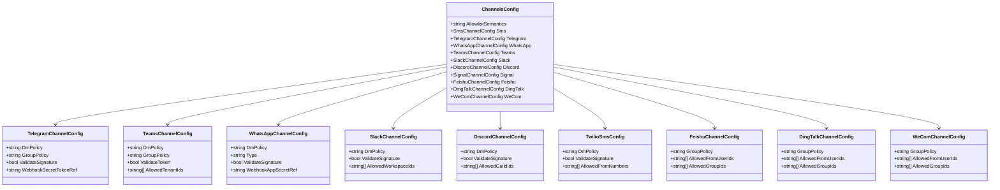
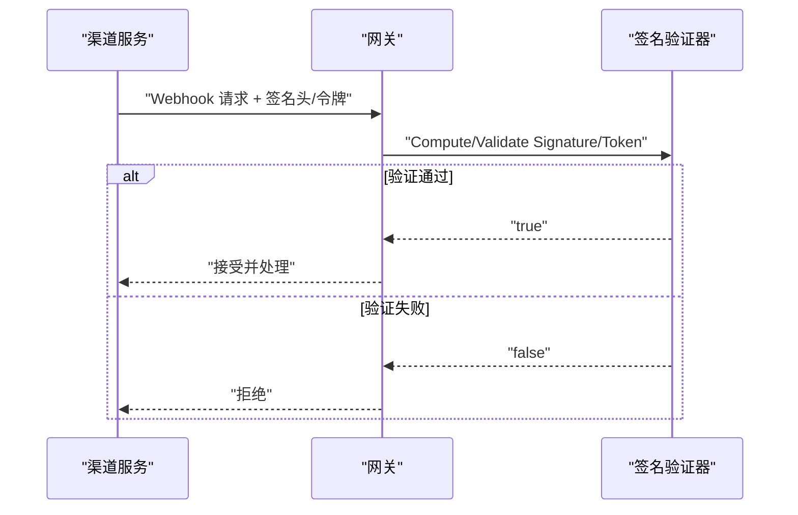
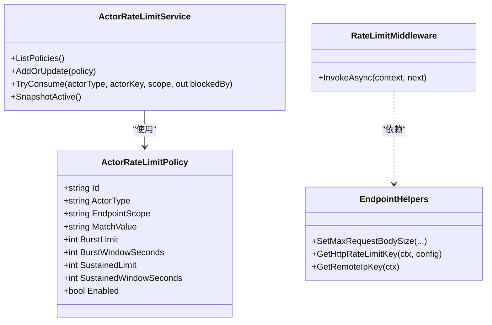
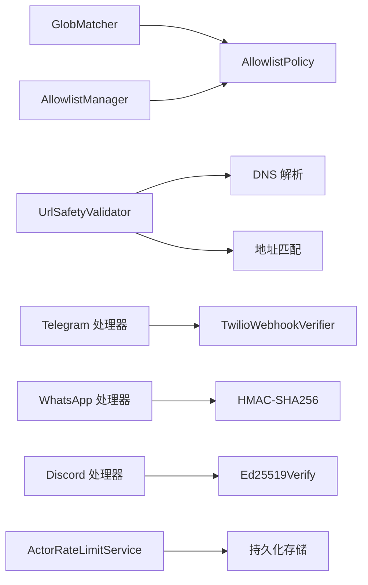

# 渠道安全策略

<cite>
**本文引用的文件**
- [AllowlistPolicy.cs](file://src/OpenClaw.Core/Security/AllowlistPolicy.cs)
- [AllowlistManager.cs](file://src/OpenClaw.Core/Security/AllowlistManager.cs)
- [UrlSafetyValidator.cs](file://src/OpenClaw.Core/Security/UrlSafetyValidator.cs)
- [GlobMatcher.cs](file://src/OpenClaw.Core/Security/GlobMatcher.cs)
- [GatewayConfig.cs](file://src/OpenClaw.Core/Models/GatewayConfig.cs)
- [KingcrabChannelConfigs.cs](file://src/OpenClaw.Core/Models/KingcrabChannelConfigs.cs)
- [Ed25519Verify.cs](file://src/OpenClaw.Gateway/Ed25519Verify.cs)
- [TwilioWebhookVerifier.cs](file://src/OpenClaw.Gateway/TwilioWebhookVerifier.cs)
- [EndpointHelpers.cs](file://src/OpenClaw.Gateway/Endpoints/EndpointHelpers.cs)
- [ActorRateLimitService.cs](file://src/OpenClaw.Gateway/ActorRateLimitService.cs)
- [RateLimitMiddleware.cs](file://src/OpenClaw.Core/Middleware/RateLimitMiddleware.cs)
- [SecurityPostureBuilder.cs](file://src/OpenClaw.Gateway/SecurityPostureBuilder.cs)
- [ChannelAdapterSecurityTests.cs](file://src/OpenClaw.Tests/ChannelAdapterSecurityTests.cs)
- [AllowlistPolicyTests.cs](file://src/OpenClaw.Tests/AllowlistPolicyTests.cs)
- [AllowlistManagerTests.cs](file://src/OpenClaw.Tests/AllowlistManagerTests.cs)
- [UrlSafetyValidatorTests.cs](file://src/OpenClaw.Tests/UrlSafetyValidatorTests.cs)
- [ActorRateLimitServiceTests.cs](file://src/OpenClaw.Tests/ActorRateLimitServiceTests.cs)
- [OperatorRuntimeServicesTests.cs](file://src/OpenClaw.Tests/OperatorRuntimeServicesTests.cs)
- [ConfigValidatorTests.cs](file://src/OpenClaw.Tests/ConfigValidatorTests.cs)
</cite>

## 目录
1. [引言](#引言)
2. [项目结构](#项目结构)
3. [核心组件](#核心组件)
4. [架构总览](#架构总览)
5. [详细组件分析](#详细组件分析)
6. [依赖关系分析](#依赖关系分析)
7. [性能考量](#性能考量)
8. [故障排查指南](#故障排查指南)
9. [结论](#结论)
10. [附录](#附录)

## 引言
本文件系统化阐述渠道安全策略，覆盖以下主题：
- 允许列表语义：传统模式（legacy）与严格模式（strict）的差异与适用场景
- 渠道策略配置：直接消息策略（open/pairing/closed）与群组策略（open/allowlist/disabled）的含义与配置方法
- URL 安全验证：私有网络目标阻塞、CIDR 范围阻塞、额外主机通配符配置
- 签名验证机制：各渠道的签名验证配置与验证流程
- 入站请求大小限制、速率限制、超时设置等安全配置
- 安全最佳实践、常见攻击防护与配置审计指南

## 项目结构
围绕“渠道安全策略”的关键代码分布在以下模块：
- 核心安全模型与策略：AllowlistPolicy、AllowlistManager、UrlSafetyValidator、GlobMatcher
- 渠道配置模型：GatewayConfig 中 Channels.* 与 KingcrabChannelConfigs 中特定渠道配置
- 签名验证实现：Ed25519Verify（Discord）、TwilioWebhookVerifier
- 速率限制：ActorRateLimitService（持久化策略与窗口计数）、RateLimitMiddleware（会话级限流）
- 安全态势与审计：SecurityPostureBuilder（部署风险与建议）、EndpointHelpers（限流键生成）

**图表来源**
- [AllowlistPolicy.cs:1-42](file://src/OpenClaw.Core/Security/AllowlistPolicy.cs#L1-L42)
- [AllowlistManager.cs:1-72](file://src/OpenClaw.Core/Security/AllowlistManager.cs#L1-L72)
- [UrlSafetyValidator.cs:1-168](file://src/OpenClaw.Core/Security/UrlSafetyValidator.cs#L1-L168)
- [GlobMatcher.cs](file://src/OpenClaw.Core/Security/GlobMatcher.cs)
- [GatewayConfig.cs:534-733](file://src/OpenClaw.Core/Models/GatewayConfig.cs#L534-L733)
- [KingcrabChannelConfigs.cs:1-126](file://src/OpenClaw.Core/Models/KingcrabChannelConfigs.cs#L1-L126)
- [Ed25519Verify.cs:1-41](file://src/OpenClaw.Gateway/Ed25519Verify.cs#L1-L41)
- [TwilioWebhookVerifier.cs:1-40](file://src/OpenClaw.Gateway/TwilioWebhookVerifier.cs#L1-L40)
- [ActorRateLimitService.cs:1-282](file://src/OpenClaw.Gateway/ActorRateLimitService.cs#L1-L282)
- [RateLimitMiddleware.cs:1-93](file://src/OpenClaw.Core/Middleware/RateLimitMiddleware.cs#L1-L93)
- [SecurityPostureBuilder.cs:1-169](file://src/OpenClaw.Gateway/SecurityPostureBuilder.cs#L1-L169)
- [EndpointHelpers.cs:137-173](file://src/OpenClaw.Gateway/Endpoints/EndpointHelpers.cs#L137-L173)

**章节来源**
- [GatewayConfig.cs:534-733](file://src/OpenClaw.Core/Models/GatewayConfig.cs#L534-L733)
- [KingcrabChannelConfigs.cs:1-126](file://src/OpenClaw.Core/Models/KingcrabChannelConfigs.cs#L1-L126)

## 核心组件
- 允许列表语义与匹配
  - AllowlistSemantics：Legacy 与 Strict 两种语义
  - IsAllowed：支持通配符匹配与空列表行为差异
- 动态允许列表管理
  - 持久化到 {StoragePath}/allowlists/{channel}.json
  - 动态覆盖静态配置
- URL 安全验证
  - 支持内置黑名单主机通配符、CIDR 阻断、私网地址阻断
  - 可选 DNS 解析后校验
- 渠道策略配置
  - Direct Message Policy：open / pairing / closed
  - Group Policy：open / allowlist / disabled
- 签名验证
  - Discord：Ed25519
  - Twilio：HMAC-SHA1
  - 其他渠道：HMAC-SHA256 或令牌校验
- 速率限制
  - 策略驱动（ActorRateLimitService）：按 ActorType/EndpointScope/MatchValue 维度
  - 会话级限流（RateLimitMiddleware）：每通道每发送者每分钟
- 安全态势与审计
  - 非回环绑定风险提示与建议
  - 签名验证就绪性检查

**章节来源**
- [AllowlistPolicy.cs:1-42](file://src/OpenClaw.Core/Security/AllowlistPolicy.cs#L1-L42)
- [AllowlistManager.cs:1-72](file://src/OpenClaw.Core/Security/AllowlistManager.cs#L1-L72)
- [UrlSafetyValidator.cs:1-168](file://src/OpenClaw.Core/Security/UrlSafetyValidator.cs#L1-L168)
- [GatewayConfig.cs:534-733](file://src/OpenClaw.Core/Models/GatewayConfig.cs#L534-L733)
- [KingcrabChannelConfigs.cs:1-126](file://src/OpenClaw.Core/Models/KingcrabChannelConfigs.cs#L1-L126)
- [Ed25519Verify.cs:1-41](file://src/OpenClaw.Gateway/Ed25519Verify.cs#L1-L41)
- [TwilioWebhookVerifier.cs:1-40](file://src/OpenClaw.Gateway/TwilioWebhookVerifier.cs#L1-L40)
- [ActorRateLimitService.cs:1-282](file://src/OpenClaw.Gateway/ActorRateLimitService.cs#L1-L282)
- [RateLimitMiddleware.cs:1-93](file://src/OpenClaw.Core/Middleware/RateLimitMiddleware.cs#L1-L93)
- [SecurityPostureBuilder.cs:1-169](file://src/OpenClaw.Gateway/SecurityPostureBuilder.cs#L1-L169)

## 架构总览
下图展示从入站请求到安全控制的关键路径，包括允许列表、URL 安全、签名验证与速率限制。

**图表来源**
- [AllowlistManager.cs:50-51](file://src/OpenClaw.Core/Security/AllowlistManager.cs#L50-L51)
- [AllowlistPolicy.cs:18-40](file://src/OpenClaw.Core/Security/AllowlistPolicy.cs#L18-L40)
- [UrlSafetyValidator.cs:27-58](file://src/OpenClaw.Core/Security/UrlSafetyValidator.cs#L27-L58)
- [Ed25519Verify.cs:17-34](file://src/OpenClaw.Gateway/Ed25519Verify.cs#L17-L34)
- [TwilioWebhookVerifier.cs:27-37](file://src/OpenClaw.Gateway/TwilioWebhookVerifier.cs#L27-L37)
- [ActorRateLimitService.cs:92-147](file://src/OpenClaw.Gateway/ActorRateLimitService.cs#L92-L147)

## 详细组件分析

### 允许列表语义：Legacy 与 Strict
- 语义解析
  - ParseSemantics：strict 与 legacy 的字符串解析
- 行为差异
  - Legacy：空允许列表 = 允许所有（历史兼容）
  - Strict：空允许列表 = 拒绝所有；仅显式通配符 "*" 或匹配项才允许
- 匹配算法
  - 支持通配符与空白过滤
  - 采用 GlobMatcher 进行模式匹配

**图表来源**
- [AllowlistPolicy.cs:18-40](file://src/OpenClaw.Core/Security/AllowlistPolicy.cs#L18-L40)
- [GlobMatcher.cs](file://src/OpenClaw.Core/Security/GlobMatcher.cs)

**章节来源**
- [AllowlistPolicy.cs:1-42](file://src/OpenClaw.Core/Security/AllowlistPolicy.cs#L1-L42)
- [AllowlistPolicyTests.cs:1-33](file://src/OpenClaw.Tests/AllowlistPolicyTests.cs#L1-L33)

### 动态允许列表管理
- 存储位置
  - {StoragePath}/allowlists/{channel}.json
- 优先级
  - 动态文件优先于静态配置
- 原子写入
  - 临时文件 + 原子替换，保证一致性
- 并发控制
  - 按 channelId 加锁，避免竞态

**图表来源**
- [AllowlistManager.cs:53-72](file://src/OpenClaw.Core/Security/AllowlistManager.cs#L53-L72)

**章节来源**
- [AllowlistManager.cs:1-72](file://src/OpenClaw.Core/Security/AllowlistManager.cs#L1-L72)
- [AllowlistManagerTests.cs:1-42](file://src/OpenClaw.Tests/AllowlistManagerTests.cs#L1-L42)

### URL 安全验证
- 校验范围
  - 仅 http/https 绝对 URL
  - 内置黑名单主机通配符（如 localhost、metadata）
  - 可配置额外主机通配符阻断
  - 可配置 CIDR 范围阻断
  - 可选阻断私网/非公网地址
- 校验流程
  - 预检（协议、主机、内置黑名单）
  - 可选 DNS 解析（resolveDns 参数控制）
  - 地址归一化（IPv4 映射）
  - 私网地址与 CIDR 匹配
- 结果
  - 允许/拒绝，并可转换为工具错误信息

**图表来源**
- [UrlSafetyValidator.cs:27-135](file://src/OpenClaw.Core/Security/UrlSafetyValidator.cs#L27-L135)

**章节来源**
- [UrlSafetyValidator.cs:1-168](file://src/OpenClaw.Core/Security/UrlSafetyValidator.cs#L1-L168)
- [UrlSafetyValidatorTests.cs](file://src/OpenClaw.Tests/UrlSafetyValidatorTests.cs)

### 渠道策略配置：Direct Message 与 Group
- 直接消息策略（DmPolicy）
  - open：允许所有直接消息
  - pairing：仅允许已配对或授权的发送者
  - closed：拒绝所有直接消息
- 群组策略（GroupPolicy）
  - open：允许所有群组消息
  - allowlist：仅允许白名单中的群组
  - disabled：丢弃群组消息
- 配置要点
  - 各渠道在 GatewayConfig 中定义 DmPolicy/GroupPolicy 字段
  - 允许列表条目由 Channels.AllowlistSemantics 控制匹配语义
  - 特定渠道（如 Feishu/DingTalk/WeCom）有独立配置对象

**图表来源**
- [GatewayConfig.cs:534-733](file://src/OpenClaw.Core/Models/GatewayConfig.cs#L534-L733)
- [KingcrabChannelConfigs.cs:1-126](file://src/OpenClaw.Core/Models/KingcrabChannelConfigs.cs#L1-L126)

**章节来源**
- [GatewayConfig.cs:534-733](file://src/OpenClaw.Core/Models/GatewayConfig.cs#L534-L733)
- [KingcrabChannelConfigs.cs:1-126](file://src/OpenClaw.Core/Models/KingcrabChannelConfigs.cs#L1-L126)

### 签名验证机制
- Discord
  - 使用 Ed25519 对交互进行签名验证
- Twilio
  - 使用 HMAC-SHA1 计算签名，固定时间比较
- WhatsApp（官方云 API）
  - 使用 HMAC-SHA256（基于 App Secret）验证 X-Hub-Signature-256
- Teams/Slack/Discord
  - 各自使用渠道提供的签名/令牌机制

**图表来源**
- [Ed25519Verify.cs:17-34](file://src/OpenClaw.Gateway/Ed25519Verify.cs#L17-L34)
- [TwilioWebhookVerifier.cs:27-37](file://src/OpenClaw.Gateway/TwilioWebhookVerifier.cs#L27-L37)
- [WhatsAppWebhookHandler.cs:328-347](file://src/OpenClaw.Gateway/WhatsAppWebhookHandler.cs#L328-L347)

**章节来源**
- [Ed25519Verify.cs:1-41](file://src/OpenClaw.Gateway/Ed25519Verify.cs#L1-L41)
- [TwilioWebhookVerifier.cs:1-40](file://src/OpenClaw.Gateway/TwilioWebhookVerifier.cs#L1-L40)
- [ChannelAdapterSecurityTests.cs:1-39](file://src/OpenClaw.Tests/ChannelAdapterSecurityTests.cs#L1-L39)

### 速率限制与超时设置
- 策略驱动限流（ActorRateLimitService）
  - 支持突发窗口与持续窗口双维度
  - 按 ActorType/EndpointScope/MatchValue 匹配策略
  - 策略持久化存储，支持增删改查
- 会话级限流（RateLimitMiddleware）
  - 每通道每发送者每分钟消息数限制
- 请求大小限制
  - EndpointHelpers 提供设置最大请求体大小的辅助方法
- 超时设置
  - 渠道配置中包含 MaxRequestBytes 等字段
  - 工具执行超时、浏览器超时等在 ToolingConfig 中配置

**图表来源**
- [ActorRateLimitService.cs:92-147](file://src/OpenClaw.Gateway/ActorRateLimitService.cs#L92-L147)
- [ActorRateLimitService.cs:42-75](file://src/OpenClaw.Gateway/ActorRateLimitService.cs#L42-L75)
- [RateLimitMiddleware.cs:39-68](file://src/OpenClaw.Core/Middleware/RateLimitMiddleware.cs#L39-L68)
- [EndpointHelpers.cs:137-173](file://src/OpenClaw.Gateway/Endpoints/EndpointHelpers.cs#L137-L173)

**章节来源**
- [ActorRateLimitService.cs:1-282](file://src/OpenClaw.Gateway/ActorRateLimitService.cs#L1-L282)
- [ActorRateLimitServiceTests.cs:1-88](file://src/OpenClaw.Tests/ActorRateLimitServiceTests.cs#L1-L88)
- [OperatorRuntimeServicesTests.cs:144-177](file://src/OpenClaw.Tests/OperatorRuntimeServicesTests.cs#L144-L177)
- [RateLimitMiddleware.cs:1-93](file://src/OpenClaw.Core/Middleware/RateLimitMiddleware.cs#L1-L93)
- [EndpointHelpers.cs:137-173](file://src/OpenClaw.Gateway/Endpoints/EndpointHelpers.cs#L137-L173)

### 安全最佳实践与常见攻击防护
- 非回环绑定（公网暴露）
  - 必须配置 AuthToken
  - 启用各渠道签名验证（Twilio/Telegram/WhatsApp/Teams/Slack/Discord）
  - 禁止在公网绑定上使用 raw: 密钥引用
  - 禁止在公网绑定上启用不安全的本地工具执行
- URL 安全
  - 启用 BlockPrivateNetworkTargets
  - 配置 BlockedCidrs 与 BlockedHostGlobs
- 允许列表
  - 生产环境推荐使用 Strict 语义
  - 动态允许列表优先于静态配置
- 速率限制
  - 针对不同 EndpointScope 设置突发与持续窗口
  - 按 IP 或令牌生成限流键
- 审计与合规
  - 使用 SecurityPostureBuilder 生成安全态势报告
  - 配置审计端点与日志记录

**章节来源**
- [SecurityPostureBuilder.cs:11-139](file://src/OpenClaw.Gateway/SecurityPostureBuilder.cs#L11-L139)
- [ConfigValidatorTests.cs:124-163](file://src/OpenClaw.Tests/ConfigValidatorTests.cs#L124-L163)

## 依赖关系分析
- AllowlistPolicy 依赖 GlobMatcher 进行通配符匹配
- AllowlistManager 依赖 CoreJsonContext 进行序列化
- UrlSafetyValidator 依赖 Dns 解析与地址匹配逻辑
- 各渠道处理器依赖对应签名验证器
- 限流服务依赖持久化存储与策略配置

**图表来源**
- [AllowlistPolicy.cs:1-42](file://src/OpenClaw.Core/Security/AllowlistPolicy.cs#L1-L42)
- [AllowlistManager.cs:1-72](file://src/OpenClaw.Core/Security/AllowlistManager.cs#L1-L72)
- [UrlSafetyValidator.cs:1-168](file://src/OpenClaw.Core/Security/UrlSafetyValidator.cs#L1-L168)
- [TwilioWebhookVerifier.cs:1-40](file://src/OpenClaw.Gateway/TwilioWebhookVerifier.cs#L1-L40)
- [Ed25519Verify.cs:1-41](file://src/OpenClaw.Gateway/Ed25519Verify.cs#L1-L41)
- [ActorRateLimitService.cs:1-282](file://src/OpenClaw.Gateway/ActorRateLimitService.cs#L1-L282)

**章节来源**
- [AllowlistPolicy.cs:1-42](file://src/OpenClaw.Core/Security/AllowlistPolicy.cs#L1-L42)
- [UrlSafetyValidator.cs:1-168](file://src/OpenClaw.Core/Security/UrlSafetyValidator.cs#L1-L168)
- [TwilioWebhookVerifier.cs:1-40](file://src/OpenClaw.Gateway/TwilioWebhookVerifier.cs#L1-L40)
- [Ed25519Verify.cs:1-41](file://src/OpenClaw.Gateway/Ed25519Verify.cs#L1-L41)
- [ActorRateLimitService.cs:1-282](file://src/OpenClaw.Gateway/ActorRateLimitService.cs#L1-L282)

## 性能考量
- 允许列表匹配
  - 通配符匹配成本与条目数量相关，建议精简条目
  - 动态允许列表读取与写入带锁，避免高并发写入
- URL 安全验证
  - DNS 解析可能带来延迟，resolveDns 参数可用于权衡
  - IPv4/IPv6 归一化与 CIDR 匹配为常数时间操作
- 速率限制
  - ActorRateLimitService 使用内存窗口计数，支持定期清理过期窗口
  - RateLimitMiddleware 使用队列与时间戳，清理频率可调
- 序列化与持久化
  - AllowlistManager 使用原子写入，减少磁盘竞争

[本节为通用指导，无需列出具体文件来源]

## 故障排查指南
- 允许列表不生效
  - 检查 Channels.AllowlistSemantics 是否正确设置
  - 确认动态允许列表文件是否覆盖了静态配置
- URL 被误判阻断
  - 检查 UrlSafetyConfig.Enabled、BlockPrivateNetworkTargets、BlockedCidrs、BlockedHostGlobs
  - 如需 DNS 解析，请确认网络可达
- 签名验证失败
  - 确认渠道侧签名密钥/令牌配置正确
  - 检查请求头/查询参数是否携带正确签名
- 速率限制触发
  - 查看策略匹配（ActorType/EndpointScope/MatchValue）
  - 调整突发/持续窗口与阈值
- 配置审计
  - 使用 SecurityPostureBuilder 生成安全态势报告
  - 关注公网绑定、签名验证就绪性、原始密钥引用等风险项

**章节来源**
- [AllowlistManagerTests.cs:1-42](file://src/OpenClaw.Tests/AllowlistManagerTests.cs#L1-L42)
- [UrlSafetyValidatorTests.cs](file://src/OpenClaw.Tests/UrlSafetyValidatorTests.cs)
- [ChannelAdapterSecurityTests.cs:1-39](file://src/OpenClaw.Tests/ChannelAdapterSecurityTests.cs#L1-L39)
- [ActorRateLimitServiceTests.cs:1-88](file://src/OpenClaw.Tests/ActorRateLimitServiceTests.cs#L1-L88)
- [OperatorRuntimeServicesTests.cs:144-177](file://src/OpenClaw.Tests/OperatorRuntimeServicesTests.cs#L144-L177)
- [SecurityPostureBuilder.cs:11-139](file://src/OpenClaw.Gateway/SecurityPostureBuilder.cs#L11-L139)

## 结论
本文件梳理了渠道安全策略的核心机制：允许列表语义、动态允许列表、URL 安全验证、签名验证与速率限制，并结合配置模型与测试用例提供了落地实施与排障建议。生产部署应以严格模式的允许列表、严格的签名验证与完善的 URL 安全策略为基础，辅以策略驱动的速率限制与持续的安全态势审计。

[本节为总结性内容，无需列出具体文件来源]

## 附录
- 关键配置字段速览
  - Channels.AllowlistSemantics：允许列表语义（legacy/strict）
  - UrlSafetyConfig.Enabled/BlockPrivateNetworkTargets/BlockedCidrs/BlockedHostGlobs：URL 安全策略
  - 各渠道 DmPolicy/GroupPolicy：直接消息与群组策略
  - 各渠道 ValidateSignature/ValidateToken/WebhookAppSecretRef 等：签名验证配置
  - ActorRateLimitPolicy：突发/持续窗口与阈值
  - EndpointHelpers：请求体大小限制与限流键生成

[本节为概览性内容，无需列出具体文件来源]