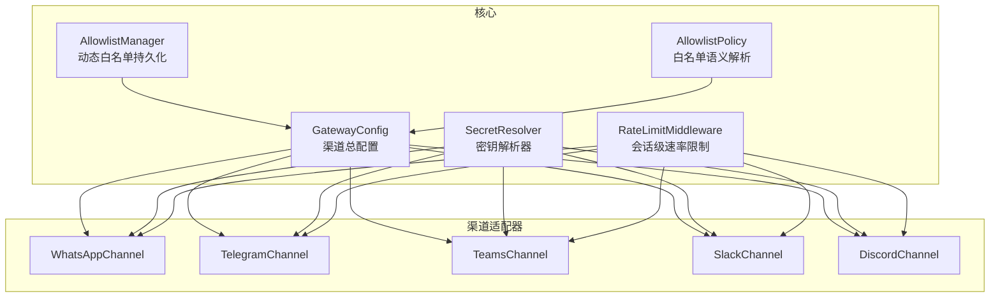
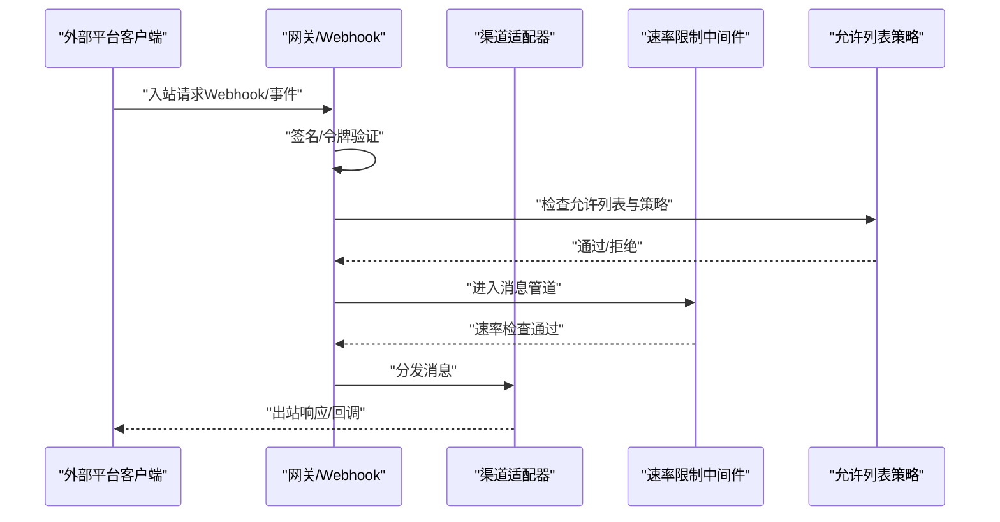
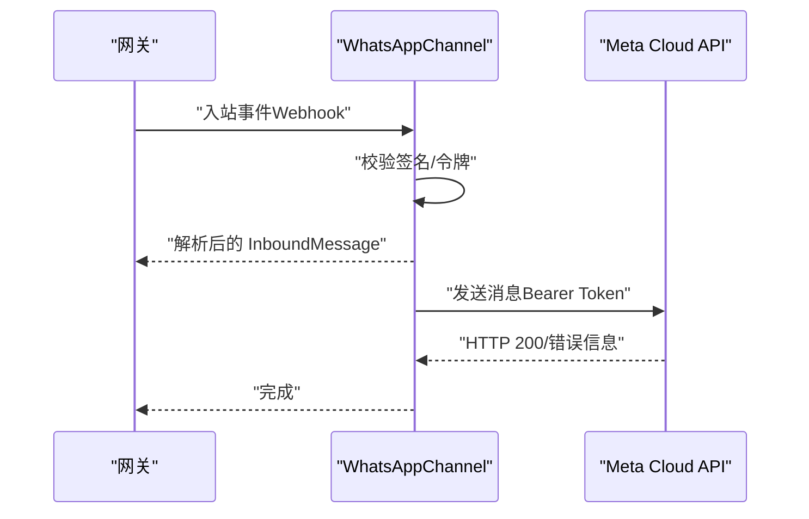
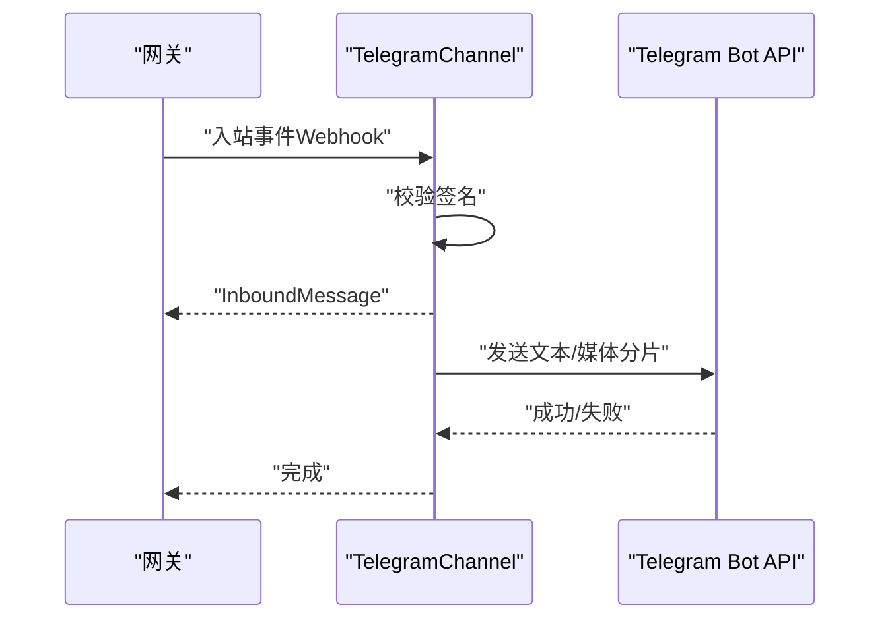
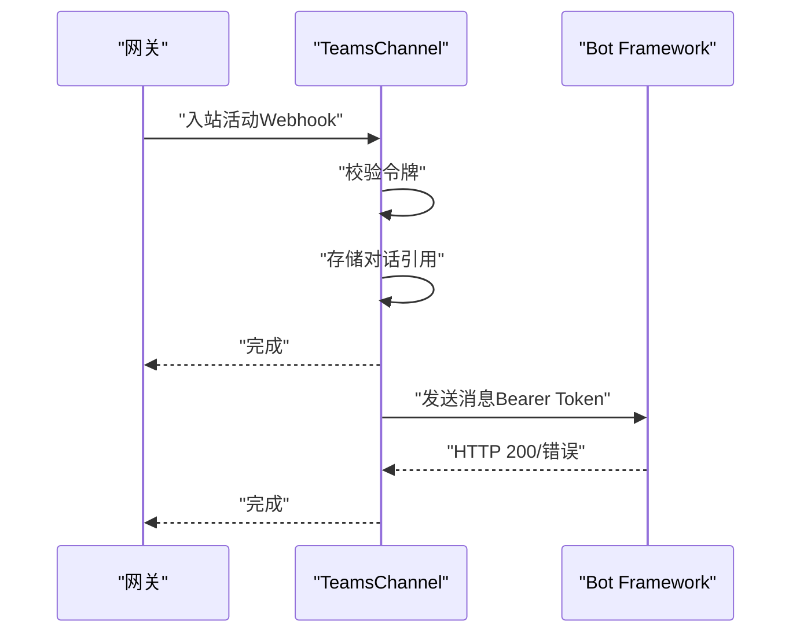
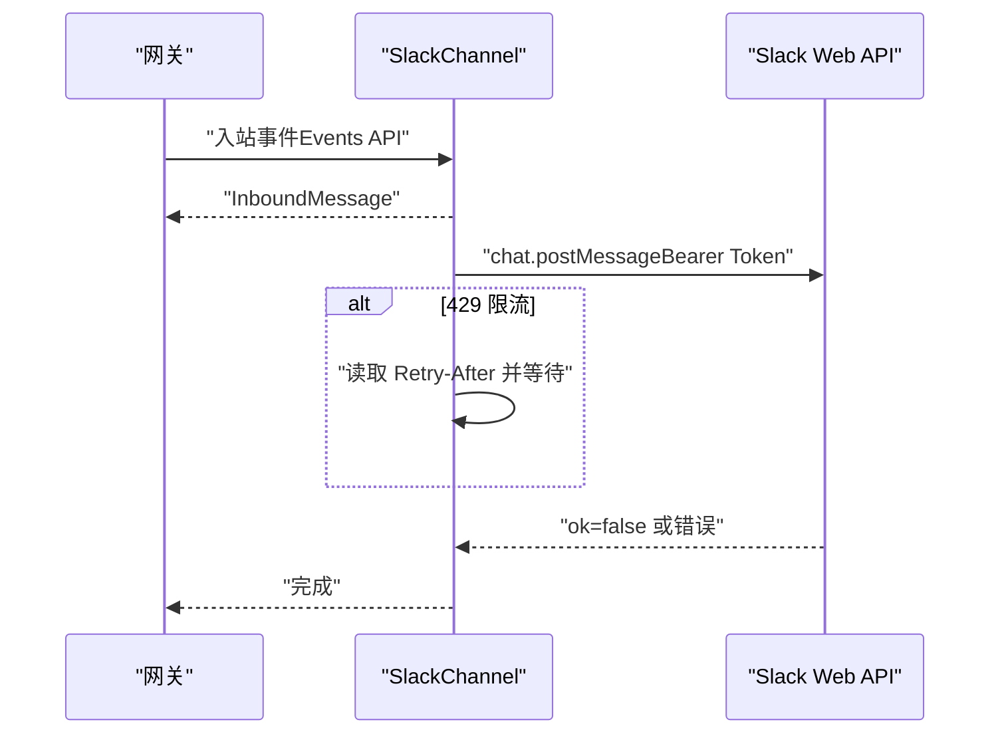
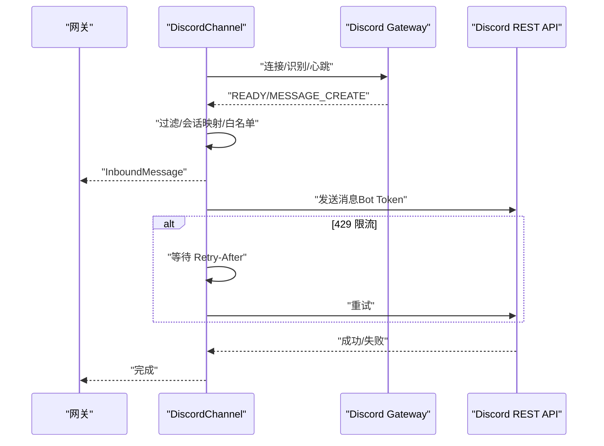
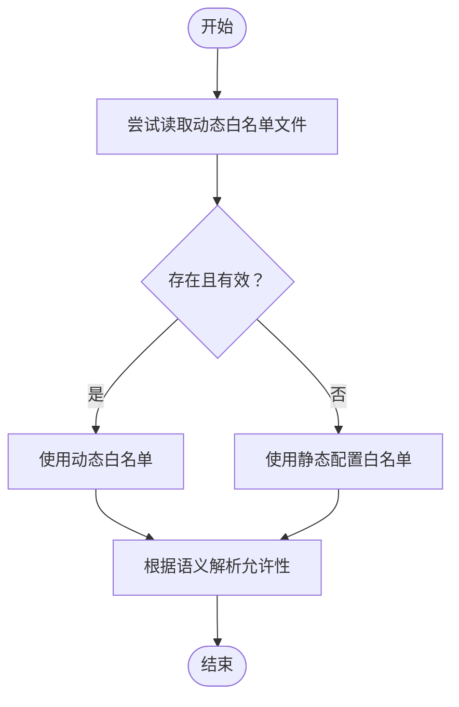
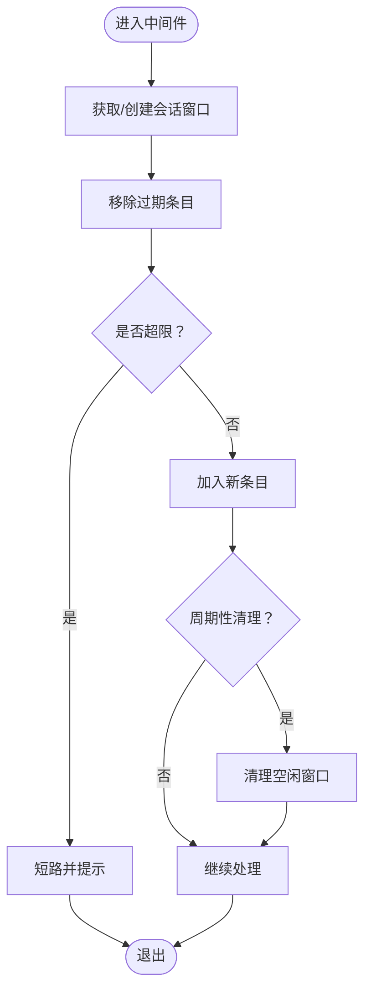
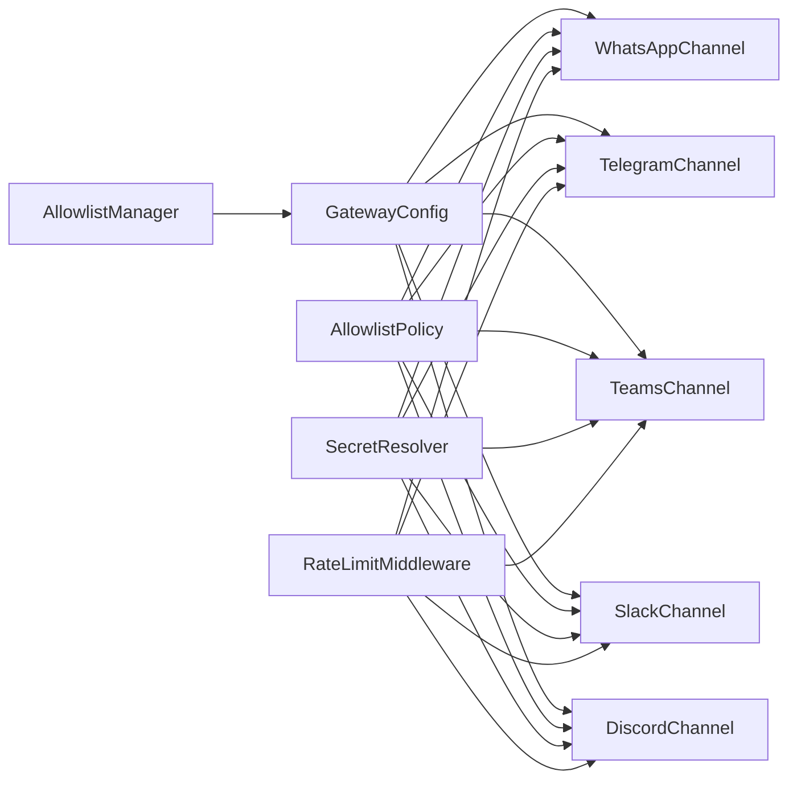

# 渠道配置

<cite>
**本文引用的文件**
- [KingcrabChannelConfigs.cs](file://src/OpenClaw.Core/Models/KingcrabChannelConfigs.cs)
- [GatewayConfig.cs](file://src/OpenClaw.Core/Models/GatewayConfig.cs)
- [AllowlistManager.cs](file://src/OpenClaw.Core/Security/AllowlistManager.cs)
- [AllowlistPolicy.cs](file://src/OpenClaw.Core/Security/AllowlistPolicy.cs)
- [SecretResolver.cs](file://src/OpenClaw.Core/Security/SecretResolver.cs)
- [RateLimitMiddleware.cs](file://src/OpenClaw.Core/Middleware/RateLimitMiddleware.cs)
- [WhatsAppChannel.cs](file://src/OpenClaw.Channels/WhatsAppChannel.cs)
- [TelegramChannel.cs](file://src/OpenClaw.Channels/TelegramChannel.cs)
- [TeamsChannel.cs](file://src/OpenClaw.Channels/TeamsChannel.cs)
- [SlackChannel.cs](file://src/OpenClaw.Channels/SlackChannel.cs)
- [DiscordChannel.cs](file://src/OpenClaw.Channels/DiscordChannel.cs)
</cite>

## 目录
1. [简介](#简介)
2. [项目结构](#项目结构)
3. [核心组件](#核心组件)
4. [架构总览](#架构总览)
5. [详细组件分析](#详细组件分析)
6. [依赖关系分析](#依赖关系分析)
7. [性能考量](#性能考量)
8. [故障排除指南](#故障排除指南)
9. [结论](#结论)
10. [附录](#附录)

## 简介
本技术文档面向“渠道配置系统”，聚焦于以下目标：
- 允许列表语义：支持“传统”和“严格”两种模式，决定空白列表时的行为与通配匹配策略。
- 渠道启用状态与策略：按渠道类型定义 DM/群组策略、白名单、入站长度限制等。
- 各通信渠道的配置要点：包括 API 密钥、Webhook 设置、签名验证与速率限制。
- 策略与中间件：会话级速率限制、令牌管理与签名验证流程。
- 实施建议：集成步骤、排障清单与最佳实践。

## 项目结构
渠道配置系统由“核心模型与安全策略”“渠道适配器”“网关 Webhook 处理”三部分组成：
- 核心模型与安全策略：定义各渠道配置、允许列表语义与解析、密钥解析、速率限制中间件。
- 渠道适配器：封装与各平台（WhatsApp、Telegram、Teams、Slack、Discord）的交互细节（发送、接收、鉴权、限流）。
- 网关 Webhook：负责接收外部平台的入站事件，进行签名验证与路由到对应适配器。

图表来源
- [GatewayConfig.cs:534-772](file://src/OpenClaw.Core/Models/GatewayConfig.cs#L534-L772)
- [AllowlistManager.cs:19-125](file://src/OpenClaw.Core/Security/AllowlistManager.cs#L19-L125)
- [AllowlistPolicy.cs:9-42](file://src/OpenClaw.Core/Security/AllowlistPolicy.cs#L9-L42)
- [SecretResolver.cs:14-65](file://src/OpenClaw.Core/Security/SecretResolver.cs#L14-L65)
- [RateLimitMiddleware.cs:10-92](file://src/OpenClaw.Core/Middleware/RateLimitMiddleware.cs#L10-L92)
- [WhatsAppChannel.cs:14-320](file://src/OpenClaw.Channels/WhatsAppChannel.cs#L14-L320)
- [TelegramChannel.cs:18-338](file://src/OpenClaw.Channels/TelegramChannel.cs#L18-L338)
- [TeamsChannel.cs:21-355](file://src/OpenClaw.Channels/TeamsChannel.cs#L21-L355)
- [SlackChannel.cs:19-184](file://src/OpenClaw.Channels/SlackChannel.cs#L19-L184)
- [DiscordChannel.cs:21-504](file://src/OpenClaw.Channels/DiscordChannel.cs#L21-L504)

章节来源
- [GatewayConfig.cs:534-772](file://src/OpenClaw.Core/Models/GatewayConfig.cs#L534-L772)

## 核心组件
- 允许列表语义与解析
  - 语义：legacy（空即允许，兼容历史行为）；strict（空即拒绝，显式“*”才允许）。
  - 解析：支持通配符匹配，大小写敏感可配置。
- 动态白名单管理
  - 将每个渠道的允许列表持久化到磁盘文件，支持运行时更新与热重载优先级覆盖。
- 密钥解析器
  - 支持 env:VAR、raw:literal、裸变量名回退三种方式，统一从环境变量或明文解析。
- 会话级速率限制中间件
  - 基于时间窗口统计每会话消息频次，超限短路返回提示。

章节来源
- [AllowlistPolicy.cs:9-42](file://src/OpenClaw.Core/Security/AllowlistPolicy.cs#L9-L42)
- [AllowlistManager.cs:19-125](file://src/OpenClaw.Core/Security/AllowlistManager.cs#L19-L125)
- [SecretResolver.cs:14-65](file://src/OpenClaw.Core/Security/SecretResolver.cs#L14-L65)
- [RateLimitMiddleware.cs:10-92](file://src/OpenClaw.Core/Middleware/RateLimitMiddleware.cs#L10-L92)

## 架构总览
下图展示渠道配置如何驱动各适配器与网关 Webhook 的协作：

图表来源
- [GatewayConfig.cs:534-772](file://src/OpenClaw.Core/Models/GatewayConfig.cs#L534-L772)
- [AllowlistPolicy.cs:9-42](file://src/OpenClaw.Core/Security/AllowlistPolicy.cs#L9-L42)
- [RateLimitMiddleware.cs:39-68](file://src/OpenClaw.Core/Middleware/RateLimitMiddleware.cs#L39-L68)

## 详细组件分析

### 渠道配置模型与策略
- 允许列表语义
  - Channels.AllowlistSemantics 控制全局语义：legacy 或 strict。
  - 每个渠道的 AllowedXxxIds 数组配合该语义进行匹配。
- 各渠道策略字段
  - DM/群组策略：open、pairing、closed；群组策略：open、allowlist、disabled。
  - 入站长度限制与请求体大小限制。
  - 签名验证开关与密钥引用（env:/raw:）。
  - 部分渠道支持“@提及”要求、线程回复风格等。

章节来源
- [GatewayConfig.cs:534-772](file://src/OpenClaw.Core/Models/GatewayConfig.cs#L534-L772)
- [AllowlistPolicy.cs:9-42](file://src/OpenClaw.Core/Security/AllowlistPolicy.cs#L9-L42)

### WhatsApp 渠道
- 配置要点
  - Cloud API 类型：CloudApiToken/PhoneNumberId/BusinessAccountId。
  - Webhook：路径、公有基础地址、校验令牌与签名验证开关。
  - 允许列表：AllowedFromIds。
  - 签名验证：X-Hub-Signature-256，需配置 Meta 应用密钥。
- 发送流程
  - 从 OutboundMessage 提取消息标记与剩余文本，构建 JSON 负载，使用 Bearer Token 调用官方 Cloud API。
- 接收流程
  - 由网关 Webhook 接收，进行签名验证后转交适配器处理。

图表来源
- [GatewayConfig.cs:550-594](file://src/OpenClaw.Core/Models/GatewayConfig.cs#L550-L594)
- [WhatsAppChannel.cs:21-83](file://src/OpenClaw.Channels/WhatsAppChannel.cs#L21-L83)

章节来源
- [GatewayConfig.cs:550-594](file://src/OpenClaw.Core/Models/GatewayConfig.cs#L550-L594)
- [WhatsAppChannel.cs:14-320](file://src/OpenClaw.Channels/WhatsAppChannel.cs#L14-L320)

### Telegram 渠道
- 配置要点
  - BotToken/Token 引用、Webhook 路径与公有基础地址。
  - 入站签名验证：X-Telegram-Bot-Api-Secret-Token。
  - 允许列表：AllowedFromUserIds。
- 发送流程
  - 文本自动分片（最大 4096），媒体支持图片/视频/音频/文档/贴纸，带可选标题。
  - 支持回复消息 ID 与标题截断。

图表来源
- [GatewayConfig.cs:713-733](file://src/OpenClaw.Core/Models/GatewayConfig.cs#L713-L733)
- [TelegramChannel.cs:29-189](file://src/OpenClaw.Channels/TelegramChannel.cs#L29-L189)

章节来源
- [GatewayConfig.cs:713-733](file://src/OpenClaw.Core/Models/GatewayConfig.cs#L713-L733)
- [TelegramChannel.cs:18-338](file://src/OpenClaw.Channels/TelegramChannel.cs#L18-L338)

### Teams 渠道
- 配置要点
  - AppId/AppPassword/TenantId 引用；Webhook 路径；令牌验证开关。
  - 群组策略：open/allowlist/disabled；@提及要求可配置。
  - 回复风格：thread/top-level；文本分片模式与长度限制。
- 发送流程
  - 首次需入站消息建立对话引用，后续基于引用发送；OAuth 令牌缓存与刷新。
- 接收流程
  - 由网关 Webhook 接收 Bot Framework 活动，存储对话引用供后续主动消息。

图表来源
- [GatewayConfig.cs:636-686](file://src/OpenClaw.Core/Models/GatewayConfig.cs#L636-L686)
- [TeamsChannel.cs:40-136](file://src/OpenClaw.Channels/TeamsChannel.cs#L40-L136)

章节来源
- [GatewayConfig.cs:636-686](file://src/OpenClaw.Core/Models/GatewayConfig.cs#L636-L686)
- [TeamsChannel.cs:21-355](file://src/OpenClaw.Channels/TeamsChannel.cs#L21-L355)

### Slack 渠道
- 配置要点
  - BotToken/SigningSecret 引用；Webhook 路径与斜杠命令路径。
  - 允许工作区/用户/频道；入站长度限制与请求体大小限制。
  - 签名验证开关。
- 发送流程
  - 将 Markdown 转换为 mrkdwn；处理 429 重试头；校验 API 返回的 ok 字段。

图表来源
- [GatewayConfig.cs:735-751](file://src/OpenClaw.Core/Models/GatewayConfig.cs#L735-L751)
- [SlackChannel.cs:19-115](file://src/OpenClaw.Channels/SlackChannel.cs#L19-L115)

章节来源
- [GatewayConfig.cs:735-751](file://src/OpenClaw.Core/Models/GatewayConfig.cs#L735-L751)
- [SlackChannel.cs:19-184](file://src/OpenClaw.Channels/SlackChannel.cs#L19-L184)

### Discord 渠道
- 配置要点
  - BotToken/ApplicationId/PublicKey 引用；Webhook 路径。
  - 允许服务器/频道/用户；入站长度限制与请求体大小限制。
  - 签名验证开关；可注册斜杠命令。
- 发送流程
  - REST API 发送消息；处理 429 并按 Retry-After 重试。
- 接收流程
  - WebSocket 网关长连接；识别/心跳/恢复；过滤机器人消息；支持线程与 DM 会话映射。

图表来源
- [GatewayConfig.cs:753-772](file://src/OpenClaw.Core/Models/GatewayConfig.cs#L753-L772)
- [DiscordChannel.cs:21-411](file://src/OpenClaw.Channels/DiscordChannel.cs#L21-L411)

章节来源
- [GatewayConfig.cs:753-772](file://src/OpenClaw.Core/Models/GatewayConfig.cs#L753-L772)
- [DiscordChannel.cs:21-504](file://src/OpenClaw.Channels/DiscordChannel.cs#L21-L504)

### 允许列表与动态白名单
- 动态白名单
  - 按渠道 ID 写入 {StoragePath}/allowlists/{channel}.json，运行时可更新。
  - 优先级：动态文件 > 静态配置。
- 语义解析
  - legacy：空数组 = 允许所有；strict：空数组 = 拒绝所有；“*” = 允许所有。
  - 支持通配符匹配与大小写敏感比较。

图表来源
- [AllowlistManager.cs:32-51](file://src/OpenClaw.Core/Security/AllowlistManager.cs#L32-L51)
- [AllowlistPolicy.cs:18-40](file://src/OpenClaw.Core/Security/AllowlistPolicy.cs#L18-L40)

章节来源
- [AllowlistManager.cs:19-125](file://src/OpenClaw.Core/Security/AllowlistManager.cs#L19-L125)
- [AllowlistPolicy.cs:9-42](file://src/OpenClaw.Core/Security/AllowlistPolicy.cs#L9-L42)

### 密钥解析与令牌管理
- SecretResolver
  - 支持 env:VAR、raw:literal、裸变量名回退；记录警告日志提示裸变量回退。
- 令牌管理
  - Teams：OAuth 客户端凭据获取访问令牌，带过期时间缓存与并发锁。
  - Slack/Discord/Telegram/WhatsApp：使用 Bearer/Token 头部传递。

章节来源
- [SecretResolver.cs:14-65](file://src/OpenClaw.Core/Security/SecretResolver.cs#L14-L65)
- [TeamsChannel.cs:138-175](file://src/OpenClaw.Channels/TeamsChannel.cs#L138-L175)

### 速率限制与会话控制
- RateLimitMiddleware
  - 每会话 1 分钟滑动窗口计数；超过阈值短路并提示。
  - 周期性清理空闲窗口；可配置清理频率与空闲 TTL。

图表来源
- [RateLimitMiddleware.cs:39-91](file://src/OpenClaw.Core/Middleware/RateLimitMiddleware.cs#L39-L91)

章节来源
- [RateLimitMiddleware.cs:10-92](file://src/OpenClaw.Core/Middleware/RateLimitMiddleware.cs#L10-L92)

## 依赖关系分析
- 组件耦合
  - 渠道适配器依赖 GatewayConfig 进行策略与限额配置。
  - 允许列表策略与动态管理器被适配器与网关共同使用。
  - 密钥解析器为所有适配器提供统一密钥来源。
  - 速率限制中间件作为通用管道组件插入消息处理链。
- 外部依赖
  - 各平台 API（Meta、Telegram、Microsoft Bot Framework、Slack、Discord）。
  - WebSocket（Discord 网关）。

图表来源
- [GatewayConfig.cs:534-772](file://src/OpenClaw.Core/Models/GatewayConfig.cs#L534-L772)
- [AllowlistPolicy.cs:9-42](file://src/OpenClaw.Core/Security/AllowlistPolicy.cs#L9-L42)
- [AllowlistManager.cs:19-125](file://src/OpenClaw.Core/Security/AllowlistManager.cs#L19-L125)
- [SecretResolver.cs:14-65](file://src/OpenClaw.Core/Security/SecretResolver.cs#L14-L65)
- [RateLimitMiddleware.cs:10-92](file://src/OpenClaw.Core/Middleware/RateLimitMiddleware.cs#L10-L92)
- [WhatsAppChannel.cs:14-320](file://src/OpenClaw.Channels/WhatsAppChannel.cs#L14-L320)
- [TelegramChannel.cs:18-338](file://src/OpenClaw.Channels/TelegramChannel.cs#L18-L338)
- [TeamsChannel.cs:21-355](file://src/OpenClaw.Channels/TeamsChannel.cs#L21-L355)
- [SlackChannel.cs:19-184](file://src/OpenClaw.Channels/SlackChannel.cs#L19-L184)
- [DiscordChannel.cs:21-504](file://src/OpenClaw.Channels/DiscordChannel.cs#L21-L504)

## 性能考量
- 速率限制
  - 合理设置每会话每分钟上限，避免突发流量冲击下游平台。
  - 结合清理频率与空闲 TTL，降低内存占用。
- 分片与限长
  - Telegram/Slack/Teams 等对消息长度有限制，应启用分片策略。
- 缓存与重试
  - Teams 令牌缓存减少鉴权开销；Discord/Slack 对 429 进行退避重试。
- WebSocket 长连接
  - Discord 网关连接具备重连与心跳机制，注意异常退避与资源释放。

## 故障排除指南
- 签名验证失败
  - 确认已正确配置 Webhook 验证令牌与签名密钥（env:/raw:）。
  - 检查平台侧设置与网关路径一致。
- 无法发送消息
  - Teams：确认首次入站建立了对话引用；检查 AppId/AppPassword/TenantId。
  - Slack：关注 429 与 ok=false 错误码；检查权限范围与令牌。
  - Discord：确认 Bot Token 与 ApplicationId；检查意图与权限。
  - Telegram/WhatsApp：确认 BotToken/CloudApiToken 与 PhoneNumberId。
- 白名单拦截
  - 使用动态白名单接口添加允许项；核对语义（legacy/strict）与通配符。
- 速率限制触发
  - 降低发送频率或提升阈值；检查会话维度是否跨会话共享。
- 密钥解析问题
  - 使用 env:VAR 形式；避免使用 raw:literal 在生产环境。

章节来源
- [GatewayConfig.cs:534-772](file://src/OpenClaw.Core/Models/GatewayConfig.cs#L534-L772)
- [SecretResolver.cs:14-65](file://src/OpenClaw.Core/Security/SecretResolver.cs#L14-L65)
- [RateLimitMiddleware.cs:10-92](file://src/OpenClaw.Core/Middleware/RateLimitMiddleware.cs#L10-L92)
- [TeamsChannel.cs:138-175](file://src/OpenClaw.Channels/TeamsChannel.cs#L138-L175)
- [SlackChannel.cs:66-90](file://src/OpenClaw.Channels/SlackChannel.cs#L66-L90)
- [DiscordChannel.cs:92-109](file://src/OpenClaw.Channels/DiscordChannel.cs#L92-L109)
- [TelegramChannel.cs:41-44](file://src/OpenClaw.Channels/TelegramChannel.cs#L41-L44)
- [WhatsAppChannel.cs:27-31](file://src/OpenClaw.Channels/WhatsAppChannel.cs#L27-L31)

## 结论
本渠道配置系统通过统一的配置模型、允许列表语义与动态管理、密钥解析与速率限制中间件，为多平台消息渠道提供了可扩展、可审计、可运维的基础设施。结合各渠道的签名验证、令牌管理与限流策略，可在保证安全性的同时实现高可靠的消息流转。

## 附录
- 配置项速查
  - 允许列表语义：Channels.AllowlistSemantics
  - 各渠道 DM/群组策略：DmPolicy/GroupPolicy
  - 入站长度与请求体限制：MaxInboundChars/MaxRequestBytes
  - 签名验证：ValidateSignature/ValidateToken
  - 密钥引用：XXXRef（env:/raw:）
- 最佳实践
  - 生产环境开启签名验证与令牌验证。
  - 使用 env: 变量管理密钥，避免明文硬编码。
  - 启用动态白名单并定期审计。
  - 为各渠道设置合理的速率限制与分片策略。
  - 对 Discord/Teams 等长连接渠道配置健康检查与重连策略。