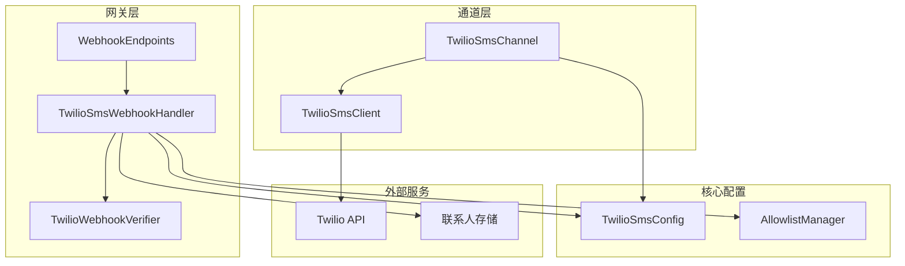
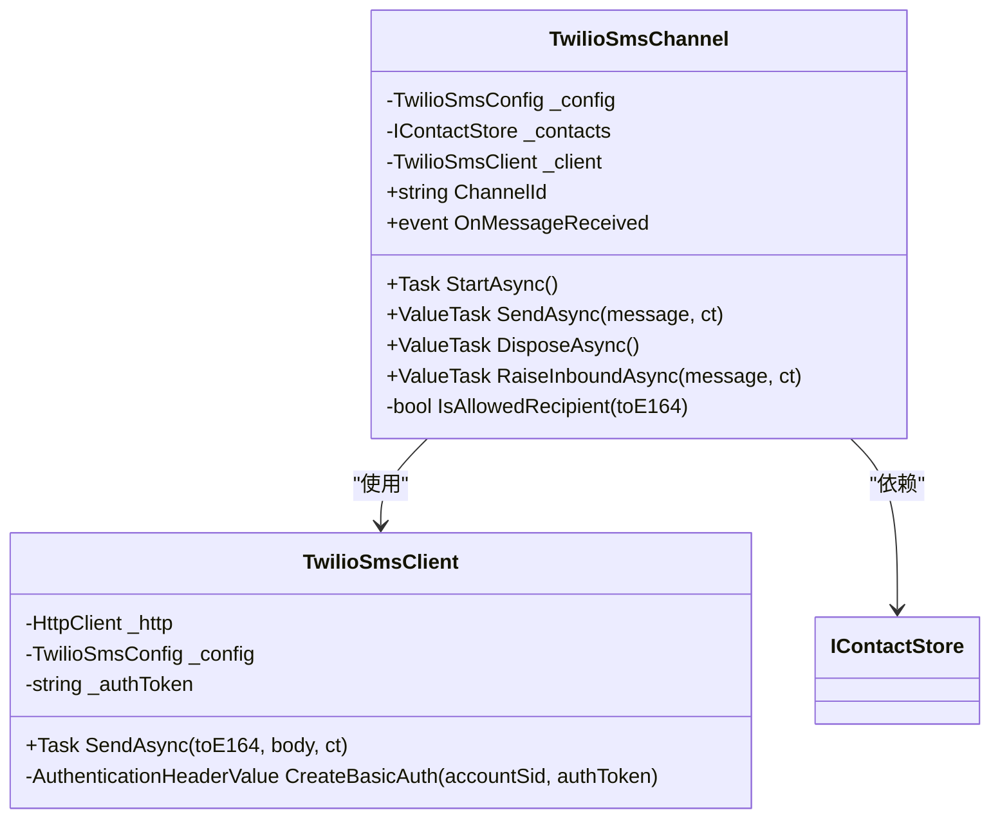
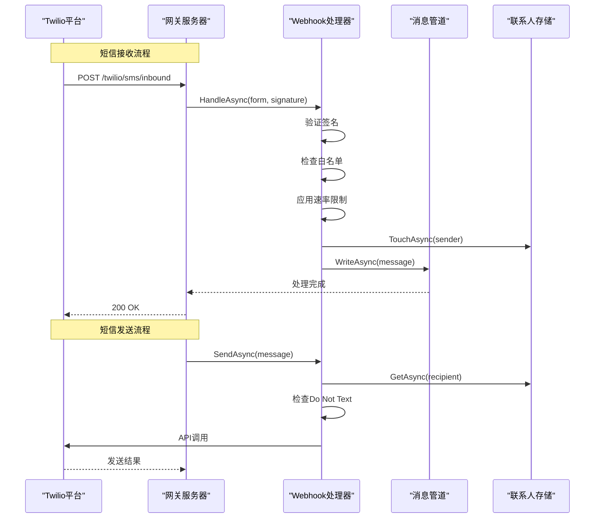
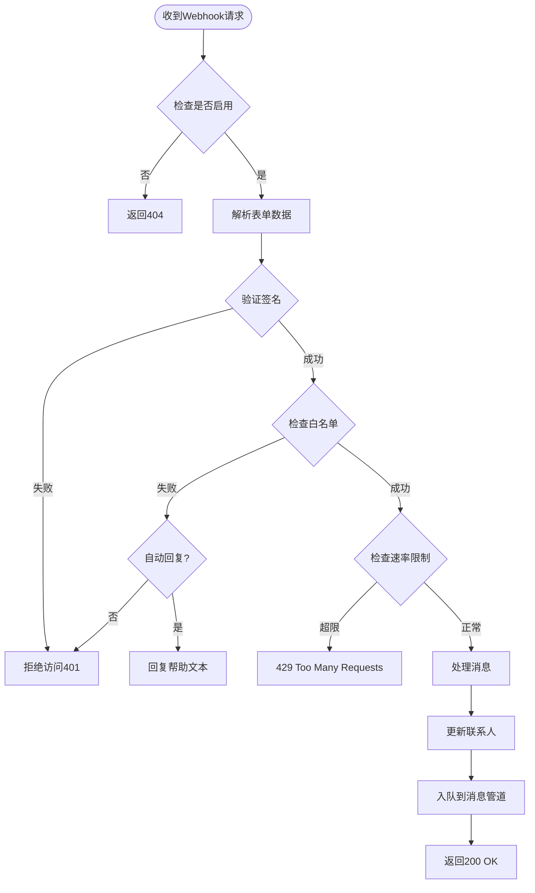
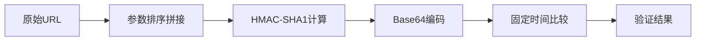
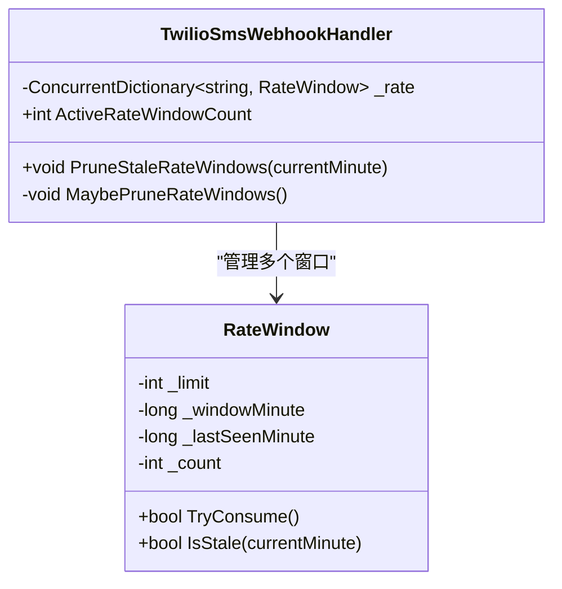
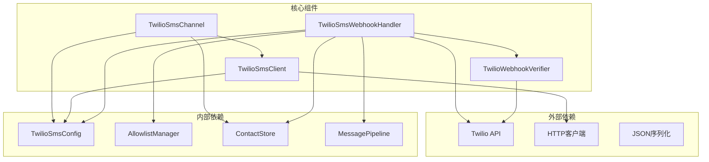

# 短信渠道配置

<cite>
**本文档引用的文件**
- [TwilioSmsChannel.cs](file://src/OpenClaw.Channels/TwilioSmsChannel.cs)
- [TwilioSmsClient.cs](file://src/OpenClaw.Channels/TwilioSmsClient.cs)
- [TwilioSmsWebhookHandler.cs](file://src/OpenClaw.Gateway/TwilioSmsWebhookHandler.cs)
- [TwilioWebhookVerifier.cs](file://src/OpenClaw.Gateway/TwilioWebhookVerifier.cs)
- [WebhookEndpoints.cs](file://src/OpenClaw.Gateway/Endpoints/WebhookEndpoints.cs)
- [TwilioSmsTests.cs](file://src/OpenClaw.Tests/TwilioSmsTests.cs)
- [GatewayConfig.cs](file://src/OpenClaw.Core/Models/GatewayConfig.cs)
- [AllowlistManager.cs](file://src/OpenClaw.Core/Security/AllowlistManager.cs)
- [Program.cs](file://src/OpenClaw.Gateway/Program.cs)
</cite>

## 目录
1. [简介](#简介)
2. [项目结构](#项目结构)
3. [核心组件](#核心组件)
4. [架构概览](#架构概览)
5. [详细组件分析](#详细组件分析)
6. [依赖关系分析](#依赖关系分析)
7. [性能考虑](#性能考虑)
8. [故障排除指南](#故障排除指南)
9. [结论](#结论)
10. [附录](#附录)

## 简介

本文档提供了Kingcrab系统中Twilio SMS短信渠道的完整技术配置指南。该系统实现了企业级的短信通信功能，支持双向消息传递、安全验证、速率限制和用户管理。

系统通过Twilio API实现短信发送和接收，采用现代化的安全架构，包括签名验证、白名单控制和速率限制机制。配置文件采用JSON格式，支持环境变量注入和动态更新。

## 项目结构

短信渠道配置涉及以下关键模块：



**图表来源**
- [TwilioSmsWebhookHandler.cs:9-74](file://src/OpenClaw.Gateway/TwilioSmsWebhookHandler.cs#L9-L74)
- [TwilioSmsChannel.cs:8-19](file://src/OpenClaw.Channels/TwilioSmsChannel.cs#L8-L19)
- [GatewayConfig.cs:694-711](file://src/OpenClaw.Core/Models/GatewayConfig.cs#L694-L711)

**章节来源**
- [Program.cs:47-98](file://src/OpenClaw.Gateway/Program.cs#L47-L98)
- [GatewayConfig.cs:688-711](file://src/OpenClaw.Core/Models/GatewayConfig.cs#L688-L711)

## 核心组件

### TwilioSmsConfig 配置模型

Twilio短信配置是整个系统的配置核心，包含以下关键参数：

| 参数名称 | 类型 | 默认值 | 描述 |
|---------|------|--------|------|
| Enabled | bool | false | 是否启用Twilio短信功能 |
| AccountSid | string | null | Twilio账户SID，必需参数 |
| AuthTokenRef | string | null | 认证令牌引用，支持环境变量 |
| MessagingServiceSid | string | null | 消息服务SID，优先于FromNumber |
| FromNumber | string | null | 发送号码，当未配置MessagingServiceSid时使用 |
| WebhookPath | string | "/twilio/sms/inbound" | Webhook路径 |
| WebhookPublicBaseUrl | string | null | 公共基础URL，用于签名验证 |
| ValidateSignature | bool | true | 是否验证Twilio签名 |
| AllowedFromNumbers | string[] | [] | 允许的发送方号码列表 |
| AllowedToNumbers | string[] | [] | 允许的目标号码列表 |
| MaxInboundChars | int | 2000 | 入站消息最大字符数 |
| MaxRequestBytes | int | 64*1024 | 请求体最大字节数 |
| RateLimitPerFromPerMinute | int | 30 | 每分钟每发送方的速率限制 |
| AutoReplyForBlocked | bool | false | 对被阻止号码自动回复 |
| HelpText | string | "OpenClaw: reply STOP to opt out." | 帮助文本 |

**章节来源**
- [GatewayConfig.cs:694-711](file://src/OpenClaw.Core/Models/GatewayConfig.cs#L694-L711)

### TwilioSmsChannel 通道适配器

通道适配器负责处理短信的发送操作，实现IChannelAdapter接口：



**图表来源**
- [TwilioSmsChannel.cs:8-59](file://src/OpenClaw.Channels/TwilioSmsChannel.cs#L8-L59)
- [TwilioSmsClient.cs:7-62](file://src/OpenClaw.Channels/TwilioSmsClient.cs#L7-L62)

**章节来源**
- [TwilioSmsChannel.cs:14-42](file://src/OpenClaw.Channels/TwilioSmsChannel.cs#L14-L42)

## 架构概览

短信渠道采用分层架构设计，确保了功能的模块化和可维护性：



**图表来源**
- [WebhookEndpoints.cs:23-102](file://src/OpenClaw.Gateway/Endpoints/WebhookEndpoints.cs#L23-L102)
- [TwilioSmsWebhookHandler.cs:86-162](file://src/OpenClaw.Gateway/TwilioSmsWebhookHandler.cs#L86-L162)

## 详细组件分析

### Webhook端点配置

Webhook端点负责处理来自Twilio的入站短信请求：



**图表来源**
- [TwilioSmsWebhookHandler.cs:86-162](file://src/OpenClaw.Gateway/TwilioSmsWebhookHandler.cs#L86-L162)
- [WebhookEndpoints.cs:23-102](file://src/OpenClaw.Gateway/Endpoints/WebhookEndpoints.cs#L23-L102)

### 安全验证机制

系统实现了多层安全验证：

#### 签名验证


**图表来源**
- [TwilioWebhookVerifier.cs:8-37](file://src/OpenClaw.Gateway/TwilioWebhookVerifier.cs#L8-L37)

#### 白名单管理
系统支持静态配置和动态更新两种白名单模式：

**章节来源**
- [TwilioSmsWebhookHandler.cs:164-200](file://src/OpenClaw.Gateway/TwilioSmsWebhookHandler.cs#L164-L200)
- [AllowlistManager.cs:32-51](file://src/OpenClaw.Core/Security/AllowlistManager.cs#L32-L51)

### 速率限制实现

系统采用基于时间窗口的速率限制算法：



**图表来源**
- [TwilioSmsWebhookHandler.cs:22-56](file://src/OpenClaw.Gateway/TwilioSmsWebhookHandler.cs#L22-L56)
- [TwilioSmsWebhookHandler.cs:211-226](file://src/OpenClaw.Gateway/TwilioSmsWebhookHandler.cs#L211-L226)

**章节来源**
- [TwilioSmsWebhookHandler.cs:125-128](file://src/OpenClaw.Gateway/TwilioSmsWebhookHandler.cs#L125-L128)

### 用户体验配置

系统提供了完整的用户体验管理功能：

#### 自动回复阻止号码
当配置AutoReplyForBlocked=true时，系统会自动回复帮助文本给被阻止的号码。

#### 帮助文本管理
系统支持自定义帮助文本，用户可以通过发送特定关键词触发相应响应。

#### 关键词处理
系统识别以下关键词：
- **STOP/UNSUBSCRIBE/CANCEL/END/QUIT**: 注销订阅
- **START/YES/UNSTOP**: 重新激活订阅  
- **HELP/INFO**: 显示帮助文本

**章节来源**
- [TwilioSmsWebhookHandler.cs:135-150](file://src/OpenClaw.Gateway/TwilioSmsWebhookHandler.cs#L135-L150)
- [TwilioSmsTests.cs:205-239](file://src/OpenClaw.Tests/TwilioSmsTests.cs#L205-L239)

## 依赖关系分析



**图表来源**
- [TwilioSmsChannel.cs:10-19](file://src/OpenClaw.Channels/TwilioSmsChannel.cs#L10-L19)
- [TwilioSmsWebhookHandler.cs:13-74](file://src/OpenClaw.Gateway/TwilioSmsWebhookHandler.cs#L13-L74)

**章节来源**
- [TwilioSmsClient.cs:13-18](file://src/OpenClaw.Channels/TwilioSmsClient.cs#L13-L18)
- [TwilioWebhookVerifier.cs:6-37](file://src/OpenClaw.Gateway/TwilioWebhookVerifier.cs#L6-L37)

## 性能考虑

### 并发处理
- 使用ConcurrentDictionary管理速率限制窗口
- 异步HTTP请求处理
- 基于内存的缓存机制

### 内存优化
- 定期清理过期的速率限制窗口
- 最大请求大小限制防止内存溢出
- 连接池复用HTTP连接

### 可扩展性
- 支持动态白名单更新
- 可配置的速率限制参数
- 模块化的配置系统

## 故障排除指南

### 常见问题及解决方案

#### 1. 签名验证失败
**症状**: 返回401状态码
**原因**: 
- WebhookPublicBaseUrl未正确配置
- 认证令牌不匹配
- 请求参数被篡改

**解决方法**:
- 确保WebhookPublicBaseUrl与Twilio配置一致
- 验证AuthTokenRef指向正确的环境变量
- 检查网络代理是否修改了请求头

#### 2. 白名单拒绝
**症状**: 返回401状态码
**原因**:
- 发送方不在AllowedFromNumbers列表中
- 接收方不在AllowedToNumbers列表中
- 动态白名单文件配置错误

**解决方法**:
- 添加正确的E.164格式号码到白名单
- 检查动态白名单文件格式
- 验证AllowlistSemantics配置

#### 3. 速率限制超限
**症状**: 返回429状态码
**原因**: 单个发送方超过配置的速率限制

**解决方法**:
- 增加RateLimitPerFromPerMinute值
- 实现客户端重试逻辑
- 分散发送负载

#### 4. 短信发送失败
**症状**: 发送异常或返回错误
**原因**:
- AccountSid或AuthToken缺失
- MessagingServiceSid或FromNumber配置错误
- 目标号码格式不正确

**解决方法**:
- 验证Twilio账户配置
- 检查号码格式符合E.164标准
- 确认号码在Twilio账户中有效

**章节来源**
- [TwilioSmsWebhookHandler.cs:107-114](file://src/OpenClaw.Gateway/TwilioSmsWebhookHandler.cs#L107-L114)
- [TwilioSmsClient.cs:22-26](file://src/OpenClaw.Channels/TwilioSmsClient.cs#L22-L26)

## 结论

Kingcrab的Twilio短信渠道配置提供了一个完整、安全且高性能的短信通信解决方案。系统通过精心设计的架构实现了以下关键特性：

1. **安全性**: 多层验证机制确保通信安全
2. **可靠性**: 完善的错误处理和重试机制
3. **可扩展性**: 模块化设计支持功能扩展
4. **易用性**: 简洁的配置接口和丰富的默认设置

通过合理配置这些参数，可以构建一个稳定可靠的短信通信系统，满足企业级应用的需求。

## 附录

### 配置示例

#### 基础配置
```json
{
  "Channels": {
    "Sms": {
      "Twilio": {
        "Enabled": true,
        "AccountSid": "ACXXXXXXXXXXXXXXXXXXXXXXXXXXXXXXXX",
        "AuthTokenRef": "env:TWILIO_AUTH_TOKEN",
        "WebhookPath": "/twilio/sms/inbound",
        "WebhookPublicBaseUrl": "https://your-domain.com",
        "ValidateSignature": true,
        "AllowedFromNumbers": ["+15551234567"],
        "AllowedToNumbers": ["+15557654321"]
      }
    }
  }
}
```

#### 高级配置
```json
{
  "Channels": {
    "Sms": {
      "Twilio": {
        "Enabled": true,
        "AccountSid": "ACXXXXXXXXXXXXXXXXXXXXXXXXXXXXXXXX",
        "AuthTokenRef": "env:TWILIO_AUTH_TOKEN",
        "MessagingServiceSid": "MGXXXXXXXXXXXXXXXXXXXXXXXXXXXXXXXX",
        "WebhookPath": "/twilio/sms/inbound",
        "WebhookPublicBaseUrl": "https://your-domain.com",
        "ValidateSignature": true,
        "AllowedFromNumbers": ["+15551234567", "*"],
        "AllowedToNumbers": ["+15557654321"],
        "MaxInboundChars": 2000,
        "MaxRequestBytes": 65536,
        "RateLimitPerFromPerMinute": 60,
        "AutoReplyForBlocked": true,
        "HelpText": "回复HELP查看帮助，回复STOP退订"
      }
    }
  }
}
```

### 测试方法

#### 单元测试覆盖
系统包含全面的单元测试，涵盖以下场景：
- 签名验证测试
- 白名单控制测试  
- 速率限制测试
- 关键词处理测试
- 出站消息发送测试

#### 集成测试建议
- 使用Twilio测试号码进行端到端测试
- 验证Webhook回调的正确性
- 测试错误情况下的降级行为
- 验证配置热重载功能

**章节来源**
- [TwilioSmsTests.cs:17-63](file://src/OpenClaw.Tests/TwilioSmsTests.cs#L17-L63)
- [TwilioSmsTests.cs:125-155](file://src/OpenClaw.Tests/TwilioSmsTests.cs#L125-L155)